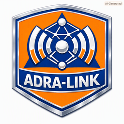
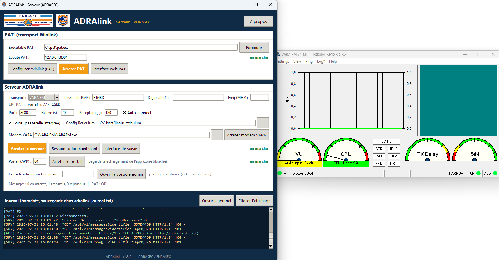
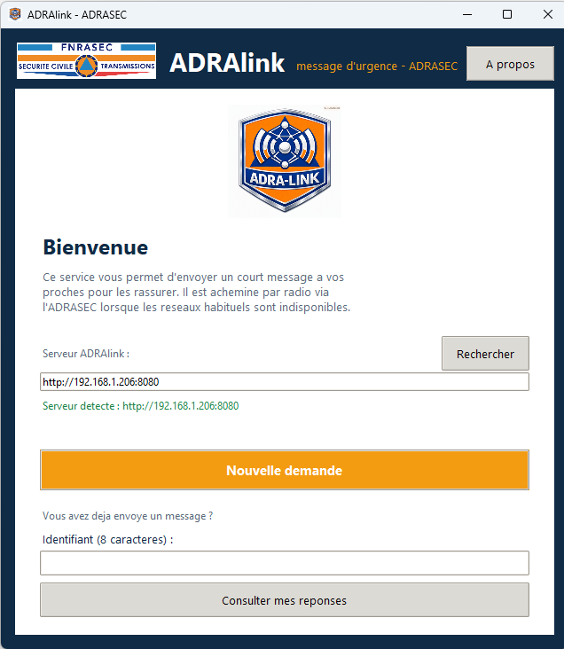
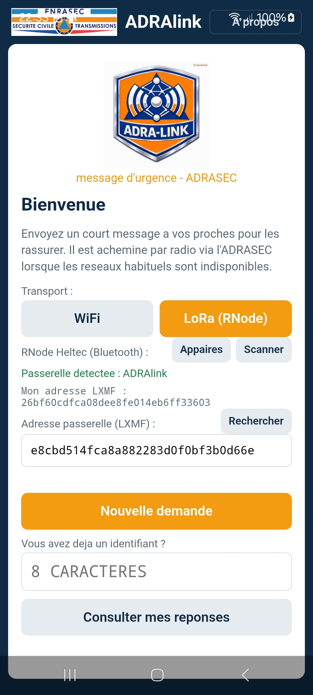
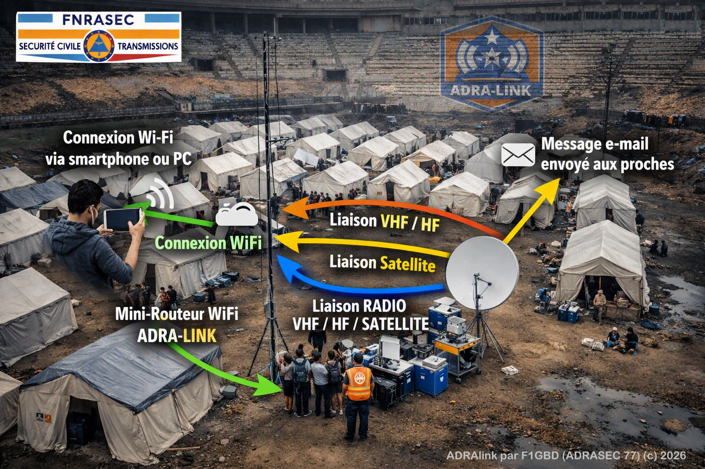
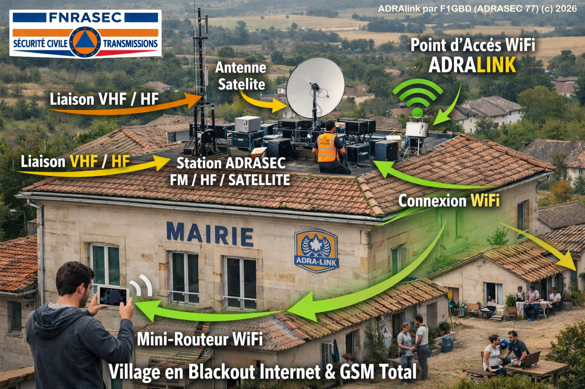
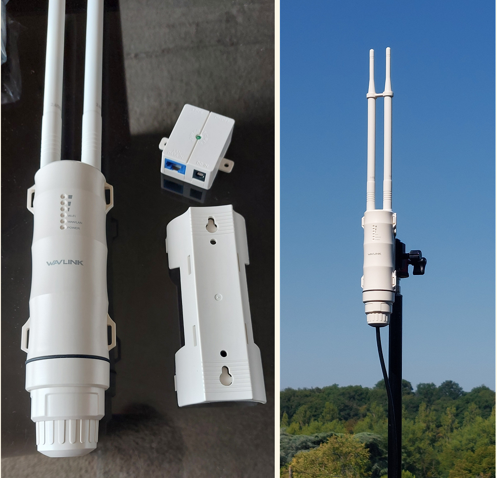
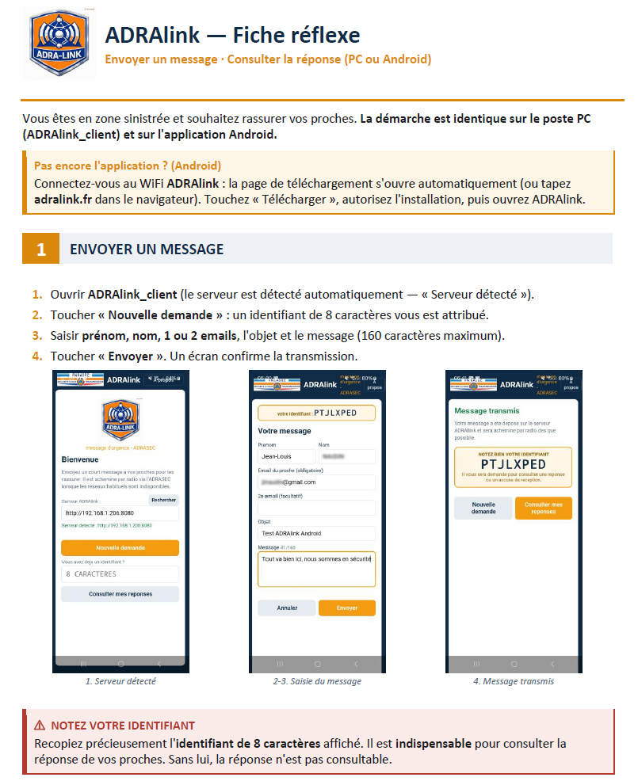
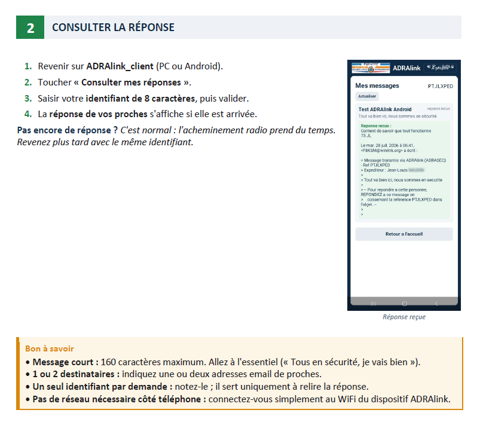

<p align="center">
  <br>
  
</p>

# ADRAlink — message d'urgence par radio (Winlink / ADRASEC)

**ADRAlink** est un dispositif proposé par l'**ADRASEC** permettant à une personne
**sinistrée** d'envoyer un court message email à ses proches pour les rassurer,
lorsque les réseaux habituels (Internet, téléphonie) sont **indisponibles**
(blackout, catastrophe naturelle, zone blanche).

Le sinistré se connecte en **WiFi** au dispositif via un mini-routeur, obtient un
**identifiant unique** de 8 caractères, saisit un message (≤ 160 caractères) pour
1 ou 2 proches, et pourra consulter la réponse plus tard avec son identifiant.
Le message est acheminé **par radio via Winlink** (PAT), en **telnet CMS**
(Internet de secours) ou en **VARA FM / VARA HF / ARDOP** (liaison radio).

Depuis la **v1.3**, une station opérateur ADRASEC hors de portée du WiFi peut
aussi joindre le serveur **par radio LoRa** (Reticulum / LXMF) — voir la section
[Transport LoRa / LXMF](#transport-lora--lxmf-zones-blanches-v13).

> Ces informations sont publiées en Open Source ([licence GNU v3.0](https://github.com/f1gbd/F1GBD/blob/master/LICENSE.txt))
> pour un usage personnel uniquement, non professionnel et non commercial.

---

## Aperçu

| Serveur (opérateur ADRASEC) | Client Windows (sinistré) | Client Android (sinistré) |
|:---:|:---:|:---:|
| <br> | <br> | <br> |





> Un manuel complet (fiche technique + installation + utilisation) est disponible :
> [documentations/ADRAlink_Manuel.docx](documentations/ADRAlink_Manuel.docx).

---

## Architecture

```
┌────────────────────┐   REST/JSON    ┌───────────────────────┐   HTTP    ┌──────────┐
│  Client ADRAlink   │ ───WiFi──▶    │   ADRAlink-serveur    │ ───────▶ │   PAT     │ ──▶ Radio
│  Windows / Android │   (découverte  │  (identifiants, valid.│  API PAT  │(Winlink) │     Winlink
│      (sinistré)    │    auto UDP)   │   compo, relève)      │           └──────────┘   telnet / VARA
└────────────────────┘                └───────────────────────┘
```

- Le **client** ne contient **aucune** logique radio : il ne fait qu'un formulaire
  qui parle au serveur en REST. Il **découvre automatiquement** le serveur sur le
  réseau local (diffusion UDP) — l'utilisateur n'a pas à connaître son adresse IP.
- Le **serveur** génère les identifiants uniques, valide la saisie, compose le
  message Winlink (référence `[ADRAlink XXXXXXXX]` pour rattacher les réponses),
  pilote **PAT** pour l'envoi et la relève, et journalise tout (fichier horodaté).
- **PAT** (client Winlink) assure le transport vers Winlink : telnet CMS ou modem
  radio (VARA FM/HF, ARDOP). Le serveur ne réinvente pas la partie radio.

> **Depuis la v1.3**, le **client PC** peut aussi joindre le serveur par **LoRa
> (Reticulum / LXMF)** au lieu du WiFi — pour une station opérateur en zone
> blanche, hors de portée du point d'accès. Le serveur embarque alors une
> passerelle LoRa/LXMF (WiFi **et** LoRa gérés dans un seul processus).

| Serveur ADRAlink VARA FM (ADRASEC) | Mini-Routeur Wifi GL-MT3600BE |
|:---:|:---:|
| <br> | <br> |

**Exemple de Station ADRASEC serveur ADRAlink pour Zone Blanche:**
- Station ADRASEC Serveur ADRAlink VHF: Transceiver Yaesu FTM300DE + Interface Signalink
- Antenne VHF/UHF
- Liaison OK vers un RMS Winlink VARA FM en direct ou via un Digipeater
- Mini-Routeur Wifi GLnet GL-MT3600BE
- ADRALINK + VARA FM (installé et Licence VARA OK)

<p align="center">
  <br>
</p>

---

## Transport LoRa / LXMF (zones blanches, v1.3)

En complément du WiFi, ADRAlink peut acheminer les demandes **par radio LoRa**
via [Reticulum](https://reticulum.network/) / LXMF, pour les stations hors de
portée du point d'accès WiFi.

- **Client PC** : sélecteur de transport à l'accueil — « WiFi / réseau » **ou**
  « LoRa (passerelle) ». En LoRa, il attaque un **RNode** (module LoRa) via
  Reticulum et joint la passerelle du serveur ; les écrans sont identiques dans
  les deux modes.
- **Serveur** : **passerelle LoRa/LXMF intégrée** — WiFi (HTTP) et LoRa dans un
  seul processus. Si LXMF est indisponible, le serveur tourne en WiFi seul.
- **Client Android (APK) et client web** : **WiFi uniquement** (le LoRa nécessite
  un RNode et n'est disponible que sur le client PC).
- **Versions obligatoires** : RNS **1.0.4** (build « mod F1GBD ») + **LXMF 0.9.3**
  (LXMF ≥ 0.9.5 casse l'assemblage des messages avec RNS 1.0.x).

> **Note Raspberry Pi** : le serveur ADRAlink tourne parfaitement sur Pi en
> **WiFi + LoRa** avec backhaul Winlink en **telnet** (Internet). Le modem
> **VARA** (radio) reste sur un poste **x86 natif** : l'émulation d'un modem DSP
> temps réel (Wine/BOX64) sur Pi n'est pas fiable.

---

## Les trois applications

| Application | Rôle |
|---|---|
| **ADRAlink_serveur** | Console opérateur ADRASEC : pilote PAT, le modem VARA FM, la passerelle LoRa/LXMF et le serveur ADRAlink interne (compose les messages, relève les réponses, journal horodaté). |
| **ADRAlink_client** | Interface de saisie pour le sinistré / l'opérateur (poste Windows). Connexion **WiFi ou LoRa (RNode/Reticulum)**. |
| **ADRAlink client Android** | Même interface pour smartphone (formulaire + découverte auto du serveur). Connexion **WiFi**. |

---

## Téléchargement

Dernière version : **v1.3.1** (https://github.com/f1gbd/F1GBD/releases/download/adralink-v1.3.1/ADRAlink.7z).

- 💻 **Windows (exe, sans source)** — archive `ADRAlink.7z` (contient
  `ADRAlink_serveur.exe` + `ADRAlink_client.exe`) :
  [**ADRAlink.7z**](https://github.com/f1gbd/F1GBD/releases/download/adralink-v1.3.1/ADRAlink.7z)
- 📱 **Android (APK)** :
  [**ADRAlink_client.apk**](https://github.com/f1gbd/F1GBD/releases/download/adralink-v1.3.1/ADRAlink_client.apk)

Décompressez `ADRAlink.7z`, placez **les deux exe dans le même dossier** et lancez
`ADRAlink_serveur.exe`. Les exécutables sont autonomes (icône et logos embarqués).
PAT (`C:\pat\pat.exe`) et le modem **VARA** (FM / HF / SAT) restent des logiciels
tiers à installer séparément. Pour l'APK : autorisez les « sources inconnues ».

---

## Mise en route rapide

1. Sur le PC ADRASEC : lancer **ADRAlink_serveur**, cliquer **« Lancer PAT »**
   (après l'avoir configuré une fois via *Configurer Winlink*), choisir le
   transport (**Telnet** pour débuter, **VARA FM** en radio), puis
   **« Démarrer le serveur »**.
2. Sur le poste ou le téléphone du sinistré : ouvrir **ADRAlink_client** —
   le serveur est détecté automatiquement — puis **« Nouvelle demande »**,
   saisir le message et l'envoyer. (Un poste opérateur hors WiFi peut choisir
   le transport **LoRa** et viser la passerelle du serveur.)
3. Le sinistré **note son identifiant** ; il pourra consulter la réponse de ses
   proches en le saisissant dans **« Consulter mes réponses »**.


---

## Portail de téléchargement (zone blanche)

Pour que le sinistré installe l'application Android **sans Internet**, la console
`ADRAlink_serveur` intègre un **portail de téléchargement** : bouton
**« Lancer le portail »**. Le sinistré, connecté au WiFi du dispositif, ouvre une
page simple (adresse `http://adralink.fr` ou **portail captif** qui s'ouvre tout
seul) et **télécharge l'APK**. Placez `ADRAlink_client.apk` à côté de
`ADRAlink_serveur.exe` pour qu'il soit proposé.

**Client web (sans rien installer).** Depuis un PC, une tablette ou un iPhone,
le sinistré peut aussi **écrire et lire ses messages directement dans le
navigateur** : la page du portail propose un bouton **« Utiliser dans le
navigateur »** (`http://adralink.fr/app`). Le client web est servi par le
serveur ADRAlink et relayé par le portail (aucun port à saisir, aucune
installation).




Configuration du routeur (nom `adralink.fr`, portail captif, variante hébergée
sur le routeur) : [documentations/PORTAL_SETUP.md](documentations/PORTAL_SETUP.md).

---

## Crédits

Développement et portage : **F1GBD — ADRASEC 77 / FNRASEC**.

Basé sur **[PAT](https://github.com/la5nta/pat)** (client Winlink open source,
LA5NTA) pour le transport radio Winlink, et sur **[Reticulum / LXMF](https://reticulum.network/)**
pour le transport LoRa.

*ADRAlink v1.3.1 — © 2026 F1GBD / ADRASEC 77. Licence GNU GPL v3.0.*
