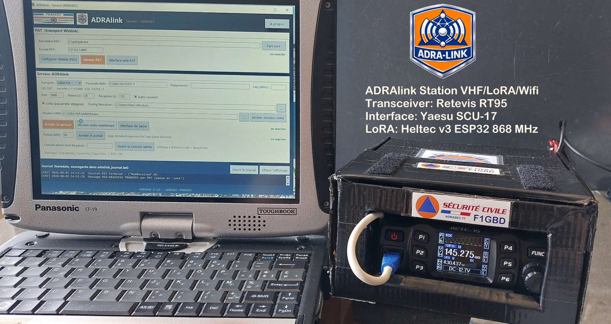
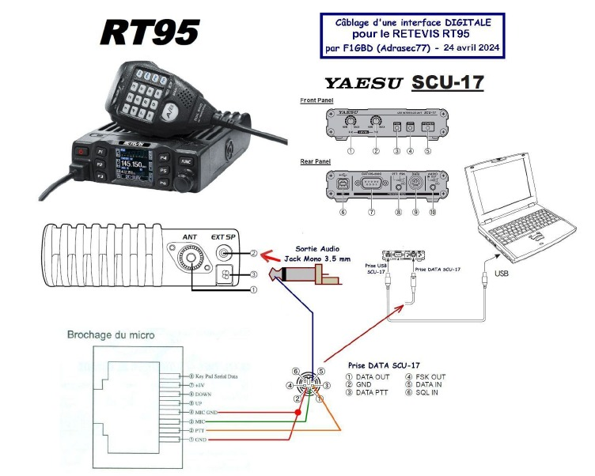
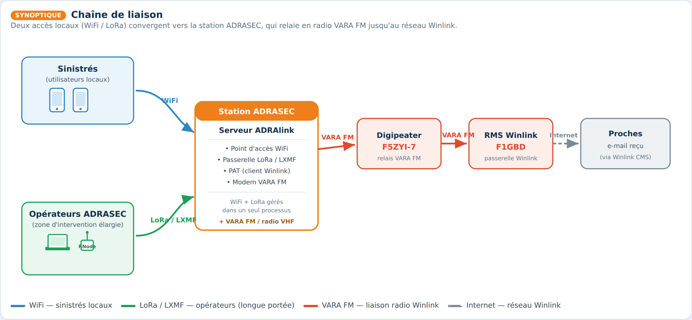
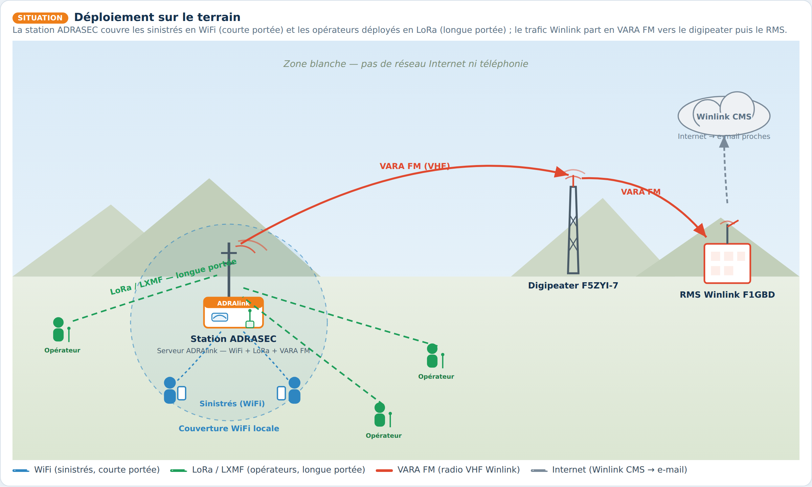

<p align="center">
  <br>
  
</p>

# ADRAlink — message d'urgence par radio (Winlink / ADRASEC)

**ADRAlink** est un dispositif proposé par l'**ADRASEC** permettant à une personne
**sinistrée** d'envoyer un court message email à ses proches pour les rassurer,
lorsque les réseaux habituels (Internet, téléphonie) sont **indisponibles**
(blackout, catastrophe naturelle, zone blanche).

Le sinistré se connecte en **WiFi** au dispositif via un mini-routeur, obtient un
**identifiant unique** de 8 caractères, saisit un message (≤ 160 caractères) pour
1 ou 2 proches, et pourra consulter la réponse plus tard avec son identifiant.
Le message est acheminé **par radio via Winlink** (PAT), en **telnet CMS**
(Internet de secours) ou en **VARA FM / VARA HF / ARDOP** (liaison radio).

Depuis la **v1.3**, une station opérateur ADRASEC hors de portée du WiFi peut
aussi joindre le serveur **par radio LoRa** (Reticulum / LXMF) — aussi bien depuis
le **client Windows** que depuis l'**APK Android** (RNode Heltec connecté en
**Bluetooth**) — voir la section
[Transport LoRa / LXMF](#transport-lora--lxmf-zones-blanches-v13).

> **Nouveau en v1.4.2 :** **fiabilité de la messagerie LoRa** — la réponse email
> est **nettoyée avant l'envoi** (retrait de l'original cité, trop volumineux pour
> une trame LoRa), **relecture ciblée d'un ancien message** (`LIRE <identifiant>`),
> et **clôture automatique d'un identifiant après livraison** de sa réponse (fin de
> la surcharge du serveur par des relèves répétées). Plus un **arrêt propre** du
> serveur (PAT toujours refermé). Côté client **T-Deck rsDeck (firmware 2.0.3)** :
> **champ identifiant modifiable** (relire un ancien message), **journal effaçable**
> et **retour visuel** des envois/réponses.
>

> **Nouveau en v1.4.1 :** **réglages LoRa RF éditables** (fréquence / BW / SF / CR)
> avec presets **« Standard France »** et **« Haut débit »** — dans la Config LoRa
> du serveur **et** via un bouton engrenage ⚙ sur le client PC et l'APK Android —
> plus un outil de **maintenance de la base locale** côté serveur (sauvegarde /
> purge / RAZ).
>
> **Depuis la v1.4.0 :** le serveur **flashe le firmware RNode directement en
> zone blanche**, sans Internet, sur un **Heltec LoRa32 V3 ou V4** par simple câble
> USB (bouton **Firmware**), et **programme la config LoRa en un clic** (bouton
> **Config LoRa**). Voir
> [Flashage de firmware & config LoRa](#flashage-de-firmware-rnode--config-lora-off-grid-v140).

> Ces informations sont publiées en Open Source ([licence GNU v3.0](https://github.com/f1gbd/F1GBD/blob/master/LICENSE.txt))
> pour un usage personnel uniquement, non professionnel et non commercial.

---

## Aperçu

| Serveur (opérateur ADRASEC) | Client Windows (sinistré) | Client Android (sinistré) |
|:---:|:---:|:---:|
| <br> | <br> | <br> |


> Un manuel complet (fiche technique + installation + utilisation) est disponible :
> [documentations/ADRAlink_Manuel.pdf](documentations/ADRAlink_Manuel.pdf).

---

## Architecture

```
┌────────────────────┐   REST/JSON    ┌───────────────────────┐   HTTP    ┌──────────┐
│  Client ADRAlink   │ ───WiFi──▶    │   ADRAlink-serveur    │ ───────▶ │   PAT     │ ──▶ Radio
│  Windows / Android │   (découverte  │  (identifiants, valid.│  API PAT  │(Winlink) │     Winlink
│      (sinistré)    │    auto UDP)   │   compo, relève)      │           └──────────┘   telnet / VARA
└────────────────────┘                └───────────────────────┘
```

- Le **client** ne contient **aucune** logique radio : il ne fait qu'un formulaire
  qui parle au serveur en REST. Il **découvre automatiquement** le serveur sur le
  réseau local (diffusion UDP) — l'utilisateur n'a pas à connaître son adresse IP.
- Le **serveur** génère les identifiants uniques, valide la saisie, compose le
  message Winlink (référence `[ADRAlink XXXXXXXX]` pour rattacher les réponses),
  pilote **PAT** pour l'envoi et la relève, et journalise tout (fichier horodaté).
- **PAT** (client Winlink) assure le transport vers Winlink : telnet CMS ou modem
  radio (VARA FM/HF, ARDOP). Le serveur ne réinvente pas la partie radio.

> **Depuis la v1.3**, le **client PC** et l'**APK Android** peuvent aussi joindre
> le serveur par **LoRa (Reticulum / LXMF)** au lieu du WiFi — pour une station
> opérateur en zone blanche, hors de portée du point d'accès. Le serveur embarque
> alors une passerelle LoRa/LXMF (WiFi **et** LoRa gérés dans un seul processus).

| Serveur ADRAlink VHF/Wifi/LoRa (ADRASEC) | Point d'Accès Wifi Wavelink AC600 |
|:---:|:---:|
| <br> | <br> |

**Exemple de Station ADRASEC serveur ADRAlink pour Zone Blanche:**
- Station ADRASEC Serveur ADRAlink VHF: Transceiver Retevis RT-95 + Interface SCU-17
- Antenne VHF/UHF
- Liaison OK vers un RMS Winlink VARA FM en direct ou via un Digipeater
- Point d'Accès Wifi Wavelink AC600
- Module LoRa Heltec v3.2 ou v4 868 MHz
- ADRALINK + VARA FM (installé et Licence VARA OK)



---

## Transport LoRa / LXMF (zones blanches, v1.3)

En complément du WiFi, ADRAlink peut acheminer les demandes **par radio LoRa**
via [Reticulum](https://reticulum.network/) / LXMF, pour les stations hors de
portée du point d'accès WiFi.

- **Client PC** : sélecteur de transport à l'accueil — « WiFi » **ou**
  « LoRa (passerelle) ». En LoRa, il attaque un **RNode** (module LoRa) via
  Reticulum et joint la passerelle du serveur ; les écrans sont identiques dans
  les deux modes.
- **Client Android (APK, v1.4.1)** : fonctionne **AUSSI en WiFi ET en LoRa**.
  Même sélecteur **WiFi / LoRa (RNode)** que le client PC : en LoRa, l'APK se
  connecte à un **RNode Heltec en Bluetooth** (BLE), monte la pile Reticulum/LXMF
  embarquée, découvre la passerelle du serveur par ses annonces (bouton
  « Rechercher », remplissage automatique de l'adresse LXMF) et achemine la demande
  par radio — **envoi et relève des réponses**, exactement comme le client PC. Un
  **bouton engrenage ⚙** permet d'ajuster les **réglages RF** (freq / BW / SF / CR /
  puissance, presets Standard France / Haut débit) pour rester en phase avec la
  passerelle.
- **Serveur** : **passerelle LoRa/LXMF intégrée** — WiFi (HTTP) et LoRa dans un
  seul processus. Si LXMF est indisponible, le serveur tourne en WiFi seul.
- **Client web** : **WiFi uniquement** (le LoRa nécessite un RNode, propre aux
  clients Windows et Android).
- **Versions obligatoires** : RNS **1.0.4** (build « mod F1GBD ») + **LXMF 0.9.3**
  (LXMF ≥ 0.9.5 casse l'assemblage des messages avec RNS 1.0.x).

> **Note Raspberry Pi** : le serveur ADRAlink tourne parfaitement sur Pi en
> **WiFi + LoRa** avec backhaul Winlink en **telnet** (Internet). Le modem
> **VARA** (radio) reste sur un poste **x86 natif** : l'émulation d'un modem DSP
> temps réel (Wine/BOX64) sur Pi n'est pas fiable.

---

## Flashage de firmware RNode & config LoRa (off-grid, v1.4.0)

Pour déployer des modules LoRa **sur le terrain, sans Internet**, la console
`ADRAlink_serveur` intègre depuis la **v1.4.0** deux outils, accessibles sans
ligne de commande.

**Bouton « Firmware » — installation complète et 100 % hors-ligne.** En un clic,
le serveur installe le firmware **RNode v1.86** sur un **Heltec LoRa32 V3 ou V4**
branché en **USB** : bootloader + table de partitions + application + console, puis
**provision de l'EEPROM avec hash et signature**. L'opérateur choisit la carte, la
bande et le port ; la progression s'affiche dans le journal, et un signal sonore +
une fenêtre confirment la fin.

- **V3 et V4** pris en charge (l'USB natif du V4 est géré : passage en bootloader
  et suivi du changement de port automatiques).
- **Réinstallation** d'un module déjà provisionné (effacement EEPROM) automatique.
- **Rien à installer** sur le poste : l'exécutable autonome embarque `esptool` et
  `rnodeconf`. Les archives firmware se placent dans un sous-dossier `firmware`.

**Bouton « Config LoRa » — toute la flotte sur les mêmes réglages.** Écrit la
config LoRa directement dans le fichier de configuration Reticulum. Le preset
**« Standard France »** applique **867.5 MHz / BW 125 kHz / SF8 / CR 4:5** (portée) ;
le preset **« Haut débit »** passe en **500 kHz / SF7** (débit) ; et depuis la
**v1.4.1** la fréquence, la bande passante, le SF et le CR sont **entièrement
éditables**. Puissance au **maximum selon la carte** (22 dBm en V3, 28 dBm en V4).
Ces paramètres doivent être **identiques sur tous les nœuds** — un seul écart et
plus rien ne passe. Une config existante est **préservée** (seules les lignes radio
sont mises à jour, sauvegarde `.bak`).

**Bouton « Maintenance » (v1.4.1) — la base locale sous contrôle.** Affiche l'état
du `adralink_store.json` (taille, messages, sessions) et permet de le **sauvegarder**
(copie datée), de **purger** les messages livrés de plus de N jours (les messages
non transmis sont préservés) ou de faire une **RAZ**, avec sauvegarde automatique
avant toute opération — pour un serveur qui reste longtemps en service.

> Ces outils rendent une station ADRAlink **autonome pour préparer des RNode** en
> intervention : flasher un Heltec neuf, le régler (standard ou haut débit) et
> entretenir la base, sans réseau ni PC dédié.

---

## Liaison en zone blanche — exemple de déploiement

Exemple concret combinant les deux accès locaux et le relais radio Winlink : les
**sinistrés** à proximité se connectent en **WiFi**, les **opérateurs ADRASEC**
déployés sur une zone d'intervention plus large se connectent en **LoRa**, et la
station relaie l'ensemble vers Winlink en **VARA FM** via le digipeater
**F5ZYI-7** puis le RMS **F1GBD**.

### Schéma synoptique de la chaîne



Deux accès locaux (WiFi / LoRa) convergent vers la station ADRASEC, qui relaie en
radio VARA FM jusqu'au réseau Winlink :

- **WiFi** — les sinistrés à proximité saisissent leur message (APK, client web ou client PC).
- **LoRa / LXMF (Reticulum)** — les opérateurs hors de portée WiFi joignent le serveur par radio (module RNode).
- **Station ADRAlink** — gère WiFi et LoRa dans un seul processus, compose le message Winlink et pilote PAT + le modem VARA FM.
- **VARA FM** — liaison radio vers le digipeater F5ZYI-7 puis le RMS Winlink F1GBD.
- **Internet (Winlink CMS)** — le RMS injecte le message dans le réseau Winlink, qui délivre l'e-mail aux proches.

### Déploiement sur le terrain



La station ADRASEC couvre les **sinistrés en WiFi** (courte portée) et les
**opérateurs déployés en LoRa** (longue portée) sur une zone d'intervention
élargie ; le trafic Winlink part en **VARA FM** vers le digipeater **F5ZYI-7**
puis le **RMS F1GBD**, qui injecte le message dans le réseau Winlink.

---

## Les trois applications

| Application | Rôle |
|---|---|
| **ADRAlink_serveur** | Console opérateur ADRASEC : pilote PAT, le modem VARA FM, la passerelle LoRa/LXMF et le serveur ADRAlink interne (compose les messages, relève les réponses, journal horodaté). **v1.4.1** : flashage de firmware RNode (Heltec V3/V4, off-grid), config LoRa (presets Standard / Haut débit, RF éditable) et maintenance du store. |
| **ADRAlink_client** | Interface de saisie pour le sinistré / l'opérateur (poste Windows). Connexion **WiFi ou LoRa (RNode/Reticulum)**, **réglages RF ⚙** (v1.4.1). |
| **ADRAlink client Android** | Même interface pour smartphone (formulaire + découverte auto du serveur). Connexion **WiFi ou LoRa (RNode Heltec en Bluetooth)**, **réglages RF ⚙** — v1.4.1. |

---

## Téléchargement

Dernière version : **v1.4.2** (https://github.com/f1gbd/F1GBD/releases/download/adralink-v1.4.2/ADRAlink.7z).

- 💻 **Windows (exe, sans source)** — archive `ADRAlink.7z` (contient
  `ADRAlink_serveur.exe` + `ADRAlink_client.exe`) :
  [**ADRAlink.7z**](https://github.com/f1gbd/F1GBD/releases/download/adralink-v1.4.2/ADRAlink.7z)
- 📱 **Android (APK)** :
  [**ADRAlink_client.apk**](https://github.com/f1gbd/F1GBD/releases/download/adralink-v1.4.2/ADRAlink_client.apk)

Décompressez `ADRAlink.7z`, placez **les deux exe dans le même dossier** et lancez
`ADRAlink_serveur.exe`. Les exécutables sont autonomes (icône et logos embarqués).
PAT (`C:\pat\pat.exe`) et le modem **VARA** (FM / HF / SAT) restent des logiciels
tiers à installer séparément. Pour l'APK : autorisez les « sources inconnues ».

---

## Mise en route rapide

1. Sur le PC ADRASEC : lancer **ADRAlink_serveur**, cliquer **« Lancer PAT »**
   (après l'avoir configuré une fois via *Configurer Winlink*), choisir le
   transport (**Telnet** pour débuter, **VARA FM** en radio), puis
   **« Démarrer le serveur »**.
2. Sur le poste ou le téléphone du sinistré : ouvrir **ADRAlink_client** (PC) ou
   l'**APK Android** — le serveur est détecté automatiquement — puis
   **« Nouvelle demande »**, saisir le message et l'envoyer. (Un opérateur hors
   WiFi, sur PC **ou** smartphone, peut choisir le transport **LoRa** : sur
   Android, connecter le **RNode Heltec en Bluetooth** puis **« Rechercher »** la
   passerelle du serveur.)
3. Le sinistré **note son identifiant** ; il pourra consulter la réponse de ses
   proches en le saisissant dans **« Consulter mes réponses »**.


---

## Portail de téléchargement (zone blanche)

Pour que le sinistré installe l'application Android **sans Internet**, la console
`ADRAlink_serveur` intègre un **portail de téléchargement** : bouton
**« Lancer le portail »**. Le sinistré, connecté au WiFi du dispositif, ouvre une
page simple (adresse `http://adralink.fr` ou **portail captif** qui s'ouvre tout
seul) et **télécharge l'APK**. Placez `ADRAlink_client.apk` à côté de
`ADRAlink_serveur.exe` pour qu'il soit proposé.

**Client web (sans rien installer).** Depuis un PC, une tablette ou un iPhone,
le sinistré peut aussi **écrire et lire ses messages directement dans le
navigateur** : la page du portail propose un bouton **« Utiliser dans le
navigateur »** (`http://adralink.fr/app`). Le client web est servi par le
serveur ADRAlink et relayé par le portail (aucun port à saisir, aucune
installation).


Configuration du routeur (nom `adralink.fr`, portail captif, variante hébergée
sur le routeur) : [documentations/PORTAL_SETUP.md](documentations/PORTAL_SETUP.md).

---

## Crédits

Développement et portage : **F1GBD — ADRASEC 77 / FNRASEC**.

Basé sur **[PAT](https://github.com/la5nta/pat)** (client Winlink open source,
LA5NTA) pour le transport radio Winlink, et sur **[Reticulum / LXMF](https://reticulum.network/)**
pour le transport LoRa.

*ADRAlink v1.4.2 — © 2026 F1GBD / ADRASEC 77. Licence GNU GPL v3.0.*
