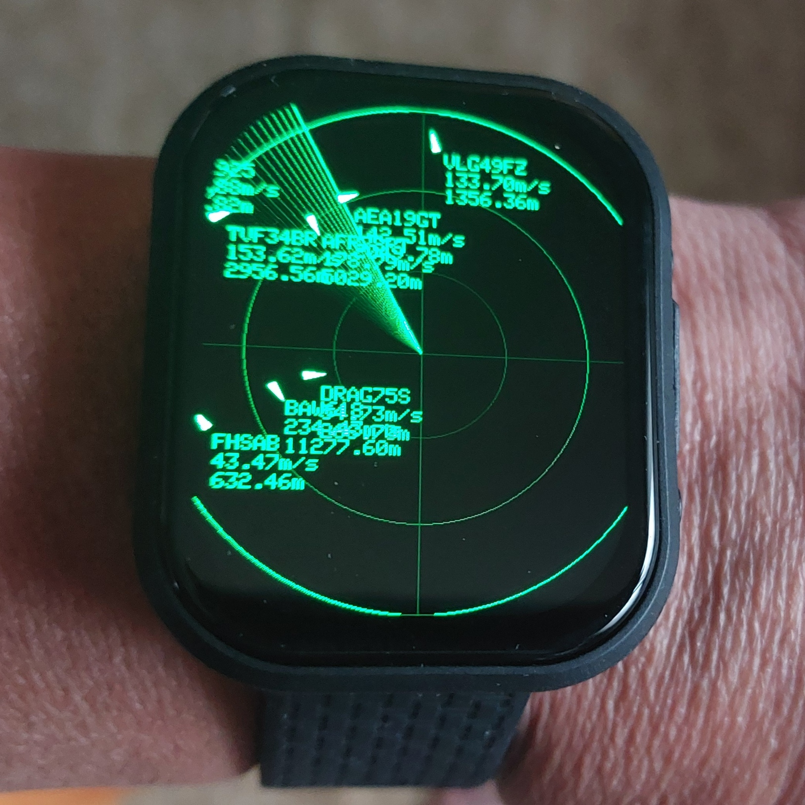
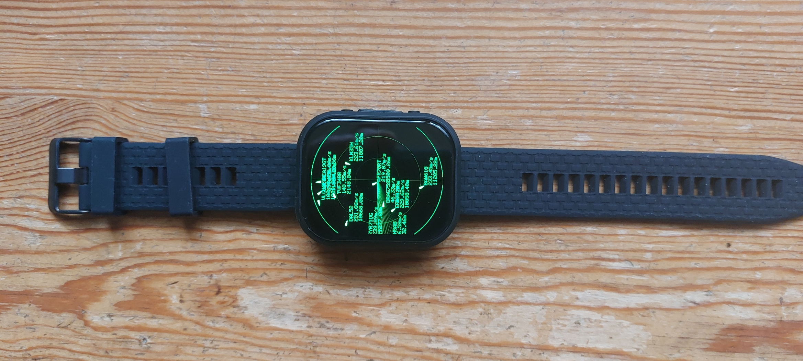
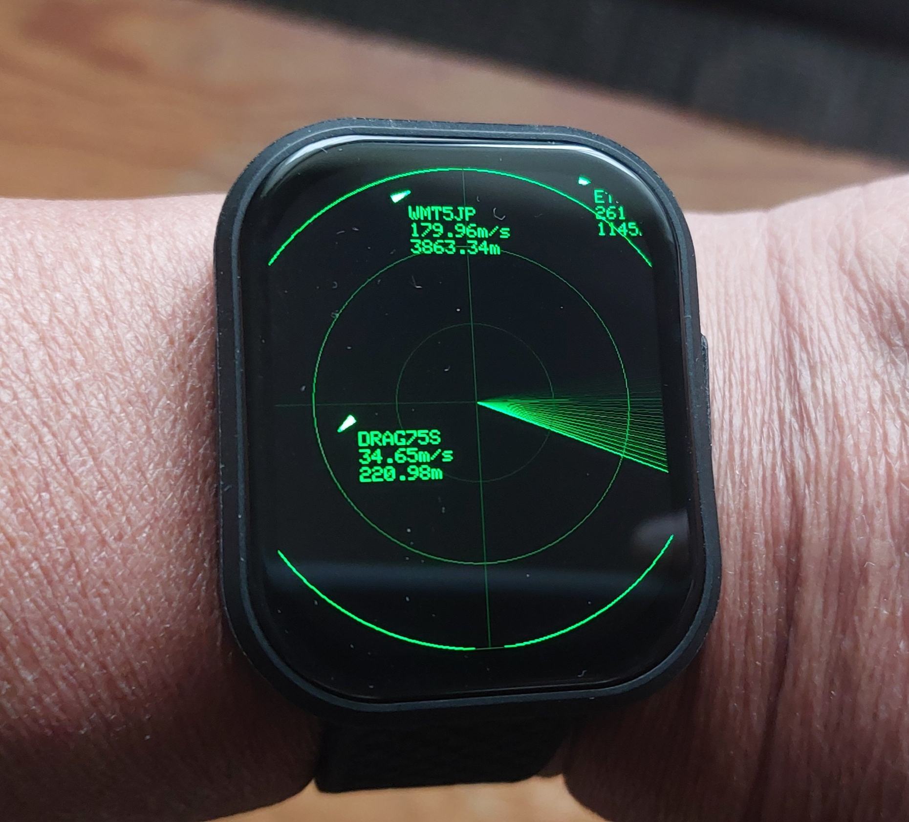
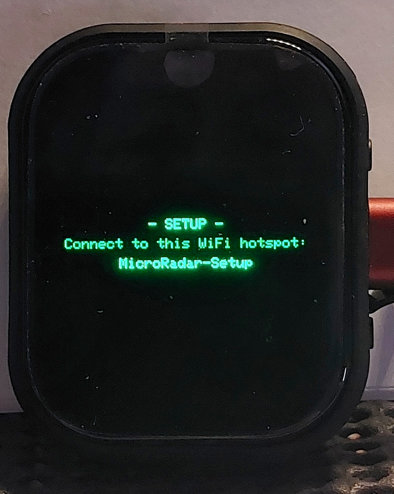
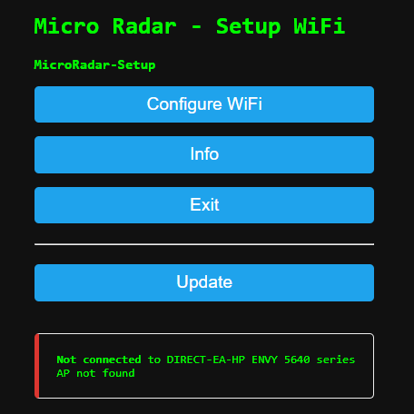
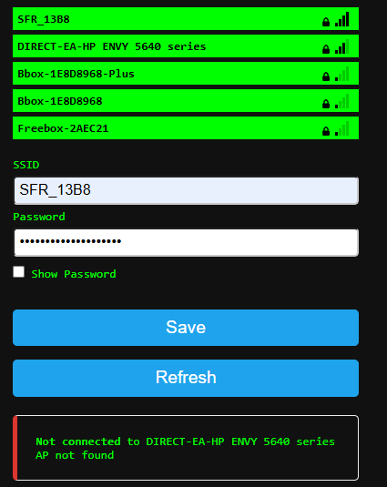
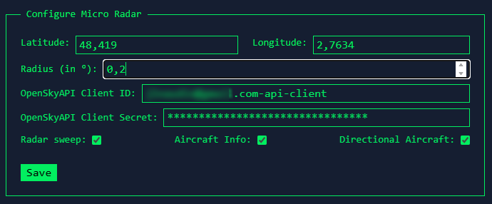

<div align="center">

# 📡 MMR v1.0 — Montre Micro Radar

**Un radar de trafic aérien en temps réel, au poignet ou sur le bureau.**

Portage de [micro-radar](https://github.com/AnthonySturdy/micro-radar) d'Anthony Sturdy
vers la carte **Waveshare ESP32-S3-Touch-AMOLED-2.06**

[**⚡ Installer le firmware depuis le navigateur**](https://f1gbd.github.io/F1GBD/Montre_MicroRadar/webflash/)



</div>

---

## Ce que c'est

La MMR interroge l'API publique [OpenSky Network](https://opensky-network.org) et
affiche, sur un écran AMOLED rond de 2,06 pouces, les avions qui survolent une
zone que vous définissez : indicatif, vitesse, altitude et cap, sur un fond de
balayage radar à l'ancienne.

Aucun récepteur ADS-B, aucune antenne : la carte se connecte simplement en
Wi-Fi. Tout se configure depuis une page web servie par la montre elle-même.

<div align="center">

| | |
|:---:|:---:|
|  |  |
| La montre assemblée | Au poignet, en fonctionnement |

</div>

---

## ⚡ Installation en un clic

**👉 https://f1gbd.github.io/F1GBD/Montre_MicroRadar/webflash/**

Branchez la carte en USB-C, cliquez, choisissez le port série. C'est tout —
aucun pilote, aucun outil à installer.

> **Chrome ou Edge sur ordinateur uniquement.** L'API Web Serial n'existe ni sur
> Firefox, ni sur Safari, ni sur navigateur mobile.

Si le port n'apparaît pas : maintenez **BOOT**, appuyez brièvement sur
**RESET**, relâchez **BOOT**, puis relancez l'installation.

---

## Matériel

| Élément | Détail |
|---|---|
| Carte | [Waveshare ESP32-S3-Touch-AMOLED-2.06](https://www.waveshare.com/esp32-s3-touch-amoled-2.06.htm) |
| Processeur | ESP32-S3, Xtensa LX7 double cœur 240 MHz |
| Mémoire | 16 Mo Flash, 8 Mo PSRAM OPI |
| Écran | AMOLED **CO5300**, 410 × 502, bus QSPI |
| Tactile | FT3168 (I2C) — non utilisé en v1.0 |
| Divers | IMU QMI8658, RTC PCF85063, PMU AXP2101, accu Li-Po |
| Liaison PC | USB-C natif (USB Serial/JTAG intégré au SoC) |

Rien à souder, rien à câbler : tout est sur la carte.

> La v1.0 ne publie que le firmware **ESP32-S3**. Les sources contiennent aussi
> un environnement **ESP32-C6** fonctionnel (voir *Compilation*), non diffusé
> faute d'avoir été validé sur matériel.

---

## Première mise en route

### 1. Connexion Wi-Fi

Au premier démarrage la montre crée un point d'accès **`MicroRadar-Setup`** et
l'affiche à l'écran.

<div align="center">

</div>

Connectez-vous-y depuis un téléphone ou un PC : un portail captif s'ouvre
(sinon, `http://192.168.4.1`). Choisissez votre réseau et saisissez la clé.

<div align="center">

| | |
|:---:|:---:|
|  |  |
| Portail de configuration | Choix du réseau et mot de passe |

</div>

> Le réseau doit être en **2,4 GHz** — l'ESP32-S3 ne gère pas le 5 GHz.

### 2. Adresse de la page de configuration

La montre redémarre, se connecte, puis **affiche à l'écran l'adresse de sa page
de configuration**, par exemple `http://192.168.1.140/`. Ouvrez-la dans un
navigateur du même réseau.

### 3. Réglages

<div align="center">

</div>

| Champ | Rôle | Conseil |
|---|---|---|
| **Latitude / Longitude** | Centre du radar | Clic droit sur Google Maps → les coordonnées s'affichent |
| **Radius** | Demi-côté de la fenêtre de recherche, **en degrés** | `0.2` ≈ 22 km : bon point de départ. Au-delà de `0.5`, les étiquettes se chevauchent en zone dense |
| **OpenSky Client ID / Secret** | Compte OpenSky (facultatif) | Fait passer de 400 à 4000 requêtes/jour, soit un rafraîchissement toutes les **22 s** au lieu de **3,6 min** |
| **Radar sweep** | Balayage animé | — |
| **Aircraft Info** | Indicatif / vitesse / altitude | À décocher en zone à fort trafic |
| **Directional Aircraft** | Triangles orientés selon le cap | Sinon, simples points |

Un compte OpenSky est gratuit : [opensky-network.org](https://opensky-network.org).

---

## Compilation depuis les sources

Le projet est un projet **PlatformIO**.

```bash
git clone https://github.com/f1gbd/F1GBD.git
cd F1GBD/Montre_MicroRadar
pio run -t upload
pio device monitor
```

### Points d'attention

* **Le paquet `espressif32` officiel de PlatformIO ne fournit pas Arduino pour
  l'ESP32-C6.** Le `platformio.ini` utilise donc le fork
  [pioarduino](https://github.com/pioarduino/platform-espressif32) pour les deux
  cartes.
* **N'ajoutez jamais `lib_ldf_mode = deep+`.** Avec arduino-esp32 3.x, ce mode
  casse la résolution des includes des bibliothèques intégrées au framework et
  produit `WiFiGeneric.h:44: fatal error: Network.h: No such file or directory`.
* `default_envs` vise la S3. Pour compiler les deux cibles :

  ```bash
  pio run -e esp32-s3-amoled-206 -e esp32-c6-amoled-206
  ```

* Chaque compilation génère aussi, via `tools/merge_bin.py`, un **binaire unique
  flashable à l'offset 0x0** (`.pio/build/<env>/<env>-merged.bin`) — c'est celui
  que consomme la page de flashage web.

### Arborescence

```
Montre_MicroRadar/
├── platformio.ini            2 environnements : S3 (defaut) et C6
├── include/
│   ├── LGFX.h                CO5300 QSPI + FT3168, brochage S3 / C6
│   ├── DisplayConfig.h       geometrie 410x502, couleurs, backbuffer
│   ├── DrawHelpers.h         balayage radar, ecrans de statut
│   ├── WiFiManagerHelpers.h  portail de configuration Wi-Fi
│   └── JsonParser.h
├── src/
│   ├── main.cpp
│   ├── AircraftManager.*     suivi et rendu des appareils
│   ├── ConfigurationWebServer.*
│   ├── HttpRequestManager.*
│   ├── OpenSkyAuthTokenHandler.*
│   └── models/
├── tools/merge_bin.py        fusion post-build en un binaire unique
├── webflash/                 page GitHub Pages + firmware publie
└── images/
```

---

## Notes de portage

Le projet d'origine visait un ESP32-C3 avec un écran rond **GC9A01 240 × 240**
en SPI classique. Le passage au CO5300 410 × 502 en QSPI a demandé trois
adaptations non triviales, documentées ici pour qui voudrait porter un autre
projet LovyanGFX sur cette dalle.

**1. Le backbuffer.** Un tampon plein écran coûte 410 × 502 × 2 = **412 Ko** en
16 bits. Impossible en SRAM interne : il est alloué en **PSRAM**
(`sprite.setPsram(true)`), ce qui laisse ~300 Ko de RAM interne libre pour la
pile Wi-Fi. Sur la variante C6, dépourvue de PSRAM, le même code bascule
automatiquement sur une sprite en **palette 4 bits** (16 nuances de vert,
103 Ko) : la fonction `G()` de `DisplayConfig.h` renvoie soit une couleur
RGB888, soit un index de palette, et le reste du code ne voit que `COL_RING`,
`COL_BRIGHT`, etc.

**2. L'alignement pair du CO5300.** Le pilote `Panel_AMOLED` de LovyanGFX
**ignore silencieusement** toute écriture dont l'abscisse ou la largeur est
impaire — écrire du texte directement sur l'objet `LGFX` fait donc disparaître
des caractères au hasard. Tout passe désormais par la sprite plein écran,
poussée en `(0, 0)` sur 410 px : les deux valeurs sont paires, la contrainte est
toujours respectée.

**3. La géométrie du panneau.** `lgfx::Panel_CO5300` est câblé pour la LilyGO
T-Watch-Ultra (502 × 410, paysage). Sur la Waveshare, montée en portrait, il
faut surcharger `panel_width/height` et `memory_width/height` à 410 × 502 avec
`offset_x = 22`.

Deux corrections de stabilité s'y sont ajoutées :

* **`WiFi.setSleep(false)`** — la veille modem (`pm_dream`) réinitialise le PHY
  en permanence ; sous IDF 5.5 ce chemin appelle `phy_track_pll_init()`, qui
  fait un `ESP_ERROR_CHECK(esp_timer_create(...))` et provoque une boucle de
  reboot dès que la RAM interne est sollicitée.
* **Plus aucun accès NVS dans la boucle de rendu.** La version d'origine
  ouvrait et fermait un espace de noms NVS *à chaque image* pour relire un
  simple booléen, ce qui fragmentait le tas interne jusqu'à faire échouer les
  petites allocations de la pile réseau.

Le détail complet est dans [`README-PORTAGE.md`](README-PORTAGE.md).

---

## Dépannage

| Symptôme | Cause probable | Solution |
|---|---|---|
| Aucun port série proposé | La carte n'est pas en mode téléchargement | BOOT maintenu → RESET → relâcher BOOT |
| `This chip is ESP32-S3, not ESP32-C6` | Mauvais environnement PlatformIO | `pio run -e esp32-s3-amoled-206 -t upload` |
| La montre ne rejoint pas le Wi-Fi | Réseau en 5 GHz | Utiliser la bande 2,4 GHz |
| Écran noir après flash | Mauvaise carte ou PSRAM non détectée | Vérifier `board_build.arduino.memory_type = qio_opi` |
| Étiquettes illisibles, entassées | Rayon trop grand | Réduire **Radius** à `0.2`, ou décocher **Aircraft Info** |
| Aucun avion affiché | Position non saisie, ou zone sans trafic | Vérifier latitude/longitude et augmenter le rayon |

La console série (115200 bauds) affiche toutes les 10 secondes une ligne
`[HEAP] interne … (bloc max …) | psram …`. Des valeurs stables sur la durée
signent un fonctionnement sain.

---

## Crédits & licence

* Projet d'origine : **[micro-radar](https://github.com/AnthonySturdy/micro-radar)** — Anthony Sturdy, licence MIT
* Données de vol : **[OpenSky Network](https://opensky-network.org)**
* Bibliothèque graphique : **[LovyanGFX](https://github.com/lovyan03/LovyanGFX)** — lovyan03
* Flashage navigateur : **[ESP Web Tools](https://esphome.github.io/esp-web-tools/)**
* Matériel et exemples : **[Waveshare](https://github.com/waveshareteam/ESP32-S3-Touch-AMOLED-2.06)**

Portage MMR : **F1GBD** — licence MIT, comme le projet d'origine.
