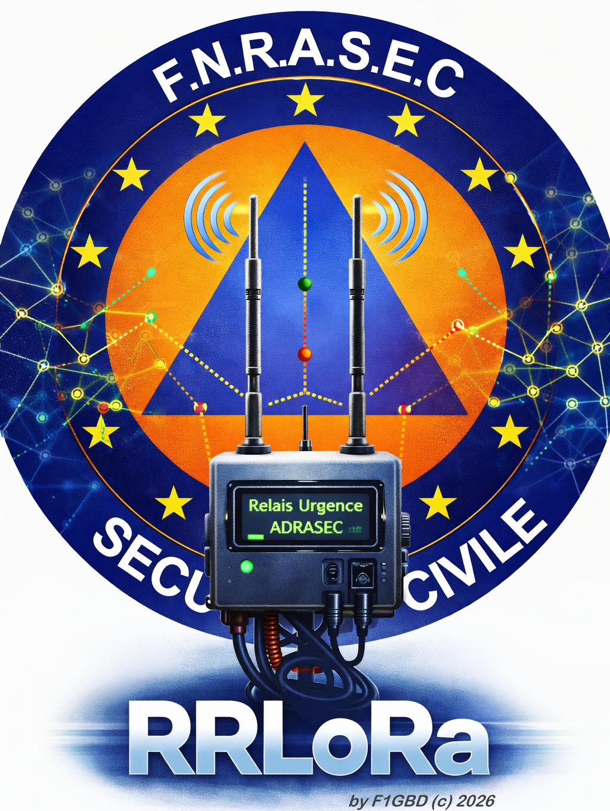
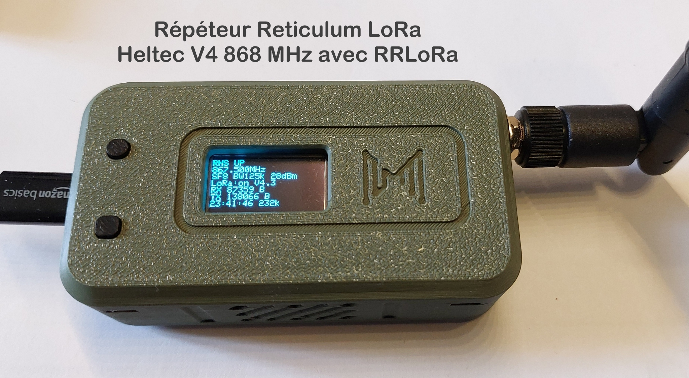
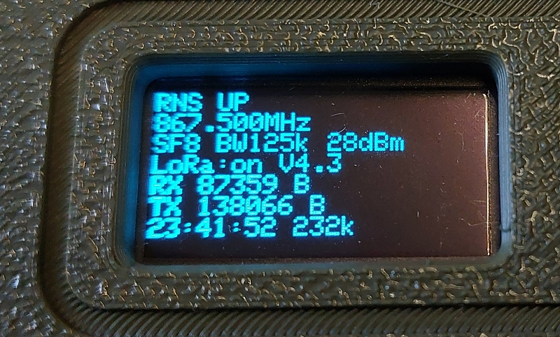
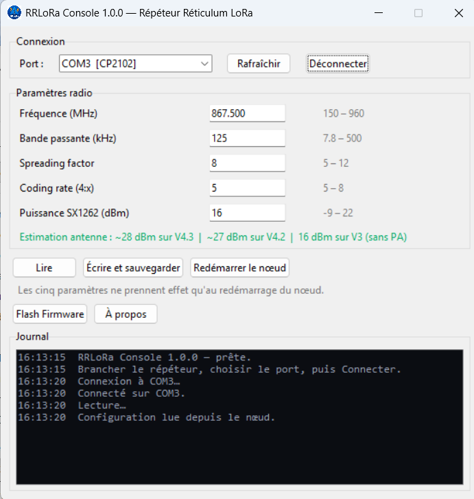

<div align="center">



# RRLoRa — Répéteur Réticulum LoRa

**Nœud Transport Reticulum autonome sur Heltec WiFi LoRa 32 — sans PC, sans Raspberry Pi**

*par F1GBD — ADRASEC 77 / FNRASEC*

</div>

---

Un répéteur [Reticulum](https://reticulum.network/) qui tient dans la main, tourne
sur batterie ou panneau solaire, et **route pour les autres** : la pile RNS
complète s'exécute sur l'ESP32-S3 de la carte.

Contrairement au firmware RNode classique — un modem LoRa piloté par un
ordinateur — RRLoRa reçoit, décide et retransmet tout seul. Posez-le sur un
point haut, alimentez-le : il relaie.

<div align="center">

</div>

## Pourquoi

En opération ADRASEC, le réseau doit exister là où il n'y a plus rien : ni
cellulaire, ni Internet, ni énergie. Reticulum apporte le chiffrement de bout en
bout, le routage maillé et l'autonomie d'adressage. LoRa apporte la portée pour
quelques milliwatts.

Il manquait le relais : un nœud qu'on dépose et qu'on oublie. C'est RRLoRa.

## Matériel

| Carte | USB | Flash | PSRAM | PA | État |
|---|---|---|---|---|---|
| **Heltec WiFi LoRa 32 V4** | natif ESP32-S3 | 16 Mo | 2 Mo | GC1109 (V4.2) / KCT8103L (V4.3) | validé |
| **Heltec WiFi LoRa 32 V3** | pont CP2102 | 8 Mo | — | — | validé |

<div align="center">

</div>

<div align="center">

</div>


## Console de configuration

<div align="center">

</div>

Application Windows autonome : fréquence, bande passante, spreading factor,
coding rate et puissance, lus et écrits par USB. Les réglages sont persistés en
flash et rechargés au démarrage.

Elle flashe aussi le firmware, en choisissant le binaire d'après la carte
détectée — les images V3 et V4 ne sont pas interchangeables.

## Démarrer

<div align="center">

## 📥 [Télécharger la dernière version de RRLoRa](https://github.com/f1gbd/F1GBD/releases?q=rrlora&expanded=true)

### **Flasheur et firmware inclus**

</div>

<br>

**1.** Télécharger `RRLoRa.7z`, décompresser, lancer `RRLoRaConsole.exe`.

**2.** Brancher la carte en USB, choisir le port, **Flash Firmware**.

**3.** **Connecter**, régler la radio, **Écrire et sauvegarder**, redémarrer.

Les mêmes paramètres radio doivent être appliqués sur **tous** les nœuds du
réseau — un seul écart et rien ne passe.

## Vérifier

Depuis une machine avec [Reticulum](https://reticulum.network/) et un RNode
réglé à l'identique :

```bash
rnprobe rnstransport.probe <hash_affiché_au_démarrage>
rnstatus
rnpath -t
```

## Validé sur matériel

Testé le 15/07/2026 sur Heltec V4.3 et V3, face à un RNode sous firmware
officiel de Mark Qvist.

```
Valid reply — RTT 997 ms over 1 hop [RSSI -71 dBm] [SNR 13.0 dB] [Link Quality 100.0%]
Sent 1, received 1, packet loss 0.0%
```

**Le relayage est démontré** : banc à trois nœuds, deux stations isolées l'une
de l'autre et toutes deux à portée du répéteur — le trajet passe bien en 2 hops.

Faits établis par la mesure, et non par déduction :

| | Valeur | Comment |
|---|---|---|
| FEM V4.3 | KCT8103L, CTX sur GPIO5 | niveau au repos de CSD (GPIO2) |
| Gain PA | 11 dB mesurés (12 annoncés) | RSSI -82 → -71 en corrigeant le FEM |
| Vext OLED | GPIO36, actif **BAS** | scan I2C sur les 4 combinaisons |
| Interop RNode | OK | probe validé |


## Licence

**Apache-2.0** — voir [LICENSE](LICENSE) et [NOTICE](NOTICE).

Bâti sur :

- **[microReticulum](https://github.com/attermann/microReticulum)** — Chad Attermann, Apache-2.0 — la pile RNS embarquée
- **[Reticulum](https://reticulum.network/)** — Mark Qvist, MIT — le protocole
- **[MeshCore](https://github.com/meshcore-dev/MeshCore)** — Scott Powell, MIT — référence pour le pilotage du FEM
- **[RadioLib](https://github.com/jgromes/RadioLib)** — Jan Gromeš, MIT — le pilote SX1262

Merci à leurs auteurs : sans eux, ce projet n'existerait pas.

---

<div align="center">
<sub>RRLoRa — F1GBD — ADRASEC 77 / FNRASEC — 2026</sub>
</div>
