<div align="center">

</div>

# RTspk Pager — Ratspeak édition RASEC-ALERT (F1GBD/ADRASEC 77)

**Récepteur d'alerte (pager) pour réseau Reticulum / LXMF**, basé sur
l'application [Ratspeak](https://github.com/ratspeak/Ratspeak) avec l'ajout de
la fonction **RASEC-ALERT** portée du MeshPager / de l'édition Saitama T-Deck.

Un message **LXMF** reçu contenant le code d'activation déclenche sur l'appareil :
un **écran plein écran clignotant « RASEC ALERT »** (avec compteur d'alertes),
une **sirène bitonale** synthétisée (aucun fichier son requis), et un **accusé
de réception automatique** renvoyé à l'expéditeur. Sur mobile, une **notification
native** est également émise.

**RTspk Pager** est compatible avec le logiciel **TCQ** — messages, PING LXMF,
images et synchro cartographique NEM, dans les deux sens. Côté TCQ, laisser la
case « ⚛ Quantique » du panneau de chat **décochée** : la téléportation
quantique est un format propre à TCQ, illisible par tout autre client LXMF.

> Application Android — fonctionne sur téléphone/tablette et sur le LilyGO T-Deck
> (Android). Version desktop possible en compilant depuis les sources.

<div align="center">
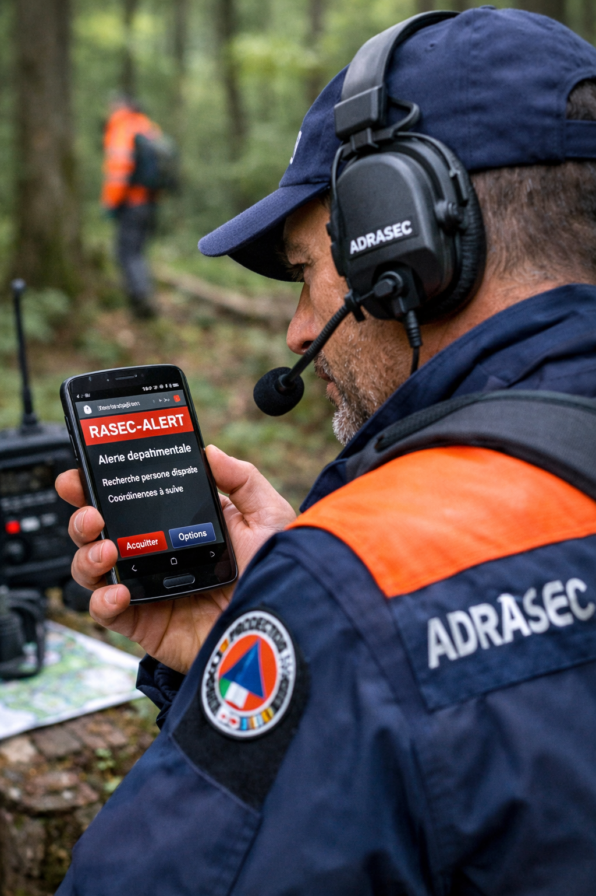
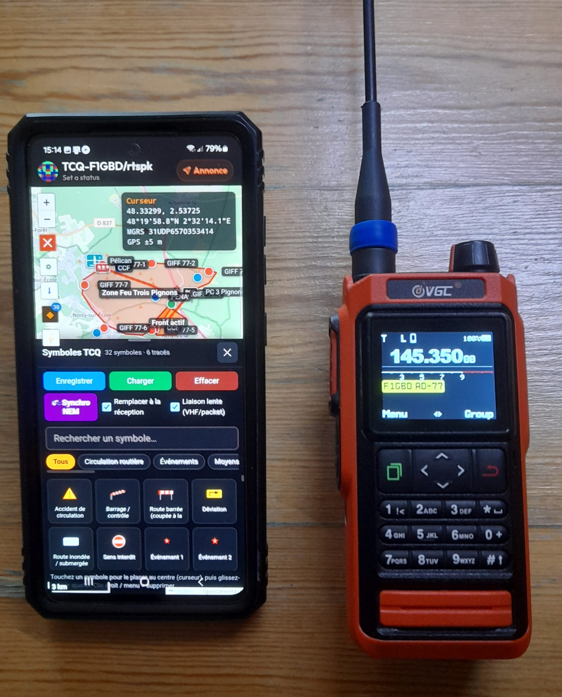
</div>

---

## Téléchargement et installation (Android)

1. Télécharger l'APK (lien direct) : **[RTspk_pager-1.0.61.apk](https://github.com/f1gbd/F1GBD/releases/download/1.0.60/RTspk_pager-1.0.61.apk)**.
2. Sur le téléphone, autoriser l'installation depuis cette source (« sources
   inconnues » / « Installer des applications inconnues »).
3. Ouvrir le fichier APK et installer.
4. Au premier lancement, créer/importer une identité Reticulum et configurer au
   moins une interface (LoRa/RNode, TCP, WiFi/BLE…) dans *Settings*.

---

## Nouveautés

**1.0.60 — Couverture LoRa prévisionnelle et placement de relais RRLoRa.**
Un bouton **🗼 pylône** cherche **où poser un répéteur [RRLoRa](https://github.com/f1gbd/F1GBD/tree/master/RRLora)** pour relier deux
stations qui ne s'entendent pas : profil réel de la liaison directe, grille d'altitudes
sur le corridor, six meilleurs sites recalculés sur profils réels, et une **chaîne de deux
relais** quand un seul ne suffit pas. RRLoRa étant un **nœud Transport Reticulum**, la liaison
compte **deux bonds indépendants** : c'est le **maillon faible** qui est affiché. La position de
la station se choisit désormais entre **GPS et curseur**, et un appui sur l'encart de bilan
ouvre les réglages.

<div align="center">
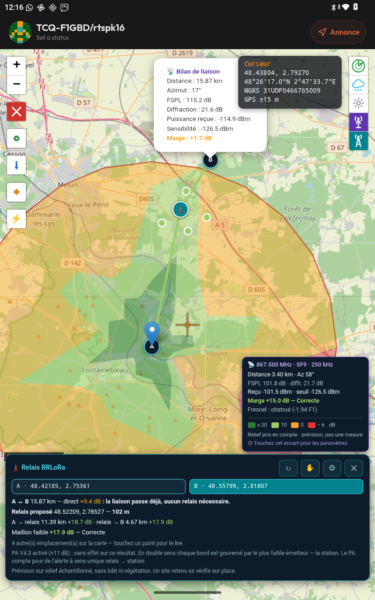

  <em>Couverture LoRa prévisionnelle et placement de relais **<strong>RRLoRa</em>
</strong>**</div>
**Pour plus d'info sur les relais RRLoRa:** https://github.com/f1gbd/F1GBD/tree/master/RRLora

 Un bouton **📡 antenne**, sous les
réglages météo, trace la **portée radio de la station** en quatre couleurs sur la
**fréquence réellement configurée dans le RNode** (867,500 MHz par défaut), et
affiche le **bilan de liaison au point visé** : distance, azimut, affaiblissement,
puissance reçue, sensibilité, marge et dégagement de la zone de Fresnel. Le calcul
tient compte du **relief réel** (altitudes Open-Meteo, sans clé), de la **courbure
terrestre** et de la **diffraction sur arête** — une crête dégrade la liaison
progressivement au lieu de la couper net. À lire comme une prévision, jamais
comme une garantie : sur le terrain, seul un essai radio fait foi.

**1.0.50 — Couche météo AROME, règle des 3×30 et zones à surveiller.** Un bouton
🌦 **sous le bouton radar** allume une couche météo alimentée par le modèle
**AROME de Météo-France** via **Open-Meteo — gratuit et sans clé**. La carte se
couvre d'un **champ de vent** (une flèche par maille, pointe vers où souffle le
vent, couleur selon la vitesse), des **zones « règle des 3×30 »** (jaune =
2 critères sur 3, rouge = les 3 réunis, danger feux de forêt extrême), et d'un
**bulletin station** au point GPS de l'opérateur. On peut en plus **tracer des
zones à surveiller** au doigt : dès que les seuils y sont atteints, la zone
passe au rouge clignotant, un **bandeau d'alerte** barre le haut de la carte et
une **sirène montante** retentit. Les zones **s'échangent par LXMF** avec TCQ,
dans les deux sens. Réglages par appui long, aux **valeurs par défaut de TCQ** :
grille 6 × 5, flèches ×1,5, seuils 30 °C / 30 km/h / 30 %, rafraîchissement
15 min. Détails dans la section **Couche météo** plus bas.
✅ Interopérable **TCQ v12.68** — zones échangées et affichées dans les deux sens.

<div align="center">
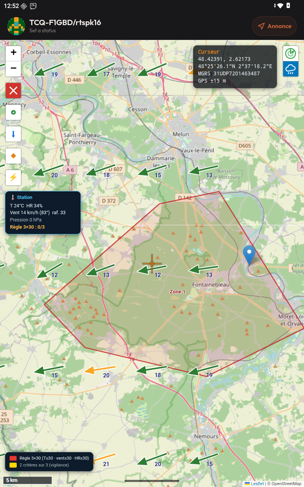

  <em>Surveillance d'une Zone à Risques Incendies selon la **<strong>Règle des 3x30</em>
</strong>**</div>

<div align="center">
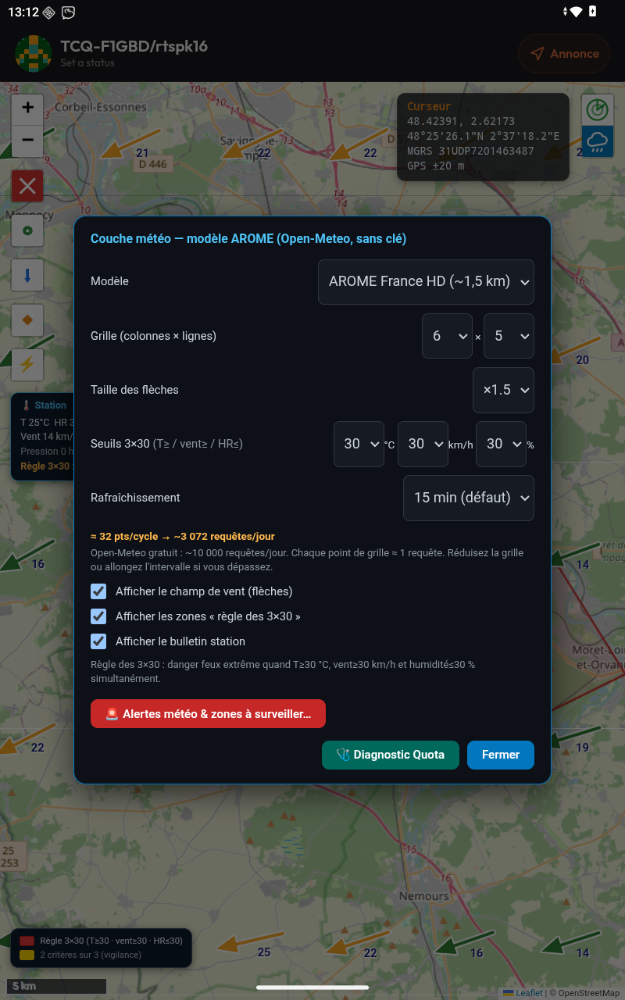

  <em>Paramétrage de la météo et de zone la zone à surveiller</em>
</strong>**</div>

**1.0.42 — Radar** : case « Carte » et fond de carte sombre. Cochez Carte dans les réglages du radar : le scope se centre sur le centre de la carte au moment de l'ouverture au lieu du GPS — on cadre le secteur qui intéresse, on ouvre le radar, et on regarde le trafic là-bas. Seconde case, Fond de carte sombre : un disque de carte assombri se glisse sous le PPI, calé au pixel près sur le cercle de portée, à partir des tuiles déjà en cache (aucune requête supplémentaire).

<div align="center">
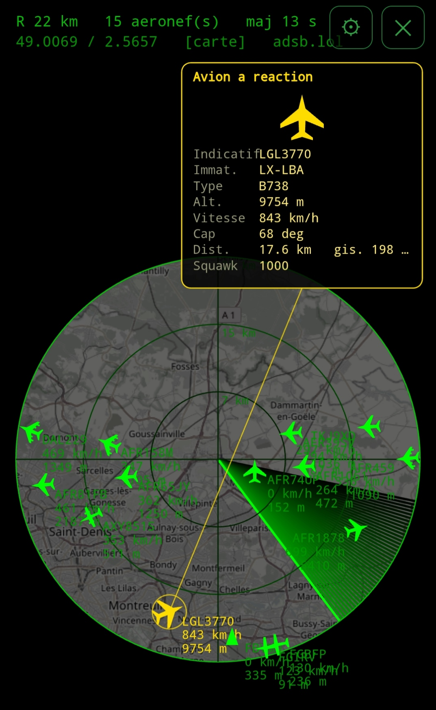
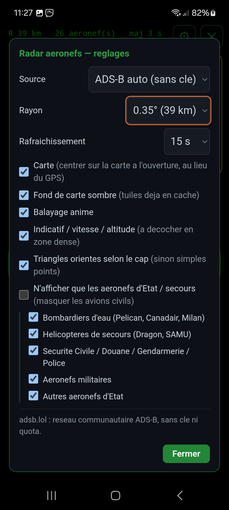
</div>

**1.0.41 — Listes de diffusion modifiables.** Un bouton **Éditer** sous
**Envoyer** recharge une liste existante dans le formulaire : cochez pour
ajouter un opérateur, décochez pour le retirer. Le renommage ne crée plus de
doublon, et un membre dont le contact a disparu est conservé au lieu d'être
silencieusement perdu.

**1.0.40 — PING LXMF, photos compatibles TCQ, radar aéronefs.** Quatre ajouts
tournés vers l'opérationnel : un **PING LXMF** pour vérifier qu'une station
répond avant de compter dessus, l'**envoi de photos** (galerie ou prise de vue)
avec compression au format de TCQ, un transfert d'images **qui fonctionne dans
les deux sens** avec TCQ, et un **radar aéronefs** en balayage PPI accessible
depuis la carte. Détails dans les sections dédiées plus bas. Corrige aussi un
blocage de la liaison LXMF après un envoi d'image (un transfert enlisé gelait
la file d'attente jusqu'au redémarrage). ✅ Interopérable **TCQ v12.66**.

<div align="center">
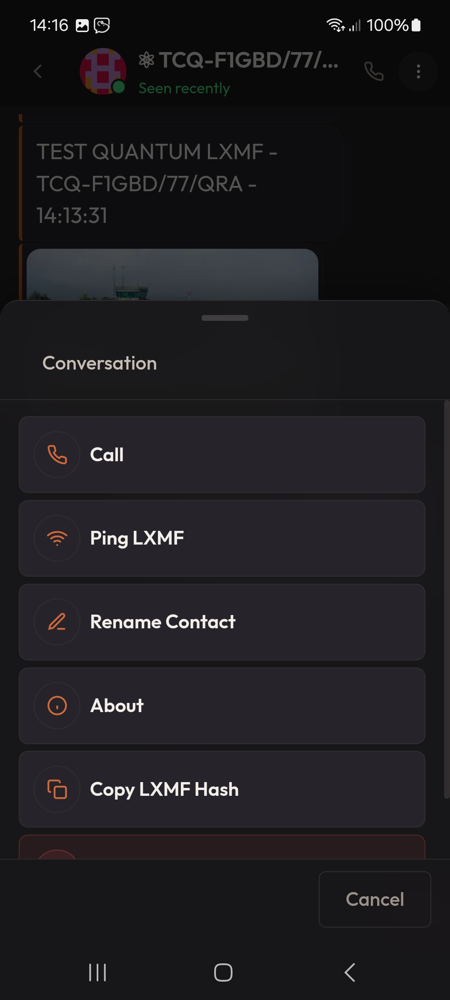
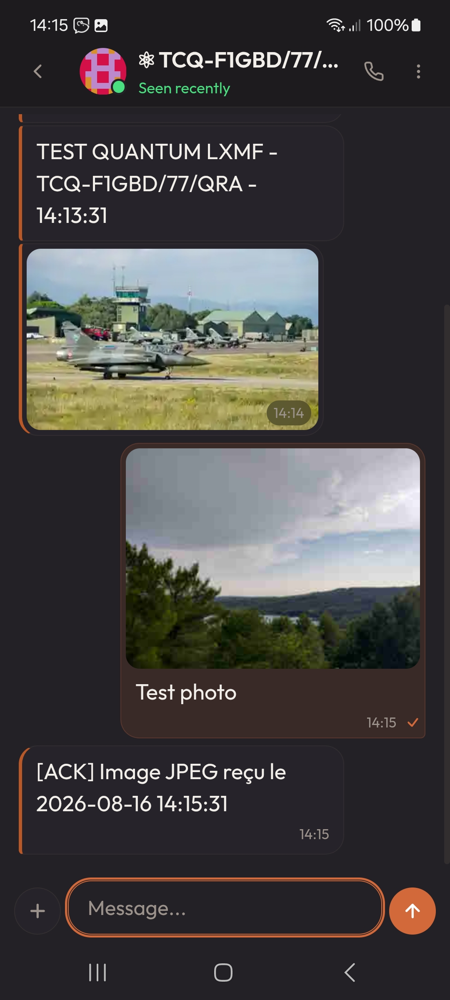
</div>

**1.0.38 — Radar aéronefs et compresseur d'images.** Scope radar plein écran
façon Montre Micro Radar, et compression d'images aux réglages de TCQ.

<div align="center">
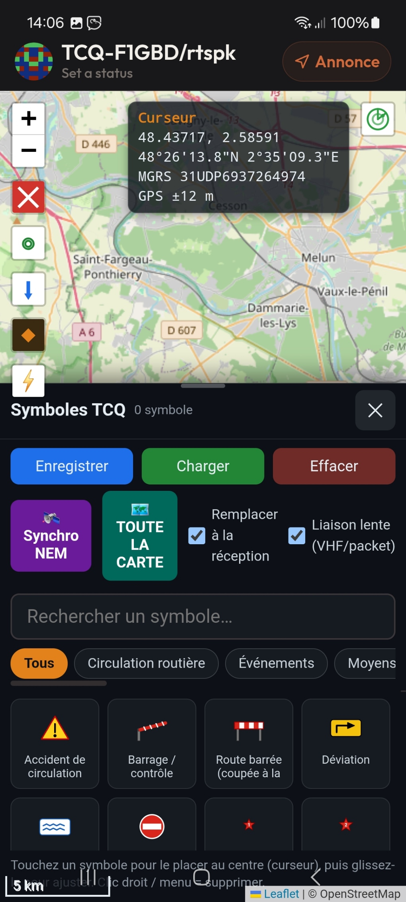
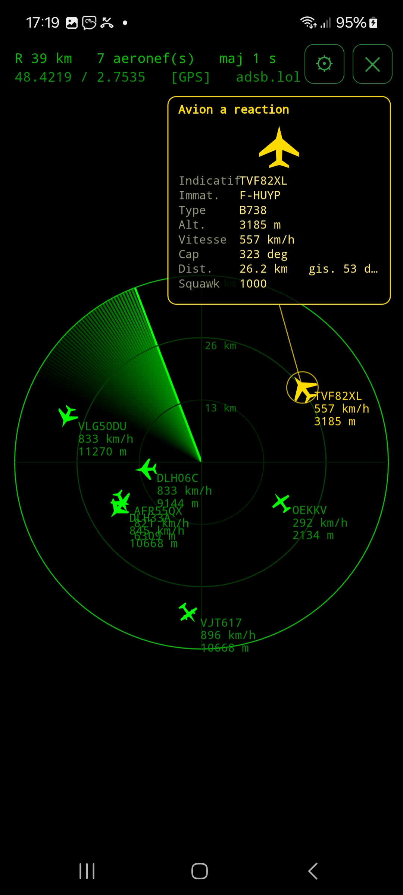
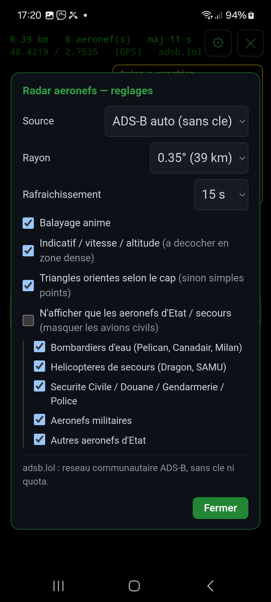
</div>

**1.0.37 — Synchro NEM rapide par Internet.** Quand la liaison passe par
Internet plutôt que par la radio, la synchro NEM utilise des morceaux de
**4000 octets** au lieu de 50 et n'attend plus entre deux envois : une carte
complète part en quelques secondes au lieu de plusieurs minutes. La cadence
radio reste inchangée.

**1.0.36 — Synchro NEM ULTRA-COMPACTE (marqueurs en binaire).** Après le delta, RTspk compresse encore : les marqueurs voyagent en **binaire compact** (1 octet pour le symbole, position sur 3+3 octets) au lieu du JSON. Un marqueur tient en **~1 trame** ; **2 marqueurs = 3 morceaux** au lieu de 28 — transferts **~10× plus courts** sur VHF 1200 bauds. Repli JSON automatique (lignes/zones/marqueurs à options/versions antérieures), et **recentrage** de la carte sur les objets reçus. Ajoute aussi un bouton **« 🔄 Scanner »** dans « Ajouter un TNC » (rafraîchit les appareils appairés) et la demande d'autorisation **« Appareils à proximité »** au 1er lancement. ✅ Interopérable **TCQ v12.62**.

**1.0.35 — Synchro NEM DELTA (n'échange que la différence).** La synchro NEM ne retélécharge plus toute la carte : RTspk compare les deux cartes et ne transmet **que ce qui a changé**. Cartes déjà identiques → simple accusé de **~20 octets** (jusqu'à **~97 % de données en moins** sur VHF 1200 bauds). Un objet déplacé **glisse à sa nouvelle position au lieu de se dupliquer** (même nom + même symbole = même objet ; la modif la plus récente gagne). **Repli automatique** en synchro complète si le correspondant est en version antérieure. ✅ Delta de bout en bout avec **TCQ v12.61** ; compatible en repli avec les versions plus anciennes.

**1.0.34 — Balise de position & synchro NEM fiabilisée.** Appui long sur le bouton de recentrage GPS (◎) : pose ton symbole **SATER:TEAM** à ta position, avec ton indicatif en label. Synchro NEM stabilisée et **bidirectionnelle** (émission + réception fiables sur VHF packet).

**1.0.33 — Messages FLASH sur la carte.** Bouton **⚡** pour envoyer un message
court (**90 car.**) à un ou plusieurs contacts (ou une liste de diffusion), préfixé
`&`. À la réception d'un `&`, un dialogue s'ouvre par-dessus la carte pour lire et
répondre ; `$GPS` dans la réponse insère la position. Voir « Cartographie & synchro
NEM ».
<div align="center">
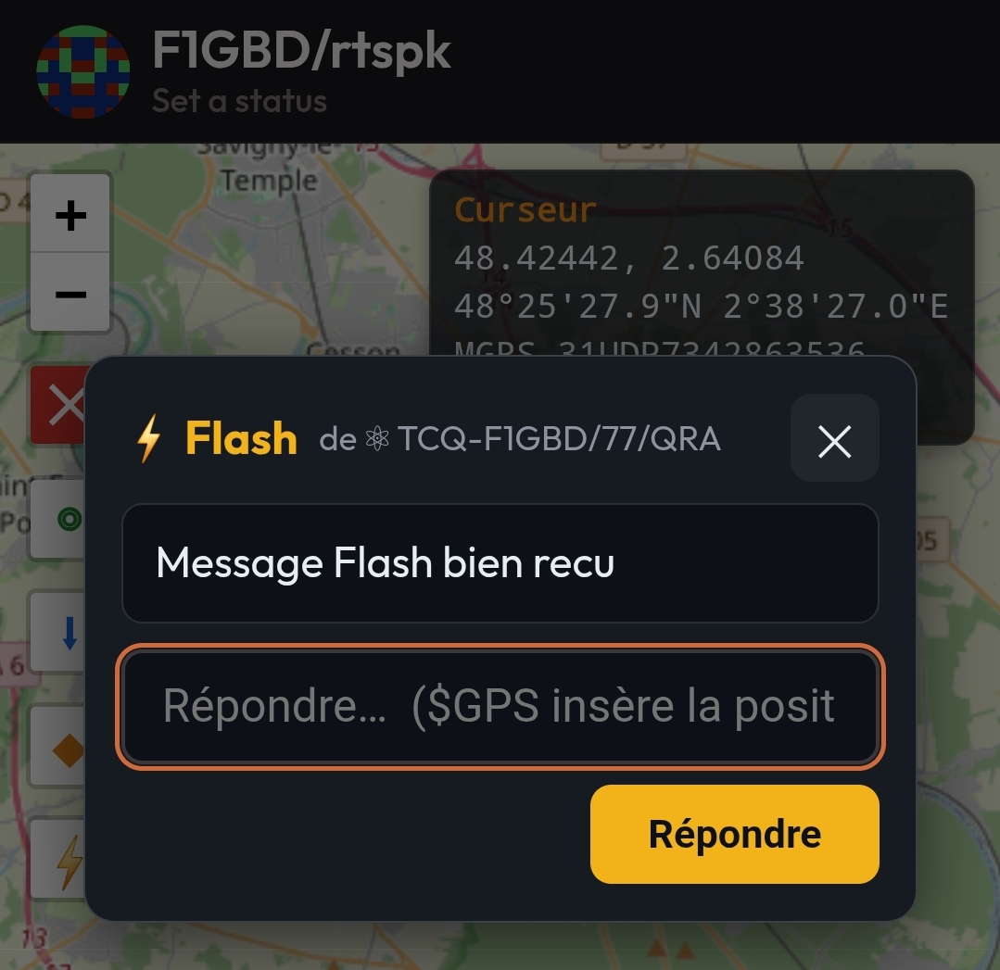

  <em><strong>"RTspk FLASH</strong> — message éclair, carte en direct."</em>
</div>


**1.0.32 — Carte tactique et synchro NEM.** Cartographie OpenStreetMap
embarquée **Live et Off-grid** (cache des tuiles hors réseau), **symbologie
SDIS / NEB** de TCQ (118 symboles), enregistrement/chargement au **format JSON
compatible TCQ**, et **synchro NEM** : partage de toute la situation par radio
(LXMF), interopérable avec TCQ. Voir la section « Cartographie & synchro NEM ».

<div align="center">
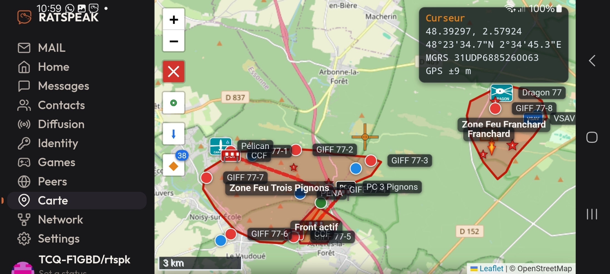

  <em><strong>Carte Tactique partagée en équipe **"synchro NEM"**</strong> en Mission Opérationnelle sur le terrain.</em>

</div>


<div align="center">
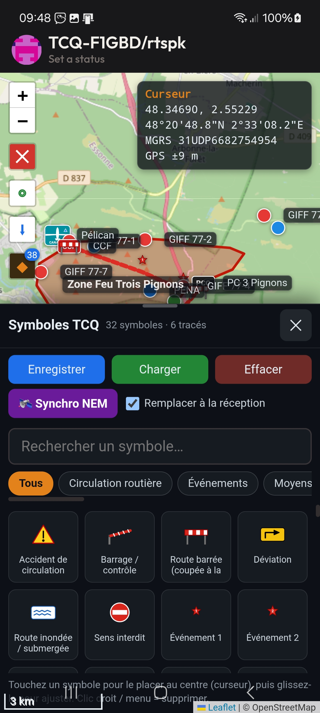

  <em><strong>**Symbologie
SDIS / NEB**</strong> de TCQ (118 symboles) .</em>
</div>

**1.0.31 — Veille alerte et bouton MAIL.** Deux ajouts majeurs pour l'usage
en pager d'astreinte : une **veille alerte** qui continue de recevoir en LoRa
application fermée, et un bouton **MAIL** qui envoie un email par radio via une
passerelle ADRAlink. Voir les deux sections dédiées plus bas.


**1.0.27 — Listes de diffusion.** Envoi d'un message ou d'une alerte RASEC à
plusieurs opérateurs ADRASEC en une fois (voir plus bas).

**1.0.26 — Préréglage radio par défaut « France (868 MHz) ».** À la création
d'une interface LoRa/RNode, les paramètres par défaut sont : **867,5 MHz · SF 8 ·
125 kHz · CR 5 · TX 18 dBm**, avec limite d'airtime réglementaire (**1,5 % /
heure**, **33 % / 15 s**). Tout reste modifiable dans *Settings → interface LoRa*.

Un **écran de démarrage** (splash) aux couleurs RATSPEAK ADRASEC s'affiche au
lancement.

---

## Transmission LXMF par radio VHF — packet (VR-N76) 📻

**La vraie valeur ajoutée : une messagerie LXMF entièrement autonome — sans
Internet, sans réseau cellulaire, sans aucune infrastructure — sur une simple
radio VHF en mode packet.**

RTspk Pager (téléphone) et **TCQ** (poste fixe) échangent tous leurs messages
**LXMF / Reticulum** directement **sur les ondes VHF en packet** (TNC KISS,
liaison AX.25), typiquement avec un **VGC VR-N76** (TNC Bluetooth intégré). Sur
ce lien radio passe **tout** : messagerie LXMF, **alertes RASEC**, **messages
FLASH**, et la **synchro cartographique NEM** (symboles SDIS/NEB, zones, tracés,
relevés SATER). C'est la solution idéale pour l'**ADRASEC / le secours en zone
blanche** ou en cas de coupure d'infrastructure.

Le téléphone parle à la radio en **Bluetooth KISS** ; la radio transmet les
trames Reticulum sur la fréquence VHF ; la station TCQ (VR-N76 sur port KISS)
reçoit, affiche et répond — la liaison est **bidirectionnelle** et porte à
plusieurs kilomètres selon le relief et les antennes.

> **⚠️ Compatibilité — utilisez TCQ v12.60 (ou plus récent).**
> Le transport **packet AX.25 / LXMF** a été fiabilisé pour la radio lente et
> semi-duplex : découpage/réassemblage NEM, résolution de chemin robuste, envoi
> opportuniste sans temps morts. **TCQ v12.60** est la version de référence pour
> un échange packet radio ↔ RTspk Pager **fiable et rapide dans les deux sens**.
>
> **Synchro NEM delta (RTspk 1.0.35).** L'échange de la seule *différence* entre
> les deux cartes — cartes identiques réglées en ~20 octets, objet déplacé
> repositionné sans doublon — nécessite **TCQ v12.61** aux deux extrémités. Face
> à une version plus ancienne, la synchro **retombe automatiquement en transfert
> complet** : rien ne casse, on perd seulement le gain de débit du delta.

---

## Cartographie & synchro NEM

Icône **Carte** dans la barre du bas.

**Carte OSM Live et Off-grid.** Carte OpenStreetMap temps réel avec position
**GPS** (marqueur + cercle de précision) et bouton *recentrer*. Chaque tuile
affichée est mise en **cache** dans l'appareil : la zone déjà vue reste
disponible **hors réseau**. Le bouton **⬇ Télécharger la zone** pré-charge la
vue visible (zoom courant + 2 niveaux) pour une utilisation off-grid ; appui
long = vider le cache. **Curseur central** avec coordonnées **décimal / DMS /
MGRS** en haut à droite et **échelle** métrique en bas.

**Symbologie SDIS / NEB (comme TCQ).** 118 symboles issus de `carto_lib`
(unités OTAN/NEB, graphiques tactiques, engins et personnels SDIS, moyens
aériens, sinistres, circulation, moyens, événements, zones de secours, SATER).
Palette classée + recherche : toucher un symbole le pose au curseur, on le
**glisse** pour ajuster, **clic droit / menu** pour supprimer ou renommer. Zones
(polygones), lignes et flèches rendues à l'identique du format TCQ.

<div align="center">
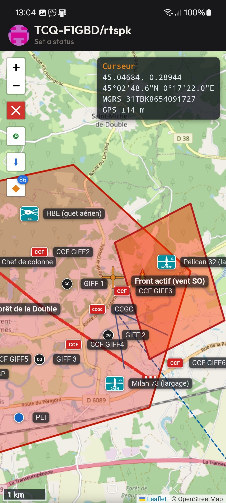
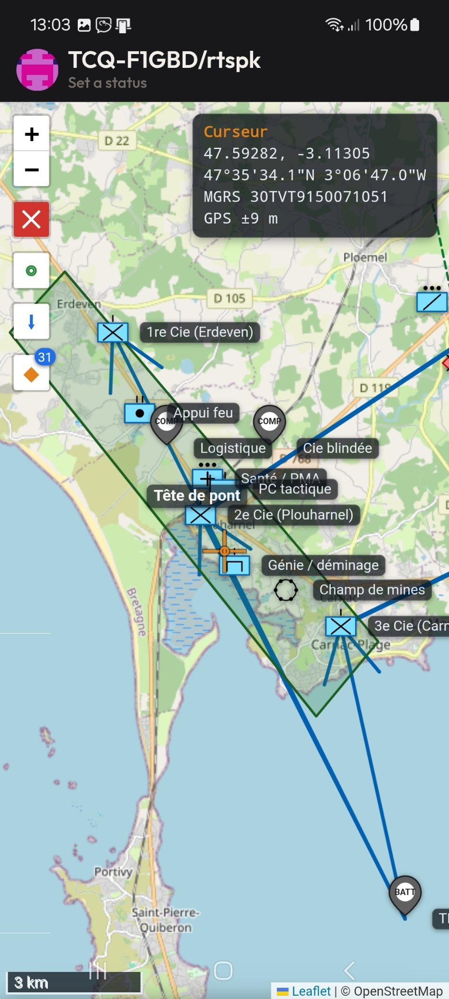

  <em><strong>**Symbologie
SDIS / NEB**</strong> très détaillée et partagée en temps réel sur Zone Op .</em>
</div>

**Enregistrer / Charger — format TCQ.** La situation (symboles + zones + tracés)
s'enregistre et se recharge au format **JSON `carto_lib.overlay`** compatible
TCQ ; au chargement, la carte se **recadre automatiquement** sur la zone. Les
fichiers passent de RTspk Pager à TCQ et inversement.

**Synchro NEM (partage par radio).** Le bouton **🛰️ Synchro NEM** partage toute
la situation vers un ou plusieurs contacts par message **LXMF**, au **protocole
NEM de TCQ** (Numérisation de l'Espace de Mission). À la réception, la carte
s'ouvre et se recadre ; option **« Remplacer à la réception »** (remplacement ou
fusion). Pour ménager un **RNode en Bluetooth** à l'émission, la synchro est
**découpée** en messages d'un seul paquet (`NEMC:`), réassemblés à l'arrivée ; la
réception accepte aussi les synchros `NEM1:` uniques de TCQ. La réception des
synchros découpées côté TCQ nécessite **TCQ v12.60** (transport packet AX.25 / LXMF fiabilisé, dans les deux sens).

**Synchro NEM delta (depuis 1.0.35).** Quand les deux stations sont à jour
(**RTspk 1.0.35 + TCQ v12.61**), la synchro n'échange plus que la **différence**
entre les deux cartes : cartes identiques → accusé de ~20 octets, objet déplacé →
**repositionné sans doublon** (même nom + même symbole = même objet), la
modification la plus récente l'emporte (horodatage). Face à une version plus
ancienne, **repli automatique** en synchro complète.

**Messages FLASH (⚡).** Un bouton **⚡** sur la carte envoie un message court
(90 caractères max) à un ou plusieurs contacts cochés, ou à une **liste de
diffusion** enregistrée. Le message est préfixé par `&`. À la réception d'un
message commençant par `&`, un **dialogue s'ouvre par-dessus la carte** : il
affiche le flash et une ligne de réponse (la croix ✕ ferme et rend la carte). Si
la réponse contient `$GPS`, il est remplacé par les **coordonnées GPS** courantes.
Les flashs tiennent dans un seul paquet (adaptés au RNode Bluetooth).

<div align="center">
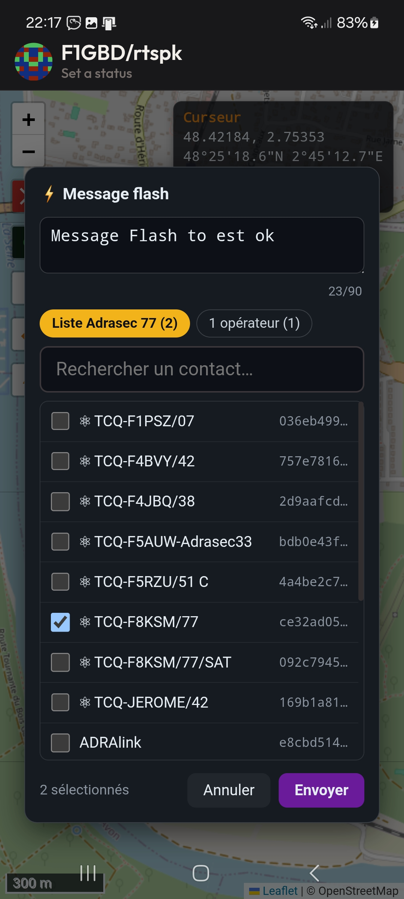

  <em><strong>**Message FLASH**</strong> individuel ou de groupe.</em>
</div>

---

## PING LXMF — vérifier qu'une station répond 📡

Avant de compter sur un correspondant, on veut savoir s'il est là. Le **PING
LXMF** envoie un message court et attend la réponse automatique de l'autre
poste, puis affiche le **temps d'aller-retour**.

Deux façons de le lancer :

- **Fiche contact** — ouvrir le contact, bouton **Ping**. L'état s'affiche sous
  le bouton : `⏳ Ping envoyé…`, puis `🟢 Station disponible — RTT 2,4 s` ou
  `🔴 Pas de réponse après 60 s`.
- **Menu ⋮ de la conversation** — entrée **Ping LXMF**, sans quitter le fil.

**Le protocole est celui de TCQ**, à l'identique — bouton « Test LXMF » de
l'onglet LXMF :

| | |
|---|---|
| Requête | `TEST QUANTUM LXMF - <STATION> - HH:MM:SS` |
| Réponse | `TEST LXMF OK - <STATION> - HH:MM:SS` |

RTspk **répond automatiquement** à toute requête reçue, de TCQ comme d'un autre
RTspk. Les deux messages restent des messages LXMF texte ordinaires : ils
apparaissent dans le fil des deux côtés, rien ne circule en trafic caché. Le
ping fonctionne donc **dans les deux sens** entre TCQ et RTspk.

---

## Photos et images — compatibles TCQ, dans les deux sens 📷

Bouton **+** de la conversation : **Photos** (galerie) ou **Appareil photo**
(prise de vue). L'image est réduite et compressée avant l'envoi, puis présentée
en aperçu avant validation.

**Trois qualités, exactement celles de TCQ :**

| Qualité | Taille max | Format | Usage |
|---|---|---|---|
| Basse | 320 px | WebP q22 | liaison lente, VHF packet |
| Moyenne | 640 px | WebP q66 | compromis courant |
| Haute | 1280 px | WebP q75 | détail, liaison rapide |

L'image est réduite pour **tenir** dans le carré en conservant ses proportions,
et n'est jamais agrandie. Le redessin supprime au passage les **métadonnées
EXIF**, position GPS comprise — utile quand on transmet une photo de terrain.

Côté transport, c'est le champ LXMF standard `FIELD_IMAGE` : ce qu'émet TCQ, et
ce qu'attendent aussi **Sideband**, **Columba** et **MeshChat**. Le transfert
est donc **bidirectionnel** : une photo prise sur le téléphone s'affiche dans
TCQ, et une image envoyée depuis TCQ s'affiche dans la conversation RTspk.

> Sur certains téléphones, le sélecteur du navigateur interne rend un fichier
> illisible. RTspk ouvre donc le sélecteur **côté natif** et décode l'image
> hors du moteur web — c'est transparent à l'usage.

---

## Radar aéronefs — balayage PPI ◉

Bouton **◉** en haut à droite de la carte. Il ouvre un **scope radar plein
écran** — fond noir, cercles de portée, balayage vert — porté à l'écran du
téléphone depuis la
[Montre Micro Radar](https://github.com/f1gbd/F1GBD/tree/master/Montre_MicroRadar).
C'est un écran à part : **rien n'est dessiné sur la carte**.

**Centré sur la position GPS**, relue à chaque interrogation : le scope suit
l'opérateur qui se déplace. Sans point GPS, le centre de la carte prend le
relais ; le bandeau indique la source (`[GPS]` ou `[carte]`) et les coordonnées.

| | |
|---|---|
| Rayon | **0,2°** ≈ 22 km (réglable : 0,1 / 0,2 / 0,35 / 0,5 / 1°) |
| Rafraîchissement | **22 s** (réglable : 15 à 240 s) |
| Balayage | un tour en ~19 s, avec traînée |
| Aéronefs | triangles orientés au cap, étiquette indicatif / vitesse / altitude |

Appui long sur ◉ : réglages — rayon, cadence, balayage, étiquettes, et **filtre
par catégorie** repris de TCQ (bombardiers d'eau Pélican/Canadair/Milan,
hélicoptères Dragon/SAMU, Sécurité Civile, Douane, Gendarmerie, militaires,
autres aéronefs d'État). La reconnaissance se fait par préfixe d'indicatif et
par plage d'adresse ICAO24 militaire — même table que TCQ.

Entre deux interrogations, la position affichée est **extrapolée** à la vitesse
sol sur le cap : l'image reste vivante malgré les 22 s de cadence.

**Source de données : adsb.lol** par défaut (réseau communautaire ADS-B en open
data, sans compte ni quota). **OpenSky** reste disponible avec un compte OAuth2
à saisir dans *Settings → Radar (OpenSky)*, bouton **Tester** à l'appui — au
prix de son quota (400 crédits/jour sans compte, 4000 avec).

> Le radar consomme du réseau : aucune requête n'est émise quand le scope est
> fermé.

## Couche météo — vent et règle des 3×30 🌦

Bouton **🌦 juste sous le bouton radar**, en haut à droite de la carte. Il allume
une couche météo posée **sur la carte elle-même** (contrairement au radar, qui
ouvre un écran séparé). Les données viennent du modèle **AROME de Météo-France**,
servi par **[Open-Meteo](https://open-meteo.com) — gratuit, sans compte ni clé**.
C'est le portage de la couche météo de **TCQ**, avec ses réglages par défaut.

### Ce qui s'affiche

**Champ de vent.** Une flèche par maille de la grille. La **pointe indique où va
le vent** (et non d'où il vient, comme le veut la convention météo) ; la couleur
donne la vitesse — **vert** sous 20 km/h, **orange** de 20 à 30, **rouge** au-delà
— et la longueur croît avec elle. Le chiffre sous la flèche est la vitesse en km/h.

**Zones « règle des 3×30 ».** La règle des trois 30 signale un **danger de feu de
forêt extrême** quand trois conditions sont réunies **en même temps** :

| Critère | Seuil |
|---|---|
| Température | **≥ 30 °C** |
| Vent | **≥ 30 km/h** |
| Humidité relative | **≤ 30 %** |

La maille se colore en **jaune** dès que **2 critères sur 3** sont atteints
(vigilance) et en **rouge** quand **les 3** le sont (danger). Les mailles
débordent légèrement pour se fondre en zones continues. Une légende rappelle en
bas de carte les seuils effectivement en vigueur.

**Bulletin station.** Encadré en haut à gauche : température, humidité, vent et
direction, rafales, pression, et l'état de la règle 3×30 (`2/3`, ou
`⚠️ DANGER`) **au point GPS de l'opérateur** — le centre de la carte prend le
relais tant qu'il n'y a pas de fix.

**Détail d'un point.** Un appui sur la carte près d'une flèche ouvre la fiche du
point : température, humidité, vent, rafales, pression, précipitations, et le
détail des critères 3×30 remplis.

### Réglages (bouton ⚙, ou appui long sur 🌦)

| | Défaut (= TCQ) |
|---|---|
| Modèle | **AROME France HD (~1,5 km)** — aussi AROME ~2,5 km et ARPEGE Europe ~11 km |
| Grille | **6 × 5** colonnes × lignes (max 10 × 10 = 100 points) |
| Taille des flèches | **×1,5** (0,5 = petites … 3,0 = grandes) |
| Seuils 3×30 | **30 °C / 30 km/h / 30 %** — réglables (test, adaptation locale) |
| Rafraîchissement | **15 min** (5 min à 60 min) |
| Calques | champ de vent, zones 3×30, bulletin station — activables séparément |

Le panneau affiche en permanence l'**estimation du budget de requêtes**
(`≈ 31 pts/cycle → ~2 976 requêtes/jour`, zones surveillées comprises) et
avertit au-delà de 10 000.

### Zones à surveiller et alertes 🚨

Au-delà de la lecture d'ambiance, la couche sait **surveiller des secteurs
précis** et prévenir toute seule. Depuis les réglages météo, bouton **🚨 Alertes
météo & zones à surveiller…**.

**Tracer une zone.** Bouton **➕ Tracer une zone** : le panneau s'efface, on
pose les sommets **au doigt** sur la carte (3 minimum). Une barre en bas indique
le nombre de sommets et propose **↶ Point** (retirer le dernier), **✓ Terminer**
et **✕** (abandonner). On donne enfin un nom à la zone — « Forêt de
Fontainebleau », « Massif des Trois Pignons »…

**Ce qui est surveillé.** À chaque interrogation, le **centroïde** de chaque zone
part dans la même requête que la grille : aucune requête supplémentaire par zone
au-delà de ce point. La condition de déclenchement se choisit :

| Condition | Déclenche quand |
|---|---|
| **Règle 3×30 complète** (défaut) | les **3** critères sont réunis |
| **Vigilance** | **au moins 2** critères sur 3 |

**Quand ça déclenche.** La zone passe en **rouge dense avec un contour
clignotant**, son nom se préfixe d'un ⚠️, un **bandeau rouge** barre le haut de
la carte (les boutons descendent pour rester accessibles), et une **sirène
montante type FR-Alert** retentit — volontairement différente de la sirène
bitonale RASEC, pour qu'on sache à l'oreille de quoi il s'agit. Le nombre de
répétitions est réglable, avec un bouton **🔊 Test**.

**Acquitter** : un appui sur le bandeau coupe le son et le clignotement. **La
surveillance continue** — la zone reste suivie et re-signalera un nouveau
franchissement.

**Partage avec TCQ.** Bouton **📤 Envoyer les zones (LXMF)** : on choisit les
destinataires (contacts et nœuds vus, comme pour la synchro NEM) et les zones
partent en message **« ZONE1: »** — exactement le format de TCQ, dans les deux
sens. À la réception, on choisit **Fusionner** (les zones de même nom sont
remplacées, les nouvelles ajoutées), **Remplacer** (tout est écrasé) ou
**Ignorer** ; ce choix peut être automatisé une fois pour toutes.

**Vérifié dans les deux sens** avec **TCQ v12.68** : une zone tracée sur le
téléphone apparaît sur la carte TCQ, et une zone tracée dans TCQ arrive sur le
téléphone avec le choix Fusionner / Remplacer / Ignorer.

> **Côté TCQ, la couche météo doit être allumée pour voir les zones reçues.**
> TCQ les enregistre dès la réception — son journal affiche « Zones d'alerte
> météo reçues de … » — mais il ne les dessine que dans sa couche météo : tant
> que le bouton **🌦️ Météo** de sa carte est éteint, rien n'apparaît. Allumez-le
> et les zones se tracent au premier relevé.

> Le message est émis dans **le plus court des deux formats** que TCQ sait lire :
> base64 + zlib, ou JSON en clair. Sur une ou deux zones le base64 coûte plus
> cher que ce que la compression fait gagner — le brut passe alors en moins
> d'octets sur l'air, ce qui compte en VHF 1200 bauds. Au-delà d'une poignée de
> zones, la compression reprend l'avantage (30 zones : 640 octets contre 2 943).

### Quota Open-Meteo

L'offre gratuite d'Open-Meteo tourne autour de **10 000 requêtes par jour**, et
**chaque point de grille compte pour une requête** — même si toute la grille part
en un seul appel. Une grille 6 × 5 rafraîchie tous les quarts d'heure reste très
en dessous de la limite.

Si le quota est épuisé, l'API répond **HTTP 429** : la couche se met alors en
**pause 30 minutes** au lieu d'insister, exactement comme TCQ. Le bouton
**🩺 Diagnostic Quota** du panneau interroge un point unique et dit où l'on en
est — *quota OK* (la pause éventuelle est levée sur-le-champ), *quota dépassé*
(remise à zéro à 00:00 UTC, soit ~2 h du matin en France), ou *Open-Meteo
injoignable*.

> La couche ne consomme rien quand elle est éteinte. Allumée, elle se rafraîchit
> à la cadence réglée, et au plus une fois toutes les 30 s lorsqu'on déplace ou
> zoome la carte.

---

## Couverture LoRa prévisionnelle 📡

Bouton **📡 antenne**, **sous les réglages météo**, en haut à droite de la carte.
Il répond à la question qu'on se pose en arrivant sur une opération : *d'ici, je
porte jusqu'où ?* — et à sa vraie question jumelle : *si je monte sur la butte
d'à côté, je gagne quoi ?*

Porté de **[lora-mesh-planner](https://github.com/opticgroup/lora-mesh-planner)**,
adapté à la bande européenne et au balayage tous azimuts.


*Les deux couches allumées ensemble, secteur Fontainebleau — Le Châtelet-en-Brie.
En fond, la **tache de couverture** de la station A. Par-dessus, la liaison
**A → relais → B** : 15,87 km en direct pour +9,4 dB seulement, que le relais
proposé à 102 m d'altitude porte à **+17,9 dB** sur son maillon faible. Les
cercles blancs sont les autres emplacements retenus. L'encart en bas à droite
donne le bilan au curseur, la fiche en haut celui du point touché.*

### La carte se colore en quatre niveaux

| Couleur | Marge | Ce que ça vaut sur le terrain |
|---|---|---|
| 🟢 vert foncé | ≥ 20 dB | Liaison confortable, tient malgré la pluie et les masques |
| 🟩 vert clair | 10 – 20 dB | Correcte, marge normale d'exploitation |
| 🟠 orange | 0 – 10 dB | Juste — ça passe, mais le moindre aléa la coupe |
| 🔴 rouge | −6 – 0 dB | Limite : paquets perdus, à ne pas compter dessus |

La **marge** est ce qui reste au-dessus de la sensibilité du récepteur **une
fois provisionnés 10 dB d'évanouissement**. Une marge de 0 dB n'est donc pas la
limite de portée : c'est le point où il ne reste plus que la provision.

La couverture est calculée sur **36 azimuts** (un rayon tous les 10°) et **24
points de relief par rayon** jusqu'à **15 km** — soit 865 points d'altitude.
Tout est réglable.

### Le bilan suit le curseur

Un encart en bas à droite suit le **centre de la carte** — le même point que la
croix centrale et le bandeau de coordonnées. Il se lit sans rien toucher, en
faisant glisser la carte :

```
📡 867.500 MHz · SF9 · 250 kHz
Distance 7.42 km · Az 118°
FSPL 108.6 dB · diffr. 14.5 dB
Reçu -105.1 dBm · seuil -126.5 dBm
Marge +11.4 dB — Correcte
Fresnel : partiellement obstrué (0.31 F1)
```

Un **appui sur la carte** ouvre la même fiche en infobulle, au point touché.

### Les paramètres viennent du RNode

Fréquence, puissance, facteur d'étalement et largeur de bande sont **repris de
l'interface RNode active** de l'application. Rien à ressaisir — et surtout rien
à laisser diverger : une fréquence recopiée à la main finit toujours par ne plus
correspondre à la radio. Sans RNode configuré : **867,500 MHz, SF9, 250 kHz,
17 dBm**.

**Appui long sur 📡** (ou clic droit) ouvre les réglages : fréquence, puissance,
SF, bande, gains et **hauteurs d'antenne**, pertes de câble, marge
d'évanouissement, rayon étudié, finesse du calcul. Un réglage saisi à la main
prime sur la valeur du RNode. Le panneau annonce d'avance **combien de requêtes
d'altitude** le calcul demandera.

### Le modèle

* **Espace libre — ITU-R P.525-3** : `FSPL = 20·log₁₀(d_km) + 20·log₁₀(f_MHz) + 32,44`
* **Zone de Fresnel** : `r = √(n·λ·d₁·d₂ / (d₁+d₂))` — 29,4 m de rayon au milieu
  d'un trajet de 10 km à 867,5 MHz
* **Diffraction sur arête — ITU-R P.526** : une crête ne coupe pas la liaison,
  elle la dégrade progressivement (6 dB quand elle affleure la visée, 14 dB à
  v = 1, 19 dB à v = 2)
* **Courbure terrestre** avec rayon effectif **k = 4/3** : 13,2 m de bombement au
  milieu d'un trajet de 30 km
* **Sensibilité LoRa** : `S = −174 + 10·log₁₀(BW) + NF + SNR_min(SF)` — soit
  −126,5 dBm en SF9/250 kHz et −137,0 dBm en SF12/125 kHz, conforme à la fiche
  du SX1276

Le **relief réel** vient de l'**API d'altitude d'Open-Meteo** — même hôte que la
couche météo, déjà autorisé, toujours **sans clé**. Les altitudes sont mises en
cache : déplacer la carte ne les redemande pas.

### Monter l'antenne rapporte plus que monter la puissance

Sur terrain **parfaitement plat**, un mât de 3 m vers un portatif tenu à 1,5 m
perd déjà **5 dB à 5 km** : ce n'est pas un obstacle, c'est **le sol lui-même**
qui mord dans la zone de Fresnel — il n'en reste que 9 % de dégagée. Les mêmes
5 km avec les deux antennes à 30 m ne perdent **rien du tout**.

Autrement dit : +27 m d'antenne valent ici exactement autant que +5 dB
d'émission — sauf que les 5 dB, on ne les a pas.

### ⚠️ Ce que ce calcul n'est pas

**Une prévision, pas une mesure.** Le relief est échantillonné, **sans bâti ni
végétation** ; le modèle suppose **une arête unique** par trajet ; la marge
d'évanouissement est forfaitaire. À prendre comme une aide au choix d'un point
haut — **sur le terrain, seul un essai radio fait foi**. La légende le rappelle
à l'écran, sous les quatre couleurs.

### Sans réseau

Case **« Tenir compte du relief »** décochée : le tracé se fait en **espace
libre**, **sans une seule requête**. La couverture est alors optimiste — c'est le
cercle théorique — mais elle reste utilisable pour comparer deux SF ou deux
puissances. Si les altitudes ne répondent pas, l'application **retombe d'elle-même
sur ce mode et le dit** plutôt que de ne rien tracer.

### Choisir d'où part le calcul : GPS ou curseur

Le GPS répond *« d'ici, je porte jusqu'où ? »*. Le **curseur** répond *« et si je
montais là-bas ? »* — la question qu'on se pose devant une carte, et qu'on peut
désormais poser sans se déplacer. Le choix est en tête des réglages, avec les
**deux positions affichées côte à côte** : on choisit sur des chiffres, pas sur
un pari.

Une couverture tracée depuis le curseur **le dit** dans l'encart
(*« ◎ Station : centre de la carte »*) — sans quoi on la lirait comme « d'ici »,
et on se tromperait de conclusion. De même, un calcul demandé en GPS **sans
fix** part du centre de la carte et l'annonce, plutôt que de tracer en silence
depuis un point supposé.

### Les paramètres sont à un appui sur l'encart

L'encart de bilan est ce que l'on regarde : c'est donc de là qu'on veut corriger
une hauteur d'antenne ou un facteur d'étalement. **Un appui dessus** ouvre les
mêmes réglages que l'appui long sur le bouton — qui, lui, ne se devine pas.

> Rien n'est calculé ni demandé au réseau quand la couche est éteinte.

### Le relief, le quota, et pourquoi OSM n'y suffit pas

**OpenStreetMap ne fournit aucune altitude** : c'est une carte de voies et de
nœuds, sans modèle de terrain. Le relief vient de l'**API d'altitude
d'Open-Meteo**, adossée au **Copernicus DEM GLO-90** — 90 m de résolution,
mondial, sans clé.

Open-Meteo **facture au point, pas à l'appel** : une requête de 100 coordonnées
pèse 100. Les plafonds gratuits sont de **600 points par minute**, 5 000 par
heure, 10 000 par jour. Les réglages par défaut sont calibrés pour qu'un calcul
complet tienne dans une minute : **385 points** pour une couverture, **429**
pour une recherche de relais.

Trois conséquences pratiques :

* les altitudes sont **conservées d'une session à l'autre** — sur une opération
  on travaille longtemps sur le même secteur, et la deuxième recherche dans la
  même zone ne coûte souvent rien ;
* si la minute est déjà chargée, l'application **patiente et l'annonce** au lieu
  de se faire refuser ;
* si le quota est malgré tout épuisé (HTTP 429), une **pause de 30 minutes** est
  armée et le message le dit clairement. *Le relief n'est pas manquant : il est
  rationné.* Ce qui est en cache reste servi.

Monter la finesse dans ⚙ augmente le nombre de points demandés — le panneau
annonce d'avance combien, et ce qu'il reste dans la minute.

Depuis, **[Open Topo Data](https://www.opentopodata.org/)** est la source
principale, et le calcul est bien plus à l'aise : ce service compte **à l'appel**
(100 points), avec 1 000 appels par jour — soit ~100 000 points quotidiens contre
10 000 — et sert **EU-DEM en 25 m** sur l'Europe au lieu du Copernicus 90 m.

L'ordre est **EU-DEM 25 m → SRTM 30 m → Open-Meteo 90 m**, avec repli automatique
sur réseau coupé, refus CORS, quota atteint ou absence de couverture. Un point
sans donnée n'est jamais pris pour du niveau de la mer : il passe à la source
suivante.

Le bouton **🩺 Tester les sources**, dans les réglages de la couverture,
interroge un point sur chacune et dit laquelle répond depuis votre appareil —
avec l'altitude et le temps de réponse. Le bouton **🗑** oublie les altitudes
conservées, pour forcer un nouveau relevé si une meilleure source devient
joignable.

Le bouton **🩺** figure dans **les deux panneaux** — couverture (📡) et relais
(🗼) — puisque les deux couches partagent le même relief. Chacun annonce aussi
quelle source sert en ce moment, et le signale quand le repli a joué.

La source retenue **périme au bout de 20 minutes** : une coupure passagère ne
condamne pas l'application à rester sur le 90 m alors que le 25 m est redevenu
joignable. Un test 🩺 concluant rend la main immédiatement à la meilleure source.

> **Attribution.** EU-DEM : produit à partir de données Copernicus, financé par
> l'Union européenne. SRTM : NASA. Open Topo Data : Andrew Nisbet.
---

## Où poser un relais RRLoRa 🗼

Un quatrième bouton, un **pylône**, sous celui de la couverture. Il répond à la
question d'après : *deux stations ne s'entendent pas — où faut-il poser le
relais ?*

**[RRLoRa](https://github.com/f1gbd/F1GBD/tree/master/RRLora)** est un **nœud
Transport Reticulum autonome** sur Heltec WiFi LoRa 32 V3/V4 : il reçoit, décide
et retransmet seul, sans PC. Conséquence directe pour le calcul : A → relais → B
n'est pas un bond radio unique mais **deux bonds indépendants**, qui doivent se
boucler chacun de leur côté. C'est le **maillon le plus faible** qui fait la
liaison, et c'est lui que l'application affiche.

### Comment on s'en sert

1. **A est prérempli** depuis la même source que la couverture — GPS ou curseur.
   Touchez « A » pour le reposer ailleurs.
2. **Touchez la carte** pour poser **B**.
3. **↻** cherche. **✋** évalue à la place un point que vous désignez vous-même.

Le résultat s'affiche en bas :

```
A ↔ B  20.02 km — direct −4.4 dB : ne passe pas.
Relais proposé  48.47333, 2.72000 — 309 m
A → relais 5.93 km +37.3 dB · relais → B 14.08 km +29.8 dB
Maillon faible +29.8 dB — Confortable
```

Cinq autres emplacements restent marqués sur la carte : touchez-en un pour lire
son bilan. Si **aucun relais unique** ne referme la liaison, une **chaîne de
deux** est cherchée et proposée.

### Comment il cherche

1. **Profil réel A–B** : faut-il seulement un relais ? Si la liaison directe
   passe, l'application le dit avant toute autre chose.
2. **Grille d'altitudes sur le corridor A–B**, en une seule salve — chaque point
   est évalué comme relais possible. C'est un **dégrossissage** : les profils y
   sont interpolés entre mailles, une crête étroite peut passer entre elles.
3. Les **six meilleurs sites** sont recalculés sur des **profils d'altitude
   réels**. Le classement final ne repose que sur ceux-là.
4. Faute de relais unique, une **chaîne de deux** est cherchée parmi les
   meilleurs sites du dégrossissage.

Le modèle de propagation n'est pas redéfini : c'est celui de la couche de
couverture, cache d'altitudes compris.

### Deux choses que ce calcul apprend

**Le mât sert à voir par-dessus, pas à porter plus loin.** Sur un site obstrué,
passer le mât du relais de 6 m à 30 m rapporte une douzaine de décibels. Sur un
trajet déjà dégagé, il ne rapporte **rien du tout**. La hauteur achète du
dégagement, pas de la puissance.

**Un creux bien placé reste un mauvais site.** Un relais posé au fond d'un col,
pile dans l'axe, fait moins bien qu'un relais sur l'épaule haute à côté. La
raison est dans la formule de Fresnel : `v = h·√(2(d₁+d₂)/λd₁d₂)` diverge quand
`d₁ → 0`, donc **un obstacle proche du relais coûte bien plus cher que le même
obstacle à mi-parcours**. Le terrain qui remonte juste à côté du mât pénalise un
seul des deux bonds — et c'est le maillon faible qui décide.

### Le PA du V4.3 ne fait pas ce qu'on croit

Le firmware V4.3 pilote un FEM KCT8103L, **11 dB mesurés au banc**. Ces 11 dB
n'agissent qu'à l'**émission du relais**. Or, pour du trafic à double sens,
chaque bond est gouverné par le **plus faible des deux émetteurs** — donc par la
station, jamais par le relais.

**Le PA ne rattrape pas une station qui n'atteint pas le relais.** Le calcul
retient `min(Ptx)` sur chaque bond, et le panneau le dit quand vous l'activez,
plutôt que de vous laisser compter sur un gain qui n'arrivera pas. Il compte en
revanche pleinement pour de l'**alerte à sens unique**, relais → station.

### Réglages (appui long sur 🗼)

Hauteur et gain d'antenne du relais (**6 m, 3 dBi** par défaut), hauteurs des
deux stations, PA V4.3, sens de la liaison, finesse du corridor. La **radio** —
fréquence, SF, bande, puissance — est reprise telle quelle de la couche de
couverture : RRLoRa impose les mêmes réglages sur tous les nœuds du réseau, « un
seul écart et rien ne passe ».

> Sans altitudes, la recherche ne se fait pas : le relief **est** le sujet.
> L'application le dit au lieu de proposer un résultat en espace libre qui
> conclurait « n'importe où convient ».

### ⚠️ La même réserve que la couverture

Relief échantillonné, **ni bâti ni végétation**, une arête unique par trajet.
Le calcul dit **où aller regarder** — il ne dispense pas d'y monter. Un site
retenu se vérifie sur place, à la radio.


---

## Utilisation de la fonction RASEC-ALERT

Depuis un autre nœud Reticulum/LXMF (autre RTspk Pager, Ratspeak, MeshChat…),
envoyer un **message** vers l'adresse LXMF de l'appareil :

| Commande | Effet |
|---|---|
| `#ra ADRASEC77` | Déclenche l'alerte (écran clignotant + sirène + ACK). |
| `#rapass <ancien> <nouveau>` | Change le code d'activation (persisté). |
| `#b <n>` | Règle le nombre de répétitions de la sirène. `#b 0` = alarme **continue** jusqu'à acquittement. Plage : 0–20. |

- Code d'activation par défaut : **`ADRASEC77`** (modifiable via `#rapass`).
- **Acquittement** : toucher/cliquer l'écran, ou Échap / Entrée / Espace.
- L'accusé renvoyé (« Pager OK - alerte bien recue ») ne contient jamais le code,
  pour éviter toute boucle d'auto-déclenchement.
- Le message déclencheur reste affiché normalement dans la conversation.

> **Audio (mobile).** Selon Android, le son peut ne démarrer qu'après une
> première interaction avec l'application (déverrouillage du contexte audio) ;
> l'écran d'alerte, lui, s'affiche toujours.

---

## Listes de diffusion (envoi groupé)


L'écran **Diffusion** (menu latéral, ou menu « … » sur mobile) permet d'envoyer
le même message — ou une alerte `#ra ADRASEC77` — à **plusieurs opérateurs à la
fois**, séquentiellement.

1. **Créer une liste** : dans *Nouvelle liste*, donner un nom, cocher les
   opérateurs (les contacts et stations annoncées dont l'indicatif contient
   **`TCQ`** sont proposés), puis **Enregistrer la liste**.
2. **Envoyer** : dans *Listes enregistrées* (en haut de l'écran), toucher une
   liste. Une fenêtre affiche le message **pré-rempli `#ra ADRASEC77`**
   (modifiable, pour une alerte ou un message libre) → **Envoyer**.
3. Le message part **un opérateur après l'autre**, avec une ligne de progression ;
   un récapitulatif indique le nombre d'envois réussis.

**Depuis l'annuaire (1.0.42).** Le bouton **Liste**, à droite du champ de
recherche de l'écran **Annuaire**, ouvre directement l'envoi à une liste — sans
passer par l'écran Diffusion. S'il n'y a qu'une seule liste enregistrée, le
dialogue d'envoi s'ouvre sans étape de choix.

**Modifier une liste (1.0.42).** Chaque liste enregistrée porte trois boutons
empilés : **Envoyer**, **Éditer**, **Suppr.** *Éditer* recharge la liste dans le
formulaire du bas — nom repris, membres cochés. Cochez pour **ajouter** un
opérateur, décochez pour le **retirer**, puis *Enregistrer les modifications*.
Le renommage remplace la liste en place, sans créer de doublon.

> Un membre dont le contact a disparu des contacts (supprimé, indicatif changé)
> reste affiché et coché pendant l'édition, avec le nom mémorisé dans la liste :
> vous voyez ce que vous retirez, rien ne disparaît en silence.

Les listes sont **sauvegardées sur l'appareil** et réutilisables à volonté.

<div align="center">
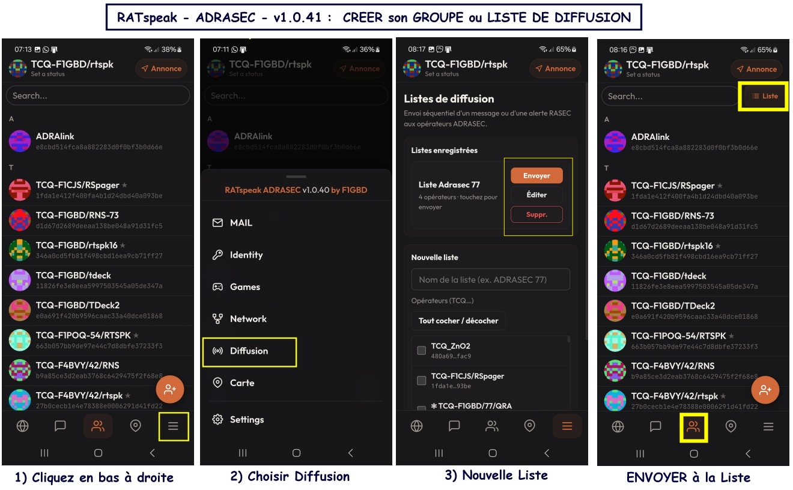

  <em><strong>**Liste de Diffusion**</strong> pour l'envoi de messages aux membres d'une équipe.</em>
</div>


---

## Bouton MAIL — message d'urgence ADRAlink

Le bouton **MAIL**, en tête du menu (menu « … » sur téléphone), permet d'envoyer
un **email à ses proches par radio**, via une passerelle
[ADRAlink](https://github.com/f1gbd) (acheminement Winlink assuré par
l'ADRASEC). C'est le même format et le même protocole que le client ADRAlink
pour PC.

<div align="center">
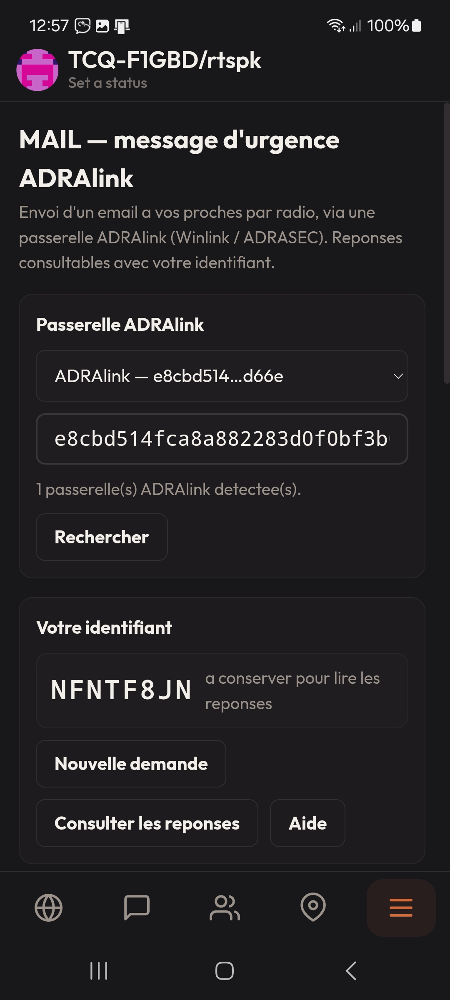
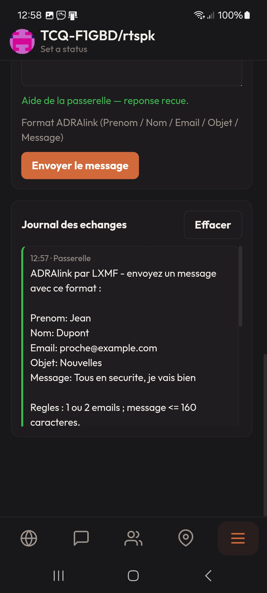

  <em><strong>**MAIL d'Urgence via ADRAlink**</strong> - Envoi/Réception d'Emails avec Identification.</em>
</div>

1. **Passerelle** : *Rechercher* liste les stations annoncées dont le nom
   contient « ADRAlink ». L'adresse choisie est mémorisée ; elle peut aussi être
   collée à la main.
2. **Nouvelle demande** : la passerelle renvoie un **identifiant de 8
   caractères**, à conserver — c'est lui qui donne accès aux réponses.
3. **Formulaire** : Prénom, Nom, email du proche (un second facultatif), objet,
   message de 160 caractères maximum. Les quatre premiers champs sont
   obligatoires.
4. **Consulter les réponses** interroge la passerelle ; la réponse du proche
   s'affiche dans le journal des échanges, en bas de l'écran.

En LoRa, comptez jusqu'à deux minutes entre l'envoi et l'accusé de réception :
c'est le temps de propagation normal (recherche de chemin + temps d'antenne).

---

## Veille alerte RASEC (réception application fermée)

Le pager continue de recevoir les alertes `#ra` lorsque l'application n'est plus
à l'écran. L'alerte passe alors par un **canal Android dédié** : son d'**alarme**
(audible même en mode silencieux), vibration longue, contournement du mode « Ne
pas déranger », répété autant de fois que le règlage `#b` l'indique. La sirène
Web Audio, elle, ne joue que lorsque l'application est ouverte.


<div align="center">
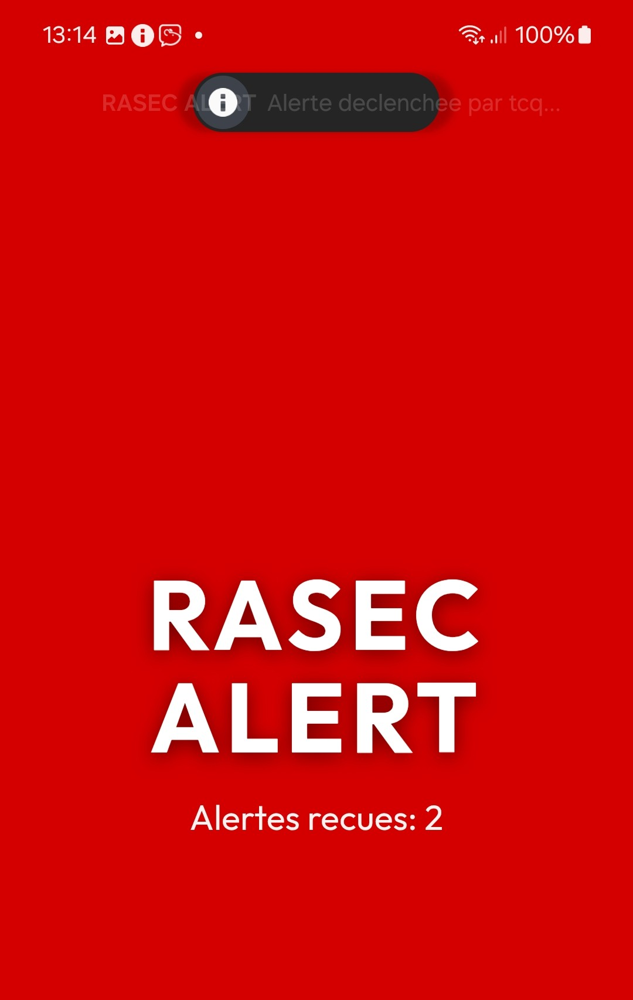
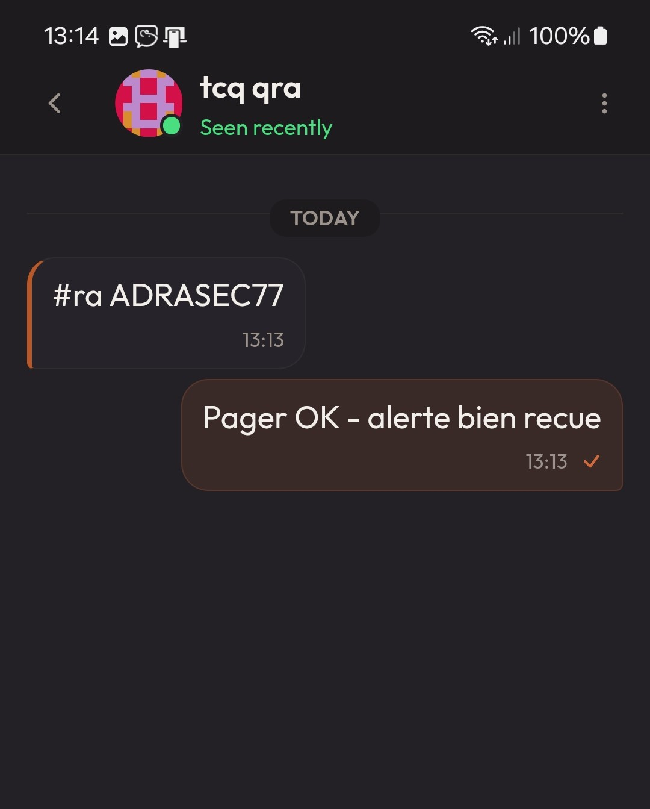


  <em><strong>**RASEC ALERT**</strong> par VISUEL et SONNERIE.</em>
</div>

Le **bouton Retour** ne ferme plus l'application tant que la veille est armée :
il la met en arrière-plan, en conservant la liaison BLE du RNode. Pour quitter
réellement, utilisez l'action **« Arrêter la veille »** de la notification
permanente. Après un « Tout fermer » depuis les récents ou un redémarrage du
téléphone, l'application se relance d'elle-même pour réarmer la veille.

### Trois autorisations à accorder

Sans elles, la veille tient quelques minutes puis s'éteint silencieusement :

| Autorisation | Où | Sans elle |
|---|---|---|
| Notifications | demandée au 1er lancement | aucune alerte visible ni sonore |
| Batterie sans restriction | demandée au 1er lancement | Doze suspend la réception écran éteint |
| Afficher par-dessus les autres applications | *Paramètres → Applications → RTspk Pager* | pas de réarmement automatique après « Tout fermer » ou redémarrage |

L'accès « Ne pas déranger » est facultatif : il n'est utile que si vous utilisez
ce mode et voulez que l'alerte passe malgré tout.

> **Surcouches constructeur.** Xiaomi, Huawei et Samsung gèrent la mémoire de
> façon agressive. Si la veille tombe au bout de quelques heures, ajoutez
> l'application aux « applications protégées » de la surcouche.

---

## Mise à jour

*Settings → (bas de page) → « Check for updates »* interroge les *Releases* de ce
dépôt. Installer manuellement la dernière version publiée ici : il n'y a pas de
mise à jour automatique (raisons de confidentialité).

---

## Licence et code source

RTspk Pager dérive de **Ratspeak**, distribué sous **GNU AGPL-3.0-or-later**.
Conformément à cette licence, le **code source correspondant** de cette version
modifiée est mis à disposition :

- Sources d'origine : https://github.com/ratspeak/Ratspeak (+ les bibliothèques
  frères rsReticulum / rsLXMF / rsLXST / lrgp-rs).
- Modifications RASEC-ALERT (méthode patch) : le fichier
  **`ratspeak-rasec-alert-f1gbd.patch`** fourni dans ce dossier s'applique sur une
  copie propre des sources Ratspeak (`git apply ratspeak-rasec-alert-f1gbd.patch`).
- Procédure de build de l'APK sous Windows : voir `BUILD-APK-WINDOWS.md`.

En reversant vos modifications, merci de respecter les termes de l'AGPL-3.0.

---

## Crédits

- Application **Ratspeak** — Ratspeak Contributors.
- Basé sur **Reticulum / LXMF**.
- Portage et build de l'option **RASEC-ALERT** : **F1GBD — ADRASEC 77 / FNRASEC**.

73 !
