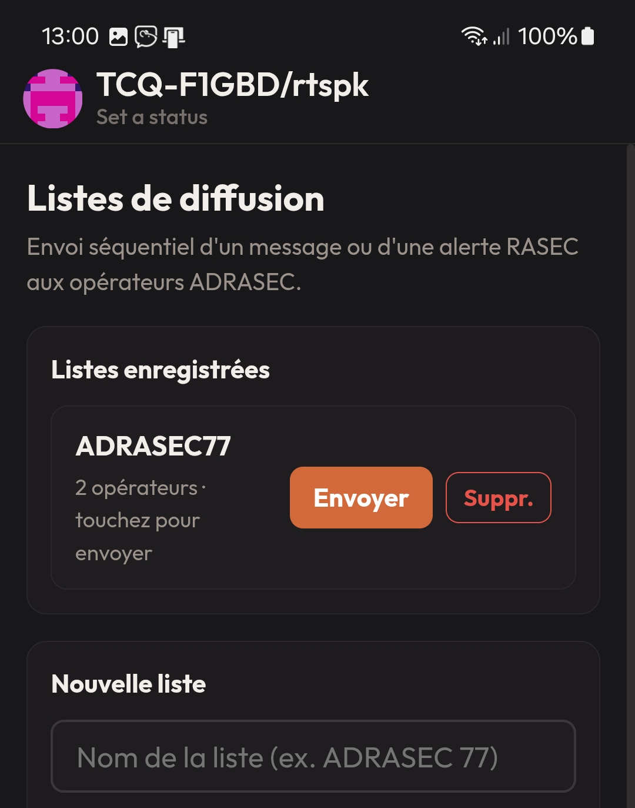

# RTspk Pager — Ratspeak édition RASEC-ALERT (F1GBD/ADRASEC 77)

**Récepteur d'alerte (pager) pour réseau Reticulum / LXMF**, basé sur
l'application [Ratspeak](https://github.com/ratspeak/Ratspeak) avec l'ajout de
la fonction **RASEC-ALERT** portée du MeshPager / de l'édition Saitama T-Deck.

Un message **LXMF** reçu contenant le code d'activation déclenche sur l'appareil :
un **écran plein écran clignotant « RASEC ALERT »** (avec compteur d'alertes),
une **sirène bitonale** synthétisée (aucun fichier son requis), et un **accusé
de réception automatique** renvoyé à l'expéditeur. Sur mobile, une **notification
native** est également émise.

**RTspk Pager** est compatible avec le logiciel **TCQ** (désactiver le mode quantique)

> Application Android — fonctionne sur téléphone/tablette et sur le LilyGO T-Deck
> (Android). Version desktop possible en compilant depuis les sources.

---

## Téléchargement et installation (Android)

1. Télécharger l'APK (lien direct) : **[RTspk_pager-1.0.37.apk](https://github.com/f1gbd/F1GBD/releases/download/1.0.37/RTspk_pager-1.0.37.apk)**.
2. Sur le téléphone, autoriser l'installation depuis cette source (« sources
   inconnues » / « Installer des applications inconnues »).
3. Ouvrir le fichier APK et installer.
4. Au premier lancement, créer/importer une identité Reticulum et configurer au
   moins une interface (LoRa/RNode, TCP, WiFi/BLE…) dans *Settings*.

---

## Nouveautés

**1.0.37 — Synchro NEM DELTA (n'échange que la différence).** La synchro NEM ne retélécharge plus toute la carte : RTspk compare les deux cartes et ne transmet **que ce qui a changé**. Cartes déjà identiques → simple accusé de **~20 octets** (jusqu'à **~97 % de données en moins** sur VHF 1200 bauds). Un objet déplacé **glisse à sa nouvelle position au lieu de se dupliquer** (même nom + même symbole = même objet ; la modif la plus récente gagne). **Repli automatique** en synchro complète si le correspondant est en version antérieure. ✅ Delta de bout en bout avec **TCQ v12.63** ; compatible en repli avec les versions plus anciennes.

**1.0.34 — Balise de position & synchro NEM fiabilisée.** Appui long sur le bouton de recentrage GPS (◎) : pose ton symbole **SATER:TEAM** à ta position, avec ton indicatif en label. Synchro NEM stabilisée et **bidirectionnelle** (émission + réception fiables sur VHF packet).

**1.0.33 — Messages FLASH sur la carte.** Bouton **⚡** pour envoyer un message
court (**90 car.**) à un ou plusieurs contacts (ou une liste de diffusion), préfixé
`&`. À la réception d'un `&`, un dialogue s'ouvre par-dessus la carte pour lire et
répondre ; `$GPS` dans la réponse insère la position. Voir « Cartographie & synchro
NEM ».

  <em><strong>"RTspk FLASH</strong> — message éclair, carte en direct."</em>

**1.0.32 — Carte tactique et synchro NEM.** Cartographie OpenStreetMap
embarquée **Live et Off-grid** (cache des tuiles hors réseau), **symbologie
SDIS / NEB** de TCQ (118 symboles), enregistrement/chargement au **format JSON
compatible TCQ**, et **synchro NEM** : partage de toute la situation par radio
(LXMF), interopérable avec TCQ. Voir la section « Cartographie & synchro NEM ».

  <em><strong>Carte Tactique partagée en équipe **"synchro NEM"**</strong> en Mission Opérationnelle sur le terrain.</em>

  <em><strong>**Symbologie
SDIS / NEB**</strong> de TCQ (118 symboles) .</em>

**1.0.31 — Veille alerte et bouton MAIL.** Deux ajouts majeurs pour l'usage
en pager d'astreinte : une **veille alerte** qui continue de recevoir en LoRa
application fermée, et un bouton **MAIL** qui envoie un email par radio via une
passerelle ADRAlink. Voir les deux sections dédiées plus bas.

**1.0.27 — Listes de diffusion.** Envoi d'un message ou d'une alerte RASEC à
plusieurs opérateurs ADRASEC en une fois (voir plus bas).

**1.0.26 — Préréglage radio par défaut « France (868 MHz) ».** À la création
d'une interface LoRa/RNode, les paramètres par défaut sont : **867,5 MHz · SF 8 ·
125 kHz · CR 5 · TX 18 dBm**, avec limite d'airtime réglementaire (**1,5 % /
heure**, **33 % / 15 s**). Tout reste modifiable dans *Settings → interface LoRa*.

Un **écran de démarrage** (splash) aux couleurs RATSPEAK ADRASEC s'affiche au
lancement.

---

## Transmission LXMF par radio VHF — packet (VR-N76) 📻

**La vraie valeur ajoutée : une messagerie LXMF entièrement autonome — sans
Internet, sans réseau cellulaire, sans aucune infrastructure — sur une simple
radio VHF en mode packet.**

RTspk Pager (téléphone) et **TCQ** (poste fixe) échangent tous leurs messages
**LXMF / Reticulum** directement **sur les ondes VHF en packet** (TNC KISS,
liaison AX.25), typiquement avec un **VGC VR-N76** (TNC Bluetooth intégré). Sur
ce lien radio passe **tout** : messagerie LXMF, **alertes RASEC**, **messages
FLASH**, et la **synchro cartographique NEM** (symboles SDIS/NEB, zones, tracés,
relevés SATER). C'est la solution idéale pour l'**ADRASEC / le secours en zone
blanche** ou en cas de coupure d'infrastructure.

Le téléphone parle à la radio en **Bluetooth KISS** ; la radio transmet les
trames Reticulum sur la fréquence VHF ; la station TCQ (VR-N76 sur port KISS)
reçoit, affiche et répond — la liaison est **bidirectionnelle** et porte à
plusieurs kilomètres selon le relief et les antennes.

> **⚠️ Compatibilité — utilisez TCQ v12.60 (ou plus récent).**
> Le transport **packet AX.25 / LXMF** a été fiabilisé pour la radio lente et
> semi-duplex : découpage/réassemblage NEM, résolution de chemin robuste, envoi
> opportuniste sans temps morts. **TCQ v12.60** est la version de référence pour
> un échange packet radio ↔ RTspk Pager **fiable et rapide dans les deux sens**.
>
> **Synchro NEM delta (RTspk 1.0.37).** L'échange de la seule *différence* entre
> les deux cartes — cartes identiques réglées en ~20 octets, objet déplacé
> repositionné sans doublon — nécessite **TCQ v12.61** aux deux extrémités. Face
> à une version plus ancienne, la synchro **retombe automatiquement en transfert
> complet** : rien ne casse, on perd seulement le gain de débit du delta.

---

## Cartographie & synchro NEM

Icône **Carte** dans la barre du bas.

**Carte OSM Live et Off-grid.** Carte OpenStreetMap temps réel avec position
**GPS** (marqueur + cercle de précision) et bouton *recentrer*. Chaque tuile
affichée est mise en **cache** dans l'appareil : la zone déjà vue reste
disponible **hors réseau**. Le bouton **⬇ Télécharger la zone** pré-charge la
vue visible (zoom courant + 2 niveaux) pour une utilisation off-grid ; appui
long = vider le cache. **Curseur central** avec coordonnées **décimal / DMS /
MGRS** en haut à droite et **échelle** métrique en bas.

**Symbologie SDIS / NEB (comme TCQ).** 118 symboles issus de `carto_lib`
(unités OTAN/NEB, graphiques tactiques, engins et personnels SDIS, moyens
aériens, sinistres, circulation, moyens, événements, zones de secours, SATER).
Palette classée + recherche : toucher un symbole le pose au curseur, on le
**glisse** pour ajuster, **clic droit / menu** pour supprimer ou renommer. Zones
(polygones), lignes et flèches rendues à l'identique du format TCQ.

  <em><strong>**Symbologie
SDIS / NEB**</strong> très détaillée et partagée en temps réel sur Zone Op .</em>

**Enregistrer / Charger — format TCQ.** La situation (symboles + zones + tracés)
s'enregistre et se recharge au format **JSON `carto_lib.overlay`** compatible
TCQ ; au chargement, la carte se **recadre automatiquement** sur la zone. Les
fichiers passent de RTspk Pager à TCQ et inversement.

**Synchro NEM (partage par radio).** Le bouton **🛰️ Synchro NEM** partage toute
la situation vers un ou plusieurs contacts par message **LXMF**, au **protocole
NEM de TCQ** (Numérisation de l'Espace de Mission). À la réception, la carte
s'ouvre et se recadre ; option **« Remplacer à la réception »** (remplacement ou
fusion). Pour ménager un **RNode en Bluetooth** à l'émission, la synchro est
**découpée** en messages d'un seul paquet (`NEMC:`), réassemblés à l'arrivée ; la
réception accepte aussi les synchros `NEM1:` uniques de TCQ. La réception des
synchros découpées côté TCQ nécessite **TCQ v12.60** (transport packet AX.25 / LXMF fiabilisé, dans les deux sens).

**Synchro NEM delta (depuis 1.0.37).** Quand les deux stations sont à jour
(**RTspk 1.0.37 + TCQ v12.61**), la synchro n'échange plus que la **différence**
entre les deux cartes : cartes identiques → accusé de ~20 octets, objet déplacé →
**repositionné sans doublon** (même nom + même symbole = même objet), la
modification la plus récente l'emporte (horodatage). Face à une version plus
ancienne, **repli automatique** en synchro complète.

**Messages FLASH (⚡).** Un bouton **⚡** sur la carte envoie un message court
(90 caractères max) à un ou plusieurs contacts cochés, ou à une **liste de
diffusion** enregistrée. Le message est préfixé par `&`. À la réception d'un
message commençant par `&`, un **dialogue s'ouvre par-dessus la carte** : il
affiche le flash et une ligne de réponse (la croix ✕ ferme et rend la carte). Si
la réponse contient `$GPS`, il est remplacé par les **coordonnées GPS** courantes.
Les flashs tiennent dans un seul paquet (adaptés au RNode Bluetooth).

  <em><strong>**Message FLASH**</strong> individuel ou de groupe.</em>

---

## Utilisation de la fonction RASEC-ALERT

Depuis un autre nœud Reticulum/LXMF (autre RTspk Pager, Ratspeak, MeshChat…),
envoyer un **message** vers l'adresse LXMF de l'appareil :

| Commande | Effet |
|---|---|
| `#ra ADRASEC77` | Déclenche l'alerte (écran clignotant + sirène + ACK). |
| `#rapass <ancien> <nouveau>` | Change le code d'activation (persisté). |
| `#b <n>` | Règle le nombre de répétitions de la sirène. `#b 0` = alarme **continue** jusqu'à acquittement. Plage : 0–20. |

- Code d'activation par défaut : **`ADRASEC77`** (modifiable via `#rapass`).
- **Acquittement** : toucher/cliquer l'écran, ou Échap / Entrée / Espace.
- L'accusé renvoyé (« Pager OK - alerte bien recue ») ne contient jamais le code,
  pour éviter toute boucle d'auto-déclenchement.
- Le message déclencheur reste affiché normalement dans la conversation.

> **Audio (mobile).** Selon Android, le son peut ne démarrer qu'après une
> première interaction avec l'application (déverrouillage du contexte audio) ;
> l'écran d'alerte, lui, s'affiche toujours.

---

## Listes de diffusion (envoi groupé)

L'écran **Diffusion** (menu latéral, ou menu « … » sur mobile) permet d'envoyer
le même message — ou une alerte `#ra ADRASEC77` — à **plusieurs opérateurs à la
fois**, séquentiellement.

1. **Créer une liste** : dans *Nouvelle liste*, donner un nom, cocher les
   opérateurs (les contacts et stations annoncées dont l'indicatif contient
   **`TCQ`** sont proposés), puis **Enregistrer la liste**.
2. **Envoyer** : dans *Listes enregistrées* (en haut de l'écran), toucher une
   liste. Une fenêtre affiche le message **pré-rempli `#ra ADRASEC77`**
   (modifiable, pour une alerte ou un message libre) → **Envoyer**.
3. Le message part **un opérateur après l'autre**, avec une ligne de progression ;
   un récapitulatif indique le nombre d'envois réussis.

Les listes sont **sauvegardées sur l'appareil** et réutilisables à volonté.

  <em><strong>**Liste de Diffusion**</strong> pour l'envoi de messages aux membres d'une équipe.</em>

---

## Bouton MAIL — message d'urgence ADRAlink

Le bouton **MAIL**, en tête du menu (menu « … » sur téléphone), permet d'envoyer
un **email à ses proches par radio**, via une passerelle
[ADRAlink](https://github.com/f1gbd) (acheminement Winlink assuré par
l'ADRASEC). C'est le même format et le même protocole que le client ADRAlink
pour PC.

  <em><strong>**MAIL d'Urgence via ADRAlink**</strong> - Envoi/Réception d'Emails avec Identification.</em>

1. **Passerelle** : *Rechercher* liste les stations annoncées dont le nom
   contient « ADRAlink ». L'adresse choisie est mémorisée ; elle peut aussi être
   collée à la main.
2. **Nouvelle demande** : la passerelle renvoie un **identifiant de 8
   caractères**, à conserver — c'est lui qui donne accès aux réponses.
3. **Formulaire** : Prénom, Nom, email du proche (un second facultatif), objet,
   message de 160 caractères maximum. Les quatre premiers champs sont
   obligatoires.
4. **Consulter les réponses** interroge la passerelle ; la réponse du proche
   s'affiche dans le journal des échanges, en bas de l'écran.

En LoRa, comptez jusqu'à deux minutes entre l'envoi et l'accusé de réception :
c'est le temps de propagation normal (recherche de chemin + temps d'antenne).

---

## Veille alerte RASEC (réception application fermée)

Le pager continue de recevoir les alertes `#ra` lorsque l'application n'est plus
à l'écran. L'alerte passe alors par un **canal Android dédié** : son d'**alarme**
(audible même en mode silencieux), vibration longue, contournement du mode « Ne
pas déranger », répété autant de fois que le règlage `#b` l'indique. La sirène
Web Audio, elle, ne joue que lorsque l'application est ouverte.

  <em><strong>**RASEC ALERT**</strong> par VISUEL et SONNERIE.</em>

Le **bouton Retour** ne ferme plus l'application tant que la veille est armée :
il la met en arrière-plan, en conservant la liaison BLE du RNode. Pour quitter
réellement, utilisez l'action **« Arrêter la veille »** de la notification
permanente. Après un « Tout fermer » depuis les récents ou un redémarrage du
téléphone, l'application se relance d'elle-même pour réarmer la veille.

### Trois autorisations à accorder

Sans elles, la veille tient quelques minutes puis s'éteint silencieusement :

| Autorisation | Où | Sans elle |
|---|---|---|
| Notifications | demandée au 1er lancement | aucune alerte visible ni sonore |
| Batterie sans restriction | demandée au 1er lancement | Doze suspend la réception écran éteint |
| Afficher par-dessus les autres applications | *Paramètres → Applications → RTspk Pager* | pas de réarmement automatique après « Tout fermer » ou redémarrage |

L'accès « Ne pas déranger » est facultatif : il n'est utile que si vous utilisez
ce mode et voulez que l'alerte passe malgré tout.

> **Surcouches constructeur.** Xiaomi, Huawei et Samsung gèrent la mémoire de
> façon agressive. Si la veille tombe au bout de quelques heures, ajoutez
> l'application aux « applications protégées » de la surcouche.

---

## Mise à jour

*Settings → (bas de page) → « Check for updates »* interroge les *Releases* de ce
dépôt. Installer manuellement la dernière version publiée ici : il n'y a pas de
mise à jour automatique (raisons de confidentialité).

---

## Licence et code source

RTspk Pager dérive de **Ratspeak**, distribué sous **GNU AGPL-3.0-or-later**.
Conformément à cette licence, le **code source correspondant** de cette version
modifiée est mis à disposition :

- Sources d'origine : https://github.com/ratspeak/Ratspeak (+ les bibliothèques
  frères rsReticulum / rsLXMF / rsLXST / lrgp-rs).
- Modifications RASEC-ALERT (méthode patch) : le fichier
  **`ratspeak-rasec-alert-f1gbd.patch`** fourni dans ce dossier s'applique sur une
  copie propre des sources Ratspeak (`git apply ratspeak-rasec-alert-f1gbd.patch`).
- Procédure de build de l'APK sous Windows : voir `BUILD-APK-WINDOWS.md`.

En reversant vos modifications, merci de respecter les termes de l'AGPL-3.0.

---

## Crédits

- Application **Ratspeak** — Ratspeak Contributors.
- Basé sur **Reticulum / LXMF**.
- Portage et build de l'option **RASEC-ALERT** : **F1GBD — ADRASEC 77 / FNRASEC**.

73 !
