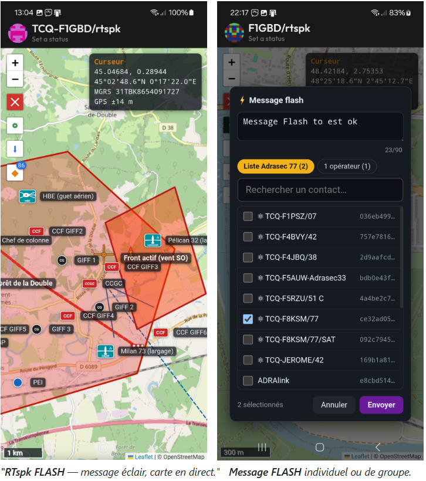

# RTspk Pager

### Le récepteur d'alerte et la carte tactique ADRASEC, dans votre poche

*Messagerie chiffrée Reticulum / LXMF · alerte RASEC plein écran · cartographie synchronisée par radio · couverture LoRa · radar aéronefs · météo — sur Android, et sur T-Deck.*

## 📥 [Télécharger l'APK](https://github.com/f1gbd/F1GBD/releases)

*Autorisez l'installation « depuis cette source » sur le téléphone, ouvrez le fichier, installez.*

[📖 Guide détaillé](GUIDE.md) · [🕘 Historique des versions](HISTORIQUE.md) · [📚 Documentation PDF](#-documentation) · [📱 Version T-Deck](T-Deck/README.md)

---

## Qu'est-ce que RTspk Pager ?

Un opérateur ADRASEC en déplacement n'a pas toujours son poste sous la main. Il a
un téléphone dans la poche, et parfois un portatif VHF à la ceinture.

**RTspk Pager met la chaîne d'alerte et la carte de situation dans ce
téléphone** : un message d'alerte le réveille en pleine nuit, application fermée ;
la carte tactique se synchronise avec le PC par radio, sans Internet ; et la même
messagerie chiffrée passe par LoRa, packet VHF ou TCP selon ce qui est disponible.

C'est l'application [**Ratspeak**](https://github.com/ratspeak/Ratspeak) — un
client **Reticulum / LXMF** — enrichie des fonctions ADRASEC : **RASEC-ALERT**,
cartographie **NEM**, couverture LoRa, radar aéronefs, MAIL ADRAlink.

**Elle parle avec [TCQ](https://github.com/f1gbd/F1GBD/tree/master/tcq)** — messages,
PING, images et carte — **dans les deux sens**.

  
   <i>Le téléphone porte la carte et la palette de symboles TCQ ; le portatif VR-N76 sur 145,350 porte la liaison. <b>Aucune infrastructure entre les deux.</b></i>

---

## À quoi ça sert, concrètement

### 🚨 Être réveillé par une alerte, application fermée

Un message LXMF contenant le code d'activation déclenche un **écran plein écran
clignotant**, une **sirène bitonale** synthétisée — aucun fichier son requis — et
un **accusé de réception automatique** renvoyé à l'expéditeur. Un service de
veille reçoit l'alerte même application fermée.

  
   <i>« RASEC ALERT » plein écran, avec compteur d'alertes. L'expéditeur sait que c'est arrivé.</i>

### 🗺️ Voir et partager la situation, sans Internet

Carte OpenStreetMap avec les **symboles normalisés SDIS / OTAN / SATER**, zones,
routes coupées, tracés. La **synchro NEM** échange la carte avec TCQ **par
radio** — LoRa ou packet VHF — et n'envoie que ce qui a changé.

  
   <i>Exercice ORION-26 : la carte du PC arrive sur le téléphone par radio. Un objet déplacé glisse à sa nouvelle position au lieu de se dupliquer.</i>

  
   <i>Un message <b>FLASH</b> part d'un point précis de la carte — ici sur un feu de forêt en Dordogne — vers un opérateur ou vers toute une <b>liste de diffusion</b>.</i>

### 📡 Savoir jusqu'où on porte, et où poser un relais

La carte calcule la **portée LoRa prévisible** sur le relief réel, et cherche **où
poser un relais RRLoRa** pour relier deux stations qui ne s'entendent pas. **Ça
marche sans réseau**, à condition d'avoir préparé le relief de la zone avant de
partir.

  
   <i>Portée en quatre couleurs et bilan de liaison au point touché. Le relais proposé est recalculé sur des profils d'altitude réels — c'est le <b>maillon faible</b> des deux bonds qui est annoncé.</i>

> Même moteur de calcul que TCQ : **écart mesuré nul** entre les deux
> applications, en ligne comme hors ligne. Deux opérateurs côte à côte lisent le
> même chiffre pour la même liaison.

### ◉ Voir ce qui vole

Un scope **radar PPI plein écran** centré sur votre position GPS, rayon ≈ 22 km.
Bombardiers d'eau Pélican et Canadair, hélicoptères Dragon et SAMU, Sécurité
Civile, Douane, Gendarmerie — classés par indicatif et par adresse ICAO24.

  
   <i>Le balayage radar se superpose à la carte : on voit à la fois l'aéronef et le terrain sous lui.</i>

### 🌦 Anticiper le risque incendie

Météo **AROME** sur la zone affichée, et la **règle des trois 30** — température
≥ 30 °C, vent ≥ 30 km/h, humidité ≤ 30 % — évaluée point par point. Des **zones à
surveiller** déclenchent une alerte quand les trois critères se réunissent.

  
   <i>Champ de vent et zones à risque. Quand les trois critères se réunissent sur une zone surveillée, l'application prévient.</i>

### ✉️ Faire passer un message à un proche, par radio

Le bouton **MAIL ADRAlink** envoie un court **courriel d'urgence** via une
passerelle ADRAlink (routage Winlink / ADRASEC), et permet d'en **relire les
réponses** — le tout par radio, sans Internet.

  
  
   <i>À gauche, le formulaire MAIL ADRAlink. À droite, le <b>PING LXMF</b> : la station répond automatiquement, avec le temps d'aller-retour.</i>

---

## 📱 Il existe aussi une version T-Deck

Pour qui préfère un appareil dédié plutôt qu'un téléphone : **rsDeck T-Deck**, le
firmware **RASEC-ALERT** pour **LilyGo T-Deck Plus** (ESP32-S3, LoRa SX1262,
écran ST7789, GPS UBlox, clavier physique).

Même chaîne d'alerte, même **MAIL ADRAlink**, plus le **décodeur CHAPPE26**
intégré et une **carte OpenStreetMap** utilisable hors réseau depuis la micro-SD.

  
  
   <i>À gauche, l'écran d'accueil v3.0.0 : LoRa, TCP, WiFi et GPS actifs, boutons <b>GPS</b> et <b>MAIL ADRALINK</b>. À droite, la carte OSM centrée sur la position.</i>

**➡️ [Tout sur la version T-Deck](T-Deck/README.md)** — firmware, flash, manuel et fiche technique.

---

## Ce que RTspk Pager sait faire

| | Fonction | En deux mots |
|:---:|---|---|
| 🚨 | **RASEC-ALERT** | Écran clignotant, sirène synthétisée, accusé automatique. Reçu **application fermée**. |
| 📨 | **LXMF / Reticulum** | Messagerie chiffrée bout-en-bout, multi-saut. LoRa/RNode, packet AX.25, TCP, BLE. |
| 📻 | **LXMF par radio VHF** | Messagerie autonome sur un simple portatif packet — **sans Internet ni cellulaire**. |
| 🗺️ | **Carte & synchro NEM** | Symboles SDIS/OTAN/SATER, zones, tracés. Échange **par radio** avec TCQ, en delta binaire. |
| 📡 | **Couverture LoRa** | Portée prévisible sur relief réel, bilan de liaison au point touché. |
| 🗼 | **Relais RRLoRa** | Où poser un répéteur entre deux stations. Chaîne de deux relais si besoin. |
| ◉ | **Radar aéronefs** | Scope PPI plein écran, rayon ≈ 22 km, classification des moyens de secours. |
| 🌦 | **Météo & 3×30** | AROME, champ de vent, zones à surveiller avec alerte. |
| ⚡ | **Messages FLASH** | Un message posé à un point précis de la carte. |
| 📢 | **Listes de diffusion** | Message ou alerte vers tout un groupe, listes modifiables. |
| ✉️ | **MAIL ADRAlink** | Courriel d'urgence par radio, avec relecture des réponses. |
| 📷 | **Photos** | Même compresseur que TCQ : l'image passe dans les deux sens. |
| 📡 | **PING LXMF** | Vérifier qu'une station répond, avec le temps d'aller-retour. |

---

## Installer

1. **[Télécharger l'APK](https://github.com/f1gbd/F1GBD/releases)** depuis les *Releases*.
2. Sur le téléphone, autoriser l'installation **depuis cette source** *(« sources inconnues » / « Installer des applications inconnues »)*.
3. Ouvrir le fichier APK et installer.
4. Au premier lancement, **créer ou importer une identité Reticulum**, puis configurer au moins une interface *(LoRa/RNode, TCP, WiFi/BLE)* dans **Settings**.

> **Mise à jour :** *Settings → bas de page → « Check for updates »* interroge les
> *Releases*. L'installation reste manuelle — il n'y a pas de mise à jour
> automatique, pour des raisons de confidentialité.

---

## Premiers pas

1. **Accordez les trois autorisations** demandées au premier lancement — sans elles, la veille d'alerte ne fonctionne pas application fermée. Voir le [guide](GUIDE.md#veille-alerte-rasec-réception-application-fermée).
2. **Réglez votre code d'alerte** et testez-le entre deux appareils.
3. **Branchez un RNode** ou déclarez un TNC packet, et faites un **PING LXMF** vers une station TCQ : la réponse revient toute seule.
4. **Ouvrez la carte**, posez un symbole, et lancez une **Synchro NEM** avec le PC.
5. **Avant une sortie sans réseau** — préparez le relief de la zone *(📡 → ⚙ → Préparer le relief)* et parcourez la carte en ligne pour mettre les tuiles en cache.

> ⚠️ Côté TCQ, laissez la case **« ⚛ Quantique »** du panneau de chat
> **décochée** : la téléportation quantique est un format propre à TCQ,
> illisible par tout autre client LXMF.

---

## 🆕 Dernières mises à jour

### Version courante : **1.0.61** — alignement sur TCQ v12.70

**Le téléphone fonctionne maintenant sans réseau.** Préparez le relief d'une zone
avant de partir : couverture LoRa **et** recherche de relais continuent de
fonctionner sur le terrain. L'application écrit alors « Relief INTERPOLÉ » plutôt
que de faire passer une valeur reconstruite pour une valeur mesurée.

**Choisir vraiment son emplacement de relais.** Toucher une pastille l'**adopte**
désormais, au lieu de simplement l'afficher ; une **liste comparative** donne pour
les cinq emplacements la marge de chaque bond, le **dégagement de Fresnel** et la
distance depuis votre station.

| Version | Ce qui change |
|---|---|
| **1.0.61** | Mode hors ligne (relief préparé), choix d'un emplacement de relais, Fresnel dans les fiches |
| 1.0.60 | Couverture LoRa prévisionnelle et placement de relais RRLoRa |
| 1.0.53 | Tracé de zone utilisable sur téléphone |
| 1.0.50 → 1.0.52 | Couche météo AROME, règle des 3×30, zones à surveiller |
| 1.0.40 → 1.0.41 | PING LXMF, photos compatibles TCQ, radar aéronefs, listes modifiables |
| 1.0.35 → 1.0.38 | Synchro NEM en delta puis en binaire compact — jusqu'à ~97 % de données en moins |
| 1.0.32 → 1.0.34 | Carte tactique, synchro NEM, balise de position, messages FLASH |
| 1.0.31 | Veille alerte application fermée, bouton MAIL ADRAlink |
| 1.0.27 | Listes de diffusion |

📖 **[Historique détaillé de toutes les versions →](HISTORIQUE.md)**

---

## 📚 Documentation

### RTspk Pager (Android)

| Document | Contenu |
|---|---|
| [📖 **Guide détaillé**](GUIDE.md) | Le mode d'emploi de chaque fonction, en ligne |
| [📕 Manuel — Cartographie & NEM](documents/MANUEL_RTspk_Pager_Carto_NEM.pdf) | Le manuel complet de la carte et de la synchro |
| [📄 Fiche technique — Cartographie & NEM](documents/Fiche_Technique_RTspk_Pager_Carto_NEM.pdf) | La synthèse technique de la carte |
| [📄 Fiche technique — Couverture LoRa & relais RRLoRa](documents/Fiche_Technique_Couverture_LoRa_Relais_RRLoRa_v1.0.60.pdf) | Utilisation, paramétrage et exemples concrets |
| [📄 Fiche technique — Reticulum, KISS et TCQ](documents/Fiche_Technique_Reticulum_KISS_TCQ.pdf) | Le raccordement radio et l'interopérabilité |
| [📄 MEMO — fiche technique et manuel](documents/MEMO%20-%20RTspk_Pager_Fiche_Technique_Manuel.pdf) | Le condensé à emporter |

### Version T-Deck

| Document | Contenu |
|---|---|
| [📱 **README T-Deck**](T-Deck/README.md) | Présentation, firmware et flash |
| [📕 Manuel rsDeck T-Deck v3.0.0](T-Deck/documentations/rsDeck_T-Deck_Manuel_v3.0.0.pdf) | Le manuel complet |
| [📄 Fiche technique rsDeck T-Deck v3.0.0](T-Deck/documentations/rsDeck_T-Deck_Fiche-Technique_v3.0.0.pdf) | La synthèse technique |

### Pour compiler

| Document | Contenu |
|---|---|
| [🔧 BUILD-APK-WINDOWS.md](BUILD-APK-WINDOWS.md) | Construire l'APK sous Windows |
| [🩹 `ratspeak-rasec-alert-f1gbd.patch`](ratspeak-rasec-alert-f1gbd.patch) | Les modifications RASEC-ALERT, applicables sur les sources Ratspeak |

---

## Licence et code source

RTspk Pager dérive de **Ratspeak**, distribué sous **GNU AGPL-3.0-or-later**.
Conformément à cette licence, le code source correspondant de cette version
modifiée est mis à disposition :

- Sources d'origine : [github.com/ratspeak/Ratspeak](https://github.com/ratspeak/Ratspeak) *(et les bibliothèques sœurs rsReticulum / rsLXMF / rsLXST / lrgp-rs)*
- Modifications RASEC-ALERT : le fichier `ratspeak-rasec-alert-f1gbd.patch` s'applique sur une copie propre des sources *(`git apply ratspeak-rasec-alert-f1gbd.patch`)*
- Construction de l'APK sous Windows : voir `BUILD-APK-WINDOWS.md`

En reversant vos modifications, merci de respecter les termes de l'AGPL-3.0.

---

### 📡 Crédits

Application **Ratspeak** — *Ratspeak Contributors* · Basé sur **Reticulum / LXMF**

Portage et build de l'option **RASEC-ALERT**
**F1GBD — ADRASEC 77 / FNRASEC**

*73 !*

