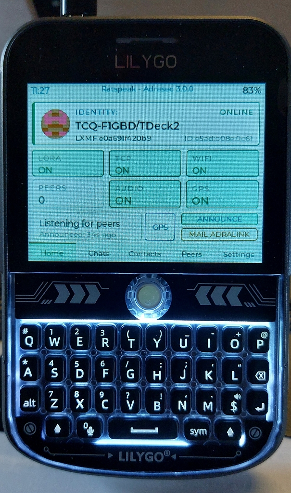

# Historique des versions — RATspeak ADRASEC T-Deck

Annexe au [README](README.md). Toutes les versions sont au format
`x.y.z-rasec-f1gbd`, livrées en **image fusionnée** à flasher à l'offset `0x0`
(web-flasher ESP Web Tools).

📚 **Documentation de référence** — dossier [`documentations/`](documentations/) :

- [Manuel utilisateur](documentations/rsDeck_T-Deck_Manuel_v3.0.0.pdf) — prise en
  main, écrans, réglages, utilisation terrain.
- [Fiche technique](documentations/rsDeck_T-Deck_Fiche-Technique_v3.0.0.pdf) —
  caractéristiques matérielles, radio et architecture logicielle.

> Ces deux documents décrivent la **v3.0.0** ; ils restent valables pour la
> v3.1.0, dont les changements sont purement ergonomiques (écran d'accueil).

---

## 3.1.0 — 2026-08-26

**Écran d'accueil épuré, actions en pleine hauteur.**

### Modifié
- Suppression du cadre de résumé du bas (« *N peers heard in 30m* »), redondant
  avec le bandeau ONLINE/OFFLINE et la tuile **PEERS**.
- La rangée basse devient une **barre d'actions pleine hauteur** :
  **GPS** | **ANNOUNCE** | **MAIL ADRALINK** — les deux boutons d'action passent
  de 17 px à 38 px de haut, à la même hauteur que le bouton GPS.
- L'ancienneté de la dernière annonce (« *Announced: 3s ago* ») est repliée en
  seconde ligne **à l'intérieur du bouton ANNOUNCE**.
- Libellés **ANNOUNCE** et **MAIL ADRALINK** agrandis (police 12 au lieu de 10).

### Interne
- Positions de la barre d'actions calculées à partir de la largeur d'écran
  (constantes `kGpsX/W`, `kAnnounceX/W`, `kMailX/W`) au lieu de coordonnées en dur.
- Ordre de navigation clavier aligné sur l'ordre visuel (gauche → droite).

  
  &nbsp;&nbsp;
   
  <em><strong>v3.1.0</strong> (à gauche) et <strong>v3.0.0</strong> (à droite) :
  le cadre de résumé laisse place à trois actions pleine hauteur.</em>

---

## 3.0.0 — 2026-08-08

**Cartographie OpenStreetMap embarquée, live et hors-réseau.**

### Ajouté
- **Carte OSM** centrée sur la position GPS, ouverte depuis le bouton **CARTE**
  du dialogue GPS de l'accueil.
  - **Hors-réseau** : tuiles lues depuis la micro-SD (`/maps/osm/{z}/{x}/{y}.png`).
  - **Live (WiFi)** : téléchargement des tuiles manquantes depuis OpenStreetMap
    puis **mise en cache automatique sur la SD** pour réutilisation hors-réseau.
  - Marqueur de position GPS temps réel, HUD zoom + coordonnées.
  - Navigation **tactile** : glisser = pan, boutons `+` / `−` (zoom) et `O`
    (recentrer GPS). Clavier : `+`/`-`, flèches, `c`, Retour.
  - Décodeur **PNG** LVGL (lodepng) activé + cache image agrandi.
- **Bouton GPS** sur l'écran d'accueil → **dialogue d'état GPS** (statut,
  coordonnées Lat/Lon, satellites, HDOP, altitude) ; bouton **CARTE** actif au fix.
- **Filtre TCQ** dans l'écran « Peers » : n'afficher que les annonces dont le nom
  commence par `TCQ`.

### Corrigé / robustesse
- Parsing de la **position GPS activé en permanence** au démarrage du GPS (la
  localisation survit désormais au redémarrage).
- Formatage des coordonnées via `snprintf` (le `printf` interne de LVGL ne gère
  pas `%f`).
- Alignement des tuiles calé sur une **origine entière unique** (plus de couture).
- **Purge du cache image** LVGL avant libération d'un descripteur (fin des tuiles
  fantômes / recopies au pan/zoom).
- **Garde anti-boucle** sur les téléchargements de tuiles ratés (une seule
  tentative par tuile, throttle) — évite le blocage de l'UI.

---

## 2.0.4 — 2026-08

**Code CHAPPE-26 décodé à bord.**

### Ajouté
- **Décodeur CHAPPE26** intégré : auto-décodage des messages LXMF contenant des
  codes `!DDDD` (répertoire complet 1000 codes) + écran de test dans Settings.
- **Rétro-éclairage clavier** temporisé (5 s à la frappe).
- Deux presets **LoRa France** (Standard 868 et Haut Débit 868).
- Bandeau d'accueil « Ratspeak - Adrasec » + numéro de version.

---

## 2.0.3

**MAIL ADRAlink utilisable sur le terrain.**

### Ajouté / amélioré
- **MAIL ADRAlink** : champ identifiant **modifiable** (relire un ancien message),
  **journal effaçable**, retour visuel clair à l'envoi et à la réception.

---

## Antérieur

- Option **Pager RASEC-ALERT** portée depuis le MeshPager : message LXMF `#ra`
  → écran plein écran clignotant + sirène I2S synthétisée + accusé de réception ;
  `#rapass` (changement de code), `#b` (répétitions sirène).
- Base : firmware **rsDeck** (Reticulum / microReticulum / LXMF) pour LilyGo
  T-Deck Plus.

---

  <em>F1GBD — ADRASEC 77</em>

