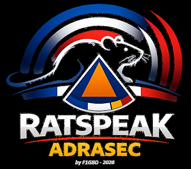
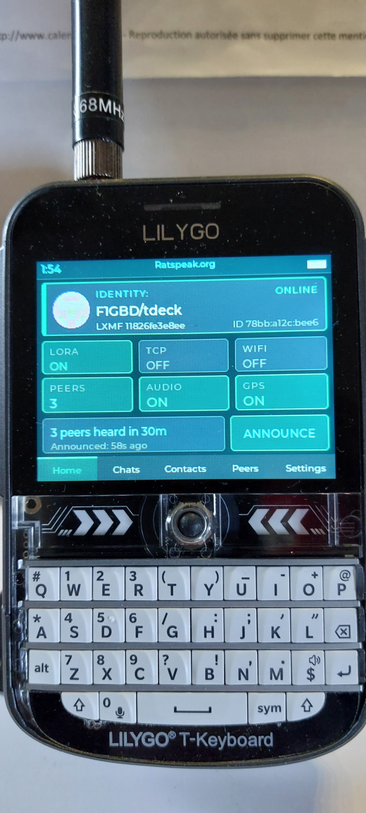
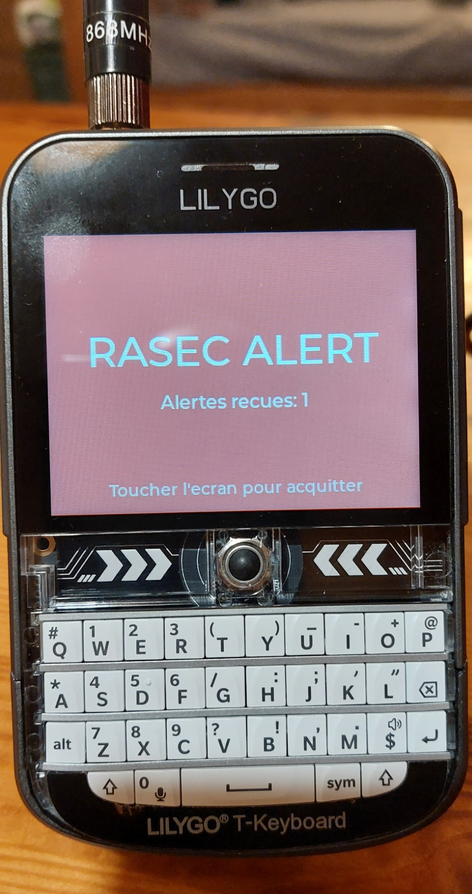

# rsDeck T-Deck — édition RASEC-ALERT
par F1GBD / ADRASEC 77 / FNRASEC

Firmware **RASEC-ALERT** pour **LilyGo T-Deck Plus** (ESP32-S3, LoRa SX1262,
écran ST7789), dérivé de [rsDeck](https://github.com/ratspeak/rsDeck) — un
messager Reticulum / **LXMF** — et enrichi de l'**option Pager RASEC-ALERT**
portée depuis le MeshPager.

# Version : **2.0.2-rasec-f1gbd**

---

Un message **LXMF** reçu déclenche un **écran plein écran clignotant
« RASEC ALERT »** (avec compteur d'alertes), une **sirène bitonale synthétisée**
et un **accusé de réception automatique**. Aucune carte SD ni fichier `.mp3` :
la sirène est générée en I2S dans le firmware.

---

## ⚡ Flash en un clic (recommandé)

Le plus simple : flasher directement depuis le navigateur, sans rien installer.

**➡️ https://f1gbd.github.io/F1GBD/RTspk_pager/T-Deck/**

1. Ouvrez la page depuis **Chrome** ou **Edge** sur ordinateur (Web Serial requis
   — ne fonctionne pas sur iOS/Safari).
2. Branchez le T-Deck en USB-C, interrupteur sur **ON**, cliquez **Installer**,
   choisissez le port.
3. Laissez l'installation se terminer, puis appuyez sur **reset**.

Si le bouton n'arrive pas à se connecter (fréquent sur ESP32-S3 à USB natif),
mettez d'abord le T-Deck en **mode download** — maintenir la trackball, appuyer
sur reset (côté gauche), relâcher — puis recliquez sur **Installer**.

> **Région radio.** rsDeck démarre par défaut sur *Americas (915 MHz)*. Pour la
> France, choisir **Europe (868 MHz)** dans *Settings → Radio* après le 1ᵉʳ boot.

---

## Option Pager RASEC-ALERT — utilisation

Depuis un autre nœud Reticulum/LXMF, en **message direct** vers l'adresse LXMF
du T-Deck :

- `#ra ADRASEC77` — déclenche l'alerte (écran clignotant + sirène + ACK). Le code
  `ADRASEC77` est modifiable.
- `#rapass <ancien> <nouveau>` — change le code d'activation à distance (persisté
  en flash NVS).
- `#b <n>` — règle le nombre de répétitions de la sirène. `#b 0` = alarme continue
  jusqu'à acquittement (plage 0–20).

**Acquittement :** toucher l'écran, appuyer sur une touche, ou appui long.

L'accusé renvoyé ne contient jamais le code (anti-boucle). La sirène suit le
volume et l'interrupteur haut-parleur des réglages.

---

## Licence & crédits

- Firmware dérivé de [rsDeck](https://github.com/ratspeak/rsDeck) — voir la
  licence du dépôt d'origine.
- Basé sur [Reticulum](https://github.com/markqvist/Reticulum) /
  [microReticulum](https://github.com/attermann/microReticulum).
- Flash web : [ESP Web Tools](https://github.com/esphome/esp-web-tools).
- Portage T-Deck et option RASEC-ALERT : **F1GBD — ADRASEC 77**.
