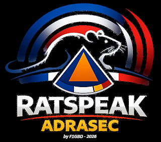
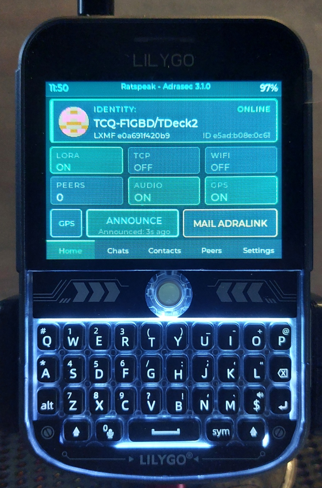
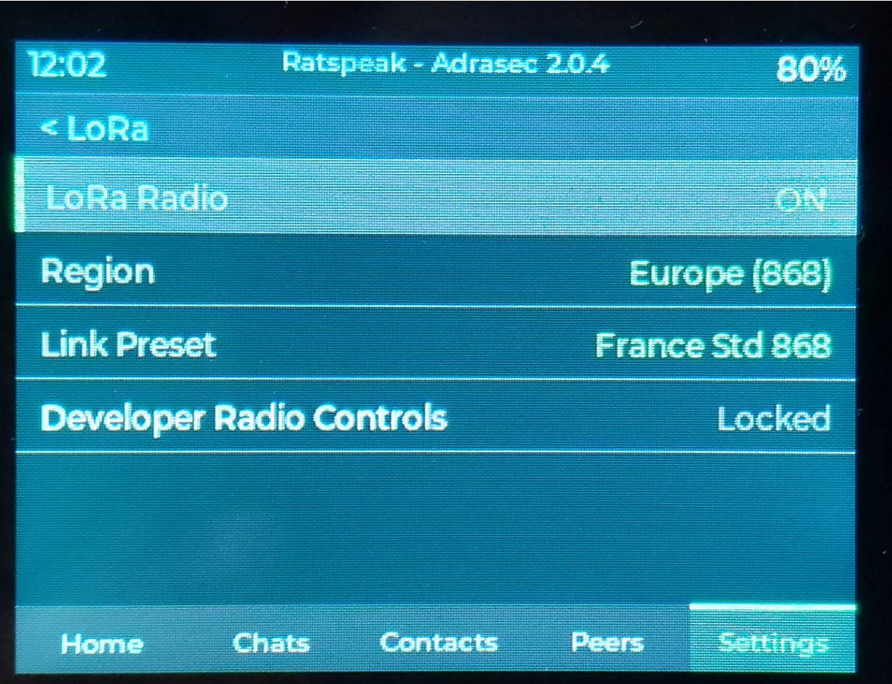
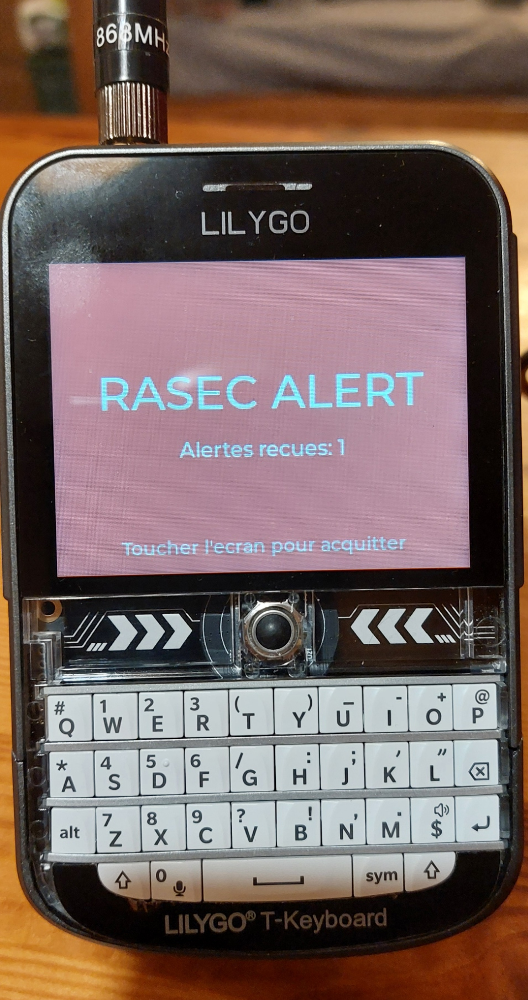
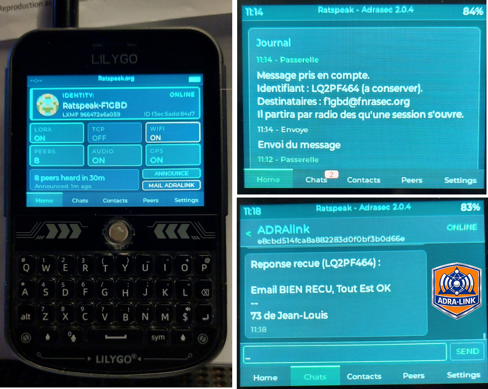
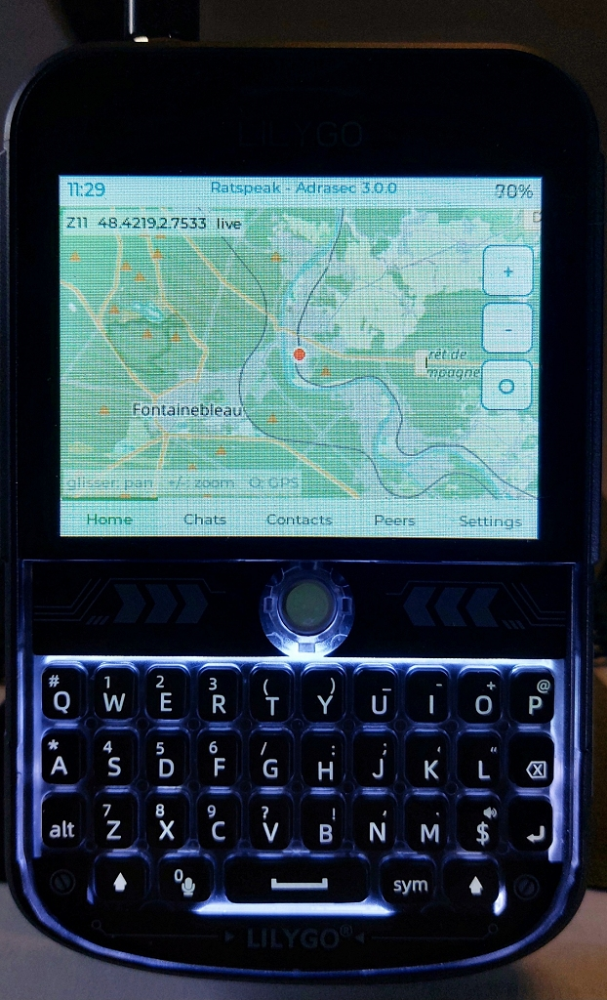
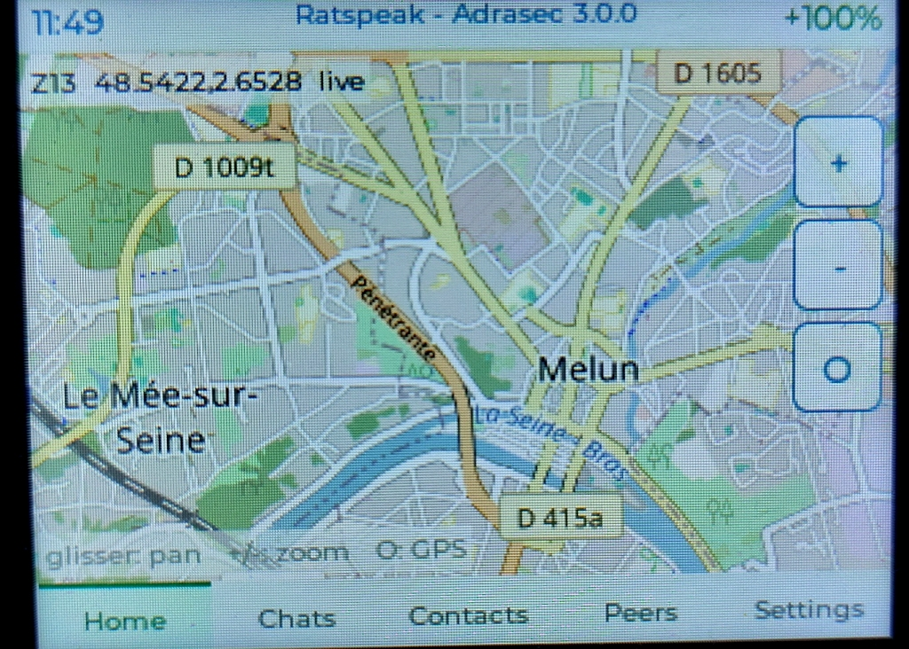
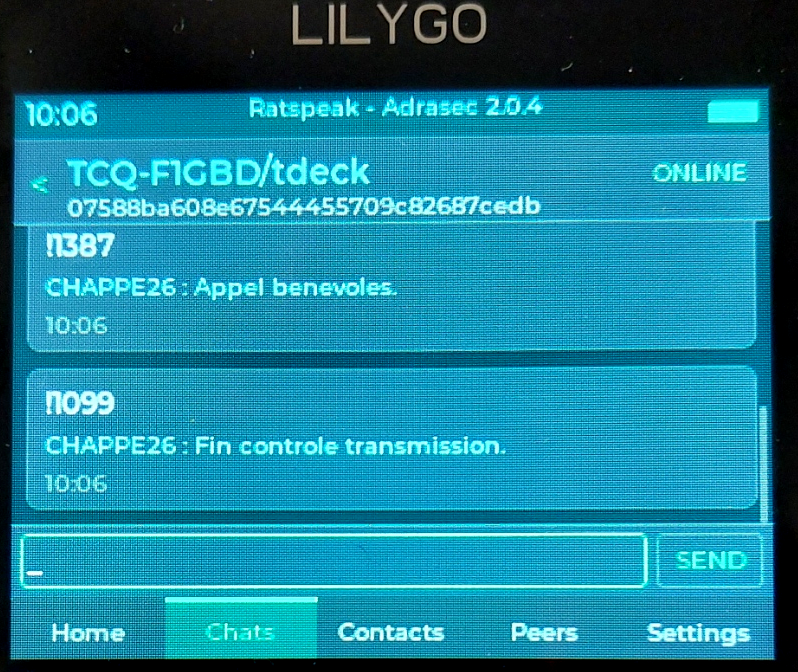
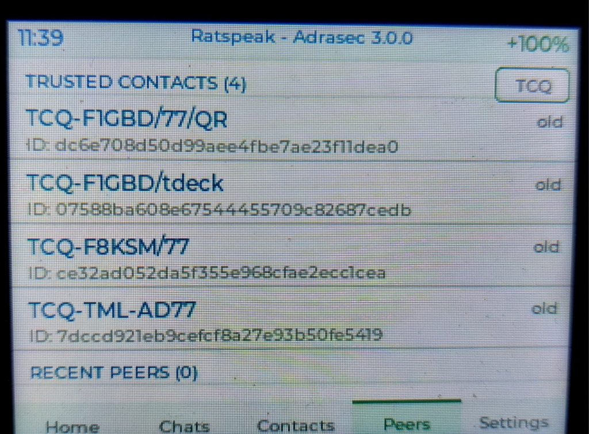

<p align="center">
  
</p>

<p align="center">
  <br>
  <em>Écran d'accueil <strong>v3.1.0</strong> sur LilyGo T-Deck Plus.</em>
</p>

<p align="center">
  <strong>Version 3.1.0-rasec-f1gbd</strong> ·
  <a href="https://f1gbd.github.io/F1GBD/RTspk_pager/T-Deck/">⚡ Flasher en un clic</a> ·
  <a href="CHANGELOG.md">Historique des versions</a> ·
  <a href="documentations/">Documentation</a>
</p>

---

## En deux mots

**RATspeak ADRASEC** est un firmware pour le **LilyGo T-Deck Plus** qui transforme
ce petit terminal clavier en **messager d'urgence autonome** : il communique en
**LoRa** de terminal à terminal, **sans opérateur, sans Internet, sans
infrastructure**, sur le réseau chiffré **Reticulum / LXMF**.

Il est dérivé de [rsDeck](https://github.com/ratspeak/rsDeck) et enrichi des
fonctions développées pour l'**ADRASEC 77** : réception d'alertes de sécurité
civile, envoi d'e-mails par radio, décodage du code CHAPPE-26 et cartographie
OpenStreetMap hors-réseau.

> **Pour qui ?** Radioamateurs, ADRASEC / FNRASEC, réserves communales, secours
> en milieu isolé — tout groupe qui doit rester en liaison quand le réseau
> mobile tombe.

---

## Ce que sait faire l'appareil

| Fonction | En clair |
|---|---|
| 💬 **Messagerie LXMF** | Messages chiffrés de bout en bout entre T-Decks, PC ou smartphones, par **LoRa**, **WiFi/TCP** ou passerelle Reticulum. |
| 🚨 **Pager RASEC-ALERT** | Un message reçu déclenche un **écran clignotant plein écran + sirène**, même appareil en veille, avec accusé de réception automatique. |
| ✉️ **MAIL ADRAlink** | Envoi d'un **e-mail vers Internet** depuis le terrain, par radio, via une passerelle ADRAlink — et **relecture des réponses**. |
| 🗺️ **Carte OSM** | Carte OpenStreetMap centrée sur le GPS, **utilisable hors-réseau** depuis la micro-SD. |
| 📡 **CHAPPE-26** | **Décodage automatique** des messages en code CHAPPE-26 (1000 codes ADRASEC/FNRASEC) affiché en clair sous le message. |
| 🛰️ **GPS intégré** | État GPS détaillé (position, satellites, HDOP, altitude) et position reportée sur la carte. |
| 🔎 **Filtre TCQ** | Dans la liste des pairs, n'afficher que les stations **TCQ** pour lire une situation tactique d'un coup d'œil. |

---

## Matériel

- **LilyGo T-Deck Plus** — ESP32-S3, LoRa **SX1262**, écran ST7789, clavier
  physique, trackball, GPS UBlox, haut-parleur, batterie.
- Une **micro-SD** (recommandée) pour les cartes hors-réseau.
- Un câble **USB-C** pour le premier flash.

---

## ⚡ Installation en un clic

Le plus simple : flasher **directement depuis le navigateur**, sans rien installer.

**➡️ https://f1gbd.github.io/F1GBD/RTspk_pager/T-Deck/**

1. Ouvrir la page avec **Chrome** ou **Edge** sur ordinateur (Web Serial requis —
   ne fonctionne pas sur iOS/Safari).
2. Brancher le T-Deck en USB-C, interrupteur sur **ON**, cliquer **Installer**,
   choisir le port.
3. Laisser l'installation se terminer, puis appuyer sur **reset**.

> **Le bouton n'arrive pas à se connecter ?** C'est fréquent sur ESP32-S3 à USB
> natif. Passer le T-Deck en **mode download** — maintenir la trackball, appuyer
> sur reset (côté gauche), relâcher — puis recliquer sur **Installer**.

### Premier démarrage — réglage radio

RATspeak démarre par défaut sur *Americas (915 MHz)*. **Pour la France**, choisir
**Europe (868 MHz)** dans *Settings → Radio*, avec l'un des deux presets :

| Preset | Réglage | Usage |
|---|---|---|
| **France Std 868** | 867.5 MHz · BW125 · SF8 · CR5 | Portée maximale, débit lent — liaison de secours. |
| **France HD 868** | 867.5 MHz · BW500 · SF7 · CR5 | Débit rapide, portée réduite — trafic local. |

Tous les postes d'un même réseau doivent utiliser **le même preset**.

<p align="center">
  <br>
  <em>Configuration terrain ADRASEC : <strong>LoRa pur</strong> 868 MHz, TCP et WiFi coupés.</em>
</p>

---

## Les fonctions en détail

### 🚨 Pager RASEC-ALERT

Depuis n'importe quel nœud Reticulum/LXMF, un **message direct** vers l'adresse
LXMF du T-Deck déclenche l'alerte :

| Commande | Effet |
|---|---|
| `#ra ADRASEC77` | Déclenche l'alerte : écran clignotant + sirène + accusé de réception. Le code est modifiable. |
| `#rapass <ancien> <nouveau>` | Change le code d'activation à distance (mémorisé en flash). |
| `#b <n>` | Nombre de répétitions de la sirène. `#b 0` = alarme continue jusqu'à acquittement (0–20). |

**Acquittement :** toucher l'écran, appuyer sur une touche, ou appui long.
La sirène est **synthétisée en I2S dans le firmware** — ni carte SD ni fichier
audio nécessaires. L'accusé renvoyé ne contient jamais le code (anti-boucle).

<p align="center">
  <br>
  <em>Alerte plein écran clignotante, compteur d'alertes et invite d'acquittement.</em>
</p>

### ✉️ MAIL ADRAlink — un e-mail par radio

Le bouton **MAIL ADRALINK** de l'accueil ouvre un formulaire d'**e-mail
d'urgence** : destinataire, message court, envoi. Le message part **par radio**
vers une passerelle **ADRAlink** (routage Winlink / ADRASEC) qui le remet sur
Internet. Un **identifiant de suivi** est retourné, et les **réponses sont
relisibles** depuis le même écran.

<p align="center">
  <br>
  <em>Cycle complet : envoi depuis le T-Deck, identifiant de suivi, puis réponse reçue par radio.</em>
</p>

### 🗺️ Carte OpenStreetMap — live et hors-réseau

Le bouton **GPS** de l'accueil ouvre un **dialogue d'état GPS** (statut,
Lat/Lon, satellites, HDOP, altitude). Dès la position verrouillée, le bouton
**CARTE** ouvre une carte OSM centrée sur le T-Deck, avec marqueur temps réel.

- **Hors-réseau** — les tuiles sont lues sur la micro-SD dans
  `maps/osm/{z}/{x}/{y}.png` (arborescence *slippy map* standard).
- **Live (WiFi)** — les tuiles manquantes sont téléchargées depuis OpenStreetMap
  **puis mises en cache sur la SD** : une zone parcourue en ligne reste
  disponible hors-réseau ensuite.
- **Navigation** — glisser le doigt pour déplacer, boutons `+` / `−` (zoom) et
  `O` (recentrer GPS). Au clavier : `+`/`-`, flèches, `c`, Retour.

> **Préparer une mission.** Connecter le T-Deck en WiFi et balayer la zone
> d'intérêt **à chaque niveau de zoom** utile : le cache est constitué par niveau
> de zoom. On peut aussi pré-copier un dossier `maps/osm/` à la racine de la SD.

<p align="center">
  
  &nbsp;&nbsp;
  <br>
  <em>Carte centrée sur la position GPS : sur le terrain (à gauche) et en plein écran (à droite).</em>
</p>

### 📡 Décodeur CHAPPE-26

À la réception d'un message LXMF contenant des codes au format transmission
(`!1000 !1204 !1990 …`), le firmware **décode automatiquement** et affiche la
**traduction en clair** sous le message, à partir du répertoire complet
ADRASEC/FNRASEC — **10 domaines × 100 lignes = 1000 codes**
(ex. `1204` = *Santé · Ambulance requise*). Un décodeur de test est disponible
dans *Settings → Décodeur CHAPPE26*.

📘 Livret du code CHAPPE-26 :
[Chappe26_Livret_B5.pdf](https://github.com/f1gbd/F1GBD/blob/master/TML/documentation/Chappe26_Livret_B5.pdf)

<p align="center">
  <br>
  <em>Message CHAPPE-26 reçu et traduit en clair automatiquement.</em>
</p>

### 🔎 Filtre TCQ dans « Peers »

Une case **TCQ** en haut de la liste des pairs ne conserve que les annonces dont
le nom commence par `TCQ` — pratique pour isoler les stations d'un exercice au
milieu du trafic ambiant.

<p align="center">
  <br>
  <em>Filtre <strong>TCQ</strong> actif : seules les stations <code>TCQ…</code> sont affichées.</em>
</p>

---

## Carte SD — tuiles OSM hors-réseau

Placer les tuiles sur la micro-SD dans l'arborescence *slippy map* standard :

```
/maps/osm/{zoom}/{x}/{y}.png        ex. /maps/osm/15/16600/11269.png
```

Les tuiles téléchargées en WiFi sont **automatiquement** rangées dans cette même
arborescence, ce qui alimente le cache hors-réseau au fil de la navigation.

---

## 📚 Documentation

| Document | Contenu |
|---|---|
| [Manuel utilisateur](documentations/rsDeck_T-Deck_Manuel_v3.0.0.pdf) | Prise en main, écrans, réglages, utilisation sur le terrain. |
| [Fiche technique](documentations/rsDeck_T-Deck_Fiche-Technique_v3.0.0.pdf) | Caractéristiques matérielles et radio, architecture logicielle. |
| [CHANGELOG.md](CHANGELOG.md) | **Historique complet des versions** et des évolutions. |

---

## Contenu de ce dossier

| Fichier | Rôle |
|---|---|
| `index.html` | Page de flash web (ESP Web Tools). |
| `manifest.json` | Manifest ESP Web Tools (ESP32-S3, image à l'offset `0x0`). |
| `rsdeck-adrasec-3.1.0.bin` | **Image firmware fusionnée** à flasher à l'offset `0x0`. |
| `CHANGELOG.md` | Historique des versions. |
| `documentations/` | Manuel utilisateur et fiche technique (PDF). |
| `images/` | Photos et captures d'écran. |
| `README.md` | Ce fichier. |

> ⚠️ Le web-flasher ne fonctionne que si le binaire référencé par
> `manifest.json` est présent dans ce dossier et poussé sur GitHub. À chaque
> nouvelle version : régénérer le `.bin`, le **renommer avec le numéro de
> version**, et mettre à jour `"version"` et `"path"` dans `manifest.json`.

---

## Licence & crédits

- Firmware dérivé de [rsDeck](https://github.com/ratspeak/rsDeck) — voir la
  licence du dépôt d'origine.
- Basé sur [Reticulum](https://github.com/markqvist/Reticulum) /
  [microReticulum](https://github.com/attermann/microReticulum).
- Cartographie : tuiles [OpenStreetMap](https://www.openstreetmap.org/copyright)
  (© les contributeurs OpenStreetMap).
- Flash web : [ESP Web Tools](https://github.com/esphome/esp-web-tools).
- Portage T-Deck, options RASEC-ALERT / MAIL ADRAlink / CHAPPE-26 / Carte OSM :
  **F1GBD — ADRASEC 77**.
