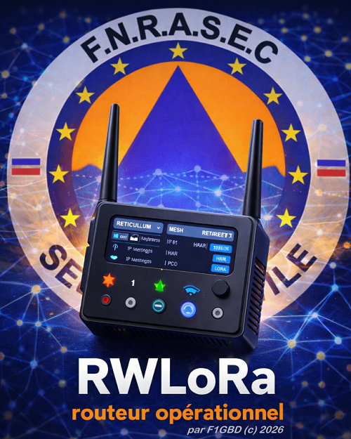
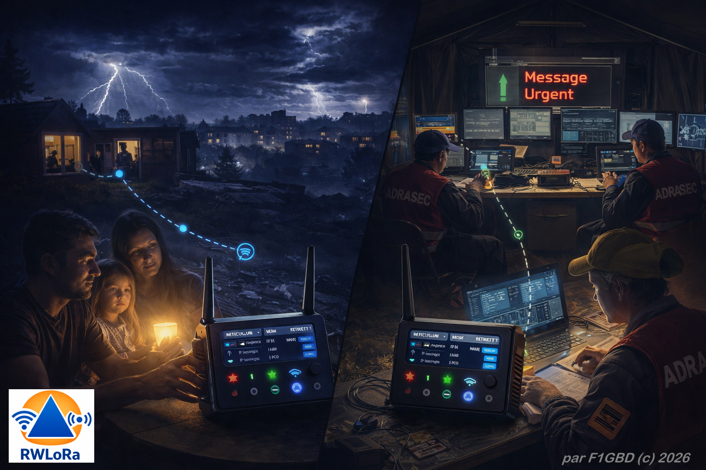
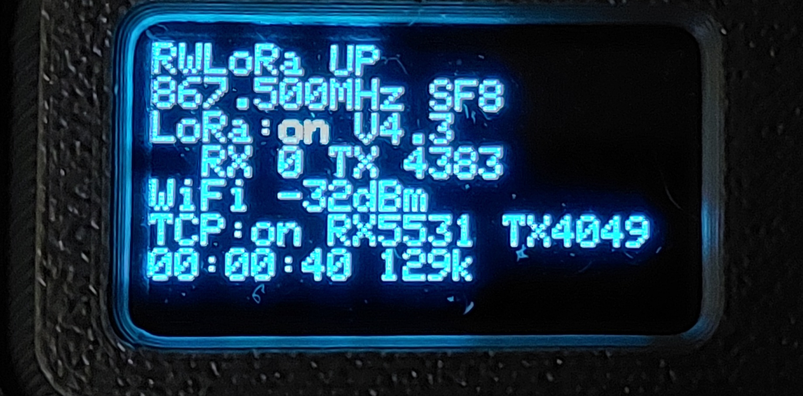

<div align="center">



# RWLoRa — Routeur WiFi LoRa

### *La communication renaît dans le silence des réseaux*

**Passerelle Reticulum bidirectionnelle LoRa ↔ Internet sur Heltec WiFi LoRa 32 V4**

*par F1GBD — ADRASEC 77 / FNRASEC*

</div>

---

Le maillage LoRa de terrain, raccordé à un réseau IP par un simple point d'accès
WiFi. RWLoRa fait tourner la pile [Reticulum](https://reticulum.network/)
complète sur l'ESP32-S3 et route **dans les deux sens** entre la radio et le
réseau.

Pas de PC, pas de Raspberry Pi dans la passerelle : une mini-box WiFi, RWLoRa à
côté, et les nœuds [RRLoRa](../RRLora) du terrain deviennent joignables — depuis
Internet en temps normal, **ou depuis le seul PCO quand il n'y a plus
d'Internet du tout**.

<div align="center">

<br>
<sub><i>D'un côté le silence : plus de cellulaire, plus d'Internet, plus d'énergie.<br>
De l'autre le PC opérationnel. Entre les deux, la passerelle.</i></sub>
</div>

## Pourquoi

**Blackout total** : plus de GSM, plus d'Internet, plus d'électricité. La tempête
a couché le réseau, et des familles sont isolées. C'est exactement la situation
pour laquelle une ADRASEC existe.

[RRLoRa](../RRLora) relaie sur le terrain, là où il n'y a plus rien. Mais une
opération ne vit pas en vase clos : le **Poste de Commandement Opérationnel**
doit recevoir les messages d'urgence des équipes déployées, et leur répondre.

RWLoRa est ce raccord. Tout ce que Reticulum transporte passe : messagerie
**LXMF**, NomadNet, Sideband, transferts de fichiers. La passerelle ne sait pas
ce qu'elle achemine, et c'est très bien ainsi — le chiffrement est de bout en
bout, elle n'en voit rien.

| Composant | Fonction | Rôle |
|---|---|---|
| **RWLoRa** | relais WiFi ↔ LoRa | routeur bidirectionnel, écran d'état, limiteur de rapport cyclique |
| **RRLoRa** | relais LoRa ↔ LoRa | nœud de terrain autonome, batterie ou solaire |
| **Reticulum** | maillage décentralisé | LXMF, chiffrement de bout en bout, aucune autorité centrale |
| **PCO** | poste de commandement | un portable sous `rnsd`, réception et coordination |

### Ce dont RWLoRa a besoin — et ce dont elle n'a pas besoin

Disons-le clairement, parce que la nuance décide de la doctrine d'emploi :

**RWLoRa n'a pas besoin d'Internet. Elle a besoin d'un réseau IP.**

En blackout, ce réseau IP, c'est le **PCO lui-même** : une mini-box WiFi et un
portable sous `rnsd`, alimentés sur groupe ou batterie. Aucun opérateur, aucun
hub, aucune infrastructure nationale. La maille reste opérationnelle parce
qu'elle ne dépend de personne.

En temps normal, le même firmware se raccorde à une box 4G et ouvre le maillage
sur le Reticulum public.

Sans point d'accès configuré, RWLoRa démarre quand même et route en LoRa seule :
un lien montant absent ne doit jamais empêcher le maillage de fonctionner. Mais
dans ce rôle, RRLoRa fait le même travail pour moins cher et moins de courant.
**Le nœud du blackout, c'est RRLoRa. RWLoRa est ce qui y raccorde le PCO.**

## Matériel

| Carte | USB | Flash | PSRAM | PA | État |
|---|---|---|---|---|---|
| **Heltec WiFi LoRa 32 V4** | natif ESP32-S3 | 16 Mo | 2 Mo | GC1109 (V4.2) / KCT8103L (V4.3) | validé |
| **Heltec WiFi LoRa 32 V3** | — | 8 Mo | **aucune** | — | **non supporté** |

Le V3 est écarté sans regret : WiFi, pile TCP et pile RNS ne tiennent pas
ensemble sans les 2 Mo de PSRAM du V4. La console refuse d'ailleurs de flasher
une carte V3 plutôt que de produire une passerelle qui plante au démarrage.

Pour un V3, c'est [RRLoRa](../RRLora) — le relais de terrain.

<div align="center">

</div>

L'écran dit l'essentiel d'un coup d'œil : état des deux interfaces, octets
échangés de chaque côté, niveau WiFi, et **le rapport cyclique radio** — le
chiffre qui décide si cette passerelle est fréquentable à côté d'un maillage.

## Rapport cyclique : la particularité de ce firmware

Une passerelle branchée sur le Reticulum public reçoit un flot continu
d'annonces et cherche à les rediffuser en LoRa. **Mesuré avant correction : 50 %
de rapport cyclique**, soutenu.

La bande 865-868 MHz est limitée à **1 %** par l'ETSI EN 300 220 — 36 secondes
d'émission par heure. Cinquante fois trop, donc. Et le problème n'est pas que
réglementaire : une radio qui émet la moitié du temps **n'écoute pas**, et occupe
le canal pour tout le monde. Les RRLoRa à portée deviennent muets. La passerelle
casse le maillage qu'elle est censée relier.

RWLoRa embarque donc un limiteur de temps d'antenne : fenêtre glissante d'une
heure découpée en soixante seaux d'une minute — la mesure exacte de l'ETSI — et
refus d'émettre au-delà du quota. Le temps d'antenne de chaque paquet est calculé
par la formule Semtech avant émission, jamais estimé.

```
DUTY 0.10 → 0.35 → 0.49 → 0.68 → 0.91 → 0.99  puis plafond
antenne 35645/36000 ms — figée
refuses 7 → 28 → 80 → 152 → 383
```

Une fois le budget épuisé, la radio se tait et le lien Internet continue de
vivre. La fenêtre libère du budget au fil de l'heure.

## Console de configuration — v2

Application Windows autonome. Elle configure les cinq paramètres radio —
**exactement le même jeu que RRLoRa**, pour que passerelle et relais parlent la
même radio — et le lien montant : SSID, mot de passe, hôte Reticulum, port TCP.

> **Nouveau en v2** : le sélecteur de nodes ne lit plus le fichier de
> configuration local ; il interroge en direct l'annuaire public **rns.fyi** et
> classe les points d'accès par santé, uptime, fiabilité et nombre de sauts.

Trois commodités qui évitent des soirées perdues :

- **Scanner WiFi** force un balayage des deux bandes avant de lister, sinon
  Windows ne rend qu'un cache où votre box n'apparaît qu'en 5 GHz — que le
  Heltec ne sait pas capter.
- **Nodes RNS** interroge en direct l'annuaire public [rns.fyi](https://rns.fyi/)
  et présente les points d'accès Reticulum avec leurs métriques de qualité :
  santé, uptime, fiabilité, nombre de sauts. Filtrable par santé minimale, par
  « sains uniquement » et par nom. Un clic copie l'hôte et le port choisis.
- Le **journal du nœud** remonte dans la fenêtre. La console tient le port
  série ; sans cela, on configure à l'aveugle.

Le sélecteur de nodes teste la joignabilité **en IPv4** — le seul chemin
qu'emprunte un ESP32 — et exporte la liste au format config Reticulum pour
sauvegarde. La librairie `rnslister_lib` est partagée avec les autres outils de
l'écosystème (RNSnodes_lister, TCQ).

Le mot de passe WiFi n'est jamais relu depuis la passerelle : il est écrit en
champ secret. Le laisser vide conserve celui déjà enregistré.

## Démarrer

<div align="center">

## 📥 [Télécharger la dernière version de RWLoRa](https://github.com/f1gbd/F1GBD/releases?q=rwlora&expanded=true)

### **Flasheur et firmware inclus**

</div>

<br>

**1.** Télécharger `RWLoRa.7z`, décompresser, lancer `RWLoRaConsole.exe`.

**2.** Brancher la carte en USB, choisir le port, **Flash Firmware**.

**3.** **Connecter**, renseigner le WiFi et l'hôte Reticulum, régler la radio,
**Écrire et sauvegarder**. La console redémarre le nœud et se reconnecte seule.

Sans WiFi configuré, la passerelle démarre quand même et route en LoRa seule :
un point d'accès absent ne doit jamais empêcher le maillage de fonctionner.

Les paramètres radio doivent être identiques sur **tous** les nœuds — un seul
écart et rien ne passe.

## À quel hôte se connecter

**Pas à un hub public.** C'est le point le plus important de cette page.

Le réseau Reticulum public compte des milliers de destinations, et un hub comme
`rmap.world` en déverse les annonces à ~460 o/s sans répit. Chaque annonce est
une destination à mémoriser. Mesuré : la SRAM libre minimale tombe de 106 Ko à
19 Ko en six minutes. **Un ESP32-S3 a 320 Ko : il ne peut pas héberger la table
de chemins du Reticulum public.** Ce n'est pas un défaut du firmware, c'est une
limite de dimensionnement.

Une passerelle ADRASEC se connecte à **votre** instance RNS — un `rnsd` sur le
poste de commandement, ou un petit VPS — qui ne diffuse que vos nœuds. Quelques
dizaines de destinations, le flot d'annonces disparaît, et le maillage ne dépend
d'aucun hub tenu par un inconnu.

C'est aussi la bonne doctrine opérationnelle.

> **Et le sélecteur « Nodes RNS » alors ?** Il interroge l'annuaire public
> rns.fyi, ce qui semble contredire ce qui précède. Ce n'est pas le cas : il sert
> à un banc d'essai, une démonstration, un test de connectivité — et surtout à
> vérifier la joignabilité et la santé d'un node avant de s'y fier, y compris le
> vôtre s'il est recensé. En opération, on saisit l'adresse de son propre `rnsd`.
> Le sélecteur aide à choisir un node **sain et à faible nombre de sauts** quand
> on doit passer par le réseau public ; il ne dispense pas d'y réfléchir.

### Renseigner une adresse IP, pas un nom

Reticulum n'adresse pas par nom : ses destinations sont des empreintes
cryptographiques, et un nœud se joint par un chemin appris, jamais par un
annuaire. **Le DNS n'intervient qu'une fois** — pour traduire `rmap.world` en
adresse au moment d'ouvrir la connexion TCP.

Écrivez l'adresse IP directement dans le champ *Hôte Reticulum*, et cette
dernière dépendance disparaît. Une attaque sur le DNS, un résolveur de FAI qui
tombe, un blocage par nom : rien de tout cela n'atteint une passerelle
configurée en dur.

C'est déjà l'usage : le hub public *RNS Node Germany* se déclare en
`202.61.243.41`, sans nom.

En Internet dégradé — routage abîmé, DNS hors service, filtrage — un maillage
Reticulum continue de fonctionner tant qu'il reste **un chemin IP quelconque**
entre deux nœuds. C'est le point qui distingue Reticulum du reste : il ne
suppose ni annuaire, ni autorité, ni certificat.

### Ce que la passerelle ignore, et c'est voulu

RWLoRa parle **TCP en clair vers un hôte**. Rien d'autre. Ni Tor, ni I2P, ni
VPN : l'ESP32 n'en a ni la place ni le besoin.

Ce n'est pas une limite, c'est une répartition des rôles. Si le PCO doit
atteindre le reste du monde par un chemin détourné — I2P, un tunnel, une liaison
satellite, une transmission HF — **c'est son `rnsd` qui s'en charge**, sur un
vrai ordinateur. Reticulum sait le faire ; il gère lui-même plusieurs interfaces
et route entre elles.

La passerelle, elle, n'a qu'un travail : atteindre le PCO sur le réseau local.
Ce que le PCO fait ensuite ne la regarde pas, et le chiffrement de bout en bout
garantit qu'elle ne peut rien en lire de toute façon.

## Vérifier

Depuis une machine avec [Reticulum](https://reticulum.network/) raccordée au même
hôte :

```bash
rnstatus
rnpath -t
rnprobe rnstransport.probe <hash_affiché_au_démarrage>
```

Le nœud annonce sa destination de sonde au démarrage :

```
[NOT] Transport instance will respond to probe requests on <a00ab5461f66ddce4ffe8bf77013f521>
```

## Validé sur matériel

Testé le 17/07/2026 sur Heltec V4.3, face à `rmap.world` puis en LoRa vers un
RNode sous firmware officiel de Mark Qvist.

```
[INF] LoRa FEM detecte : KCT8103L (V4.3)
[INF] TcpClient : rmap.world -> 217.154.9.220, connexion sur le port 4242...
[INF] TcpClient : connecte a rmap.world:4242 depuis 192.168.1.120 (WiFi -29 dBm)
[INF] LoRa : temps d'antenne calcule 506 ms, mesure 521 ms (ecart +15 ms)
```

Faits établis par la mesure, et non par déduction :

| | Valeur | Comment |
|---|---|---|
| Temps d'antenne | 506 ms calculé / 521 mesuré (2,8 %) | chronométrage de `transmit()`, à chaque démarrage |
| Limiteur | 0,99 % tenu, 35645/36000 ms | trace de santé sur 7 min |
| Sans limiteur | 50 % de rapport cyclique | 21228 o en 140 s |
| FEM V4.3 | KCT8103L, CTX sur GPIO5 | niveau au repos de CSD (GPIO2) |
| Vext OLED | GPIO36, actif **BAS** | scan I2C sur les 4 combinaisons |
| Hub public | SRAM min 106 → 19 Ko en 6 min | trace de santé |

Le firmware vérifie lui-même son calcul de temps d'antenne au premier paquet
émis, et le journalise. Une formule qui dériverait le dirait, au lieu de fausser
le budget en silence.

## Licence

**Apache-2.0** — voir [LICENSE](LICENSE) et [NOTICE](NOTICE).

L'interface TCP est une implémentation originale, écrite d'après la
spécification du protocole Reticulum. Elle **n'emprunte pas** au
`TcpInterface.h` de RTNode-HeltecV4, sous GPL-3.0 : ce projet reste sous
Apache-2.0.

Bâti sur :

- **[microReticulum](https://github.com/attermann/microReticulum)** — Chad Attermann, Apache-2.0 — la pile RNS embarquée
- **[Reticulum](https://reticulum.network/)** — Mark Qvist, MIT — le protocole
- **[MeshCore](https://github.com/meshcore-dev/MeshCore)** — Scott Powell, MIT — référence pour le pilotage du FEM
- **[RadioLib](https://github.com/jgromes/RadioLib)** — Jan Gromeš, MIT — le pilote SX1262

Merci à leurs auteurs : sans eux, ce projet n'existerait pas.

---

<div align="center">
<sub>RWLoRa — F1GBD — ADRASEC 77 / FNRASEC — 2026</sub>
</div>
