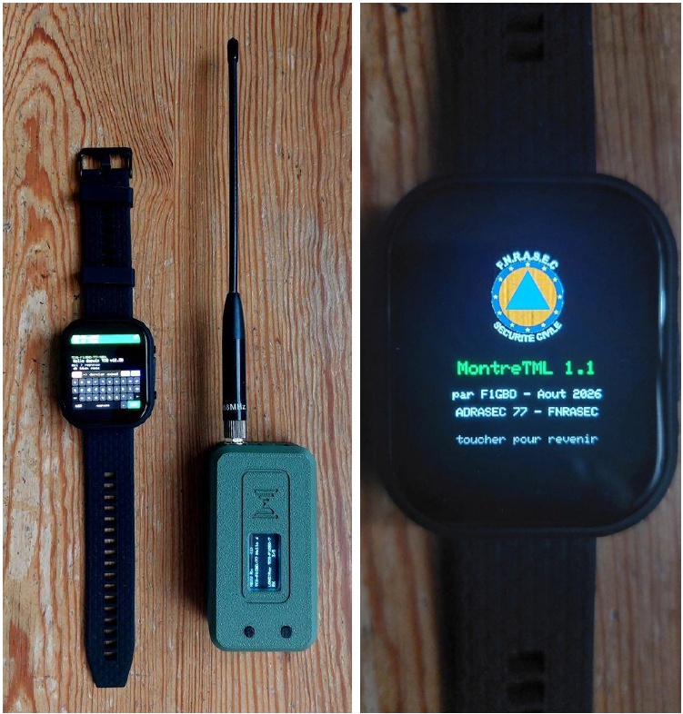
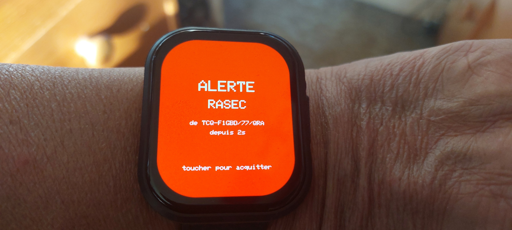
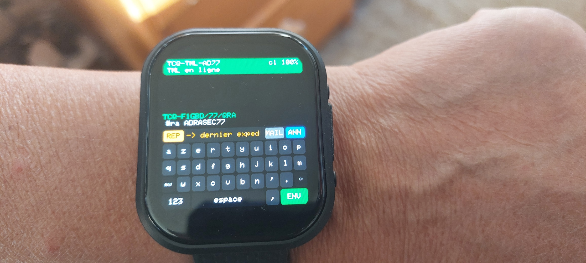
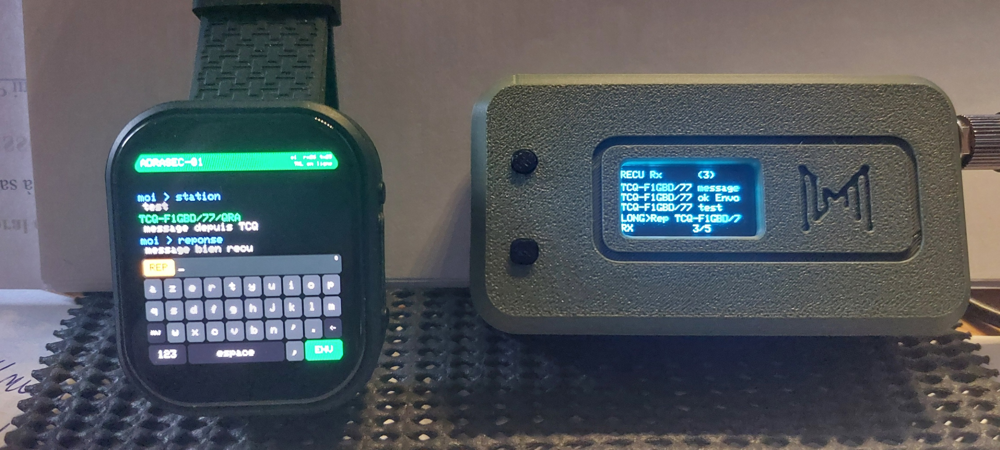
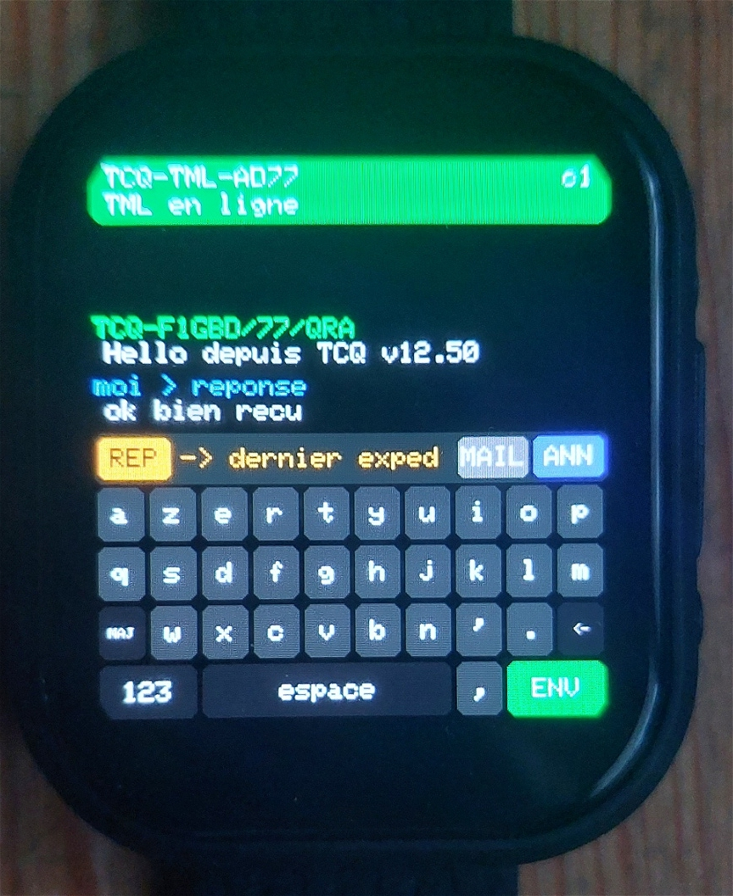
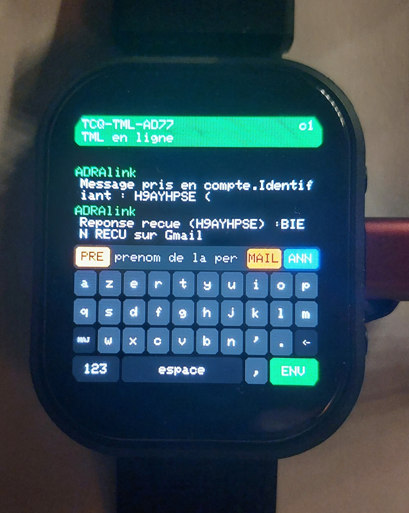
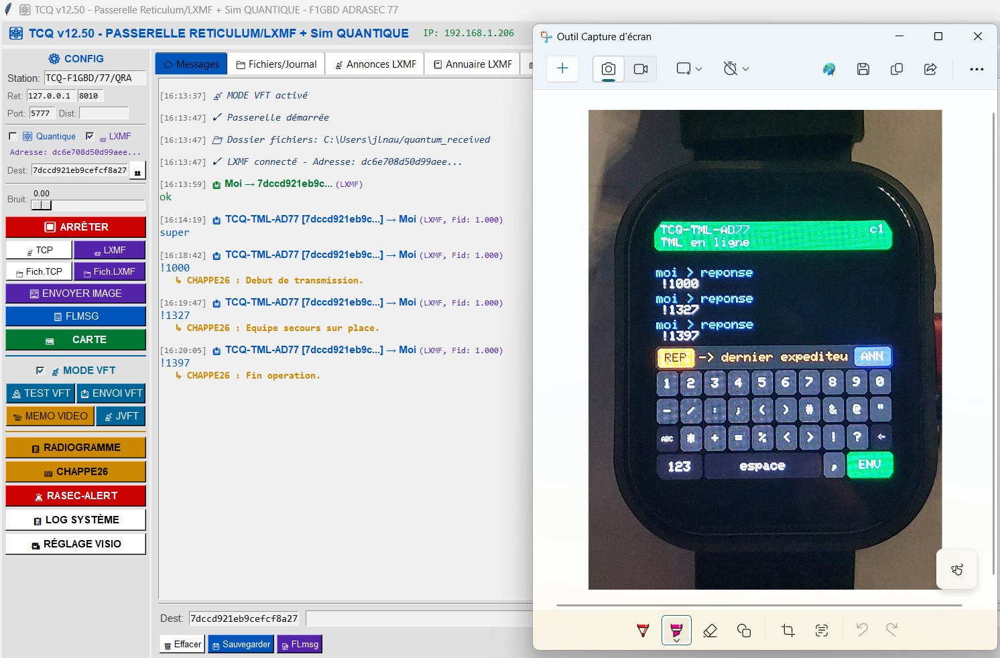

# Montre TML — la messagerie d'urgence au poignet

Terminal de messagerie **LXMF** pour la Waveshare **ESP32-S3-Touch-AMOLED-2.06**,
relié en **ESP-NOW** au [TransMiniLora](https://github.com/f1gbd/F1GBD/tree/master/TML).

La montre ne transmet rien elle-même : elle saisit et affiche. Le TML, resté
dans le sac ou sur la table, est le modem LoRa **et** la pile Reticulum / LXMF.
C'est un choix délibéré — l'identité cryptographique de la station reste dans le
boîtier qui ne quitte pas l'opérateur des yeux, pas dans un objet porté au
poignet. La montre ne contient aucune clé, et la perdre ne compromet rien.

**[➜ Flasher la montre depuis le navigateur](https://f1gbd.github.io/F1GBD/TML/MontreTML/webflash/)**

Chrome ou Edge, aucun outil à installer, une minute. Uniquement pour la
Waveshare ESP32-S3-Touch-AMOLED-2.06 — la variante ESP32-C6 n'a pas le même
brochage et resterait noire.

---

## Ce qu'elle sait faire

| Fonction | Détail |
|---|---|
| **Messages LXMF** | Émission vers la station configurée dans le TML, ou réponse au dernier expéditeur |
| **Réception** | Tout message reçu par le TML, nominatif comme groupe, apparaît immédiatement et rallume l'écran |
| **Alerte RASEC** | Un message `#ra <code>` déclenche sirène et écran rouge plein cadre |
| **Annonce** | Le pavé **ANN** fait annoncer la station au réseau |
| **Destinataires** | Avant d'écrire : la cible, et combien de correspondants sont réellement joignables |
| **Courriel** | Le pavé **MAIL** compose un formulaire et l'envoie à une passerelle [ADRAlink](https://github.com/f1gbd/F1GBD/tree/master/ADRAlink), relayé en Winlink ou en courriel |
| **Clavier** | AZERTY tactile, trois modes : minuscules, majuscules, chiffres et symboles |
| **Veille** | Écran éteint après une minute, réveil au toucher ou à l'arrivée d'un message |
| **Accu** | Niveau et état de charge dans le bandeau, alerte sous 15 % |
| **Historique** | Les douze derniers messages survivent à la coupure |
| **Heure et date** | Horloge sauvegardée par pile, affichée en haut à droite. Réglage au doigt |
| **À propos** | Un appui sur le bandeau affiche le logo FNRASEC, la version et l'origine |

Le tout tient dans un boîtier de montre, sans téléphone ni ordinateur.

---

## L'alerte RASEC

   
   

Depuis n'importe quel nœud Reticulum / LXMF — RTspk Pager, Ratspeak, MeshChat,
TCQ — un message envoyé à l'adresse LXMF de la station déclenche l'alerte :
**écran rouge clignotant plein cadre et sirène**, jusqu'à acquittement.

| Commande | Effet |
|---|---|
| `#ra ADRASEC77` | Déclenche l'alerte (écran clignotant + sirène + accusé) |
| `#rapass <ancien> <nouveau>` | Change le code d'activation, conservé d'un allumage à l'autre |
| `#b <n>` | Répétitions de la sirène. `#b 0` = sirène continue jusqu'à acquittement. Plage 0–20 |

Code par défaut : **ADRASEC77**, insensible à la casse.

**Acquittement** : toucher l'écran. Pendant l'alerte, le clavier et les pavés
sont neutralisés et la veille est suspendue — la seule action possible est
l'acquittement.

L'accusé renvoyé, « Pager OK - alerte bien recue », **ne contient jamais le
code** : il repartirait vers l'expéditeur, et un nœud qui répète les messages
pourrait le renvoyer, déclenchant une boucle d'alertes. Le message déclencheur,
lui, reste affiché dans le fil : l'opérateur doit voir qui l'a alerté.

---

## Écrire et recevoir

   

Bandeau **vert**, le TML répond et son indicatif s'affiche ; **rouge**, la montre
le cherche encore. En haut à droite, la date et l'heure ; en dessous, le canal et
le niveau d'accu — `c1 87%`, avec un `+` en charge.

L'horloge est celle de la carte, sauvegardée par pile : elle survit aux
coupures. Tant qu'elle n'a jamais été réglée, le bandeau affiche `--/-- --:--`
plutôt qu'une date inventée. Pour la mettre à l'heure : appui sur le bandeau,
puis **RÉGLER L'HEURE**, et cinq champs s'ajustent avec les pavés `−`, `champ`
et `+`.

Trois pavés bordent la ligne de saisie :

* **STA / REP** choisit le destinataire. Il bascule tout seul sur `REP` dès qu'un
  message nominatif arrive. Sur une ligne vide, il affiche à qui part le message
  et combien de destinataires sont joignables : `2/5` en orange signale que trois
  d'entre eux n'ont pas encore été entendus et que l'envoi échouera pour ceux-là.
* **MAIL** bascule en composition de courriel ADRAlink.
* **ANN** déclenche une annonce immédiate.

Le fil colore les messages : vert pour une réception nominative, orange pour une
diffusion de groupe, bleu pour ce que vous avez émis.

### Le clavier

   

AZERTY sur dix touches par rangée. `MAJ` passe en majuscules, `123` aux chiffres
et symboles, `←` efface, `ENV` envoie. Pratique pour les codes chiffrés du
Chappe 26 comme pour le texte libre.

---

## Le courriel par ADRAlink

   

Appuyer sur **MAIL**, puis remplir cinq champs en passant de l'un à l'autre avec
le pavé de gauche :

| Pavé | Champ | Contenu |
|---|---|---|
| `PRE` | Prenom | prénom de la **personne** au nom de qui part le message |
| `NOM` | Nom | son nom de famille |
| `MEL` | Email | une ou deux adresses, séparées par une virgule |
| `OBJ` | Objet | pré-rempli avec « Nouvelles » |
| `MSG` | Message | le texte |

Prénom et Nom désignent le sinistré à l'abri, pas l'opérateur radio.

L'adresse de la passerelle n'est jamais saisie : le TML écoute les annonces du
réseau et retient toute station dont le nom contient « adralink » sans contenir
« client ». Changer de passerelle en cours d'opération ne demande aucun réglage.

---

## Il faut aussi un TransMiniLora

La montre seule ne sert à rien. Le TML doit tourner avec un firmware intégrant
le **pont ESP-NOW** — voir la page du
[TransMiniLora](https://github.com/f1gbd/F1GBD/tree/master/TML).

Les deux appareils doivent être sur le **même canal WiFi**. La montre balaie les
canaux 1 à 13 au démarrage et se verrouille sur le premier TML qui répond : il
n'y a normalement rien à régler.

---

## Documentation

* **[Manuel d'utilisation](documentations/Montre_TML_Manuel.pdf)** — mise en route,
  écran, clavier, alerte RASEC, courriel, veille, dépannage, mémento
* **[Fiche technique](documentations/Montre_TML_Fiche_technique.pdf)** — les
  fonctionnalités en résumé

---

## Limites connues

* Message reçu et message émis plafonnés à **200 caractères**. Ce n'est pas une
  contrainte du lien mais du temps d'antenne : 200 caractères en SF8 / 125 kHz,
  c'est déjà plusieurs secondes d'émission LoRa.
* Les accents sont translittérés, à l'affichage comme à la saisie.
* ESP-NOW maintient la radio WiFi allumée. La veille éteint l'écran, qui est le
  gros consommateur, mais pas la radio.
* Le fil conserve douze messages ; au-delà, les plus anciens disparaissent.

---

F1GBD — ADRASEC 77 - FNRASEC
