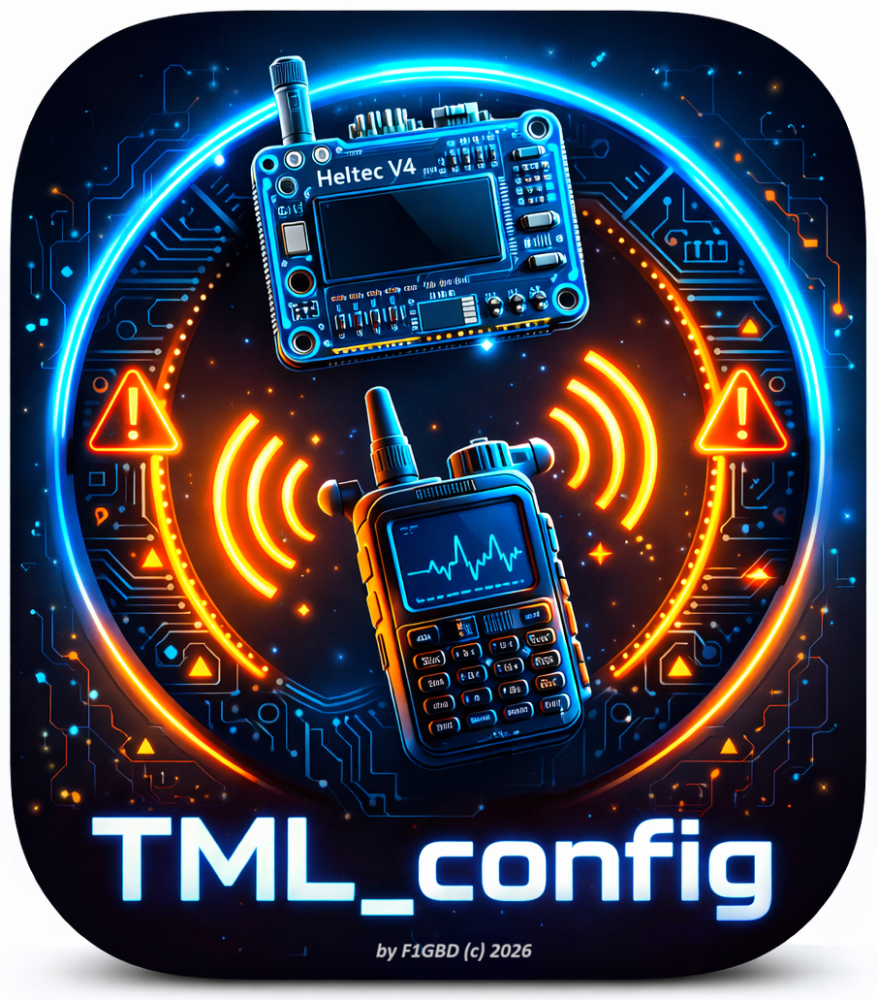
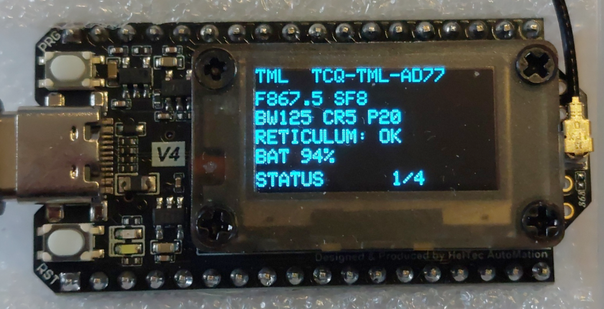
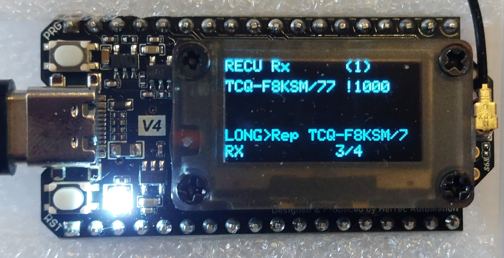
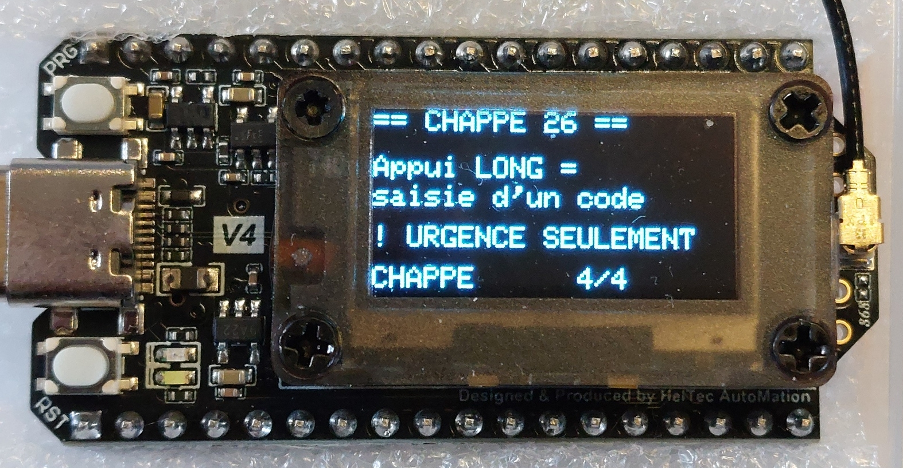
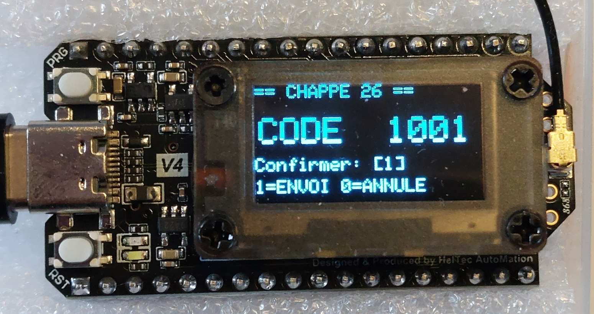
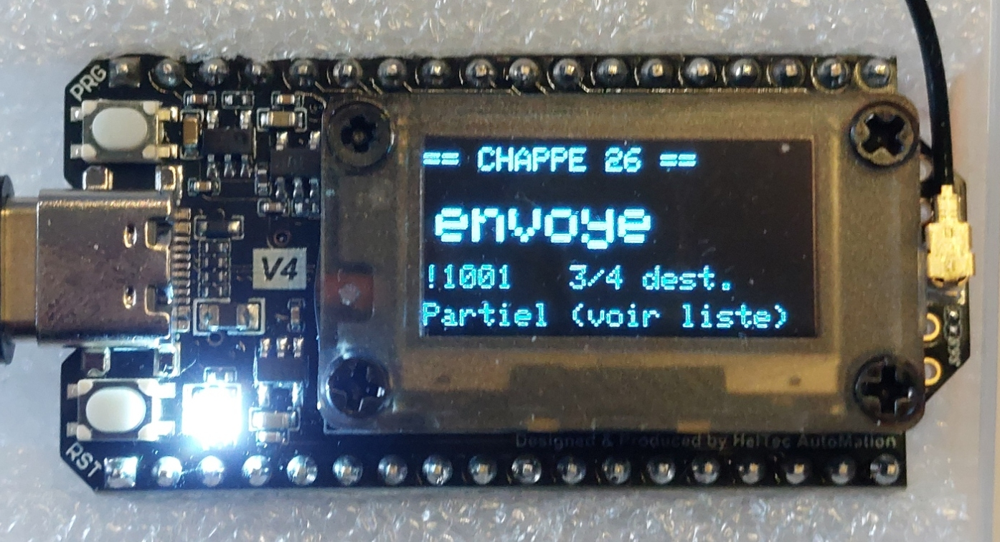
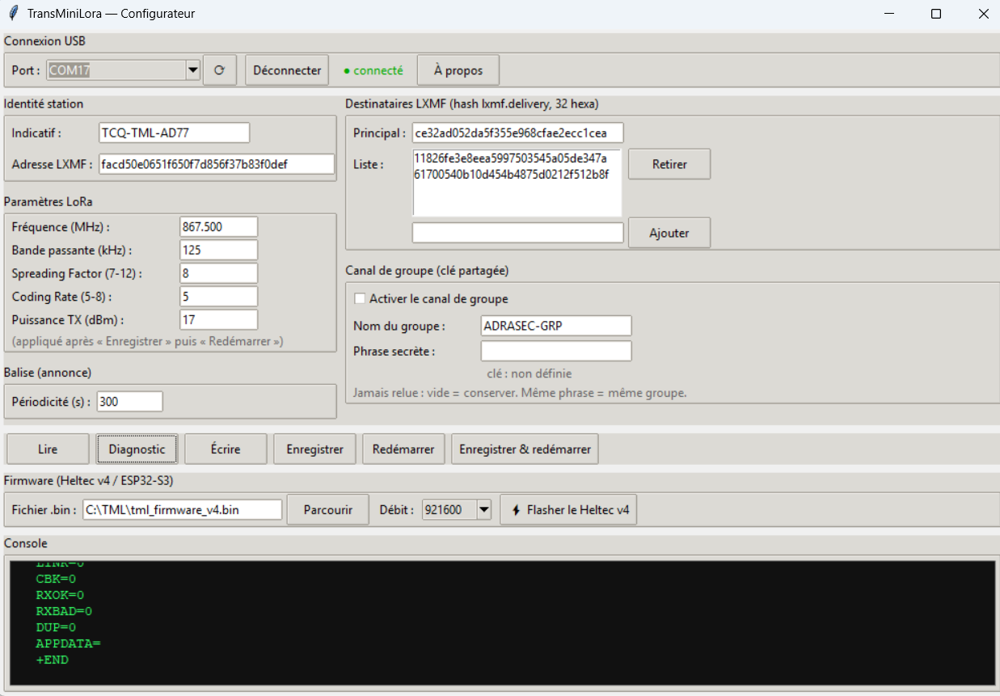

# TransMiniLora (TML)

**Mini-transceiver LoRa autonome pour la transmission de codes « Chappe 26 » en situation d'urgence — sans téléphone, sans application, sans Internet.**

*par F1GBD — ADRASEC 77 / FNRASEC — © 2026*

---

## Présentation

**TransMiniLora** transforme une carte **Heltec WiFi LoRa 32 V4** (ESP32‑S3 + SX1262)
en un **émetteur‑récepteur LoRa autonome** dédié à l'échange de **codes « Chappe 26 »**
(format `!DDDD` — 4 chiffres) sur le réseau **Reticulum**, au format **LXMF**. voir le **LIVRET du Code CHAPPE-26** (https://github.com/f1gbd/F1GBD/blob/master/TML/documentation/Chappe26_Livret_B5.pdf)

Conçu pour l'**ADRASEC / FNRASEC**, le TML fonctionne **sans PC, sans téléphone et
sans Internet** : la saisie et la lecture des messages se font directement sur la
carte, à l'aide de son unique bouton et de son écran OLED. Idéal pour transmettre des
messages courts et normalisés quand les réseaux habituels sont indisponibles.

Le TML **interopère avec n'importe quel client LXMF** (TCQ, RATspeak, Columba, Sideband, NomadNet, MeshChat,
station Reticulum…) : il reçoit aussi bien les messages livrés en mode *opportuniste*
que ceux livrés *en direct* (via un Link), et renvoie une preuve de livraison.

&nbsp;&nbsp;

---

## Matériel

| Élément | Détail |
|---|---|
| Carte | **Heltec WiFi LoRa 32 V4** |
| MCU | ESP32‑S3 (PSRAM, 16 Mo flash) |
| Radio | Semtech **SX1262** (LoRa) |
| Écran | OLED 128×64 |
| Commande | 1 bouton **USER** (appui court / long) |
| Alimentation | USB‑C / batterie LiPo |

---

## Fonctionnalités

- **Émission** de codes Chappe 26 (`!DDDD`) vers un destinataire principal **et** une
  liste de diffusion (configurés avant mission).
- **Réception** de messages LXMF, en **opportuniste** *et* **par Link** (livraison
  directe des clients LXMF complets).
- **Réponse directe** : appui long sur la page *Rx* pour répondre à l'expéditeur du
  dernier message reçu.
- **Preuve de livraison** renvoyée à l'émetteur → pas de retransmissions inutiles.
- **Déduplication** des messages (par empreinte LXMF) comme filet de sécurité.
- **Balise / annonce** périodique (indicatif de la station).
- **Journal Rx** des derniers messages reçus, indicatif expéditeur affiché proprement.
- **Persistance** de la configuration en flash (LittleFS) — conservée après extinction.
- **Configurateur USB** dédié (`TML_config`) avec paramétrage **et flashage** de la carte.

---

## Écran & navigation

Un **appui court** fait défiler les pages ; un **appui long** déclenche l'action de la page.

| Page | Contenu | Appui long |
|---|---|---|
| **STATUS** (1/4) | Fréquence, SF, BW, CR, puissance, état Reticulum, batterie | — |
| **RECENT ADVERT** (2/4) | Stations connues, joignabilité du destinataire | **Émettre une annonce** |
| **RECU Rx** (3/4) | Journal des messages reçus (indicatif + `!DDDD`) | **Répondre** au dernier expéditeur |
| **CHAPPE 26** (4/4) | Écran de saisie | **Saisir un code** à émettre |

**Saisie d'un code** : appui court = +1 sur le chiffre courant ; appui long = valider le
chiffre. Après les 4 chiffres, un 5ᵉ champ de confirmation (`1` = envoi, `0` = annulation).

&nbsp;&nbsp;

&nbsp;&nbsp;

---

## Paramètres LoRa par défaut (canal ADRASEC)

| Paramètre | Valeur |
|---|---|
| Fréquence | **867.5 MHz** |
| Bande passante | 125 kHz |
| Spreading Factor | SF8 |
| Coding Rate | 4/5 |
| Puissance TX | 17 dBm |

*(Modifiables via le configurateur `TML_config` ; appliqués après « Enregistrer » puis « Redémarrer ».)*

---

## Installation & flashage

Le firmware est **prêt à l'emploi** : aucune compilation nécessaire.

1. Télécharge l'archive **[`TML.7z`](https://github.com/f1gbd/F1GBD/releases/download/tml-v1.0.0/TML-v1.0.0.7z)** et
   décompresse-le : tu obtiens `tml_firmware_v4.bin` et la licence.
2. Lance le configurateur **`TML_config`** (`tml_config.exe`).
3. Branche le Heltec v4 en USB, sélectionne son **port**.
4. Dans la section *Firmware*, pointe `tml_firmware_v4.bin`, puis clique
   **« ⚡ Flasher le Heltec v4 »**.

> Si la carte n'entre pas en mode téléchargement : maintiens **BOOT**, appuie sur
> **RST**, relâche **BOOT**, puis relance le flash.

Procédure détaillée dans le **[Guide d'utilisation](documentation/GUIDE_UTILISATION.md)**.

---

## Configurateur `TML_config`

Application Windows pour préparer une
carte **avant mission** :

- Indicatif de la station, lecture de l'**adresse LXMF** du TML.
- Paramètres LoRa (fréquence, BW, SF, CR, puissance).
- Périodicité de la balise.
- Destinataire LXMF principal + liste de diffusion.
- **Flashage** du firmware sur le Heltec v4 (esptool intégré).

---

## Utilisation

- **Émettre** : page *CHAPPE 26* → appui long → saisir `!DDDD` → confirmer. Le code part
  vers le destinataire principal et la liste de diffusion.
- **Recevoir** : à réception, le TML bascule sur la page *Rx* et journalise le message
  (`indicatif  !DDDD`).
- **Répondre** : page *Rx* → appui long → saisir un code → il est envoyé **uniquement**
  à l'expéditeur du dernier message.

---

## Interopérabilité LXMF

Le TML est compatible **TCQt/LXMF** sur **Reticulum**. Il dialogue avec :
**RATspeak - version ADRASEC**, **Columba**, **Sideband**, **NomadNet**, **Reticulum MeshChat** et toute station Reticulum/LXMF, en
livraison opportuniste comme en livraison directe (Link).

---

## Documentation

- **[Guide d'utilisation](documentation/MEMO - GUIDE_UTILISATION.pdf)** — flashage, configuration
  et utilisation sur le terrain.

*(Les documents sont dans le sous‑dossier [`documentation/`](documentation), les captures et le logo dans [`images/`](images).)*

---

## Téléchargement

L'archive **`TML.7z`** contient :

- `tml_firmware_v4.bin` — image firmware fusionnée, à flasher à l'offset `0x0` ;
- la **licence** (GPLv3).

➡️ **[Télécharger la dernière version](https://github.com/f1gbd/F1GBD/releases/download/tml-v1.0.0/TML-v1.0.0.7z)** *(ou depuis ce dossier du dépôt).*

---

## Crédits

- Firmware basé sur **microReticulum_Firmware** — Chad **Attermann**.
- **Reticulum** & **LXMF** — Mark **Qvist**.
- Format **Chappe 26** — nomenclature de messages courts.
- Intégration TML, UI Chappe, couche LXMF embarquée, configurateur — **F1GBD**.

---

## Licence

Distribué sous licence **GNU GPL v3.0** (comme le firmware de base). Voir le fichier
`LICENSE`.

---

**TransMiniLora** — *by F1GBD — ADRASEC 77 / FNRASEC — © 2026*

