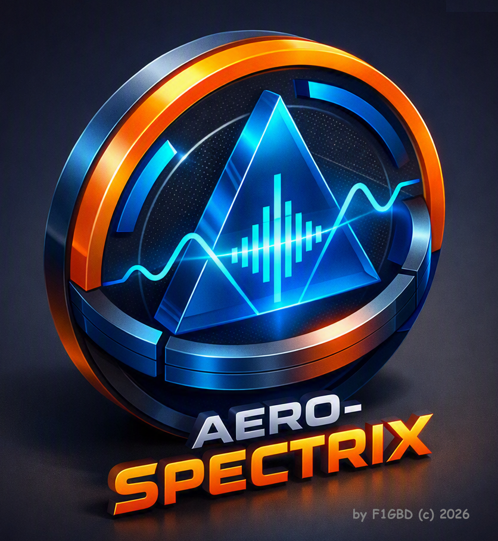
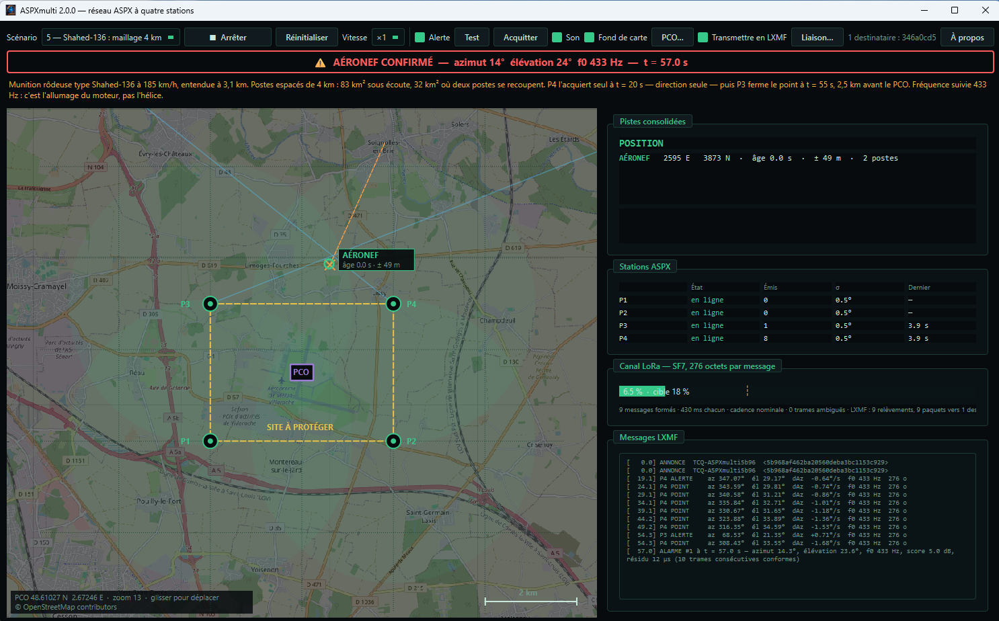
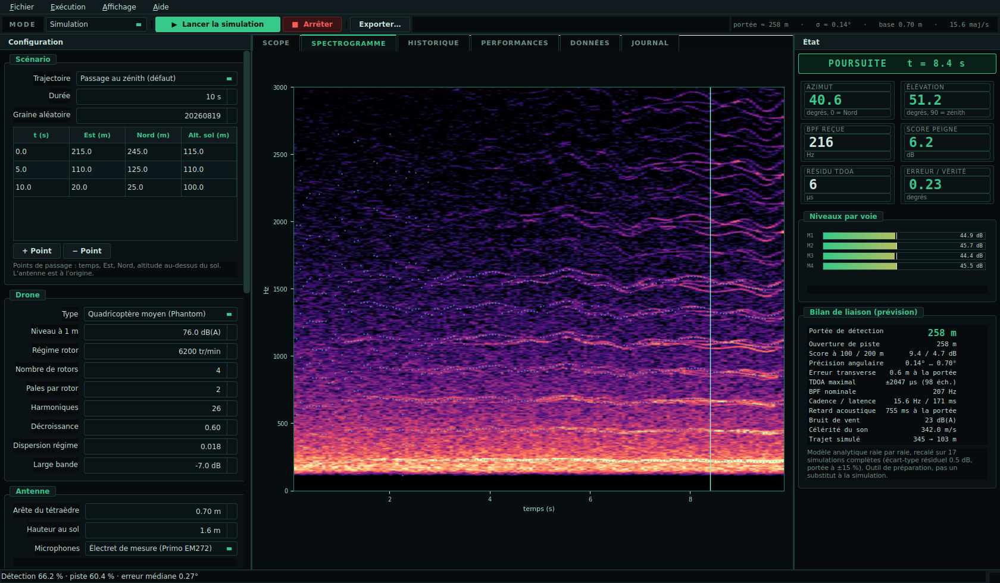
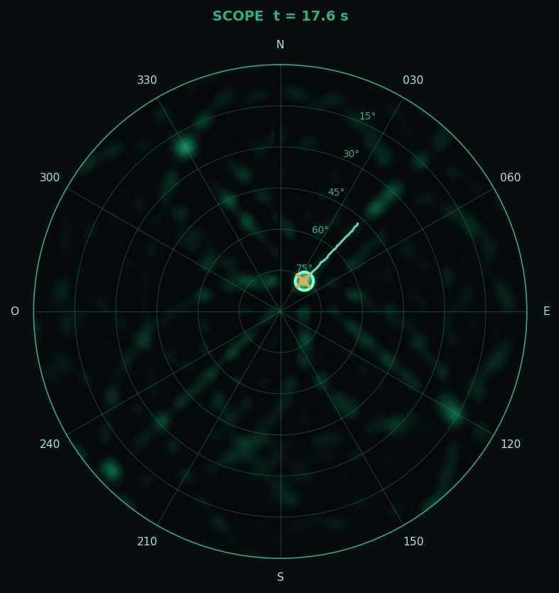
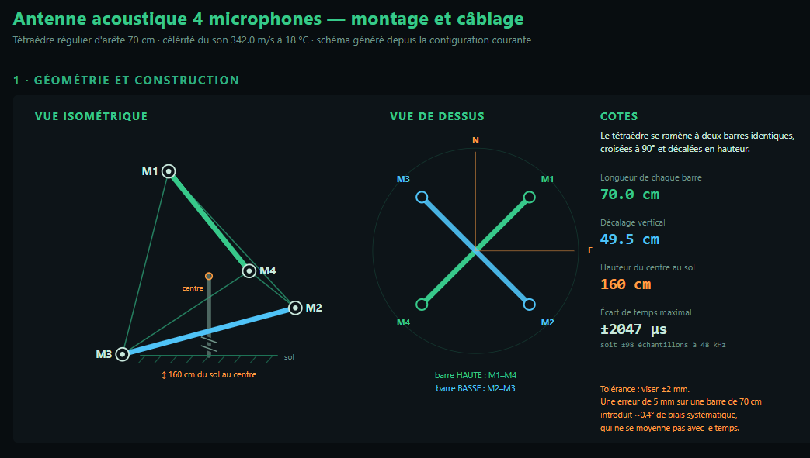

<div align="center">



# AERO-SPECTRIX — ASPX

**Radar acoustique de détection, de localisation et de poursuite d'aéronefs sans pilote**


*par F1GBD — ADRASEC 77 / FNRASEC*

</div>

---

Quatre microphones disposés en tétraèdre, et un écran de type radar.
AERO-SPECTRIX — **ASPX** en abrégé, *Aero-SpectriX* — détecte, localise et
suit un drone ou un avion léger **à son seul bruit** : ni radio, ni radar, ni caméra. Un aéronef silencieux du point
de vue radio, sans télémétrie et de nuit, reste parfaitement audible.

Le principe tient en une phrase : le son n'arrive pas exactement au même
instant sur les quatre microphones, et ces quelques microsecondes d'écart
suffisent à retrouver la direction de la source. Avec une antenne de 70 cm
d'arête, l'écart maximal entre deux microphones vaut 2 047 µs, soit
98 échantillons à 48 kHz — largement mesurable.

<div align="center">

<br><em>Poursuite en cours. Le bandeau rouge signale une signature acoustique confirmée : azimut 360°, élévation 19°, BPF 213 Hz, score 4,9 dB.</em>
</div>

> **Deux applications, une seule archive.** Depuis la 1.4.0, le téléchargement
> contient aussi **ASPXmulti v2.0** : quatre stations ASPX réparties autour
> d'un site, leurs relèvements croisés en direct, la position consolidée au
> PCO et sa transmission en LXMF vers TCQ ou RATspeak. Une antenne seule
> mesure une **direction** ; il en faut deux pour obtenir un **point**.
> [Aller à ASPXmulti](#aspxmulti--le-réseau-à-quatre-stations)

---

## Sommaire

- [Ce que le système fait](#ce-que-le-système-fait)
- [Ce qu'il ne fait pas](#ce-quil-ne-fait-pas)
- [Performances](#performances)
- [Installation](#installation)
- [Prise en main en cinq minutes](#prise-en-main-en-cinq-minutes)
- [Scénarios de démonstration](#scénarios-de-démonstration)
- [ASPXmulti — le réseau à quatre stations](#aspxmulti--le-réseau-à-quatre-stations)
- [La station transmet en LXMF](#la-station-transmet-en-lxmf)
- [Fonctionnalités](#fonctionnalités)
- [Lire le scope](#lire-le-scope)
- [Le matériel](#le-matériel)
- [Version d'évaluation à bas coût](#version-dévaluation-à-bas-coût)
- [Documentation](#documentation)
- [Validation](#validation)
- [Nouveautés de la version 1.4.1](#nouveautés-de-la-version-141)
- [Nouveautés de la version 1.4.0](#nouveautés-de-la-version-140)
- [Nouveautés de la version 1.3.0](#nouveautés-de-la-version-130)
- [Architecture](#architecture)
- [Licence](#licence)

---

## Ce que le système fait

Une seule application, deux modes, **la même chaîne de traitement dans les
deux** — ce que vous validez en simulation est littéralement le code qui
tournera sur le matériel.

| Mode | Ce qu'il fait | À quoi il sert |
|---|---|---|
| **Simulation** | Reconstitue une scène acoustique complète — signature de l'aéronef, propagation dans l'atmosphère, bruits d'ambiance et de vent — et fait tourner la chaîne de traitement dessus | Préparer une mission, dimensionner l'antenne, se former, évaluer une portée avant de sortir le matériel |
| **Direct** | Applique la même chaîne au flux réel d'une carte son quatre voies | Exploitation sur le terrain |

La chaîne de traitement est classique et documentée : détection par peigne
harmonique, corrélations croisées **GCC-PHAT** interpolées, carte
**SRP-PHAT** sur l'hémisphère céleste, résolution de la direction par
moindres carrés avec rejet d'aberrants, puis **filtre de Kalman** avec
initiation de piste M-de-N.

<div align="center">

<br><em>Un passage au zénith, vu de bout en bout : carte SRP-PHAT, spectrogramme
avec les harmoniques suivies, azimut et élévation pistés contre la vérité, et
score de peigne au regard du seuil de détection.</em>
</div>

## Ce qu'il ne fait pas

Trois limites à connaître avant de s'en servir. Aucune ne relève d'un défaut
du logiciel : elles tiennent à la physique de la mesure acoustique passive.

- **Pas de distance.** Une antenne unique mesure une **direction**, jamais une
  position. Obtenir la distance suppose une seconde antenne distante de 50 à
  200 m, ou une hypothèse d'altitude connue.
- **Le vent est l'ennemi n° 1.** Le pseudo-bruit de vent sur les capsules croît
  d'environ **+17 dB par doublement de la vitesse**. Au-delà de 4 à 5 m/s, la
  portée s'effondre quelles que soient les bonnettes.
- **Latence physique incompressible.** À 300 m, le son met 0,88 s à parvenir aux
  microphones. Le scope montre donc où l'aéronef **était**, pas où il est.

## Performances

Portées de détection prévues par le bilan de liaison, en campagne calme
(bruit de fond 32 dB(A), vent 2 m/s, antenne de 70 cm) :

| Aéronef | Niveau à 1 m | Fréquence suivie | Trame seule | Fenêtre adaptative |
|---|---:|---:|---:|---:|
| Mini quadricoptère (DJI Mini) | 68 dB(A) | 273 Hz | 128 m | **215 m** |
| Quadricoptère moyen (Phantom) | 76 dB(A) | 207 Hz | 258 m | **415 m** |
| Gros hexacoptère | 84 dB(A) | 140 Hz | 400 m | **632 m** |
| Aile / hélice unique électrique | 79 dB(A) | 233 Hz | 615 m | **931 m** |
| Avion thermique 4 temps, 4 cyl. | 90 dB(A) | 167 Hz | 1 071 m | **1 540 m** |
| Avion thermique 2 temps, 2 cyl. | 92 dB(A) | 233 Hz | 1 391 m | **1 930 m** |
| Avion thermique 2 temps, 4 cyl. | 95 dB(A) | 400 Hz | 1 974 m | **2 627 m** |
| **Shahed-136 / Geran-2** | 101 dB(A) | 433 Hz | 2 715 m | **3 472 m** |

> La colonne de gauche est celle des versions jusqu'à la 1.3.0. Celle de
> droite est la 1.4.0 avec sa fenêtre de détection adaptative — même
> matériel, même seuil, même taux de fausse alarme.
>
> *Les chiffres publiés jusqu'ici annonçaient « campagne de jour, 34 dB(A),
> vent 2,5 m/s ». La légende était fausse : ils étaient calculés avec la
> configuration par défaut, 32 dB(A) et 2 m/s. Les valeurs, elles, sont
> exactes et se reproduisent au mètre près.*

**Précision angulaire** : 0,14° dans les meilleures configurations, 0,70° dans
les plus défavorables, avec une arête de 70 cm. Erreur médiane mesurée sur le
scénario de référence : **0,27°**.

<div align="center">

<br><em>L'onglet <strong>Performances</strong> : azimut et élévation contre la
vérité, erreur de pointage en échelle logarithmique, score de peigne et résidu
des moindres carrés, effet Doppler sur la fréquence de passage de pale, erreur
en fonction de la distance.</em>
</div>

> **Le facteur qui domine tout n'est pas le matériel, c'est le site.** À
> matériel constant, la portée passe de 22 m en environnement urbain à 655 m
> sur un site de campagne très calme. Gagner 10 dB sur le bruit de fond —
> s'éloigner d'une route, se placer derrière un talus, opérer de nuit —
> multiplie la portée par trois. Aucun réglage n'a cet effet.

## Installation

Téléchargez **`ASPX.7z`** : https://github.com/f1gbd/F1GBD/releases/download/v1.42/ASPX.7z puis décompressez-la
où vous voulez — [7-Zip](https://www.7-zip.org/) ou tout autre outil sachant
lire ce format. Vous obtenez un dossier `ASPX\` contenant :

| Élément | |
|---|---|
| `ASPX.exe` | **la station** v1.4.1 — une antenne, détection, poursuite, liaison LXMF |
| `ASPXmulti.exe` | **le réseau** v2.0.0 — quatre stations, fusion au PCO |
| `_internal\` | les bibliothèques, communes aux deux |
| `scenarios\` | cinq configurations prêtes à charger |
| `AERO-SPECTRIX_fiche_technique.pdf` | la fiche technique |
| `LICENSE` | la licence d'utilisation |
| `THIRD-PARTY-NOTICES.txt` | les licences des composants tiers |

Les deux exécutables partagent le même `_internal\` : Qt, numpy et scipy ne
sont livrés qu'une fois, et une seule archive porte l'ensemble.

**Distribuez et déplacez le dossier entier**, jamais un seul `.exe` : les
bibliothèques posées à côté de lui sont indispensables. Rien à installer, rien
à désinstaller : pour supprimer les applications, supprimez le dossier.

| Élément | Détail |
|---|---|
| Système | Windows 10 ou 11, 64 bits |
| Mémoire vive | 4 Go minimum, 8 Go recommandés |
| Espace disque | environ 400 Mo, dossier décompressé |
| Écran | 1 366 × 768 minimum |
| Droits | aucun droit d'administrateur nécessaire |
| Réseau | **`ASPX.exe` : aucun**, la station ne communique avec rien. `ASPXmulti.exe` : uniquement si vous cochez *Fond de carte* (tuiles OpenStreetMap, mises en cache) ou *Transmettre en LXMF* (Reticulum). Décochées, il ne sort rien non plus. |
| Carte son | uniquement pour le mode Direct |

Comptez **2 à 4 secondes** avant l'affichage de la fenêtre ; un écran de
démarrage couvre l'attente.

<details>
<summary><strong>Si Windows affiche un avertissement SmartScreen</strong></summary>

L'exécutable n'est pas signé par un certificat commercial. Windows affiche
alors « Windows a protégé votre ordinateur ». Cliquez sur *Informations
complémentaires* puis *Exécuter quand même*. Le message ne signale pas un
problème détecté : il signale que l'éditeur n'a pas payé de certificat de
signature de code. Le SHA-256 publié avec chaque release est là pour vous
permettre de vérifier vous-même que le fichier téléchargé est bien celui qui a
été publié :

```powershell
Get-FileHash -Algorithm SHA256 ASPX.7z
```
</details>

## Prise en main en cinq minutes

1. Lancez l'application et **ne touchez à rien**. Le scénario par défaut est un
   quadricoptère qui passe au-dessus de l'antenne.
2. Regardez le **bilan de liaison** en bas à droite : il annonce déjà une portée
   d'environ 258 m, avant tout calcul.
3. Cochez **ALARME**, cliquez sur **Test** : le bandeau doit clignoter et la
   sirène retentir. À faire une fois par séance.
4. Cliquez sur **▶ Lancer la simulation** (ou `F5`). Comptez cinq à huit fois la
   durée simulée en temps de calcul. **Le scope reste vide pendant ce temps —
   c'est normal**, la piste n'apparaît qu'à la fin.
5. La relecture démarre toute seule. Cochez **Écouter le son** : vous entendez le
   bourdonnement du quadricoptère.

Le rond ○ est la piste estimée, la croix × orange la position vraie. L'écart
entre les deux est l'erreur réelle, affichée en chiffres.

## Scénarios de démonstration

Le dossier `scenarios/` de l'archive contient cinq configurations prêtes à
charger — *Fichier → Charger une configuration…* — placées dans la bande où
la trame seule décroche et où la fenêtre adaptative tient encore. Elles sont
là pour être **rejouées** : la graine aléatoire est fixée, le bruit et la
trajectoire sont identiques d'une passe à l'autre, et la seule variable est
le réglage *Fenêtre de détection*.

Toutes tournent dans les conditions **par défaut** — 32 dB(A), vent 2 m/s,
18 °C, 60 % HR, antenne de 70 cm — celles du tableau de portée ci-dessus.

| # | Scénario | 1ʳᵉ détection | Préavis gagné | Trames détectées | Erreur médiane |
|---|---|---:|---:|---:|---:|
| 1 | Quadricoptère moyen, approche depuis 440 m | 343 → **414 m** | +8,9 s | 45,9 → 55,9 % | 0,29° |
| 2 | Gros hexacoptère, passage latéral à 480 m | 542 m d'emblée | — | 50,4 → **80,7 %** | 1,13° |
| 3 | Aile électrique, approche depuis 960 m | 605 → **723 m** | +5,7 s | 49,6 → 52,2 % | 0,60° |
| 4 | Avion thermique 2 temps 4 cyl., depuis 2,4 km | 2 042 → **2 406 m** | +7,0 s | 63,6 → 76,0 % | 0,75° |
| 5 | **Shahed-136 / Geran-2**, de front depuis 3,15 km | 2 267 → **3 164 m** | +20,2 s | 56,8 → 73,9 % | 0,60° |

*Format : `trame seule` → `fenêtre adaptative`. Ces valeurs sont mesurées sur
la simulation, non prédites par le bilan de liaison. L'erreur angulaire est
comptée contre la position d'**émission** : à 3 km le son met neuf secondes à
parvenir à l'antenne.*

Le scénario 2 est celui à montrer quand la question est « la piste
tient-elle ? » plutôt que « jusqu'où voit-on ? » : à distance constante la
fenêtre longue ne recule aucun seuil, mais la piste passe de 70 % à 95 % du
temps. Le scénario 5 est le plus démonstratif : vingt secondes de préavis
supplémentaires, soit un kilomètre à 185 km/h.

Le `README.md` du dossier détaille chaque cas, y compris ce qu'il **ne**
montre pas — deux scénarios acquièrent la cible dès son entrée en scène et ne
mesurent donc pas le seuil réel, et sur l'aile électrique le bilan de liaison
se révèle optimiste de 22 %.

## ASPXmulti — le réseau à quatre stations

`ASPXmulti.exe`, livré dans la même archive, est une **seconde application**.
Elle répond à la limite que la station seule ne peut pas franchir : une
antenne mesure une direction, jamais une distance. Quatre stations réparties
autour d'un site croisent leurs relèvements, et l'intersection donne un
**point**.

<div align="center">

<br><em>Scénario Shahed-136, maillage de 4 km au nord de Melun. P3 et P4 tiennent
la cible, la position consolidée est donnée à ± 49 m, et le bandeau rouge
signale l'aéronef confirmé. Fond OpenStreetMap à l'échelle de la simulation.</em>
</div>

### Ce qui est simulé, et ce qui ne l'est pas

Seule la **scène** est simulée : la trajectoire de l'aéronef, et le relèvement
bruité que chaque station en tire. Tout le reste est le code réel. Les
messages sont encodés par le vrai format de télémétrie, soumis à la vraie
politique de cadence, comptés dans le vrai budget de canal LoRa, décodés,
puis croisés par la vraie fusion. Ce que l'écran montre est produit par ce qui
tournerait sur le terrain, pas par une maquette.

### L'échelle du terrain dépend de la cible

C'est le point le moins intuitif du dispositif, et le plus important à
comprendre avant de déployer quoi que ce soit.

| Cible | Portée d'une station | Écartement des postes | Sous écoute | Où **deux** postes se recoupent |
|---|---:|---:|---:|---:|
| Quadricoptère moyen | 258 m | carré de 300 m | 0,5 km² | 0,24 km² |
| **Shahed-136 / Geran-2** | 3 100 m | 4 km × 3 km | **83 km²** | **31,8 km²** |

Même logiciel, même protocole, même fusion : seul le maillage change. La
surface où l'on obtient une position — et non une simple direction — est
multipliée par 131.

Sur le scénario Shahed livré, P4 acquiert seul à **t = 20 s** — direction, pas
de position — puis P3 ferme le point à **t = 55 s**, 2,5 km avant le PCO.
Erreur médiane sur la position consolidée : **26 m**, p90 55 m, pour
45 messages sur le canal LoRa en 140 s.

### Cinq scénarios

Approche simple · deux aéronefs (le cas des **fantômes**) · perte d'un poste ·
vent fort · Shahed-136 en maillage 4 km.

Le scénario des fantômes mérite un mot. Deux aéronefs de même altitude et de
même régime rotor, entendus par deux postes seulement, produisent quatre
relèvements et **deux appariements également crédibles** : celui qui est vrai
et celui qui croise en diagonale. ASPXmulti affiche alors les **deux
hypothèses** plutôt qu'une position fausse — et l'alarme, si elle était déjà
déclenchée, retire sa position tout en continuant de sonner. Quelque chose est
bien là ; c'est le point qui n'est plus sûr.

### Trois options, par case à cocher

| | |
|---|---|
| **Alerte** | bandeau clignotant et sirène sur position confirmée par le réseau. Une fusion ambiguë ne déclenche rien : deux appariements également crédibles ne valent pas une alarme, ils valent une question. |
| **Son** | ce qu'on entendrait au PCO, calculé : retard de propagation, effet Doppler qui en découle, absorption de l'atmosphère harmonique par harmonique. Le bruit de fond est calé pour que l'aéronef **émerge à la portée annoncée** — on l'entend arriver quand la carte le détecte. |
| **Fond de carte** | tuiles OpenStreetMap au niveau de zoom qui fait correspondre un pixel de tuile à un pixel écran : le terrain est à l'échelle de la simulation. Glissez la carte pour amener votre site sous le dispositif. |

Aucune des trois n'influe sur la simulation : les compteurs de messages, les
ambiguïtés et les positions fusionnées sont identiques qu'elles soient cochées
ou non.

### La liaison LXMF

ASPXmulti transmet les relèvements en **LXMF sur Reticulum**, vers une station
TCQ ou RATspeak désignée par son adresse. La fenêtre « Liaison… » écoute les
annonces du réseau et présente les stations entendues, comme le fait l'onglet
« Annonces LXMF » de TCQ.

> **LXMF ne diffuse pas.** Il n'existe ni adresse de groupe, ni clé partagée :
> ce que TCQ et RATspeak appellent « groupe » est une liste de diffusion tenue
> côté client, qui envoie un message par destinataire. À quatre stations en
> alerte, viser plusieurs destinataires multiplie l'occupation du canal
> d'autant. L'architecture tenable est donc **un seul destinataire direct — la
> station de fusion —** qui redistribue ensuite hors radio.

## La station transmet en LXMF

*Nouveau en 1.4.1.* Jusqu'ici, seul ASPXmulti parlait sur le réseau, et il
simulait ses quatre stations. La **station réelle** sait désormais émettre
ses propres relèvements — vers un poste de commandement, ou, en attendant que
celui-ci existe, vers une station TCQ ou RATspeak pour vérifier la chaîne de
bout en bout.

Le groupe **Liaison LXMF** apparaît dans le panneau d'état, sous l'alarme :
*Destinataire…* liste les stations entendues sur le maillage Reticulum, avec
un filtre ; la case *Transmettre* ouvre la liaison ; trois champs portent la
position du poste.

### Le point d'émission est celui de l'alarme

Un seul endroit du code alimente à la fois la logique d'alarme et la liaison,
et il sert aux **deux modes** — relecture de simulation comme acquisition
directe. Ce qui déclenche l'alarme ici est donc exactement ce qui part vers
le PCO. Deux chemins distincts finiraient par diverger, et l'écart entre « ce
qui sonne ici » et « ce qui part là-bas » est précisément celui qu'on ne peut
pas se permettre.

Conséquence utile : **rien n'est émis tant que la chaîne ne tourne pas.** Une
liaison qui émettrait sur son propre minuteur occuperait le canal pour rien.

### Ce qui part sur l'air

Un relèvement ne pèse que **24 octets** ; le paquet réellement émis en fait
**227**. L'écart n'est pas du gaspillage : signature Ed25519, chiffrement à
clé éphémère, en-tête de transport. C'est le prix d'un message signé, chiffré
et routable, et il se paie en temps d'antenne.

| | charge utile | sur l'air | SF7 | 4 postes à 1 msg / 5 s |
|---|---:|---:|---:|---:|
| relèvement | 24 o | 227 o | 358,7 ms | 28,7 % |
| avec position | 34 o | 237 o | 374,0 ms | 29,9 % |

Au-delà de **18 %** d'occupation, un accès aléatoire perd plus de messages par
collision qu'il n'en gagne en fraîcheur. La cadence s'adapte donc d'elle-même :
un relèvement toutes les **5 s** en piste confirmée, **10 s** quand le canal
sature, un battement de vie toutes les **300 s** au repos. Chaque poste mesure
l'occupation réelle et ralentit seul — aucun coordinateur, et le dispositif se
règle quand un poste s'ajoute ou disparaît.

### La position du poste — format v3

La station transmet **sa propre position** : latitude et longitude au
1e-7 degré (convention NMEA, 1,1 cm, entier signé 32 bits), altitude au mètre.
Dix octets, qui portent la charge utile à 34 et la version de format à 3.

Elle n'est pas dans chaque relèvement. Elle part avec le **premier message**
après l'ouverture de la liaison — le PCO doit pouvoir placer la station dès le
premier relèvement, pas au bout des cinq minutes du battement — puis toutes
les **60 s**. À la cadence confirmée, cela fait un message sur douze : le
surcoût de 4,3 % se dilue à **0,4 %**.

Le budget de canal, lui, est calculé sur le paquet **avec** position, le plus
gros des deux. Surestimer de 4 % fait ralentir un peu tôt ; sous-estimer
ferait émettre au-delà de ce que le canal tient, et une collision ne se voit
pas — elle se traduit seulement par un relèvement qui n'arrive jamais.

`decode()` accepte 24 **ou** 34 octets : une station restée au format
précédent reste exploitable, il lui manquera seulement la position.

### Nom d'annonce

Chaque station s'annonce sous **`TCQ-ASPX`** suivi des quatre premiers
caractères de son adresse LXMF — `TCQ-ASPX3f2a`. Le suffixe est dérivé de
l'identité : différent pour chaque station, stable dans le temps. Deux
stations qui feraient tourner le même logiciel seraient sinon indiscernables
dans la liste de TCQ, et l'opérateur qui en coche une n'aurait aucun moyen de
savoir laquelle. ASPXmulti s'annonce sous `TCQ-ASPXmulti…`, le futur poste de
commandement sous `TCQ-ASPXcontrol…`.

L'identité qui signe est **créée une fois et conservée**. C'est elle que le
PCO inscrira sur sa liste blanche ; régénérée à chaque lancement, elle
obligerait à ré-autoriser la station à chaque vacation.

### Trois refus délibérés

| | |
|---|---|
| **Une trame sans direction n'est pas émise.** | Un azimut indéterminé, encodé, finirait à zéro et enverrait le PCO plein Nord. |
| **Une position à (0, 0) n'est pas transmise.** | C'est un point réel au large du golfe de Guinée, mais c'est surtout la valeur d'un champ qu'on n'a pas rempli. |
| **Plusieurs PCO entendus : aucun n'est choisi.** | Deviner enverrait les relèvements d'une opération à un poste qui n'est pas le sien, sans que personne ne s'en aperçoive. L'opérateur tranche. |

### Ce que la station ne fait pas encore

Elle **émet**, elle ne reçoit pas. Le poste de commandement — **ASPXcontrol
v1.0** — fusionnera les relèvements de plusieurs stations et affichera la
position consolidée ; il est en conception, et la liaison décrite ici est la
première brique posée. En attendant, le destinataire d'essai est une station
TCQ ou RATspeak, qui affiche le texte lisible du message.

> **LXMF ne diffuse pas.** Il n'existe ni adresse de groupe ni clé partagée :
> ce que TCQ et RATspeak appellent « groupe » est une liste tenue côté client,
> qui émet **un message par destinataire**. Viser quatre destinataires
> quadruple l'occupation du canal. La station émet donc vers **un seul**
> destinataire direct, qui redistribue ensuite hors radio.

## Fonctionnalités

<table>
<tr><td width="50%" valign="top">

**Détection et poursuite**
- Peigne harmonique auto-adaptatif, 90–520 Hz
- GCC-PHAT interpolé ×16 + raffinement parabolique
- Carte SRP-PHAT sur l'hémisphère
- Moindres carrés sur 6 paires, rejet d'aberrants
- Initiation de piste M-de-N avec cohérence angulaire
- Filtre de Kalman à vitesse angulaire constante

</td><td width="50%" valign="top">

**Simulation acoustique**
- Multirotors et moteurs à pistons 2 et 4 temps
- Propagation à retard variable — le Doppler émerge du calcul
- Absorption atmosphérique ISO 9613-1
- Réflexion par le sol (source image)
- Bruits d'ambiance, de vent et de microphone
- Pondération A selon CEI 61672

</td></tr>
<tr><td valign="top">

**Alarme**
- Déclenchement sur **conjonction de quatre critères indépendants**
- Sirène en boucle, bandeau clignotant, flash de la barre des tâches
- Alarme à verrou, acquittement par bouton, `Ctrl+A` ou double-clic
- Bouton **Test** pour vérifier que le son sort réellement

</td><td valign="top">

**Sorties**
- Export WAV 4 voies calibrées (1.0 = 1 pascal)
- Enregistrement continu du flux réel, sans limite de durée
- Vidéo du scope en MP4 ou GIF animé
- Piste CSV, figures de performance, configuration JSON

</td></tr>
</table>

<div align="center">

<br><em>L'onglet <strong>Spectrogramme</strong> : moyenne des quatre voies, avec
les harmoniques de la fréquence de passage de pale suivies trame par trame
(points clairs). À droite, le bilan de liaison annonce la portée avant tout
calcul.</em>
</div>

### L'alarme, en détail

Déclencher sur un simple dépassement de seuil serait inutilisable : un coup de
vent, une portière, un oiseau franchissent ce seuil plusieurs fois par minute,
et une alarme qui crie pour rien est désarmée au bout d'un quart d'heure.
AERO-SPECTRIX exige donc **quatre conditions simultanées**, chacune éliminant
une famille différente de fausses alarmes :

| Critère | Ce qu'il vérifie | Ce qu'il élimine |
|---|---|---|
| Score de peigne | Une famille d'harmoniques régulièrement espacées | Bruits large bande : vent, circulation, feuillage |
| Résidu TDOA | Les six temps d'arrivée désignent **une** direction | Champ diffus, échos, réverbération |
| Piste confirmée | M mesures sur N trames, cohérentes en direction | Bruits impulsionnels |
| Persistance | La conjonction tient N trames consécutives | Coïncidences fortuites |

<div align="center">

<br><em>L'onglet <strong>Données</strong> donne le détail trame par trame —
score, fréquence de passage de pale, direction brute, direction pistée, résidu,
erreur — et s'exporte en CSV.</em>
</div>

## Lire le scope

<div align="center">

</div>

Une antenne unique mesure une direction, pas une distance. L'écran est donc un
**dôme céleste** et non un PPI en mètres :

- l'**angle autour du cercle** est l'azimut — 0° au Nord, sens horaire ;
- le **rayon** est l'angle zénithal — le centre correspond à un aéronef à la
  verticale, le bord à l'horizon ;
- le **fond vert** est la carte SRP-PHAT, l'énergie reçue de chaque direction.
  Les arcs ne sont pas un artefact : ce sont les surfaces de temps d'arrivée
  constant d'une antenne à quatre éléments.

Ce choix est une question d'honnêteté d'affichage : présenter des mètres
reviendrait à afficher une information dont l'instrument ne dispose pas.

> **L'indicateur le plus utile est le résidu TDOA.** Quatre microphones forment
> six paires pour trois inconnues : il reste trois mesures redondantes. Le
> résidu mesure leur désaccord, et c'est le seul indicateur capable de dire
> qu'une direction affichée est fausse. Sous 20 µs, faites confiance ; au-delà
> de 60 µs, la mesure est rejetée automatiquement.

## Le matériel

<div align="center">

<br><em>Le schéma de câblage est généré depuis la configuration courante : les
cotes affichées sont celles de votre antenne, pas celles d'un exemple.</em>
</div>

L'antenne est un **tétraèdre régulier** : les quatre microphones occupent les
sommets alternés d'un cube, donc toutes les paires ont exactement la même
longueur de base et la précision angulaire est isotrope. En pratique, cela se
ramène à **deux barres identiques croisées à 90° et décalées en hauteur** —
pour une arête de 70 cm : deux barres de 70,0 cm, décalage de 49,5 cm.

> **Tolérance de construction : ± 2 mm.** Une erreur de 5 mm sur une barre de
> 70 cm introduit 0,4° de biais **systématique** — il ne se moyenne pas avec le
> temps et aucun filtrage ne l'élimine.

**[Vue 3D interactive de l'antenne](https://f1gbd.github.io/F1GBD/aero-spectrix/teensy/Antenne_3D_ASPX.html)**
— tétraèdre 70 cm, pivotable et zoomable, cotes de montage.

**[Schéma de montage et de câblage](https://f1gbd.github.io/F1GBD/aero-spectrix/teensy/schema_cablage.html)**
— géométrie, correspondance des voies, chaînes analogique et numérique.

### La contrainte qui commande tout

> [!IMPORTANT]
> **Un seul périphérique audio pour les quatre voies.** Deux interfaces stéréo
> séparées ne conviennent pas, même de modèle identique : leurs horloges
> dérivent de quelques dizaines de ppm, soit des dizaines de microsecondes par
> seconde. Mesuré sur scène simulée, avec deux quartz écartés de 5 ppm : le
> résidu TDOA passe de 10 à 106 µs en une minute, franchit le seuil de rejet, et
> la chaîne cesse de déclarer une piste.

Ce qu'il faut donc chercher, dans l'ordre : **quatre entrées microphone sur un
seul boîtier**, une **alimentation fantôme** si les capsules en réclament, un
**pilote ASIO du constructeur** sous Windows, et la possibilité de **désactiver
les traitements** — coupe-bas, limiteur, compresseur, réduction de bruit. Ces
derniers sont souvent actifs par défaut sur les enregistreurs de podcast et
déforment la phase entre les voies, c'est-à-dire exactement la grandeur que le
système mesure.

Sous **Windows**, le pilote de classe n'expose que deux voies quelle que soit
l'interface : les quatre n'apparaissent qu'avec le pilote **ASIO** du
constructeur. Sous **Linux**, ce problème n'existe pas — une interface conforme
à la classe audio 2 fonctionne avec le pilote générique du noyau.

### Les microphones

| Type | Sensibilité | Bruit propre | Verdict |
|---|---:|---:|---|
| Électret de mesure (Primo EM272) | 40 mV/Pa | 14 dB(A) | la référence |
| MEMS numérique I²S (ICS-43434) | 25 mV/Pa | 29 dB(A) | bon, si les horloges sont partagées |
| MEMS numérique I²S (INMP441) | 25 mV/Pa | 33 dB(A) | correct et bon marché |
| Dynamique de chant cardioïde | 2 mV/Pa | 26 dB(A) | **à éviter** |

**Omnidirectionnel obligatoire.** Une cardioïde introduit un déphasage variable
en fréquence qui dégrade directement la corrélation croisée, et laisse des
trous de couverture dans le ciel.

**Bonnettes mousse + fourrure sur chaque capsule, sans exception.** Une capsule
nue dans un montage de quatre suffit à ruiner la mesure.

## Version d'évaluation à bas coût

Le montage de référence revient à 320–650 €. Pour répondre à la seule question
qui se pose au départ — *est-ce que ça marche, chez moi, sur ce que je veux
détecter ?* — deux montages d'évaluation suffisent.

| Montage | Coût | Mise au point | Verdict |
|---|---:|---|---|
| **A** — Teensy 4 + 4 capsules MEMS I²S | 69–94 € | flasher un croquis | le moins cher |
| **B** — PC ou Pi + interface USB classe audio 2 | 510–820 € | aucune | fonctionne tel quel |
| **C** — Raspberry Pi + I²S natif | — | — | **à écarter** : 2 voies seulement |

`AudioInputI2SQuad` lit quatre voies sur **un seul** périphérique SAI : la
synchronisation découle du **câblage**, pas d'un réglage qu'on pourrait rater.
C'est ce qui rend un montage à 70 € valable pour de la mesure de temps
d'arrivée, alors que bien des solutions plus chères ne le sont pas.

Le document *Version d'évaluation à bas coût* détaille les deux montages :
schémas de câblage, nomenclatures chiffrées, croquis Teensy quatre voies, pont
série vers le PC et procédure de mesure des écarts résiduels entre voies.

> **En campagne de jour, le montage à 70 € perd 6 % de portée** face à la chaîne
> de mesure à 500 €. Le facteur limitant n'est pas le microphone, c'est le site :
> à 34 dB(A) de bruit ambiant, un plancher de capsule à 33 dB(A) disparaît
> dedans. L'écart ne se creuse qu'en site très calme (−35 %).

## Documentation

| Document | Contenu |
|---|---|
| **Manuel de l'utilisateur** | 35 pages : prise en main, exploitation, référence des paramètres, diagnostic |
| [**Fiche technique**](documents/AERO-SPECTRIX_fiche_technique.pdf) | Les fonctionnalités de l'application |
| **Version d'évaluation à bas coût** | 18 pages : montages Teensy et électret, schémas, nomenclatures |
| **Étude de coûts** | 18 pages : sept paliers chiffrés, du simulateur au poste opérationnel |
| **Schéma de câblage** | Page HTML autonome, cotes calculées depuis la configuration |

## Validation

Chaque version est soumise à **73 tests de non-régression** avant publication,
comparés à des références **indépendantes** du logiciel — un simulateur vérifié
contre lui-même ne prouve rien :

- absorption atmosphérique **ISO 9613-2**, quatre couples température / humidité ;
- pondération A **CEI 61672**, neuf fréquences ;
- borne théorique de précision angulaire ;
- 41 retards fractionnaires connus ;
- effet Doppler émergeant du calcul de propagation, à 0,02 Hz près ;
- raies d'un moteur à pistons : allumage = rotation × cylindres × 2/temps ;
- logique d'alarme : cinq tests vérifient qu'elle **refuse** de partir sur un
  signal fort mais incohérent ;
- intégrité des WAV écrits au fil de l'eau, comparaison bit à bit ;
- préréglage Shahed-136 : allumage, excursion Doppler et vitesse en bout de
  pale confrontés à la fiche du moteur ;
- fenêtre de détection adaptative : le plancher de bruit du score ne doit pas
  bouger d'une longueur de fenêtre à l'autre, sans quoi le gain de portée
  serait payé en fausses alarmes.

```
==========================================================================
  73/73 tests réussis
==========================================================================
```

## Nouveautés de la version 1.4.1

### La station émet ses relèvements en LXMF

Voir [le chapitre qui lui est consacré](#la-station-transmet-en-lxmf) :
panneau *Liaison LXMF*, format v3 avec la position du poste, nom d'annonce
`TCQ-ASPX…`, et l'émission prise au même point que l'alarme. C'est la
première brique d'**ASPXcontrol v1.0**, le poste de commandement, dont la
conception est engagée.

### Champs de configuration lisibles

Trois causes se cumulaient, et la troisième était la principale :

* les 40 champs numériques étaient alignés **à droite** — le chiffre se collait
  au bord, c'est-à-dire à l'endroit exact que le panneau rogne. Le libellé
  restait lisible, la valeur disparaissait : on croyait le champ vide ;
* le panneau interdisait sa barre de défilement horizontale et **coupait sans
  rien dire** dès qu'il était plus étroit que son contenu ;
* la répartition des panneaux plafonnait la largeur à 400 px, et **sortait
  avant de répartir** quand la fenêtre était maximisée ou en plein écran. On
  agrandissait, rien ne s'élargissait.

Les valeurs sont désormais alignées à gauche, le plafond est à 520 px, la
répartition s'applique aussi en plein écran, et un libellé de préréglage trop
long porte son texte entier en infobulle — une troncature silencieuse dans une
liste de préréglages fait croire qu'on a choisi autre chose.

### Panneau d'alarme épuré

Deux pavés explicatifs débordaient de la hauteur réservée et recouvraient les
réglages suivants : on lisait trois lignes sur cinq, par-dessus un libellé. Ils
sont passés en infobulle, où ils ont toute la place — les quatre critères y
sont numérotés, et le délai de confirmation y est recalculé à chaque
changement (« 4 trames de 64 ms, soit 0,26 s »). Le groupe est passé de 450 à
239 px.

## Nouveautés de la version 1.4.0

**ASPX**, abréviation d'*Aero-SpectriX*, devient le nom court : titre de
fenêtre, exécutable, archive. **AERO-SPECTRIX reste le nom officiel** — il
figure dans la licence, les mentions de composants tiers et la ressource de
version Windows. Ce n'est pas un changement de nom, c'est un raccourci : le
nom complet est pénible à prononcer en phonie, et les stations du réseau 2.0
s'appellent déjà ASPX. Même produit, même logo.

### ASPXmulti v2.0 — le réseau à quatre stations

Nouvelle application livrée dans la même archive : `ASPXmulti.exe`. Quatre
stations autour d'un site, relèvements croisés, position consolidée au PCO,
liaison LXMF vers TCQ ou RATspeak. Cinq scénarios, alerte sonore et visuelle,
simulation sonore calculée, fond de carte OpenStreetMap à l'échelle et
déplaçable. Voir [le chapitre qui lui est
consacré](#aspxmulti--le-réseau-à-quatre-stations).

Son numéro suit celui du **réseau**, pas celui de la station : une station
1.4.0 parle le protocole réseau 2.0, comme un poste de radio d'un millésime
donné parle une norme d'un autre. Les deux exécutables portent chacun sa
version dans ses propriétés Windows.

### Fenêtre de détection adaptative

La trame de 171 ms est un compromis : assez courte pour que la cible ne bouge
pas pendant l'analyse, trop courte pour extraire une raie noyée dans le bruit
à trois kilomètres. Le détecteur allonge désormais sa fenêtre — jusqu'à
683 ms — tant que la raie n'est pas solidement tenue, et la raccourcit dès
qu'elle dérive.

**La trame du GCC-PHAT, elle, ne change jamais.** La mesure de retard a besoin
d'une cible immobile pendant l'analyse : l'erreur angulaire médiane est
inchangée au centième de degré sur les cinq scénarios de non-régression.

Mesuré sur un scénario complet, un Shahed-136 en approche de front, campagne
de nuit calme :

| Distance | Trame seule | Fenêtre adaptative |
|---|---:|---:|
| 2 800 – 3 200 m | 7 % des trames | **55 %** |
| 2 200 – 2 800 m | 41 % | **86 %** |
| 1 500 – 2 200 m | 97 % | **99,5 %** |

Soit **+25 % de portée** sur un moteur thermique et **+55 %** sur un
quadricoptère, à taux de fausse alarme égal, pour **3 %** de temps de calcul
en plus. Réglable dans *Chaîne de traitement → Fenêtre de détection*.

Cinq configurations `.json` sont livrées dans `scenarios/` pour rejouer la
comparaison sans rien avoir à saisir — voir
[Scénarios de démonstration](#scénarios-de-démonstration).

> Deux pistes ont été mesurées puis **écartées**, et il vaut mieux le dire.
> Resserrer le peigne sur ses premières harmoniques semblait donner +32 % de
> portée : à fausse alarme égale il n'en reste que +16 %, et la preuve tombe
> à deux harmoniques. Une règle de combinaison ne pénalisant plus les
> harmoniques absorbées s'est révélée neutre à −13 %. Un gain qui n'a pas été
> vérifié à fausse alarme constante n'est pas un gain.

### Préréglage Shahed-136 / Geran-2

Munition rôdeuse à moteur MD-550, copie du Limbach L550E : quatre cylindres à
plat, **deux temps**, 548 cm³, 50 ch à 7 500 tr/min, hélice bipale
propulsive. À 6 500 tr/min de croisière, l'allumage tombe à **433 Hz** avec un
peigne serré à 108 Hz en dessous — le « bruit de cyclomoteur » que décrivent
les témoins.

Deux scénarios à 185 km/h, plus une approche lointaine qui détecte au-delà de
3 km, et un fichier de configuration prêt à importer.

Ce que la fiche du moteur documente : cylindrée, architecture, nombre de
temps, puissance et régime de puissance maximale. Ce qui est **déduit** : le
régime de croisière, le rapport de réduction et le niveau à 1 m. Aucune mesure
acoustique publique n'existe pour cet engin ; ces trois valeurs se règlent
dans l'interface.

### Garde-fou sur la plage du détecteur

Une raie hors du peigne ne produit aucune erreur : le calcul tourne et ne
trouve rien. L'interface annonce désormais le décrochage **avant** de lancer
la simulation. Le plafond réel n'est d'ailleurs pas `f0_max` mais
`min(f0_max, comb_f_max / 4)` — il faut quatre harmoniques pour qu'un candidat
compte. À 51 m/s en approche de front, le Doppler porte la raie du Shahed à
510 Hz pour un plafond de 520 : il reste 2 % de marge, et l'écran le dit.

### Corrections

- La vérité-terrain Doppler renvoyait la fréquence de **rotation** au lieu de
  l'allumage. Le bilan comparait 508 Hz mesurés à 127 Hz « attendus » et
  annonçait un écart de +381 Hz sur une chaîne parfaitement saine.
- Le niveau à 1 m était borné à 100 dB(A), ce qui rognait en silence tout
  moteur thermique de forte puissance. Borne portée à 110.
- La borne de recherche du bilan de liaison était figée à 4 000 m. À
  101 dB(A) sur un site calme, la portée dépasse 4 300 m et la fonction
  renvoyait exactement 4 000 — une saturation indiscernable d'un vrai
  résultat. Borne portée à 20 km, saturation désormais annoncée.
- `run_sim.py` accepte `--preset` et `--scenario` : les préréglages ne
  vivaient que dans l'interface graphique.
- 42 → **73 tests** de non-régression.

## Nouveautés de la version 1.3.0

- **Alarme sonore et visuelle** sur confirmation de signature acoustique —
  quatre critères indépendants, sirène de synthèse, bandeau clignotant,
  alarme à verrou et acquittement.
- **Export du son en WAV** : trois fichiers en simulation (calibré, écoute,
  voie boostée) et **enregistrement au fil de l'eau** en mode Direct, sans
  limite de durée.
- **Enregistrement vidéo du scope** en MP4 ou GIF, dans un fil séparé, avec
  progression et annulation.
- **Fenêtre adaptative** : dimensionnement sur la zone réellement disponible de
  l'écran, mode compact, `Ctrl+0` pour réajuster, `F11` plein écran.
- **Version d'évaluation à bas coût** documentée : croquis Teensy 4 voies, pont
  série vérifié, schémas MEMS et électret, calibration des écarts entre voies.
- **Correction** du bruit propre des préréglages MEMS, aligné sur les fiches
  constructeur (29 et 33 dB(A) au lieu de 20 et 24).
- 28 → **42 tests** de non-régression.

## Architecture

Le programme s'articule autour de modules aux responsabilités séparées :
synthèse de la scène acoustique, propagation, détection, localisation,
poursuite, décision d'alarme, affichage, bilan de liaison, acquisition.

Le point clé tient en une phrase : **une seule** implémentation de l'algorithme
de localisation, utilisée à la fois par la simulation hors ligne et par
l'acquisition temps réel. C'est ce qui donne son sens au mode Simulation — ce
que vous y validez est littéralement ce qui tournera sur le matériel, et non un
modèle approchant.

## Licence

AERO-SPECTRIX est un **logiciel gratuit mais non libre**. Texte complet dans
[`LICENSE`](LICENSE).

**Vous pouvez** l'utiliser sans limite de durée et sur autant de postes que vous
voulez, à titre personnel, associatif, pédagogique, professionnel ou
opérationnel ; et le redistribuer gratuitement, à condition que l'archive reste
complète et non modifiée.

**Vous ne pouvez pas**, sans accord écrit, le vendre ou l'inclure dans une offre
payante, le modifier, ni le redistribuer sous un autre nom.

Le code source n'est pas publié. Le logiciel est fourni **sans aucune
garantie** ; il ne constitue pas un équipement de sûreté certifié et ne se
substitue pas aux moyens réglementaires de surveillance de l'espace aérien.

### Composants tiers

AERO-SPECTRIX embarque des bibliothèques développées par des tiers, listées
dans [`THIRD-PARTY-NOTICES.md`](THIRD-PARTY-NOTICES.md), dont le texte intégral
des licences accompagne l'archive.

> [!NOTE]
> **AERO-SPECTRIX utilise la bibliothèque Qt, au travers de PySide6, sous
> licence GNU LGPL version 3.** C'est la raison pour laquelle l'application est
> distribuée en dossier et non en fichier unique : les bibliothèques Qt y
> restent des fichiers distincts, que vous pouvez remplacer par une version
> modifiée, comme cette licence l'exige. Le code source correspondant est
> publié par The Qt Company, et fourni sur simple demande.

---

<div align="center">

**AERO-SPECTRIX (ASPX) 1.4.0** par **F1GBD** — ADRASEC 77 / FNRASEC

*Destiné à l'étude, à la formation et aux opérations de sécurité civile.
L'emploi de moyens de détection est soumis à la réglementation en vigueur.*

</div>
