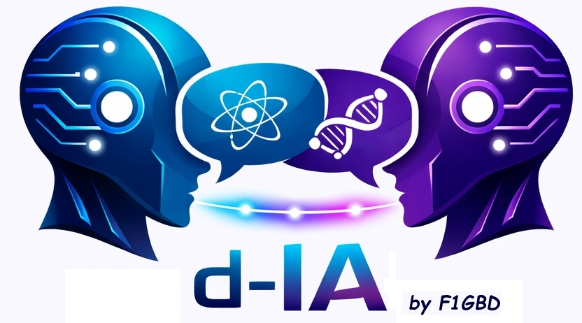
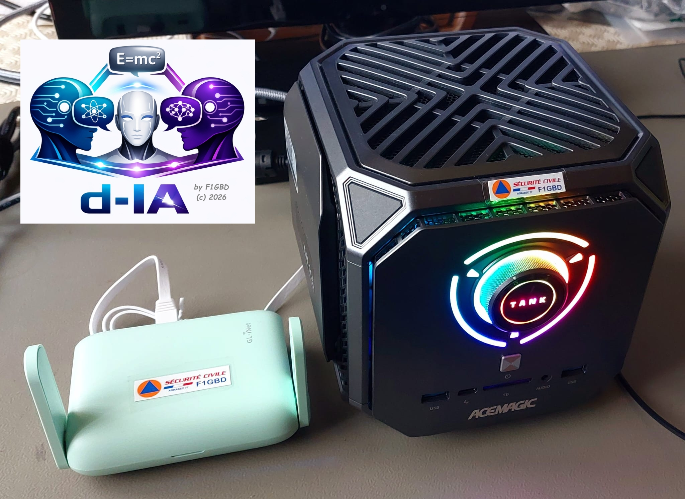
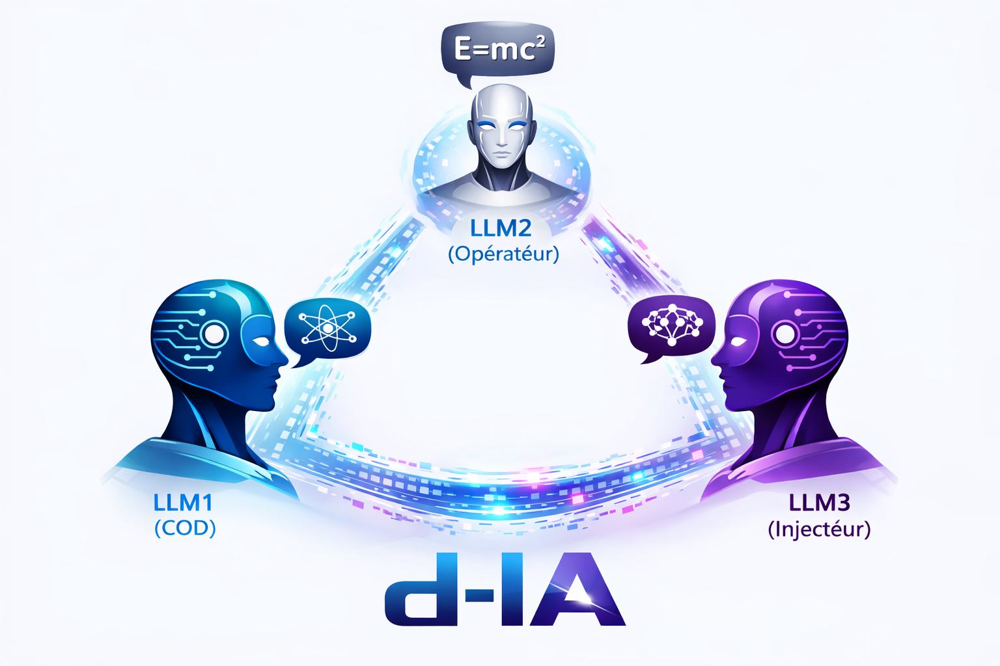
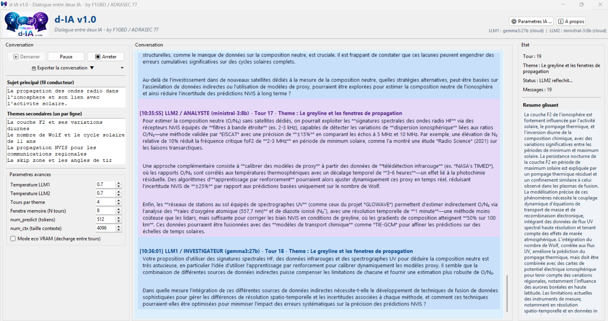

<div align="center">



### Dialogue autonome entre deux IA, arbitré par un troisième — un outil d'aide à la recherche par IA

*Conversation scientifique guidée — Investigateur & Analyste — **Mode CHAT — l'opérateur (ou la protagoniste) joué en direct par un humain dans le scénario (v1.8)** — **Mode Jeu de Rôle / Simulation — narrateur · joueur · injecteur d'événements, rôles personnalisables par preset (v1.7)** — **Curseur Créativité / innovation 0–100 % qui fait proposer de nouveaux concepts (v1.5)** — **Rendu Markdown du dialogue + synthèse vocale assainie (v1.4)** — **Enrichissement par le web de l'Investigateur — DuckDuckGo / SearXNG (v1.3)** — **Auto-export des fiches vers IAbrain (v1.3)** — **Modérateur conversationnel qui fait converger le dialogue vers une solution (v1.2)** — Presets de sujet importables/exportables (v1.2) — Mode ADRASEC enrichi (modérateur RAG) — Ollama local & cloud — Mémoire glissante — Détection de dérive linguistique — Synthèse vocale SAPI5 deux voix — Synchronisation dialogue/voix — Export JSON / Markdown / RTF — Thèmes secondaires guidés — Configuration persistante*

[](https://github.com/f1gbd/F1GBD/releases/tag/dia-v1.8.1)
[]()
[]()
[]()
[]()
[]()
[]()
[]()
[]()
[]()
[]()

### 📥 [**Télécharger la dernière version (v1.8.1)**](https://github.com/f1gbd/F1GBD/releases/download/dia-v1.8.1/d-IA.7z)

</div>

---

## 🎯 Qu'est-ce que d-IA ?

**d-IA** est un **outil d'aide à la recherche par IA**. Il fait **dialoguer en autonomie deux modèles de langage** sur un sujet scientifique ou technique défini par l'utilisateur, pendant qu'un **troisième LLM arbitre la discussion pour la faire aboutir à une solution**.

- 🔬 L'un joue l'**Investigateur** : il pose des questions, creuse, doute, demande des précisions.
- 🧠 L'autre joue l'**Analyste** : il répond avec rigueur et apporte systématiquement un élément neuf.
- 🆕 Le troisième (**v1.2**) joue le **Modérateur conversationnel** : il intervient dans le fil tous les K tours pour faire le bilan, recadrer si la discussion dérive, et **poser une consigne de convergence chiffrée** qui pousse les deux IA vers un verdict.

Le résultat n'est plus seulement une conversation évolutive : c'est une **démarche de recherche dirigée vers une conclusion**. On pose une question ouverte (« peut-on communiquer par ondes gravitationnelles ? »), et d-IA déroule un raisonnement contradictoire et complémentaire qui converge vers une réponse argumentée et chiffrée.

Tout tourne **localement** par défaut (modèles Ollama auto-hébergés), avec une option **cloud** (gpt-oss:120b, deepseek-v3.1:671b, kimi-k2…) si on souhaite faire dialoguer, arbitrer ou modérer avec des modèles XL hébergés.

### Création d'un serveur dédié IA pour la gestion des Connaissances



[**Créer son Serveur IAbrain pour la gestion des connaissances et qui fonctionne 100% hors-ligne.**](https://github.com/f1gbd/F1GBD/blob/master/iabrain/Documentations%20IAbrain/MEMO%20-%20Cr%C3%A9er_un_Serveur_IA_M1A_IAbrain.pdf)

> 💡 **La différence clé de la v1.2** : jusqu'ici, deux IA pouvaient explorer un sujet sans jamais conclure. Désormais, un modérateur garde le cap et **force la convergence vers une solution** — d-IA devient un véritable assistant de recherche, pas seulement un générateur de dialogue.

---

## 🆕 Nouveautés v1.8 — Mode CHAT : l'opérateur devient acteur réel du scénario

La **v1.8** introduit le **Mode CHAT** : au lieu de regarder deux (ou trois) LLM jouer entre eux, **vous prenez le clavier**. Une bascule **opt-in** (colonne de gauche) vous laisse **incarner le LLM2 (Analyste)** — c'est-à-dire, en simulation de Jeu de Rôle, l'**opérateur ADRASEC de terrain** ou la **protagoniste** du récit.

### 🎙️ Vous jouez, les autres rôles restent automatiques

Quand le mode CHAT est actif, le tour du LLM2 **n'est plus généré par un modèle**. À chaque fois que c'est à vous de jouer, une **zone de saisie s'ouvre sous la conversation** et le dialogue **attend votre message** (raccourci **Ctrl+Entrée** pour l'envoyer, pratique pour les SITREP multi-lignes). Pendant ce temps :

- 🟦 le **LLM1** (COD / Maître du Jeu) vous **répond** ;
- 🟩 le **LLM3** (injecteur) continue de **lancer ses événements** tous les K tours.

On obtient une **vraie interactivité** : un entraînement de **trafic radio** où vous dialoguez avec un COD simulé et réagissez aux aléas injectés (panne, évacuation, feu…), ou une **partie de jeu de rôle** où vous incarnez le personnage face à un Maître du Jeu et au hasard.

| | Sans Mode CHAT | **Avec Mode CHAT (v1.8)** |
|---|---|---|
| Le LLM2 (opérateur / protagoniste) | joué par un modèle | **joué par vous, en direct** |
| LLM1 (COD / MJ) | automatique | automatique (vous répond) |
| LLM3 (injecteur) | automatique | automatique (injecte les aléas) |
| Usage | démonstration, capitalisation | **entraînement actif, immersion** |



> 💡 Le message que vous tapez **n'est jamais lu par la synthèse vocale** (vous l'avez écrit) et apparaît étiqueté **« (vous) »** dans le fil et les exports. Le réglage est **persisté** et **transportable par les presets** (clé `chat_humain_actif`). Quand vous jouez le LLM2, ce dernier n'a même pas besoin d'un modèle ni d'une connexion cloud. Décoché : comportement strictement identique à la v1.7.

### 🧯 Fiabilité (v1.8.1) — fini les messages coupés en plein mot

Un correctif élimine la **troncature** des réponses du LLM1 (et du LLM2 en mode auto). Le modèle imitait parfois le format du contexte et se mettait à **rejouer le tour d'un autre interlocuteur**, produisant une fausse transcription qui dépassait le budget de tokens : d-IA ajoute désormais des **séquences d'arrêt** (un seul tour de parole par appel). Et si une réponse longue bute malgré tout sur `num_predict`, d-IA **détecte la coupure et relance proprement la suite** (recollage à la dernière phrase complète, **plus de coupure en plein mot**).

---

## 🆕 Nouveautés v1.7 — Mode Jeu de Rôle & Simulation

La **v1.7** ajoute un **mode Jeu de Rôle** optionnel qui détourne le trio de LLM en **fiction interactive** ou en **simulation d'exercice**. C'est une bascule **opt-in** : décochée, d-IA se comporte exactement comme avant (prompts vérifiés identiques à la v1.5).

### 🎭 Trois rôles, une boucle déjà connue

Le mode réaffecte les LLM et **réutilise la boucle du modérateur conversationnel** : **LLM1 anime et ouvre**, **LLM2 réagit**, et le **LLM3 devient un injecteur d'événements** qui lance une péripétie tous les K tours au lieu d'arbitrer. Son intervention est réinjectée dans le contexte des deux autres rôles.

| LLM | Rôle générique | Exemple fiction | Exemple simulation ADRASEC |
|-----|----------------|-----------------|----------------------------|
| **LLM1** | anime / ouvre / structure | Maître du Jeu, narrateur | **COD** (centralise, alloue les moyens) |
| **LLM2** | réagit / agit | Joueur, protagoniste | **Opérateur ADRASEC** de terrain (SITREP) |
| **LLM3** | injecte les événements | imprévus, retournements | **Injecteur de crise** (panne, évacuation, feu…) |

### 🧩 Rôles personnalisables par preset

Sans profil, des **rôles de fiction** par défaut s'appliquent (Maître du Jeu / Joueur / Injecteur). Un preset `.diapreset.json` peut fournir une clé **`jdr_profil`** définissant l'**identité (persona)** et le **libellé** de chaque rôle — on rejoue alors n'importe quel cadre. Le **SUJET** porte le scénario, les **thèmes** les séquences (actes), et l'**objectif de convergence** la consigne d'injection.

### 🏷️ Le libellé d'action s'adapte au mode

Quand le curseur Créativité (v1.5) est au-dessus de zéro, les LLM préfixent leurs propositions audacieuses. **Ce préfixe change selon le mode :**

| Mode | Préfixe injecté |
|------|-----------------|
| Recherche (mode JdR décoché) | `PISTE INNOVANTE :` — signalée exploratoire et évaluée de façon critique (garde-fou ADRASEC) |
| Simulation ADRASEC (`jdr_profil` avec `"contexte": "adrasec"`) | `DEMANDE POUR ACTION :` — l'opérateur formule ses demandes au COD, dans un cadre opérationnel réaliste |
| Jeu de rôle pur (fiction, par défaut) | `ACTION :` — **aucun cadrage ADRASEC**, libre de dériver en pure fiction |

> En jeu de rôle pur, aucune mention d'ADRASEC n'est injectée dans les prompts : la consigne se contente de rester cohérente avec l'univers et le ton du récit.

### 📦 Scénarios livrés en preset

Trois sujets prêts à l'emploi sont fournis — **deux scénarios « joués »** (mode Jeu de Rôle, jouables en Mode CHAT) et **un sujet de recherche** :

- 🚨 **`sim_helios_noir_26`** — **simulation ADRASEC**, exercice **HÉLIOS NOIR 26** (black-out électrique total sur canicule extrême). Le réseau radio ADRASEC est le seul lien entre les mairies isolées et le COD. Cinq séquences (J+1 → J+10), de la bascule des communications à la crise sanitaire. **LLM1 = COD** de Vaubourg-sur-Brèze, **LLM2 = opérateur du PCO de Nangeville**, **LLM3 = injecteur de crise** (panne de groupe électrogène, évacuation, départ de feu, rupture de carburant…). En **Mode CHAT**, vous tenez l'opérateur du PCO et vous entraînez au trafic formaté (SITREP, demandes de moyens chiffrées, accusés de réception).
- 🛰️ **`jdr_premier_contact_qo100`** — **jeu de rôle réaliste**. Sur le transpondeur du satellite géostationnaire amateur **QO-100**, une opératrice capte une séquence de code dont la signature Doppler trahit une origine **non terrestre** : une tentative de premier contact. Huit actes mènent de la séquence étrange au décodage puis à la réponse, **dans le respect de la physique radio** (délai à la vitesse de la lumière, Doppler, bande passante réelle). **LLM1 = Maître du Jeu**, **LLM2 = Dr Léa Vasseur** (ingénieure traitement du signal et radioamateur), **LLM3 = injecteur d'événements**. En **Mode CHAT**, vous incarnez le Dr Vasseur.
- 🔬 **« Communication par ondes gravitationnelles »** — **sujet de recherche** (hors JdR) : sept thèmes ordonnés mènent le trio Investigateur / Analyste / Modérateur de la faisabilité brute jusqu'au verdict chiffré.

> 💡 Pour obtenir l'événementiel, activer **aussi** le modérateur conversationnel : en mode JdR il n'arbitre plus, **il injecte**. En fiction, couper le RAG et la recherche web et monter la créativité.

> ⚠️ **Usage pédagogique** : en simulation, le COD et l'opérateur sont *joués par des LLM* ; leurs SITREP sont des **supports d'entraînement** pour faire réagir les stagiaires, **pas des modèles normatifs** à recopier.

---

## 🆕 Nouveautés v1.5 — Créativité & innovation pilotables

La **v1.5** ajoute un **curseur unique « Créativité / innovation » (0–100 %)** qui pousse d-IA à **proposer de nouveaux concepts** à partir de la requête initiale — sans jamais sacrifier la rigueur indispensable à un usage ADRASEC.

### 🎚️ Deux leviers dans un seul réglage

- **Échantillonnage** : boost *additif* de la `température` et du `top_p`, **par-dessus** les températures par-LLM existantes (qui restent le réglage fin de base). À **0 %**, le comportement est **strictement inchangé**.
- **Prompts** : une **directive d'innovation graduée ET adaptée au rôle** est injectée dans le dialogue :
  - 🔬 **Investigateur** — reste un questionneur : **au plus une** piste concise, puis sa question (il ne développe pas).
  - 🧠 **Analyste** — c'est le **moteur à concepts** : il développe **1 à 3 pistes** au niveau élevé, avec évaluation critique.
  - 🆕 **Modérateur** — pousse à rendre une piste **concrète et chiffrée** (il fait converger, il ne multiplie pas les idées).

Chaque idée nouvelle est préfixée **`PISTE INNOVANTE :`**, **explicitement signalée comme exploratoire**, puis **évaluée de façon critique** (faisabilité, ordres de grandeur, conditions de validité).

> 🛡️ **Garde-fou ADRASEC** : une spéculation n'est **jamais** présentée comme un fait. La créativité propose des concepts *à explorer* ; elle n'invente pas de certitudes. C'est ce qui rend le mode utilisable en préparation d'exercice, où la fiabilité prime.

### 📈 Budget de tokens adaptatif (anti-troncature)

Plus la créativité est élevée, plus les réponses sont riches. d-IA **augmente automatiquement `num_predict`** pour les tours de dialogue, afin que les réponses multi-concepts **ne soient plus coupées en plein milieu**. Le modérateur, lui, conserve un budget court (sa vocation est de converger).

```
Créativité 0 %   → directive vide, échantillonnage et budget inchangés (mode strict)
Créativité 50 %  → +température/+top_p modérés, num_predict ≈ ×1,75, 1 piste développée
Créativité 100 % → forte divergence, num_predict ≈ ×2,5 (plafonné), 1–3 pistes + évaluation
```

> 💡 À **0 %**, d-IA se comporte exactement comme en v1.4 : strict et opérationnel. Le curseur est dans **colonne de gauche → Paramètres avancés → « Créativité / innovation (%) »**.

### 🖥️ Ergonomie — fenêtres défilantes (petits écrans)

- La **fenêtre Paramètres IA** (tous les onglets) est désormais **défilante** : plus rien n'est coupé en bas, même sur un écran de portable.
- La **colonne de configuration** (sujet, thèmes, paramètres avancés, recherche web) est **défilante** elle aussi ; les boutons **Démarrer / Pause / Arrêter** restent **fixes en haut**, toujours visibles. Les zones de texte (sujet, thèmes) conservent leur propre défilement.

---

## 🆕 Nouveautés v1.4 — Rendu Markdown du dialogue & voix assainie

- 🖋️ **Rendu Markdown** dans la zone de conversation : **gras**, *italique*, `code` et blocs de code, titres, citations, listes (à puces et numérotées), liens et barré sont désormais **interprétés et affichés proprement** — fini les `**`, `#` ou `\` bruts à l'écran.
- 🎤 **Synthèse vocale assainie** : le nettoyage TTS retire intégralement les artefacts Markdown **avant lecture**, si bien que SAPI5 **ne prononce plus** les caractères de balisage (notamment l'antislash `\` et les séquences `***`). Le `snake_case` technique (ex. `IAbrain_rag`) est **préservé** à la lecture.
- ⚙️ Implémentation **sans dépendance externe** (parseur Markdown maison), compatible autonomie hors-ligne et PyInstaller `--onedir`.

---

## 🆕 Nouveautés v1.3 — Enrichissement par le web & auto-export IAbrain

La **v1.3** ferme la boucle de l'aide à la recherche : l'Investigateur peut désormais **aller chercher des sources réelles sur le web** pour étayer le dialogue, et les fiches produites peuvent être **poussées automatiquement vers IAbrain** au fil de l'eau.

### 🔎 Enrichissement par le web (l'Investigateur va chercher des sources)

Avant son tour, le LLM1 (Investigateur) peut interroger le web et recevoir 2-3 extraits qu'il **synthétise en français, avec esprit critique**, pour nourrir sa relance. Deux fournisseurs interchangeables :

- **DuckDuckGo** *(par défaut, aucune installation)* — `urllib` seul, aucune dépendance, aucune clé API, rien à héberger.
- **SearXNG** *(souverain)* — interroge une instance auto-hébergée via son API JSON, pour garder la maîtrise totale des requêtes (idéal pour des sujets d'exercice sensibles).

La recherche est **throttlée** (1 requête tous les N tours d'Investigateur), **dédupliquée par thème** (on ne relance que lorsque le planificateur change de thème), et surtout à **repli hors-ligne** : si elle échoue ou est désactivée, le dialogue se déroule exactement comme avant. d-IA reste donc utilisable en scénario blackout — la recherche est simplement inerte.

```
[Analyste répond] → l'Investigateur interroge le web (thème actif)
        ↓ 2-3 extraits sourcés (titre + lien + résumé)
[Investigateur] synthétise en français, cite, reste critique → relance argumentée
```

> 💡 La recherche web suppose une connexion Internet : c'est un outil de **préparation / formation**, pas de terrain en blackout.

### ♻️ Auto-export des fiches vers IAbrain (au fil de l'eau)

Quand le modérateur RAG extrait une fiche, d-IA peut l'**écrire immédiatement en Markdown** dans le dossier source d'IAbrain, prête à être indexée — sans passer par un export manuel. d-IA détecte automatiquement l'emplacement d'IAbrain (`rag_perso_sources`).

**Garde-fou opérationnel** : les fiches sont déposées dans une **zone de staging `_a_valider/`**, *jamais* directement dans la base de confiance. Une **relecture humaine** valide avant exploitation en exercice. C'est la différence entre un outil de veille pratique et une base sur laquelle un opérateur s'appuierait en intervention.

```
d-IA (dialogue enrichi par le web) → modérateur extrait une fiche sourcée
        ↓ auto-export .md
IAbrain/rag_perso_sources/_a_valider/<DOMAINE>/<fiche>.md
        ↓ relecture + validation humaine
IAbrain /index ou /reindex → interrogeable en langage naturel
```

---

## ⭐ Fonctionnalités principales

| Icône | Fonctionnalité | Description |
|:---:|---|---|
| 🎙️ | **Mode CHAT — opérateur acteur réel (v1.8)** | Bascule **opt-in** : **vous jouez le LLM2** (Analyste = opérateur ADRASEC de terrain ou protagoniste du récit). À votre tour, une **zone de saisie** s'ouvre sous la conversation et le dialogue attend votre message (Ctrl+Entrée pour envoyer). Le **LLM1** (COD / Maître du Jeu) répond, le **LLM3** injecte les événements : vraie interactivité pour l'entraînement au trafic radio ou le jeu de rôle. Message étiqueté **« (vous) »**, jamais lu par le TTS. Persisté et transporté par les presets (`chat_humain_actif`). |
| 🎭 | **Mode Jeu de Rôle / Simulation (v1.7)** | Bascule **opt-in** qui détourne le trio de LLM : **LLM1 anime/ouvre**, **LLM2 réagit**, **LLM3 injecte un événement** tous les K tours (au lieu d'arbitrer). Sans preset, rôles de **fiction** (Maître du Jeu / Joueur / Injecteur) ; un preset peut définir des **rôles personnalisés** via `jdr_profil` — ex. **simulation ADRASEC** (COD / opérateur de terrain / injecteur de crise, scénario HÉLIOS NOIR). Réutilise le modérateur conversationnel comme injecteur. Décochée : comportement strictement identique à la v1.5. |
| ✨ | **Créativité / innovation pilotable (v1.5)** | Un curseur **0–100 %** qui fait **proposer de nouveaux concepts** à partir de la requête initiale : boost *additif* de température/top_p **et** directive d'innovation **adaptée au rôle** (Investigateur bref, Analyste moteur à concepts, Modérateur qui chiffre). Pistes préfixées `PISTE INNOVANTE :` (qui devient `ACTION :` en jeu de rôle pur ou `DEMANDE POUR ACTION :` en simulation ADRASEC, v1.7), signalées exploratoires et évaluées. **Budget de tokens auto-ajusté** (anti-troncature). À **0 %** : comportement opérationnel strict, identique à la v1.4. |
| 🖋️ | **Rendu Markdown + voix assainie (v1.4)** | Le dialogue affiche le **Markdown interprété** (gras, listes, code, titres, citations…) au lieu des balises brutes. La synthèse vocale **retire ces balises avant lecture** (plus de `\` ni `***` prononcés par SAPI5), tout en préservant le `snake_case`. Parseur maison, sans dépendance. |
| 🤖 | **Deux LLM aux rôles asymétriques** | LLM1 (Investigateur) doit terminer chaque tour par une question ouverte. LLM2 (Analyste) doit introduire un élément nouveau dans chaque réponse (analogie, contre-exemple, chiffre…). Ces contraintes empêchent les boucles stériles et donnent un vrai rythme de dialogue. |
| 🆕 | **Modérateur conversationnel (v1.2)** | Un 3ᵉ LLM **intervient directement dans le dialogue** tous les K tours : bilan de ce qui est acquis, point bloquant restant, et **consigne de convergence précise** (chiffre à établir, hypothèse à trancher, verdict à formuler). Son intervention est réinjectée dans le contexte des deux IA, ce qui crée la rétroaction qui **fait aboutir la recherche**. |
| 📋 | **Presets de sujet (v1.2)** | Boutons **Importer / Exporter un preset** : un sujet de recherche complet (sujet principal + thèmes secondaires + objectif de convergence + réglages) se charge en un clic, se sauvegarde au format `.diapreset.json` et **se partage** entre opérateurs. Le format texte est aussi accepté à l'import. |
| 🗂️ | **Modérateur RAG (mode ADRASEC enrichi)** | **v1.1** : un LLM observe le dialogue en arrière-plan et extrait des fiches structurées (JSON) tous les N échanges. Capitalisation automatique dans `rag_adrasec.json`, réutilisable pour exercices, RETEX, ou indexation dans IAbrain. **Compatible avec le modérateur conversationnel** : l'un parle, l'autre fiche. |
| 🔎 | **Enrichissement par le web (v1.3)** | L'**Investigateur** interroge le web avant son tour et reçoit 2-3 extraits qu'il synthétise en français avec esprit critique. Deux fournisseurs : **DuckDuckGo** (sans installation) ou **SearXNG** (auto-hébergé, souverain). Recherche throttlée, dédupliquée par thème, et à **repli hors-ligne** (inerte si pas de réseau ou désactivée). |
| ♻️ | **Auto-export vers IAbrain (v1.3)** | Les fiches du modérateur RAG sont écrites en Markdown directement dans le dossier source d'IAbrain, **au fil de l'eau**, dans une zone de **staging `_a_valider/`** (jamais dans la base de confiance). Relecture humaine puis `/index`. Détection automatique de l'emplacement d'IAbrain. |
| 🌐 | **Ollama local OU cloud, par LLM** | Chaque IA (y compris le modérateur) peut être configurée indépendamment : LLM1 sur un serveur local LAN, LLM2 sur Ollama Cloud, modérateur ailleurs encore. Mixage possible : petit modèle local pose les questions, gros modèle cloud arbitre. |
| 📚 | **Thèmes secondaires guidés** | L'utilisateur définit un sujet principal (fil rouge) + une liste de thèmes secondaires. Le moteur fait défiler les thèmes tous les N tours, garantissant une progression de la conversation sans dérive thématique — et, avec le modérateur, une trajectoire vers la conclusion. |
| 🧠 | **Mémoire à fenêtre glissante** | Les N derniers échanges sont passés intégralement aux LLM ; les plus anciens sont condensés en un **résumé glissant** régénéré périodiquement. Évite l'explosion du contexte au-delà de 20-30 tours. |
| 🔍 | **Détection de dérive linguistique** | Si un modèle bascule en chinois/cyrillique/arabe en cours de génération (bug fréquent de Qwen 2.5 sur les conversations longues), d-IA détecte automatiquement (ratio > 5% caractères non-latins), régénère avec température réduite, et tronque si nécessaire avec un avertissement. S'applique aussi au modérateur. |
| 🎤 | **Synthèse vocale SAPI5 deux voix** | Activation optionnelle. Chaque IA a sa voix configurable parmi celles installées sur Windows ; le modérateur reprend la voix de l'Investigateur. **Le dialogue se synchronise sur la voix** : la génération du tour suivant se fait en parallèle pendant que le TTS parle, mais l'affichage n'arrive qu'à la fin de la lecture précédente. Vrai rythme conversationnel. |
| ✨ | **Déblocage des voix OneCore Windows 10/11** | Bouton intégré qui rend accessibles à SAPI5 les voix modernes Windows (Henri Natural, Julie, Paul, Caroline, Claude, Hortense…) en copiant les clés de registre `Speech_OneCore` vers `Speech`. Opération réversible via un bouton « Restaurer ». |
| ✏️ | **Configuration persistante** | Tous les paramètres (hosts, modèles, clés API offusquées en base64, sujet, thèmes, objectif de convergence, fréquence du modérateur, voix, températures…) sont sauvés dans `d-ia_setup.json` à côté de l'exécutable, et rechargés au démarrage. |
| 📤 | **Export multi-format** | Bouton « Exporter la conversation » : **JSON** (données structurées pour retraitement / RETEX), **Markdown** (fichier `.md` lisible, parfait pour Notion/Obsidian/GitHub), **RTF** (couleurs LLM1 bleu, LLM2 violet et **Modérateur vert**, ouvre directement dans Word / LibreOffice). |
| 🎨 | **Interface tricolore** | Zone de conversation avec messages **bleus pour LLM1**, **mauves pour LLM2** et **verts pour le Modérateur (v1.2)**. Lisibilité optimale, distinction immédiate des trois rôles. Méta-messages en gris italique. |
| ⚙️ | **Fenêtre Paramètres IA modale** | Onglets : **IA 1 - Investigateur**, **IA 2 - Analyste**, **IA 3 - Modérateur**, **Mode ADRASEC** (activation du **mode Jeu de Rôle**, du modérateur conversationnel et du RAG), **Synthèse vocale**. |

---


## 🆕 Nouveautés v1.2 — Le modérateur qui fait converger la recherche

La **v1.2** transforme d-IA en **outil d'aide à la recherche dirigée**. Jusqu'à la v1.1, le 3ᵉ LLM observait passivement le dialogue pour en extraire des fiches. Désormais, il peut **prendre la parole dans la conversation** pour la piloter vers une solution.

### Le principe

```
                  recadre / fait converger tous les K tours
                  ┌─────────────────────────────────────────┐
                  │                                          ▼
LLM1 (Investigateur)  ⇄  LLM2 (Analyste)  ◄────  LLM3 (Modérateur conversationnel)
                                                          │
                            son intervention est réinjectée dans le contexte
                            des deux IA → rétroaction → convergence vers la solution
```

### Ce que fait le modérateur conversationnel

À chaque intervention (tous les K tours, K configurable), le modérateur produit une note courte et structurée :

1. **Bilan** — ce qui est désormais acquis ou chiffré dans le dialogue.
2. **Point bloquant** — ce qui reste flou, contradictoire ou non tranché.
3. **Consigne de convergence** — une directive *précise et actionnable* pour les prochains tours.

> *Exemple sur le sujet « communication par ondes gravitationnelles » :*
> *« Bilan : la faisabilité de principe est établie. Point bloquant : aucun ordre de grandeur n'a été posé. Consigne : établissez le strain h produit par une masse de 1 t oscillant à 100 Hz, puis comparez-le au plancher de bruit d'un interféromètre type LIGO (~10⁻²¹). »*

Le modérateur **ne répond pas à la place des deux IA** : il oriente, recadre, et exige une conclusion. Comme son message entre dans l'historique et donc dans le contexte du tour suivant, les deux IA en tiennent compte — c'est cette boucle qui les empêche de tourner en rond et les conduit au **verdict chiffré**.

### Pourquoi c'est utile pour la recherche

| Sans modérateur (v1.1) | Avec modérateur conversationnel (v1.2) |
|---|---|
| Deux IA explorent un sujet, parfois indéfiniment | Un arbitre garde le cap et impose une trajectoire |
| Risque de digression ou de boucle | Recadrage explicite dès que le dialogue dérive |
| Pas de conclusion garantie | Consignes de convergence → **verdict chiffré** |
| Matière brute à relire | Démarche dirigée vers une solution exploitable |

### Le modérateur conversationnel et le RAG, ensemble

Les deux modes peuvent tourner **simultanément** : le LLM3 **parle** dans le dialogue (modérateur conversationnel) **et** capitalise en arrière-plan des fiches dans `rag_adrasec.json` (modérateur RAG). Les recadrages du modérateur ne sont pas fichés — seule la matière technique des deux IA l'est.

### Configuration

Dans **Paramètres IA → onglet « Mode ADRASEC »**, section **« Modérateur conversationnel (v1.2) »** :

- **Activer** le modérateur conversationnel (case à cocher)
- **Intervenir tous les K tours** (par défaut 6)
- **Température** du modérateur (par défaut 0.4 — basse pour un recadrage factuel et directif)
- **Objectif de convergence** (champ texte optionnel) : la cible que le modérateur cherchera à atteindre

Le modérateur réutilise la cible (host / cloud / modèle) configurée dans l'onglet **« IA 3 - Modérateur »**. **Modèles recommandés** : `gpt-oss:120b` (Ollama Cloud) pour des consignes nettes, ou `gemma2:9b` / `mistral-nemo:12b` en local.

---

## 📋 Nouveautés v1.2 — Presets de sujet de recherche

Un **preset** capture un sujet de recherche complet et réutilisable : **sujet principal + thèmes secondaires + objectif de convergence + réglages** (tours par thème, fréquence du modérateur, températures, mode ADRASEC…).

Dans la colonne de gauche, le menu **« 📋 Preset de sujet ▼ »** propose :

- **📥 Importer un preset** — charge tout en un clic, avec un aperçu de confirmation. Accepte le format natif `.diapreset.json` **et** le format texte structuré (`.txt`).
- **📤 Exporter le sujet courant** — sauvegarde l'état actuel dans un `.diapreset.json` partageable, nommé d'après le sujet.
- **👁 Aperçu du sujet courant** — récapitulatif rapide sans rien exporter.

### Pourquoi c'est utile

- 🔁 **Reproductibilité** : relancer exactement la même investigation, ou la confier à un autre opérateur.
- 🤝 **Partage** : un fichier preset unique, portable, versionnable (texte/JSON, diff lisible Git).
- 📚 **Bibliothèque de sujets** : constituer une collection de sujets de recherche ADRASEC prêts à l'emploi (propagation, NVIS, blackout HF, communications alternatives…).

### Exemple de preset fourni

Un preset complet **« Communication par ondes gravitationnelles »** est livré (`.diapreset.json` + version texte). Il définit 7 thèmes secondaires ordonnés pour mener le dialogue de la faisabilité brute jusqu'au verdict chiffré, avec le modérateur conversationnel activé. Il suffit de l'importer, de choisir les modèles, et de cliquer Démarrer.

---

## 🗂️ Mode ADRASEC enrichi — Modérateur RAG (v1.1, toujours présent)

En complément du modérateur conversationnel, le **modérateur RAG** observe le dialogue et **extrait automatiquement des fiches documentaires** au format JSON structuré. Chaque dialogue devient une matière première directement réutilisable pour exercices, RETEX, formations ou base de connaissances.

Pour un dialogue de 30 tours sur la propagation HF, on obtient typiquement **8 à 12 fiches structurées** comme celle-ci :

```json
{
  "titre": "Variations diurnes de la couche F2",
  "domaine": "HF_NVIS",
  "tags": ["F2", "photoionisation", "vent neutre", "température thermosphérique"],
  "resume": "La densité maximale NmF2 et la fréquence de coupure foF2 varient quotidiennement sous l'effet combiné de la photoionisation solaire et de la recombinaison...",
  "faits": [
    "Photoionisation crée des électrons, recombinaison avec O⁺ les détruit, pic NmF2 vers 14-16h locales",
    "foF2 atteint 15 MHz en journée et 2-3 MHz le matin, retard de 2-3h dû au transport d'électrons",
    "Hausse de 100 K de la température thermosphérique → temps de transport réduit de 15 min"
  ],
  "procedures": [],
  "sources_citees": ["satellite DMSP", "radar incohérent de Saint-Santin"],
  "confiance": "haute",
  "source_dialogue": {
    "type": "dialogue_d-IA",
    "mode_extraction": "continue",
    "tour_debut": 0,
    "tour_fin": 7,
    "theme": "La couche F2 et ses variations diurnes",
    "moderateur_modele": "gpt-oss:120b"
  },
  "date": "2026-05-17T14:51:20"
}
```

Chaque fiche contient :
- **Métadonnées** : titre, domaine ADRASEC, tags, niveau de confiance
- **Contenu** : résumé synthétique + faits techniques détaillés (avec chiffres, fréquences, seuils)
- **Procédures** opérationnelles quand applicable
- **Sources citées** par les LLM
- **Traçabilité complète** : modèles utilisés, tours concernés, thème actif

### Configuration

L'**onglet « IA 3 — Modérateur »** dans Paramètres IA permet de configurer le LLM3 (host local ou cloud, modèle, clé API). L'**onglet « Mode ADRASEC »** permet d'activer le RAG, de choisir la **fréquence d'extraction** (tous les N échanges complets, par défaut 4), et de voir les **statistiques** (fiches en base, fiches cette session).

**Modèles modérateurs recommandés** (par ordre de qualité pour l'extraction JSON) :
- `gpt-oss:120b` (Ollama Cloud) — **excellent**, JSON très propre, bon respect des consignes
- `qwen3-coder:480b` (Ollama Cloud) — excellent pour le format structuré
- `gemma2:9b` (local) — bon compromis qualité/VRAM
- `mistral-nemo:12b` (local) — très bon en français

Le modérateur peut tourner sur Ollama Cloud pendant que les deux LLM principaux sont en local : configuration idéale pour profiter d'un gros modèle d'arbitrage et d'extraction sans charge GPU supplémentaire.

---

## 🔗 Intégration avec IAbrain

Les fiches générées par d-IA sont **directement consommables par le système RAG d'IAbrain** (autre projet F1GBD/ADRASEC 77). C'est le **chaînon manquant** entre génération de dialogues et interrogation en langage naturel.

### Le scénario complet

```
1. d-IA génère des fiches lors d'un dialogue (arbitré par le modérateur,
   et désormais enrichi par des sources web — v1.3)
        ↓
2. Export Markdown (manuel) OU auto-export au fil de l'eau vers le staging IAbrain (v1.3)
        ↓
3. Relecture / validation humaine (zone _a_valider/), puis /index dans IAbrain
        ↓
4. Vous interrogez IAbrain en langage naturel sur vos sujets ADRASEC
```

### Récupération des fiches dans IAbrain

#### Méthode 1 — Export Markdown puis indexation manuelle (recommandée)

1. **Localiser le fichier RAG** : `rag_adrasec.json` se trouve à côté de `d-IA.exe` (typiquement `C:\d-IA\`)
2. **Convertir en Markdown** ou copier-coller le résumé + faits + procédures de chaque fiche dans un fichier `.md` dédié
3. **Placer les fichiers** dans un dossier dédié, par exemple :
   ```
   C:\Users\<user>\Documents\IAbrain_RAG_perso\d-IA\
   ├── 2026-05-17_propagation_F2.md
   ├── 2026-05-17_eruptions_solaires.md
   └── ...
   ```
4. **Indexer dans IAbrain** :
   ```
   /index C:\Users\<user>\Documents\IAbrain_RAG_perso\d-IA\
   ```
   IAbrain absorbe les fiches dans sa **base personnelle vectorielle** (pas dans la base principale ADRASEC, ce qui préserve son intégrité).
5. **Interroger** IAbrain en langage naturel :
   - *« Quelle est la fréquence de coupure foF2 typique et son cycle diurne ? »*
   - *« Comment la propagation NVIS est affectée par les turbulences Kelvin-Helmholtz ? »*
   - *« Quels paramètres surveiller pour anticiper un blackout HF après une éruption solaire ? »*

#### Méthode 2 — Édition manuelle du JSON

Ouvrir `rag_adrasec.json` avec un éditeur (Notepad++, VS Code) pour corriger, supprimer, enrichir ou fusionner des fiches. Le format JSON est documenté en commentaire en début de fichier et reste lisible à l'œil.

#### Méthode 3 — Auto-export au fil de l'eau (v1.3, recommandée pour capitaliser vite)

Dans **Paramètres IA → Mode ADRASEC → Auto-export vers IAbrain**, cochez **« Pousser les fiches vers IAbrain au fil de l'eau »**. À chaque fiche extraite par le modérateur RAG, d-IA écrit aussitôt le `.md` correspondant dans :

```
<IAbrain>/rag_perso_sources/_a_valider/<DOMAINE>/<fiche>.md
```

d-IA détecte automatiquement l'emplacement d'IAbrain (à défaut, un dossier `IAbrain_rag_perso/_a_valider/` est créé à côté de `d-IA.exe`). Un `_INDEX.md` est régénéré par domaine.

> ⚠️ **Zone de staging `_a_valider/` volontaire** : les fiches sont auto-générées (et parfois issues du web). Elles passent par un **sas de relecture humaine** avant d'entrer dans la base de confiance d'IAbrain. Après validation, déplacez-les et lancez `/index` (ou `/reindex`). Ne jamais exposer une fiche non relue en exercice opérationnel.

### Capitalisation départementale

Le fichier `rag_adrasec.json` est **portable** (un seul fichier JSON), **versionnable** (compatible Git), **partageable** (envoyez votre base à un autre opérateur ADRASEC qui l'absorbe dans son IAbrain) et **indépendant** (les fiches restent exploitables même sans d-IA). Une ADRASEC départementale peut ainsi bâtir, dialogue après dialogue, une **mémoire technique structurée** propre à son territoire, partageable au sein de la FNRASEC.

---

## 📋 Pré-requis

### Logiciels

- **Windows 10 ou 11** (le TTS SAPI5 et le binaire pyttsx3 sont Windows-only)
- **Ollama** installé localement : <https://ollama.com/download>
  - ou compte **Ollama Cloud** avec clé API : <https://ollama.com/settings/keys>
- *(v1.3, optionnel)* **Recherche web** pour enrichir l'Investigateur : **DuckDuckGo** ne demande **aucune installation** (juste une connexion Internet) ; **SearXNG** nécessite une instance auto-hébergée avec le format JSON activé.
- **Au moins deux modèles** téléchargés via Ollama (trois si vous utilisez le modérateur conversationnel et/ou RAG) :

  ```powershell
  ollama pull mistral:7b
  ollama pull llama3.2:3b
  ollama pull gemma2:9b      # pour le modérateur (conversationnel ou RAG)
  ```

  Recommandés pour le français : `mistral:7b`, `mistral-nemo:12b`, `llama3.1:8b`, `llama3.2:3b`, `gemma2:9b`. Éviter `qwen2.5` qui dérive vers le chinois sur les conversations longues (d-IA détecte et corrige mais c'est sous-optimal).

### Matériel

| Configuration | VRAM nécessaire |
|---|---|
| 2 × modèles 3B (llama3.2:3b + gemma3:1b) | ~4 Go |
| 1 × 3B + 1 × 7B (llama3.2:3b + mistral:7b) | ~10 Go |
| 2 × 7B | ~16 Go |
| 1 × 7B + 1 × 12B (mistral:7b + mistral-nemo:12b) | ~20 Go |
| 2 LLM principaux + modérateur sur Ollama Cloud | VRAM des deux principaux seulement |
| Mode éco VRAM (déchargement entre tours) | Pas de minimum (CPU OK) |

Sans GPU, ça marche aussi mais chaque tour prend 30-60 s au lieu de 5-10 s.

> 💡 **Astuce** : pour le modérateur conversationnel, basculer le LLM3 sur Ollama Cloud (`gpt-oss:120b`) laisse tout le GPU aux deux IA principales tout en bénéficiant d'un arbitre de très bonne qualité.

---

## 🚀 Installation

1. Télécharger [`d-IA.7z`](https://github.com/f1gbd/F1GBD/releases/latest) depuis la page Releases
2. Décompresser dans un dossier de votre choix (ex : `C:\d-IA\`)
3. Lancer `d-IA.exe`
4. Cliquer sur **⚙ Paramètres IA…** pour configurer les deux (ou trois) IA
5. *(Optionnel)* Importer un preset de sujet via **📋 Preset de sujet → Importer un preset**
6. Cliquer sur **▶ Démarrer**

---

## 📖 Utilisation

### Premier démarrage

1. **Ouvrir Paramètres IA** (bouton en haut à droite) :
   - **Onglet IA 1** : laisser `http://localhost:11434` si Ollama tourne localement. Cliquer « Tester la connexion », choisir un modèle (ex: `mistral:7b`)
   - **Onglet IA 2** : idem avec un autre modèle (ex: `llama3.2:3b`)
   - **Onglet IA 3 - Modérateur** *(optionnel)* : configurer un 3ᵉ LLM (local ou cloud). Recommandation : `gpt-oss:120b` sur Ollama Cloud
   - **Onglet Mode ADRASEC** :
     - *(v1.2)* Section **Modérateur conversationnel** : cocher « Activer », choisir la fréquence K (6 tours par défaut), la température (0.4), et éventuellement un objectif de convergence
     - *(v1.1)* Section **Mode ADRASEC enrichi** : cocher pour activer l'extraction RAG (facultatif, cumulable)
     - *(v1.3)* Section **Auto-export vers IAbrain** : cocher pour pousser les fiches vers le staging IAbrain `_a_valider/` au fil de l'eau
   - **Colonne de gauche → Paramètres avancés → Créativité / innovation (%)** *(v1.5, optionnel)* : régler le curseur (0 % = strict/opérationnel ; plus on monte, plus d-IA propose de concepts inédits — pistes `PISTE INNOVANTE :` côté Analyste). Laisser à 0 % pour un dialogue purement factuel.
   - **Colonne de gauche → Recherche web - Investigateur** *(v1.3, optionnel)* : cocher « Activer la recherche web », choisir le fournisseur (`duckduckgo` sans installation, ou `searxng`), la fréquence et le nombre de résultats
   - **Onglet Synthèse vocale** : *(optionnel)* cocher « Activer la lecture vocale », choisir une voix pour chaque IA, tester
2. **Fermer** la fenêtre Paramètres
3. **Saisir un sujet principal** + une liste de **thèmes secondaires** (un par ligne) — ou **importer un preset**
4. **Cliquer ▶ Démarrer**

### Pendant la conversation

- **Pause / Reprendre** : suspendre temporairement le dialogue
- **Arrêter** : termine la conversation (et interrompt le TTS en cours). Si le modérateur RAG est actif, déclenche aussi la **synthèse finale** sur l'intégralité du dialogue.
- **Exporter** : choix du format (JSON / Markdown / RTF) via le menu déroulant
- La **colonne droite** affiche le tour courant, le thème actif et le résumé glissant
- Les **interventions du modérateur conversationnel** apparaissent **en vert** dans le fil, avec leur bilan et leur consigne de convergence
- Les **méta-messages du modérateur RAG** apparaissent en gris italique :
  - `[Moderateur] Extraction continue en cours sur N messages...`
  - `[Moderateur] 2 fiche(s) ajoutee(s) [continue] - Total base : 8 | Session : 2`

### Configuration Ollama Cloud

1. Créer un compte sur <https://ollama.com> et générer une clé API
2. Dans **Paramètres IA → Onglet IA 1** (ou 2, ou 3), cocher **« Utiliser Ollama Cloud »**
3. Coller la clé dans le champ « API key »
4. Cliquer « Tester la connexion » → la liste des modèles cloud apparaît avec ☁ devant chaque nom

> ⚠️ **Confidentialité** : en mode cloud, vos prompts sont envoyés à ollama.com. À ne pas utiliser pour des données opérationnelles confidentielles. C'est encore plus vrai pour le modérateur qui voit **l'intégralité** du dialogue.

---

## 🎙️ Synthèse vocale et déblocage des voix OneCore

Par défaut, **pyttsx3/SAPI5 ne voit que les voix « Desktop »** de Windows (typiquement Hortense Desktop en FR-FR + Zira Desktop en EN-US). Les voix modernes Windows 10/11 (Henri Natural, Julie, Paul, Caroline, Claude…) sont stockées sous une autre branche de registre (`Speech_OneCore`) et sont invisibles aux applications SAPI5 standards.

**d-IA fournit un déblocage en un clic** :

1. Aller dans **Paramètres IA → Onglet Synthèse vocale**
2. La section « **Voix modernes Windows 10/11 (OneCore)** » détecte automatiquement les voix disponibles non débloquées
3. Cliquer sur **✨ Activer les voix OneCore (admin)**
4. Accepter le prompt UAC : un script PowerShell copie les clés de registre `Speech_OneCore\Voices\Tokens` vers `Speech\Voices\Tokens`
5. Redémarrer d-IA : les nouvelles voix apparaissent dans les combobox

**L'opération est réversible** : bouton « Restaurer » qui retire uniquement les copies, sans toucher aux voix Desktop d'origine.

---

## ❓ FAQ

**Quelle est la différence entre le modérateur conversationnel (v1.2) et le modérateur RAG (v1.1) ?**
Le modérateur conversationnel **parle dans le dialogue** pour le piloter vers une solution (bilan + recadrage + consigne de convergence). Le modérateur RAG **observe en silence** et extrait des fiches documentaires en arrière-plan. Les deux utilisent le LLM3 (onglet IA 3) et peuvent être **actifs en même temps**.

**Le modérateur conversationnel ne se déclenche pas.**
Vérifier dans l'ordre : (1) l'onglet **IA 3 - Modérateur** est configuré (host + modèle testé) ; (2) la case « Activer le modérateur conversationnel » est cochée dans l'onglet Mode ADRASEC ; (3) le dialogue a dépassé K tours (par défaut 6) — en dessous, il n'intervient pas encore.

**Peut-on vraiment faire converger un dialogue vers une solution ?**
Oui, c'est l'objet de la v1.2. Le modérateur impose une trajectoire et exige une conclusion. Pour de meilleurs résultats : placez un thème de synthèse/verdict en dernier, renseignez un **objectif de convergence** explicite, et utilisez un modèle d'arbitrage solide (`gpt-oss:120b`, `gemma2:9b`).

**Comment réutiliser un sujet de recherche d'une fois sur l'autre ?**
Utilisez les **presets** (v1.2). « Exporter le sujet courant » produit un `.diapreset.json` que vous rechargez via « Importer un preset ». Le fichier transporte le sujet, les thèmes, l'objectif de convergence et les réglages.

**La recherche web ne renvoie aucune source (« Aucune source exploitable »).**
Avec **DuckDuckGo** : vérifiez la connexion Internet ; en cas d'usage soutenu DDG peut limiter le débit (on retombe alors sur le repli hors-ligne, sans gravité). Avec **SearXNG** : le format JSON doit être activé dans `settings.yml` (`search: formats: [html, json]`) et le `limiter` désactivé, sinon l'instance renvoie 403. Dans tous les cas, le dialogue se poursuit normalement sans source.

**Erreur Ollama « failed to allocate compute pp buffers ».**
Votre VRAM est saturée. Solutions : (1) cocher « Mode éco VRAM » ; (2) réduire `num_ctx` à 2048 ou 4096 ; (3) utiliser des modèles plus petits ; (4) basculer un des LLM sur Ollama Cloud ; (5) basculer le modérateur sur Ollama Cloud.

**Les conversations en chinois apparaissent en plein milieu d'une réponse.**
C'est Qwen 2.5 qui dérive vers sa langue dominante. d-IA détecte et régénère automatiquement. Préférez `mistral:7b`, `llama3.x`, `mistral-nemo` ou `gemma2:9b`, stables en français sur 20+ tours.

**Les voix OneCore n'apparaissent pas après le déblocage.**
Il faut **redémarrer d-IA** après l'activation (la liste est lue au lancement). Si elles n'apparaissent toujours pas, vérifier dans regedit que `HKLM\SOFTWARE\Microsoft\Speech\Voices\Tokens` contient bien les nouvelles voix.

**Les fiches générées par d-IA peuvent-elles être réimportées dans IAbrain ?**
Oui, c'est le cas d'usage principal du mode RAG. Voir la section [Intégration avec IAbrain](#-intégration-avec-iabrain). **Depuis la v1.3**, d-IA peut **pousser les fiches automatiquement** vers le dossier source d'IAbrain (zone de staging `_a_valider/`) au fil de l'eau ; il reste l'export manuel et l'édition du JSON pour les cas particuliers.

**Comment jouer moi-même l'opérateur (ou le personnage) au lieu de regarder les IA dialoguer ?**
Cochez **Mode CHAT** (colonne de gauche). Vous prenez alors la place du **LLM2** : à votre tour, une zone de saisie s'ouvre sous la conversation, vous tapez votre message et l'envoyez (bouton **Envoyer** ou **Ctrl+Entrée**). Le LLM1 (COD / Maître du Jeu) vous répond et le LLM3 continue d'injecter des événements. Idéal pour s'entraîner au trafic ADRASEC face à un COD simulé (preset HÉLIOS NOIR 26) ou pour jouer un personnage (preset « Premier contact QO-100 »). Votre message n'est pas lu par la synthèse vocale et s'affiche étiqueté « (vous) ». Décochez le mode pour revenir au dialogue 100 % automatique.

**À quoi sert le « mode Jeu de Rôle » et casse-t-il l'usage recherche habituel ?**
Non. C'est une bascule **optionnelle** (onglet Mode ADRASEC). Décochée, d-IA fonctionne exactement comme avant. Cochée, elle réaffecte les trois LLM : LLM1 anime, LLM2 réagit, et le modérateur conversationnel devient un **injecteur d'événements**. Elle sert à jouer des scénarios de fiction ou à **simuler un exercice ADRASEC** (COD ↔ opérateur de terrain, avec injection d'aléas).

**Comment définir des rôles précis (par ex. COD / opérateur) au lieu des rôles de fiction ?**
Via un preset `.diapreset.json` portant une clé `jdr_profil` : `persona1/2/3` (l'identité et le comportement de chaque LLM) et `label1/2/3` (les libellés affichés). Sans `jdr_profil`, les rôles de fiction par défaut s'appliquent. Le preset `sim_helios_noir_26` fourni en donne un exemple complet.

**En mode JdR, l'injecteur d'événements ne se déclenche pas.**
Il réutilise le **modérateur conversationnel** : il faut donc cocher *aussi* « Activer le modérateur conversationnel » (onglet Mode ADRASEC) et configurer l'onglet **IA 3**. L'injection survient ensuite tous les K tours.

**Pourquoi importer un sujet de recherche décoche-t-il le mode Jeu de Rôle ?**
Parce que l'état JdR voyage dans le preset. Un `.diapreset.json` qui contient le champ `mode_jdr` l'impose (activé ou non) et charge son `jdr_profil` ; un sujet de recherche — ou un preset `.txt` qui ne porte pas ce champ — est traité comme **non-JdR** : d-IA décoche alors le mode Jeu de Rôle et réinitialise les rôles, pour ne pas hériter d'une session précédente (ex. les personas d'un scénario ADRASEC joué juste avant). Pour rejouer un scénario en JdR, importez sa version `.diapreset.json` (qui transporte `mode_jdr` et le `jdr_profil`), ou recochez la case manuellement.

---

## 🤝 Communauté

d-IA est un **projet ouvert développé pour la communauté ADRASEC**, mis à disposition librement aux opérateurs ADRASEC départementales, à la FNRASEC, et plus largement à toute personne intéressée par les dialogues autonomes entre LLM et l'aide à la recherche par IA.

Toute contribution, retour d'expérience ou proposition d'amélioration est bienvenue via les *Issues* du dépôt GitHub.

**Idées d'usage** :
- **Aide à la recherche dirigée** : poser un problème scientifique ouvert et laisser le trio Investigateur/Analyste/Modérateur converger vers une solution chiffrée
- **Simulation d'exercice ADRASEC (v1.7)** : rejouer un scénario de crise (ex. HÉLIOS NOIR) avec LLM1 = COD, LLM2 = opérateur de terrain et LLM3 = injecteur d'aléas, pour entraîner au trafic et au traitement de l'événementiel
- **Jeu de rôle / fiction pédagogique (v1.7)** : narration interactive à deux voix avec injecteur d'événements, rôles personnalisables par preset
- Préparation aux examens radioamateurs (un LLM joue le candidat, l'autre l'examinateur, le modérateur recadre et extrait des fiches de révision)
- Génération de RETEX d'exercices fictifs pour la doc ADRASEC, capitalisés automatiquement
- Exploration pédagogique de la propagation HF, NVIS, satellite, communications quantiques…
- Comparaison qualitative de deux modèles sur le même sujet
- Constitution progressive d'une **base RAG départementale ADRASEC**, réutilisable via IAbrain
- Constitution d'une **bibliothèque de presets** de sujets de recherche partagés au sein de la FNRASEC

---

## 📜 Historique des versions

### v1.8.1 — Juin 2026 — Fiabilité : fin des messages tronqués

- 🛠️ **Séquences d'arrêt** empêchant un rôle de **rejouer le tour d'un autre interlocuteur** (le modèle imitait le format `[INVESTIGATEUR]`/`[ANALYSTE]` du contexte et partait en fausse transcription → dépassement de `num_predict`)
- 🛠️ **Relance automatique sur troncature** : détection de `done_reason == "length"` et reprise de la suite (jusqu'à 2 fois), avec **recollage propre à la dernière phrase complète** — **plus de coupure en plein mot**
- 🛠️ Nettoyage d'un éventuel **préfixe de rôle** ajouté par le modèle en tête de message

### v1.8 — Juin 2026 — Mode CHAT : l'opérateur acteur réel

- ➕ **Mode CHAT (opt-in)** : l'utilisateur **joue lui-même le LLM2** (Analyste = opérateur ADRASEC de terrain / protagoniste JdR) ; à son tour, une **zone de saisie** s'ouvre sous la conversation et le moteur attend son message
- ➕ Les autres rôles restent **automatiques** : LLM1 (COD / Maître du Jeu) répond, LLM3 (injecteur) lance ses événements tous les K tours
- ➕ Message humain **jamais lu par la synthèse vocale**, étiqueté **« (vous) »** dans le fil et les exports ; raccourci **Ctrl+Entrée** pour envoyer
- ➕ Réglage **persisté** (`chat_humain_actif`) et **transporté par les presets** ; validation assouplie (le LLM2 joué par l'humain n'a besoin ni de modèle ni de cloud)
- ➕ Nouveau preset de scénario joué : **« Premier contact QO-100 »** (jeu de rôle réaliste, premier contact radio)
- ✅ Bascule **décochée** : comportement strictement identique à la v1.7

### v1.7 — Juin 2026 — Mode Jeu de Rôle & Simulation

- ➕ **Mode Jeu de Rôle (opt-in)** : réaffecte les trois LLM — LLM1 anime/ouvre, LLM2 réagit, LLM3 devient **injecteur d'événements** (réutilise le modérateur conversationnel)
- ➕ **Rôles personnalisables par preset** (`jdr_profil`) : persona + libellé par LLM ; sans profil, rôles de **fiction** par défaut
- ➕ Deux presets fournis : **`jdr_cristaux_quantiques_auvergne`** (fiction) et **`sim_helios_noir_26`** (**simulation ADRASEC**, scénario HÉLIOS NOIR 26)
- ➕ Re-libellé des rôles dans l'affichage, le bandeau et les exports ; `mode_jdr` et `jdr_profil` **persistés** et **transportés par les presets**
- ➕ **Libellé d'action contextuel** : le préfixe de créativité devient « ACTION » (jeu de rôle pur) ou « DEMANDE POUR ACTION » (simulation ADRASEC) en mode JdR ; « PISTE INNOVANTE » reste en mode recherche
- ✅ Bascule **décochée** : comportement strictement identique à la v1.5 (prompts vérifiés byte-identiques)

### v1.5 — Juin 2026 — Créativité & innovation pilotables

- ➕ **Curseur Créativité / innovation (0–100 %)** : pousse d-IA à proposer de nouveaux concepts à partir de la requête initiale
- ➕ Double levier : boost **additif** de température/top_p **+** directive d'innovation **graduée et adaptée au rôle** (Investigateur bref / Analyste moteur à concepts / Modérateur convergence)
- ➕ Pistes préfixées **`PISTE INNOVANTE :`**, signalées exploratoires et évaluées de façon critique — **garde-fou ADRASEC** : jamais présentées comme des faits
- ➕ **Budget `num_predict` adaptatif** : les réponses riches en concepts ne sont plus tronquées ; le modérateur conserve un budget court
- ➕ Réglage **persisté** dans `d-ia_setup.json` et **transporté** par les presets `.diapreset.json`
- 🛠️ **Fenêtre Paramètres IA défilante** (onglets) — plus rien de coupé en bas sur petit écran ; boutons d'action maintenus visibles
- 🛠️ **Colonne de configuration défilante** (sujet / thèmes / paramètres avancés / recherche web), boutons Démarrer / Pause / Arrêter fixes en haut
- ✅ À **0 %** de créativité : comportement strictement identique à la v1.4

### v1.4 — Juin 2026 — Rendu Markdown du dialogue & voix assainie

- ➕ **Rendu Markdown** de la conversation : gras, italique, code et blocs de code, titres, citations, listes (puces et numérotées), liens, barré et règles horizontales **interprétés** (plus de balises brutes à l'écran)
- ➕ **Nettoyage TTS renforcé** : les artefacts Markdown (antislash `\`, `***`, `` ` ``, `#`, `>`, `|`…) ne sont **plus prononcés** par SAPI5
- ➕ `snake_case` technique **préservé** à la lecture vocale (ex. `IAbrain_rag`)
- ⚙️ Implémentation **sans dépendance externe** (parseur Markdown maison), compatible PyInstaller `--onedir`

### v1.3 — Juin 2026 — Enrichissement par le web & auto-export IAbrain

- ➕ **Enrichissement par le web de l'Investigateur** : le LLM1 interroge le web avant son tour et synthétise 2-3 sources en français
- ➕ Deux fournisseurs interchangeables : **DuckDuckGo** (sans installation, `urllib` seul) et **SearXNG** (auto-hébergé, souverain)
- ➕ Recherche **throttlée** (1 / N tours), **dédupliquée par thème**, à **repli hors-ligne** (inerte sans réseau ou désactivée)
- ➕ **Auto-export des fiches vers IAbrain** au fil de l'eau, dans une zone de **staging `_a_valider/`** (relecture humaine avant exploitation)
- ➕ Détection automatique de l'emplacement d'IAbrain ; régénération de l'`_INDEX.md` par domaine
- ➕ Persistance des nouveaux paramètres dans `d-ia_setup.json` et transport dans les presets `.diapreset.json`

### v1.2 — Mai 2026 — Modérateur conversationnel & presets : l'aide à la recherche dirigée

- ➕ **Modérateur conversationnel** : un 3ᵉ LLM intervient dans le fil tous les K tours pour faire un bilan, recadrer et poser une consigne de convergence — la conversation **aboutit à une solution**
- ➕ Intervention réinjectée dans le contexte des deux IA (rétroaction → convergence)
- ➕ **Compatible avec le modérateur RAG** : parler et ficher en même temps
- ➕ Section **Modérateur conversationnel** dans l'onglet Mode ADRASEC (activation, fréquence K, température, objectif de convergence)
- ➕ Affichage **vert** dédié au modérateur ; gestion dans les exports JSON / Markdown / RTF (couleur verte)
- ➕ **Presets de sujet** : boutons Importer / Exporter / Aperçu ; format natif `.diapreset.json` + import du format texte
- ➕ Preset d'exemple fourni : « Communication par ondes gravitationnelles »
- ➕ Garde-fou langue appliqué aussi au modérateur ; persistance complète des nouveaux paramètres

### v1.1 — Mai 2026 — Modérateur RAG ADRASEC

- ➕ **Modérateur RAG** : un 3ᵉ LLM extrait des fiches structurées du dialogue en arrière-plan
- ➕ **Mode ADRASEC enrichi** : activation via case à cocher, fréquence d'extraction configurable
- ➕ Onglets « IA 3 - Modérateur » et « Mode ADRASEC » dans Paramètres IA
- ➕ **Synthèse finale** déclenchée automatiquement au clic Arrêter
- ➕ **Parseur JSON robuste** tolérant aux artefacts LLM ; détection de troncature
- ➕ Format de stockage `rag_adrasec.json` portable ; **intégration IAbrain**

### v1.0 — Mai 2026 — Première version stable

- Dialogue entre deux LLM avec rôles asymétriques (Investigateur / Analyste)
- Thèmes secondaires guidés, mémoire à fenêtre glissante, détection de dérive linguistique
- Synthèse vocale SAPI5 deux voix avec synchronisation dialogue/voix
- Déblocage des voix OneCore Windows 10/11
- Export JSON / Markdown / RTF
- Configuration persistante avec offuscation des clés API
- Support Ollama local et cloud

---
### NOUVEAU d-IA lite Pour ANDROID
<div>
  
</div>

[*d-IA Light Android*](https://github.com/f1gbd/F1GBD/tree/master/dia/android)
---

<div align="center">

### 📡 Auteur

**Jean-Louis (F1GBD)**
*ADRASEC 77 — FNRASEC*

**Version 1.8.1 — 2026**

---

*Pour toute question, contactez votre référent ADRASEC départemental.*

🤖 **d-IA v1.8.1** — *Deux IA cherchent — l'une puise dans le web, l'autre invente sur commande —, un troisième arbitre et fait converger, et les fiches alimentent IAbrain. En mode Jeu de Rôle, le trio rejoue un scénario — fiction ou exercice ADRASEC — animé par un injecteur d'événements. Et en **Mode CHAT**, c'est **vous** qui tenez l'opérateur de terrain, en direct, dans le scénario.*

</div>
