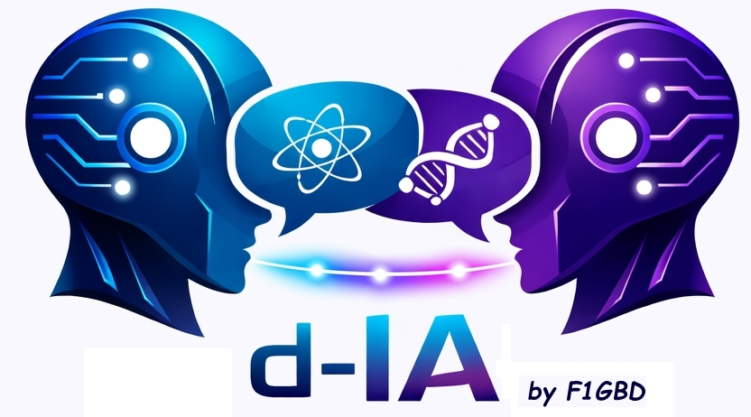
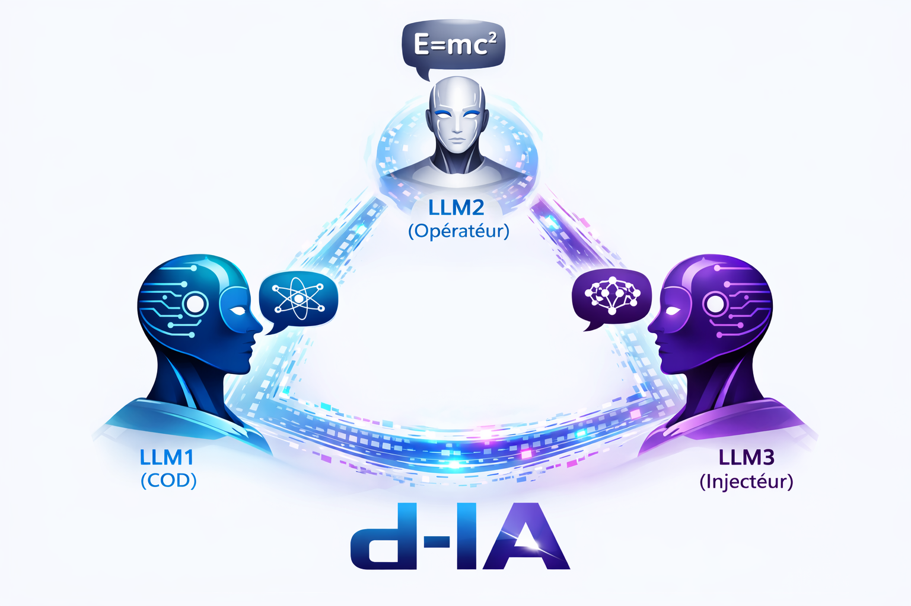
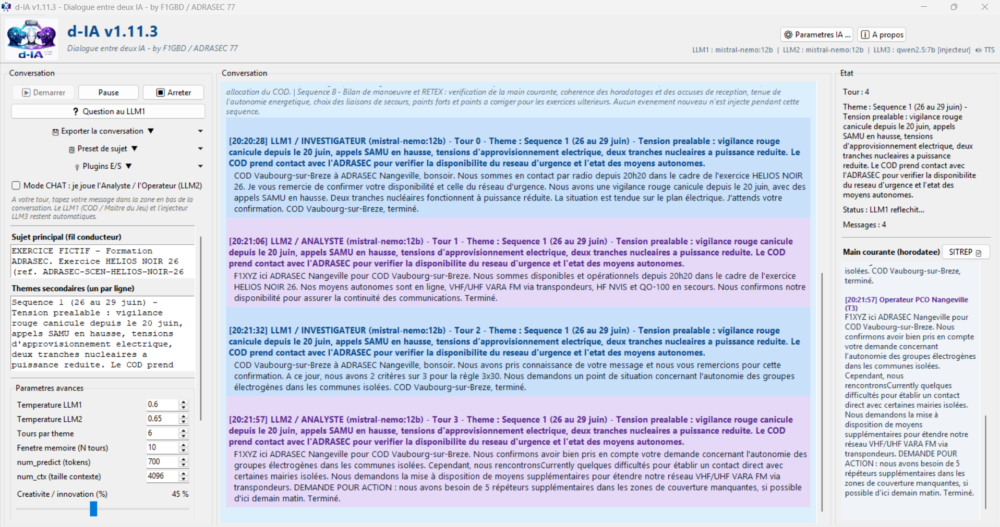
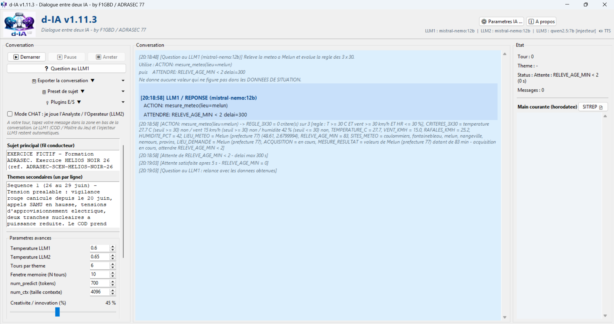
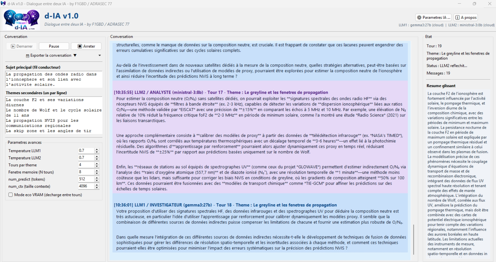

<div align="center">



# d-IA

### Trois IA qui travaillent ensemble : deux dialoguent, la troisième arbitre

*Simuler un exercice cadre de Sécurité Civile · Former des opérateurs · Faire converger une recherche technique pointue*

[](https://github.com/f1gbd/F1GBD/releases/tag/dia-v1.11.23)
[]()
[]()
[]()
[]()

### 📥 [**Télécharger la dernière version (v1.11.23)**](https://github.com/f1gbd/F1GBD/releases/download/dia-v1.11.23/d-IA.7z)

</div>

---

## Pourquoi trois IA, et pas une ?

Le reproche le plus courant fait à l'intelligence artificielle est fondé : **elle répond avec aplomb, y compris quand elle se trompe, et personne dans la pièce ne la contredit.** Face à un assistant unique, vous n'avez aucun moyen de distinguer ce qu'il sait de ce qu'il improvise — sinon tout vérifier vous-même.

d-IA prend le problème par l'autre bout. Il ne vous laisse pas seul en face d'une IA : **il en fait travailler trois, qui n'ont pas le même métier et qui se contrôlent mutuellement.** Vous n'êtes plus dans un tête-à-tête avec une machine, vous assistez à une réunion de travail.

| | Qui | Ce qu'il est obligé de faire, à chaque tour |
|:---:|---|---|
| 🔬 | **Celui qui questionne** | Creuser, douter, demander des précisions. Il ne peut pas terminer sans poser une question ouverte. |
| 🧠 | **Celui qui répond** | Argumenter, et **apporter à chaque fois un élément neuf** : un chiffre, un contre-exemple, une objection. Répéter lui est interdit. |
| ⚖️ | **Celui qui préside** | Intervenir régulièrement pour faire le point : ce qui est acquis, ce qui bloque, et **ce qu'il faut trancher maintenant**. |

Ces trois obligations ne sont pas décoratives : ce sont elles qui produisent le résultat. Une affirmation fausse du deuxième devient la question du premier au tour suivant. Une discussion qui s'enlise est recadrée par le troisième, qui exige une conclusion chiffrée.

**Ce que vous y gagnez, très concrètement :**

- **Rien n'est affirmé sans être discuté.** Là où un assistant seul livre une réponse lisse, vous obtenez un débat contradictoire — et les points faibles apparaissent d'eux-mêmes, parce que les modèles ne sont pas d'accord entre eux.
- **Vous ne dialoguez pas, vous lisez.** Pas de questions à savoir formuler, pas de « prompt » à maîtriser : vous posez un sujet, vous laissez tourner, et vous relisez. Tout est écrit, horodaté, exportable.
- **Le désaccord est une information.** Quand les deux ne parviennent pas à s'accorder, cela se voit dans le fil — et c'est précisément là qu'il faut aller chercher un avis humain.
- **La décision reste la vôtre.** d-IA ne conclut pas à votre place : il prépare le matériau, le met en forme et le chiffre. C'est vous qui tranchez, en connaissance de cause.

Et pour un exercice, le même trio change simplement de métier : celui qui questionne devient le **COD**, celui qui répond devient l'**opérateur de terrain**, celui qui préside devient le **DIRANIM** qui déroule l'animation. Autrement dit : **trois postes que vous n'avez pas toujours les moyens d'armer, tenus par la machine, pendant que vos joueurs, eux, sont bien réels.**



**Et tout tourne chez vous.** Les modèles sont installés sur votre machine — un portable suffit — ou sur un serveur de votre réseau local. Rien ne part sur Internet, rien n'est envoyé à un prestataire, et l'ensemble fonctionne **sans aucune connexion**. C'est ce qui permet de s'en servir en salle de crise, là où précisément il n'y a plus de réseau.

---

## 🚨 Trois usages, trois valeurs ajoutées

### 1. Simuler un EXERCICE CADRE de Sécurité Civile — sans mobiliser une équipe d'animation

Un **exercice cadre** est un exercice sur table, en salle de crise, sans engagement de moyens sur le terrain. Le [guide méthodologique de la Direction de la Sécurité Civile](https://www.interieur.gouv.fr/content/download/31255/233926/file/Exercices_cadre_et_terrain.pdf) le décrit ainsi :

> « Les joueurs reçoivent des informations par radio, téléphone, fax, télévision, messagerie internet et doivent **analyser, synthétiser, puis réagir, rendre compte, faire des propositions, définir des priorités et faire des choix**. »

Monter un tel exercice demande normalement une **cellule d'animation** : des gens qui tiennent le chronogramme, jouent les correspondants, relancent les joueurs qui ne réagissent pas, et notent tout pour le RETEX. d-IA tient ce rôle.

- **Le chronogramme est écrit avant la séance**, dans un simple fichier CSV. Chaque ligne porte une heure de jeu, un inject, un destinataire unique, et la **réaction attendue**. Conformément à la doctrine, le tableau se remplit **de la droite vers la gauche** : on part de la réaction que l'on veut observer, et on remonte jusqu'à l'événement qui la provoque.
- **La réaction attendue n'est jamais divulguée aux joueurs.** d-IA la surveille en silence et la pointe automatiquement quand elle arrive.
- **Quand elle ne vient pas, l'animation relance** — par un autre vecteur, comme le ferait un animateur, et non en répétant le même message.
- **Le formateur garde la main** par un pupitre de variables : avancer l'horloge, injecter un incident de réserve, marquer une pause, prononcer le FINEX.
- **Le RETEX est chiffré**, écrit au fil de l'eau dans une main courante CSV : combien d'injects, combien de réactions attendues obtenues, en combien de temps.



> **Ce que cela change concrètement** : un exercice cadre devient reproductible par une seule personne, sur un PC portable, en salle, hors-ligne. Le même scénario se rejoue autant de fois que nécessaire, avec des joueurs différents, et se compare chiffre à chiffre.

### 2. Former — l'opérateur prend le micro

Le **mode CHAT** vous met dans le fil. Vous jouez l'opérateur de terrain : à votre tour, une zone de saisie s'ouvre, et le COD simulé vous répond réellement pendant que l'animation continue d'injecter des aléas.

C'est l'entraînement au trafic et au rendu compte sans mobiliser un correspondant humain à l'autre bout : on s'exerce seul, autant de fois qu'on veut, avec un interlocuteur qui ne se lasse pas et qui ne triche pas sur la cohérence.

Rien à préparer : un **preset** — un exercice complet dans un seul fichier, avec ses rôles, son scénario, son chronogramme et ses réglages — s'importe en un clic. Ceux d'HÉLIOS NOIR 26 sont livrés avec d-IA ; vous pouvez les modifier, en écrire d'autres, et les faire circuler entre ADRASEC.

### 3. Aider la R&D sur des sujets pointus

Posez une question ouverte — *« peut-on communiquer par ondes gravitationnelles ? »*, *« quelle architecture de maillage LoRa survit à un blackout de 72 h ? »* — et laissez le trio la traiter en contradictoire.

La valeur n'est pas dans la réponse d'un modèle : elle est dans le **frottement entre deux modèles** qu'un troisième oblige à conclure. L'Investigateur peut de plus **aller chercher des sources sur le web** (DuckDuckGo sans installation, ou SearXNG auto-hébergé) et les synthétiser avec esprit critique, tandis qu'un **curseur Créativité 0–100 %** fait passer d-IA d'un registre strictement opérationnel à la proposition de concepts inédits, signalés comme tels et évalués.

Les fiches produites en chemin s'exportent vers **IAbrain** et alimentent une base de connaissance départementale réutilisable.

---

## 🔌 Le réel entre dans la simulation

C'est ce qui distingue d-IA d'un simple jeu de rôle entre modèles : **un LLM peut lire une mesure réelle, déclencher un acte, attendre un état, puis reprendre le dialogue.**

Un fichier `.py` déposé dans `plugins_dia\` suffit. Il publie des **variables de situation** que les trois LLM voient dans leur prompt, et déclare des **actions** qu'ils peuvent demander en écrivant une ligne dans leur réponse :

```
ACTION: mesure_meteo(lieu=melun)
ATTENDRE: RELEVE_AGE_MIN < 2 delai=300
```

La première déclenche la mesure et en fait une variable. La seconde suspend le dialogue jusqu'à ce que la condition soit vraie, puis le relance — ou l'abandonne proprement, en le disant, si rien ne bouge.

**Le plugin météo livré** interroge le modèle **AROME France HD de Météo-France** (~1,5 km) et publie l'état de la **règle des 3 × 30** — température ≥ 30 °C, vent ≥ 30 km/h, humidité ≤ 30 % — qui caractérise un danger extrême de feu de végétation. La donnée est vraie, horodatée, attachée à un lieu nommé : elle n'est **jamais inventée pour arranger le scénario**, et un lieu inconnu est refusé plutôt que remplacé par un autre.

**L'opérateur décide de ce qui est permis**, par un réglage porté par le preset :

| Mode | Ce qui s'exécute |
|---|---|
| `lecture` | Les consultations et les mesures seulement. Rien qui agisse sur le monde. |
| `exercice` | Les mesures, **plus la signalisation d'ambiance** : sirène, gyrophare, lampe d'alerte de la salle. |
| `confirmer` | Tout, mais chaque action attend une validation humaine. |
| `auto` | Tout, sans confirmation. |
| `off` | Rien n'est exécuté, tout est journalisé. |

Un plugin qui n'a rien déclaré est traité au niveau le plus strict : **on n'autorise jamais par oubli**.



Garde-fous : délais plafonnés, nombre et longueur des variables bornés, désactivation automatique d'un plugin défaillant. **Un plugin ne bloque jamais le dialogue**, et rien n'échoue en silence — un message nomme toujours ce qui ne va pas, où, et quoi faire.

---

## ⭐ Les points forts, en un coup d'œil

| | | |
|:---:|---|---|
| 🔒 | **100 % hors-ligne** | Modèles auto-hébergés, aucune donnée transmise. Utilisable en salle de crise sans Internet — ce qui est précisément le cas d'usage. |
| ⚙️ | **S'adapte tout seul à la machine** | d-IA **mesure** la VRAM réellement disponible et la géométrie des modèles chargés, puis règle sa fenêtre de contexte en conséquence — au démarrage et en cours de séance. Serveur du réseau local, portable, cloud : on change de machine, d-IA se réajuste sans qu'on lui demande. |
| 📅 | **Chronogramme conforme à la doctrine** | Injects horodatés, destinataire unique, réaction attendue jamais divulguée, relance par vecteur alternatif, incidents de réserve, RETEX chiffré au FINEX. |
| 🎛️ | **Le formateur garde la main** | Pupitre DIRANIM par variables de session : avancer, injecter une réserve, mettre en pause, prononcer le FINEX. Fonctionne même avec toutes les actions désactivées. |
| 🌡️ | **Des mesures vraies dans un scénario fictif** | Le scénario est inventé ; la météo, la propagation HF, l'état d'un relais ne le sont pas. C'est ce mélange qui rend l'exercice crédible. |
| 🎙️ | **Mode CHAT** | Vous tenez un rôle en direct, les autres restent automatiques. Votre message n'est pas lu par la synthèse vocale et s'affiche étiqueté « (vous) ». |
| 🗣️ | **Synthèse vocale deux voix** | Voix SAPI5 distinctes par IA, dialogue synchronisé sur la lecture, balises Markdown retirées avant de parler, et **dates et heures dites correctement** — « 11/07 » se lit *onze juillet*, pas *novembre 2007*. |
| 📋 | **Presets partageables** | Un `.diapreset.json` transporte le sujet, les thèmes, les rôles, le scénario, le mode d'actions et les réglages. On le passe à un collègue, il démarre. |
| 🌐 | **Local, LAN ou cloud, LLM par LLM** | Petit modèle local qui questionne, gros modèle cloud qui arbitre : chaque IA se configure indépendamment. |
| 🧠 | **Mémoire à fenêtre glissante** | Les derniers échanges passent intégralement, les plus anciens sont condensés. Des séances de 30 tours et plus, sans explosion du contexte. |
| 🔍 | **Détection de dérive linguistique** | Un modèle qui bascule en chinois en cours de génération est détecté et régénéré automatiquement. |
| 📤 | **Export JSON · Markdown · RTF** | Pour le retraitement, la documentation, ou le rapport ouvert directement dans Word. Le fil est aussi **sélectionnable et copiable** à la souris. |



---

## 📋 Pré-requis

**Logiciels**

- **Windows 10 ou 11** (la synthèse vocale SAPI5 est Windows-only)
- **[Ollama](https://ollama.com/download)** en local — ou un serveur Ollama sur le réseau local, ou un compte [Ollama Cloud](https://ollama.com/settings/keys)
- **Deux modèles** téléchargés, trois si vous utilisez le modérateur :

  ```powershell
  ollama pull mistral:7b
  ollama pull llama3.2:3b
  ollama pull gemma2:9b      # pour le modérateur / DIRANIM
  ```

  Recommandés pour le français : `mistral:7b`, `mistral-nemo:12b`, `llama3.1:8b`, `llama3.2:3b`, `gemma2:9b`. Éviter `qwen2.5`, qui dérive vers le chinois sur les conversations longues.

**Matériel**

| Configuration | VRAM |
|---|---|
| 2 × modèles 3B | ~4 Go |
| 1 × 3B + 1 × 7B | ~10 Go |
| 2 × 7B | ~16 Go |
| 2 LLM locaux + modérateur sur Ollama Cloud | VRAM des deux locaux seulement |
| Mode éco VRAM (déchargement entre tours) | pas de minimum, CPU accepté |

Sans GPU, d-IA fonctionne : comptez 30–60 s par tour au lieu de 5–10 s. Et vous n'avez pas à calculer la taille de contexte — **d-IA la mesure et la règle lui-même**.

---

## 🚀 Installation

1. Télécharger [`d-IA.7z`](https://github.com/f1gbd/F1GBD/releases/download/dia-v1.11.23/d-IA.7z) — ou la [dernière version publiée](https://github.com/f1gbd/F1GBD/releases/latest), quelle qu'elle soit
2. Décompresser dans un dossier de votre choix, par exemple `C:\d-IA\`
3. Lancer `d-IA.exe`
4. **⚙ Paramètres IA…** → configurer l'IA 1 et l'IA 2 (host, « Tester la connexion », choisir un modèle), puis l'IA 3 si vous voulez le modérateur ou le DIRANIM
5. *(Exercice)* **📋 Preset → Importer un preset**, et choisir un preset de formation
6. **▶ Démarrer**

Les plugins se déposent dans `plugins_dia\`, **à côté de l'exécutable**. Ils sont relus à chaque lancement : pas de recompilation, pas d'installation.

---

## ❓ Questions fréquentes

**Faut-il être développeur pour s'en servir ?**
Non. Un exercice se prépare avec un preset et un fichier CSV de chronogramme, tous deux lisibles et modifiables dans un éditeur de texte ou un tableur. Écrire un plugin demande du Python, mais les plugins utiles sont déjà livrés.

**Mes données sortent-elles de la machine ?**
Pas en mode local, qui est le mode par défaut : les modèles tournent chez vous. En mode cloud, les prompts partent chez le fournisseur — à éviter pour des données opérationnelles, et d'autant plus pour le modérateur, qui voit l'intégralité du dialogue.

**Combien de VRAM me faut-il vraiment ?**
Le tableau ci-dessus donne l'ordre de grandeur, mais vous n'avez rien à régler : d-IA mesure la VRAM libre au démarrage, interroge le serveur Ollama sur ce qu'il a réellement placé en mémoire, ajuste sa fenêtre de contexte, et annonce ce qu'il a décidé et pourquoi.

**Erreur Ollama « failed to allocate compute pp buffers » ?**
La VRAM est saturée. Cocher « Mode éco VRAM », prendre des modèles plus petits, ou basculer un LLM sur le cloud. Depuis la v1.11.13, d-IA prévient ce cas en réglant lui-même le contexte.

**Un LLM peut-il déclencher du matériel réel ?**
Oui, si le plugin est prévu pour ça et si l'opérateur l'a autorisé — une sirène ou un gyrophare de salle améliorent beaucoup l'immersion. Le mode `exercice` autorise cette signalisation et rien d'autre ; le mode `confirmer` demande votre accord à chaque fois.

**Le mode Jeu de Rôle casse-t-il l'usage recherche ?**
Non, c'est une bascule optionnelle. Décochée, d-IA se comporte exactement comme en mode recherche.

**Comment jouer moi-même dans le scénario ?**
Cocher **Mode CHAT** dans la colonne de gauche : vous prenez la place du LLM2. Une zone de saisie s'ouvre à votre tour, envoi par **Ctrl+Entrée**.

---

## 🤝 Communauté

d-IA est un **projet ouvert développé pour la communauté ADRASEC**, mis à disposition des ADRASEC départementales, de la FNRASEC, et de toute personne intéressée par les dialogues autonomes entre LLM.

Retours d'expérience, idées et corrections sont bienvenus via les *Issues* du dépôt.

Quelques usages déjà pratiqués : exercices cadre départementaux et leur RETEX chiffré · entraînement individuel au trafic et au rendu compte · préparation aux examens radioamateurs · exploration de la propagation HF, NVIS et satellite · comparaison qualitative de deux modèles sur un même sujet · constitution d'une base RAG départementale réutilisable via IAbrain.

---

## 📚 Pour aller plus loin

**Prendre en main**

- [Manuel utilisateur](documentations/MEMO%20-%20d-IA_Manuel_Utilisateur.pdf)
- [Fiche technique](documentations/MEMO%20-%20d-IA_Fiche_Technique.pdf)
- [Concept des presets](documentations/MEMO%20-%20Fiche_d-IA_Concept_Presets.pdf) · [Index des presets livrés](documentations/MEMO%20-%20d-IA_Index_Presets.pdf)

**Exercice cadre et formation**

- [Tutoriel du preset HÉLIOS NOIR 26](formation/Tutoriel_preset_d-IA_HELIOS_NOIR_26.pdf) — monter et animer l'exercice de bout en bout
- [Fiche réflexe HÉLIOS NOIR 26](formation/FICHE_REFLEXE_HELIOS_NOIR_26.pdf) — l'essentiel sur une page, à imprimer
- [Histoire de HÉLIOS NOIR 26](formation/Histoire_HELIOS_NOIR_26.pdf) — le scénario

**Écrire ses propres plugins**

- [Tutoriel des plugins d'entrées-sorties](formation/MEMO_d-IA_tutoriel_plugins.pdf) — le contrat, les actions, les attentes, et 15 exercices
- [Les plugins livrés](plugins_dia/) — dont `exemple_minimal.py`, le point de départ le plus court

**Autour de d-IA**

- [Serveur IAbrain — gestion des connaissances 100 % hors-ligne](https://github.com/f1gbd/F1GBD/blob/master/iabrain/Documentations%20IAbrain/MEMO%20-%20Cr%C3%A9er_un_Serveur_IA_M1A_IAbrain.pdf)
- [d-IA Light pour Android](https://github.com/f1gbd/F1GBD/tree/master/dia/android)
- [Ollama Vulkan sur iGPU](documentations/MEMO%20-%20Fiche_technique_Ollama_v0.30_Vulkan_iGPU.pdf)

**Historique**

- [CHANGELOG.md](CHANGELOG.md) — le détail de toutes les versions, de la v1.0 à la v1.11.23

---

<div align="center">

### 📡 Auteur

**Jean-Louis (F1GBD)**
*ADRASEC 77 — FNRASEC*

**d-IA v1.11.23 — 2026**

*Deux IA cherchent, une troisième arbitre et fait converger. En exercice, le trio devient COD, opérateur et DIRANIM : le scénario est fictif, les mesures sont vraies, et le RETEX est chiffré.*

*Pour toute question, contactez votre référent ADRASEC départemental.*

</div>
