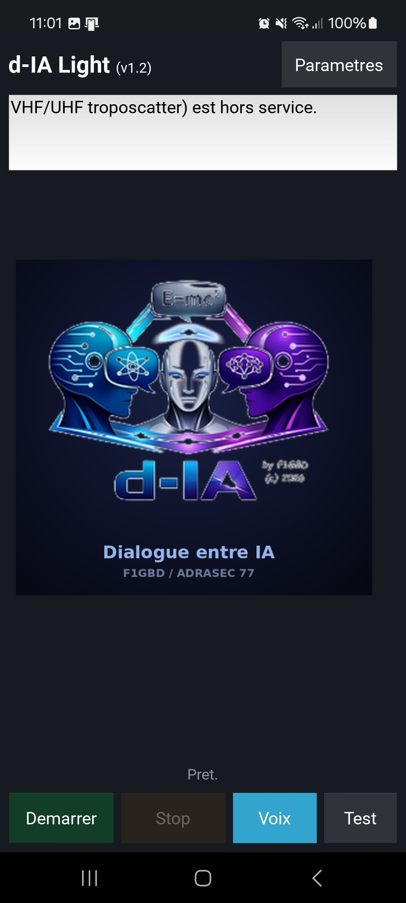
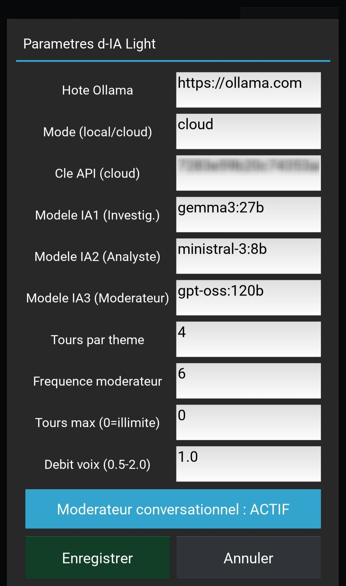
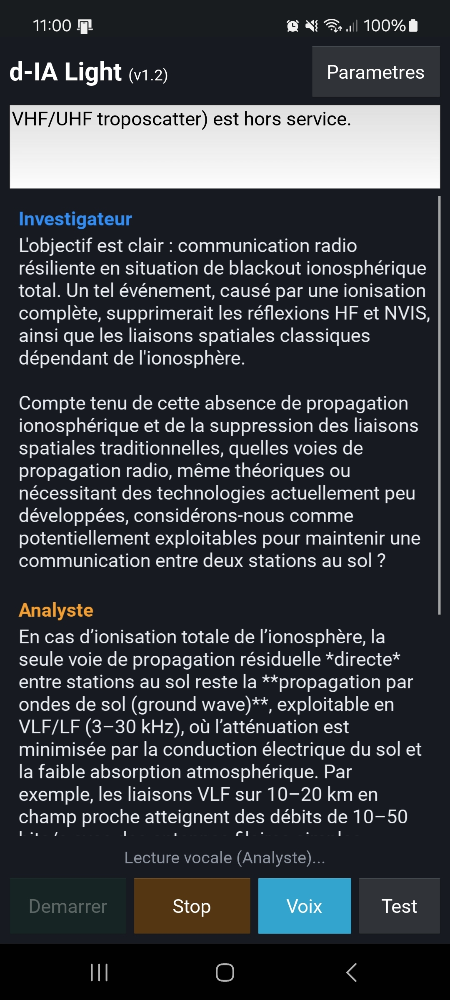

  

**Dialogue autonome entre intelligences artificielles**
*par F1GBD — ADRASEC 77 / FNRASEC*

# d-IA Light — Application Android
d-IA Light est la version Android de **d-IA**, un système où plusieurs IA
dialoguent entre elles de façon autonome sur un sujet donné. Trois rôles
collaborent : un **Investigateur** qui questionne et explore, un **Analyste**
qui répond avec rigueur, et un **Modérateur** qui fait converger la
discussion vers une synthèse. Les échanges peuvent être lus à voix haute.

L'application fonctionne en **client léger** : elle se connecte à un serveur
**Ollama Cloud** qui exécute les modèles de langage. Le téléphone ne fait
qu'orchestrer le dialogue et l'afficher.

  

---

## Téléchargement

L'application est distribuée sous forme de fichier **APK** (installation
directe, hors Google Play).

➡️ **[Télécharger la dernière version Android](https://github.com/f1gbd/F1GBD/releases/download/dia-android-v1.2.0/d-IA-Light.apk)**

> Le dépôt `f1gbd/F1GBD` héberge plusieurs projets (TCQ, IAbrain,
> EPIRBdecoder, d-IA Windows…). Les versions **Android de d-IA** portent
> toutes un tag commençant par `dia-android-` : le lien ci-dessus les
> filtre, et la plus récente est en haut. Téléchargez le fichier
> `d-IA-Light.apk` de la release la plus récente.

| | |
|---|---|
| **Version** | 1.2 |
| **Taille** | ~41 Mo |
| **Android requis** | 7.0 (API 24) ou supérieur |
| **Architectures** | arm64-v8a, armeabi-v7a (tous smartphones modernes) |

---

## Installation

Comme l'application ne provient pas du Google Play Store, Android demande
une autorisation pour l'installer. C'est normal pour une application
distribuée directement.

1. **Téléchargez** le fichier `d-IA-Light.apk` sur votre téléphone (depuis
   la [section *Releases*](https://github.com/f1gbd/F1GBD/releases?q=dia-android&expanded=true)
   filtrée sur `dia-android-`).
2. **Ouvrez** le fichier téléchargé (via la notification de téléchargement
   ou un gestionnaire de fichiers).
3. Android affichera un avertissement *« sources inconnues »* : autorisez
   l'installation pour cette fois (ou pour votre navigateur / gestionnaire
   de fichiers).
4. Si **Google Play Protect** affiche *« Appli non sécurisée bloquée »* :
   touchez **« Plus de détails »** puis **« Installer quand même »**.
   Cet avertissement est habituel pour les applications hors Play Store ;
   l'application ne contient aucun code malveillant.
5. L'icône **d-IA Light** apparaît dans votre tiroir d'applications.

---

## Première utilisation

L'application a besoin d'une **clé API Ollama Cloud** pour fonctionner
(c'est le service qui exécute les modèles d'IA).

### 1. Obtenir une clé Ollama Cloud

Créez un compte sur **[ollama.com](https://ollama.com)**, puis générez une
clé d'accès dans **Settings → Keys**.

  

### 2. Configurer l'application

À la première ouverture, touchez **Paramètres** et renseignez :

- **Clé API** : collez votre clé Ollama Cloud
- Vérifiez que le **Mode** est sur `cloud`

Touchez **Enregistrer**, puis **Test** : le message *« Serveur OK »*
confirme que la connexion fonctionne.

### 3. Lancer un dialogue

De retour sur l'écran principal, touchez **Démarrer**. Les trois IA
commencent à dialoguer sur le sujet affiché (modifiable dans le champ de
texte). Touchez **Stop** pour interrompre, et **Voix** pour activer ou
couper la lecture vocale.

  

---

## Réglages disponibles (Paramètres)

| Réglage | Description |
|---|---|
| Clé API / Mode / Hôte | Connexion au serveur Ollama |
| Modèles IA1 / IA2 / IA3 | Modèles utilisés par chaque rôle |
| Tours par thème | Durée passée sur chaque sous-thème |
| Fréquence modérateur | Intervalle entre les interventions du modérateur |
| Tours max | Longueur totale du dialogue (0 = illimité) |
| Débit voix | Vitesse de la synthèse vocale |

Les modèles préconfigurés sont `gemma3:27b` (Investigateur),
`ministral-3:8b` (Analyste) et `gpt-oss:120b` (Modérateur). Vérifiez qu'ils
correspondent aux modèles disponibles sur votre compte Ollama Cloud ;
sinon, ajustez les noms dans les Paramètres.

---

## Synthèse vocale

La lecture à voix haute utilise le moteur de synthèse vocale de votre
téléphone. Si vous n'entendez rien :

- Vérifiez que le **volume Média** est suffisant.
- Vérifiez qu'un moteur de synthèse vocale **français** est installé :
  *Paramètres Android → Gestion globale → Synthèse vocale* (ou
  *Accessibilité → Synthèse vocale* selon le modèle).

---

## Confidentialité

L'application n'envoie de données qu'au serveur Ollama que vous configurez.
Votre clé API et vos réglages sont stockés **localement** sur votre
téléphone. Aucune donnée n'est transmise à des tiers.

---

## Notes de version

### v1.2
- Trois IA en dialogue (Investigateur, Analyste, Modérateur)
- Modérateur conversationnel actif (synthèse et convergence)
- Synthèse vocale en français
- Connexion Ollama Cloud (HTTPS)
- Scénario d'exercice ADRASEC préconfiguré

---

[*MANUEL Utilisateur complet de d-IA Light Android*](https://github.com/f1gbd/F1GBD/blob/master/dia/android/documentation/MEMO%20-%20Manuel_d-IA_Light_Android.pdf)

*d-IA Light — Outil de démonstration et de formation pour l'ADRASEC.*
*73 de F1GBD.*
