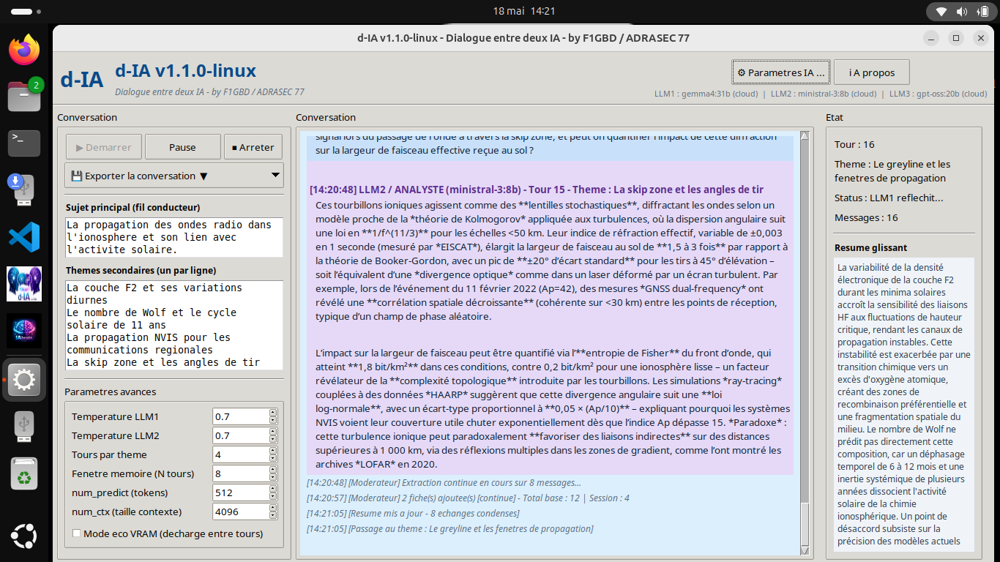

<div align="center">
  
</div>

# d-IA pour Linux

**Dialogue autonome entre deux intelligences artificielles**

*Version 1.1.0 Linux — par F1GBD / ADRASEC 77 / FNRASEC*

[]()
[]()
[]()
[]()

---

## 🎯 Qu'est-ce que d-IA ?

**d-IA** est une application Linux qui orchestre un dialogue autonome entre **deux modèles de langage** (LLM) sur un sujet scientifique défini par l'utilisateur. L'un joue le rôle d'**Investigateur** (questions, doutes), l'autre celui d'**Analyste** (réponses étayées, nouvelles pistes).

Cette version Linux est la **transposition fidèle** de la version Windows, à une exception près : la synthèse vocale est désactivée (voir [Limitations Linux](#-limitations-linux) plus bas).

**Aucune dépendance Python à installer** : le binaire embarque tout (Python 3.12 + ollama + Pillow + Tkinter) via PyInstaller.

### Cas d'usage typiques

- 🎓 **Préparation d'examen radioamateur** : un LLM joue le candidat, l'autre l'examinateur
- 🚨 **Génération de RETEX fictifs** ADRASEC pour enrichir la documentation interne
- 🔬 **Exploration pédagogique** (propagation HF, NVIS, satellite, communications quantiques...)
- ⚖️ **Comparaison qualitative** de deux modèles LLM (Mistral vs Llama, local vs cloud)
- 🎙️ **Génération de matière première** pour podcasts radioamateurs (export RTF/Markdown)
- 📚 **Auto-enrichissement de base RAG** : extraction automatique de fiches techniques (v1.1)

<div align="center">
  
</div>
---

## ⭐ Fonctionnalités principales

- **Dialogue à 2 LLM** avec rôles asymétriques (Investigateur / Analyste)
- **Thèmes secondaires guidés** avec progression structurée
- **Mémoire à fenêtre glissante** : résumé automatique des anciens échanges
- **Détection de dérive linguistique** (basculement Qwen en chinois/cyrillique)
- **Mode ADRASEC enrichi (v1.1)** : 3e LLM modérateur qui extrait automatiquement des fiches RAG
- **Export multi-format** : JSON, Markdown, RTF avec couleurs LLM1/LLM2
- **Mode local OU cloud** : Ollama auto-hébergé, Ollama Cloud, ou mix
- **Configuration persistante** dans `d-ia_setup.json`

---

## 🆕 Nouveautés v1.1 — Mode ADRASEC enrichi

La v1.1 ajoute un **3e LLM modérateur** qui observe le dialogue en arrière-plan et extrait automatiquement des fiches documentaires structurées (JSON) :

```
Investigateur (LLM1) <-->  Analyste (LLM2)
                      |
                      v
              Modérateur (LLM3)
                      |
                      v
              rag_adrasec.json
                      |
                      v
              IAbrain  (RAG)
```

Voir le [Guide d'intégration d-IA → IAbrain](https://github.com/f1gbd/F1GBD/tree/master/dia) pour le workflow complet.

---

## 📋 Pré-requis

### Système

- **Linux x86_64** : Ubuntu 24.04+, Debian 12+, Mint 22+
- **Glibc 2.39+** (le binaire est compilé sur Ubuntu 24.04 LTS — voir [Compatibilité](#-compatibilit%C3%A9-des-distributions))
- **Tkinter** : embarqué dans le bundle PyInstaller, aucune installation requise
- **Serveur X11 ou Wayland** avec backend XWayland (cas standard sur tous les bureaux Linux)

### Ollama (obligatoire)

d-IA s'appuie sur Ollama pour faire tourner les LLM. Installation rapide :

```bash
curl -fsSL https://ollama.com/install.sh | sh
```

Puis télécharger au moins un modèle :

```bash
ollama pull mistral:7b
ollama pull llama3.2:3b
```

Et lancer le serveur (s'il ne tourne pas déjà en service systemd) :

```bash
ollama serve   # garder ce terminal ouvert, OU configurer en service systemd
```

### Optionnel — Ollama Cloud

Pour utiliser des modèles XL (gpt-oss:120b, deepseek-v3.1:671b, qwen3-coder:480b), créer un compte sur [ollama.com](https://ollama.com) et récupérer une clé API. Elle sera demandée dans l'écran Paramètres IA de d-IA.

---

## 🚀 Installation

### Étape 1 — Téléchargement et vérification

```bash
# Téléchargement des deux fichiers
wget https://github.com/f1gbd/F1GBD/releases/download/dia-linux-v1.1.0/d-IA-1.1.0-linux-x86_64.tar.gz
wget https://github.com/f1gbd/F1GBD/releases/download/dia-linux-v1.1.0/d-IA-1.1.0-linux-x86_64.tar.gz.sha256

# Vérification de l'intégrité (recommandée)
sha256sum -c d-IA-1.1.0-linux-x86_64.tar.gz.sha256
# Doit afficher : d-IA-1.1.0-linux-x86_64.tar.gz: OK
```

### Étape 2 — Extraction

```bash
tar xzf d-IA-1.1.0-linux-x86_64.tar.gz
cd d-IA-1.1.0-linux-x86_64
```

L'archive (28 Mo compressé, 64 Mo extrait) contient :

```
d-IA-1.1.0-linux-x86_64/
├── bin/                Binaire PyInstaller autonome
│   ├── d-ia            Exécutable ELF 64-bit (~7 Mo)
│   └── _internal/      Python 3.12 + ollama + PIL + Tkinter embarqués
├── d-IA.png            Icône pour le menu Applications
├── d-ia                Lanceur direct (sans installation)
├── install.sh          Script d'installation
└── README.md           Cette documentation
```

### Étape 3 — Choix du mode d'utilisation

Vous avez **trois options** au choix :

#### Option A — Lancement direct, sans rien installer

```bash
./d-ia
```

C'est la méthode la plus simple pour tester. Le binaire tourne depuis le dossier extrait, sans modifier votre système. Idéal pour évaluer rapidement d-IA.

#### Option B — Installation utilisateur (recommandée pour usage régulier)

```bash
./install.sh
```

d-IA est installé dans `~/.local/share/d-IA/`. Conséquences :

- Le binaire est accessible via la commande `d-ia` dans n'importe quel terminal
- Un raccourci apparaît dans le menu Applications de votre bureau (catégorie Éducation/Science)
- L'icône d-IA est installée dans `~/.local/share/icons/d-ia.png`
- Pas de droits root nécessaires

> 💡 Si `~/.local/bin` n'est pas dans votre `$PATH`, le script vous le signale. Ajouter alors cette ligne à `~/.bashrc` ou `~/.zshrc` :
> ```bash
> export PATH="$HOME/.local/bin:$PATH"
> ```

#### Option C — Installation système (multi-utilisateurs)

```bash
sudo ./install.sh --system
```

d-IA est installé dans `/opt/d-IA/` et accessible à tous les utilisateurs de la machine. Adapté aux postes mutualisés, VM de formation ADRASEC, ou serveurs partagés.

### Désinstallation

```bash
# Depuis le dossier extrait (ou depuis le dossier installé)
./install.sh --uninstall
```

Si vous avez utilisé `--system` à l'installation, il faut aussi désinstaller avec `sudo` :

```bash
sudo ./install.sh --uninstall
```

---

## 📖 Utilisation

### Premier démarrage

1. **Lancer Ollama** (si pas déjà en service) :
   ```bash
   ollama serve &
   ```

2. **Lancer d-IA** :
   ```bash
   d-ia          # si installé via Option B ou C
   ./d-ia        # depuis le dossier extrait (Option A)
   ```

3. **Configurer les LLM** : cliquer sur `Paramètres IA…` en haut à droite. La fenêtre s'ouvre avec **5 onglets** :
   - **IA 1 - Investigateur** : configurer le 1er LLM (host, modèle)
   - **IA 2 - Analyste** : idem pour le 2e
   - **IA 3 - Modérateur** : optionnel, pour le mode ADRASEC enrichi
   - **Mode ADRASEC** : activation/configuration de l'extraction RAG
   - **Synthèse vocale** : ⚠️ Désactivé sur Linux (voir Limitations)

4. **Définir un sujet** dans la zone "Sujet principal"

5. **Lister les thèmes secondaires** un par ligne dans la zone dédiée

6. **Cliquer Démarrer** : le dialogue s'enchaîne automatiquement

### Mode ADRASEC enrichi (v1.1)

Pour activer l'extraction automatique de fiches RAG :

1. Onglet **IA 3 - Modérateur** : configurer un LLM dédié (recommandé : `gpt-oss:120b` en cloud, ou `gemma2:9b` en local)
2. Onglet **Mode ADRASEC** : cocher *"Activer le mode ADRASEC enrichi"*
3. Régler la fréquence d'extraction (4 échanges par défaut)
4. Au prochain dialogue, les fiches sont extraites automatiquement et stockées dans `rag_adrasec.json` à côté du binaire

Pour exploiter ces fiches dans **IAbrain**, voir le [Plugin IAbrain](https://github.com/f1gbd/F1GBD/tree/master/dia) (`IAbrain_actions_dia.py`).

### Où sont stockés les fichiers de configuration ?

d-IA crée et maintient ses fichiers (`d-ia_setup.json`, `rag_adrasec.json`) **à côté du binaire `d-ia`** :

| Mode | Emplacement de `d-ia_setup.json` |
|---|---|
| Lancement direct (Option A) | `<dossier d'extraction>/bin/d-ia_setup.json` |
| Installation utilisateur (Option B) | `~/.local/share/d-IA/bin/d-ia_setup.json` |
| Installation système (Option C) | `/opt/d-IA/bin/d-ia_setup.json` ⚠️ droits root |

> ⚠️ En installation système (Option C), la configuration est partagée entre tous les utilisateurs. Si vous voulez des configurations individuelles, préférez l'Option B sur chaque compte utilisateur.

---

## ⚠️ Limitations Linux

| Fonctionnalité | Statut | Détail |
|---|---|---|
| Dialogue 2 LLM | ✅ | Identique Windows |
| Mode ADRASEC enrichi (RAG) | ✅ | Identique Windows |
| Export JSON / Markdown / RTF | ✅ | Identique Windows |
| Ollama local / cloud | ✅ | Identique Windows |
| **Synthèse vocale (TTS)** | ❌ | SAPI5 est une API Windows |
| Détection voix OneCore | ❌ | Sans objet sur Linux |

Le code TTS est désactivé proprement dès le démarrage (`HAS_TTS = False`), donc l'onglet "Synthèse vocale" reste accessible mais signale que la fonctionnalité est indisponible. Aucun crash.

Une future version pourrait intégrer **Piper TTS** ou **espeak-ng** comme backend Linux. Contributions bienvenues.

---

## 🐧 Compatibilité des distributions

Le binaire est compilé sur **Ubuntu 24.04 LTS** (glibc 2.39, Python 3.12). Compatibilité observée :

| Distribution | Statut | Notes |
|---|---|---|
| Ubuntu 24.04 LTS | ✅ Référence de build | Glibc 2.39 |
| Ubuntu 24.10+ | ✅ | Glibc 2.40+ |
| Debian 12 (Bookworm) | ✅ | Glibc 2.36 — compatible |
| Linux Mint 22 | ✅ | Basée sur Ubuntu 24.04 |
| Fedora 40+ | ⚠️ Probable mais non testé | Compatible glibc en théorie |
| Ubuntu 22.04 LTS | ❌ | Glibc 2.35 trop ancienne |
| Debian 11 | ❌ | Glibc 2.31 trop ancienne |
| Raspberry Pi OS | ❌ | Architecture ARM64, pas x86_64 |

---

## ❓ FAQ

### L'archive est extraite mais `./d-ia` ne se lance pas

Vérifier dans l'ordre :

1. Le bit exécutable est-il présent ?
   ```bash
   ls -la d-ia bin/d-ia
   # Doit afficher -rwxr-xr-x pour les deux
   chmod +x d-ia bin/d-ia    # au cas où
   ```

2. Lancer depuis un terminal pour voir le message d'erreur :
   ```bash
   ./d-ia
   # Lit attentivement la sortie console
   ```

3. Vérifier la glibc :
   ```bash
   ldd --version | head -1
   # Doit afficher 2.36 ou supérieur
   ```

### d-IA démarre mais ne se connecte pas à Ollama

Vérifier dans l'ordre :

1. Ollama tourne : `curl http://localhost:11434/api/tags` doit renvoyer du JSON
2. Si non, démarrer : `ollama serve`
3. Si vous utilisez un autre port/host, le configurer dans Paramètres IA

### Combien d'espace disque pour les modèles LLM ?

Quelques ordres de grandeur :

- `llama3.2:3b` : ~2 Go
- `mistral:7b` : ~4 Go
- `gemma2:9b` : ~6 Go
- `mistral-nemo:12b` : ~7 Go

Pour le **mode ADRASEC enrichi**, prévoir un modèle modérateur supplémentaire (5-7 Go en local, ou usage cloud sans charge disque).

### Comment utiliser une GPU AMD pour Ollama ?

Ollama supporte ROCm pour les GPU AMD récentes (RDNA 2/3). Documentation Ollama : [github.com/ollama/ollama/blob/main/docs/gpu.md](https://github.com/ollama/ollama/blob/main/docs/gpu.md).

### Comment intégrer les fiches d-IA dans IAbrain ?

Voir le **plugin IAbrain** distribué avec d-IA :

- Fichier `IAbrain_actions_dia.py` à copier dans `~/.local/share/IAbrain/plugins/`
- 4 actions natives : Lister, Convertir, Filtrer par domaine, Filtrer haute confiance
- Documentation : `Plugin_IAbrain_README.md` dans la release

### Migration depuis la version Windows

Le fichier `d-ia_setup.json` est **portable** : copier celui de Windows vers le dossier `bin/` de d-IA Linux fonctionne sans modification. Les hosts Ollama, les modèles, les clés API et les sujets sont conservés. Seul `tts_enabled` sera ignoré (TTS désactivé sur Linux).

```bash
# Exemple pour Option B (installation utilisateur)
cp /chemin/vers/windows/d-ia_setup.json ~/.local/share/d-IA/bin/

# Exemple pour Option A (lancement direct)
cp /chemin/vers/windows/d-ia_setup.json <dossier-extrait>/bin/
```

Idem pour `rag_adrasec.json` : votre base de fiches ADRASEC produites sous Windows est immédiatement utilisable sous Linux.

---

## 🤝 Communauté

- **GitHub** : [github.com/f1gbd/F1GBD](https://github.com/f1gbd/F1GBD)
- **Issues / Bugs** : [github.com/f1gbd/F1GBD/issues](https://github.com/f1gbd/F1GBD/issues)
- **Auteur** : Jean-Louis (F1GBD) — [QRZ.com](https://qrz.com/db/F1GBD)
- **Affiliation** : ADRASEC 77 / FNRASEC

---

## 📜 Historique des versions

### v1.1.0-linux (mai 2026) — version actuelle

- **Première version officielle Linux** (x86_64)
- Mode ADRASEC enrichi (3e LLM modérateur + extraction RAG)
- Intégration IAbrain (plugin natif inclus)
- Persistance config dans le bon dossier (PyInstaller frozen)
- Affichage LLM3 dans le bandeau si mode ADRASEC actif
- TTS désactivé (SAPI5 Windows-only)
- Installeur en 3 modes : utilisateur / `--system` / `--uninstall`
- Raccourci `.desktop` pour menu d'applications


### v1.0.0 (avril 2026)

- Première version publique (Windows)
- Dialogue 2 LLM avec rôles asymétriques
- Mémoire à fenêtre glissante
- Détection dérive linguistique
- Export JSON / Markdown / RTF

---

*73 et bon trafic — Jean-Louis (F1GBD)*
