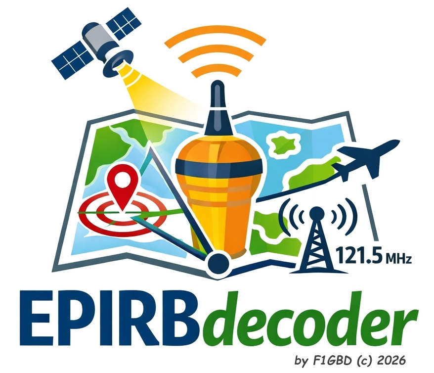
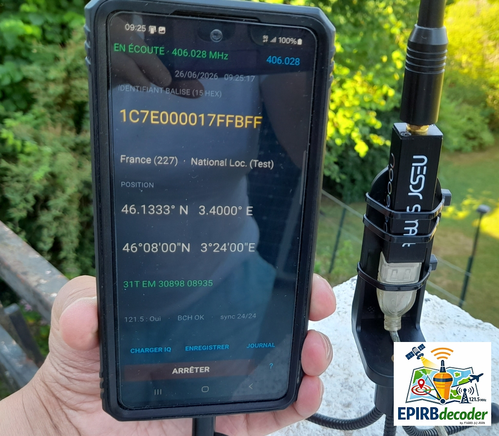
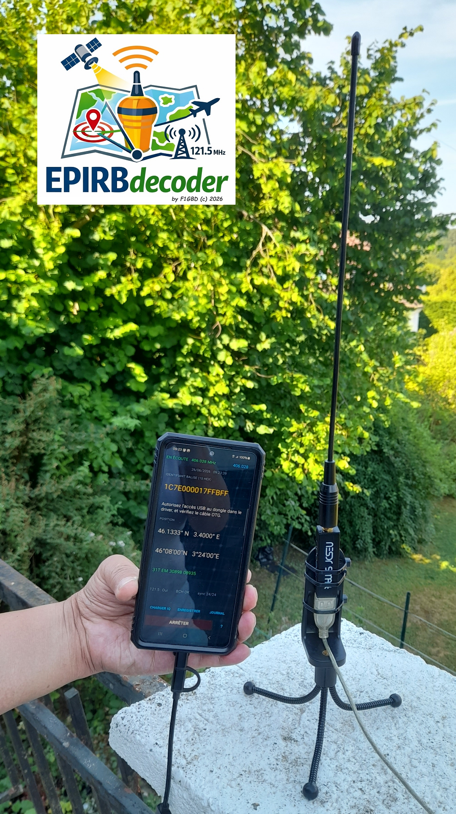
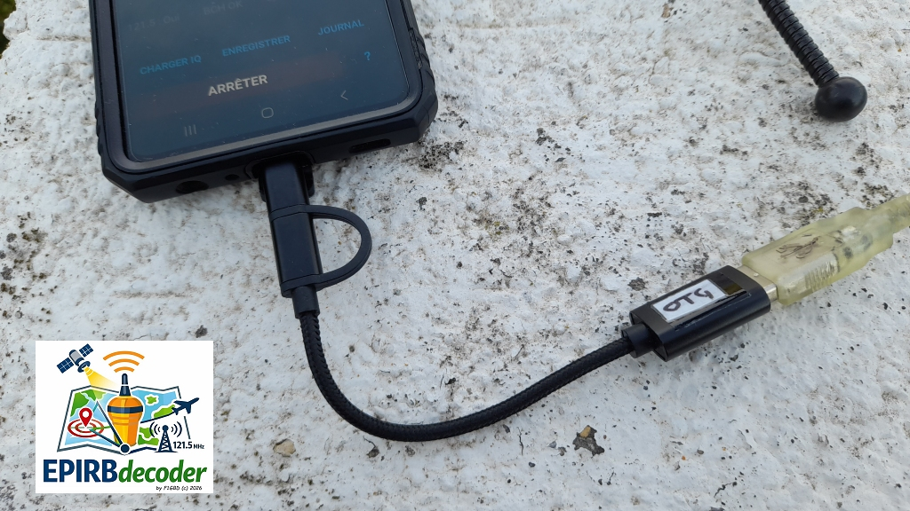

<p align="center">
  
</p>

<h1 align="center">EPIRBpi-decoder-lite — Android</h1>

<p align="center">
  Décodeur SDR de balises de détresse <b>406 MHz</b> (COSPAS-SARSAT) pour Android,
  porté de la version Raspberry Pi. Affiche l'identifiant 15 HEX, le pays, la
  position (décimal / DMS / MGRS) et l'état des contrôles BCH.<br>
  <i>F1GBD · ADRASEC 77 · FNRASEC</i>
</p>

<p align="center">
  
</p>

---

## Sommaire

- [Présentation](#présentation)
- [Captures terrain](#captures-terrain)
- [Fonctionnalités](#fonctionnalités)
- [Matériel requis](#matériel-requis)
- [Installation du driver RTL-SDR](#installation-du-driver-rtl-sdr)
- [Installation de l'application](#installation-de-lapplication)
- [Utilisation](#utilisation)
- [Échantillons de test 406](#échantillons-de-test-406)
- [Emplacement des fichiers](#emplacement-des-fichiers)
- [Construction depuis les sources](#construction-depuis-les-sources)
- [Architecture technique](#architecture-technique)
- [Crédits](#crédits)

---

## Présentation

L'application reçoit en continu les bursts 406 MHz via un dongle **RTL-SDR**
branché sur le téléphone en **USB-OTG**, les décode entièrement **sur
l'appareil** (aucune connexion réseau nécessaire) et affiche les informations de
la balise. Elle peut aussi décoder des **captures IQ enregistrées** (`.npy`),
sans matériel — idéal pour l'entraînement et les exercices ADRASEC/SATER.

Le moteur de décodage (récepteur MLSE, contrôles BCH, conversion MGRS) est
identique à celui des versions PC / Raspberry Pi du projet.

## Captures terrain

<p align="center">
  
  &nbsp;&nbsp;
  
</p>

<p align="center"><i>
Décodage en direct d'une balise 406 MHz (identifiant, position, MGRS, BCH OK) —
dongle RTL-SDR relié au téléphone par un câble USB-OTG, antenne sur trépied.
</i></p>

## Fonctionnalités

- Décodage 406 MHz en temps réel via RTL-SDR (OTG) ou capture réseau rtl_tcp.
- Identifiant 15 HEX, pays, protocole, position **décimale / DMS / MGRS**,
  contrôles **BCH1/BCH2**, indication 121.5 MHz.
- **Tailles de caractères auto-maximales** pour les coordonnées (lisibilité
  terrain).
- **Ouverture cartographique** : bouton **Google Maps** (place un repère sur la
  position de la balise) et bouton **Itinéraire** (navigation routière
  turn-by-turn vers la balise). Les deux boutons s'activent dès qu'une position
  valide est décodée.
- **Tonalité d'alerte** à chaque trame décodée (canal alarme).
- **Date et heure** affichées en continu.
- **Charger IQ** : décode un fichier `.npy` enregistré.
- **Enregistrer IQ** : sauvegarde des bursts reçus (rejouables).
- **Main courante** : journalisation automatique en **CSV** et **TXT**, avec
  visualisation et effacement intégrés (bouton **JOURNAL**).

## Matériel requis

- Un **RTL-SDR** (RTL-SDR Blog V3/V4, ou clé DVB-T compatible RTL2832U).
- Un téléphone Android avec **USB-Host (OTG)**.
- Un **adaptateur / câble USB-OTG** adapté au connecteur du téléphone
  (voir `images/OTGcable.jpg`).
- Une antenne adaptée au 406 MHz.

## Installation du driver RTL-SDR

> ⚠️ Étape indispensable. Android ne donne pas d'accès USB direct au dongle :
> il faut passer par un driver SDR qui expose le flux via un serveur **rtl_tcp**
> local. L'application **lance ce driver automatiquement** (intent `iqsrc://`)
> quand vous appuyez sur **DÉMARRER** ; il suffit de l'avoir installé.

1. Installez le **driver SDR de Martin Marinov** :
   - **Google Play** : « SDR Driver » / « RTL-SDR + HackRF driver »
     → `https://play.google.com/store/apps/details?id=marto.rtl_tcp_andro`
   - **F-Droid** : « Rtl-sdr driver »
     → `https://f-droid.org/packages/marto.rtl_tcp_andro/`
2. Branchez le dongle RTL-SDR via l'adaptateur **OTG**.
3. Lancez EPIRBpi-decoder-lite, appuyez sur **DÉMARRER**.
4. Le driver s'ouvre et demande l'**autorisation d'accès USB** au périphérique :
   acceptez (cochez « toujours autoriser » si proposé). Le driver ouvre alors le
   dongle et démarre le serveur rtl_tcp ; l'application s'y connecte
   automatiquement et passe en **EN ÉCOUTE**.

**Remarques**
- Si plusieurs drivers SDR sont installés (ex. SDRplay), Android peut proposer
  un sélecteur ; choisissez le driver RTL-SDR.
- Si l'application affiche « Driver SDR introuvable », c'est qu'aucun driver
  compatible n'est installé.
- Si « Serveur rtl_tcp non démarré » persiste après autorisation : vérifiez le
  câble OTG et qu'aucune autre application SDR ne monopolise déjà le dongle.

## Installation de l'application

Téléchargez l'APK depuis l'onglet **[Releases](https://github.com/f1gbd/F1GBD/releases)**
(release **`epirb-android-v0.1.0`**) :

→ [`epirbpilite-0.1-arm64-v8a-debug.apk`](https://github.com/f1gbd/F1GBD/releases/download/epirb-android-v0.1.0/epirbpilite-0.1-arm64-v8a-debug.apk)

puis :

```bash
adb install -r epirbpilite-0.1-arm64-v8a-debug.apk
```

ou copiez l'APK sur le téléphone et installez-la en autorisant les **sources
inconnues**.

**Accès aux fichiers** — pour la fonction « Charger IQ », l'application demande
l'autorisation **« Accès à tous les fichiers »** (Android 11+). Au premier appui
sur **CHARGER IQ**, activez-la dans les réglages puis revenez dans l'application.

## Utilisation

| Action | Description |
|---|---|
| **DÉMARRER / ARRÊTER** | Démarre/arrête l'écoute live (lance le driver + connexion rtl_tcp). |
| **Sélecteur de fréquence** | Choix du canal (406.025 / .028 / .037 / .040 MHz). |
| **CHARGER IQ** | Décode un fichier `.npy` (capture IQ complexe). Fonctionne sans dongle. |
| **ENREGISTRER** | Sauvegarde chaque burst reçu en `.npy` (+ `.txt` descriptif). |
| **JOURNAL** | Affiche la main courante ; bouton **EFFACER** (avec confirmation). |
| **Google Maps** | Ouvre la position décodée dans Google Maps (repère sur la balise). |
| **Itinéraire** | Lance la navigation routière (turn-by-turn) vers la position de la balise. |

À chaque trame décodée : tonalité d'alerte, mise à jour de l'affichage et ajout
à la main courante.

Les boutons **Google Maps** et **Itinéraire** se trouvent à côté du libellé
*POSITION* ; ils restent grisés tant qu'aucune position n'est décodée. Ils
ouvrent Google Maps s'il est installé (repli automatique : autre application de
cartographie, puis Google Maps dans le navigateur).

## Échantillons de test 406

Des captures IQ de balises 406 MHz sont fournies dans le dossier
**[`406_samples/`](406_samples/)** du dépôt. Elles permettent de tester le
décodage **sans dongle** :

1. Copiez un fichier `.npy` de `406_samples/` dans le dossier **Téléchargements**
   du téléphone (par ex. `adb push 406_samples/BALISE_MARITIME.npy /sdcard/Download/`).
2. Dans l'application : **CHARGER IQ** → sélectionnez le fichier → **DÉCODER**.

Chaque capture est un tableau NumPy `complex64` (échantillonné à 250 kHz),
accompagné d'un fichier `.txt` jumeau indiquant la fréquence centrale et le
`sample_rate_hz`.

## Emplacement des fichiers

Sur le téléphone, les enregistrements et journaux sont rangés dans
**`Téléchargements/EPIRBpi/`** (accessible depuis n'importe quel gestionnaire de
fichiers) :

- `capture_<freq>_<horodatage>.npy` (+ `.txt`) — enregistrements IQ.
- `main_courante.csv` — journal tabulé (séparateur `;`, compatible Excel/LibreOffice).
- `main_courante.txt` — journal lisible.

## Construction depuis les sources

Environnement : **Ubuntu 24.04 LTS** + Docker (toolchain `kivy/buildozer`).

Arborescence du dépôt (`epirb/android/`) :

```
android/
├── main.py            ← application Kivy
├── epirb_dsp.py       ← back-end DSP (MLSE NumPy + décodage), scipy-free
├── rtltcp.py          ← client rtl_tcp + conversion IQ
├── epirb_engine.py    ← moteur (copie de EPIRB-decoder.py, nom de module valide)
├── icon.png           ← icône (512×512)
├── EPIRBdecoder.png   ← présplash
├── buildozer.spec
├── build-apk.sh
├── images/            ← logo et captures (README)
└── 406_samples/       ← captures IQ de test (.npy + .txt)
```

> Le moteur doit s'appeler **`epirb_engine.py`** (copie de `EPIRB-decoder.py`)
> pour être compilé et inclus dans l'APK, et importé par nom.

```bash
# Prérequis
sudo apt update && sudo apt install -y docker.io
docker pull kivy/buildozer:latest

# Construction (la 1re fois télécharge le SDK/NDK : ~20–40 min, mis en cache)
cd android
docker run -it --rm \
  -v "$HOME/.buildozer":/home/user/.buildozer \
  -v "$PWD":/home/user/hostcwd \
  kivy/buildozer android debug

adb install -r bin/epirbpilite-0.1-arm64-v8a-debug.apk
```

(ou `./build-apk.sh /chemin/vers/EPIRB-decoder.py` qui crée `epirb_engine.py` et
lance le build).

## Architecture technique

- **scipy-free** : `requirements = python3,kivy,numpy` — scipy n'a pas de recette
  buildozer fiable. Le récepteur MLSE a été réécrit en **NumPy pur** (FIR Hamming
  127 taps à phase nulle + ré-échantillonnage par interpolation) ; le seul import
  scipy de tête de module du moteur est neutralisé par un stub à l'exécution.
- **Accès SDR** : l'app ne touche pas l'USB directement. Le driver Marinov ouvre
  le dongle et expose un serveur rtl_tcp local ; un petit client pur-Python lit
  l'IQ (`u8` entrelacé → `complex64`) et alimente le décodeur.
- **Cartographie** : la position décodée est ouverte via un intent `geo:`
  (repère) ou `google.navigation:` (itinéraire), sans permission supplémentaire.
- **Décodage** : récepteur MLSE → décodeur de trame → contrôles BCH1/BCH2 →
  conversion MGRS, réutilisés tels quels depuis le moteur du projet.

## Crédits

Développé par **Jean-Louis — F1GBD** pour **ADRASEC 77** / **FNRASEC**.

Driver RTL-SDR : *SDR Driver* de **Martin Marinov**
(`marto.rtl_tcp_andro`, open source).

© 2026 F1GBD.
