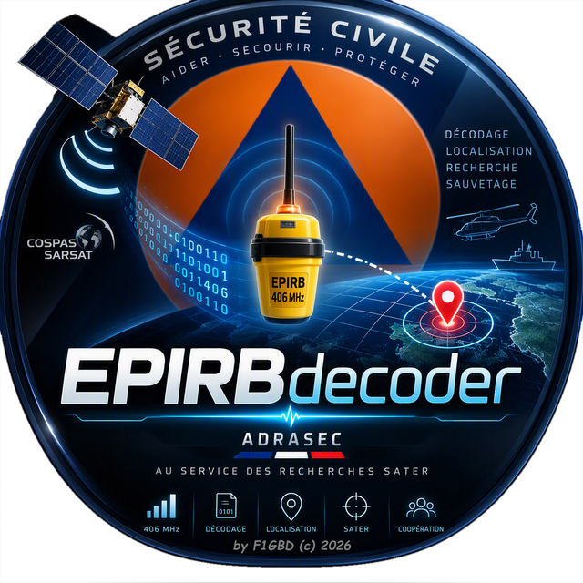
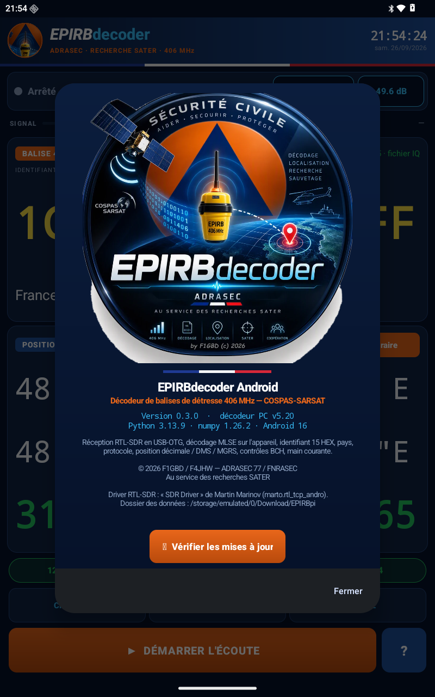
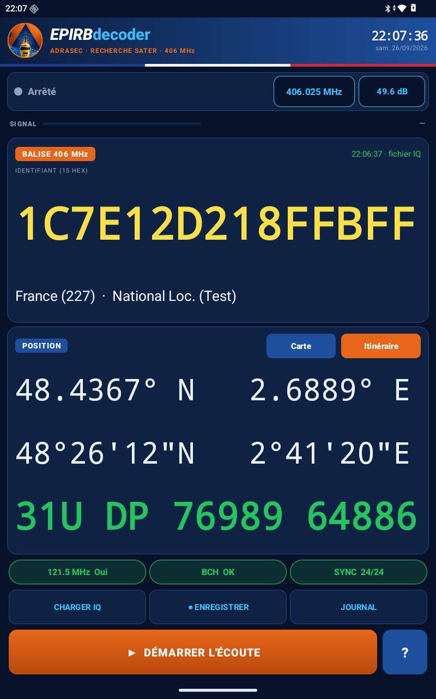
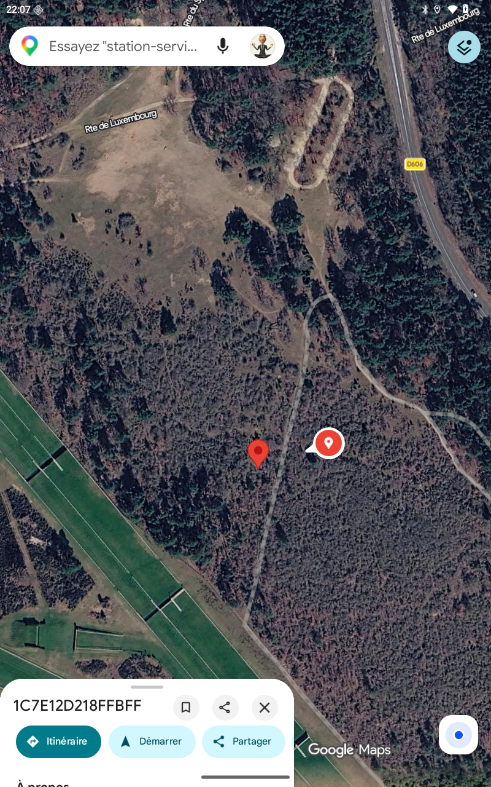
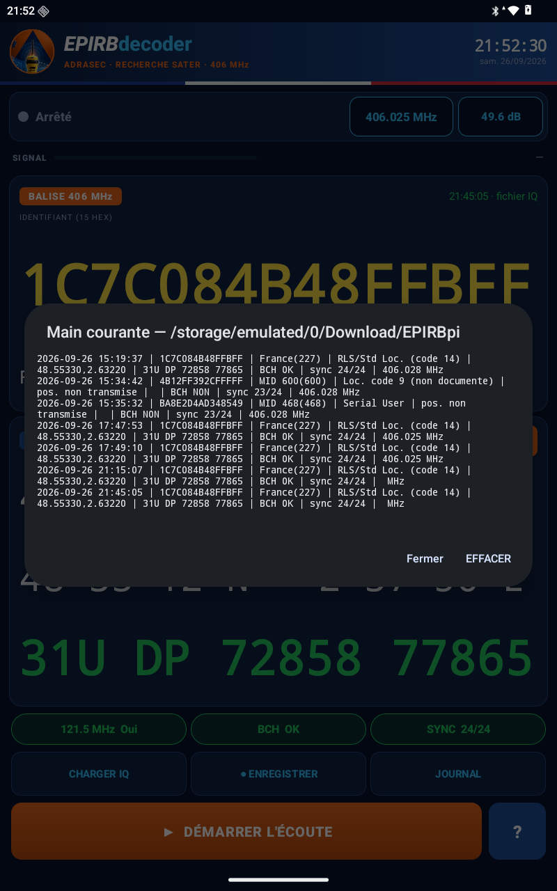
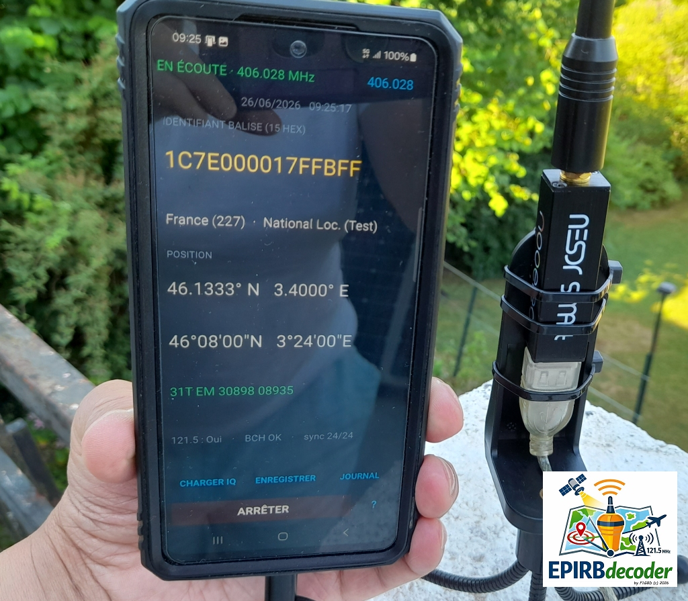
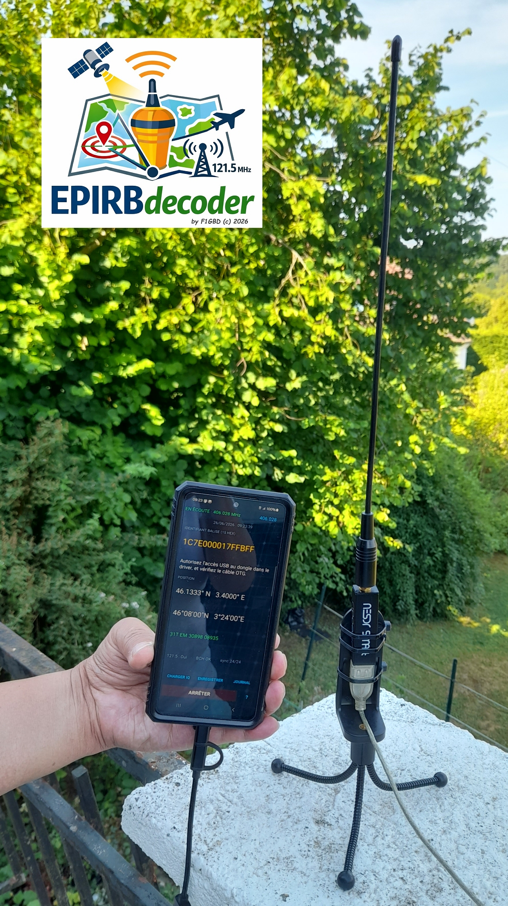
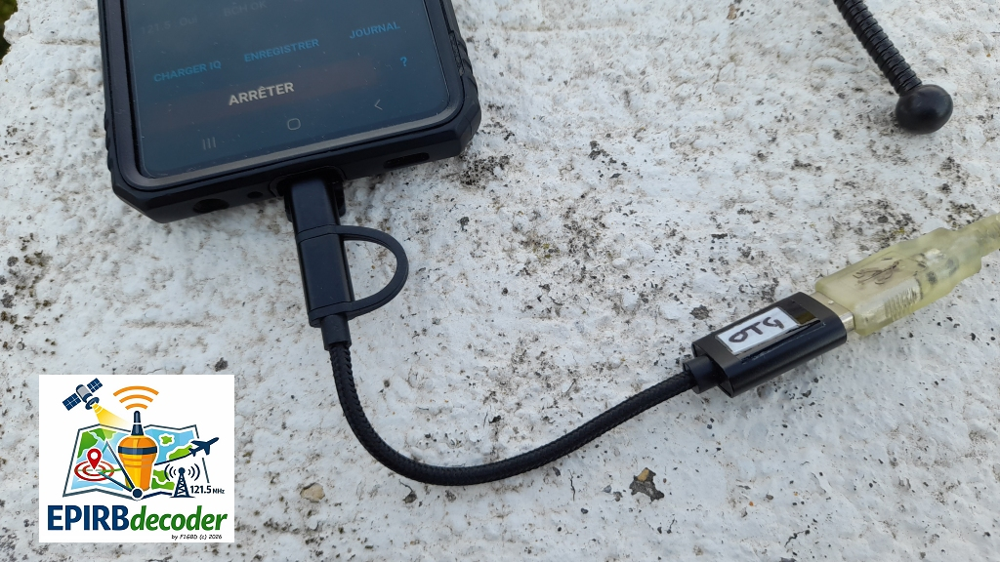
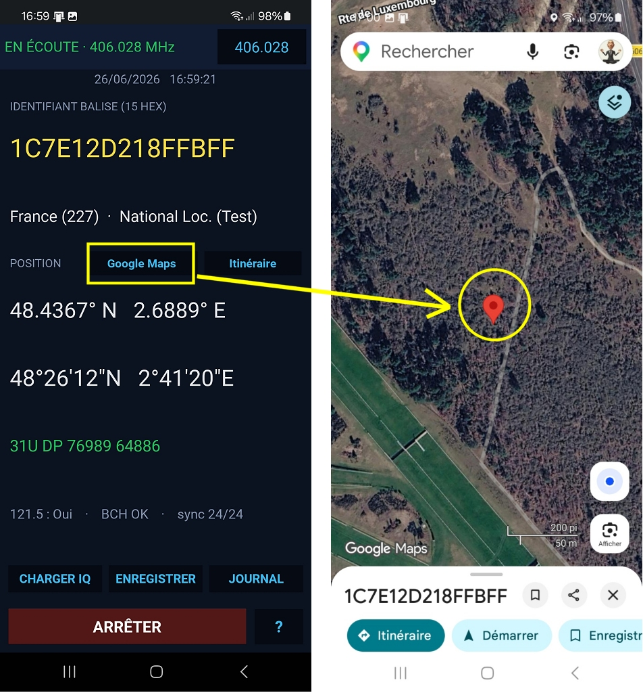

<p align="center">
  
</p>

<h1 align="center">EPIRBdecoder — Android</h1>

<p align="center">
  <b>Décodeur de balises de détresse 406 MHz (COSPAS-SARSAT) sur tablette et smartphone Android</b><br>
  Réception directe par clé RTL-SDR en USB-OTG · décodage sur l'appareil, sans réseau<br>
  <i>F1GBD · ADRASEC 77 · FNRASEC — au service des recherches SATER</i>
</p>

<p align="center">
  <a href="https://github.com/f1gbd/F1GBD/releases/download/epirb-android-v0.3.0/EPIRBdecoder_android-0.3.0.apk"></a>
  &nbsp;
  <a href="https://github.com/f1gbd/F1GBD/releases?q=epirb-android"></a>
</p>

<p align="center">
  
  
  
  
</p>

> [!WARNING]
> **Vous avez déjà l'ancienne v0.1 « EPIRBpi-decoder-lite » ?** Désinstallez-la **avant** d'installer cette version.
> Sinon Android refuse l'installation avec le message *« L'application n'a pas été installée, car le package semble ne pas être valide »* : l'APK n'est pas en cause, c'est l'ancienne version qui bloque (numéro de version et signature différents).
> Votre main courante (`Téléchargements/EPIRBpi`) est conservée.

---

## ⬇ Téléchargement et installation rapide

| | |
|---|---|
| **APK** | [`EPIRBdecoder_android-0.3.0.apk`](https://github.com/f1gbd/F1GBD/releases/download/epirb-android-v0.3.0/EPIRBdecoder_android-0.3.0.apk) (release [`epirb-android-v0.3.0`](https://github.com/f1gbd/F1GBD/releases/tag/epirb-android-v0.3.0)) |
| **Appareil** | Android 7.0 ou plus, processeur 64 bits (arm64-v8a), port USB avec mode **hôte (OTG)** |
| **Driver SDR** | « **SDR Driver** » de Martin Marinov — [Google Play](https://play.google.com/store/apps/details?id=marto.rtl_tcp_andro) · [F-Droid](https://f-droid.org/packages/marto.rtl_tcp_andro/) |
| **Documentation** | 📘 [Manuel utilisateur (PDF)](documentation/MEMO%20-%20MANUEL_EPIRBdecoder-android.pdf) · 📄 [Fiche technique (PDF)](documentation/MEMO%20-%20FICHE-TECHNIQUE_EPIRBdecoder-android.pdf) |

1. Installez le **SDR Driver** (Play Store ou F-Droid).
2. Téléchargez l'APK depuis le téléphone ou la tablette, ouvrez-le et autorisez l'installation depuis cette source.
3. Au premier lancement, acceptez **« Accès à tous les fichiers »** : la main courante et les captures IQ seront rangées dans `Téléchargements/EPIRBpi`.
4. Branchez la clé RTL-SDR par un câble **OTG**, appuyez sur **▶ DÉMARRER L'ÉCOUTE** et autorisez l'accès USB demandé par le driver.

> **Mise à jour** : depuis la v0.2.0, chaque nouvelle version s'installe **par-dessus** (réglages et main courante conservés). Le bouton **?** → **🔄 Vérifier les mises à jour** indique si une version plus récente est publiée et propose de la télécharger.

<p align="center">
  <br>
  <sub>Bouton <b>?</b> → fenêtre <b>À propos</b> → <b>🔄 Vérifier les mises à jour</b></sub>
</p>
>
> **Venant de la v0.1.0** (EPIRBpi-decoder-lite, version Kivy) : ⚠️ **désinstallez-la d'abord** (voir l'avertissement en haut de page). La main courante de `Téléchargements/EPIRBpi` n'est pas effacée.

---

## Aperçu

<table>
  <tr>
    <td align="center" width="33%"></td>
    <td align="center" width="33%"></td>
    <td align="center" width="33%"></td>
  </tr>
  <tr>
    <td align="center"><b>Balise décodée</b><br><sub>Identifiant 15 HEX, pays, protocole, position décimale / DMS / MGRS, pastilles 121.5 · BCH · SYNC</sub></td>
    <td align="center"><b>Carte</b><br><sub>Position de la balise ouverte dans Google Maps, itinéraire routier en un geste</sub></td>
    <td align="center"><b>Main courante</b><br><sub>Journal horodaté de chaque balise décodée (TXT + CSV) dans Téléchargements/EPIRBpi</sub></td>
  </tr>
</table>

---

## Sommaire

- [Aperçu](#aperçu)
- [Présentation](#présentation)
- [Fonctionnalités](#fonctionnalités)
- [Spécifications techniques](#spécifications-techniques)
- [Matériel requis](#matériel-requis)
- [Utilisation](#utilisation)
- [Lecture de l'écran](#lecture-de-lécran)
- [Réglage du gain et diagnostic de réception](#réglage-du-gain-et-diagnostic-de-réception)
- [Captures IQ et échantillons de test](#captures-iq-et-échantillons-de-test)
- [Main courante et fichiers](#main-courante-et-fichiers)
- [Permissions](#permissions)
- [Captures terrain](#captures-terrain)
- [Historique des versions](#historique-des-versions)
- [Documentation](#documentation)
- [Crédits](#crédits)

---

## Présentation

**EPIRBdecoder Android** transforme une tablette ou un smartphone en **poste de
réception et de décodage des balises de détresse 406 MHz** pour les équipes
ADRASEC engagées en **recherche SATER** (sauvetage aéroterrestre) et lors des
exercices FNRASEC.

Une simple clé **RTL-SDR** reliée en **USB-OTG** suffit : l'application capte les
bursts de la balise (EPIRB maritime, ELT aéronautique, PLB personnelle), les
**décode entièrement sur l'appareil** — sans réseau, sans serveur — et affiche
immédiatement l'**identifiant**, le **pays**, le **protocole** et la
**position transmise** (décimale, DMS et **MGRS** pour la carto opérationnelle),
avec ouverture directe dans **Google Maps** ou **navigation routière** vers la
balise.

Le moteur de décodage est **celui de la version PC EPIRBdecoder v5.20**
(récepteur MLSE, contrôles BCH, conversion MGRS), embarqué tel quel : un burst
décodé sur Android donne exactement le même résultat que sur le PC.

---

## Fonctionnalités

### Réception
- Réception **directe RTL-SDR** en USB-OTG via le serveur `rtl_tcp` du SDR Driver (lancé automatiquement).
- **Canaux 406 MHz** : 406.022 · 406.025 · 406.028 · 406.031 · 406.037 · 406.040 MHz, et **fréquences de test** 434.000 / 434.275 MHz.
- **Gain RF manuel** réglable (20,7 à 49,6 dB) ou automatique ; fréquence et gain **mémorisés**.
- **Détection automatique des bursts** et décodage sans intervention.
- **Indicateur SIGNAL** : puissance brute (dBFS), rapport signal/bruit dans le canal de la balise, **alerte SATURATION**.

### Décodage et affichage
- **Identifiant 15 HEX**, **pays** (MID), **protocole** (User, Standard / National Location, RLS…).
- **Position** : décimale, **DMS**, **MGRS** (y compris les offsets fins du protocole Standard Location).
- **Contrôles BCH-1 / BCH-2**, **synchronisation** (x/24), présence du **homing 121.5 MHz**.
- **Filtrage des fausses trames** : seule une trame avec **BCH-1 valide** est affichée et journalisée.
- **Tonalité d'alerte** à chaque balise décodée ; écran maintenu allumé pendant l'écoute.

### Terrain
- **Carte** : ouvre la position de la balise dans Google Maps (repli : autre appli de cartographie, puis navigateur).
- **Itinéraire** : navigation routière guidée jusqu'à la balise.
- **Main courante** automatique (**CSV** et **TXT**) : date, heure, identifiant, pays, protocole, position, MGRS, BCH, synchro, fréquence.
- **Enregistrement IQ** des bursts reçus (rejouables sur Android et sur le PC).
- **Chargement de captures IQ** `.npy` (PC ou Android) : entraînement et exercices sans balise ni dongle.

### Application
- Interface **Sécurité Civile** : cartes BALISE / POSITION, pastilles d'état colorées, lisible en extérieur, tailles de caractères **auto-ajustées** (téléphone comme tablette).
- **Écran de lancement** EPIRBdecoder.
- **À propos** : versions des composants et **🔄 Vérifier les mises à jour** (releases GitHub `epirb-android-v…`, téléchargement proposé).

---

## Spécifications techniques

| Élément | Valeur |
|---|---|
| Signal traité | Balises COSPAS-SARSAT 1ʳᵉ génération, 406 MHz, biphase-L 400 bit/s, PSK ±1,1 rad |
| Trames | Messages de 144 bits (formats court et long), synchro normale et auto-test |
| Échantillonnage dongle | 250 kéch/s, IQ 8 bits (`rtl_tcp`) |
| Accord | Oscillateur local **40 kHz sous la fréquence de la balise** (la balise n'est plus superposée au pic DC du RTL2832) |
| Gain | Manuel, **49,6 dB par défaut** ; AGC numérique RTL2832 **désactivée** |
| Canalisation | Retrait DC, transposition, filtre FIR ±10 kHz, décimation à **62,5 kéch/s** |
| Détection de burst | Puissance dans le canal, seuil **+6 dB** au-dessus du plancher de bruit suivi en continu (blocs de 100 ms) |
| Démodulation | Récepteur **MLSE** NumPy (horloge calée sur les transitions Manchester), filtres de phase **5 / 3,5 / 2,5 kHz** essayés tant que BCH-1 échoue |
| Validation | **BCH-1** obligatoire (trame rejetée sinon), BCH-2 affiché |
| Doublons | Même balise re-décodée en moins de 8 s : non rejournalisée |
| Décodeur | Moteur **EPIRBdecoder PC v5.20** (BeaconDecoder, BCH, MGRS), embarqué à l'identique |
| Captures IQ | NumPy `.npy` complex64 + `.txt` descriptif (`center_freq_hz`, `sample_rate_hz`, …) — format identique au PC |
| Fonctionnement | 100 % local : aucune connexion réseau requise (sauf « Vérifier les mises à jour ») |
| Système | Android 7.0+ (API 24), arm64-v8a ; application Kotlin, traitement Python 3.13 + NumPy embarqués |

Validation : captures IQ réelles d'une balise d'exercice ADRASEC 77 (NESDR v5,
26/09/2026) rejouées à travers un serveur `rtl_tcp` simulé : décodage à chaque
burst (BCH OK, sync 24/24) ; avec bruit ajouté, la balise reste décodée ~5 dB
plus bas qu'avec la v0.1.

---

## Matériel requis

- Clé **RTL-SDR** (RTL2832U + R820T/R828D) : NooElec NESDR v5, RTL-SDR Blog V3/V4, ou clé DVB-T compatible.
- Tablette ou smartphone Android avec **USB hôte (OTG)**.
- **Câble / adaptateur OTG** adapté au connecteur de l'appareil (voir `images/OTGcable.jpg`).
- **Antenne 406 MHz** : dipôle, Yagi directive pour la goniométrie, ou antenne large bande.

---

## Utilisation

| Commande | Rôle |
|---|---|
| **Fréquence** (bandeau) | Choix du canal 406 MHz ou de test. Réglable pendant l'écoute. |
| **Gain** (bandeau) | Gain RF manuel ou auto. Réglable pendant l'écoute. |
| **▶ DÉMARRER L'ÉCOUTE** | Lance le SDR Driver (accès USB au dongle), puis l'écoute ; **■ ARRÊTER L'ÉCOUTE** pour stopper. |
| **CHARGER IQ** | Décode une capture `.npy` (sélectionnez aussi son `.txt` si possible). Fonctionne sans dongle. |
| **● ENREGISTRER** | Sauve chaque burst reçu en capture IQ (**REC ON** en rouge quand actif). |
| **JOURNAL** | Affiche la main courante, avec effacement confirmé. |
| **Carte / Itinéraire** | Position de la balise dans Google Maps / navigation vers la balise (actifs dès qu'une position est décodée). |
| **?** | À propos : versions, crédits, **🔄 Vérifier les mises à jour**. |

---

## Lecture de l'écran

- **Bandeau** : emblème, heure et date.
- **Poste** : voyant d'état (gris = arrêté, orange = attente / burst, vert = écoute / balise décodée, rouge = erreur), statut, fréquence et gain.
- **SIGNAL** : barre du S/B dans le canal (verte au-delà de +6 dB), niveau brut en dBFS, **SATURATION** en rouge.
- **Carte BALISE** : heure et source du dernier décodage (réception ou fichier IQ, fréquence), identifiant 15 HEX, pays et protocole.
- **Carte POSITION** : coordonnées décimales, DMS et **MGRS** (vert), boutons Carte et Itinéraire.
- **Pastilles** : `121.5 MHz` (homing), `BCH` (OK en vert), `SYNC` (x/24).

---

## Réglage du gain et diagnostic de réception

| Ce que montre la ligne SIGNAL | Signification / action |
|---|---|
| Le S/B monte à chaque burst (toutes les ~50 s) et la balise s'affiche | Réception correcte. |
| Le S/B monte mais le statut indique **« Burst reçu — BCH invalide »** | Signal trop faible ou brouillé : orienter / changer l'antenne, se rapprocher. |
| **SATURATION** en rouge | Gain trop fort (balise proche) : baisser le gain (ex. 37,2 dB). |
| Rien ne bouge jamais | Vérifier le SDR Driver (accès USB accordé), le câble OTG, l'alimentation USB, la fréquence. |
| « Driver SDR introuvable » | Installer le SDR Driver de M. Marinov. |
| « Serveur rtl_tcp non démarré » | Accès USB refusé ou dongle déjà utilisé par une autre application. |
| « Le package semble ne pas être valide » à l'installation | L'ancienne v0.1 EPIRBpi-decoder-lite est encore installée : la désinstaller, puis relancer l'installation. |

Astuce : activez **● ENREGISTRER** pendant les essais ; les captures permettent
d'analyser a posteriori ce que l'appareil a réellement reçu.

---

## Captures IQ et échantillons de test

Des captures réelles de balises 406 MHz sont fournies dans
**[`406_samples/`](406_samples/)** pour tester le décodage **sans dongle** :

1. Copiez un `.npy` et son `.txt` de `406_samples/` sur l'appareil (ex. dans `Téléchargements`).
2. **CHARGER IQ** → sélectionnez le `.npy` (et le `.txt`).

Formats acceptés :
- captures du **PC** EPIRBdecoder (« Capturer IQ → fichier », 250 kéch/s) ;
- captures **Android** (`capture_<fréquence>_62500Hz_<horodatage>.npy`, bande de base 62,5 kéch/s) — la fréquence d'échantillonnage est lue dans le `.txt` ou, à défaut, dans le nom du fichier ;
- les captures Android se relisent aussi sur le PC (« Décoder IQ brut (MLSE) »).

---

## Main courante et fichiers

Avec l'accès à tous les fichiers accordé, tout est rangé dans
**`Téléchargements/EPIRBpi/`** (sinon dans le dossier de l'application,
`Android/data/fr.adrasec77.epirbpilite/files/EPIRBpi/`) :

| Fichier | Contenu |
|---|---|
| `main_courante.csv` | Journal tabulé, séparateur `;` (Excel / LibreOffice) |
| `main_courante.txt` | Journal lisible |
| `capture_<freq>_62500Hz_<date>.npy` + `.txt` | Bursts enregistrés (IQ complex64 + descriptif) |

Exemple de ligne de main courante :

```
2026-09-26 17:49:10 | 1C7C084B48FFBFF | France(227) | RLS/Std Loc. (code 14) | 48.55330,2.63220 | 31U DP 72858 77865 | BCH OK | sync 24/24 | 406.028 MHz
```

---

## Permissions

| Permission | Usage |
|---|---|
| Internet | Connexion au serveur `rtl_tcp` **local** du SDR Driver (127.0.0.1) ; vérification des mises à jour à la demande |
| Accès à tous les fichiers | Main courante et captures dans `Téléchargements/EPIRBpi` (facultatif) |
| Maintien de l'écran | Écoute prolongée |

Le dongle USB est ouvert par le SDR Driver, pas par l'application. Aucune donnée n'est transmise à l'extérieur.

---

## Captures terrain

<p align="center">
  
</p>

<p align="center">
  
  &nbsp;
  
</p>

<p align="center">
  
</p>


---

## Historique des versions

| Version | Date | Principales évolutions |
|---|---|---|
| **0.3.0** | 09/2026 | Interface **Sécurité Civile** (cartes BALISE / POSITION, pastilles d'état), écran de lancement, **Vérifier les mises à jour** dans À propos |
| **0.2.0** | 09/2026 | **Réception SDR corrigée** (gain manuel, AGC coupée, accord décalé, canal étroit, MLSE multi-filtre, filtrage BCH-1), mise en page tablette, moteur PC v5.20, application Kotlin + Python |
| 0.1.0 | 06/2026 | Première version (EPIRBpi-decoder-lite, Kivy) |

---

## Documentation

| Document | Contenu |
|---|---|
| 📘 [Manuel utilisateur](documentation/MEMO%20-%20MANUEL_EPIRBdecoder-android.pdf) | Installation du driver et de l'application, description de l'écran, réception, réglage du gain, carte et itinéraire, captures IQ, main courante, mise à jour, test sans antenne, dépannage |
| 📄 [Fiche technique](documentation/MEMO%20-%20FICHE-TECHNIQUE_EPIRBdecoder-android.pdf) | Identification, architecture, matériel, chaîne de réception SDR, spécifications de décodage, fichiers produits, sécurité, validation, limites |

Anciennes versions (v0.1, EPIRBpi-decoder-lite) : [`documentation/v0.1/`](documentation/v0.1/).

---

## Crédits

Développé par **Jean-Louis NAUDIN — F1GBD / F4JHW** pour l'**ADRASEC 77** et la **FNRASEC**,
au service des recherches SATER de la Sécurité Civile.

- Driver RTL-SDR : *SDR Driver* de **Martin Marinov** (`marto.rtl_tcp_andro`, open source).
- Spécifications des balises : documents **COSPAS-SARSAT** C/S T.001.

© 2026 F1GBD — ADRASEC 77 / FNRASEC.
