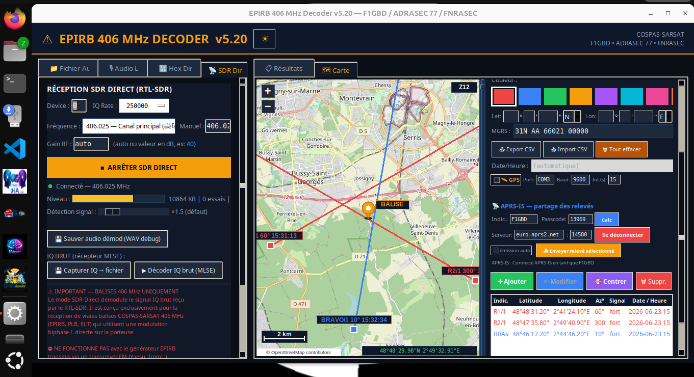

<div align="center">
  
</div>

# EPIRB 406 MHz Decoder pour Linux

**Décodeur de balises de détresse COSPAS-SARSAT 406 MHz**

*Version 5.20.0 Linux — par F1GBD / ADRASEC 77 / FNRASEC*

[]()
[]()
[]()
[]()

---

## 🎯 Qu'est-ce qu'EPIRBdecoder ?

**EPIRBdecoder** décode les balises de détresse **COSPAS-SARSAT 406 MHz** (EPIRB maritimes, ELT aéronautiques, PLB personnelles) à partir d'une clé **RTL-SDR**, d'une **entrée audio**, ou d'un **fichier**. Il extrait l'identifiant de la balise, le pays, le protocole et la position GPS encodée, puis affiche le tout sur une **carte OSM** avec relèvements goniométriques pour la triangulation.

Cette version Linux est la **transposition fidèle** de la version Windows. **Aucune dépendance Python à installer** : le binaire embarque tout (Python 3.12 + numpy + scipy + Tkinter + Pillow + PortAudio + la bibliothèque RTL-SDR) via PyInstaller.

### Cas d'usage typiques

- 🚨 **Exercices SATER** et recherche de balises de détresse ADRASEC
- 📡 **Réception temps réel** via RTL-SDR (SDR Direct, décodage IQ brut MLSE)
- 🧭 **Goniométrie et triangulation ELT** (carte OSM, cercle CEP 95 %)
- 🔬 **Analyse de balises réelles** ou de fichiers WAV d'enregistrement
- 📄 **Génération de SITREP SATER PDF**
- 🛰️ **Partage de relèvements** via APRS-IS avec l'application Android SATERfinder

<div align="center">
  
</div>

---

## ⭐ Fonctionnalités principales

- **4 modes de réception** : SDR Direct (RTL-SDR), Audio Live (micro/ligne), Fichier audio (WAV, M4A, MP3, OGG, FLAC) et Hex Direct (saisie de trame)
- **Décodage IQ brut MLSE** prioritaire en SDR Direct (repli automatique FM + biphase)
- **Codes protocole officiels C-S** (Standard Location 2-7 et 14, **National Location** 15)
- **Position à la résolution 4 secondes** (Standard et National via offset PDF-2)
- **Validation BCH-1 / BCH-2** sur chaque trame
- **Carte OSM interactive** avec relèvements goniométriques vectorisés et **triangulation ELT** (CEP 95 %)
- **Client APRS-IS** : échange des relèvements en temps réel avec SATERfinder Android (protocole `EPIRB-GONIO`)
- **SITREP SATER PDF** (logo ADRASEC, main courante, carte)
- **Coordonnées MGRS** bidirectionnelles, conversion DMS / décimal
- **Mode CLI** `--file … --json` pour décoder sans interface (scripts, intégration)
- **Configuration persistante** dans `decoder_setup.json`

---

## 🆕 Nouveautés v5.20

- **Décodage IQ brut (MLSE)** devenu le décodeur **prioritaire** du mode SDR Direct : à chaque burst, la trame n'est retenue que si BCH-1 est valide, sinon repli automatique sur la chaîne FM + biphase (aucune perte de réception)
- **Saisie manuelle de fréquence** en SDR Direct (champ MHz éditable + préréglages)
- **Support clé Nooelec RTL-SDR v5** (tuner R820T2, TCXO 0,5 ppm — idéal pour le 406 MHz)
- **Conformité protocole renforcée** : table des codes officiels COSPAS-SARSAT, protocole **National Location** (code 15), polynôme **BCH-1 corrigé** (validation conforme au système C-S)
- **Position décodée à 4 secondes** de résolution
- **Mode CLI JSON** (`--file <wav> --json`) : décodage sans GUI, sortie structurée sur stdout

---

## 📋 Pré-requis

### Système

- **Linux x86_64** : Ubuntu 24.04 LTS+, Linux Mint 22+, Fedora 39+, Debian 13+ (voir [Compatibilité](#-compatibilité-des-distributions))
- **Glibc 2.38+** (le binaire est compilé sur Ubuntu 24.04 LTS)
- **Tkinter** : embarqué dans le bundle, aucune installation requise
- **Serveur X11 ou Wayland** (avec XWayland — cas standard sur tous les bureaux Linux)

> ℹ️ Contrairement à d-IA, EPIRBdecoder **ne nécessite ni Ollama ni serveur externe** : c'est une application autonome.

### Clé RTL-SDR — pour le mode SDR Direct (optionnel)

- Dongle RTL-SDR à tuner **R820T2 / R828D** : **Nooelec RTL-SDR v5** (recommandé, TCXO), RTL-SDR Blog V3/V4, génériques RTL2832U
- La bibliothèque **librtlsdr est embarquée** dans le bundle (aucun paquet à installer)
- Il faut en revanche **neutraliser le pilote DVB-T du noyau** et autoriser l'accès au dongle (voir [Installation › RTL-SDR](#rtl-sdr--activation-du-dongle))

> Les modes **Audio Live** et **Fichier audio** fonctionnent **sans clé SDR**.

---

## 🚀 Installation

### Étape 1 — Téléchargement et vérification

```bash
# Téléchargement de l'archive et de sa somme de contrôle
wget https://github.com/f1gbd/F1GBD/releases/download/epirb-linux-v5.20.0/EPIRBdecoder-5.20.0-linux-x86_64.tar.gz
wget https://github.com/f1gbd/F1GBD/releases/download/epirb-linux-v5.20.0/EPIRBdecoder-linux-x86_64.tar.gz.sha256

# Vérification de l'intégrité (recommandée)
sha256sum -c EPIRBdecoder-linux-x86_64.tar.gz.sha256
# Doit afficher : EPIRBdecoder-5.20.0-linux-x86_64.tar.gz: OK
```

### Étape 2 — Extraction

```bash
tar xzf EPIRBdecoder-5.20.0-linux-x86_64.tar.gz
cd EPIRBdecoder-5.20.0-linux-x86_64
```

L'archive (≈ 117 Mo compressé, ≈ 291 Mo extrait) contient :

```
EPIRBdecoder-5.20.0-linux-x86_64/
├── EPIRBdecoder          Binaire principal (ELF 64-bit)
├── EPIRBdecoder.sh       Lanceur (règle l'environnement RTL-SDR / Tk / audio)
├── EPIRBdecoder.png      Icône de l'application (fenêtre + menu)
├── _internal/            Python 3.12 + numpy + scipy + Tk + PIL + librtlsdr…
├── install.sh            Script d'installation (utilisateur / système / désinstall)
├── EPIRBdecoder.desktop  Modèle d'entrée de menu
└── LISEZ-MOI.txt         Notice d'installation
```

> ⚠️ Lancez de préférence via **`EPIRBdecoder.sh`** (et non `EPIRBdecoder` directement) : le lanceur règle `LD_LIBRARY_PATH` pour que la bibliothèque RTL-SDR embarquée soit trouvée.

### Étape 3 — Choix du mode d'utilisation

Vous avez **trois options** au choix :

#### Option A — Lancement direct, sans rien installer

```bash
./EPIRBdecoder.sh
```

C'est la méthode la plus simple pour tester. Le binaire tourne depuis le dossier extrait, sans modifier votre système.

#### Option B — Installation utilisateur (recommandée)

```bash
./install.sh
```

EPIRBdecoder est installé dans `~/.local/share/EPIRBdecoder/`. Conséquences :

- Accessible via la commande **`epirbdecoder`** dans n'importe quel terminal
- Un raccourci apparaît dans le **menu Applications** (catégorie Radioamateur / Utilitaires)
- Pas de droits root nécessaires

> 💡 Si `~/.local/bin` n'est pas dans votre `$PATH`, le script vous le signale. Ajoutez alors à `~/.bashrc` ou `~/.zshrc` :
> ```bash
> export PATH="$HOME/.local/bin:$PATH"
> ```

#### Option C — Installation système (multi-utilisateurs)

```bash
sudo ./install.sh --system
```

EPIRBdecoder est installé dans `/opt/EPIRBdecoder/` et accessible à tous les utilisateurs. Adapté aux postes mutualisés, VM de formation ADRASEC ou serveurs partagés.

### RTL-SDR — activation du dongle

Pour le mode **SDR Direct**, deux réglages système sont nécessaires : neutraliser le pilote DVB-T du noyau et autoriser l'accès USB **sans root**. **`install.sh` s'en charge automatiquement** :

```bash
sudo ./install.sh --system     # installe l'application + configure le RTL-SDR
# ou, pour configurer le RTL-SDR seul (ex. après une installation utilisateur) :
sudo ./install.sh --rtlsdr
```

Cela écrit la règle udev `/etc/udev/rules.d/20-rtlsdr.rules` (accès au dongle, `MODE="0666"`) et le blacklist `/etc/modprobe.d/blacklist-rtlsdr.conf`. **Débranchez puis rebranchez** ensuite la clé. Si `lsusb` affiche un `idProduct` autre que `2832` / `2838` / `2839`, ajoutez-le dans la règle udev.

> Équivalent manuel, si vous préférez :
> ```bash
> echo 'blacklist dvb_usb_rtl28xxu' | sudo tee /etc/modprobe.d/blacklist-rtlsdr.conf
> sudo modprobe -r dvb_usb_rtl28xxu 2>/dev/null || true
> ```

### Désinstallation

```bash
# Installation utilisateur
./install.sh --uninstall

# Installation système
sudo ./install.sh --system --uninstall
```

---

## 📖 Utilisation

### Premier démarrage (interface graphique)

```bash
epirbdecoder        # si installé (Option B ou C)
./EPIRBdecoder.sh   # depuis le dossier extrait (Option A)
```

Pour décoder en **SDR Direct** :

1. Onglet **SDR Direct** → laisser `Device = 0`, `IQ Rate = 250000`
2. Choisir une **fréquence** (préréglage `406.025 — Canal principal`) ou la **saisir manuellement** (champ MHz), puis **Régler**
3. Régler le **Gain RF** (Auto, ou valeur fixe ex. 40 dB)
4. Cliquer **Démarrer SDR Direct** : à chaque burst 406, le **décodage MLSE** s'effectue automatiquement (statut « Décodé via MLSE (IQ brut) »)

Pour analyser un **enregistrement**, onglet **Fichier Audio** → choisir un WAV. Pour une **entrée micro/ligne**, onglet **Audio Live**.


### Où sont stockés les fichiers de configuration ?

EPIRBdecoder maintient ses fichiers (`decoder_setup.json`, cache de tuiles OSM) **à côté du binaire** :

| Mode | Emplacement de `decoder_setup.json` |
|---|---|
| Lancement direct (Option A) | `<dossier d'extraction>/decoder_setup.json` |
| Installation utilisateur (Option B) | `~/.local/share/EPIRBdecoder/decoder_setup.json` |
| Installation système (Option C) | `/opt/EPIRBdecoder/decoder_setup.json` ⚠️ droits root |

> ⚠️ En installation système (Option C), la configuration est partagée entre tous les utilisateurs. Pour des configurations individuelles, préférez l'Option B sur chaque compte.

---

## ⚠️ Notes Linux

| Fonctionnalité | Statut | Détail |
|---|---|---|
| SDR Direct (IQ brut MLSE) | ✅ | librtlsdr embarquée ; nécessite le blacklist DVB-T (voir Installation) |
| Audio Live / Fichier audio | ✅ | PortAudio embarqué |
| Carte OSM / triangulation | ✅ | Identique Windows (accès Internet requis pour les tuiles) |
| APRS-IS | ✅ | Identique Windows |
| SITREP SATER PDF | ✅ | Identique Windows |
| Décodage CLI `--json` | ✅ | Spécifique à cette version, pratique en script |

> **Robustesse RTL-SDR** : sous Linux, une `librtlsdr` système incompatible peut empêcher le chargement du pilote. Le décodeur le détecte désormais proprement et **désactive le SDR sans planter** ; les autres modes (Audio, Fichier, Hex) restent disponibles. La bibliothèque embarquée évite ce cas dans la majorité des installations.

---

## 🐧 Compatibilité des distributions

Le binaire est compilé sur **Ubuntu 24.04 LTS** (glibc 2.39, Python 3.12) et requiert **glibc ≥ 2.38**.

| Distribution | Statut | Notes |
|---|---|---|
| Ubuntu 24.04 LTS | ✅ Référence de build | Glibc 2.39 |
| Ubuntu 24.10 / 25.04 | ✅ | Glibc 2.40+ |
| Linux Mint 22 | ✅ | Basée sur Ubuntu 24.04 |
| Debian 13 (Trixie) | ✅ | Glibc 2.41 |
| Fedora 39 / 40+ | ✅ | Glibc 2.38 / 2.39 |
| Ubuntu 23.10 | ✅ | Glibc 2.38 (minimum requis) |
| Debian 12 (Bookworm) | ❌ | Glibc 2.36 trop ancienne |
| Ubuntu 22.04 LTS | ❌ | Glibc 2.35 trop ancienne |
| Linux Mint 21 | ❌ | Glibc 2.35 trop ancienne |
| Raspberry Pi OS | ❌ | Architecture ARM64, pas x86_64 |

> Pour les distributions à glibc < 2.38, exécutez depuis les sources Python ou recompilez le binaire sur la distribution cible.

---

## ❓ FAQ

### L'archive est extraite mais `./EPIRBdecoder.sh` ne se lance pas

Vérifier dans l'ordre :

1. Le bit exécutable est-il présent ?
   ```bash
   ls -la EPIRBdecoder EPIRBdecoder.sh   # doit afficher -rwxr-xr-x
   chmod +x EPIRBdecoder EPIRBdecoder.sh
   ```
2. Lancer depuis un terminal pour voir le message d'erreur, et vérifier la glibc :
   ```bash
   ldd --version | head -1   # doit afficher 2.38 ou supérieur
   ```

### Erreur au lancement : « NumPy was built with baseline optimizations (X86_V2) »

Ce message apparaît si le binaire a été compilé avec NumPy 2.x (baseline **x86-64-v2**) et que le **CPU n'expose pas** ces instructions — typiquement une **machine virtuelle** au modèle de processeur générique (`qemu64`) ou un CPU ancien. Cette édition est compilée avec **NumPy 1.26 (baseline x86-64-v1)** et tourne sur tout processeur x86-64, VM comprises. Si vous rencontrez encore ce message :

- Vérifiez que vous utilisez bien la dernière archive `EPIRBdecoder-5.20.0-linux-x86_64.tar.gz`
- Sur une VM (VirtualBox, QEMU/KVM, VMware), vous pouvez aussi activer le **passage du CPU hôte** (« host-passthrough » / « Copier la configuration du processeur hôte ») pour exposer toutes les instructions

### La clé RTL-SDR n'est pas détectée

1. Le pilote DVB-T est-il neutralisé ? (voir [Installation › RTL-SDR](#rtl-sdr--activation-du-dongle))
2. Tester l'accès : `lsusb | grep -i RTL` doit lister le dongle (`Realtek … RTL2838`)
3. Accès non-root : `sudo ./install.sh --rtlsdr`, puis rebrancher la clé
4. Lancer **via `EPIRBdecoder.sh`** (et non le binaire directement) pour que la librtlsdr embarquée soit trouvée

### Erreur « LIBUSB_ERROR_ACCESS (-3) : Access denied » à l'ouverture du SDR

La clé est détectée mais votre utilisateur n'a pas les **permissions USB** pour l'ouvrir (cas classique sous Linux, les périphériques USB appartiennent à root par défaut). Installez la règle udev :

```bash
sudo ./install.sh --rtlsdr
# puis DÉBRANCHEZ / REBRANCHEZ la clé et relancez EPIRBdecoder
```

> À distinguer de `LIBUSB_ERROR_BUSY (-6)` (« device busy ») : là, c'est le pilote DVB-T du noyau qui a saisi la clé — `install.sh --rtlsdr` pose aussi le blacklist qui corrige ce cas.

### Le mode IQ (MLSE) ne décode pas une trame émise en FM

C'est **normal** : le récepteur MLSE est conçu pour le signal **PSK** (modulation de phase ±1,1 rad) d'une vraie balise 406. Une trame du générateur **émise par un émetteur FM** est modulée en fréquence, pas en phase : le MLSE ne peut pas s'y verrouiller, mais le **repli FM + biphase** la décode. Pour valider spécifiquement le MLSE, il faut une source PSK (balise réelle).

### Quelles fréquences pour les exercices ?

Canal principal 406.025 MHz (préréglages 406.022 à 406.052 MHz). Fréquences test ADRASEC : 434.000 / 434.275 MHz (mode EXER).

### Puis-je récupérer ma configuration Windows ?

Oui. Le fichier `decoder_setup.json` est portable : copiez celui de Windows dans le dossier d'EPIRBdecoder Linux (voir le tableau des emplacements). Indicatif APRS-IS, serveur, préréglages et options sont conservés.

```bash
# Exemple (installation utilisateur)
cp /chemin/vers/windows/decoder_setup.json ~/.local/share/EPIRBdecoder/
```

---

## 🤝 Communauté

- **GitHub** : [github.com/f1gbd/F1GBD](https://github.com/f1gbd/F1GBD)
- **Auteur** : Jean-Louis (F1GBD) — [QRZ.com](https://qrz.com/db/F1GBD)
- **Affiliation** : ADRASEC 77 / FNRASEC

---

## 📜 Historique des versions

### v5.20.0-linux (juin 2026) — version actuelle

- **Première version officielle Linux** (x86_64), build autonome PyInstaller
- Décodage **IQ brut MLSE** prioritaire en SDR Direct (repli FM + biphase)
- **Saisie manuelle de fréquence** en SDR Direct
- Support clé **Nooelec RTL-SDR v5** ; librtlsdr + libusb embarquées
- Conformité protocole : codes officiels C-S, **National Location** (15), BCH-1 corrigé
- Position à la **résolution 4 secondes** (Standard et National)
- Mode CLI **`--file … --json`** (décodage sans interface)
- Robustesse : désactivation propre du SDR si librtlsdr incompatible
- Installeur 3 modes : utilisateur / `--system` / `--uninstall`, raccourci `.desktop`

### Versions Windows antérieures

- **v5.6.0** — Intégration APRS-IS (partage des relèvements avec SATERfinder Android)
- **v5.17** — Code protocole 14 reclassé en famille Standard Location
- **v5.15** — Découverte et support du protocole National Location
- **v5.12** — Correctif majeur du polynôme générateur BCH-1

---

*73 et bon trafic — Jean-Louis (F1GBD)*
