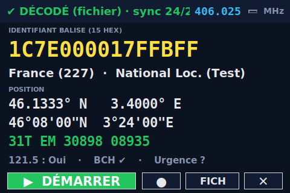

# EPIRBpi-decoder-lite — Décodeur balise 406 MHz pour Raspberry Pi
<div align="center">
  
</div>

<div align="center">
  
</div>

**Station de décodage COSPAS-SARSAT 406 MHz autonome, en mode kiosque plein écran, pour Raspberry Pi 5 + clé RTL-SDR + écran TFT.**

Édition allégée d'[EPIRBdecoder](https://github.com/f1gbd/F1GBD/tree/master/epirb) centrée sur l'essentiel terrain : **réception RTL-SDR temps réel** des balises de détresse 406 MHz, **relecture de fichiers IQ**, affichage gros caractères de l'**identifiant**, de la **position** (décimal / DMS / MGRS) et de la **validité BCH**.

*Projet ADRASEC 77 / FNRASEC — Jean-Louis (F1GBD).*

---

## Sommaire

- [Aperçu](#aperçu)
- [Matériel recommandé](#matériel-recommandé)
- [Installation complète depuis une carte SD](#installation-complète-depuis-une-carte-sd)
  - [Étape 1 — Préparer la carte SD avec Raspberry Pi Imager](#étape-1--préparer-la-carte-sd-avec-raspberry-pi-imager)
  - [Étape 2 — Premier démarrage](#étape-2--premier-démarrage)
  - [Étape 3 — Installer l'application](#étape-3--installer-lapplication)
  - [Étape 4 — Configurer la clé RTL-SDR](#étape-4--configurer-la-clé-rtl-sdr)
  - [Étape 5 — Lancement automatique au démarrage (kiosque)](#étape-5--lancement-automatique-au-démarrage-kiosque)
- [Utilisation](#utilisation)
- [Test immédiat sans antenne](#test-immédiat-sans-antenne)
- [Canaux 406 MHz configurables](#canaux-406-mhz-configurables)
- [Dépannage](#dépannage)
- [Compilation depuis les sources](#compilation-depuis-les-sources)
- [Licence et crédits](#licence-et-crédits)

---

## Aperçu

EPIRBpi-decoder-lite transforme un Raspberry Pi 5 et une clé RTL-SDR en **station de veille 406 MHz** à bas coût. L'interface, pensée pour un petit écran tactile, démarre en plein écran et affiche en grand :

- l'**identifiant balise** (15 caractères hexadécimaux) ;
- le **pays**, le **type** et le **protocole** ;
- la **position** en décimal, en **DMS** et en **MGRS** ;
- l'indicateur **121.5 MHz**, le **code d'urgence** et la **validation BCH-1 / BCH-2**.

Deux usages complémentaires :

- **Temps réel** : réception directe sur les canaux 406 MHz via la clé RTL-SDR.
- **Relecture** : ouverture de fichiers IQ `.npy` enregistrés (utile pour l'entraînement et la vérification, sans antenne).

L'application est livrée sous forme de **binaire autonome** : Python, numpy, scipy, Tkinter, Pillow et la bibliothèque RTL-SDR sont embarqués. **Rien à installer côté Python.**

---

## Matériel recommandé

| Élément | Détail |
|---|---|
| **Carte** | Raspberry Pi 5 (fonctionne sur tout Linux aarch64) |
| **OS** | **Raspberry Pi OS 64-bit** (Debian 13 « Trixie ») — **impératif 64 bits** |
| **Carte microSD** | 16 Go minimum (classe A1/A2 conseillée) |
| **SDR** | RTL-SDR Blog V3/V4, Nooelec RTL-SDR v5 (RTL2832U / RTL2838) |
| **Antenne** | Antenne 406 MHz (ou large bande UHF) |
| **Écran** | TFT ≈ 480×320 (s'adapte 5"/7"), ou tout écran HDMI |

> ⚠️ **OS 64 bits obligatoire.** Les images 32-bit et « Legacy 32-bit » ne sont **pas** compatibles. Dans Raspberry Pi Imager, choisissez **Raspberry Pi OS (64-bit)**.

---

## Installation complète depuis une carte SD

Cette procédure part d'une carte SD vierge et aboutit à un Pi qui **lance l'application tout seul au démarrage**.

### Étape 1 — Préparer la carte SD avec Raspberry Pi Imager

1. Sur un ordinateur, téléchargez et installez **Raspberry Pi Imager** depuis [raspberrypi.com/software](https://www.raspberrypi.com/software/).
2. Insérez la carte microSD (16 Go minimum).
3. Lancez Raspberry Pi Imager et renseignez :
   - **Appareil Raspberry Pi** : *Raspberry Pi 5*
   - **Système d'exploitation** : *Raspberry Pi OS (64-bit)* — celui marqué **« Recommended »**
     (⚠️ **pas** les versions 32-bit ni « Raspberry Pi OS (Legacy) »)
   - **Stockage** : votre carte microSD
4. Cliquez sur **Suivant**, puis sur **Modifier les réglages** (roue dentée) pour pré-configurer le Pi :
   - **Nom d'hôte** : par ex. `EPIRB406`
   - **Nom d'utilisateur et mot de passe** : créez votre compte (ex. `adrasec`)
   - **Wi-Fi** : SSID, mot de passe et **pays** (ou prévoyez un câble Ethernet)
   - **Localisation** : fuseau horaire et disposition du clavier (`fr`)
   - Onglet **Services** : cochez **Activer SSH** (pratique pour la suite)
5. **Enregistrez**, confirmez l'écriture (**Oui**), et attendez la fin de la gravure.
6. Retirez la carte et insérez-la dans le Raspberry Pi.

### Étape 2 — Premier démarrage

1. Branchez l'écran (HDMI ou TFT), le clavier/souris, la clé RTL-SDR avec son antenne, puis l'**alimentation**.
2. Au premier démarrage, Raspberry Pi OS finalise l'installation et ouvre le **bureau**.
3. Vérifiez l'accès à Internet (icône réseau).
4. Ouvrez un **terminal** (icône en haut de l'écran) et mettez le système à jour :

```bash
sudo apt update && sudo apt full-upgrade -y
```

> 💡 Vous pouvez aussi tout faire à distance en **SSH** depuis votre ordinateur :
> `ssh adrasec@EPIRB406.local` (adaptez le nom d'utilisateur et le nom d'hôte).

### Étape 3 — Installer l'application

Téléchargez l'archive `EPIRBpi-decoder-lite-X.Y.Z-linux-aarch64.tar.gz` depuis la page [Releases](https://github.com/f1gbd/F1GBD/releases) (tag `epirb-pi-lite-arm64-vX.Y.Z`), puis :

```bash
# 1. Télécharger et extraire (sur le Pi)
cd ~
wget https://github.com/f1gbd/F1GBD/releases/download/epirb-pi-lite-arm64-v5.20.0/EPIRBpi-decoder-lite-5.20.0-linux-aarch64.tar.gz
tar xzf EPIRBpi-decoder-lite-5.20.0-linux-aarch64.tar.gz
cd EPIRBpi-decoder-lite-5.20.0-linux-aarch64

# 2. (optionnel) Vérifier l'intégrité
sha256sum -c EPIRBpi-decoder-lite-linux-aarch64.tar.gz.sha256

# 3. Installer (système + configuration RTL-SDR) — recommandé
sudo ./install-lite.sh --system
```

Après installation :

- Menu **Applications → EPIRB 406 MHz Decoder**
- ou en terminal : `epirbpi-decoder-lite`

#### Variantes d'installation

| Commande | Effet |
|---|---|
| `sudo ./install-lite.sh --system` | Installe dans `/opt` + règles RTL-SDR (recommandé) |
| `./install-lite.sh` | Installe pour l'utilisateur courant (`~/.local`), sans root |
| `sudo ./install-lite.sh --rtlsdr` | (Re)configure l'accès RTL-SDR seul (règle udev) |
| `./install-lite.sh --uninstall` | Désinstalle |

#### Lancement sans installer

```bash
./EPIRBpi-decoder-lite.sh
```

> 💡 Lancez toujours via **`EPIRBpi-decoder-lite.sh`** (ou la commande/menu installé), **jamais** le binaire brut : le lanceur règle `LD_LIBRARY_PATH` pour que la librtlsdr embarquée soit trouvée.

### Étape 4 — Configurer la clé RTL-SDR

`sudo ./install-lite.sh --system` (ou `--rtlsdr`) :

- installe une **règle udev** qui donne l'accès non-root au dongle ;
- **blackliste** le pilote DVB-T du noyau (`dvb_usb_rtl28xxu`) qui sinon monopolise la clé.

> **Après cette étape, débranchez puis rebranchez la clé RTL-SDR** pour que les nouveaux droits s'appliquent.

Vérifier que la clé est vue :

```bash
lsusb | grep -i realtek
# ex. : Bus 001 Device 011: ID 0bda:2838 Realtek Semiconductor Corp. RTL2838 DVB-T
```

### Étape 5 — Lancement automatique au démarrage (kiosque)

Pour que le Pi **ouvre l'application tout seul** à chaque démarrage, utilisez le script
[`setup-autostart-lite.sh`](https://github.com/f1gbd/F1GBD/blob/master/epirb/raspberry/setup-autostart-lite.sh).
Il configure les deux mécanismes d'autostart de Raspberry Pi OS (Wayland/labwc **et** XDG), donc il fonctionne aussi bien sur Pi OS « Trixie » que sur les versions antérieures.

```bash
# Récupérer le script et le rendre exécutable
cd ~
wget https://raw.githubusercontent.com/f1gbd/F1GBD/master/epirb/raspberry/setup-autostart-lite.sh
chmod +x setup-autostart-lite.sh

# Activer le lancement automatique (en UTILISATEUR normal, PAS sudo)
./setup-autostart-lite.sh
```

> ⚠️ **À lancer sans `sudo`** : l'autostart est propre à votre session graphique. Le script s'en assure et détecte automatiquement le lanceur installé.

Le script vous rappelle ensuite **deux réglages indispensables** pour un vrai kiosque, via `raspi-config` :

1. **Démarrer sur le bureau avec connexion automatique**
   `sudo raspi-config` → **1 System Options** → **S5 Boot / Auto Login** → **Desktop Autologin**

2. **Désactiver la mise en veille de l'écran**
   `sudo raspi-config` → **2 Display Options** → **Screen Blanking** → **Disable**

Appliquez, puis redémarrez :

```bash
sudo reboot
```

Au redémarrage, l'application s'ouvre seule en plein écran (après un court délai laissé au bureau pour s'initialiser).

#### Gérer l'autostart

| Commande | Effet |
|---|---|
| `./setup-autostart-lite.sh` | Active le lancement automatique |
| `./setup-autostart-lite.sh status` | Affiche l'état (actif / inactif) |
| `./setup-autostart-lite.sh disable` | Désactive le lancement automatique |

---

## Utilisation

L'application démarre en **plein écran**. Barre de boutons en bas :

| Bouton | Rôle |
|---|---|
| **▶ DÉMARRER / ⏹ ARRÊTER** | Réception RTL-SDR temps réel |
| **●** | Enregistre l'IQ reçue vers un fichier (`~/EPIRB-IQ/`) |
| **FICH** | Rejoue un fichier IQ `.npy` |
| **✕** | Quitter |

Raccourcis clavier :

- **Échap** : bascule plein écran / fenêtré
- **Q** : quitter

Le **sélecteur de fréquence** (en haut à droite) permet de changer de canal 406 MHz.

---

## Test immédiat sans antenne

Un échantillon IQ de démonstration est fourni dans `samples/`.

1. Lancez l'application.
2. Cliquez **FICH**.
3. Ouvrez `samples/BALISE_MARITIME_clip_iq_406028_250k.npy`.

Décodage attendu :

```
1C7E000017FFBFF
France (227) · National Loc. (Test)
46.1333° N   3.4000° E
31T EM 30898 08935
121.5 : Oui · BCH ✔
```

---

## Canaux 406 MHz configurables

Au premier lancement, un fichier de configuration est créé :

```
~/.config/epirbpi-decoder-lite/config.ini
```

Section `[SDR]` :

```ini
[SDR]
# Canaux proposés dans le sélecteur (MHz), séparés par des virgules
channels = 406.025, 406.028, 406.037, 406.040
# Canal par défaut au démarrage
default = 406.025
# Débit d'échantillonnage (Hz)
sample_rate = 250000
# Gain ('auto' ou valeur en dB)
gain = auto
# Index du périphérique RTL-SDR
device = 0
```

---

## Dépannage

**« Module pyrtlsdr non disponible »**
La clé n'est pas accessible. Vérifiez `lsusb | grep -i realtek`, lancez `sudo ./install-lite.sh --rtlsdr`, puis **débranchez/rebranchez** la clé. Lancez via `EPIRBpi-decoder-lite.sh` (pas le binaire brut).

**`LIBUSB_ERROR_ACCESS` / `LIBUSB_ERROR_BUSY`**
Le pilote DVB-T tient la clé, ou les droits ne sont pas appliqués. Relancez `sudo ./install-lite.sh --rtlsdr` et rebranchez la clé. Assurez-vous qu'aucun autre logiciel SDR n'utilise le dongle.

**Le binaire ne démarre pas (`libpython…so cannot open`)**
Lancez via `EPIRBpi-decoder-lite.sh` et non le binaire brut. Si le souci persiste, c'est un paquet incomplet : recompilez (le script de build récent embarque et vérifie la bibliothèque Python).

**L'application ne se lance pas au démarrage**
Vérifiez l'état : `./setup-autostart-lite.sh status`. Assurez-vous que le Pi démarre bien sur le **bureau en connexion automatique** (`raspi-config` → System Options → Boot / Auto Login → Desktop Autologin), et que le script a été lancé **sans sudo**.

**La fenêtre dépasse de l'écran TFT**
Appuyez sur **Échap** pour passer en mode fenêtré.

---

## Compilation depuis les sources

Le code source (le moteur `EPIRB-decoder.py` et l'application lite) **n'est pas distribué** : seules les archives binaires sont publiées. La compilation se fait **sur le Raspberry Pi**, à l'aide du kit de build (réservé) qui contient `build-pi-lite.sh`.

En résumé, dans le dossier du kit (contenant `EPIRB-decoder.py` et les fichiers du kit) :

```bash
./build-pi-lite.sh
```

Le script :

- installe les dépendances système et Python ;
- compile le binaire autonome (PyInstaller, aarch64) ;
- **embarque et vérifie** la bibliothèque Python partagée, le module `rtlsdr`, `librtlsdr` et `libusb` (le build s'arrête si l'un manque) ;
- produit `dist_linux/EPIRBpi-decoder-lite-X.Y.Z-linux-aarch64.tar.gz` (+ `.sha256`).

C'est **cette archive** qui est publiée sur GitHub (script `Publish-EPIRBpiLiteRelease.ps1`).

---

## Licence et crédits

Développé pour la communauté **ADRASEC** et la **FNRASEC**, dans la continuité des outils TCQ, IAbrain, d-IA et PDFteleporter.

Autres plateformes : [Linux x86_64](https://github.com/f1gbd/F1GBD/tree/master/epirb/linux) · [Windows](https://github.com/f1gbd/F1GBD/tree/master/epirb).

*Jean-Louis (F1GBD) — ADRASEC 77 — FNRASEC — 73*
