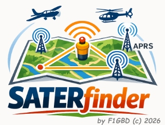
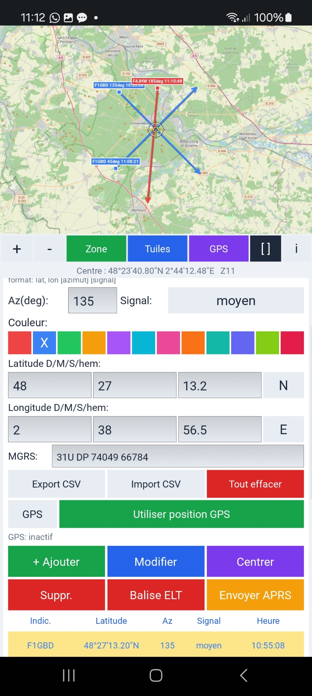
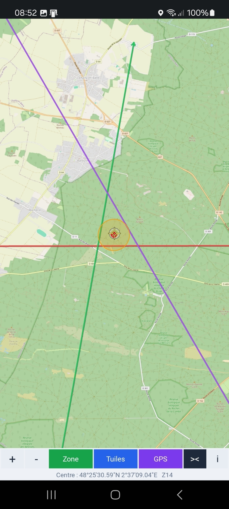
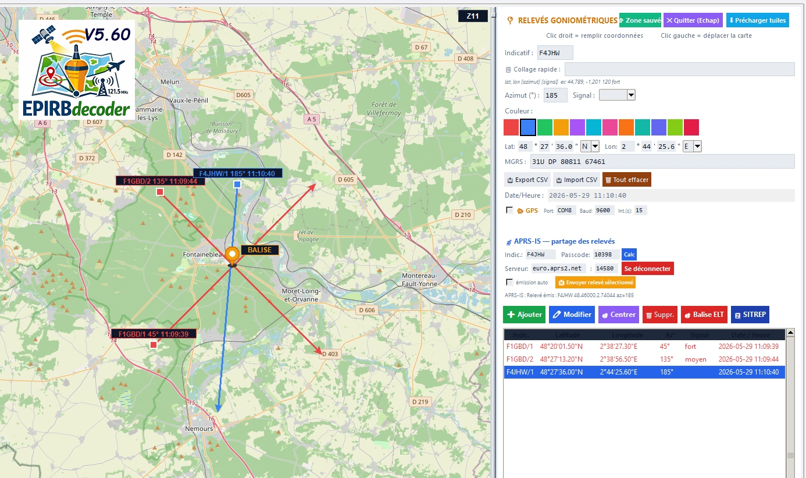
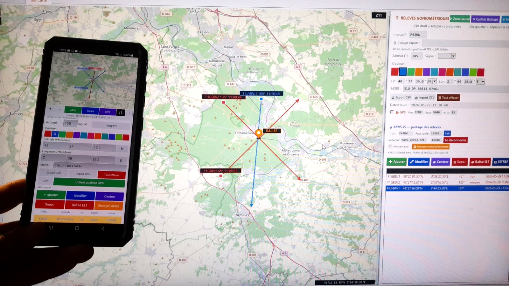

  

**Relevés goniométriques ELT et triangulation SAR sur Android**

*par F1GBD — ADRASEC 77 / FNRASEC*

# SATERfinder — Application Android
SATERfinder est la version Android de l'outil de relevés goniométriques
**EPIRBdecoder**, dédiée aux opérations de recherche **SATER** (sauvetage
aéro-terrestre) menées par l'ADRASEC. L'application permet de saisir des
relèvements depuis le terrain, de **trianguler la position d'une balise
ELT** (cercle CEP95), et de **partager les relèvements entre opérateurs via
APRS-IS** afin d'alimenter en temps réel la carte de chaque équipe sur
zone.

Elle remplace le GPS NMEA externe et le logiciel Windows par un seul outil
de poche utilisable directement par l'opérateur de bord ou le chef de
mission sur le terrain. SATERfinder est compatible avec la version PC
d'EPIRBdecoder pour l'échange APRS-IS.

  

---

## Téléchargement

L'application est distribuée sous forme de fichier **APK** (installation
directe, hors Google Play).

➡️ **[Télécharger la dernière version Android](https://github.com/f1gbd/F1GBD/releases/download/saterfinder-android-v1.0.0/SATERfinder.apk)**

> Le dépôt `f1gbd/F1GBD` héberge plusieurs projets (TCQ, IAbrain, d-IA,
> EPIRBdecoder…). Les versions **Android de SATERfinder** portent toutes
> un tag commençant par `saterfinder-android-` : le lien ci-dessus les
> filtre, et la plus récente est en haut. Téléchargez le fichier
> `SATERfinder.apk` de la release la plus récente.

| | |
|---|---|
| **Version** | 1.0 |
| **Taille** | ~30 Mo |
| **Android requis** | 7.0 (API 24) ou supérieur |
| **Architectures** | arm64-v8a, armeabi-v7a (tous smartphones modernes) |

---

## Installation

Comme l'application ne provient pas du Google Play Store, Android demande
une autorisation pour l'installer. C'est normal pour une application
distribuée directement.

1. **Téléchargez** le fichier `SATERfinder.apk` sur votre téléphone [**SATERfinder v1.0.0**](https://github.com/f1gbd/F1GBD/releases/download/saterfinder-android-v1.0.0/SATERfinder.apk)
  
2. **Ouvrez** le fichier téléchargé (via la notification de téléchargement
   ou un gestionnaire de fichiers).
3. Android affichera un avertissement *« sources inconnues »* : autorisez
   l'installation pour cette fois (ou pour votre navigateur / gestionnaire
   de fichiers).
4. Si **Google Play Protect** affiche *« Appli non sécurisée bloquée »* :
   touchez **« Plus de détails »** puis **« Installer quand même »**.
   Cet avertissement est habituel pour les applications hors Play Store ;
   l'application ne contient aucun code malveillant.
5. À la première ouverture, Android demandera la **permission de
   localisation** : acceptez-la — elle est indispensable au GPS interne.
6. L'icône **SATERfinder** apparaît dans votre tiroir d'applications.

---

## Première utilisation

L'application ne nécessite **aucun compte ni clé d'API** pour la
goniométrie et la triangulation : elle fonctionne immédiatement avec la
carte OpenStreetMap et le GPS du smartphone. Seul l'usage de la
fonctionnalité **APRS-IS** demande la saisie d'un passcode amateur (voir
plus bas).

### 1. Activer le GPS

Sur l'écran principal, touchez le bouton **GPS** sous la ligne « Utiliser
position GPS ». Le statut passe successivement à *« demande de
permission… »*, *« acquisition (LocationManager)… »*, puis affiche vos
coordonnées en DMS dès le premier fix. Le bouton **Centrer GPS** de la
barre d'outils carte recentre alors la carte sur votre position.

### 2. Poser un relevé

Trois méthodes équivalentes selon le contexte :

- **Appui long sur la carte** : remplit automatiquement les champs DMS et
  pose un marqueur d'aperçu à l'emplacement touché.
- **Collage rapide** : copiez une position depuis Google Maps (latitude,
  longitude) et touchez **Coller** ; le format `lat, lon [azimut] [signal]`
  est accepté (ex. `48.5638, 2.7383 90 fort`).
- **Saisie manuelle** des champs Latitude / Longitude en DMS.

Saisissez ensuite l'**indicatif** de la station, l'**azimut** (en degrés)
et la **force du signal** (faible / moyen / fort…), choisissez une
**couleur** pour identifier le relevé, puis touchez **+ Ajouter**. Le
vecteur de relèvement et l'étiquette apparaissent sur la carte ; la ligne
est ajoutée au tableau du panneau.

### 3. Trianguler la balise ELT

Une fois deux relevés ou plus avec azimut posés, touchez **Balise ELT**.
SATERfinder calcule la position estimée par moindres carrés avec rejet
d'outliers, et trace le **cercle CEP95** (rayon dans lequel se trouve la
balise avec 95 % de probabilité). Une fenêtre indique les coordonnées de
la balise estimée, le rayon CEP95 et le RMS résiduel.

  

### 4. Partager les relevés via APRS-IS (optionnel)

Faites défiler le panneau jusqu'à la section **APRS-IS**, renseignez votre
indicatif amateur, touchez **Calc** pour générer le passcode standard,
laissez le serveur par défaut `euro.aprs2.net` et touchez **Se connecter**.
Le statut passe à *« Connecté APRS-IS en tant que … »*. Vous pouvez alors :

- Touchez **Envoyer APRS** pour diffuser le relevé en cours sous deux
  formes : une **trame objet APRS positionnée** (visible sur aprs.fi) et
  un **message auto-descriptif** `EPIRB-GONIO` qui sera reconnu par les
  autres stations SATERfinder ou EPIRB-Light.
- Recevoir : tout relevé `EPIRB-GONIO` émis par une autre station équipe
  s'ajoute automatiquement à votre carte avec son vecteur de relèvement.

> Le passcode APRS-IS n'est nécessaire que pour **émettre** ; la réception
> seule fonctionne sans authentification.

  

  

---

## Disposition de l'écran

L'écran reproduit la carte de la version Windows :

| Zone | Contenu |
|---|---|
| **Carte OSM** (haut, ~55 %) | Tuiles OpenStreetMap, vecteurs de relèvement colorés par indicatif, étiquettes `INDIC AZ HH:MM:SS`, cercle CEP95, marqueurs balise / GPS / aperçu, mire SAR centrale |
| **Barre d'outils carte** | Zoom + / − · *Zone* (sauve la zone et le zoom) · *Tuiles* (précharge hors-ligne) · *GPS* (centre sur position) · `[ ]` (plein écran) · `i` (À propos) |
| **Panneau relevés** (bas, défilable) | Saisie complète (Indicatif, Collage, Azimut + Signal, Couleur, Lat/Lon DMS, MGRS), Export/Import CSV, ligne GPS, boutons d'action, tableau des relevés enregistrés |
| **Section APRS-IS** | Connexion serveur, passcode, journal des relèvements reçus |

Toucher une ligne du tableau remplit le formulaire avec ce relevé : on peut
alors **Modifier**, **Centrer** sur la carte ou **Suppr.** Le bouton plein
écran masque le panneau pour ne garder que la carte.

---

## Réglages disponibles

| Réglage | Description |
|---|---|
| Indicatif | Indicatif amateur ou nom de poste utilisé pour identifier les relevés |
| Serveur APRS-IS | Par défaut `euro.aprs2.net:14580` ; modifiable |
| Passcode APRS | Code numérique amateur (peut être calculé automatiquement) |
| Zoom et centre | *Zone sauvée* mémorise la zone d'opération pour les prochains lancements |
| Cache de tuiles | *Tuiles* précharge la zone visible pour usage hors-ligne |
| Export / Import CSV | Sauvegarde et restauration des relevés au format compatible EPIRBdecoder PC |

Les fichiers CSV sont enregistrés dans le dossier **Download** du
smartphone (`releves_gonio.csv`), récupérables par câble USB ou partage de
fichiers.

---

## Échange avec EPIRBdecoder PC

SATERfinder utilise le **même format CSV** et le **même protocole APRS**
(`EPIRB-GONIO`) que la version Windows EPIRBdecoder. Vous pouvez :

- Exporter un CSV depuis l'application Android et l'importer dans
  EPIRBdecoder PC pour traitement en arrière-base.
- Connecter EPIRBdecoder PC en **réception APRS-IS** pendant une opération
  pour voir en temps réel les relèvements émis par les équipes terrain
  équipées de SATERfinder.

---

## Permissions Android utilisées

L'application demande uniquement les permissions strictement nécessaires :

- **INTERNET** : téléchargement des tuiles OpenStreetMap et connexion
  APRS-IS.
- **ACCESS_FINE_LOCATION** + **ACCESS_COARSE_LOCATION** : GPS interne pour
  la position du véhicule.
- **WRITE / READ_EXTERNAL_STORAGE** : export et import des relevés au
  format CSV.

Aucune permission de stockage de contacts, de caméra, de microphone ni
d'accès aux SMS n'est demandée.

---

## Confidentialité

L'application ne transmet vos relevés qu'au serveur **APRS-IS** que vous
configurez, et uniquement si vous activez explicitement la connexion. Les
tuiles OSM sont téléchargées depuis `tile.openstreetmap.org`. Aucune
donnée n'est transmise à des tiers, aucun télémétrie / mouchard. Vos
réglages et le cache de tuiles sont stockés **localement** sur votre
téléphone, dans le dossier privé de l'application.

---

## Notes de version

### v1.0
- Carte OpenStreetMap avec cache hors-ligne
- Saisie de relevés en DMS, par collage Google Maps ou appui long sur la carte
- Triangulation ELT (moindres carrés + rejet MAD + CEP95)
- GPS interne du smartphone (LocationManager natif)
- Émission et réception de relevés via APRS-IS (`euro.aprs2.net`)
- Compatible EPIRB-Light / EPIRBdecoder PC (mêmes formats)
- Export / import CSV des relevés
- Mire SAR centrale, étiquettes `INDIC AZ HH:MM:SS`, mode plein écran
- Splash screen et icône SATERfinder

---

*SATERfinder — Outil opérationnel et de formation pour l'ADRASEC.*
*73 de F1GBD.*
