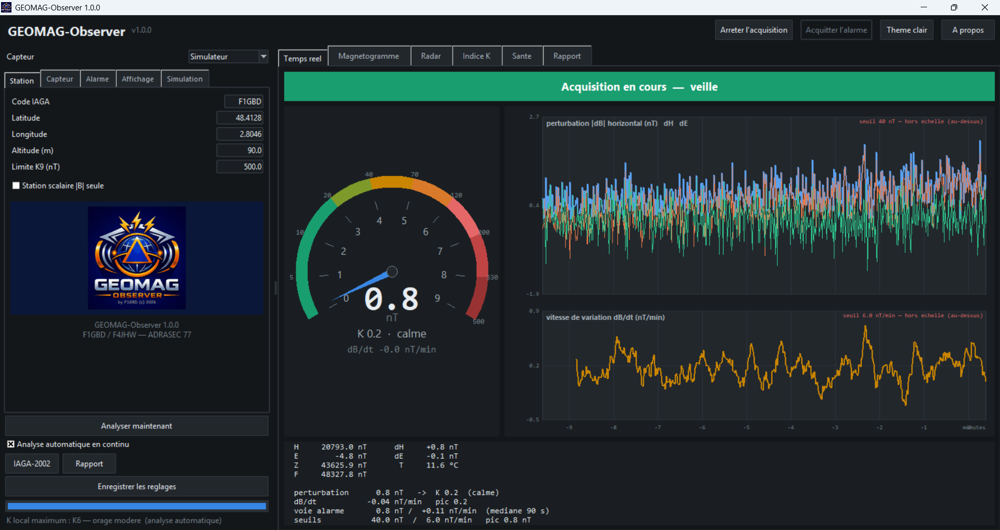
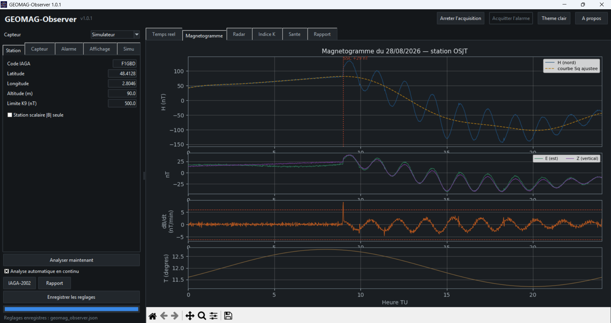
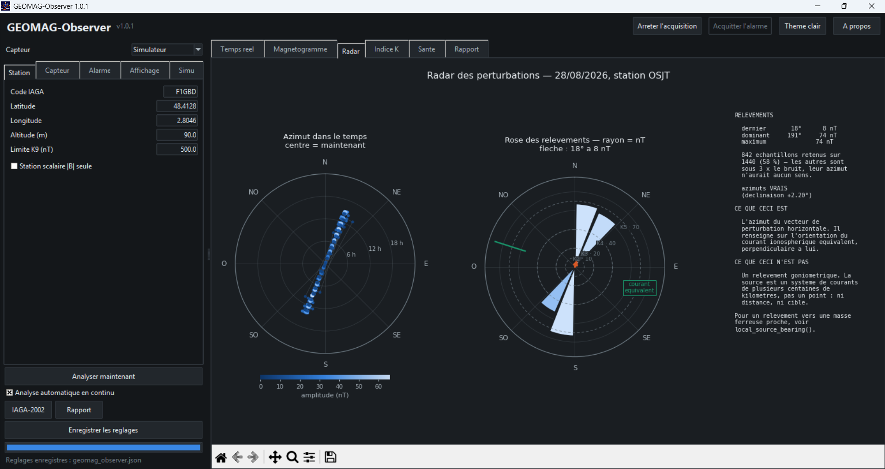
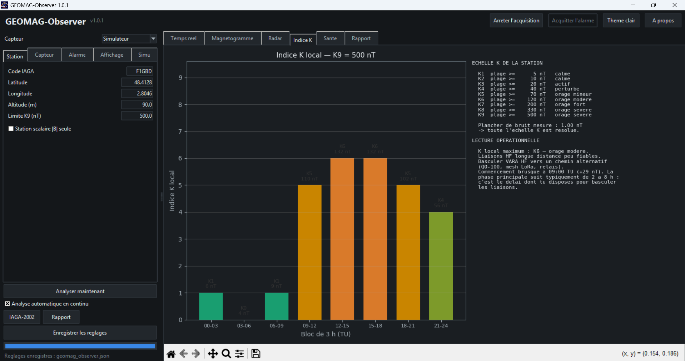
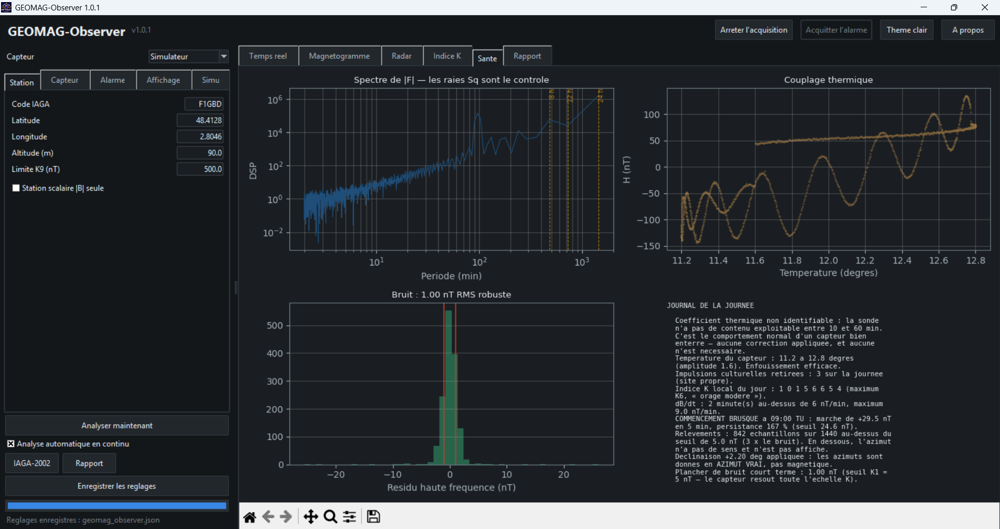
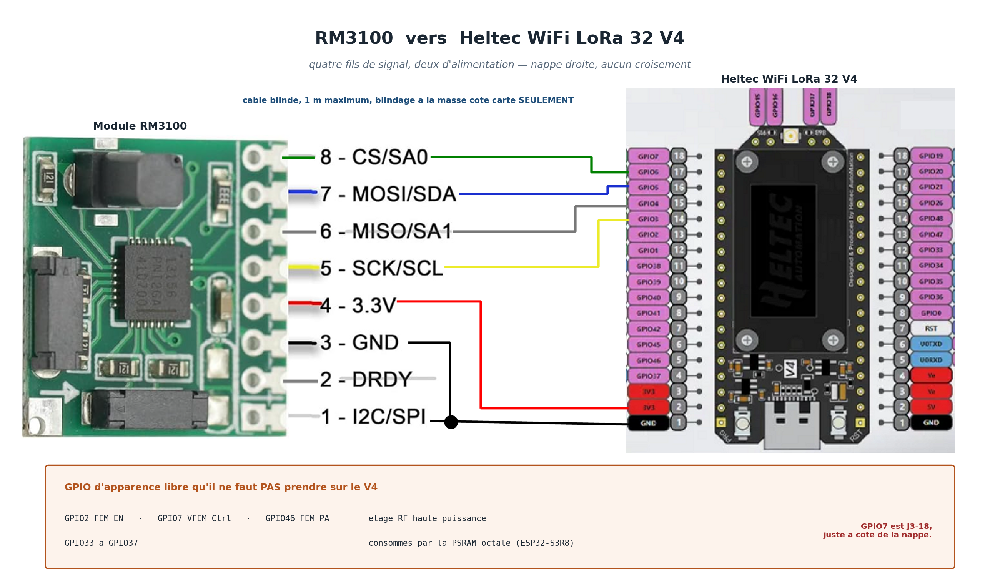
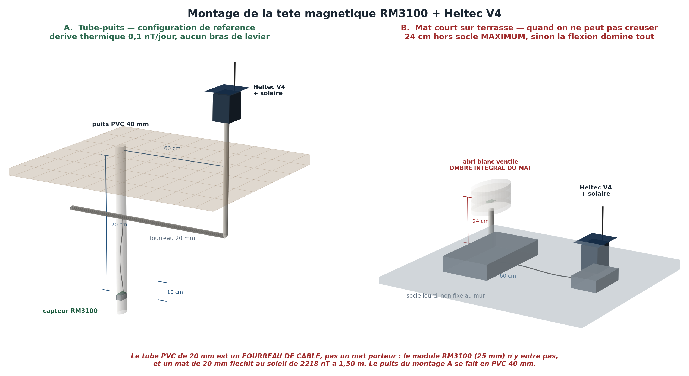

<div align="center">


# GEOMAG-Observer

**Observatoire magnétique amateur et détecteur de perturbation géomagnétique locale**

Version 1.0.0 — F1GBD / F4JHW — ADRASEC 77

### [**Télécharger la dernière version**](https://github.com/f1gbd/F1GBD/releases/download/geomag-observer-v1.0.0/GEOMAG-Observer.7z)

`GEOMAG-Observer.7z` — v1.0.0 — 38 Mo — Windows 10/11 64 bits
[Notes de version](https://github.com/f1gbd/F1GBD/releases/tag/geomag-observer-v1.0.0)

</div>

---

## Qu'est-ce que GEOMAG-Observer ?

Un poste de surveillance géomagnétique complet bâti autour d'un **PNI RM3100** à 31 €. Il mesure les variations du champ magnétique terrestre, en tire un **indice K local**, détecte les orages géomagnétiques, et vous dit ce que ça change pour la propagation HF.

En scénario de crise avec coupure Internet, vous n'avez plus accès au Kp planétaire du NOAA. Votre station devient alors **votre seule source de conditions géomagnétiques** — et donc le seul moyen de savoir que vos liaisons HF sont en train de tomber avant qu'elles ne tombent.



## Ce que ça mesure — et ce que ça ne mesure pas

**Ça mesure des VARIATIONS.** L'indice K ne dépend que des plages de variation sur des blocs de 3 heures, jamais du niveau absolu. Une station amateur sans ligne de base le calcule donc parfaitement, et c'est ce qui rend ce projet réaliste.

**Ça ne mesure pas le champ absolu.** Pas de théodolite DI, pas de ligne de base : aucune contribution INTERMAGNET possible, et une dérive lente sur des mois que rien ne rattrape. Sans la moindre importance pour l'usage visé.

## Trois usages

| Usage | À quoi ça sert |
|---|---|
| **Détection d'orage** | Indice K local, commencements brusques (SSC), surveillance de dB/dt, alarme à seuil |
| **Correction diurne** | Export IAGA-2002 relu directement par un logiciel de levé magnétique — une station à 0 km vaut mieux qu'un observatoire à 60 km |
| **Surveillance de site** | Mesure du bruit magnétique culturel d'un terrain avant d'y installer quoi que ce soit |

## Fonctions

### Tableau de bord temps réel

- **Cadran gradué en indice K**, pas en nanoteslas. L'échelle K est quasi géométrique (5, 10, 20, 40, 70, 120, 200, 330, 500 nT) : une graduation linéaire écraserait toute la partie utile contre le zéro. Chaque niveau reçoit un secteur angulaire égal.
- **Oscillogramme à deux tracés** — perturbation et dB/dt, chacun avec sa ligne de seuil. Deux grandeurs de nature différente ne se superposent pas sur une seule échelle.
- **Alarme visuelle et sonore** à seuils paramétrables, avec délai de confirmation et mémorisation jusqu'à acquittement.

### Analyse

| Onglet | Contenu |
|---|---|
| **Magnétogramme** | H, E, Z et température sur 24 h, avec la courbe Sq ajustée et les SSC marqués |
| **Radar** | Azimut du vecteur de perturbation sur 360°, rose des relèvements, amplitude en couleur |
| **Indice K** | Les huit blocs de 3 h, l'échelle de la station, la lecture opérationnelle HF |
| **Santé** | Spectre, couplage thermique, plancher de bruit, journal de traitement |
| **Rapport** | Synthèse texte exportable |
| **Firmware** | Flash des cartes Heltec, sans PlatformIO |

<div align="center">

| | |
|:---:|:---:|
|  |  |
| **Magnétogramme** — SSC, phase principale, baies de sous-orage | **Radar** — azimut du vecteur de perturbation |
|  |  |
| **Indice K** — huit blocs de 3 h et lecture HF | **Santé** — spectre, thermique, bruit |

</div>

### Confort

- Thèmes **sombre et clair**, bascule instantanée
- Réglages en **JSON**, chargés et enregistrés automatiquement
- **Écran d'accueil** et fenêtre À propos
- **Simulateur géomagnétique complet** : tout fonctionne sans matériel

## Matériel

### Le capteur

**PNI RM3100**, magnéto-inductif trois axes. Gain = `0,3671 × CC + 1,5` LSB/µT.

| Cycle count | Résolution | Cadence max |
|---|---|---|
| 200 (défaut usine) | 13,3 nT/LSB | 150 Hz |
| **800 (recommandé)** | **3,39 nT/LSB** | 37 Hz |

Moyenné à la minute, on atteint **±3 nT** — largement sous le seuil K1 de 5 nT. L'instrument résout donc toute l'échelle K utile.

### Quatre montages

| Montage | Liaison | Pour qui |
|---|---|---|
| **Heltec LoRa 868** *(recommandé)* | LoRa vers une passerelle USB | Poste ADRASEC. Aucun câble à tirer, tête autonome sur batterie et solaire |
| **Tête Teensy 4.1** | USB série, Ethernet UDP, carte SD | Station fixe câblée. L'Ethernet franchit 100 m — le SPI, lui, ne passe pas 30 m |
| **Raspberry Pi direct** | SPI ou I2C local | Capteur à moins d'un mètre du calculateur |
| **Simulateur** | aucune | Mise au point, formation, démonstration |

## La chaîne LoRa — le montage de référence

Deux **Heltec WiFi LoRa 32 V4**, la même carte que RWLoRa et RRLoRa : mêmes outils de flash, mêmes réflexes de mise en service, et rien à tirer entre le capteur et la maison.

| | |
|---|---|
| **CAPTEUR** | Heltec V4 + RM3100, dans le tube. Batterie 3000 mAh, panneau 5 W sur l'entrée solaire dédiée du V4. ~12 mA moyens, donc autonome. |
| **STATION** | Heltec V4 ou V3 en passerelle USB sur le PC. Elle reçoit les trames et les rend au format série que le programme parle déjà. |



Quatre fils de signal et deux d'alimentation, sur **J3-14 à J3-17** — quatre GPIO contigus sur le connecteur *et* dans l'ordre des broches du module : la nappe part droite, sans un seul croisement. DRDY n'est pas câblé : à 10 Hz, interroger le registre d'état ne fait rien perdre.

> **Le piège du V4.** `GPIO2`, `GPIO7` et `GPIO46` pilotent l'étage RF haute puissance ; `GPIO33` à `GPIO37` sont consommés par la PSRAM octale d'un ESP32-S3R8. Les utiliser donne une carte qui démarre, compile et fonctionne — jusqu'à la première émission. `GPIO7` est J3-18, juste à côté de la nappe.

### Pourquoi la minute, et pourquoi ça ne coûte rien

La sous-bande g1 (868,0–868,6 MHz) est limitée à **1 % de rapport cyclique**. Une trame par seconde demanderait 6 % au SF7 : illégal d'un facteur six. On groupe donc la minute.

Et la physique aide : **l'indice K est une statistique de plage.** En transmettant la moyenne minute exacte plus le min et le max de chaque axe, K est calculé *sans aucune perte* — identique au bit près à une liaison filaire. On ne perd que la finesse de l'oscillogramme (4 s au lieu de 1 s) et une minute de latence.

| Trame | octets | SF7 | SF8 | SF9 |
|---|---|---|---|---|
| COMPACT / ALARME | 42 | 0,15 % | 0,26 % | 0,48 % |
| FULL 15 éch. | 132 | **0,37 %** | 0,65 % | 1,16 % ✗ |

Le nœud interroge la pile radio sur le temps d'antenne réel de ses paramètres et **choisit son type de trame tout seul**. Au SF9 la forme d'onde saute, la statistique minute passe. L'opérateur ne *peut pas* composer une configuration illégale, et une comptabilité d'antenne glissante sur l'heure refuse d'émettre au-delà du budget plutôt que de tricher.

### Le blanking d'émission

Le SX1262 tire ~60 mA pendant ~100 ms à l'émission, soit quelques nT à 10 cm. Mais contrairement à une liaison Ethernet qui émet en permanence, **le microcontrôleur sait quand il émet** : les échantillons de la fenêtre sont jetés, 0,4 % du temps au SF7, et le problème disparaît. C'est l'avantage décisif du LoRa sur l'Ethernet pour une tête magnétique.

L'acier statique — blindage USB-C, ressorts IPEX — n'est pas un problème : un objet magnétique immobile à distance fixe produit un **offset constant**, et l'indice K ne voit pas les offsets. Seule règle : tout rigidement fixé, rien d'amovible.

### L'implantation



Le capteur va au **fond d'un puits en PVC 40 mm**, à 70 cm, où l'amplitude thermique quotidienne tombe sous 0,1 °C. Le tube de 20 mm est un **fourreau de câble**, pas un mât porteur : le module RM3100 (25 mm) n'y entre pas, et un mât de 20 mm fléchit au soleil de **2218 nT à 1,50 m** — 1′ d'arc, soit 0,3 mm de flexion, vaut déjà 12 nT.

Sur terrasse, quand on ne peut pas creuser : 24 cm hors socle **maximum**, socle lourd posé et jamais fixé au mur, abri blanc ombrant le capteur *et la totalité du mât*. Le détail chiffré est dans `documentations/FICHE_CABLAGE_RM3100_Heltec-V4.docx`.

## L'onglet Firmware

Un opérateur n'a pas à installer PlatformIO pour poser une station. L'onglet **Firmware** écrit les images livrées dans `firmware\` directement sur la carte.

Rôle (**STATION** / **CAPTEUR**) × carte (**V4** / **V3**) → port → *Détecter la carte* → *FLASHER*, avec journal et barre d'avancement.

- Une carte qui n'est **pas un ESP32-S3** est refusée avant écriture.
- Le V3 et le V4 portent **tous deux** un ESP32-S3 : aucune lecture ne les distingue. L'interface le dit franchement — c'est votre déclaration qui fait foi.
- Une seule image de passerelle sert le V3 **et** le V4 : pour ce rôle les deux cartes sont électriquement équivalentes.
- Pas d'image CAPTEUR pour le V3 : la tête s'appuie sur l'entrée solaire dédiée du V4.
- Refus argumentés si l'acquisition occupe déjà le port, si l'image est absente, tronquée, ou de nom non conforme.

### Propreté magnétique — à lire avant de câbler

Le calculateur est lui-même une source magnétique. Un Heltec V4 ou un Teensy 4.1 consomme quelques dizaines à une centaine de milliampères ; la boucle de courant correspondante produit environ :

| Distance capteur ↔ calculateur | Champ parasite |
|---|---|
| 10 cm | ~6 nT |
| 20 cm | ~0,8 nT |
| **30 cm** | **~0,2 nT** |
| 50 cm | ~0,05 nT |

Le plancher de bruit visé étant de 1 à 3 nT : **30 cm minimum, 50 cm de préférence**, et sous-cadencer le processeur (80 MHz sur l'ESP32-S3, `CLK=150` sur le Teensy). Sur la variante filaire, le magjack RJ45 contient des transformateurs à noyau ferrite — objet magnétiquement perméable, à placer aussi loin et à fixer rigidement.

## Installation

Télécharger [**GEOMAG-Observer.7z**](https://github.com/f1gbd/F1GBD/releases/download/geomag-observer-v1.0.0/GEOMAG-Observer.7z) (v1.0.0, 38 Mo), décompresser dans un dossier accessible en écriture, lancer `GEOMAG-Observer.exe`.

Aucune installation, aucune dépendance, aucun droit administrateur. Windows 10 ou 11, 64 bits.

Le fichier de réglages `geomag_observer.json` se crée tout seul au premier lancement, à côté de l'exécutable. Le supprimer suffit à revenir aux valeurs d'usine.

> Ne pas placer le dossier dans `C:\Program Files` : le programme écrit ses réglages et ses exports à côté de l'exécutable. Un dossier de documents, un disque de données ou une clé USB conviennent — le programme est entièrement portable, il ne touche ni à la base de registre ni au profil utilisateur.

### Contenu de l'archive

| Élément | Rôle |
|---|---|
| `GEOMAG-Observer.exe` | L'application |
| `_internal\` | Bibliothèques et données embarquées — ne rien y modifier |
| `documentations\` | Fiche technique et manuel |
| `firmware\` | Images à flasher sur les cartes Heltec |
| `teensy\` | Source du firmware de la tête filaire Teensy |
| `LICENSE` | Conditions de diffusion (MIT) |

### Les firmwares

Le sous-dossier [`osjt_maghead_lora/`](osjt_maghead_lora/) contient le projet PlatformIO des deux cartes Heltec — nœud et passerelle, un seul arbre de sources, deux environnements :

```powershell
pio run -e heltec_v4_gateway
pio run -e heltec_v4_node
```

Les images produites sont livrées dans `firmware\`, prêtes à flasher depuis l'onglet Firmware. `osjt_lora_frame.h` est la seule définition de la trame ; `GEOMAG-Observer.exe --selftest` en rejoue la structure côté Python, 18 contrôles dont le CRC et le budget réglementaire.

### Le firmware de la tête Teensy

Le sous-dossier [`teensy/`](teensy/) contient `osjt_maghead.ino`, le source complet de la tête magnétique. Il n'est utile que si vous construisez la tête décrite plus bas : l'application fonctionne sans, en simulateur ou avec un capteur câblé directement.

Ouvrir dans l'IDE Arduino équipé de **Teensyduino**, choisir la carte *Teensy 4.1* à 600 MHz, téléverser. La tête répond ensuite aux commandes série listées en tête du fichier (`?`, `STAT`, `CC=`, `TMRC=`, `SAVE`).

> Deux réglages à ne pas oublier au premier démarrage : `CC=800` puis `SAVE` — le cycle count sort d'usine à 200, soit 13,3 nT/LSB, trop grossier pour le bas de l'échelle K. Et `CLK=150` : lire un capteur à 40 Hz ne demande aucune puissance de calcul, et la signature magnétique du Teensy chute avec sa consommation.

## Prise en main

1. Lancer le programme. Backend **Simulateur** par défaut : rien à brancher.
2. **Démarrer l'acquisition**. Le cadran bouge, l'oscillogramme se remplit.
3. Onglet **Alarme** : régler le seuil. 40 nT correspond à K4 pour un K9 de 500 nT.
4. Au bout d'un quart d'heure, les onglets d'analyse se remplissent tout seuls.

Pour passer au matériel : onglet **Firmware**, flasher les deux cartes, puis choisir le backend **Teensy (série)** et saisir le port de la passerelle — elle rend les trames au format que ce backend parle déjà, il n'y a rien d'autre à changer.

## L'échelle K

Les seuils sont des fractions de K9 selon l'échelle de Bartels. Pour K9 = 500 nT, valeur usuelle aux latitudes moyennes :

| K | 1 | 2 | 3 | **4** | 5 | 6 | 7 | 8 | 9 |
|---|---|---|---|---|---|---|---|---|---|
| **Plage sur 3 h (nT)** | 5 | 10 | 20 | **40** | 70 | 120 | 200 | 330 | 500 |
| **Activité** | calme | calme | actif | **perturbé** | orage mineur | orage modéré | orage fort | orage sévère | orage sévère |

Lecture opérationnelle HF :

- **K ≤ 2** — propagation nominale
- **K 3-4** — MUF en baisse, absorption accrue, surveiller les liaisons de plus de 1500 km
- **K 5** — MUF effondrée aux hautes latitudes, absorption aurorale, prévoir un repli
- **K 6-7** — liaisons HF longue distance peu fiables, basculer vers un chemin alternatif
- **K ≥ 8** — panne HF généralisée, risque de courants induits sur les longues lignes conductrices

## Trois pièges, et comment ils sont traités

Ces trois défauts ont été trouvés et corrigés pendant le développement. Ils sont documentés parce qu'ils guettent tout projet équivalent.

**1. dB/dt sur des échantillons à 1 seconde.** Dériver d'un échantillon à l'autre et rapporter à la minute multiplie le bruit par 60 : mesuré sur du bruit blanc de 1 nT, on obtient des pointes à **276 nT/min**, et l'alarme part toute seule. GEOMAG-Observer compare deux moyennes de 15 s séparées d'une minute — sur le même bruit, le maximum tombe à **1,2 nT/min**, et une rampe réelle de 12,0 nT/min se lit 12,17.

**2. Le déparasitage qui efface les commencements brusques.** Un SSC est une excursion courte : un filtre anti-impulsion naïf le supprime, c'est-à-dire exactement l'événement que la station existe pour détecter. Le filtre distingue **impulsion** (le niveau revient) et **marche** (le niveau reste déplacé) en comparant les moyennes de part et d'autre.

**3. La régression thermique qui mange la variation diurne.** La courbe Sq et la température sont toutes deux pilotées par le Soleil : une régression directe attribue la Sq entière à la température et efface le signal. L'ajustement ne se fait que sur la bande 10-60 min, et le programme refuse d'estimer quand la corrélation est insuffisante — ce qui est le comportement normal d'un capteur bien enterré.

## Formats de fichiers

| Fichier | Contenu |
|---|---|
| `<code><AAAAMMJJ>min.min` | IAGA-2002, données minute, relisible par tout logiciel d'observatoire |
| `<code><AAAAMMJJ>.csv` | Données minute brutes : `t_unix, H, E, Z, F, T` |
| `geomag_observer.json` | Réglages, fusionnés avec les défauts à la lecture |

## Ligne de commande

`GEOMAG-Observer.exe` accepte les options suivantes :

```
--headless              analyse une journée simulée et écrit les figures
--daemon                acquisition continue sans interface
--teensy PORT           tête Teensy sur port série
--teensy-udp [PORT]     tête Teensy en UDP (défaut 10077)
--spi / --i2c           capteur direct sur Raspberry Pi
--selftest              vérifie le protocole de trame de la tête
--theme dark|light      thème de démarrage
--logo [FICHIER]        extrait le logo embarqué
--quiet-day             journée calme simulée
--dirty-site            site pollué simulé — montre ce que produit une mauvaise implantation
```

## Documentation

- [`documentations/FICHE_TECHNIQUE_GEOMAG-Observer.pdf`](documentations/) — fiche technique
- [`documentations/MANUEL_GEOMAG-Observer.pdf`](documentations/) — manuel professionnel

## Sources et références

- **HamSCI** — Personal Space Weather Station, projet magnétomètre RM3100
- **NASA STEN** — *Arduino Magnetometer for Space Weather Studies*
- **PNI Sensor Corporation** — manuel RM3100
- **ArduPilot / PX4** — carte des registres RM3100 (REVID 0x22, 75 LSB/µT à CC=200)
- **IAGA** — échelle K de Bartels, méthode FMI
- **ppigrf** — champ de référence IGRF-14

## Licence

**MIT** — voir le fichier [`LICENSE`](LICENSE), qui précise aussi les licences des bibliothèques embarquées dans l'exécutable et les limites d'usage de l'instrument.

---

<div align="center">

**GEOMAG-Observer** — projet OSJT · F1GBD / F4JHW · ADRASEC 77 · 2026

</div>
