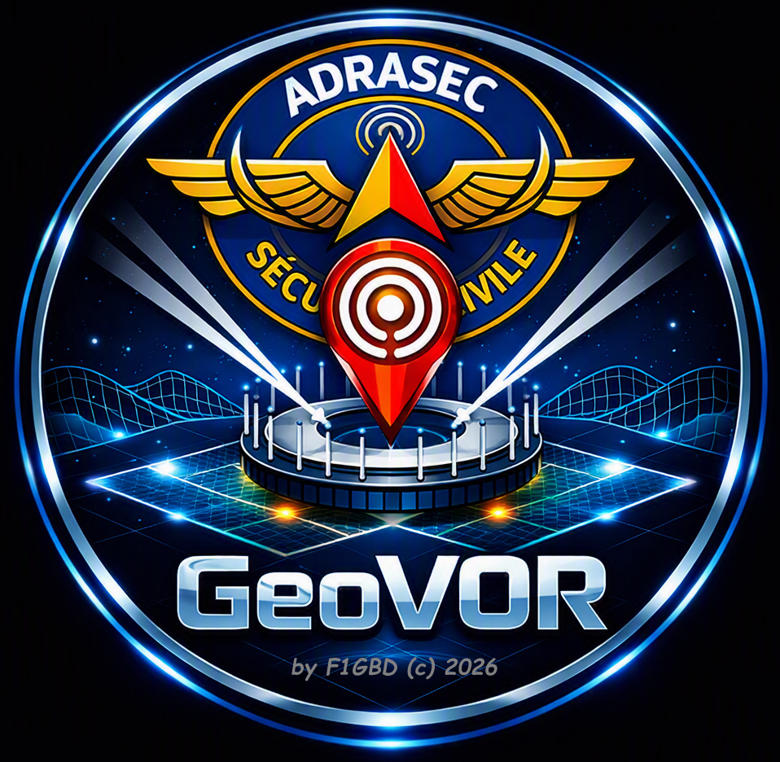
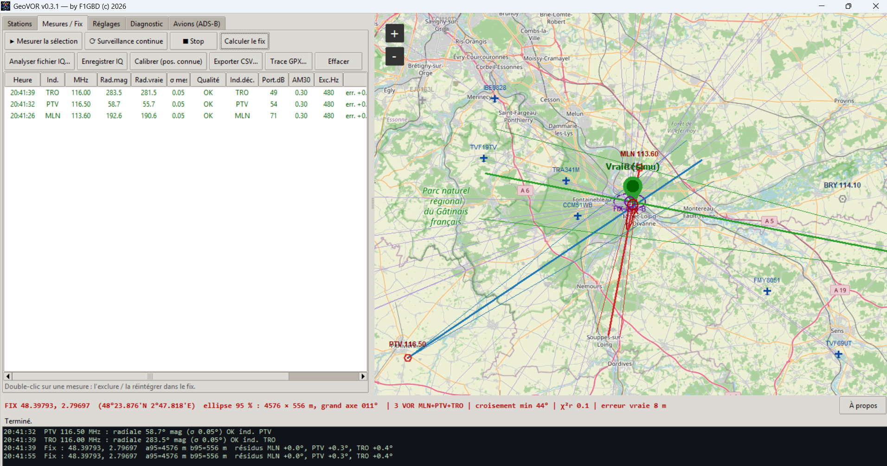
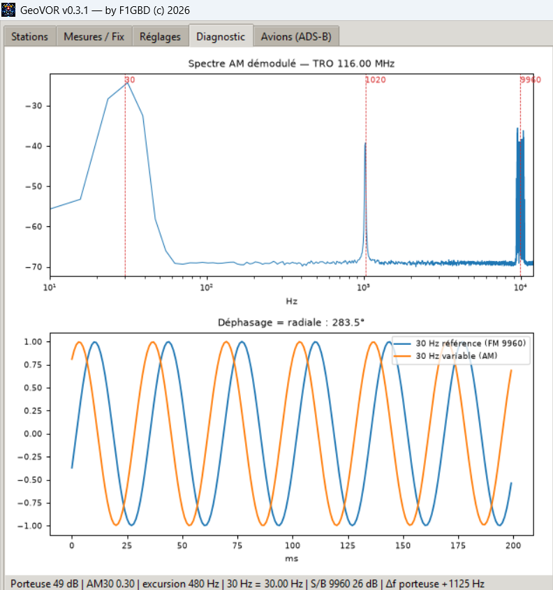
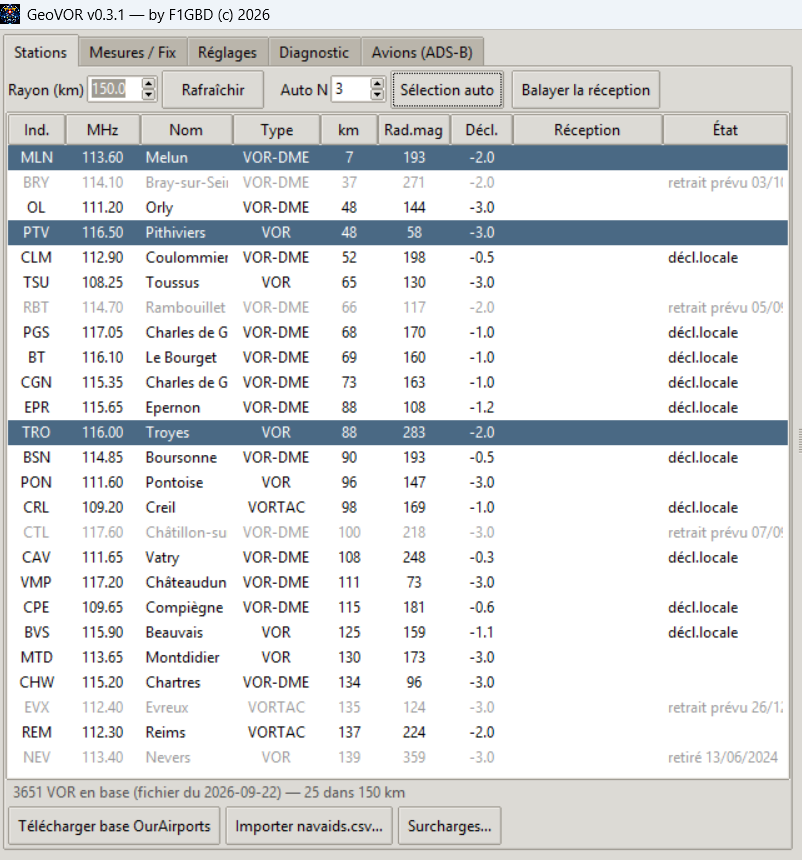
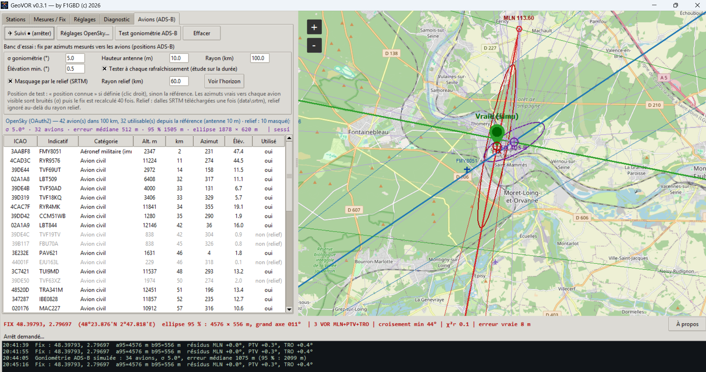
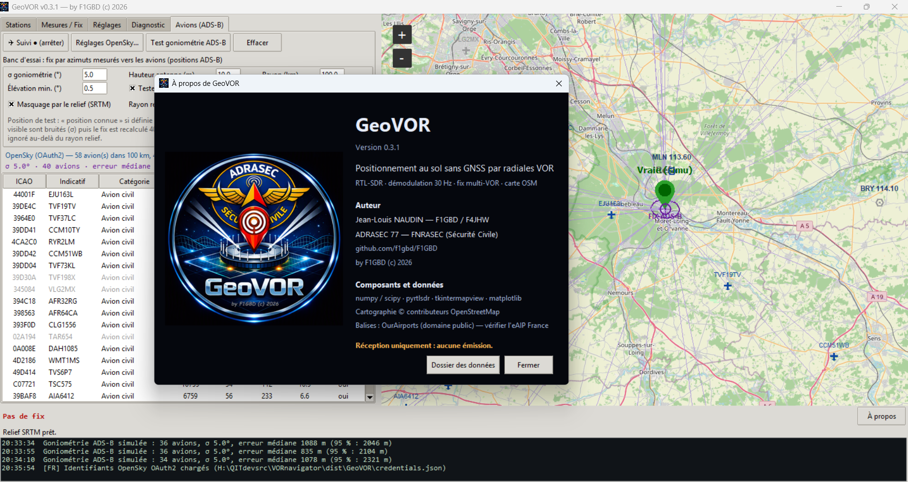

<div align="center">



# GeoVOR

**Se positionner au sol sans GNSS, à la radio.**
Deux méthodes indépendantes : radiales **VOR** mesurées par clé RTL-SDR, et **Doppler sur satellites
LoRa** mesuré par une station sol autonome. Fix par moindres carrés, carte OpenStreetMap.

*by F1GBD (c) 2026 — ADRASEC 77 / FNRASEC*

    

<a href="https://github.com/f1gbd/F1GBD/releases/download/geovor-v1.4.0/GeoVOR-1.4.0-setup.exe"></a>

</div>

## 📥 Télécharger GeoVOR v1.4.0 pour Windows

### **[⬇ GeoVOR-1.4.0-setup.exe](https://github.com/f1gbd/F1GBD/releases/download/geovor-v1.4.0/GeoVOR-1.4.0-setup.exe)** — double-clic, et c'est installé

*Aucun droit administrateur, aucune installation Python. Raccourcis Bureau et menu Démarrer, manuel, autotest et détection de la clé SDR inclus, firmwares GSLoRaSAT embarqués, et une désinstallation qui conserve réglages, base des balises, relief et journaux. Les mises à jour suivantes s'installent depuis l'application (À propos → Vérifier les mises à jour).*

**[⬇ GeoVOR.7z](https://github.com/f1gbd/F1GBD/releases/download/geovor-v1.4.0/GeoVOR.7z)** — l'archive, à décompresser sans installation.

[📘 Manuel PDF](documentation/MANUEL_GeoVOR.pdf) · [📡 Station GSLoRaSAT](https://github.com/f1gbd/F1GBD/tree/master/gslorasat) · [🗂 Toutes les versions](https://github.com/f1gbd/F1GBD/releases?q=geovor&expanded=true)

---

## À quoi ça sert

Le GNSS peut être brouillé, leurré ou simplement indisponible. Les VOR, eux, sont des balises
au sol qui émettent en permanence entre 108 et 118 MHz, et leur position est publiée. Chaque VOR
reçu donne un angle : la **radiale** sur laquelle on se trouve. Deux radiales se croisent, trois
donnent une position et une mesure honnête de son incertitude.

GeoVOR fait cela avec une clé RTL-SDR à vingt euros, sans rien émettre, et affiche le résultat sur
une carte utilisable hors ligne.

Mais le réseau VOR se réduit, et en fond de vallée on n'en reçoit souvent qu'un seul. GeoVOR sait
donc aussi se positionner **par effet Doppler sur les satellites LoRa** — le principe du système
Transit de 1964, avec un module à trente euros au lieu d'un récepteur militaire. Un satellite qui
passe balaie plusieurs centaines de hertz de décalage ; la forme de cette courbe dit où l'on est.
Les deux méthodes sont indépendantes et se résolvent ensemble.

C'est un outil **ADRASEC** : exercices, secours, scénarios de crise avec GNSS dégradé. Ce n'est **pas**
un moyen de navigation certifié.

## Ce que fait GeoVOR

| | |
|---|---|
| **Radiale VOR** | Démodulation AM, 30 Hz variable, sous-porteuse 9960 Hz en FM (30 Hz de référence), déphasage = radiale magnétique, avec σ et contrôles qualité |
| **Indicatif Morse** | Décodage du 1020 Hz et comparaison à la base : impossible de se tromper de station |
| **Fix multi-VOR** | Intersections sur la sphère, Gauss-Newton pondéré, ellipse d'erreur à 95 %, résidus par station |
| **Carte** | OpenStreetMap, balises, radiales, ellipse, trace du fix, tuiles téléchargeables pour le hors-ligne |
| **Base des balises** | OurAirports (3 600 VOR), surcharges locales, stations retirées signalées |
| **Calibration** | Sur point connu : mémorise le biais de chaque station (multitrajets du site) |
| **Simulation** | Générateur de signal VOR synthétique : toute la chaîne se teste sans matériel |
| **Fichiers IQ** | `.wav` (SDR#, SDR++), `.cu8`, `.cs16`, `.cf32`, `.npy` — analyse d'enregistrements, large bande comprise |
| **Avions (ADS-B)** | Suivi OpenSky / dump1090 / SDR direct, et banc d'essai de positionnement par goniométrie sur les avions |
| **Relief** | Masquage d'horizon SRTM : savoir qui est réellement visible depuis son site |
| **Fusion VOR + ADS-B** | Radiales et azimuts résolus ensemble dans un seul moindres carrés, chacun pondéré par son σ |
| **Doppler satellite** | Fix sur satellites LoRa défilants (SGP4 + moindres carrés séparables), oscillateur bord éliminé comme paramètre de nuisance |
| **Station sol** | Heltec WiFi LoRa 32 V3 ou LilyGo T-Beam en **USB ou en Wi-Fi** (point d'accès de la carte) : accord, réception, FEI, journal de liaison horodaté |
| **Journal de la station** | La station garde chaque paquet dans sa flash, même sans PC : GeoVOR le rapatrie à la demande, daté de sa réception (firmware GSLoRaSAT ≥ 1.1.0) |
| **Autonomie** | Cache TLE local, catalogue appris des réceptions, autopilote tactique — la station apprend seule, sans internet ni GNSS |
| **Firmware** | Flashage hors-ligne des cartes Heltec V3 et T-Beam depuis l'application, firmwares embarqués — la configuration de la station est conservée |
| **Mises à jour** | Installeur Windows ; « À propos → Vérifier les mises à jour » télécharge et lance la nouvelle version (SHA-256 vérifié) |
| **Journal** | Onglet dédié, journal de liaison horodaté conservé sur disque — c'est lui qui tranche après coup |

## Captures

<div align="center">

**Fix sur trois VOR — radiales, ellipse à 95 %, résidus**



**Diagnostic — le signal VOR tel qu'il est reçu**



Les deux 30 Hz et leur déphasage, la sous-porteuse à 9960 Hz, l'indicatif à 1020 Hz.
Ici : porteuse 49 dB, modulation 0,30, excursion 480 Hz — un VOR reçu dans les règles.

**Stations en portée et balayage de réception**



**Avions (ADS-B) : positionnement par goniométrie, relief actif**



Fix VOR (rouge) et fix ADS-B simulé (violet) côte à côte. Les avions masqués par le relief
sont marqués « non (relief) ».



</div>

## Matériel

* **Clé RTL-SDR** (R820T/R820T2), pilote **WinUSB** via Zadig — comme pour SDR#.
* **Antenne VHF 108–118 MHz**, dehors et en hauteur si possible. C'est le point qui décide de tout :
  au sol, en fond de vallée, on ne reçoit souvent qu'un seul VOR.
* **Fortement conseillé** : un filtre coupe-bande FM (88–108 MHz) devant la clé. Les émetteurs FM
  sont collés à la bande VOR et saturent le récepteur.
* Facultatif : récepteur ADS-B (dump1090 local ou seconde clé) pour l'onglet Avions.

Pour le Doppler satellite, indépendamment de tout ce qui précède :

* **Heltec WiFi LoRa 32 V3** (ESP32-S3, SX1262) ou **LilyGo T-Beam v1.1/v1.2** (ESP32, SX1278 433 MHz),
  reliée en USB. Le firmware se flashe depuis l'onglet **Firmware**, sans internet.
* **Antenne UHF 400–436 MHz** — une quart d'onde suffit pour commencer, dégagée vers le ciel. C'est
  encore l'antenne qui décide de tout.
* Ni WiFi, ni GNSS, ni serveur : la station fonctionne entièrement hors-ligne.

## Installation

Le plus simple : **[`GeoVOR-1.4.0-setup.exe`](https://github.com/f1gbd/F1GBD/releases/download/geovor-v1.4.0/GeoVOR-1.4.0-setup.exe)** (toutes les versions dans les
[Releases](https://github.com/f1gbd/F1GBD/releases?q=geovor)). L'installateur ne demande aucun droit
administrateur et s'installe par utilisateur dans `%LOCALAPPDATA%\Programs\GeoVOR`, un dossier où
GeoVOR peut écrire ses données. Raccourcis Bureau, autotest et détection de la clé SDR proposés à
l'installation ; la désinstallation laisse en place réglages, base des balises et journaux.

Sinon, **`GeoVOR.7z`** : décompresser où vous voulez et lancer `GeoVOR.exe`. Rien à installer,
Python et toutes les bibliothèques sont dans le dossier.

Les mises à jour s'installent ensuite **depuis l'application** : **À propos → Vérifier les mises à
jour** télécharge le nouvel installeur, vérifie son empreinte SHA-256 et le lance.

Ensuite, dans les deux cas :

1. Au premier démarrage, accepter le téléchargement de la base des balises (OurAirports, ~2 Mo).
2. Clic droit sur la carte à votre position → **Position de référence ici**.

Les réglages, la base, le relief et les journaux sont créés à côté de l'exécutable
(`data\`, `logs\`, `iq\`), rien n'est écrit ailleurs.

> Pour OpenSky en OAuth2, poser son `credentials.json` à côté de `GeoVOR.exe`.

## Premiers pas

```
Réglages   : Source = RTL-SDR, puis « Détecter » la clé, gain 40 dB pour commencer
Stations   : « Balayer la réception » -> qui est réellement reçu ici ?
             puis « Sélection auto » -> 3 stations bien croisées
Mesures    : « Mesurer la sélection », puis « Calculer le fix »
```

Et sans matériel, pour prendre l'outil en main : **Source = Simulation**, clic droit sur la carte →
*Position vraie ici*. Toute la chaîne tourne sur un signal VOR synthétique, l'erreur réelle du fix
s'affiche.

Côté satellite, une fois la carte flashée par l'onglet **Firmware** :

```
Satellites : « Télécharger les TLE » une fois, tant qu'il reste une connexion
             (les éphémérides restent valables une à deux semaines)
             cocher « Autopilote tactique », et laisser tourner
             la station apprend les satellites qu'elle entend, sans CSV à charger
             « Calculer le fix » une fois plusieurs passages accumulés
```

Laisser collecter une nuit entière donne bien plus qu'une heure : ce qui manque est presque toujours
la **variété de géométrie**, pas le nombre de paquets.

Vérification de l'installation, sans clé :

```
GeoVOR.exe --selftest      autotest DSP + géométrie
GeoVOR.exe --detect        diagnostic de la clé RTL-SDR
GeoVOR.exe --sdrtest       banc d'essai de lecture de la clé
```

## Interface

Huit onglets — **Stations**, **Mesures**, **Réglages**, **Diagnostic**, **Avions**, **Satellites**,
**Firmware**, **Journal** — et une carte permanente à droite. Chaque onglet défile à la molette, ce qui
le rend utilisable sur un écran de portable en intervention. Thème **clair ou sombre** au choix,
bouton en bas à droite.

## Précision des radiales VOR : ce qu'il faut en attendre

* **Bruit de mesure** : faible. Moins de 0,1° à 25 dB de C/N, environ 0,6° à 8 dB (signal synthétique).
* **Erreurs de site** : ce sont elles qui dominent. Multitrajets, relief, lignes HT : 2 à 5° couramment
  au sol. Une réflexion à −14 dB décale déjà la radiale de plusieurs degrés. D'où le réglage
  *erreur de site*, la calibration sur point connu, et l'intérêt des points hauts.
* **Ordre de grandeur** : 1° à 50 km ≈ 870 m. Un fix au sol vaut de quelques centaines de mètres à
  quelques kilomètres — et l'ellipse le dit franchement.
* **Géométrie** : viser des radiales qui se croisent entre 60 et 120°.
* **Réseau VOR** : il se réduit (tous les NDB et une partie des VOR disparaissent d'ici 2030). Les
  stations dont le retrait est annoncé sont grisées ; l'indicatif décodé reste le vrai garde-fou.

## Et les avions ? (onglet ADS-B)

Un avion diffuse sa position en ADS-B. Un azimut mesuré vers lui donne donc une ligne de position :
c'est GeoVOR à l'envers, avec des dizaines de « balises » mobiles, visibles même depuis le sol.

L'onglet **Avions** sert à chiffrer l'idée avant d'acheter le matériel de goniométrie : il récupère les
avions (OpenSky, dump1090 local ou SDR direct), calcule qui est réellement visible (relief SRTM en
option), bruite les azimuts vrais d'un σ choisi, recalcule le fix 40 fois et journalise tout.

Sur le terrain, en Île-de-France : une centaine d'avions utilisables, et avec σ = 5° une erreur
médiane de l'ordre de 0,5 à 1 km. À confirmer avec une vraie goniométrie (réseau cohérent type
KrakenSDR), où les erreurs ne se moyenneront pas aussi bien.

### Fusion des deux

Une radiale VOR et un azimut vers un avion sont la même chose : une ligne de position angulaire.
GeoVOR les résout donc **ensemble**, chacune pondérée par 1/σ² — quelques radiales soignées
tiennent la position, des dizaines d'azimuts plus bruités resserrent l'ellipse. Bouton
**Fusion VOR + ADS-B**, résultat en orange sur la carte et dans le bandeau du bas.

Tant qu'il n'y a pas de goniomètre, les azimuts ADS-B restent simulés : le bouton est un banc
d'essai, qui affiche côte à côte l'écart des VOR seuls, de l'ADS-B seul et de la fusion. Le solveur,
lui, est définitif. Ordre de grandeur (3 VOR à σ = 2°, 20 avions) : VOR seuls ≈ 1 km, ADS-B seuls
≈ 1,9 km à σ = 5°, fusion ≈ 1,2 km — et l'apport grandit avec le bruit de goniométrie.

## Positionnement par Doppler sur satellite (onglet Satellites)

Un satellite défilant qui passe au-dessus de vous s'approche puis s'éloigne. La fréquence reçue
monte puis descend — plusieurs centaines de hertz à 400 MHz — et **la forme de cette courbe ne
dépend que de votre position**. C'est le principe du système Transit (1964), le premier
positionnement par satellite de l'histoire. Il ne demande aucune constellation dédiée : n'importe
quel satellite dont on connaît l'orbite fait l'affaire.

GeoVOR l'applique aux **satellites LoRa** — FossaSat, Grifon, Tianqi, Norby, KOSAR, Mule, CSTP :
une vingtaine au catalogue, reçus par une carte à trente euros.

### La station sol

Une **Heltec WiFi LoRa 32 V3** (ESP32-S3) ou une **LilyGo T-Beam v1.1/v1.2** (ESP32, 433 MHz), reliée
en USB **ou en Wi-Fi**. Le firmware [GSLoRaSAT](https://github.com/f1gbd/F1GBD/tree/master/gslorasat),
dérivé de TinyGS, fonctionne **hors-ligne** : il n'a besoin ni de serveur, ni d'internet, ni de GNSS.
Il reçoit, mesure le **FEI** (l'écart de fréquence du paquet) et l'envoie à GeoVOR. GeoVOR l'accorde
en retour et tient le journal.

* **Wi-Fi** (firmware ≥ 1.1.0) : la carte ouvre son propre point d'accès, au nom de la station
  (ex. `F1GBD-GeoVOR`) ; GeoVOR s'y connecte sur `tcp://192.168.4.1:8023`, même protocole qu'en USB.
* **Journal de la station** : chaque paquet valide est gardé dans la flash de la carte (~600 à 900
  paquets), **même sans PC**. Posez la station sur un point haut, laissez-la écouter, puis
  **« 📥 Journal de la station… »** rapatrie les passages — seulement les nouveaux, ou tout —, datés
  de leur réception (GPS de la T-Beam, ou horloge interne pour le démarrage en cours) et inscrits au
  journal de liaison, donc rejouables.

L'onglet **Firmware** flashe les deux cartes directement depuis l'application, avec les images
embarquées : aucun accès internet n'est nécessaire pour équiper une station, et **la configuration
de la carte (nom, position) est conservée** au flash.

### L'autonomie, qui est le vrai sujet

En crise, une station ne peut compter sur rien d'extérieur. GeoVOR est donc bâti pour qu'une
installation neuve se débrouille seule :

* **Cache TLE local**, avec une porte unique : une éphéméride de plus de 30 jours est refusée pour
  *tout* le programme — pas de position calculée sur une orbite périmée, et l'état est dit
  (« périmé », pas « absent »).
* **Catalogue appris des réceptions.** Chaque paquet reçu confirme une fréquence, un SF, une bande.
  Aucun CSV à charger : ce que la station entend, elle le retient.
* **Autopilote tactique.** Il ne choisit pas le satellite le plus haut, mais celui qui **resserre le
  plus l'ellipse** — en levant d'abord l'ambiguïté gauche/droite, puis en tenant tout passage
  commencé jusqu'à la perte du signal. Un passage coupé en deux paie deux fois son polynôme
  d'oscillateur.
* **Jamais d'attente à vide.** Si le prochain passage planifié est à plus de dix minutes et qu'un
  satellite est au-dessus maintenant, la station écoute ce qui passe.
* **Bouton RAZ** : oublier les satellites mémorisés pour tester une première installation, avec
  sauvegarde `.bak` — effacer sur un malentendu n'est pas irréversible.

### Précision : ce qu'il faut en attendre, et ce qui trompe

Le Doppler satellite est **plus difficile** que les radiales VOR, et GeoVOR est écrit pour le dire
plutôt que pour flatter le résultat.

* **Un satellite unique ne détermine pas une position.** Ses traces successives sont parallèles : la
  solution est double, symétrique par rapport à la trace au sol, et les deux points peuvent être à
  1000 ou 2000 km l'un de l'autre. Il faut **deux satellites de traces croisées**, ou une radiale VOR
  pour trancher. GeoVOR affiche la solution miroir et son coût, et dit « INDISCERNABLE » quand elle
  l'est.
* **Un bon résidu ne prouve rien sur un passage unique.** Mesuré : sur un passage de 320 s, une
  éphéméride voisine de 0,2° en anomalie laisse le résidu **inchangé à 32 Hz** et déplace le point de
  **24 km**. Le solveur glisse la position pour absorber l'erreur d'orbite. Ce qu'il faut n'est pas un
  meilleur résidu, c'est un second satellite.
* **Beaucoup de paquets ne font pas un bon passage.** Les paquets LoRa arrivent en grappes de
  retransmissions : 34 paquets peuvent tenir en six instants distincts. Un polynôme d'oscillateur
  d'ordre 6 a sept coefficients — il les *interpole* et avale la courbe Doppler elle-même. La colonne
  **« Hz utiles »** donne, pour chaque passage, la signature Doppler qui **survit** au polynôme :
  c'est elle, et elle seule, qui contraint la position.
* **L'ellipse est honnête.** Quand un seul satellite porte l'essentiel du fix, GeoVOR le dit et
  prévient que l'ellipse ne mesure plus que le bruit.
* **État actuel sur le terrain** : quelques dizaines de kilomètres avec une collecte de quelques
  heures. Le kilomètre demande deux passages bien fournis de satellites différents, aux traces
  croisées — c'est la géométrie qui manque, pas la sensibilité. À considérer comme **expérimental**.

### Le piège des satellites frères

FossaSat-2E18 est à 401,703 MHz, ses frères 2E19, 2E21, 2E22 et 2E25 à 401,700 — 3 kHz d'écart pour
125 kHz de largeur de canal, autant dire la même fréquence. Plusieurs Tianqi partagent 400,265 MHz. La
station étiquette chaque paquet du nom du satellite sur lequel elle est accordée — donc deux courbes
Doppler peuvent se mêler sous un seul nom, et σ passe de 10 à près de 100 Hz. GeoVOR **prévient**
quand un frère de fréquence était visible en même temps, et écarte les passages dont le satellite
était sous l'horizon en nommant l'émetteur probable. Il ne sait pas les démêler après coup : attribuer
chaque paquet par son résidu ne rend que 14 sur 20 au bon satellite.

## Documentation

📘 **[Manuel d'utilisation (PDF)](documentation/MANUEL_GeoVOR.pdf)** — installation, tous les réglages,
procédures de terrain, calibration, fichiers IQ, tuiles hors-ligne, ADS-B, relief, dépannage.

## Données et crédits

* Cartographie : © les contributeurs **OpenStreetMap**.
* Balises : **OurAirports** (domaine public) — à recouper avec l'**eAIP France (ENR 4.1)**.
* Relief : **SRTM** via le jeu public *Terrain Tiles* (AWS `elevation-tiles-prod`).
* Avions : **OpenSky Network**, ou votre propre récepteur ADS-B.
* Satellites : éphémérides **CelesTrak** (TLE), firmware dérivé de **TinyGS** (Fossa Systems).
* Bibliothèques : numpy, scipy, matplotlib, tkintermapview, pyrtlsdr, pyModeS, sgp4, pyserial, esptool.

## Avertissements

* **Réception seulement.** GeoVOR n'émet jamais : une clé RTL-SDR ne transmet pas, et la station
  satellite n'est configurée qu'en réception.
* **Aucun usage aéronautique.** Outil d'expérimentation et de secours au sol, pas un moyen de
  navigation certifié, et sans valeur réglementaire.
* Vérifier l'état des balises (NOTAM, eAIP) avant de s'y fier.

---

<div align="center">

**Jean-Louis NAUDIN — F1GBD / F4JHW**
ADRASEC 77 — FNRASEC (Sécurité Civile)

*73*

</div>
