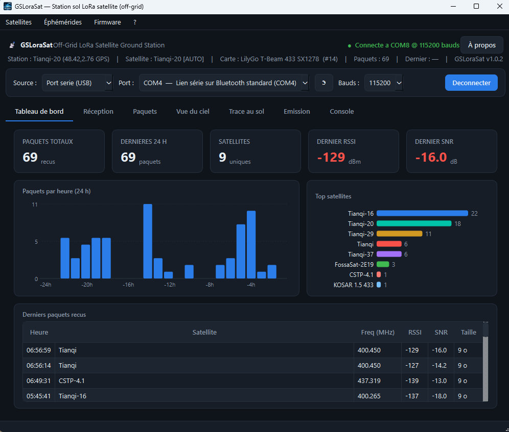

<p align="center">
  
</p>

<h1 align="center">GSLoRaSat</h1>

<p align="center">
  <b>Station sol LoRa satellite — 100&nbsp;% off-grid.</b><br>
  Recevoir et opérer les satellites LoRa (réseau TinyGS) <b>sans serveur MQTT ni connexion Internet</b>,
  via une simple liaison série USB.
</p>

<p align="center">
  
  
  
  
  
</p>

---

## Présentation

**GSLoRaSat** transforme une carte LoRa ESP32 en **station sol autonome** pilotée par une
application de bureau Windows, **sans passer par le serveur MQTT `app.tinygs.com` ni par Internet**.

Toute la chaîne fonctionne hors ligne :

```
   Satellite LoRa  ))))         ┌─────────────────────┐        ┌─────────────────────────┐
        ▼                       │   Carte ESP32        │  USB   │   GSLoRaSat (PC)        │
   [ RF 400–437 MHz ] ────────► │  station off-grid    │ ◄────► │  réception, émission,   │
                                │  (SX1278 / SX1262)   │ série  │  éphémérides, autopilote│
                                └─────────────────────┘        └─────────────────────────┘
```

La station émet les paquets reçus sur le port USB et accepte des commandes de tuning. L'application
décode, enregistre, affiche, et pilote la fréquence d'écoute — y compris un **mode automatique** qui
suit le satellite le plus haut dans le ciel grâce au **GPS** de la station et aux **éphémérides SGP4**
calculées localement.

## Fonctionnalités

- 📡 **Réception off-grid** des paquets LoRa satellites (RSSI, SNR, longueur, fréquence), archivés en base locale.
- 🛰️ **Catalogue de satellites LoRa** (paramètres modem réels : fréquence, SF, BW, CR, sync word…), importable depuis un export CSV ou le flux TinyGS.
- 🎯 **Sélection manuelle** du satellite écouté → reconfiguration réelle du modem de la station.
- 🤖 **Mode automatique (élévation max)** : la station se cale toute seule sur le satellite LoRa le plus haut au-dessus de l'horizon, et rebascule au fil des passages.
- 🌍 **Éphémérides locales (SGP4)** : distance, azimut, élévation, doppler, trace au sol — TLE mis en cache pour un usage 100 % hors ligne.
- 🧭 **GPS embarqué** (T-Beam) : position et heure UTC transmises à l'application pour caler l'autopilote sans configuration manuelle.
- ⚙️ **Configuration série** de la station (carte, position, nom, autorisation d'émission) **sans portail WiFi**.
- 📤 **Émission** de trames LoRa vers un satellite (sous réserve de licence radioamateur et d'autorisation locale).
- 🖥️ **Interface claire** : Tableau de bord, Réception, Paquets, Vue du ciel, Trace au sol, Émission, Console — plus un **simulateur** pour tout tester sans matériel.

## Captures d'écran

<p align="center">
  
  
</p>
<p align="center">
  
  
</p>

## Matériel supporté

| Station | MCU | Radio | Bande | GPS |
|---|---|---|---|---|
| **Heltec WiFi LoRa 32 V3** | ESP32-S3 | SX1262 | 150–960 MHz | — |
| **LilyGo T-Beam v1.1** | ESP32 | SX1278 (RFM95) | 433 MHz | NEO-6M |

> La carte est sélectionnable à chaud depuis l'application (menu de configuration de la station),
> sans reflasher.

## Installation & utilisation

Les binaires prêts à l'emploi sont fournis dans la section **[Releases](../../releases)**.

**1 — Flasher la station** (une fois). Téléchargez le firmware `.bin` correspondant à votre carte
et flashez-le avec [esptool](https://github.com/espressif/esptool) ou un flasher ESP :

```
esptool --chip esp32 --port COMx --baud 921600 write_flash 0x0 gslorasat-<carte>.bin
```

**2 — Lancer l'application.** Téléchargez `GSLoraSat.exe` (binaire autonome, aucune installation
requise) et ouvrez-le.

**3 — Connecter.** Sélectionnez le port USB de la station puis **Connecter**. Sans matériel, la
source **Simulateur** permet de découvrir l'interface immédiatement.

## Mode automatique (élévation max) + GPS

1. Menu **Éphémérides → Mettre à jour** une fois (avec Internet) pour mettre les TLE en cache.
2. Connecter l'application à la station.
3. Menu **Satellites → Mode automatique (élévation max)**.

L'application calcule en continu l'élévation de chaque satellite LoRa depuis la position de la
station et cale automatiquement la station sur **le plus haut au-dessus du seuil** (réglable,
défaut 5°). La position et l'heure proviennent du **GPS du T-Beam**, ou d'une saisie manuelle pour
les cartes sans GPS.

```
GPS station : 48.42, 2.75 (7 sat.)
[AUTO] écoute Tianqi-20 @ 400.265 MHz  (élévation 26°, az 210°)
```

## Flux off-grid typique

1. Brancher la station en USB.
2. Ouvrir GSLoRaSat, sélectionner le bon port, **Connecter**.
3. (Une fois) Mettre à jour les éphémérides.
4. Activer le **Mode automatique**, ou choisir un satellite à la main.
5. Attendre un passage — les paquets remontent dans le Tableau de bord / Réception / Paquets,
   avec distance, élévation et doppler calculés localement.

## Émission — avertissement réglementaire

L'émission LoRa vers un satellite nécessite une **licence radioamateur** et le respect des
bandes/fréquences autorisées dans votre pays. L'application n'autorise l'émission que si la station
a signalé qu'elle y est autorisée et exige une confirmation explicite de l'opérateur. Vous êtes
seul responsable de vos transmissions.

## Crédits & licence

- **GSLoRaSat** — conception et développement : **F1GBD**.
- Interopère avec l'écosystème **[TinyGS](https://tinygs.com)** et s'appuie sur les éphémérides
  **[SGP4](https://pypi.org/project/sgp4/)** / **[Celestrak](https://celestrak.org)**.

Distribué sous licence **GNU GPLv3** — voir le fichier [`LICENSE`](LICENSE).

<p align="center"><i>73 de F1GBD 🛰️📡</i></p>
