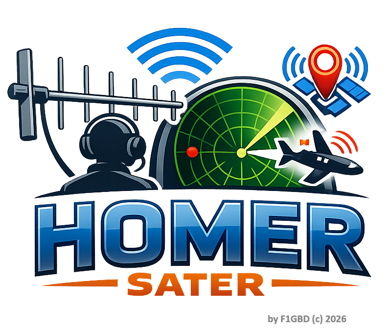
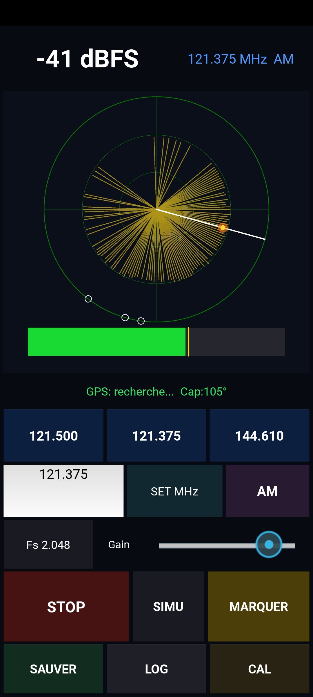

<div align="center">



# HOMER for SATER — Radiogoniométrie ELT sur Android

**Homing de balises de détresse 121.5 / 121.375 / 144.610 MHz avec un smartphone, une clé RTL-SDR et une antenne Yagi.**

Outil de recherche radiogoniométrique conçu pour les exercices et missions **SATER** de l'**ADRASEC** (FNRASEC / Sécurité Civile).



### 📥 [Télécharger directement l'APK](https://github.com/f1gbd/F1GBD/releases/download/homer-android-v1.0.0/homer-1.0.0-arm64-v8a-debug.apk)

</div>

---

## ✨ Présentation

**HOMER** transforme un téléphone Android, une clé **RTL-SDR** (USB-OTG) et une petite **antenne Yagi** en goniomètre de campagne. En balayant lentement avec la Yagi, l'opérateur lit la direction de la balise sur un **radar polaire** (mémoire par azimut + blip RSSI), une **barre de niveau** avec maintien du pic, et un **retour haptique** de proximité — ou à l'oreille via l'**audio démodulé**.

L'application est le portage Android de **HOMERpi** (Raspberry Pi / Tkinter), dans la lignée des outils ADRASEC de F1GBD (TCQ, IAbrain, EPIRBsuite, SATERfinder, PDFteleporter). Le traitement du signal est **100 % NumPy** (sans SciPy) ; la clé est pilotée via le driver **RTL2832U** de M. Marinov (protocole `rtl_tcp`).

---

## 🚀 Fonctionnalités

- **Canaliseur IQ bande étroite** pour le homing : *offset tuning* + NCO + décimation NumPy pur → pic/creux nets, rejet du bruit large bande et du spike DC.
- **Radar polaire** : mémoire du niveau par azimut, **blip RSSI pulsant** (écho radar), aiguille de cap.
- **Barre RSSI** avec maintien du pic (peak-hold).
- **Fréquences** : presets 121.500 / 121.375 / 144.610 MHz **+ saisie manuelle en MHz**.
- **Modes de réception** : **AM / NFM / WFM** (largeur de canal adaptée).
- **Débit réglable** : 2.048 / 1.024 MS/s (clés justes en USB).
- **Audio SDR** : écoute du signal démodulé (AM = enveloppe, idéal pour le *warble* ELT ; NFM/WFM = discriminateur FM). L'alarme RSSI est coupée pendant l'écoute.
- **Cap magnétique** via `TYPE_ROTATION_VECTOR` (fusion accéléro + magnéto + gyro), **déclinaison automatique** (GeomagneticField), et **calibration** (bouton CAL).
- **GPS** natif + **marquage de relèvements** (azimut, RSSI, position), **export CSV/JSON** et **journal (LOG)**.
- **Mode SIMU** : génère une balise fictive pour s'entraîner au relèvement sans matériel.
- **Retour haptique** de proximité (vibreur).

---

## 📡 Matériel requis

| Élément | Détail |
|---|---|
| Téléphone | Android 8+ (API 24+), **arm64-v8a**, USB-OTG (testé Samsung A52 / Android 12) |
| Clé SDR | **RTL-SDR** (Nooelec NESDR SMArt v5 / RTL-SDR Blog) + adaptateur **USB-OTG** |
| Antenne | Yagi 121.5 MHz (ou 2 m pour 144.610) |
| Driver | Appli **« RTL2832U »** (Martin Marinov, `marto.rtl_tcp_andro`) — Play Store |

---

## 📥 Installation (APK)

1. Installer l'appli driver **RTL2832U (Marinov)** depuis le Play Store.
2. **[Télécharger directement l'APK HOMER](https://github.com/f1gbd/F1GBD/releases/download/homer-android-v1.0.0/homer-1.0.0-arm64-v8a-debug.apk)** (lien direct, sans ambiguïté avec les autres applis du dépôt).
   *Liste de toutes les versions : page [Releases](https://github.com/f1gbd/F1GBD/releases) (tag `homer-android-v1.0.0`).*
3. Autoriser l'installation depuis cette source, puis installer l'APK.
4. Brancher la clé RTL-SDR sur l'adaptateur OTG.

> **Vérification d'intégrité** : un fichier `.sha256` accompagne l'APK.
> ```bash
> sha256sum -c homer-1.0.0-arm64-v8a-debug.apk.sha256
> ```

Aucune dépendance Python à installer : tout est embarqué dans l'APK (Kivy + NumPy), le code est livré en **bytecode**.

---

## 🧭 Utilisation

1. Lancer **HOMER** et **autoriser la localisation**.
2. Choisir la **fréquence** (preset ou saisie manuelle + **SET MHz**) et le **mode** (AM/NFM/WFM).
3. **DEMARRER** : HOMER ouvre le driver Marinov ; **autorisez l'accès USB** à la clé. Le récepteur passe « EN ÉCOUTE ».
4. Balayer lentement avec la Yagi : le **blip** et la **mémoire polaire** indiquent la direction du maximum ; la **barre RSSI** et le **peak-hold** confirment ; le téléphone **vibre** à chaque nouveau pic (ou activez **AUDIO** pour écouter).
5. **MARQUER** enregistre azimut + RSSI + position ; **SAUVER** exporte en CSV/JSON ; **LOG** affiche le journal.

### Calibration de la boussole (CAL)
Tenir le téléphone à plat, aligné avec le boom de la Yagi. Faire un mouvement en **8** pour calibrer le magnétomètre (la précision passe à *BONNE*). Pour aligner finement : pointer un repère de cap connu, saisir sa valeur et **Caler** ; ajustement ±1/±5° et **Reset** disponibles.

### Entraînement sans balise (SIMU)
Appuyer sur **SIMU** puis **DEMARRER** : une balise fictive est placée à un azimut aléatoire. En tournant le téléphone, le blip et le pic suivent l'azimut — idéal pour la formation.

---

## 🎚️ Fréquences & modes

| Preset | Mode | Usage |
|---|---|---|
| 121.500 MHz | AM | Fréquence de détresse ELT/PLB |
| 121.375 MHz | AM | Balise d'entraînement ADRASEC |
| 144.610 MHz | NFM | Balise 2 m |
| *(manuel)* | AM/NFM/WFM | Toute fréquence 24–1766 MHz |

---

## ⚠️ Notes & limites

- Le **cap** dépend du magnétomètre du téléphone : calibrer (mouvement en 8) et tenir l'appareil à plat, aligné avec la Yagi. La **barre RSSI** reste l'indicateur principal.
- À fort débit (Fs 2.048), surveiller la charge CPU ; passer à **1.024** si nécessaire.
- L'accès USB au dongle est géré par l'appli **driver Marinov** : sans elle, « DEMARRER » ne reçoit rien.

---

## 👤 Auteur & licence

**Jean-Louis — F1GBD** · ADRASEC 77 · FNRASEC
Projet développé pour la communauté ADRASEC / Sécurité Civile.

*HOMER for SATER © 2026 F1GBD.*

**73** 📻
