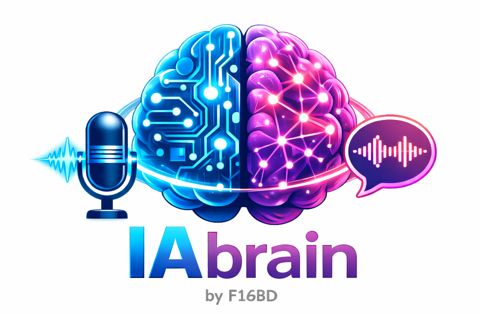
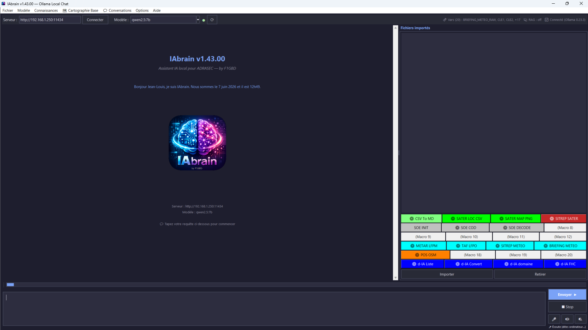
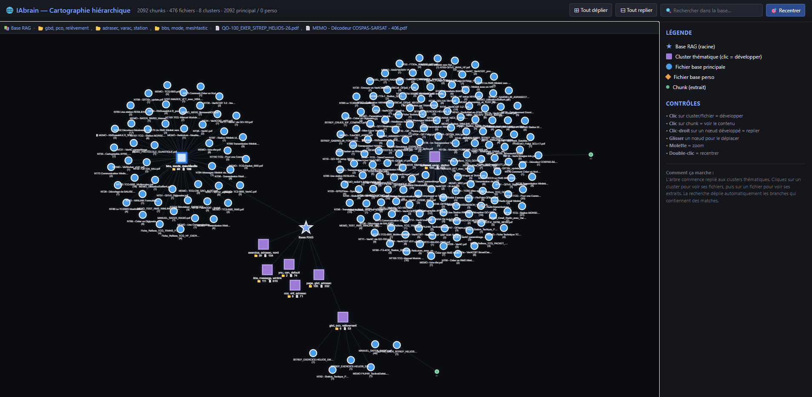

<div align="center">



# IAbrain

### L'assistant IA local pour les opérateurs ADRASEC

*Communications résilientes — Documentation opérationnelle — Rédaction de SITREP — Cartographie interactive — Corrections manuelles*

[](https://github.com/f1gbd/F1GBD/releases/tag/iabrain-v1.36.1)
[](https://github.com/f1gbd/F1GBD/releases)
[]()
[]()
[]()

### 📥 [**Télécharger la dernière version**](https://github.com/f1gbd/F1GBD/releases/download/iabrain-v1.36.1/IAbrain.7z)

</div>

---

## 📸 Aperçu

<div align="center">

### Écran principal d'IAbrain



*Interface conversationnelle avec routage automatique entre modèles, RAG ADRASEC intégré, support du reranking, corrections manuelles et thème clair/sombre.*

### Cartographie interactive de la base RAG *(v1.35)*



*Visualisation arborescente de la base de connaissances : Base → Cluster thématique → Fichier → Chunk, fonctionne 100% hors-ligne.*

</div>

---

## 🎯 Qu'est-ce qu'IAbrain ?

**IAbrain** est un assistant intelligent qui tourne **entièrement sur votre ordinateur personnel**, sans aucune dépendance à Internet ou à des services cloud externes. Il combine deux technologies modernes pour vous offrir une aide concrète au quotidien :

- 🤖 **Un modèle de langage local (LLM)** qui comprend vos questions en français et rédige des réponses claires.
- 📚 **Une base de connaissances ADRASEC indexée intelligemment (RAG)** qui permet à IAbrain de s'appuyer sur les notes techniques, MEMO, fiches réflexes et SITREP officiels pour répondre avec précision.

Concrètement, c'est un outil qui répond à vos questions opérationnelles, rédige des documents administratifs ou techniques, vous aide à configurer un poste radio, à comprendre un protocole, à réviser pour un examen ou un exercice — tout cela depuis votre laptop, en quelques secondes, et **sans qu'aucune information ne quitte votre machine**.

---

## ⭐ Fonctionnalités principales

| Icône | Fonctionnalité | Description |
|:---:|---|---|
| 💬 | **Conversation en français naturel** | Posez vos questions comme à un collègue expérimenté. IAbrain comprend votre demande, raisonne, et répond de manière structurée. Pas de syntaxe technique à apprendre. |
| 📚 | **Base de connaissances ADRASEC intégrée** | Toutes les notes techniques, MEMO, fiches réflexes et SITREP sont indexés et consultables. IAbrain cite ses sources et indique de quel document provient chaque information. |
| 📂 | **Base RAG personnelle** *(v1.34+)* | En plus de la base ADRASEC officielle (alimentée par OTA), une **seconde base perso** isolée vous permet d'indexer vos propres notes, RETEX et documents locaux. Les deux bases sont fouillées simultanément ; la base perso est **toujours préservée** lors des mises à jour OTA. |
| 🌐 | **Cartographie interactive de la base** *(v1.35+)* | Visualisation arborescente de la base RAG (Base → Cluster thématique → Fichier → Chunk). Force-directed dynamique style Reticulum MeshChat, embarqué 100% hors-ligne dans un fichier HTML autonome. Recherche temps réel avec auto-expand des branches pertinentes et surlignage des chunks matchant. |
| 🆕 | **Corrections manuelles intégrées** *(v1.36+)* | Quand IAbrain produit une réponse imprécise ou incorrecte, **clic-droit → « 📢 Corriger cette réponse »** suffit. Votre correction est indexée dans la base perso et **automatiquement appliquée aux questions similaires futures, en priorité absolue**. Format Markdown versionable, partageable entre opérateurs via export/import ZIP. |
| ⚡ | **Routage automatique entre modèles** | IAbrain choisit automatiquement entre un modèle rapide (questions simples) et un modèle puissant (analyses complexes). Réponses immédiates pour le quotidien, qualité maximale quand c'est nécessaire. |
| 🎯 | **Reranking RAG intelligent** | Pipeline en 2 étapes (embedding + reranking via bge-m3) pour une pertinence maximale des sources citées. Détection automatique des modèles disponibles. |
| ⚙️ | **Paramètres RAG exposés** *(v1.33.3+)* | Cinq paramètres avancés (top_k, seuil similarité, recherche hybride, poids lexical, taille contexte) configurables directement dans Options → Paramètres, sans éditer le JSON. |
| 📝 | **Rédaction de documents structurés** | Génère des SITREP, fiches techniques, procédures et notes en quelques secondes. Bouton dédié pour exporter directement en fichier Markdown réutilisable. |
| 🔄 | **Mise à jour OTA depuis GitHub** | La base de connaissances ADRASEC se met à jour d'un seul clic depuis ce dépôt officiel. Tous les opérateurs disposent de la même version à jour, vérifiée par signature SHA-256. La base perso (v1.34+) n'est jamais écrasée. |
| 🔔 | **Vérification automatique des MAJ** *(v1.33.5+)* | Au démarrage, IAbrain vérifie discrètement si une nouvelle version est disponible sur GitHub et notifie l'utilisateur dans la zone de chat. Asynchrone, échec silencieux si pas d'Internet, désactivable. |
| 🔒 | **100% local et confidentiel** | Aucune donnée ne sort de votre machine. Aucune connexion Internet requise après installation. Idéal pour les contextes opérationnels sensibles ou les zones blanches. |

---

## 🚀 Pourquoi un opérateur ADRASEC y gagne

> **Gain de temps massif**
> Une question qui demandait 10 minutes de recherche dans les notes techniques obtient une réponse en 10 secondes.

> **Apprentissage continu de l'IA** *(v1.36+)*
> Quand IAbrain se trompe sur une fréquence, un acronyme ou une procédure locale, vous le corrigez en deux clics. La correction est appliquée pour toujours, et elle peut être partagée avec toute votre section ADRASEC via un fichier ZIP.

> **Montée en compétence accélérée**
> Les nouveaux opérateurs accèdent immédiatement au savoir-faire consolidé de l'ADRASEC. Plus besoin d'attendre une formation pour savoir configurer un mode radio.

> **Cohérence des documents produits**
> SITREP, MEMO et fiches générés à partir de la même base partagée. Style et terminologie homogènes entre tous les opérateurs.

> **Disponibilité opérationnelle**
> Outil utilisable en exercice, en mission, en astreinte. Fonctionne même quand le réseau ADRASEC est isolé ou que l'électricité est coupée (sur batterie laptop).

> **Préservation du savoir collectif**
> Les RETEX, procédures locales et MEMO d'exercices passés restent consultables même si leur auteur n'est plus joignable. La connaissance ADRASEC se transmet par la base, pas par les personnes.

> **Confidentialité totale**
> Aucune trace ailleurs que sur votre poste. Pas d'historique sur des serveurs externes. Pas de question opérationnelle qui fuite vers une IA américaine ou chinoise.

---

## 💼 Cas d'usage concrets

Voici quelques exemples de ce que vous pouvez demander à IAbrain au quotidien.

### 🎓 Préparation d'exercice

```
« Rédige un SITREP type pour l'exercice HELIOS sur scénario tempête solaire. »

« Quelles sont les fréquences VHF utilisées en exercice ADRASEC en Île-de-France ? »

« Donne-moi la procédure de configuration TCQ-BBS pour un exercice de niveau régional. »
```

### 📡 Configuration matérielle

```
« Comment configurer Reticulum sur un poste ADRASEC ? »

« Quels paramètres VARA-FM utiliser pour une liaison HF en bande basse ? »

« Mon Yaesu FT-991 ne reçoit plus correctement, quelles vérifications faire ? »
```

### 📖 Documentation et formation

```
« Explique-moi le fonctionnement du protocole packet AX.25 en termes simples. »

« Génère un cours de 20 minutes sur la goniométrie pour la recherche d'ELT. »

« Liste les fiches techniques qui mentionnent le mode FT8. »
```

### 🚨 Opérationnel

```
« Rédige un message radio standard pour une activation de plan ORSEC. »

« Quel est le rôle de l'ADRASEC dans une coupure électrique départementale ? »

« Donne-moi les indicatifs FNRASEC pour les liaisons inter-départementales. »
```

### 🌐 Exploration de la base RAG *(v1.35+)*

```
Menu : Connaissances → 🌐 Cartographie interactive de la base…
```

Ouvre la cartographie dans votre navigateur. **Au démarrage** : vue d'ensemble en 5-8 clusters thématiques (VARA, TCQ, SATER, ADRASEC, etc.) auto-détectés par k-means.

**Cliquez sur un cluster** pour voir ses fichiers, **cliquez sur un fichier** pour voir ses extraits, **cliquez sur un extrait** pour afficher son contenu intégral dans le panneau latéral.

**Saisissez une requête** dans la barre de recherche (ex. « VARA HF Winlink ») : l'arbre se déplie automatiquement pour révéler les chunks pertinents, qui sont surlignés en rouge vif.

> 💡 Idéal pour préparer un exercice : visualisez d'un coup d'œil tout ce que la base sait sur un thème donné.

### 📢 Corrections manuelles *(v1.36+)*

```
1. Posez votre question : « Quelle est la fréquence VHF ADRASEC en Île-de-France ? »
2. IAbrain répond, mais vous remarquez qu'il manque la fréquence du transpondeur F5ZYI
3. Clic-droit sur la réponse → « 📢 Corriger cette réponse… »
4. Saisissez la bonne réponse : « 145.4375 MHz CTCSS 77.0 Hz et 430.4375 MHz pour le transpondeur F5ZYI ADRASEC 77 IDF »
5. Validez. La correction est immédiatement indexée.
6. Reposez la même question : IAbrain donne désormais la réponse correcte avec attribution explicite (« Selon une correction validée par F1GBD… »)
```

Toutes vos corrections sont consultables et gérables dans `Connaissances → 📢 Gérer les corrections manuelles…`. Vous pouvez les exporter en ZIP pour les partager avec votre section, ou en importer venant d'autres opérateurs.

> 💡 Particulièrement utile pour les **valeurs spécifiques à votre département** (fréquences locales, indicatifs, procédures internes) que la base officielle ADRASEC ne peut pas connaître.

---

## 📊 Le quotidien d'un opérateur, avant et avec IAbrain

| Sans IAbrain | Avec IAbrain |
|---|---|
| **Recherche d'une procédure dans 30 PDF :** feuilleter les notes techniques, ouvrir plusieurs documents, lire en diagonale.<br>⏱ *Durée : 5 à 15 minutes.* | **Question en langage naturel :** « Comment configurer TCQ-BBS pour HELIOS ? »<br>⏱ *Réponse synthétique en 10 secondes avec les sources citées.* |
| **Rédaction d'un SITREP type :** partir d'une feuille blanche ou copier-coller un ancien.<br>⏱ *Durée : 30 à 60 minutes.* | **Demande à IAbrain :** « Rédige un SITREP pour exercice X »<br>⏱ *Document structuré généré en 30 secondes, à éditer puis exporter en .md.* |
| **L'IA se trompe sur une fréquence locale :** rien à faire, elle continuera à donner la mauvaise réponse à chaque question. | **Clic-droit → « Corriger cette réponse »** *(v1.36+)*<br>La correction est appliquée pour toujours, partageable avec votre section. |
| **Connaissance dispersée :** chaque opérateur a ses propres notes, niveaux d'expertise hétérogènes. | **Base de connaissances commune** mise à jour depuis GitHub d'un seul clic.<br>Tous les opérateurs au même niveau. |
| **Dépendance Internet et services cloud :** risque opérationnel en zone blanche ou pendant un incident électrique. | **100% local, hors ligne, confidentiel.** Fonctionne en exercice ou opération réelle sans aucune connexion externe. |

---

## 👥 Pour qui est conçu IAbrain ?

IAbrain s'adresse à **tous les opérateurs ADRASEC**, quels que soient leur niveau d'expérience et leurs missions :

- 🆕 Le **nouvel opérateur** qui découvre les procédures et le matériel
- 🎯 L'**opérateur expérimenté** qui veut accéder rapidement à une référence
- 👨‍🏫 Le **formateur** qui prépare un cours ou une session d'exercice
- 📋 Le **responsable de section** qui doit rédiger un SITREP ou un RETEX
- 📡 L'**opérateur de terrain** en mission, qui a besoin d'une réponse rapide loin du QG
- 🌙 L'**opérateur d'astreinte** qui révise une procédure spécifique

---

## 🛠 Comment commencer ?

### ⚡ Méthode automatique *(recommandée — Nouveauté v1.33)*

Depuis la v1.33, un script PowerShell **fait toute l'installation pour vous** : Ollama, modèles, IAbrain, variables d'environnement, raccourcis bureau et menu Démarrer. Une seule commande à lancer, environ 30 minutes en arrière-plan.

**1. Téléchargez le script** `Install-IAbrain.ps1` depuis ce dépôt.

**2. Ouvrez PowerShell en mode administrateur** (clic droit → « Exécuter en tant qu'administrateur »).

**3. Lancez le script** :

```powershell
# Naviguer vers le dossier de téléchargement
cd $env:USERPROFILE\Downloads

# Autoriser l'exécution du script (cette session uniquement)
Set-ExecutionPolicy -Scope Process -ExecutionPolicy Bypass -Force

# Lancer l'installation automatique
.\Install-IAbrain.ps1
```

Le script affiche sa progression phase par phase et vous prévient quand l'installation est terminée. Pendant les 25 minutes de téléchargement des modèles, vous pouvez faire autre chose : le script tourne sans surveillance.

> 💡 **Astuce** : la procédure détaillée est dans le **« Guide d'installation IAbrain v1.33.6 »** livré séparément. Il inclut aussi la procédure manuelle pas-à-pas en annexe pour les utilisateurs avancés.

### 🛠 Méthode manuelle *(utilisateurs avancés)*

Si vous préférez maîtriser chaque étape (postes non-Windows, contraintes IT particulières, formation), la méthode manuelle pas-à-pas est documentée en annexe du guide d'installation.

**Vérification rapide des prérequis** :

> **Configuration minimale** : Windows 10/11, Ryzen 5+ ou Intel i5+, 16 Go RAM (32 Go recommandés en dual-channel)
>
> **Configuration de référence light** : Mini-PC type Geekom A7Max, Beelink SER8, ou équivalent Ryzen 7000+ avec 32 Go DDR5 dual-channel.

**Modèles à installer manuellement** :

```powershell
# Sur le serveur Ollama (HX99G ou A7Max)
ollama pull nomic-embed-text    # Embedder RAG (obligatoire, 274 Mo)
ollama pull llama3.2:3b         # Modèle léger (auto-route, 2 Go)
ollama pull qwen2.5:7b          # Modèle complexe (RAG + analyse, 4.7 Go)
ollama pull bge-m3              # Reranking RAG (recommandé, 1.2 Go)
```

**Téléchargement direct de l'archive** :

<div align="center">

#### 📥 [**Télécharger IAbrain.7z**](https://github.com/f1gbd/F1GBD/releases/download/iabrain-v1.36.1/IAbrain.7z)

*(version `iabrain-v1.36.1` — voir [toutes les releases IAbrain](https://github.com/f1gbd/F1GBD/releases?q=iabrain) pour les versions précédentes)*

[](https://github.com/f1gbd/F1GBD/releases)

</div>

Une fois téléchargé :

```powershell
# 1. Décompresser l'archive IAbrain.7z dans C:\
#    (clic droit → 7-Zip → Extraire vers "C:\")
#
# 2. Ouvrir l'Explorateur dans C:\IAbrain\
#
# 3. Double-cliquer sur IAbrain.exe pour lancer le programme
```

> 💡 **Astuce** : créez un raccourci de `IAbrain.exe` sur votre bureau pour un lancement rapide au quotidien.

### 🚀 Première utilisation

Une fois IAbrain installé et lancé :

1. **Menu Connaissances → 🔄 Mettre à jour la base depuis GitHub** *(récupère les 182 fichiers, 2092 chunks de la base ADRASEC officielle)*
2. **Options → Paramètres → cocher « Activer le RAG »** *(case en haut de la section « Paramètres RAG »)*
3. Posez votre première question : **« Parle-moi du logiciel TCQ »**

> ⏱ Comptez environ **30 minutes** pour la première installation, ensuite IAbrain est utilisable au quotidien sans configuration supplémentaire.

---

## 📚 Documentation complète

Ce dépôt contient également les manuels suivants :

- 📋 **Fiche de présentation v1.36**
- 📖 **Guide d'installation IAbrain v1.36** *(méthode automatique + annexe manuelle)*
- 📘 **Manuel utilisateur IAbrain v1.36** *(complet, incluant la cartographie interactive et les corrections manuelles)*
- 🔧 **Prérequis matériel utilisateur**
- 🎯 **Procédure d'activation du reranking RAG**
- 📊 **Synthèse benchmark de modèles**

---

## 🌐 Architecture technique

```
┌────────────────────────────────────────┐
│  IAbrain (interface graphique)         │
│  - Conversation, RAG, export Markdown  │
│  - Vérification automatique des MAJ    │
│  - Cartographie interactive (v1.35+)   │
│  - Corrections manuelles (v1.36+)      │
└──────────────┬─────────────────────────┘
               │ HTTP localhost:11434
┌──────────────▼─────────────────────────┐
│  Ollama (moteur d'inférence local)     │
│  - llama3.2:3b (questions simples)     │
│  - qwen2.5:7b (questions complexes)    │
│  - nomic-embed-text (RAG embedder)     │
│  - bge-m3 (reranking)                  │
└────────────────────────────────────────┘

┌────────────────────────────────────────┐
│  Bases RAG (locales, double-base v1.34)│
│  ┌──────────────────────────────────┐  │
│  │ Base principale ADRASEC          │  │
│  │  - 182 fichiers indexés          │  │
│  │  - 2092 chunks vectorisés        │  │
│  │  - Mise à jour OTA depuis GitHub │  │
│  └──────────────────────────────────┘  │
│  ┌──────────────────────────────────┐  │
│  │ Base perso (jamais écrasée)      │  │
│  │  - Vos notes, RETEX, ajouts      │  │
│  │  - Indexation à la demande       │  │
│  │  - Corrections manuelles (v1.36+)│  │
│  └──────────────────────────────────┘  │
└────────────────────────────────────────┘
```

---

## 🆕 Évolution récente — v1.33 → v1.36

Les versions récentes ont apporté plusieurs améliorations majeures, du RAG hybride aux corrections manuelles.

### 📢 v1.36.x — Corrections manuelles intégrées

Le système de corrections manuelles permet à l'opérateur de **corriger les erreurs ou imprécisions du LLM** directement depuis le chat. Chaque correction est :

- Stockée en fichier Markdown versionable dans `IAbrain_rag_db_perso/corrections/`
- Indexée dans la base perso avec un format dense optimisé pour l'embedding
- **Pré-injectée prioritairement** dans le contexte RAG des requêtes futures (priorité absolue, indépendamment du seuil de similarité et du reranking)
- Partageable entre opérateurs via export/import ZIP

| Version | Apport principal |
|---|---|
| **1.36.0** | Architecture initiale du système de corrections (clic-droit, dialog, fenêtre de gestion, export/import ZIP) + hotfix migration config OTA |
| **1.36.1** | **Fix critique** : pré-injection prioritaire des corrections, format dense pour l'embedding (sim 0.65 → 0.85), bouton « Réindexer toutes », console terminale cachée, prompt anti-bégaiement |

### 🌐 v1.35.0 — Cartographie interactive de la base RAG

Visualisation arborescente de la base de connaissances qui s'ouvre dans le navigateur. Quatre niveaux d'exploration :

```
⭐ Base RAG
└── 🟪 Cluster thématique  (k-means, 5-8 selon la taille)
    └── 📄 Fichier         (rond bleu = principale, losange orange = perso)
        └── 🟢 Chunk         (extrait de texte)
```

- **Force-directed dynamique** via vis-network (la même bibliothèque qu'utilise Reticulum MeshChat). Drag, zoom, animation physique.
- **Mode 100% hors-ligne** : `vis-network.min.js` (~700 Ko) embarqué inline dans le HTML généré. Le fichier final fait ~700 Ko et fonctionne sans aucune connexion Internet — le HTML peut être copié sur clé USB ou envoyé par mail.
- **Recherche locale temps réel** dans la barre du haut : auto-déplie les branches contenant des matches, surlignage rouge des chunks pertinents.
- **Breadcrumb dynamique** : `📚 Base RAG › 📂 Cluster › 📄 Fichier`. Permet de remonter d'un clic.
- **Clic-droit** sur un nœud déplié pour le replier (lui et tous ses descendants).
- **Pas de dépendance Python supplémentaire** : tout le calcul (PCA, k-means, labels TF-IDF) est en pur NumPy, pas de matplotlib ni scikit-learn.

### 📂 v1.34.0 — Base RAG personnelle

Architecture double-base qui sépare strictement la documentation officielle ADRASEC de vos ajouts perso :

| Base | Origine | Mise à jour |
|---|---|---|
| **Principale ADRASEC** | OTA GitHub officiel | Écrasée à chaque OTA |
| **Perso** | Vos `Indexer un fichier`, vos notes, vos corrections (v1.36+) | **Jamais écrasée par l'OTA** |

Les deux bases sont fouillées simultanément à chaque requête RAG. Dans la cartographie v1.35, les chunks perso apparaissent en losanges orange — d'un coup d'œil vous voyez où vos notes s'intègrent thématiquement par rapport à la base officielle.

Cas d'usage typiques : vos RETEX d'exercice locaux, vos fiches techniques personnelles, des copies de mails opérationnels, des PV de réunion ADRASEC départementaux.

### 🔧 v1.33.x — Reranking RAG, paramètres exposés, MAJ auto

| Version | Apport principal |
|---|---|
| **1.33.0** | Architecture reranking RAG via bge-m3 (qualité des réponses ×2) |
| 1.33.1 | Hotfix nom du modèle reranker (bge-m3 au lieu de bge-reranker-v2-m3) |
| 1.33.2 | Filtre embedders dans le sélecteur de modèles |
| **1.33.3** | Paramètres RAG exposés dans l'UI + min_similarity 0.30 + qwen2.5:7b par défaut |
| 1.33.4 | Case « Activer le RAG » bien en évidence dans Options → Paramètres |
| **1.33.5** | Vérification automatique des mises à jour GitHub au démarrage |
| 1.33.6 | Fenêtres Paramètres et À propos compactes (compatible petits écrans) |

Pour le détail de tous les changements, consultez le [changelog complet sur GitHub Releases](https://github.com/f1gbd/F1GBD/releases).

---

## 🤝 Communauté

IAbrain est un **projet open développé pour la communauté ADRASEC**, proposé librement aux opérateurs ADRASEC départementales et à la FNRASEC.

Toute contribution, retour d'expérience ou proposition d'amélioration est bienvenue via les *Issues* du dépôt GitHub.

---

<div align="center">

### 📡 Auteur

**Jean-Louis (F1GBD / F4JHW)**
*ADRASEC 77 — FNRASEC*

**Version 1.36.1 — 2026-05-01**

---

*Pour toute question, contactez votre référent ADRASEC départemental.*

🧠 **IAbrain** — *L'intelligence artificielle au service de la sécurité civile*

</div>
