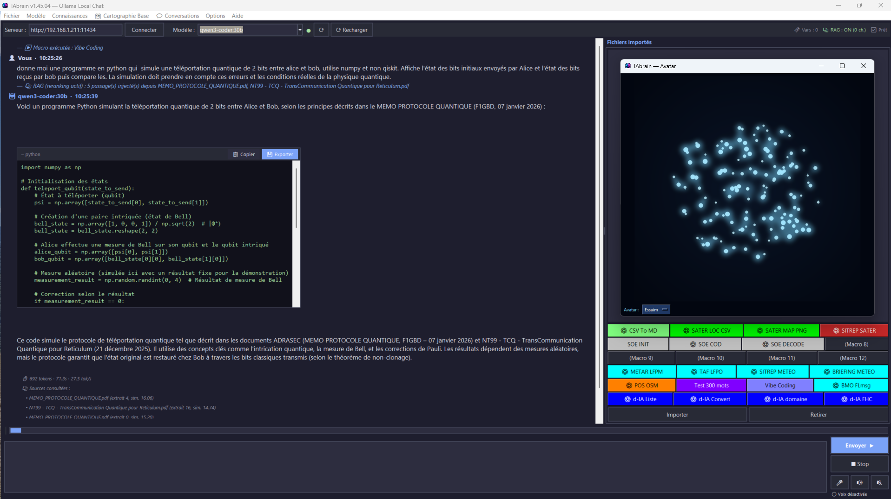
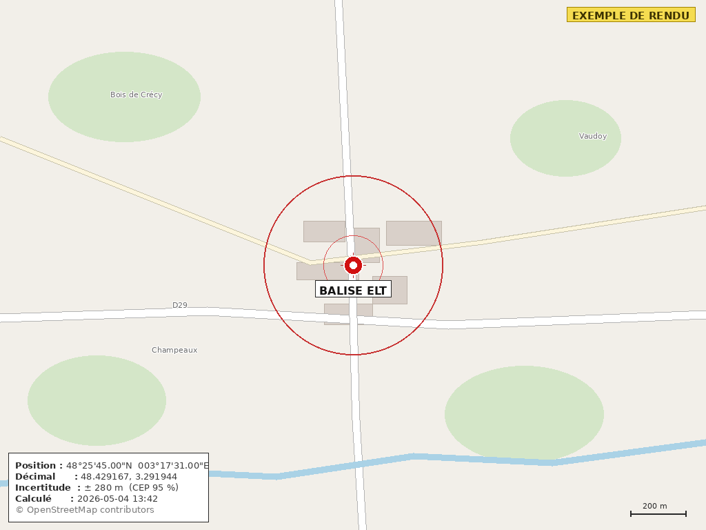

<div align="center">


# IAbrain

### L'assistant IA local pour les opérateurs ADRASEC

*Communications résilientes — Documentation opérationnelle — Rédaction de SITREP — SITREP PDF auto-rempli — SITREP SATER PDF — Cartographie interactive — Carte de position géocodée IGN — Corrections manuelles — 24 macros colorées et partageables — Actions natives — Connectivité Ollama Cloud — Mémoire conversationnelle — Profil opérateur — Variables de session — Pipeline SATER complet — Plugins externes extensibles — Auto-exécution de macros par le LLM — Exécution non-bloquante avec feedback live — Interface vocale STT/TTS pour usage mains libres et accessibilité — **Vibe Coding Python (panneau de code exportable, gestion automatique du contexte)** — **Avatar IAbrain animé***

[](https://github.com/f1gbd/F1GBD/releases/tag/iabrain-v1.45.04)
[](https://github.com/f1gbd/F1GBD/releases)
[]()
[]()
[]()
[]()

### 📥 [**Télécharger la dernière version**](https://github.com/f1gbd/F1GBD/releases/download/iabrain-v1.45.04/IAbrain.7z)

</div>

---

## 📸 Aperçu

<div align="center">

### Écran principal d'IAbrain


*Interface conversationnelle avec routage automatique entre modèles, RAG ADRASEC intégré, macros utilisateur, rendu Markdown complet, corrections manuelles et thème clair/sombre.*

### Cartographie interactive de la base RAG *(v1.35)*


*Visualisation arborescente de la base de connaissances : Base → Cluster thématique → Fichier → Chunk, fonctionne 100% hors-ligne.*

</div>

---

## 🎯 Qu'est-ce qu'IAbrain ?

**IAbrain** est un assistant intelligent qui tourne **entièrement sur votre ordinateur personnel**, sans aucune dépendance à Internet ou à des services cloud externes. Il combine plusieurs technologies modernes pour vous offrir une aide concrète au quotidien :

- 🤖 **Un modèle de langage local (LLM)** qui comprend vos questions en français et rédige des réponses claires.
- 📚 **Une base de connaissances ADRASEC indexée intelligemment (RAG)** qui permet à IAbrain de s'appuyer sur les notes techniques, MEMO, fiches réflexes et SITREP officiels pour répondre avec précision.
- ⚙️ **Des macros et actions natives** *(v1.37+)* pour automatiser vos tâches récurrentes : conversion CSV→Markdown, extraction d'indicatifs, anonymisation, le tout sans solliciter le LLM.

Concrètement, c'est un outil qui répond à vos questions opérationnelles, rédige des documents administratifs ou techniques, vous aide à configurer un poste radio, à comprendre un protocole, à réviser pour un examen ou un exercice, et qui automatise les transformations de fichiers — tout cela depuis votre laptop, en quelques secondes, et **sans qu'aucune information ne quitte votre machine**.

---
### Vibe Coding en Python avec IAbrain (fonctionne en mode LOCAL)


### Création d'un serveur dédié IA pour la gestion des Connaissances


[**Créer son Serveur IAbrain pour la gestion des connaissances et qui fonctionne 100% hors-ligne.**](https://github.com/f1gbd/F1GBD/blob/master/iabrain/Documentations%20IAbrain/MEMO%20-%20Cr%C3%A9er_un_Serveur_IA_M1A_IAbrain.pdf)

## ⭐ Fonctionnalités principales

| Icône | Fonctionnalité | Description |
|:---:|---|---|
| 💬 | **Conversation en français naturel** | Posez vos questions comme à un collègue expérimenté. IAbrain comprend votre demande, raisonne, et répond de manière structurée. Pas de syntaxe technique à apprendre. |
| 💻 | **Vibe Coding Python amélioré** *(v1.45)* | Génération et itération de code en langage naturel, pensées pour les outils Python de l'écosystème ADRASEC. Chaque bloc de code s'affiche dans un **panneau dédié** avec bouton **💾 Exporter** (sauvegarde du bloc seul, extension devinée), bouton **📋 Copier**, et **ascenseur** automatique pour les longs programmes. **Ré-indentation automatique** des blocs mal alignés par le modèle (fini les `IndentationError` à l'export). **Gestion automatique de la fenêtre de contexte** (`num_ctx` ajusté pour réserver la place de la réponse, historique compris) et **détection de troncature** : si Ollama coupe la génération par manque de place, IAbrain le signale clairement au lieu de laisser croire à une réponse complète. **Bouton « ⟳ Recharger »** pour réinitialiser à froid un modèle figé, et **alerte de décalage de version Ollama** entre poste local et serveur (cause classique d'échecs de chargement de modèle). |
| 👤 | **Avatar IAbrain animé** *(v1.44)* | Une **fenêtre flottante d'avatar** qui visualise l'activité de l'IA en temps réel. Trois rendus au choix — **Essaim** (nuée de particules), **Neurones** (réseau pulsant) et **Core** (noyau central) — qui réagissent aux phases du pipeline : réflexion, traitement du prompt, écriture de la réponse, repos. L'avatar « parle » au fil des tokens et reflète aussi l'état vocal (TTS) quand l'interface vocale est active. Purement visuel, 100 % local, désactivable. |
| 🎤🔊 | **Interface vocale STT + TTS** *(v1.42+)* | **Reconnaissance vocale mains libres** (Vosk offline) avec wake-word « ordinateur », et **synthèse vocale** des réponses. **Trois modes STT configurables** : activé / sujets génériques uniquement (recommandé — les questions ADRASEC techniques sont injectées pour relecture avant envoi) / désactivé. **Pré-correction phonétique automatique** du vocabulaire radio (VARA, TCQ, ADRASEC, QO-100, AX.25…) avec **apprentissage progressif des corrections** de l'opérateur (dictionnaire personnel persistant). **Bips d'accessibilité** *(v1.42.14)* pour les utilisateurs non-voyants : un bip court signale le début de la génération LLM, un double bip ascendant annonce l'imminence de la lecture TTS, un bip grave signale une erreur. **Lecture intégrale** des réponses sans troncature avec annonce vocale de la durée pour les longues réponses (« Réponse longue, environ 2 minutes de lecture. Appuyez sur F3 pour interrompre. »). **Accessibilité** : utilisable par les opérateurs malvoyants/non-voyants, et en mission de terrain sans clavier (mains occupées, gants épais, équipement de protection). Confidentialité : 100 % local, aucun audio ne sort de la machine. |
| 📚 | **Base de connaissances ADRASEC intégrée** | Toutes les notes techniques, MEMO, fiches réflexes et SITREP sont indexés et consultables. IAbrain cite ses sources et indique de quel document provient chaque information. |
| 📂 | **Base RAG personnelle** *(v1.34+)* | En plus de la base ADRASEC officielle (alimentée par OTA), une **seconde base perso** isolée vous permet d'indexer vos propres notes, RETEX et documents locaux. Les deux bases sont fouillées simultanément ; la base perso est **toujours préservée** lors des mises à jour OTA. |
| 🌐 | **Cartographie interactive de la base** *(v1.35+)* | Visualisation arborescente de la base RAG (Base → Cluster thématique → Fichier → Chunk). Force-directed dynamique style Reticulum MeshChat, embarqué 100% hors-ligne dans un fichier HTML autonome. Recherche temps réel avec auto-expand des branches pertinentes et surlignage des chunks matchant. |
| 📢 | **Corrections manuelles intégrées** *(v1.36+)* | Quand IAbrain produit une réponse imprécise ou incorrecte, **clic-droit → « 📢 Corriger cette réponse »** suffit. Votre correction est indexée dans la base perso et **automatiquement appliquée aux questions similaires futures, en priorité absolue**. Format Markdown versionable, partageable entre opérateurs via export/import ZIP. |
| 🆕 | **Macros utilisateur** *(v1.37+, étendu v1.43)* | **24 boutons** configurables (6 rangées de 4) au-dessus de la liste des fichiers pour automatiser vos tâches récurrentes. Deux types : **🤖 Macro LLM** (envoie un prompt à l'IA, avec méta-langage `{{lastfile}}`, `{{date}}`, `{{call}}`...) et **⚙️ Macro Action** (exécute une fonction native déterministe, sans LLM). *(v1.43)* **Couleur de fond personnalisable par bouton** pour repérer les familles d'un coup d'œil, et **définitions stockées dans un fichier dédié et partageable `IAbrain_macros.json`** (chargé au démarrage, dissocié de la configuration générale). |
| 🎨 | **24 macros colorées et partageables** *(v1.43)* | La barre passe de 8 à **24 emplacements** (6 × 4). Chaque bouton reçoit une **couleur** (familles : vert = chaîne SATER, rouge = livrable, orange = position connue, cyan = météo aéro, gris = chiffrement, bleu = d-IA). Les macros vivent désormais dans **`IAbrain_macros.json`** : on distribue tout un jeu en un fichier, ou une macro à l'unité (format `.iabmacro`, couleur comprise). |
| 🛰 | **SITREP SATER (PDF) — action native** *(v1.43)* | Action `sitrep_sater` qui génère un **SITREP au format PDF** à la charte Sécurité Civile (en-tête, **main courante** des relevés goniométriques, **bloc triangulation** position + DMS + **MGRS** + CEP + RMS, et **carte** de la zone). Lit les variables de session posées par la chaîne SATER et relit les relevés depuis le fichier importé (à défaut, recherche sur disque). Ferme la chaîne `SATER LOC CSV → SATER MAP PNG → SITREP SATER` en trois clics. |
| 📍 | **POS OSM — carte d'un point connu** *(v1.43)* | Action `osm_poi_map` qui affiche la position **exacte** d'un objet **connu** (monument, adresse, POI) avec un marqueur précis et **sans cercle d'incertitude** — à la différence de `SATER MAP PNG`, réservé à une balise estimée. Position obtenue par **géocodage officiel français IGN (Géoplateforme)**, repli automatique **Nominatim (OSM)**, puis coordonnées fournies. Réglages : `GEOCODE_SOURCE` (`ign`/`osm`), `GEOCODE=off`. Carte affichée dans le chat + PNG archivé dans `IAbrain_pos_maps/`. |
| ⚙️ | **7 actions natives livrées** *(v1.37.7+, étendu v1.43)* | `csv_to_markdown` (conversion CSV ↔ tableaux Markdown), `extract_callsigns` (extrait F1XYZ/TM/TK/TO/FW), `extract_frequencies` (Hz/kHz/MHz/GHz par bande), `anonymize` (téléphones/emails/adresses), `file_stats` (statistiques fichiers), **`sitrep_sater` (SITREP SATER PDF — v1.43)**, **`osm_poi_map` (POS OSM, géocodage IGN — v1.43)**. 100% offline pour la plupart, déterministe, zéro hallucination. |
| 📋 | **SITREP PDF auto-rempli** *(v1.41.2+)* | Nouveau plugin `IAbrain_actions_sitrep.py` qui remplit **automatiquement** le formulaire AcroForm `SITREP_ADRASEC.pdf` (33 champs texte + 9 listes déroulantes + 15 cases à cocher) à partir d'un scénario importé, d'un brouillon d'opérateur, ou de la variable de session `SITREP_TEXT`. Ollama (modèle local) extrait les champs structurés en JSON, validation stricte contre les valeurs autorisées du formulaire (avec tolérance casse/accents), fallback heuristique par mots-clés FR si Ollama est HS. Sortie nommée `SITREP_<COMMUNE>_<YYYYMMDD-HHMM>.pdf` dans le répertoire de travail. **Macro 2 « SITREP PDF » pré-câblée** dans les configurations vierges. Compatible TCQ → VARA FM/HF/SAT → COD préfecture. **Plugin durci en v1.1.7** (v1.41.4) avec structured outputs JSON Schema Ollama 0.5+, filet anti-hallucination strict (rejet des valeurs absentes du SITREP_TEXT), décodage des `\n` littéraux, fusion cases LLM + heuristique, nettoyage des pollutions d'indicatif/fréquence/nom autorité, et **détection de négation contextuelle** (« Pas de coupure électrique », « Eau distribuée normalement », « Transports fonctionnels » → cases correspondantes correctement NON cochées). |
| ⏳ | **Exécution non-bloquante avec feedback live** *(v1.41.3+)* | Les macros Action (plugins `IAbrain_actions_*`) tournent désormais dans un **worker thread Python** au lieu de bloquer le main thread Tkinter. Plus aucun freeze Windows pendant les extractions LLM longues (60-150 s sur qwen2.5:14b en local). **Spinner ⏳/⌛ animé dans la barre de titre** pendant l'exécution, fenêtre cliquable et scrollable, possibilité de continuer à lire la conversation en attendant. Nouveau **callback `options["log"]`** que les plugins peuvent utiliser pour publier des messages de progression en temps réel dans le chat (`🔍 SITREP : initialisation…`, `🧠 SITREP : extraction par LLM en cours… patientez`, `📄 SITREP : écriture du PDF rempli…`, etc.). Bénéfice transverse pour tous les plugins externes : SOE, SATER, SITREP. Rétro-compatible : les plugins anciens ignorant `options["log"]` continuent de fonctionner sans modification. |
| 📤 | **Import/Export de macros** *(v1.40.1+)* | Deux nouveaux boutons **📥 Importer une Macro** et **📤 Exporter la Macro** dans le dialogue d'édition. Format `.iabmacro` (JSON UTF-8 versionable) qui permet de partager des macros entre opérateurs ADRASEC. Idéal pour distribuer des macros standardisées dans une section, archiver des versions de travail, ou récupérer une macro depuis un autre poste. |
| 🔖 | **Variables de session persistantes** *(v1.40.2+)* | Permet de **chaîner des macros** : une macro LLM produit un bloc structuré `###IABRAIN_VARS###` qu'IAbrain capture silencieusement, puis ces variables sont substituables dans tout prompt suivant via la syntaxe `{LAT}`, `{LON}`, etc. Persistance disque entre sessions. Indicateur cliquable « 🔖 Vars (n) » dans la barre du haut pour inspecter/éditer/effacer manuellement. Cas d'usage typique : analyse SATER en deux temps (calcul de position via LLM + génération de carte OSM via macro action). |
| 🎯 | **Pipeline SATER complet** *(v1.40.3+)* | Action native `osm_balise_map` qui lit les variables de session **LAT**, **LON**, **RAYON_M** et génère un **vrai PNG OpenStreetMap** centré sur la balise ELT avec marqueur, cercle d'incertitude CEP 95 et cartouche complet (position DMS + décimal + horodatage). **Image affichée directement dans le chat IAbrain** + sauvegardée dans `IAbrain_sater_maps/` pour archivage opérationnel. Combinée à la macro SATER LOC, elle ferme la boucle d'analyse SATER en deux clics : du CSV de relèvements TCQ à la carte exploitable. |
| 🔌 | **Plugins externes extensibles** *(v1.40.7+)* | Les utilisateurs et formateurs peuvent ajouter leurs propres **actions natives** sans recompiler IAbrain. Les fichiers `IAbrain_actions_*.py` déposés dans le dossier `plugins/` à côté de l'exécutable sont chargés automatiquement au démarrage. Contrat d'interface simple (3 fonctions : `is_action`, `execute_action`, `list_actions`). Les actions des plugins apparaissent dans le sélecteur de macro Action et bénéficient du même mécanisme d'écriture/lecture des variables de session que les actions intégrées. **Plugin SOE livré** : chiffrement par double transposition colonnaire historique (méthode SOE 1942) avec actions `soe_encode` et `soe_decode`. |
| 🚀 | **Auto-exécution de macros par le LLM** *(v1.41.0+)* | Le LLM peut **déclencher automatiquement une macro Action en fin de réponse** via le bloc `###IABRAIN_RUN_MACRO###`. Une simple phrase comme *« donne-moi la position de la Tour Eiffel et affiche-la avec SATER MAP PN »* suffit : IAbrain détecte automatiquement la macro mentionnée, instruit le LLM via un sur-prompt système ciblé, capture les variables de session produites et lance la macro Action sans aucun clic. Garde-fous anti-prompt-injection multiples (préférence opt-in, mot-clé d'intention requis, une seule auto-exec par réponse, filtrage des macros LLM). Transforme IAbrain en véritable assistant orchestrateur. |
| 📝 | **Rendu Markdown complet dans le chat** *(v1.37+)* | Les réponses de l'IA sont rendues visuellement : titres, gras, italique, tableaux pipe-style avec colonnes alignées, citations, listes, **cases à cocher** (`- [ ]`/`- [x]`), liens cliquables, séparateurs, code inline et blocs de code. |
| 🌍 | **Détection auto d'encodage à l'import** *(v1.37.8+)* | Détecte automatiquement UTF-8, UTF-8 BOM, UTF-16, CP1252 (Windows-1252 français), ISO-8859-15 et ISO-8859-1. Les CSV exportés depuis Excel français sont enfin lus correctement, sans `◇` à la place des accents. |
| ☁ | **Connectivité Ollama Cloud** *(v1.38.0+)* | Accès aux grands modèles XL hébergés (gpt-oss:20b, gpt-oss:120b, deepseek-v3.1:671b…) sans avoir à les exécuter localement. Idéal pour démos sur petites machines, tests ponctuels, formations. Deux modes : direct (appel ollama.com) ou proxy local (via `ollama signin`). L'embedder RAG reste **toujours local** pour préserver la confidentialité de la base. |
| 🧠 | **Mémoire conversationnelle persistante** *(v1.39.0+)* | IAbrain apprend des conversations au fil de l'usage. Quand l'utilisateur dit « **Souviens-toi** » ou « **Rappelle-toi** » (ou clique sur le bouton « 🧠 Se souvenir » sous une réponse), la conversation est sauvegardée dans la base RAG perso et indexée automatiquement. Les futures questions bénéficient de cette mémoire enrichie. Reprise de conversation possible via le menu dédié. *(v1.39.1+)* : édition avant mémorisation pour garantir la qualité de la base. |
| 👤 | **Profil opérateur déclaratif** *(v1.40.0+)* | IAbrain peut connaître qui est l'opérateur dès le premier mot : indicatif, département ADRASEC, niveau d'expertise, spécialités radio, préférences de format. Permet l'accueil personnalisé (« Bonjour F1GBD, je suis IAbrain. Nous sommes le 3 mai 2026 et il est 08h30 ») et l'adaptation des réponses au niveau déclaré (débutant pédagogique vs expert direct). Édité via Options → Profil opérateur, opt-in, strictement local. |
| ⚡ | **Routage automatique entre modèles** | IAbrain choisit automatiquement entre un modèle rapide (questions simples) et un modèle puissant (analyses complexes). Réponses immédiates pour le quotidien, qualité maximale quand c'est nécessaire. |
| 🎯 | **Reranking RAG intelligent** | Pipeline en 2 étapes (embedding + reranking via bge-m3) pour une pertinence maximale des sources citées. Détection automatique des modèles disponibles. |
| ⚙️ | **Paramètres RAG exposés** *(v1.33.3+)* | Cinq paramètres avancés (top_k, seuil similarité, recherche hybride, poids lexical, taille contexte) configurables directement dans Options → Paramètres, sans éditer le JSON. |
| 📊 | **`num_ctx` adaptatif** *(v1.37.4+)* | IAbrain augmente automatiquement la fenêtre de contexte Ollama (4096 → 8192 → 16384 → 32768) quand le prompt enrichi par le RAG dépasserait 40% de la taille configurée. Évite les réponses tronquées sur les requêtes longues. |
| 📝 | **Rédaction de documents structurés** | Génère des SITREP, fiches techniques, procédures et notes en quelques secondes. Bouton « 💾 Enregistrer » dédié pour exporter directement en **Markdown** (réutilisable, archivable) ou **RTF** *(v1.38.3+, ouvrable directement dans Word, WordPad, LibreOffice — idéal pour échanges avec les autorités)*. |
| 🔄 | **Mise à jour OTA depuis GitHub** | La base de connaissances ADRASEC se met à jour d'un seul clic depuis ce dépôt officiel. Tous les opérateurs disposent de la même version à jour, vérifiée par signature SHA-256. La base perso (v1.34+) n'est jamais écrasée. |
| 🔔 | **Vérification automatique des MAJ** *(v1.33.5+)* | Au démarrage, IAbrain vérifie discrètement si une nouvelle version est disponible sur GitHub et notifie l'utilisateur dans la zone de chat. Asynchrone, échec silencieux si pas d'Internet, désactivable. |
| 🔒 | **100% local et confidentiel** | Aucune donnée ne sort de votre machine. Aucune connexion Internet requise après installation. Idéal pour les contextes opérationnels sensibles ou les zones blanches. |

---

## 🚀 Pourquoi un opérateur ADRASEC y gagne

> **Gain de temps massif**
> Une question qui demandait 10 minutes de recherche dans les notes techniques obtient une réponse en 10 secondes. Une conversion de bilan opérationnel CSV en tableaux Markdown se fait en moins d'une seconde via la macro `⚙ CSV To MD`.

> **Apprentissage continu de l'IA** *(v1.36+)*
> Quand IAbrain se trompe sur une fréquence, un acronyme ou une procédure locale, vous le corrigez en deux clics. La correction est appliquée pour toujours, et elle peut être partagée avec toute votre section ADRASEC via un fichier ZIP.

> **Automatisation des tâches répétitives** *(v1.37+)*
> Configurez un bouton macro pour vos cas d'usage récurrents : « Résume ce SITREP en 5 puces », « Extrait tous les indicatifs de ce log », « Anonymise ce rapport avant diffusion ». Un clic suffit.

> **Chaînage de macros pour pipelines opérationnels** *(v1.40.2+)*
> Une macro qui calcule (par exemple, une localisation de balise ELT par triangulation à partir d'un CSV de relèvements TCQ) peut désormais transmettre son résultat à la macro suivante via des **variables de session**. Plus besoin de copier-coller manuellement les coordonnées entre étapes : `{LAT}`, `{LON}`, `{RAYON_M}` sont substituées automatiquement. Et puisque les variables persistent entre sessions, vous retrouvez vos derniers calculs au démarrage suivant.

> **Chaîne SATER de bout en bout, jusqu'au PDF** *(v1.43)*
> Du CSV de relèvements à la transmission : `SATER LOC CSV` triangule la position, `SATER MAP PNG` produit la carte avec cercle d'incertitude, et `SITREP SATER` génère le **compte-rendu PDF** à la charte Sécurité Civile (main courante + triangulation + carte). Trois clics, un livrable prêt à passer en QO-100 / VARA ou par courriel. Pour un point **certain** (et non une balise), `POS OSM` affiche la position géocodée **IGN** sans cercle d'incertitude.

> **Partage de macros entre opérateurs** *(v1.40.1+, étendu v1.43)*
> Les macros utilisateur sont exportables au format `.iabmacro` (couleur comprise depuis v1.43) et réimportables sur un autre poste. *(v1.43)* Tout le jeu de macros vit désormais dans un fichier dédié **`IAbrain_macros.json`** : il suffit de le distribuer à côté d'IAbrain pour livrer une barre préinstallée identique à toute une section ADRASEC. Idéal pour standardiser, ou pour archiver une macro de travail avant modification.

> **Démos et formations sur petites machines** *(v1.38+)*
> Lancez IAbrain sur un laptop entrée de gamme ou une tablette, et exploitez les modèles XL (gpt-oss:120b, deepseek-v3.1:671b…) hébergés par Ollama Cloud pour montrer le meilleur de ce qu'IAbrain peut faire. La base ADRASEC reste sur votre machine ; seul le LLM tourne dans le cloud.

> **Montée en compétence accélérée**
> Les nouveaux opérateurs accèdent immédiatement au savoir-faire consolidé de l'ADRASEC. Plus besoin d'attendre une formation pour savoir configurer un mode radio.

> **Cohérence des documents produits**
> SITREP, MEMO et fiches générés à partir de la même base partagée. Style et terminologie homogènes entre tous les opérateurs.

> **Disponibilité opérationnelle**
> Outil utilisable en exercice, en mission, en astreinte. Fonctionne même quand le réseau ADRASEC est isolé ou que l'électricité est coupée (sur batterie laptop). Les actions natives fonctionnent même si Ollama est arrêté.

> **Préservation du savoir collectif**
> Les RETEX, procédures locales et MEMO d'exercices passés restent consultables même si leur auteur n'est plus joignable. La connaissance ADRASEC se transmet par la base, pas par les personnes.

> **Confidentialité totale**
> Aucune trace ailleurs que sur votre poste. Pas d'historique sur des serveurs externes. Pas de question opérationnelle qui fuite vers une IA américaine ou chinoise.

---

## 💼 Cas d'usage concrets

Voici quelques exemples de ce que vous pouvez demander à IAbrain au quotidien.

### 🎓 Préparation d'exercice

```
« Rédige un SITREP type pour l'exercice HELIOS sur scénario tempête solaire. »

« Quelles sont les fréquences VHF utilisées en exercice ADRASEC en Île-de-France ? »

« Donne-moi la procédure de configuration TCQ-BBS pour un exercice de niveau régional. »
```

### 📡 Configuration matérielle

```
« Comment configurer Reticulum sur un poste ADRASEC ? »

« Quels paramètres VARA-FM utiliser pour une liaison HF en bande basse ? »

« Mon Yaesu FT-991 ne reçoit plus correctement, quelles vérifications faire ? »
```

### 📖 Documentation et formation

```
« Explique-moi le fonctionnement du protocole packet AX.25 en termes simples. »

« Génère un cours de 20 minutes sur la goniométrie pour la recherche d'ELT. »

« Liste les fiches techniques qui mentionnent le mode FT8. »
```

### 🚨 Opérationnel

```
« Rédige un message radio standard pour une activation de plan ORSEC. »

« Quel est le rôle de l'ADRASEC dans une coupure électrique départementale ? »

« Donne-moi les indicatifs FNRASEC pour les liaisons inter-départementales. »
```

### ⚙️ Automatisation via macros Action *(v1.37.7+)*

```
1. Importer un fichier CSV (ex: bilan opérationnel exporté depuis Excel)
2. Cliquer sur le bouton ⚙ CSV To MD (pré-installé en macro 1)
3. Conversion instantanée en tableaux Markdown structurés, 100% offline, 0 hallucination
```

D'autres actions disponibles via clic-droit sur un bouton de macro vide :

- 📡 **Extraire les indicatifs radio** d'un log ou d'un radiogramme (F1XYZ, TM/TK/TO/FW)
- 📻 **Extraire les fréquences** classées par bande (HF/VHF/UHF/SHF)
- 🔒 **Anonymiser** un rapport (téléphones, emails, adresses postales → balises `<TELEPHONE>`, etc.)
- 📈 **Statistiques** sur les fichiers importés

### 📋 SITREP PDF auto-rempli en un clic *(v1.41.2+)*

```
1. Importer un scénario d'exercice ou un brouillon d'opérateur (ex: prompt_HELIOS-NOIR.txt)
2. Cliquer sur le bouton 📋 SITREP PDF (pré-installé en macro 2)
3. Le formulaire AcroForm SITREP_ADRASEC.pdf est rempli automatiquement (en-tête,
   localisation, autorité, cases à cocher, demande de moyens, PCC) — sortie nommée
   SITREP_<COMMUNE>_<YYYYMMDD-HHMM>.pdf dans le répertoire de travail.
4. Vérifier dans Acrobat, signer la zone AUTORITE DEMANDEUSE, transmettre via TCQ.
```

Ollama extrait les champs en JSON validé champ par champ contre les listes autorisées du formulaire (priorités, gravités, types de besoins...). Tolérance casse/accents incluse. Si Ollama est arrêté, l'action coche tout de même les bonnes cases par mots-clés FR et pré-remplit l'en-tête à partir du profil opérateur — le SITREP reste exploitable.

### 🎯 Pipeline SATER : localisation de balise ELT en deux clics *(v1.40.2 + v1.40.3)*

Le pipeline SATER complet d'IAbrain combine la **macro LLM `SATER LOC`** (calcul de la position par triangulation, v1.40.2) et l'**action native `SATER MAP PNG`** (génération de carte OSM, v1.40.3) pour passer du CSV de relèvements goniométriques à la carte exploitable en quelques secondes.

#### Étape 1 — Macro LLM `SATER LOC` (analyse + capture)

```
1. Importer le CSV de relèvements (Indicatif ; Lat ; Lon ; Azimut ; Date_Heure)
   exporté par la cartographie TCQ.
2. Cliquer sur la macro « 🎯 SATER LOC ».
3. IAbrain calcule la triangulation pondérée (moindres carrés sur les LOB,
   rejet des outliers, ellipse d'erreur), produit un SITREP au format ADRASEC,
   et capture silencieusement les variables suivantes :
       LAT=48.429167
       LON=3.291944
       RAYON_M=280
       INDICATIF_BALISE=BALISE ELT
       SITREP_TS=2026-05-04 13:42
4. L'indicateur en haut à droite affiche : 🔖 Vars (5) : LAT, LON, RAYON_M, +2
```

#### Étape 2 — Action native `SATER MAP PNG` (carte automatique)

```
1. Cliquer sur la macro « 🗺 SATER MAP PNG ».
2. IAbrain :
   - lit les variables de session capturées à l'étape 1
   - télécharge les tuiles OpenStreetMap centrées sur la balise
   - dessine le marqueur, le cercle d'incertitude CEP 95
   - ajoute le cartouche (position DMS + décimal + horodatage)
   - sauvegarde le PNG dans IAbrain_sater_maps/
   - affiche l'image directement dans le chat
3. La réponse contient également des liens cliquables vers OSM, Géoportail
   et Google Maps en complément.
```

**Exemple de carte produite par la macro `SATER MAP PNG`** (rendu réel sur la balise du CSV de test, position 48°25'45"N 003°17'31"E, rayon CEP 95 ± 280 m) :

<div align="center">



*Marqueur rouge SAR, cercle d'incertitude CEP 95 (280 m de rayon), cartouche avec position DMS et décimale, horodatage du calcul, attribution OpenStreetMap et échelle.*

</div>

#### Bénéfice opérationnel

Avant la v1.40.3, l'opérateur devait :

1. Calculer manuellement la triangulation (calculatrice ou tableur)
2. Recopier les coordonnées dans un service cartographique web
3. Capturer une copie d'écran pour le SITREP
4. Sauvegarder le tout à part

**Avec le pipeline SATER complet, ces 4 étapes manuelles deviennent 2 clics**. Le PNG est immédiatement utilisable dans un SITREP, un mail à la chaîne de commandement, ou comme support de débrief d'exercice. Et puisque les variables persistent sur disque, on peut reprendre l'analyse plusieurs jours plus tard sans rien retaper.

> 💡 **Variantes possibles** : avec le système de variables de session, on peut intercaler entre `SATER LOC` et `SATER MAP PNG` un message de chat libre du type « *Reformule le SITREP pour la chaîne préfectorale en 4 lignes* », ou un appel à une macro tierce qui exploite `{LAT}`, `{LON}`, `{INDICATIF_BALISE}` pour générer un fichier KML, un point APRS, un message Winlink, etc.

### 🚀 Auto-exécution conversationnelle *(v1.41.1+)*

Depuis la v1.41.x, IAbrain peut **déclencher des macros Action sans aucun clic**. Une simple phrase tapée dans le chat suffit :

```
👤 Vous
donne-moi la position de la Tour Eiffel et affiche-la avec SATER MAP PN

— ℹ Système
🔍 Macro Action détectée dans votre prompt — instructions
   d'auto-exécution injectées au LLM.

🤖 qwen2.5:7b
La Tour Eiffel se trouve à Paris.
[blocs IABRAIN_VARS et IABRAIN_RUN_MACRO masqués automatiquement]
Carte affichée.

— 🔖 5 variable(s) capturée(s) : INDICATIF_BALISE, LAT, LON, RAYON_M, SITREP_TS
— 🔄 Auto-exécution de la macro « 🗺 SATER MAP PN »
— ⚙️ Macro Action exécutée : « 🗺 SATER MAP PN »
[CARTE OSM affichée avec marqueur Tour Eiffel + cercle 100 m]
```

L'opérateur ne clique sur **aucun bouton macro** : il appuie simplement sur **Entrée**. IAbrain détecte que sa requête contient à la fois un mot-clé d'intention (*affiche*) et le nom d'une macro Action existante (*SATER MAP PN*), enrichit silencieusement le prompt système pour instruire le LLM à produire les variables nécessaires et un bloc `###IABRAIN_RUN_MACRO###`, puis exécute automatiquement la macro Action en fin de réponse.

**Cas d'usage typiques** :
- *« exécute SOE COD avec les clés que je t'ai données »* → chiffrement automatique d'un message
- *« affiche-moi les bilans de la dernière permanence avec CSV To MD »* → conversion automatique
- *« montre-moi sur la carte avec SATER MAP PN »* (avec variables déjà en session) → affichage direct

Cette fonctionnalité est désactivée par défaut (sécurité) et activable dans **Paramètres > Auto-exécution macros**. Voir la [section dédiée plus bas](#-auto-exécution-de-macros-par-le-llm-v1410-) pour le détail des garde-fous anti-prompt-injection.

### 📤 Partager une macro entre opérateurs *(v1.40.1+)*

```
1. Clic-droit sur le bouton macro à partager → ouvre l'éditeur
2. Cliquer sur « 📤 Exporter la Macro » → fichier .iabmacro généré
3. Transmettre le fichier au collègue (mail, clé USB, partage ADRASEC)
4. Côté destinataire : clic-droit sur un bouton vide → « 📥 Importer une Macro »
5. Sélectionner le fichier reçu, vérifier le contenu, cliquer sur Enregistrer
```

Le format `.iabmacro` est un simple JSON UTF-8 versionable, lisible et auditable. Idéal pour distribuer des macros validées dans une section, ou versionner ses propres macros via un dossier Git/Synology/Dropbox.

### 🌐 Exploration de la base RAG *(v1.35+)*

```
Menu : Connaissances → 🌐 Cartographie interactive de la base…
```

Ouvre la cartographie dans votre navigateur. **Au démarrage** : vue d'ensemble en 5-8 clusters thématiques (VARA, TCQ, SATER, ADRASEC, etc.) auto-détectés par k-means.

**Cliquez sur un cluster** pour voir ses fichiers, **cliquez sur un fichier** pour voir ses extraits, **cliquez sur un extrait** pour afficher son contenu intégral dans le panneau latéral.

**Saisissez une requête** dans la barre de recherche (ex. « VARA HF Winlink ») : l'arbre se déplie automatiquement pour révéler les chunks pertinents, qui sont surlignés en rouge vif.

> 💡 Idéal pour préparer un exercice : visualisez d'un coup d'œil tout ce que la base sait sur un thème donné.

### 📢 Corrections manuelles *(v1.36+)*

```
1. Posez votre question : « Quelle est la fréquence VHF ADRASEC en Île-de-France ? »
2. IAbrain répond, mais vous remarquez qu'il manque la fréquence du transpondeur F5ZYI
3. Clic-droit sur la réponse → « 📢 Corriger cette réponse… »
4. Saisissez la bonne réponse : « 145.4375 MHz CTCSS 77.0 Hz et 430.4375 MHz pour le transpondeur F5ZYI ADRASEC 77 IDF »
5. Validez. La correction est immédiatement indexée.
6. Reposez la même question : IAbrain donne désormais la réponse correcte avec attribution explicite (« Selon une correction validée par F1GBD… »)
```

Toutes vos corrections sont consultables et gérables dans `Connaissances → 📢 Gérer les corrections manuelles…`. Vous pouvez les exporter en ZIP pour les partager avec votre section, ou en importer venant d'autres opérateurs.

> 💡 Particulièrement utile pour les **valeurs spécifiques à votre département** (fréquences locales, indicatifs, procédures internes) que la base officielle ADRASEC ne peut pas connaître.

### ☁ Démos et tests avec modèles XL via Ollama Cloud *(v1.38.0+)*

```
1. Options → Paramètres → cocher « Activer l'accès aux modèles Ollama Cloud »
2. Saisir l'API key (ou définir OLLAMA_API_KEY dans l'environnement)
3. Cliquer sur « 🔌 Tester la connexion cloud » pour vérifier
4. Sélectionner ☁ gpt-oss:120b dans la liste des modèles
5. Poser des questions à un modèle 120B sans avoir de GPU 80 Go en local
```

Particulièrement utile pour :

- 💻 **Démos terrain** sur Surface Pro, mini-PC, laptop entrée de gamme : montrer la qualité d'un modèle XL devant un public ADRASEC sans matériel haut de gamme
- 🎓 **Formations** : présenter le meilleur de ce qu'IAbrain peut faire à des opérateurs qui n'ont pas encore investi dans du matériel adapté
- 🧪 **Tests ponctuels** d'un nouveau modèle avant décision de téléchargement local
- 📊 **Comparaisons qualitatives** : poser la même question à qwen2.5:7b local vs gpt-oss:120b cloud pour évaluer l'écart

> 🔒 **Confidentialité préservée** : la base RAG ADRASEC, vos corrections manuelles et l'embedder restent **strictement locaux**. Seul le prompt de chat (et le contenu des fichiers que vous importez intentionnellement) transite vers ollama.com en mode cloud direct. Un avertissement explicite est posté dans le chat à chaque activation.

---

## 💻 Vibe Coding Python amélioré *(v1.45)*

IAbrain n'est pas qu'un assistant documentaire : c'est aussi un **atelier de code conversationnel** pour développer et faire évoluer les outils Python de l'écosystème ADRASEC (TCQ, EPIRBdecoder, PDFteleporter, plugins, scripts d'exercice…) en langage naturel, 100 % en local. La série v1.45 a fiabilisé cette « vibe coding » de bout en bout.

### 🪟 Panneau de code dédié

Chaque bloc de code produit par le modèle s'affiche désormais dans une **fenêtre dédiée** embarquée dans le chat, et non plus en texte brut :

- **💾 Exporter** — sauvegarde **ce bloc seul** sur disque, avec extension devinée d'après le langage (`.py`, `.ps1`, `.json`, `.sh`…).
- **📋 Copier** — copie le code dans le presse-papiers, avec retour visuel « ✓ Copié ».
- **Ascenseur automatique** — les longs programmes deviennent scrollables (vertical au-delà de ~20 lignes, horizontal pour les lignes très longues) au lieu d'étirer le chat à l'infini.

### 🧹 Ré-indentation automatique

Certains modèles (mistral-nemo, ministral…) indentent par erreur l'intégralité d'un bloc ```` ```python ````, ce qui rend le code **non exécutable** (`IndentationError: unexpected indent`). IAbrain retire désormais automatiquement l'indentation **commune** parasite (via `textwrap.dedent`), à l'affichage **comme à l'export**, tout en préservant l'indentation relative interne. Le code exporté est directement exécutable.

### 🧠 Gestion automatique de la fenêtre de contexte

Les générations de code sont longues. IAbrain dimensionne maintenant `num_ctx` en comptant **tout le contexte réellement envoyé** (système + **historique de conversation** + message courant) et en réservant explicitement de la place pour la réponse. Fini les réponses **coupées en plein mot** parce que le modèle atteignait la fenêtre de contexte. Sur les échanges courts, `num_ctx` reste à sa valeur de base pour préserver les performances.

### ⚠ Détection de troncature

Si Ollama arrête malgré tout une génération par manque de place (`done_reason == "length"`), IAbrain affiche un avertissement explicite — **« ⚠ Réponse possiblement tronquée — augmentez num_ctx »** — au lieu de laisser la réponse passer pour complète.

### ⟳ Robustesse multi-nœuds

- **Bouton « ⟳ Recharger »** dans la barre du haut : décharge (`keep_alive=0`) puis recharge **à froid** le modèle courant côté serveur Ollama, pour débloquer en un clic un runner figé (HTTP 500 « process has terminated » / « Failed to load CLIP model ») sans aller-retour cloud→local.
- **Alerte de décalage de version Ollama** : si la version d'Ollama du poste local diffère de celle du serveur distant, IAbrain le signale. C'est une cause classique d'un modèle qui se charge sur un nœud mais échoue sur un autre (« unknown projector type ») — utile pour garder un parc ADRASEC homogène.

---

## 👤 Avatar IAbrain *(v1.44)*

IAbrain dispose d'une **fenêtre flottante d'avatar** qui donne une présence visuelle à l'IA et matérialise son activité en temps réel — pratique en démo, en formation, ou simplement pour voir d'un coup d'œil que le modèle « travaille ».

### 🎨 Trois rendus au choix

- **Essaim** — une nuée de particules lumineuses qui se densifie et s'agite selon l'activité.
- **Neurones** — un réseau de nœuds pulsant au rythme du traitement.
- **Core** — un noyau central animé, sobre et lisible.

### 🔄 Réactif au pipeline

L'avatar reflète les phases de l'IA : **réflexion** (traitement du prompt), **écriture** de la réponse (il « parle » au fil des tokens générés), puis **repos**. Quand l'interface vocale est active, il reflète aussi l'état **TTS** (lecture en cours).

Purement visuel, 100 % local, ouvrable/refermable à volonté — il n'ajoute aucune dépendance réseau et peut rester fermé sans rien changer au fonctionnement.

---

## 🆕 Macros et actions natives *(v1.37+)*

IAbrain dispose d'une **barre de 24 boutons macros** (6 rangées de 4) dans le panneau latéral, configurables individuellement. *(v1.43)* Chaque bouton peut recevoir une **couleur de fond personnalisée** (pour regrouper visuellement les familles), et l'ensemble des macros est stocké dans un fichier dédié et partageable **`IAbrain_macros.json`**. Chaque bouton peut être l'un des deux types :

### 🤖 Macros LLM — envoient un prompt à l'IA

Vous écrivez un prompt programmé qui peut contenir des **variables** automatiquement substituées :

| Méta-langage | Exemple |
|---|---|
| `{{lastfile}}` | Contenu du dernier fichier importé |
| `{{lastfilename}}` | Nom du dernier fichier importé |
| `{{allfiles}}` | Tous les fichiers importés concaténés |
| `{{filenames}}` | Liste des noms de fichiers |
| `{{date}}`, `{{time}}`, `{{utc}}` | Date/heure |
| `{{call}}` | Indicatif de l'opérateur (configurable) |
| `{{selection}}` | Texte sélectionné dans le chat |
| `{{file:nom.ext}}` | Contenu d'un fichier spécifique |
| `[fichier:nom.ext]`, `[dernier]`, `[date]`... | Alternative en crochets |
| `"nom.ext"` (auto) | Détection automatique d'un nom de fichier importé entre guillemets |

Cas d'usage typiques :
- **Résumé** : `Résume {{lastfile}} en 5 puces concises.`
- **SITREP daté** : `Rédige un SITREP daté du {{date}} à {{time}}, indicatif {{call}}, basé sur {{lastfile}}.`
- **Comparaison** : `Compare {{allfiles}} et liste les différences clés.`

Option **🚫 Désactiver le RAG pour cette macro** *(v1.37.6+)* : recommandée pour les transformations pures où le RAG ADRASEC ajoute du bruit non pertinent (résumé, traduction, anonymisation par LLM).

### ⚙️ Macros Action — exécutent une fonction native d'IAbrain

Pas de LLM, pas de prompt, pas de tokens. Une fonction Python interne d'IAbrain est appelée directement avec les fichiers importés. Résultat **instantané, 100% déterministe, 0 hallucination, fonctionne offline**.

7 actions natives livrées (5 dès v1.37.7+, 2 ajoutées en v1.43) :

| Action | Description |
|---|---|
| 📊 **csv_to_markdown** | Auto-détection délimiteur (`;` `,` `\t` `\|`), découpage en sections, filtrage colonnes vides, échappement pipes. Multi-tableaux dans un même fichier. |
| 📡 **extract_callsigns** | Indicatifs F[0-9][A-Z]{2,4}, TM, TK, TO, FW. Dédoublonnage et compte d'occurrences par fichier. |
| 📻 **extract_frequencies** | Hz, kHz, MHz, GHz (formats `145.4375 MHz` ou `145,4375 MHz`). Classement par bande HF/VHF/UHF/SHF. |
| 🔒 **anonymize** | Téléphones FR, emails, adresses postales (rue/avenue/...), code postal+ville → `<TELEPHONE>`, `<EMAIL>`, etc. |
| 📈 **file_stats** | Taille, lignes, mots, caractères. Total multi-fichiers. |
| 🛰 **sitrep_sater** *(v1.43)* | Génère un **SITREP SATER au format PDF** (charte Sécurité Civile) : main courante des relevés, bloc triangulation (position, DMS, MGRS, CEP, RMS) et carte. Consomme les variables de session SATER ; relit les relevés du fichier importé. Nécessite `reportlab`. |
| 📍 **osm_poi_map** *(v1.43)* | **POS OSM** — carte OpenStreetMap d'un point **connu**, marqueur précis **sans cercle d'incertitude**. Géocodage **IGN (Géoplateforme)**, repli Nominatim. Variables : `LAT`/`LON`, `POI_NOM`, `ZOOM` ; réglages `GEOCODE_SOURCE`, `GEOCODE=off`. Nécessite `Pillow`. |

### 🎁 Macros pré-installées : `⚙ CSV To MD` *(v1.37.8+)* et `📋 SITREP PDF` *(v1.41.2+)*

Au premier lancement, deux boutons sont déjà pré-programmés :

**Macro 1 — `⚙ CSV To MD`** (action `csv_to_markdown`) :

1. **Importer un fichier CSV** (bilan opérationnel, log d'exercice, export Excel...)
2. **Cliquer sur `⚙ CSV To MD`** dans la barre des macros
3. **Conversion instantanée** en tableaux Markdown structurés, rendus visuellement dans le chat

**Macro 2 — `📋 SITREP PDF`** (action `fill_sitrep_adrasec`, *v1.41.2+*) :

1. **Importer un scénario** (`prompt_HELIOS-NOIR.txt`, brouillon d'opérateur, RETEX...) ou poser `SITREP_TEXT` via `/set`
2. **Cliquer sur `📋 SITREP PDF`** dans la barre des macros
3. **Le formulaire AcroForm est rempli automatiquement** : Ollama extrait les champs en JSON validé, le PDF est écrit dans le CWD sous le nom `SITREP_<COMMUNE>_<YYYYMMDD-HHMM>.pdf` et un récapitulatif Markdown est affiché dans le chat. Plus qu'à signer et transmettre via TCQ.

Le préfixe **⚙** différencie visuellement les macros Action des macros LLM dans la barre.

> 💡 Pour configurer une macro : **clic-droit** sur un bouton vide → choisir le type (LLM ou Action) → renseigner les paramètres → choisir une **couleur** *(v1.43)* → Enregistrer.

### 🆕 Nouveautés macros v1.43

**24 boutons, 6 rangées de 4.** La barre passe de 8 à 24 emplacements pour regrouper davantage d'outils sans changer d'écran.

**Couleur par bouton.** Chaque macro peut recevoir une couleur de fond (clic-droit → sélecteur de couleur). Convention du jeu préinstallé : vert = chaîne SATER (traitement), rouge = livrable SATER, orange = position connue, gris = chiffrement SOE, cyan = météo aéronautique, bleu = d-IA.

**Fichier de macros dédié et partageable.** Les définitions ne sont plus mêlées à `IAbrain.json` : elles vivent dans **`IAbrain_macros.json`**, chargé au démarrage. Migration automatique au premier lancement (les anciennes macros de `IAbrain.json` sont reprises puis le fichier dédié est écrit). Distribuer ce fichier à côté d'IAbrain suffit à livrer une barre préinstallée identique à toute une section.

**Deux nouvelles actions natives :**

- **`📍 POS OSM` (`osm_poi_map`)** — carte OpenStreetMap d'un point **connu** (monument, adresse, POI) avec marqueur précis et **sans cercle d'incertitude**, contrairement à `SATER MAP PNG`. La position vient du **géocodage officiel français IGN (Géoplateforme)**, avec repli automatique sur Nominatim (OSM) puis sur les coordonnées fournies. La source réellement utilisée est indiquée dans le résultat. Variables : `LAT`/`LON`, `POI_NOM`, `ZOOM` ; réglages `GEOCODE_SOURCE` (`ign`/`osm`) et `GEOCODE=off`. Carte affichée dans le chat, PNG archivé dans `IAbrain_pos_maps/`. Exemple : *« Affiche la position de la Tour Eiffel avec la macro POS OSM »*.
- **`🛰 SITREP SATER` (`sitrep_sater`)** — **SITREP au format PDF** à la charte Sécurité Civile reprenant l'en-tête, la **main courante** des relevés goniométriques, le **bloc triangulation** (position décimale + DMS, **MGRS**, rayon CEP, RMS) et la **carte** de la zone. Lit les variables de session posées par `SATER LOC CSV` et relit les relevés depuis le fichier importé (à défaut, recherche sur disque). Enregistré dans `IAbrain_sitreps/`. Nécessite `reportlab`.

Ensemble, elles complètent la **chaîne SATER** : `SATER LOC CSV` (triangulation) → `SATER MAP PNG` (carte balise + cercle) → `SITREP SATER` (compte-rendu PDF).

### 📤 Import/Export de macros *(v1.40.1+)*

Le dialogue d'édition d'une macro contient deux nouveaux boutons :

| Bouton | Effet |
|---|---|
| **📥 Importer une Macro** | Ouvre un sélecteur de fichier `.iabmacro`, charge la macro dans les widgets de l'éditeur sans sauvegarder. L'opérateur peut relire/ajuster avant de cliquer sur Enregistrer pour valider. Demande confirmation si le slot n'est pas vide. |
| **📤 Exporter la Macro** | Exporte la macro telle qu'affichée dans le dialogue (même non sauvegardée), au format `.iabmacro`. Le nom de fichier proposé inclut le label de la macro et un horodatage. |

**Format `.iabmacro`** — JSON UTF-8 indenté, versionable :

```json
{
  "iabrain_macro_version": 1,
  "exported_at": "2026-05-04T13:10:00",
  "exported_by": "IAbrain 1.40.2",
  "macro": {
    "label": "🎯 Localiser balise SATER",
    "prompt": "Tu es un assistant SATER...",
    "rag_disabled": true,
    "type": "llm",
    "action": ""
  }
}
```

Le slot d'origine n'est **pas** sauvegardé dans le fichier — c'est volontaire : à l'import, l'opérateur choisit dans quel slot de destination la macro sera placée.

> 💡 **Cas d'usage typiques** : distribuer une macro standardisée à toute une section ADRASEC, archiver une macro de travail avant de la modifier, transférer ses macros vers un nouveau poste, partager une macro de démonstration en formation.

---

## 🔖 Variables de session persistantes *(v1.40.2+)*

Depuis la v1.40.2, IAbrain peut **chaîner des macros** via un mécanisme de variables capturées automatiquement depuis les réponses du LLM, puis substituables dans les prompts suivants. C'est l'aboutissement naturel du système de macros : ce qu'une macro calcule peut nourrir la macro suivante sans intervention manuelle.

### Principe de fonctionnement

1. **Une macro LLM produit un bloc structuré** à la fin de sa réponse :

```
###IABRAIN_VARS###
LAT=48.429167
LON=3.291944
RAYON_M=280
###END_IABRAIN_VARS###
```

2. **IAbrain capture silencieusement le bloc** : extraction des paires `KEY=VALUE`, suppression du bloc dans le chat (l'opérateur ne le voit pas), sauvegarde sur disque. Une notification système discrète confirme : « 🔖 3 variable(s) capturée(s) : LAT, LON, RAYON_M ».

3. **Les variables sont substituables dans tout prompt suivant** via la syntaxe `{NOM}` :

```
Avant envoi : « Génère une carte centrée sur {LAT}, {LON} rayon {RAYON_M}m »
Après substitution : « Génère une carte centrée sur 48.429167, 3.291944 rayon 280m »
```

La substitution est active aussi bien dans les prompts de macro que dans le chat libre.

### Indicateur cliquable et dialogue d'inspection

Un nouvel indicateur s'affiche en haut à droite, à côté du badge `📚 RAG` :

```
🔖 Vars : 0                          (aucune variable définie)
🔖 Vars (3) : LAT, LON, RAYON_M      (jusqu'à 3 noms affichés)
🔖 Vars (8) : LAT, LON, RAYON_M, +5  (au-delà de 3, compteur)
🔖 Vars : —                          (module indisponible)
```

**Un clic ouvre le dialogue « Variables de session »** qui permet :

- de visualiser toutes les variables actuelles (Treeview Nom | Valeur tronquée)
- d'éditer manuellement une valeur (ex : corriger une coordonnée)
- de supprimer une variable individuellement
- d'effacer toutes les variables d'un coup (bouton « 🧹 Tout effacer »)

### Conventions et règles

| Aspect | Règle |
|---|---|
| Nommage | `[A-Z][A-Z0-9_]*` (SHOUTING_SNAKE_CASE). Ex : `LAT`, `LON`, `RAYON_M`, `INDICATIF_BALISE`. Les autres formats sont rejetés silencieusement. |
| Échappement | `{{NOM}}` produit le littéral `{NOM}` dans le prompt envoyé (utile pour expliquer la syntaxe à l'IA). |
| Variable inconnue | `{INCONNUE}` est laissée telle quelle + warning système (ne casse pas le prompt). |
| Capacité | 64 variables max par session, 4 ko par valeur. |
| Persistance | Disque : `IAbrain_session_vars.json` à côté d'`IAbrain.json`. Restauré au démarrage. |
| Portée | Globale au programme, partagée entre toutes les conversations (≠ profil opérateur qui est statique). |

### Cas d'usage SATER : localisation de balise ELT

C'est l'usage prototype de la fonctionnalité, en deux étapes :

**Étape 1** — macro LLM `🎯 Localiser balise SATER` :

Le prompt programmé demande à l'IA d'analyser un CSV de relèvements goniométriques (export TCQ) et de produire un SITREP. À la fin du prompt, une instruction explicite demande :

```
À LA TOUTE FIN de ta réponse, ajoute un bloc structuré sur 3 lignes
strictement conforme à ce format, sans texte autour, sans backticks :

###IABRAIN_VARS###
LAT=xx.xxxxxx
LON=x.xxxxxx
RAYON_M=xxx
###END_IABRAIN_VARS###
```

**Étape 2** — chat libre ou macro 2 utilisant les variables :

```
« Génère une carte OSM PNG centrée sur {LAT}, {LON} avec un cercle
  d'incertitude de {RAYON_M}m. Joins l'image au chat. »
```

Le chaînage permet ainsi de séparer proprement le **calcul** (étape LLM, qualité de raisonnement) de l'**action** (étape déterministe, génération de carte). Et puisque les variables persistent sur disque, on peut reprendre l'analyse plusieurs jours plus tard.

### Garde-fous

> 🔇 **Capture silencieuse** — le bloc `###IABRAIN_VARS###` n'apparaît jamais dans l'export du chat ni dans la mémoire conversationnelle. Seule l'information utile (le SITREP, les coordonnées en DMS) est conservée pour l'opérateur.

> 🔒 **100% local** — les variables de session ne quittent jamais la machine, même en mode cloud Ollama (v1.38+). Elles sont traitées côté IAbrain avant tout envoi au LLM (substitution) et après réception (extraction).

> ✏ **Édition manuelle possible** — le dialogue Variables de session permet de corriger une valeur capturée incorrectement, ou de définir manuellement une variable pour l'utiliser dans un prompt sans passer par une macro LLM.

> 🧹 **Effacement à la demande** — bouton « 🧹 Tout effacer » dans le dialogue. Aucune purge automatique : c'est l'opérateur qui décide quand recommencer une session.

---

## 🗺 Action native `SATER MAP PNG` *(v1.40.3+)*

Action native qui exploite les variables de session capturées par la macro `SATER LOC` pour générer automatiquement une **carte OpenStreetMap PNG** centrée sur la balise ELT, avec marqueur, cercle d'incertitude et cartouche complet. C'est l'aboutissement du pipeline SATER initié en v1.40.2.

### Variables consommées

L'action lit les variables de session définies par la macro précédente (ou par l'opérateur via le dialogue 🔖 Vars) :

| Variable | Obligatoire | Format | Rôle |
|---|---|---|---|
| `LAT` | ✅ Oui | Décimal WGS84 (ex. `48.429167`) | Latitude du centre de la carte |
| `LON` | ✅ Oui | Décimal WGS84 (ex. `3.291944`) | Longitude du centre de la carte |
| `RAYON_M` | Optionnelle | Entier en mètres (ex. `280`) | Rayon CEP 95 du cercle d'incertitude. Si absent ou `N/A`, pas de cercle dessiné. |
| `INDICATIF_BALISE` | Optionnelle | Texte libre | Étiquette du marqueur. Défaut : `BALISE ELT`. |
| `SITREP_TS` | Optionnelle | Texte libre | Horodatage affiché en sous-titre. |

### Sortie produite

L'action retourne dans le chat IAbrain un bloc Markdown structuré :

1. **Tableau récapitulatif** (indicatif, lat/lon décimal, rayon, fichier généré)
2. **Image PNG affichée inline** dans le chat (rendu Markdown automatique)
3. **Liens cliquables** vers OSM, Géoportail IGN, Google Maps en complément
4. **Chemin absolu** du fichier PNG sauvegardé pour archivage

### Exemple de carte générée

Position de la balise du CSV de test ADRASEC 77 (48°25'45"N 003°17'31"E, rayon CEP 95 ± 280 m) :

<div align="center">


</div>

Éléments visuels du rendu :

- **Marqueur rouge SAR** centré sur la position calculée, avec étiquette de l'indicatif balise sur fond blanc
- **Cercle d'incertitude CEP 95 %** (contour rouge), avec un cercle interne au tiers du rayon pour repère de centrage
- **Cartouche** en bas à gauche : position en DMS (`48°25'45.00"N 003°17'31.00"E`), position décimale (`48.429167, 3.291944`), incertitude (`± 280 m (CEP 95 %)`), horodatage du calcul, attribution OpenStreetMap
- **Échelle** en bas à droite (calibrée selon le zoom auto)
- **Titre** avec l'indicatif balise et la date de calcul
- **Auto-zoom intelligent** : le niveau de zoom OSM est choisi automatiquement pour que le cercle d'incertitude occupe environ 1/4 de la largeur de carte (zoom 12-17 selon le rayon)

### Fichiers et stockage

```
IAbrain/
├── IAbrain.exe
└── IAbrain_sater_maps/                                    ← créé automatiquement
    ├── balise_BALISE_ELT_20260504_134205.png             ← naming auto avec horodatage
    ├── balise_F-OBJZ_20260504_141532.png
    └── ...
```

Format de nom : `balise_<INDICATIF>_<YYYYMMDD_HHMMSS>.png`. Les caractères spéciaux de l'indicatif sont nettoyés (slashes, espaces, accents → `_`). 

**Personnalisation du dossier de sortie** : définir la variable d'environnement `IABRAIN_SATER_OUTPUT_DIR` pour rediriger les PNG vers un autre dossier (utile pour des partages réseau ou des archives par exercice).

### Macro prête à importer

Pour utiliser l'action, importer la macro **`SATER MAP PNG`** livrée avec IAbrain v1.40.3 :

```
1. Clic-droit sur un bouton macro vide → ouvre l'éditeur de macro
2. Cliquer sur « 📥 Importer une Macro »
3. Sélectionner le fichier IAbrain_macro_SATER_MAP_PNG_v1403.iabmacro
4. Cliquer sur « Enregistrer »
```

La macro est de type **Action**, action `osm_balise_map`, sans dépendance au LLM. Exécution **instantanée** côté Python (3-10 s pour le téléchargement des tuiles OSM selon la connexion).

### Garde-fous

> 🌐 **Connexion Internet requise** — les tuiles OSM viennent de `tile.openstreetmap.org`. En zone blanche, l'action retourne un message d'erreur clair listant les causes fréquentes (pas d'Internet, pare-feu, quota).

> 🔒 **Coordonnées non envoyées au LLM** — l'action est purement locale Python : pas de prompt, pas de tokens, pas de RAG. Seules les coordonnées vont vers le serveur de tuiles OSM (qui ne permet pas de remonter à un opérateur particulier — pas de cookies, pas d'auth).

> ⚠ **Validation des entrées** — si `LAT`/`LON` sont absentes, non numériques ou hors plage, l'action retourne un message Markdown explicite plutôt que de planter. Idem si le module `osm_balise_png` ou les paquets `staticmap`/`Pillow` sont absents.

> 📋 **Conformité OSM Tile Usage Policy** — IAbrain identifie ses requêtes avec un User-Agent dédié `IAbrain/1.40 (ADRASEC SATER tool; F1GBD)` conforme à la [politique d'usage des tuiles OSM](https://operations.osmfoundation.org/policies/tiles/). Pour un usage opérationnel ADRASEC (quelques cartes par exercice), l'usage est conforme. Pour un usage très intensif, basculer vers un serveur de tuiles dédié.

---

## 📋 Action native `SITREP PDF` *(v1.41.2+, durcie en v1.41.3 et v1.41.4)*

Nouveau plugin `IAbrain_actions_sitrep.py` livré dans `plugins/` qui remplit **automatiquement** le formulaire AcroForm `SITREP_ADRASEC.pdf` (33 champs texte + 9 listes déroulantes + 15 cases à cocher, soit 85 champs au total) à partir d'un scénario d'exercice, d'un brouillon d'opérateur, ou d'un prompt direct.

Conçu pour boucler la chaîne **rédaction → formulaire officiel → transmission TCQ** en un seul clic, sans recopie manuelle des champs depuis un message brouillon vers un SITREP PDF saisissable.

> **Note v1.41.4** — Le plugin a été durci sur sept itérations (v1.0.0 → v1.1.7) pour atteindre un taux de remplissage de 65-70/85 champs avec **zéro hallucination** et **zéro faux positif** sur qwen2.5:7b local en moins de 90 secondes. Les durcissements incluent : structured outputs Ollama 0.5+ avec JSON Schema strict, filet de sécurité regex sur 11 champs critiques, **filtre anti-hallucination** rejetant les valeurs absentes du SITREP_TEXT, décodage des `\n` littéraux, fusion UNION des cases LLM + heuristique, nettoyage post-validation des pollutions d'indicatif/fréquence/nom, et **détection de négation contextuelle** (fenêtre de 40 caractères avant + 30 après chaque mot-clé pour détecter `pas de`, `sans`, `aucun`, `fonctionnel`, `normalement`, etc.). La nouvelle exécution non-bloquante (v1.41.3 côté IAbrain) supprime le freeze UI pendant l'attente Ollama, avec spinner animé dans le titre et 7+ messages de progression en direct dans le chat. Une **doc formation v3** consolide trois prompts validés (HÉLIOS-NOIR critique, GABRIEL-30 modéré avec négations, squelette libre formateur) avec six scénarios type prêts à adapter.

### Principe de fonctionnement

L'action `fill_sitrep_adrasec` :

1. **Localise le PDF template** `SITREP_ADRASEC.pdf` (variable de session `SITREP_TEMPLATE`, ou CWD, ou à côté de l'exécutable, ou parent de `plugins/`).
2. **Récupère le texte source** : variable de session `SITREP_TEXT` en priorité, sinon dernier fichier importé.
3. **Appelle Ollama local** (modèle `model_simple` puis `model` de la config) avec un prompt d'extraction structurée qui demande un **JSON strict** respectant le schéma SITREP.
4. **Valide chaque champ** contre les listes autorisées du PDF (priorités `ROUTINE/PRIORITAIRE/URGENT/FLASH`, gravités `FAIBLE/MODEREE/ELEVEE/CRITIQUE`, modes TCQ `VARA HF/FM/SAT/PACKET/ARDOP/LXMF`, types de besoin `EAU POTABLE/VIVRES/CARBURANT/...`, etc.). Tolérance casse + accents : `"Élevée"` → `ELEVEE`, `"vara fm"` → `VARA FM`.
5. **Écrit le PDF rempli** dans le CWD sous le nom `SITREP_<COMMUNE>_<YYYYMMDD-HHMM>.pdf` (en préservant l'AcroForm d'origine et en activant `/NeedAppearances` pour la régénération des glyphes).
6. **Renvoie un récapitulatif Markdown** dans le chat IAbrain avec le chemin du PDF, le tableau des champs renseignés, la liste des cases cochées et les éventuels warnings.

### Variables de session reconnues (lecture)

| Variable           | Effet                                                        |
|--------------------|--------------------------------------------------------------|
| `CALL` / `INDICATIF` | Indicatif opérateur (sinon défaut depuis le profil)        |
| `ADRASEC`          | ADRASEC concernée (ex: `"ADRASEC 77"`)                       |
| `SITREP_TEXT`      | Texte source prioritaire (override fichier importé)          |
| `SITREP_TEMPLATE`  | Chemin custom vers le PDF template                           |
| `SITREP_REEL`      | `1` / `true` / `oui` → type `REEL - REEL - REEL` au lieu d'`EXERCICE`     |

### Variables de session écrites (chaînage de macros)

| Variable           | Contenu                                                       |
|--------------------|---------------------------------------------------------------|
| `SITREP_LAST_PDF`  | Chemin absolu du dernier PDF généré                           |
| `SITREP_LAST_DTG`  | DTG du dernier SITREP                                         |

### Sortie produite

Un PDF AcroForm conforme à `SITREP_ADRASEC.pdf v1.1 (F1GBD / mai 2026)`, ouvrable dans Acrobat Reader / Foxit / Edge / Firefox. Le fichier est nommé `SITREP_<COMMUNE>_<YYYYMMDD-HHMM>.pdf` (commune extraite et normalisée en MAJUSCULES, caractères non-alphanumériques remplacés par `_`).

Si la commune n'est pas extraite, le préfixe est `SITREP_SITE_...`.

### Robustesse — quatre niveaux de fallback

1. **LLM disponible + JSON propre** → tous les champs validés sont écrits.
2. **LLM disponible + JSON entouré de texte** → le bloc `{...}` est extrait automatiquement, warning émis dans le chat, traitement normal.
3. **LLM indisponible** → bascule heuristique : 12 mots-clés FR (`coupure électrique`, `gsm`, `ehpad`, `pénurie carburant`, `routes bloquées`, ...) cochent automatiquement les bonnes cases ; la gravité est inférée du nombre de cases (≥7 → CRITIQUE, ≥4 → ELEVEE, ≥1 → MODEREE).
4. **Aucun texte source disponible** → l'en-tête seul est pré-rempli (DTG actuelle, indicatif depuis le profil, ADRASEC, type EXERCICE par défaut, signature opérateur `INDICATIF - HH:MM`), le reste reste vierge pour saisie manuelle.

### Macro pré-installée

Au premier lancement d'IAbrain v1.41.2, le bouton **Macro 2** est déjà pré-câblé sur l'action `fill_sitrep_adrasec` avec le label **`📋 SITREP PDF`**.

Sur une configuration existante, il suffit de :

```
1. Clic-droit sur un bouton macro vide → ouvre l'éditeur de macro
2. Sélectionner le type Action
3. Choisir « SITREP ADRASEC → PDF rempli » dans la liste déroulante
4. Cliquer sur « Enregistrer »
```

### Cas d'usage typique — exercice HÉLIOS-NOIR

```
1. /set CALL = F1GBD
2. /set ADRASEC = ADRASEC 77
3. Importer prompt_HELIOS-NOIR.txt (scénario blackout/canicule)
4. Cliquer sur 📋 SITREP PDF
   → Ollama extrait : commune MELUN, CP 77000, priorité FLASH, gravité
     CRITIQUE, tendance EN DEGRADATION, 4 demandes de moyens P1/P2
     (eau potable, groupes électrogènes, médical, évacuation EHPAD),
     10 cases cochées
   → SITREP_MELUN_20300511-1400.pdf généré dans le CWD
5. Ouvrir le PDF, signer AUTORITE DEMANDEUSE, transmettre via TCQ → VARA FM
```

### Garde-fous

> 🔒 **PDF source jamais modifié** — l'action lit le template, le clone via `pypdf`, écrit le résultat dans un nouveau fichier horodaté.

> ✅ **Validation stricte** — toute valeur de dropdown hors-liste est rejetée avec warning explicite ; le champ garde sa valeur par défaut. Aucune chance de produire un PDF avec une priorité `URGENTISSIMO` ou une gravité `WTF` inventée par le LLM.

> 🛡 **Champs inventés ignorés** — si le LLM rajoute des clés JSON hors-schéma (`champ_invente`, `note_perso`...), elles sont silencieusement filtrées plutôt que d'écraser le PDF.

> 📜 **Tableau de demandes capé à 7 lignes** — le formulaire en accepte 7 ; au-delà, warning émis et lignes surnuméraires ignorées (en pratique on met les P1 en premier, les autres tombent rarement).

> 🇫🇷 **Heuristique 100% offline** — même sans Ollama, l'action reste utilisable : les cases sont cochées par mots-clés FR, l'en-tête est rempli depuis le profil et la DTG courante. Compatible mode dégradé en exercice avec ordinateur faible.

---

## 🔌 Plugins externes extensibles *(v1.40.7+)*

Depuis la v1.40.7, IAbrain ouvre son système d'actions natives à des **plugins externes** déposés dans un dossier `plugins/` à côté de l'exécutable. Ce mécanisme permet aux utilisateurs et formateurs ADRASEC d'ajouter des fonctionnalités propres à leur section ou à leurs exercices, **sans recompiler IAbrain**.

### Principe de fonctionnement

Au démarrage, IAbrain scanne le dossier `plugins/` et charge tous les fichiers nommés selon le motif `IAbrain_actions_*.py`. Chaque plugin chargé est annoncé dans le journal système :

```
✅ Plugin IAbrain_actions_soe.py chargé (2 action(s))
```

Les actions exposées par les plugins externes apparaissent ensuite dans le sélecteur d'action lors de la configuration d'une macro de type **⚙️ Action** (clic-droit sur un bouton macro → Action native à exécuter), aux côtés des actions intégrées (`csv_to_markdown`, `osm_balise_map`, etc.).

### Contrat d'interface

Un plugin est un simple fichier Python qui expose **trois fonctions** :

```python
def is_action(action_id: str) -> bool:
    """Retourne True si action_id est gérée par ce plugin."""

def list_actions() -> list[tuple[str, str]]:
    """Retourne les paires (id, libellé) à afficher dans le sélecteur."""

def execute_action(action_id, imported_files=(), options=None):
    """Exécute l'action et retourne (markdown, warnings)."""
```

Les variables de session sont accessibles via `options["session_vars"]` (lecture) et `options["session_vars_manager"]` (écriture). Cela permet aux plugins de **chaîner leurs résultats** : un plugin peut produire une variable consommée ensuite par une macro ou un autre plugin.

### Plugin livré : `IAbrain_actions_soe.py` — Chiffrement SOE 1942

IAbrain v1.40.7 livre un plugin de **chiffrement par double transposition colonnaire** historique, méthode utilisée par les agents du **Special Operations Executive** britannique pendant la Seconde Guerre mondiale. Deux actions sont exposées :

| Action | Libellé sélecteur | Variables lues | Variables écrites |
|---|---|---|---|
| `soe_encode` | *SOE — Coder (double transposition)* | `CLE1`, `CLE2`, `MESSAGE` | `CRYPTO` |
| `soe_decode` | *SOE — Décoder (double transposition)* | `CLE1`, `CLE2`, `CRYPTO` | `MESSAGE_DECODE` |

#### Chaîne d'utilisation pour exercice ADRASEC

1. **Saisir les variables** dans la zone de saisie (3 lignes en batch ou en plusieurs envois) :
   ```
   /set CLE1=RIENNESERTDECOURIR
   /set CLE2=ILFAUTPARTIRAPOINT
   /set MESSAGE=CONFIRME OPERATION TERRAIN HECTOR A PARTIR DU JEUDI NEUF MARS STOP FIN
   ```
   L'indicateur `🔖 Vars (3)` s'affiche en haut à droite.

2. **Cliquer sur `SOE COD`** (configurée sur l'action `soe_encode`).
   → Le cryptogramme est calculé instantanément, affiché en groupes de 5, et **stocké automatiquement** dans la variable `{CRYPTO}`. Indicateur : `🔖 Vars (4)`.

3. **Cliquer sur `SOE DECODE`** (configurée sur `soe_decode`).
   → Le message clair est restitué dans la variable `{MESSAGE_DECODE}`. Indicateur : `🔖 Vars (5)`.

Toute la chaîne s'exécute en moins d'une seconde, **sans LLM, sans tokens, sans Internet**, et le résultat est **strictement déterministe**.

#### Pourquoi pas un LLM pour cela ?

La double transposition colonnaire est un **algorithme de permutation de séquence**. Les LLM, même 32B paramètres, ne sont **pas fiables** sur cette classe de tâche : ils intervertissent des rangs alphabétiques, sautent des étapes, ou tronquent leurs sorties à mi-chemin. Une macro Action déterministe garantit qu'**un message chiffré par un opérateur sera toujours décodable par un autre** — propriété indispensable pour les exercices opérationnels.

### Sécurité

Le code des plugins s'exécute avec les mêmes droits qu'IAbrain. **N'installez que des plugins de sources fiables** : plugins officiels, plugins développés par votre équipe ADRASEC, plugins partagés au sein de la communauté après revue de code.

Pour désactiver temporairement un plugin sans le supprimer, le renommer suffit :

```
plugins/IAbrain_actions_soe.py  →  plugins/IAbrain_actions_soe.py.disabled
```

### Documentation complète

Le dossier `plugins/` livré avec IAbrain contient un **README.md détaillé** avec :

- Le contrat d'interface complet et un squelette de plugin commenté
- Les contraintes de dépendances Python (stdlib uniquement recommandé)
- La table de diagnostic pour résoudre les erreurs de chargement
- Les bonnes pratiques de sécurité

---

## 🚀 Auto-exécution de macros par le LLM *(v1.41.0+)*

Depuis la v1.41.0, IAbrain peut **déclencher automatiquement une macro Action** quand le LLM en exprime le besoin en fin de réponse. Cette fonctionnalité transforme IAbrain en assistant orchestrateur : l'opérateur formule une demande en langage naturel, le LLM produit les variables nécessaires, IAbrain capture ces variables et lance la macro Action correspondante — **le tout sans aucun clic supplémentaire**.

### Principe de fonctionnement

Le mécanisme repose sur un nouveau **bloc structuré** que le LLM peut produire en fin de réponse :

```
###IABRAIN_RUN_MACRO###
SATER MAP PN
###END_IABRAIN_RUN_MACRO###
```

Quand IAbrain détecte ce bloc :

1. **Il vérifie les garde-fous de sécurité** (préférence activée, mot-clé d'intention dans le prompt utilisateur, label de macro existant)
2. **Il masque le bloc** de l'affichage du chat (comme pour `###IABRAIN_VARS###`)
3. **Il déclenche l'exécution** de la macro Action correspondante exactement comme si l'opérateur avait cliqué sur le bouton

Combiné aux variables de session, le LLM produit dans la même réponse à la fois les valeurs (`LAT`, `LON`, `RAYON_M`...) et l'instruction d'exécution. IAbrain enchaîne capture des variables → auto-exécution → affichage du résultat.

### Deux modes de déclenchement

#### Mode A — Macro LLM dédiée (la plus stricte)

L'opérateur clique sur une macro LLM spécialisée (par exemple `SATER POI` livrée dans `plugins/`) dont le prompt système instruit le LLM à produire systématiquement les blocs structurés. C'est la méthode **la plus fiable** pour déclencher automatiquement une chaîne complexe.

```
[Clic sur SATER POI] + texte « Tour Eiffel »
   ↓ prompt système strict injecté
   ↓ LLM produit IABRAIN_VARS + IABRAIN_RUN_MACRO
   ↓ IAbrain capture + auto-exécute SATER MAP PN
[CARTE affichée]
```

#### Mode B — Détection automatique dans un prompt direct *(v1.41.1+)*

L'opérateur tape simplement sa demande en langage naturel et appuie sur **Entrée** :

```
donne-moi la position de la Tour Eiffel et affiche-la avec SATER MAP PN
```

IAbrain analyse le prompt **avant l'envoi au LLM** et détecte deux signaux :

- **Mot-clé d'intention** : *macro*, *exécute*, *lance*, *utilise*, *affiche*, *montre*, *déclenche*, *run*
- **Mention explicite** d'une macro Action configurée (label normalisé, tolérance casse/accents/emoji)

Si les deux conditions sont réunies, IAbrain enrichit silencieusement le prompt système avec une **instruction ciblée** qui décrit au LLM comment produire les blocs `IABRAIN_VARS` et `IABRAIN_RUN_MACRO` adaptés à la macro mentionnée. Le LLM répond donc directement en mode "agent", produisant les bonnes variables et le déclencheur.

Un message visible dans le chat confirme l'injection :

```
🔍 Macro Action détectée dans votre prompt — instructions
   d'auto-exécution injectées au LLM.
```

### Indices contextuels par type de macro

Le sur-prompt système injecté en mode B s'adapte au type de macro mentionnée :

| Macro mentionnée | Variables suggérées au LLM |
|---|---|
| `SATER MAP PN`, `osm_balise_map` | LAT, LON, RAYON_M, INDICATIF_BALISE, SITREP_TS |
| `SOE COD` (`soe_encode`) | CLE1, CLE2, MESSAGE |
| `SOE DECODE` (`soe_decode`) | CLE1, CLE2, CRYPTO, CRYPTOMETA |
| `SATER LOC` | « Importe d'abord un fichier CSV de relèvements » |
| autres | hint générique |

### Garde-fous anti-prompt-injection

L'auto-exécution est protégée par **trois couches de sécurité** empilées :

1. **Préférence utilisateur opt-in**
   La fonctionnalité est désactivée par défaut. Elle s'active dans `Options → Paramètres → Auto-exécution macros`. Tant qu'elle n'est pas cochée, aucun bloc `###IABRAIN_RUN_MACRO###` n'est exécuté, même produit par le LLM.

2. **Intention explicite requise**
   Le prompt utilisateur (sur tous les tours de la conversation) doit contenir au moins un mot-clé d'intention. Cela bloque le scénario où un PDF importé contiendrait une instruction malveillante du type *« exécute la macro X »* : si l'opérateur a juste demandé un résumé, l'auto-exec est refusée et un message le signale.

3. **Une seule auto-exec par réponse**
   Si le LLM produit plusieurs blocs `###IABRAIN_RUN_MACRO###` dans la même réponse (cas pathologique), seul le premier est traité. Évite les boucles d'exécution non désirées.

Filtrage supplémentaire : les **macros LLM** ne sont jamais auto-exécutables en mode B (seules les macros Action le sont), pour ne pas créer de récursion entre une macro LLM qui en appellerait une autre.

### Tolérance technique

Le détecteur de blocs supporte les variantes de marqueurs hallucinés par les petits LLM (qwen2.5:7b, llama3.2:3b...) :

- `###IABRAINRUNMACRO###` (sans underscores)
- `###IABRAIN-RUN-MACRO###` (avec tirets)
- `###ENDIABRAINRUN_MACRO###` (mix observé chez qwen)
- Marqueur de fin oublié → fin de message acceptée

La recherche de macro est tolérante aux emojis, accents, casse et espaces multiples : un LLM qui demande `SATER MAP PN` trouvera la macro `🗺 SATER MAP PN`.

### Macro `SATER POI` livrée *(plugins/)*

Une macro LLM clés-en-main est livrée dans le dossier `plugins/` : `IAbrain_macro_SATER_POI_v1410.iabmacro`. Son prompt système strict instruit le LLM à produire systématiquement les variables géographiques + le bloc `###IABRAIN_RUN_MACRO###` ciblant `SATER MAP PN`.

**Exemple complet** :

```
[Bouton SATER POI cliqué] + texte « Tour Eiffel »
   ↓
🤖 qwen2.5:7b
La Tour Eiffel se trouve à Paris.
###IABRAIN_VARS###
LAT=48.858364
LON=2.294473
RAYON_M=100
INDICATIF_BALISE=POI-TOUR_EIFFEL
SITREP_TS=2026-05-07 14:35:23
###END_IABRAIN_VARS###
###IABRAIN_RUN_MACRO###
SATER MAP PN
###END_IABRAIN_RUN_MACRO###
Carte affichée.

— 🔖 5 variable(s) capturée(s)
— 🔄 Auto-exécution de la macro « 🗺 SATER MAP PN »
[CARTE OSM affichée]
```

### Architecture technique

L'auto-exécution est implémentée dans un module séparé `IAbrain_macro_runner.py` (compilé dans le PYZ de l'exécutable). Quatre hooks minimaux sont ajoutés à `IAbrain.py` :

1. **Import paresseux** du module runner au démarrage
2. **Initialisation** d'un orchestrateur `MacroAutoRunner` après chargement de la config
3. **Hook après réception** de la réponse LLM (juste après `_capture_session_vars_from_response`)
4. **Injection conditionnelle** d'un sur-prompt système avant l'envoi au LLM (mode B)

Cette architecture permet :
- **Rollback trivial** : supprimer le `.py` du runner désactive complètement la fonctionnalité (mode dégradé silencieux)
- **Tests indépendants** : 24 tests automatisés (`test_macro_runner.py`) qui valident la logique sans lancer IAbrain
- **Évolutivité** : ajout futur d'autres orchestrations (chaînage de macros, pipelines multi-étapes...)

### Fichier de tests automatisés

Le dossier `plugins/` contient `test_macro_runner.py` qui valide en environnement isolé toute la chaîne :

```
> python plugins/test_macro_runner.py
====================================================
  Tests automatisés - Runner d'auto-exécution v1.41.0
====================================================
  OK Détection - bloc simple
  OK Détection - marqueurs sans underscores
  ...
  OK Sécurité - bloque la prompt injection via document
----------------------------------------------------
  OK : 24/24 tests reussis
```

Idéal pour valider une nouvelle release ou diagnostiquer un problème en production.

---

## ☁ Connectivité Ollama Cloud *(v1.38.0+)*

Depuis la v1.38.0, IAbrain peut accéder aux **grands modèles XL** hébergés par [Ollama Cloud (Turbo)](https://ollama.com/turbo) sans avoir à les exécuter localement. Cela ouvre l'usage d'IAbrain à des cas où le matériel local ne permet pas de faire tourner un modèle 70B+ : démos sur tablette, formations sur laptop entrée de gamme, tests ponctuels de modèles XL avant achat de matériel.

### Modèles cloud disponibles

| Modèle | Taille | Cas d'usage |
|---|---|---|
| `gpt-oss:20b` | 20B params | Compromis qualité / coût pour tests généralistes |
| `gpt-oss:120b` | 120B params | ⭐ Référence pour démos qualité maximale |
| `deepseek-v3.1:671b` | 671B params | Tâches complexes, raisonnement multi-étapes |

La liste exacte est récupérée dynamiquement à chaque démarrage via l'API d'Ollama, donc IAbrain reste à jour automatiquement quand de nouveaux modèles cloud sont publiés.

### Deux modes au choix

| Mode | Comment ça marche | Idéal pour |
|---|---|---|
| **Direct** | IAbrain appelle directement `https://ollama.com/api/chat` avec une API key (header `Authorization: Bearer`) | Démos sur petite machine **sans Ollama installé** |
| **Proxy local** | IAbrain passe par l'Ollama local + suffixe `-cloud` après `ollama signin` | Workflow Ollama natif, gestion centralisée |

### Configuration

L'API key est résolue selon l'ordre de priorité suivant :

1. **Variable d'environnement `OLLAMA_API_KEY`** (recommandé pour les déploiements partagés et la sécurité)
2. **Champ `cloud_api_key` dans `IAbrain.json`** (fallback pratique pour les démos rapides)

Pour configurer :

```powershell
# Méthode A (recommandée) : variable d'environnement persistante
setx OLLAMA_API_KEY "votre_cle_obtenue_sur_ollama.com"
# Redémarrer IAbrain pour la prise en compte

# Méthode B (rapide) : Options → Paramètres → champ « API key »
```

Puis dans IAbrain :

```
Options → Paramètres → section « ☁ Ollama Cloud »
   → cocher « Activer l'accès aux modèles Ollama Cloud »
   → choisir le mode (Direct ou Proxy local)
   → cliquer sur « 🔌 Tester la connexion cloud »
   → Valider
```

### Indicateur visuel : préfixe ☁

Les modèles cloud apparaissent dans le sélecteur avec un préfixe ☁ pour les distinguer visuellement des modèles locaux :

```
qwen2.5:7b              ← modèle local
☁ gpt-oss:20b          ← modèle cloud
☁ gpt-oss:120b         ← modèle cloud (idéal pour démos)
☁ deepseek-v3.1:671b   ← modèle cloud
```

Cohérent avec le préfixe ⚙ utilisé pour les macros Action.

### Garde-fous de confidentialité

> 🔒 **L'embedder RAG reste TOUJOURS local** — quel que soit le mode cloud activé, la base ADRASEC, vos notes perso, vos corrections manuelles et l'embedder (`nomic-embed-text`) ne quittent **jamais** votre machine. Seul le prompt de chat (et le contenu des fichiers que vous importez intentionnellement dans le chat) est envoyé à ollama.com en mode direct.

> ⚠ **Avertissement automatique** — quand vous activez le mode cloud direct, un message système est posté dans le chat pour rappeler que les prompts seront envoyés à un service distant. Le message reste tracé dans l'historique de conversation.

> ⚠ **Cas non recommandés** — le mode cloud n'est **pas adapté** aux opérations sensibles, aux SITREP confidentiels, aux questions relatives à la sécurité civile en cours d'incident. Le mode local pur reste la configuration de référence pour l'opérationnel ADRASEC.


---

## 🧠 Mémoire conversationnelle persistante *(v1.39.0+)*

Depuis la v1.39.0, IAbrain peut **apprendre des conversations** au fil de l'usage. Quand une conversation contient une information importante (procédure, fréquence, indicatif, retour d'expérience), l'opérateur peut demander à IAbrain de s'en souvenir. Cette mémoire **enrichit automatiquement la base RAG perso** et devient consultable lors des futures questions.

C'est une évolution architecturale : IAbrain passe d'un assistant *stateless* à un **compagnon qui s'enrichit au fil des exercices** ADRASEC.

### Trois façons de mémoriser

| Méthode | Quand l'utiliser |
|---|---|
| 🎤 **Mots-clés naturels** : « Souviens-toi », « Rappelle-toi », « Retiens », « Mémorise », « N'oublie pas » | Pendant la conversation, sans interruption |
| 🟢 **Bouton « 🧠 Se souvenir »** sous une réponse | Décision après-coup qu'une réponse mérite d'être mémorisée |
| 📋 **Menu Conversations → Mémoriser la conversation courante** | Mémorisation rétrospective avec confirmation |

### Architecture

```
IAbrain_rag_db_perso/
├── corrections/                              ← v1.36+
└── memories/                                 ← NOUVEAU v1.39.0
    └── 2026-05-03_05h25_le-boson-de-higgs.md
        → Indexé dans la base RAG perso (consultable par futures questions)

IAbrain_conversations/                        ← NOUVEAU v1.39.0
└── 2026-05-03_05h25_le-boson-de-higgs.json
        → Permet de reprendre la conversation plus tard
```

### Nouveau menu « 💬 Conversations »

| Item | Action |
|---|---|
| ✨ **Nouvelle conversation** *(Ctrl+N)* | Propose d'archiver l'actuelle puis vide le contexte |
| 📂 **Reprendre une conversation…** | Browser de toutes les conversations archivées, double-clic pour reprendre |
| 🧠 **Mémoriser la conversation courante…** | Mémorisation rétrospective |
| 🗂 **Ouvrir le dossier des conversations** | Ouvre `IAbrain_conversations/` dans l'explorateur |

### Garde-fous architecturaux

> 🔒 **L'embedder reste TOUJOURS local** — la mémoire conversationnelle ne quitte jamais la machine, même quand IAbrain utilise un modèle Ollama Cloud (v1.38+). Cohérent avec la philosophie ADRASEC : la base de connaissances reste locale et confidentielle.

> ⚠ **Pas de mémorisation silencieuse** — chaque mémorisation est confirmée par un message dans le chat avec le chemin du fichier créé. L'opérateur sait toujours ce qui a été ajouté.

> 🗑 **Suppression manuelle possible** — les fichiers `.md` et `.json` sont accessibles via le menu Conversations → Ouvrir le dossier. Suppression = oubli garanti à la prochaine réindexation.

> 📝 **Traçabilité** — chaque mémoire contient son indicatif d'auteur, sa date, le modèle utilisé. Pas d'effet « boîte noire ».

---

## 👤 Profil opérateur déclaratif *(v1.40.0+)*

À partir de la v1.40.0, IAbrain peut **connaître qui est l'opérateur** dès le premier mot de la conversation. Le profil est édité explicitement par l'utilisateur (pas généré automatiquement) et reste strictement local.

### Pourquoi un profil ?

- **Convivialité** : accueil personnalisé au démarrage (« Bonjour F1GBD, je suis IAbrain. Nous sommes le 3 mai 2026 et il est 08h30 »)
- **Pertinence** : le modèle adapte son ton et sa profondeur au niveau déclaré (débutant pédagogique vs expert direct)
- **Cohérence** : approche **déclarative** (l'opérateur décide) plutôt que **observée** (où le système devine), respectueuse de l'autonomie ADRASEC

### Champs du profil

| Champ | Description |
|---|---|
| Indicatif | Validé contre un pattern radio standard (F1GBD, K1ABC, DL5XYZ, F1GBD/P, …) |
| Prénom | Optionnel, pour adresse personnalisée |
| Département ADRASEC | Numéro (« 77 ») ou nom (« Seine-et-Marne ») |
| Niveau d'expertise | `debutant` / `intermediaire` / `expert` |
| Spécialités radio | Multi-sélection parmi 16 suggérées (HF, VHF/UHF, VARA HF/FM, Reticulum/LXMF, TCQ, ARDOP, SDR, satellite, SOTA/POTA, antennes portables, FlmSG/Winlink, etc.) |
| Préférence de format | `concise` / `detailed` / `technical` / `balanced` |
| Notes personnelles | Texte libre (max 500 chars) |

### Architecture

Le profil est sauvegardé dans `IAbrain_profile.json` (à côté d'`IAbrain.json`) puis :

1. **Chargé au démarrage** dans `self.operator_profile`
2. **Injecté en tête du système prompt** à chaque conversation (préambule ~150-200 tokens)
3. **Affiché comme accueil** sur l'écran de démarrage entre le titre et le logo

```
┌─────────────────────────────────────────────────────┐
│       IAbrain v1.40.3                               │
│  Assistant IA local pour ADRASEC — by F1GBD         │
│                                                     │
│  Bonjour Jean-Louis, je suis IAbrain.               │
│  Nous sommes le 4 mai 2026 et il est 08h30.         │
│                                                     │
│              [logo IAbrain]                         │
└─────────────────────────────────────────────────────┘
```

### Garde-fous

> 🔒 **Strictement local** — le profil ne quitte jamais la machine, **même en mode cloud Ollama (v1.38+)**. Il est juste prepended au système prompt local. Aucune donnée personnelle ne fuit.

> ⚙ **Opt-in explicite** — la fonctionnalité est désactivée par défaut. L'opérateur doit aller dans Options → Profil opérateur, remplir les champs, et cocher « Activer le profil ».

> 🔄 **Modification à chaud** — pas besoin de redémarrer IAbrain. Les changements s'appliquent dès la prochaine conversation. Un aperçu temps réel dans le dialog d'édition montre exactement ce qui sera injecté.

> 🚫 **Désactivation conservatrice** — un bouton « Désactiver le profil » désactive sans effacer les données. Réactivation possible plus tard.

### Différence avec les `userMemories`

Le profil opérateur d'IAbrain est volontairement différent du système `userMemories` automatique d'autres assistants :

| Aspect | userMemories (auto) | Profil opérateur (IAbrain) |
|---|---|---|
| Source | Observée automatiquement | Déclarée par l'opérateur |
| Mise à jour | Algorithmes opaques | L'opérateur via menu Options |
| Contenu | Résumé conceptuel généré | Métadonnées structurées |
| Réversibilité | Édition possible mais opaque | Modification/désactivation immédiates |
| Adapté à ADRASEC | Variable | Oui (chaque opérateur maîtrise ses données) |

---

## 📊 Le quotidien d'un opérateur, avant et avec IAbrain

| Sans IAbrain | Avec IAbrain |
|---|---|
| **Recherche d'une procédure dans 30 PDF :** feuilleter les notes techniques, ouvrir plusieurs documents, lire en diagonale.<br>⏱ *Durée : 5 à 15 minutes.* | **Question en langage naturel :** « Comment configurer TCQ-BBS pour HELIOS ? »<br>⏱ *Réponse synthétique en 10 secondes avec les sources citées.* |
| **Rédaction d'un SITREP type :** partir d'une feuille blanche ou copier-coller un ancien.<br>⏱ *Durée : 30 à 60 minutes.* | **Demande à IAbrain :** « Rédige un SITREP pour exercice X »<br>⏱ *Document structuré généré en 30 secondes, à éditer puis exporter en .md.* |
| **Conversion d'un bilan CSV en tableau lisible :** ouvrir Excel, copier-coller dans Word, retravailler la mise en forme manuellement.<br>⏱ *Durée : 5-10 minutes par tableau, fragile.* | **Importer le CSV → cliquer sur `⚙ CSV To MD`**<br>⏱ *Conversion en moins d'une seconde, plusieurs tableaux à la fois, multi-encodages, fidèle au CSV original.* |
| **L'IA se trompe sur une fréquence locale :** rien à faire, elle continuera à donner la mauvaise réponse à chaque question. | **Clic-droit → « Corriger cette réponse »** *(v1.36+)*<br>La correction est appliquée pour toujours, partageable avec votre section. |
| **Connaissance dispersée :** chaque opérateur a ses propres notes, niveaux d'expertise hétérogènes. | **Base de connaissances commune** mise à jour depuis GitHub d'un seul clic.<br>Tous les opérateurs au même niveau. |
| **Dépendance Internet et services cloud :** risque opérationnel en zone blanche ou pendant un incident électrique. | **100% local, hors ligne, confidentiel.** Fonctionne en exercice ou opération réelle sans aucune connexion externe. |
| **Démo / formation sur laptop entrée de gamme :** impossible de faire tourner un modèle 70B+ pour montrer la qualité maximale. | **Mode cloud activable** *(v1.38+)* : sélectionner `☁ gpt-oss:120b` dans la liste, et exploiter un modèle XL hébergé sans contrainte matérielle.<br>La base ADRASEC reste sur la machine. |
| **Information apprise en exercice perdue à la prochaine session :** une consigne dictée à l'oral, un retour d'expérience, une procédure spécifique à un exercice — tout repart de zéro à chaque fois. | **« Souviens-toi de cette procédure »** *(v1.39+)*<br>IAbrain mémorise la conversation dans la base perso. La connaissance s'enrichit naturellement au fil des exercices. |
| **Pipeline d'analyse SATER manuel :** calculer la triangulation à la main, recopier les coordonnées dans une carte web, capturer une copie d'écran pour le SITREP, sauvegarder le résultat à part. Erreurs de saisie possibles entre étapes.<br>⏱ *Durée : 5-10 minutes par balise.* | **Pipeline complet en deux clics** *(v1.40.2 + v1.40.3)*<br>Macro `SATER LOC` → variables de session → action native `SATER MAP PNG`. La triangulation est calculée par le LLM, les coordonnées sont capturées automatiquement, et la carte OSM PNG est générée et affichée directement dans le chat avec marqueur, cercle d'incertitude et cartouche prêts pour le SITREP.<br>⏱ *Durée : ~30 secondes, zéro erreur de transcription, zéro copie d'écran.* |

---

## 👥 Pour qui est conçu IAbrain ?

IAbrain s'adresse à **tous les opérateurs ADRASEC**, quels que soient leur niveau d'expérience et leurs missions :

- 🆕 Le **nouvel opérateur** qui découvre les procédures et le matériel
- 🎯 L'**opérateur expérimenté** qui veut accéder rapidement à une référence
- 👨‍🏫 Le **formateur** qui prépare un cours ou une session d'exercice
- 📋 Le **responsable de section** qui doit rédiger un SITREP ou un RETEX
- 📡 L'**opérateur de terrain** en mission, qui a besoin d'une réponse rapide loin du QG
- 🌙 L'**opérateur d'astreinte** qui révise une procédure spécifique

---

## 🛠 Comment commencer ?

### ⚡ Méthode automatique *(recommandée — Nouveauté v1.33)*

Depuis la v1.33, un script PowerShell **fait toute l'installation pour vous** : Ollama, modèles, IAbrain, variables d'environnement, raccourcis bureau et menu Démarrer. Une seule commande à lancer, environ 30 minutes en arrière-plan.

**1. Téléchargez le script** `Install-IAbrain.ps1` depuis ce dépôt.

**2. Ouvrez PowerShell en mode administrateur** (clic droit → « Exécuter en tant qu'administrateur »).

**3. Lancez le script** :

```powershell
# Naviguer vers le dossier de téléchargement
cd $env:USERPROFILE\Downloads

# Autoriser l'exécution du script (cette session uniquement)
Set-ExecutionPolicy -Scope Process -ExecutionPolicy Bypass -Force

# Lancer l'installation automatique
.\Install-IAbrain.ps1
```

Le script affiche sa progression phase par phase et vous prévient quand l'installation est terminée. Pendant les 25 minutes de téléchargement des modèles, vous pouvez faire autre chose : le script tourne sans surveillance.

> 💡 **Astuce** : la procédure détaillée est dans le **« Guide d'installation IAbrain v1.40 »** livré séparément. Il inclut aussi la procédure manuelle pas-à-pas en annexe pour les utilisateurs avancés.

### 🛠 Méthode manuelle *(utilisateurs avancés)*

Si vous préférez maîtriser chaque étape (postes non-Windows, contraintes IT particulières, formation), la méthode manuelle pas-à-pas est documentée en annexe du guide d'installation.

**Vérification rapide des prérequis** :

> **Configuration minimale** : Windows 10/11, Ryzen 5+ ou Intel i5+, 16 Go RAM (32 Go recommandés en dual-channel)
>
> **Configuration de référence light** : Mini-PC type Geekom A7Max, Beelink SER8, ou équivalent Ryzen 7000+ avec 32 Go DDR5 dual-channel.

**Modèles à installer manuellement** :

```powershell
# Sur le serveur Ollama (HX99G ou A7Max)
ollama pull nomic-embed-text    # Embedder RAG (obligatoire, 274 Mo)
ollama pull llama3.2:3b         # Modèle léger (auto-route, 2 Go)
ollama pull qwen2.5:7b          # Modèle complexe (RAG + analyse, 4.7 Go)
ollama pull bge-m3              # Reranking RAG (recommandé, 1.2 Go)
```

**Téléchargement direct de l'archive** :

<div align="center">

#### 📥 [**Télécharger IAbrain.7z**](https://github.com/f1gbd/F1GBD/releases/download/iabrain-v1.45.04/IAbrain.7z)

*(version `iabrain-v1.45.04` — voir [toutes les releases IAbrain](https://github.com/f1gbd/F1GBD/releases?q=iabrain) pour les versions précédentes)*

[](https://github.com/f1gbd/F1GBD/releases)

</div>

Une fois téléchargé :

```powershell
# 1. Décompresser l'archive IAbrain.7z dans C:\
#    (clic droit → 7-Zip → Extraire vers "C:\")
#
# 2. Ouvrir l'Explorateur dans C:\IAbrain\
#
# 3. Double-cliquer sur IAbrain.exe pour lancer le programme
```

> 💡 **Astuce** : créez un raccourci de `IAbrain.exe` sur votre bureau pour un lancement rapide au quotidien.

### 🚀 Première utilisation

Une fois IAbrain installé et lancé :

1. **Menu Connaissances → 🔄 Mettre à jour la base depuis GitHub** *(récupère les 182 fichiers, 2092 chunks de la base ADRASEC officielle)*
2. **Options → Paramètres → cocher « Activer le RAG »** *(case en haut de la section « Paramètres RAG »)*
3. Posez votre première question : **« Parle-moi du logiciel TCQ »**
4. Pour tester les actions natives : **importer un CSV → cliquer sur `⚙ CSV To MD`** (macro 1 pré-installée)
5. Pour tester le SITREP automatique *(v1.41.2+, durci en v1.41.4)* : **importer un scénario d'exercice → cliquer sur `📋 SITREP PDF`** (macro 2 pré-installée) — le PDF AcroForm `SITREP_ADRASEC.pdf` doit être présent dans le dossier d'IAbrain. Pendant l'extraction (60-150 s sur qwen2.5:7b local), le titre de la fenêtre pulse `⏳/⌛` et des messages de progression s'affichent dans le chat (`🧠 SITREP : extraction par LLM en cours…`, etc.) — la fenêtre reste cliquable et scrollable, ce n'est pas un freeze.

> ⏱ Comptez environ **30 minutes** pour la première installation, ensuite IAbrain est utilisable au quotidien sans configuration supplémentaire.

---

## 📚 Documentation complète

Ce dépôt contient également les manuels suivants :

- 📋 **Fiche de présentation v1.40**
- 📖 **Guide d'installation IAbrain v1.40** *(méthode automatique + annexe manuelle)*
- 📘 **Manuel utilisateur IAbrain v1.40** *(complet, incluant la cartographie interactive, les corrections manuelles, les macros/actions natives, l'import/export de macros, les variables de session, le pipeline SATER complet, la connectivité Ollama Cloud, la mémoire conversationnelle, et le profil opérateur)*
- 🔧 **Prérequis matériel utilisateur**
- 🎯 **Procédure d'activation du reranking RAG**
- 📊 **Synthèse benchmark de modèles**

---

## 🌐 Architecture technique

```
┌────────────────────────────────────────┐
│  IAbrain (interface graphique)         │
│  - Conversation, RAG, export Markdown  │
│  - Vérification automatique des MAJ    │
│  - Cartographie interactive (v1.35+)   │
│  - Corrections manuelles (v1.36+)      │
│  - Macros LLM + Action (v1.37+)        │
│  - Rendu Markdown complet (v1.37+)     │
│  - Connectivité Ollama Cloud (v1.38+)  │
│  - Avatar IAbrain animé (v1.44+)       │
│  - Vibe Coding Python (v1.45+)         │
└──────┬─────────────────────────┬───────┘
       │                         │
       │ HTTP localhost:11434    │ HTTPS ollama.com (cloud direct)
       │ (toujours utilisé pour  │ (uniquement pour le LLM de chat
       │  l'embedder + RAG)      │  quand un modèle ☁ est sélectionné)
       │                         │
┌──────▼──────────────────┐  ┌───▼────────────────────────────┐
│  Ollama LOCAL           │  │  Ollama CLOUD (Turbo)          │
│  - llama3.2:3b          │  │  - ☁ gpt-oss:20b               │
│  - qwen2.5:7b           │  │  - ☁ gpt-oss:120b              │
│  - nomic-embed-text     │  │  - ☁ deepseek-v3.1:671b        │
│    (RAG embedder)       │  │  Auth : OLLAMA_API_KEY (env)   │
│  - bge-m3 (reranking)   │  │  ou cloud_api_key (config)     │
└─────────────────────────┘  └────────────────────────────────┘

┌────────────────────────────────────────┐
│  Bases RAG (locales, double-base v1.34)│
│  ┌──────────────────────────────────┐  │
│  │ Base principale ADRASEC          │  │
│  │  - 182 fichiers indexés          │  │
│  │  - 2092 chunks vectorisés        │  │
│  │  - Mise à jour OTA depuis GitHub │  │
│  └──────────────────────────────────┘  │
│  ┌──────────────────────────────────┐  │
│  │ Base perso (jamais écrasée)      │  │
│  │  - Vos notes, RETEX, ajouts      │  │
│  │  - Indexation à la demande       │  │
│  │  - Corrections manuelles (v1.36+)│  │
│  │  - Mémoires conv. (v1.39+)       │  │
│  └──────────────────────────────────┘  │
│  🔒 Confidentialité : ne sortent       │
│     JAMAIS de la machine, même en      │
│     mode cloud (l'embedder est local)  │
└────────────────────────────────────────┘

┌────────────────────────────────────────┐
│  Mémoire conversationnelle (v1.39+)    │
│  ┌──────────────────────────────────┐  │
│  │ IAbrain_memory.py                │  │
│  │  - detect_memory_trigger()       │  │
│  │  - save_memory_file()            │  │
│  │  - save_conversation_archive()   │  │
│  │  - load_conversation_archive()   │  │
│  └──────────────────────────────────┘  │
│  Stockage :                            │
│  - perso/memories/*.md (indexé RAG)    │
│  - IAbrain_conversations/*.json        │
│    (reprise possible)                  │
└────────────────────────────────────────┘

┌────────────────────────────────────────┐
│  Actions natives (v1.37.7+ / v1.43)    │
│  ┌──────────────────────────────────┐  │
│  │ IAbrain_actions.py               │  │
│  │  - csv_to_markdown               │  │
│  │  - extract_callsigns             │  │
│  │  - extract_frequencies           │  │
│  │  - anonymize                     │  │
│  │  - file_stats                    │  │
│  │  - sitrep_sater                  │  │
│  │  - osm_poi_map                   │  │
│  │  Pas de LLM, pas d'Ollama        │  │
│  │  Instantané, déterministe        │  │
│  └──────────────────────────────────┘  │
└────────────────────────────────────────┘

┌────────────────────────────────────────┐
│  Variables de session (v1.40.2+)       │
│  ┌──────────────────────────────────┐  │
│  │ IAbrain_session_vars.py          │  │
│  │  - extract_vars_block()          │  │
│  │  - substitute_vars()             │  │
│  │  - SessionVarsManager            │  │
│  │    (set/get/save/load)           │  │
│  │  Hooks dans IAbrainApp :         │  │
│  │  - capture après _finalize_stream│  │
│  │  - subst. dans send_message +    │  │
│  │    _exec_macro_impl              │  │
│  │  Stockage :                      │  │
│  │  - IAbrain_session_vars.json     │  │
│  │  Persistance entre sessions      │  │
│  │  Sans dépendance Tk, testable    │  │
│  └──────────────────────────────────┘  │
└────────────────────────────────────────┘

┌────────────────────────────────────────┐
│  Macros — Import/Export (v1.40.1+)     │
│  ┌──────────────────────────────────┐  │
│  │ Format .iabmacro (JSON UTF-8)    │  │
│  │  - iabrain_macro_version: 1      │  │
│  │  - exported_at, exported_by      │  │
│  │  - macro {label, prompt, type,   │  │
│  │    rag_disabled, action}         │  │
│  │  Boutons 📥📤 dans l'éditeur    │  │
│  │  Validation de version à l'import│  │
│  └──────────────────────────────────┘  │
└────────────────────────────────────────┘

┌────────────────────────────────────────┐
│  Plugin Actions SATER (v1.40.3+)       │
│  ┌──────────────────────────────────┐  │
│  │ IAbrain_actions_sater.py         │  │
│  │  - osm_balise_map                │  │
│  │    (lit LAT/LON/RAYON_M depuis   │  │
│  │     session_vars, génère PNG OSM)│  │
│  │  Plugin séparé de IAbrain_actions│  │
│  │  même API list_actions/execute   │  │
│  │  Routage automatique côté        │  │
│  │  IAbrain._exec_macro_action      │  │
│  └──────────────────────────────────┘  │
│  ┌──────────────────────────────────┐  │
│  │ osm_balise_png.py                │  │
│  │  (compilé dans le PYZ via spec)  │  │
│  │  - generate_osm_png()            │  │
│  │  - Auto-zoom, marqueur, cercle,  │  │
│  │    cartouche, attribution OSM    │  │
│  │  Dépendances : staticmap, Pillow │  │
│  └──────────────────────────────────┘  │
│  Stockage : IAbrain_sater_maps/*.png   │
└────────────────────────────────────────┘
```

---

## 🆕 Évolution récente — v1.33 → v1.45

Les versions récentes ont apporté plusieurs améliorations majeures, du RAG hybride aux corrections manuelles, en passant par la cartographie, les macros utilisateur, la connectivité cloud, la mémoire conversationnelle, le profil opérateur, l'auto-exécution de macros par le LLM, le remplissage automatique du SITREP PDF officiel ADRASEC, l'exécution non-bloquante des macros Action avec feedback de progression en direct, la détection de négation contextuelle dans le plugin SITREP, l'interface vocale complète (reconnaissance + synthèse) avec apprentissage des corrections de l'opérateur, une barre de 24 macros colorées et partageables complétée par les actions natives POS OSM (carte géocodée IGN) et SITREP SATER (compte-rendu PDF), un **avatar IAbrain animé**, et désormais un **« vibe coding » Python fiabilisé** (panneau de code exportable, ré-indentation automatique, gestion automatique du contexte et détection de troncature).

### 💻 v1.45.x — Vibe Coding Python : panneau de code, ré-indentation, contexte automatique

La série v1.45 fait d'IAbrain un véritable atelier de code Python local. Les blocs de code s'affichent dans un **panneau dédié** doté de boutons **💾 Exporter** et **📋 Copier** et d'un **ascenseur** pour les longs programmes. L'**indentation parasite** que certains modèles ajoutent à tout un bloc est retirée automatiquement (fini les `IndentationError` à l'export). Surtout, la **fenêtre de contexte** est désormais dimensionnée en tenant compte de **tout** le prompt envoyé (système + historique + message), avec une réserve de sortie : les longues générations de code ne sont plus **coupées en plein mot**. Si une troncature survient malgré tout, elle est **signalée explicitement** (`done_reason == "length"`). S'ajoutent un **bouton « ⟳ Recharger »** (rechargement à froid d'un modèle figé côté serveur) et une **alerte de décalage de version Ollama** entre poste local et serveur.

| Version | Apport principal |
|---|---|
| **1.45.04** | **Détection de troncature** : lorsque Ollama renvoie `done_reason == "length"`, IAbrain affiche « ⚠ Réponse possiblement tronquée — augmentez num_ctx » au lieu de laisser la réponse passer pour complète. |
| **1.45.03** | **Correctif fenêtre de contexte** : l'estimation de taille du prompt compte désormais l'**historique de conversation** (auparavant ignoré) et l'auto-augmentation de `num_ctx` réserve explicitement de la place pour la réponse — fin des réponses de code coupées en plein mot. |
| **1.45.02** | **Alerte de décalage de version Ollama** entre le poste local et le serveur distant (cause classique d'un modèle qui se charge d'un côté mais échoue de l'autre, « unknown projector type »). |
| **1.45.01** | **Ré-indentation automatique** des blocs de code (`textwrap.dedent`) à l'affichage et à l'export. **Bouton « ⟳ Recharger »** : déchargement `keep_alive=0` + rechargement à froid du modèle courant pour débloquer un runner Ollama figé. |
| **1.45.00** | **Panneau de code dédié** dans le chat : bouton **💾 Exporter** (par bloc, extension devinée), bouton **📋 Copier**, et **ascenseur** vertical/horizontal automatique pour les longs blocs. |

### 👤 v1.44.x — Avatar IAbrain animé

La série v1.44 ajoute une **fenêtre flottante d'avatar** qui visualise l'activité de l'IA en temps réel, avec trois rendus au choix (**Essaim**, **Neurones**, **Core**) réagissant aux phases du pipeline (réflexion, écriture de la réponse, repos) et à l'état vocal. Purement visuel, 100 % local, désactivable.

| Version | Apport principal |
|---|---|
| **1.44.00** | **Avatar IAbrain en fenêtre flottante** (Essaim / Neurones / Core) réagissant au pipeline de génération et à l'état TTS. |

### 🆕 v1.43.x — 24 macros colorées et partageables, POS OSM, SITREP SATER PDF

La série v1.43 fait de la **barre de macros** un véritable outil de section. La barre passe de **8 à 24 boutons** (6 rangées de 4), chaque bouton peut recevoir une **couleur de fond** pour distinguer les familles d'un coup d'œil, et l'ensemble des définitions migre dans un **fichier dédié et partageable `IAbrain_macros.json`** : distribuer ce fichier à côté d'IAbrain suffit à livrer une barre préinstallée identique à toute une équipe. L'export/import à l'unité (`.iabmacro`) conserve désormais la couleur.

Côté terrain, deux **nouvelles actions natives** complètent la chaîne SATER et la cartographie :

- **`📍 POS OSM` (`osm_poi_map`)** affiche la position **exacte** d'un point **connu** (monument, adresse, POI) sur une carte OpenStreetMap, **sans cercle d'incertitude** — à la différence de `SATER MAP PNG`, réservé à une balise estimée. La position provient du **géocodage officiel français IGN (Géoplateforme)**, avec repli automatique sur Nominatim (OSM) puis sur les coordonnées fournies ; la source utilisée est indiquée dans le résultat. Carte affichée dans le chat et archivée dans `IAbrain_pos_maps/`.
- **`🛰 SITREP SATER` (`sitrep_sater`)** génère un **SITREP au format PDF** à la charte Sécurité Civile (en-tête, main courante des relevés goniométriques, bloc triangulation position + DMS + **MGRS** + CEP + RMS, et carte de zone). Il referme la chaîne `SATER LOC CSV → SATER MAP PNG → SITREP SATER` en trois clics, du CSV de relèvements au livrable prêt à transmettre.

| Version | Apport principal |
|---|---|
| **1.43.00** | **Barre de macros étendue à 24 boutons (6 × 4)** avec **couleur de fond personnalisable par bouton** (préfixe ⚙ conservé pour les macros Action). **Macros déplacées dans un fichier dédié et partageable `IAbrain_macros.json`** (chargé au démarrage, migration automatique depuis `IAbrain.json` au premier lancement), export/import `.iabmacro` couleur comprise. **Nouvelle action native `osm_poi_map` (« POS OSM »)** : carte OSM d'un point connu, marqueur précis sans cercle, **géocodage IGN (Géoplateforme)** avec repli Nominatim, réglages `GEOCODE_SOURCE`/`GEOCODE=off`, sortie dans `IAbrain_pos_maps/`. **Nouvelle action native `sitrep_sater` (« SITREP SATER »)** : SITREP PDF (main courante + triangulation MGRS/CEP/RMS + carte), sortie dans `IAbrain_sitreps/`, nécessite `reportlab`. La chaîne SATER complète passe ainsi du relevé CSV au compte-rendu PDF. |

### 🎤🔊 v1.42.x — Interface vocale : reconnaissance et synthèse pour usage mains libres et accessibilité

La série v1.42 ajoute à IAbrain une **interface vocale bidirectionnelle** : **STT** (reconnaissance vocale par Vosk, 100 % offline) pour poser ses questions à voix haute via le mot d'éveil « **ordinateur** », et **TTS** (synthèse vocale via SAPI5 Hortense + cascade pyttsx3/PowerShell) pour entendre les réponses lues à voix haute. Le tout sans aucun envoi audio à un service externe.

L'objectif de cette série est l'**accessibilité concrète** : permettre aux opérateurs ADRASEC malvoyants ou non-voyants d'utiliser pleinement IAbrain, et permettre à tous les opérateurs d'interagir avec l'outil **mains libres en mission de terrain** (PMR/talkie en main, antenne directive à orienter, gants épais, équipement de protection, PC en sacoche ou en rack véhicule TM).

La version **1.42.14** finalise la branche après plusieurs itérations de stabilité : abandon du streaming TTS expérimental (instable sous Windows MME/SAPI5) au profit d'une **lecture en bloc à la fin de la génération LLM**, et ajout de **bips d'accessibilité** (un seul bip court au démarrage, un double bip ascendant juste avant la lecture, un double bip grave en cas d'erreur) pour signaler à un opérateur non-voyant les transitions importantes sans intrusion. La lecture est **intégrale** (pas de troncature à l'écran qui priverait un non-voyant de l'information) avec **annonce vocale de la durée** pour les réponses longues et rappel du raccourci **F3 pour interrompre**.

**Pourquoi c'est une vraie avancée opérationnelle :**

- **♿ Accessibilité concrète pour les opérateurs malvoyants et non-voyants.** Un opérateur qui ne peut pas lire l'écran peut désormais poser ses questions à voix haute et entendre les réponses, sans dépendre d'un lecteur d'écran tiers. La diction est adaptée au domaine radio (« SATÈRE » au lieu de « S-A-T-E-R », « Q.O. cent » pour QO-100, « mégahertz » au lieu de « MHz », ADRASEC, NVIS, AX.25 prononcés correctement, etc.). C'est une **vraie ouverture du métier d'opérateur ADRASEC** à des bénévoles qui en étaient jusqu'ici exclus de fait par la barrière visuelle de l'interface IAbrain et de ses bases documentaires.

- **🥾 Mains libres en mission de terrain.** En exercice ou en opération réelle, un opérateur dont les mains sont occupées (PMR/talkie en main, antenne directive à orienter, casque, gants épais d'intervention, gants stériles, gilet haute visibilité) peut interroger IAbrain sans toucher au clavier. Utile aussi avec un casque-micro USB déporté quand le PC est en sacoche, en véhicule, sous la pluie, ou monté en rack dans un véhicule TM ADRASEC.

- **🚗 PC sans clavier accessible.** Le PC peut rester fermé dans un sac, monté en rack, posé sur la lunette arrière d'un véhicule ou hors d'atteinte (au sommet d'un mât pour la connectivité, dans un local technique fermé) : tant que le micro est branché et fonctionnel, IAbrain reste pleinement opérationnel. Plus besoin d'avoir le PC à portée des mains.

- **🔇 Salle d'opération calme.** La TTS permet à un opérateur de poste de continuer à recevoir l'information IAbrain pendant qu'il rédige un PV ou un SITREP au clavier, sans avoir à lire deux écrans simultanément.

- **🔒 Confidentialité absolue.** Vosk fonctionne **100 % en local**, aucun audio ne sort de la machine — contrairement aux dictées Windows ou Google qui transitent par le cloud. Cohérent avec la doctrine ADRASEC de souveraineté des données opérationnelles.

**Trois modes STT configurables** dans **Options → 🎤 Voix** :

| Mode | Comportement |
|---|---|
| **Activé** | Toutes les questions vocales sont envoyées au LLM. Mode classique. |
| **Sujets génériques uniquement** *(recommandé, défaut)* | Les questions vocales **sans vocabulaire technique** (heure, météo, traduction, calcul, conseil général…) sont envoyées directement au LLM. Les questions contenant du **vocabulaire ADRASEC** (VARA, TCQ, AX.25, QO-100, ADRASEC, SATER, FM, NVIS…) sont **injectées dans la zone de saisie pour relecture** — Vosk ne connaît pas ces acronymes spécialisés et les transcrit phonétiquement, donc on demande à l'opérateur de valider ou corriger avant envoi. **Protège contre les hallucinations LLM** déclenchées par des transcriptions incohérentes. |
| **Désactivé** | STT complètement désactivé. Seule la synthèse vocale (lecture des réponses) reste active. Utile pour les opérateurs qui veulent écouter sans parler (ex. en salle d'opération calme). |

**Pré-correction phonétique automatique** : un dictionnaire de ~60 correspondances corrige les confusions Vosk les plus fréquentes (`varese` → `VARA`, `qui sécu` → `TCQ`, `pays de paix` → `P2P`, `abrasique` → `ADRASEC`, `quo cent` → `QO-100`, `farah` → `VARA`…). Le contexte radio est exigé pour les corrections ambiguës (`femme` ne devient `FM` que dans une phrase qui parle déjà de radio, pas dans « j'ai parlé à ma femme »).

**Apprentissage progressif des corrections de l'opérateur** : quand l'opérateur corrige manuellement une transcription vocale avant l'envoi, IAbrain mémorise la correspondance dans `IAbrain_voice_corrections.json` (fichier JSON local et lisible). Au bout de 2-3 observations répétées de la même correction, elle est activée automatiquement et appliquée aux futures transcriptions. Gestion via **Options → 🎤 Voix → Gérer les corrections apprises…** (visualisation, activation/désactivation manuelle, suppression, ajout manuel d'une paire source/cible). Le dictionnaire personnalisé s'adapte au micro, à l'accent et à l'environnement acoustique de chaque opérateur — un effet d'apprentissage durable au fil des sessions.

**Lecture vocale en bloc à la fin de la génération** *(v1.42.10+)* : la voix Hortense lit l'intégralité de la réponse une fois que le LLM a fini de générer. Cette approche, choisie après plusieurs itérations, s'est révélée **infiniment plus stable** que le streaming par paragraphes initialement implémenté (qui souffrait de contention COM SAPI5 sous Windows et de gels UI après quelques cycles successifs). La voix démarre 5 à 15 secondes après la commande vocale, le temps que le LLM termine sa réponse — un délai parfaitement acceptable pour l'usage opérationnel. **Aucune troncature** : la réponse est lue intégralement, même longue (essentiel pour l'accessibilité — un non-voyant ne peut pas « lire la suite à l'écran »). Pour les réponses dépassant 5000 caractères, IAbrain annonce vocalement la durée estimée et rappelle que **F3 permet d'interrompre** à tout moment.

**Bips d'accessibilité pour utilisateurs non-voyants** *(v1.42.12+)* : trois types de bips signalent les transitions importantes du cycle d'interaction sans intrusion :

- 🔵 **Bip court** (200 ms à 800 Hz) au démarrage de la génération LLM : confirme « j'ai compris ta commande, je travaille »
- 🔔 **Double bip ascendant** (600 → 900 Hz) juste avant la lecture TTS : « réponse prête, écoute imminente »
- ⚠ **Double bip grave** (300 Hz) en cas d'erreur : signale un échec de génération ou de connexion

Les bips utilisent `winsound.Beep` (Windows natif) — pas de contention COM, pas d'interférence avec le pipeline TTS. **Activés par défaut** dès que le TTS est activé (logique : si tu utilises le TTS, tu peux aussi profiter des bips), désactivables via **Options → Voix → « Bips de signalisation pour utilisateurs non-voyants »**.

**Robustesse Windows** *(v1.42.4 → v1.42.10)* : six itérations de durcissement face aux particularités du pipeline audio Windows. Les frames audio sont **jetées** pendant la pause STT au lieu d'arrêter le device (évite l'erreur MME « media data still playing » au redémarrage). Le recognizer Vosk est **recréé** à chaque resume pour partir d'un état propre. Le `_poll_queue` Tk traite désormais au maximum 20 événements par tick avec un intervalle de 16 ms (60 Hz) pour garder l'UI fluide même sous streaming LLM intense.

| Version | Apport principal |
|---|---|
| **1.42.0** | Nouveau module `IAbrain_voice.py` regroupant **STT Vosk** (modèle français small 41 Mo ou full 1.6 Go au choix, à placer dans `./models/vosk-fr/` à côté de l'exe), **TTS multi-backend** SAPI5/pyttsx3/PowerShell en cascade automatique, et un **filtrage Markdown dédié au TTS** avec corrections de diction radio amateur (SATER → SATÈRE, QO-100 → Q.O. cent, MHz → mégahertz, ADRASEC, NVIS, AX.25, etc.). Wake-word « ordinateur » (choix validé après tests Vosk-fr — les néologismes type « IAbrain » sont transcrits aléatoirement, le mot français standard est reconnu à 100 %). Boutons 🎤 / 🔊 / 🔇 dans la barre latérale, raccourcis F2 (toggle écoute) et F3 (interrompre lecture). Trois patches de robustesse Windows : fix COM `CO_E_NOTINITIALIZED` (SAPI5 réinitialisé dans le worker thread, pas dans `__init__`), chargement Vosk asynchrone avec feedback de progression visible dans le chat (le modèle full prend 10-30 s à charger), gestion du device micro pour cohabiter avec TCQ/VARA. |
| **1.42.1** | **Trois modes STT configurables** (Activé / Sujets génériques uniquement / Désactivé). Nouvelle fonction `looks_adrasec()` qui détecte si un texte contient du vocabulaire ADRASEC (50+ termes : acronymes corrigés, variantes phonétiques résiduelles, termes radio génériques, codes Q, sigles SAR, références NT*). En mode « Sujets génériques uniquement », les commandes vocales techniques sont **injectées dans la zone de saisie** pour relecture/correction avant envoi au LLM — protection critique contre les **hallucinations LLM** déclenchées par des transcriptions incohérentes (cas observé : `comment configurer farah et FM t sécu` → `llama3.2:3b` répondait sur des « activités illégales et nuisibles » faute de comprendre la question). Sélecteur radio dans Options → Voix, sauvegarde dans `IAbrain.json`. |
| **1.42.2** | **Apprentissage des corrections vocales** (`VoiceLearner`). Quand l'opérateur corrige manuellement une transcription Vosk avant envoi, IAbrain compare le texte capturé et le texte envoyé via `difflib.SequenceMatcher`, en extrait les paires (source phonétique → cible canonique) qui passent **plusieurs filtres anti-bruit** : taille max 3 mots de chaque côté, rapport de longueur entre 0.3× et 2.5×, **cible obligatoirement composée d'un acronyme/terme radio canonique** (sinon rejet pour éviter d'apprendre des reformulations sémantiques type *« explique-moi »* → *« donne-moi »*), seuil d'activation à 3 observations pour les mots isolés et 2 pour les groupes multi-mots. Persistance dans `IAbrain_voice_corrections.json`. Toutes les corrections apprises sont **contextuelles** : elles ne s'appliquent qu'en présence de vocabulaire radio dans la phrase (protège les conversations normales du quotidien). **UI de gestion complète** : Options → Voix → Gérer les corrections apprises… (Treeview avec colonnes Source / Cible / Observations / Applications / État, boutons Activer-Désactiver / Forcer activation / Supprimer / Ajouter manuellement). Capacité 500 entrées max avec éviction LRU. |
| **1.42.3** | **Streaming TTS par paragraphes** (initial, expérimental — désactivé par défaut à partir de la v1.42.10). Nouvelle classe `StreamingTTS` qui accumule les tokens dans un buffer, détecte les frontières de paragraphes (`\n\n`), nettoie via `clean_text_for_tts` et pousse dans la file TTS. **Blocs de code Markdown et tableaux complètement omis** du flux TTS. Sécurité paragraphe long : coupe forcée au-delà de 800 caractères. API publique : `streaming_start()`, `streaming_feed(chunk)`, `streaming_flush()`, `streaming_cancel()`. Cette implémentation a révélé des problèmes de stabilité sous Windows (contention COM SAPI5, gels UI après plusieurs cycles successifs) qui ont conduit à son abandon en v1.42.10 au profit d'une lecture en bloc. Le code est conservé et reste accessible via l'option `voice.tts_streaming: true` dans `IAbrain.json` pour les utilisateurs qui souhaitent expérimenter. |
| **1.42.4 → 1.42.9** | **Six itérations de durcissement** de la gestion pause/resume du pipeline audio Windows. La cohabitation entre Vosk (capture micro continue), SAPI5 (TTS), et Tkinter (UI) s'est révélée délicate sous Windows MME : erreurs `PaErrorCode -9999` (« media data still playing »), backlog portaudio pendant la pause TTS, contention COM saturant le mainloop Tk. Solutions empilées : v1.42.4 = arrêt actif du stream sounddevice pour éviter le backlog ; v1.42.5 = retry progressif (50ms, 150ms, 400ms…) pour contourner MME error 33 ; v1.42.6 = watchdog 60s en sécurité ultime si `_on_tts_done` ne se déclenche pas ; v1.42.7 = pause STT non-bloquante pour le thread Tk ; v1.42.8 = recréation complète du `KaldiRecognizer` à chaque resume (Reset seul laissait des artefacts) ; v1.42.9 = stratégie radicalement différente : le stream reste **toujours actif**, le `_listen_loop` jette les frames et reset Vosk en continu pendant la pause (élimine toute la problématique MME redémarrage). |
| **1.42.10** | **Abandon du streaming TTS** par défaut. Après les itérations 1.42.4 → 1.42.9, le streaming par paragraphes restait fragile sous Windows à cause de la contention COM SAPI5 sur les longs cycles. Bascule sur **lecture en bloc à la fin de la génération** : la voix Hortense lit l'intégralité de la réponse une fois que le LLM a fini, ce qui élimine toutes les races conditions liées au pipeline streaming. Trois fixes complémentaires côté `IAbrain.py` : (1) `_poll_queue` limite à **20 événements max par tick** au lieu de drainer toute la queue (sur un streaming LLM rapide, le drain illimité saturait le mainloop Tk et déclenchait « Ne répond pas » Windows) ; (2) tick passé de 60 ms à **16 ms** (60 Hz) pour fluidité maximale ; (3) suppression de `_safe_log` du chemin chaud `_stream_token` (l'I/O fichier cumulée à chaque token gelait le thread Tk après quelques cycles). Le streaming TTS reste accessible via l'option JSON `voice.tts_streaming: true` pour les utilisateurs expérimentaux. |
| **1.42.11** | **Accessibilité prioritaire — plus de « suite à l'écran »**. La troncature des réponses longues avec mention « (suite à l'écran) » introduite en v1.42.10 anéantissait tout l'intérêt accessibilité du TTS pour les opérateurs malvoyants/non-voyants qui ne **peuvent pas** lire l'écran. Correction : la réponse est désormais **lue intégralement** quelle que soit sa longueur. Pour les réponses dépassant 5000 caractères, un **préfixe vocal informatif** est ajouté : « Réponse longue, environ N minutes/secondes de lecture. Appuyez sur F3 pour interrompre. » — l'opérateur sait à quoi s'attendre et garde le contrôle. Aucune perte d'information. |
| **1.42.12** | **Bips d'accessibilité pour utilisateurs non-voyants** (nouvelle classe `AccessibilityBeeper`). Le silence pendant la génération LLM (5-30 s typiquement) est anxiogène pour un opérateur qui ne voit pas l'écran — il peut croire que l'application a planté. Trois types de bips signalent les transitions : 🔵 bip court (200 ms à 800 Hz) au démarrage de la génération, 🔔 double bip ascendant (600 → 900 Hz) juste avant la lecture TTS, ⚠ double bip grave (300 Hz) en cas d'erreur. Backend `winsound.Beep` (Windows natif, instantané, **n'utilise pas COM** — aucune contention avec le pipeline TTS). Activés par défaut dès que le TTS est activé, désactivables via Options → Voix → « Bips de signalisation pour utilisateurs non-voyants ». Configuration JSON : `voice.accessibility_beeps: true|false`. |
| **1.42.13** | **Simplification des bips** : un seul bip de démarrage au lieu d'une répétition toutes les 2 secondes (jugée trop intrusive — l'opérateur sait après le 1er bip que ça travaille). Suppression de la mécanique de thread continu avec polling. Le code devient trivial : `patience_start()` lance juste un `winsound.Beep()` dans un thread daemon court. API `beep_patience_stop()` conservée en no-op pour compatibilité avec l'ancien code. |
| **1.42.14** | **Fix init** : correction d'un argument obsolète (`interval=2.0`) qui faisait échouer l'instanciation de `AccessibilityBeeper` au démarrage avec « unexpected keyword argument ». Version finale stable de la branche 1.42. |

**Téléchargement du modèle Vosk français** (à faire une fois sur chaque poste cible) :

1. Télécharger `vosk-model-fr-0.22` (full, 1.6 Go) ou `vosk-model-small-fr-0.22` (41 Mo) depuis https://alphacephei.com/vosk/models/
2. Décompresser dans `models/vosk-fr/` à côté de `IAbrain.exe`
3. Au premier clic sur 🎤, le chargement prend 10-30 s pour le modèle full (visible dans le chat)

### 🚀 v1.41.x — Auto-exécution de macros, SITREP PDF, exécution non-bloquante, détection de négations

La série v1.41 transforme IAbrain en **assistant orchestrateur** : l'opérateur formule sa demande en langage naturel, le LLM produit les variables et un déclencheur d'exécution, IAbrain enchaîne automatiquement les étapes pour livrer le résultat opérationnel attendu. La v1.41.2 ajoute le **remplissage automatique du SITREP PDF officiel ADRASEC** en bouclant la chaîne rédaction → formulaire AcroForm → transmission TCQ en un seul clic. La v1.41.3 transforme l'exécution des macros Action en **opération non-bloquante** avec spinner animé et messages de progression en direct, supprimant le « gel UI » Windows perçu pendant les appels LLM longs. La v1.41.4 durcit le plugin SITREP avec une **détection de négation contextuelle** pour éviter les faux positifs sur les cases (cas critique observé : un SITREP modéré qui dit « Pas de coupure électrique » ne doit pas cocher la case correspondante).

| Version | Apport principal |
|---|---|
| **1.41.0** | Nouveau module `IAbrain_macro_runner.py` (~330 lignes, sans dépendance externe, 24 tests unitaires) qui détecte le bloc `###IABRAIN_RUN_MACRO###` produit par le LLM en fin de réponse et déclenche automatiquement l'exécution de la macro Action correspondante. Compilé dans le PYZ via `hiddenimports`, pas distribué séparément. **Trois garde-fous anti-prompt-injection empilés** : préférence utilisateur opt-in (`auto_run_macros` dans Paramètres, désactivée par défaut), mot-clé d'intention requis dans le prompt utilisateur (*macro/exécute/lance/utilise/affiche/montre/déclenche/run*), une seule auto-exec par réponse. **Tolérance technique** aux marqueurs hallucinés par les petits LLM (sans underscores, avec tirets, marqueur de fin oublié). Recherche de macro par label tolérante (insensible aux emojis, accents, casse, espaces multiples). Architecture modulaire permettant un rollback trivial (suppression du `.py` du runner désactive complètement la fonctionnalité en mode dégradé silencieux). Plugin de démo `IAbrain_actions_demo_poi.py` + macro LLM clés-en-main `IAbrain_macro_SATER_POI_v1410.iabmacro` livrée dans `plugins/`. |
| **1.41.1** | **Détection automatique d'intention dans le prompt direct** : l'opérateur n'a plus besoin de cliquer sur une macro LLM dédiée, il peut taper directement *« donne-moi la position de la Tour Eiffel et affiche-la avec SATER MAP PN »* et appuyer sur Entrée. IAbrain détecte la mention d'une macro Action existante + un mot-clé d'intention, et **injecte un sur-prompt système ciblé** avec des hints contextuels adaptés au type de macro (variables géographiques pour SATER MAP, clés/message pour SOE, etc.). Le LLM produit alors directement les blocs `IABRAIN_VARS` et `IABRAIN_RUN_MACRO` adéquats. Un message visible confirme l'injection. La détection d'intention parcourt **tous les messages utilisateur** de la conversation (pas seulement le dernier), pour gérer correctement les conversations multi-tours où l'intention initiale n'est pas dans la dernière question. Filtrage automatique des macros de type LLM (seules les macros Action sont auto-exécutables). Test grandeur nature validé sur Tour Eiffel avec qwen2.5:7b en local. |
| **1.41.2** | **Remplissage automatique du SITREP PDF ADRASEC** : nouveau plugin `IAbrain_actions_sitrep.py` (~1100 lignes) exposant l'action `fill_sitrep_adrasec` qui remplit l'AcroForm `SITREP_ADRASEC.pdf` (33 champs texte + 9 listes déroulantes + 15 cases à cocher) à partir d'un scénario importé ou de la variable `SITREP_TEXT`. Ollama local extrait les champs en JSON strict avec format imposé (`"format": "json"` côté Ollama), **validation champ par champ** contre les valeurs autorisées du formulaire (tolérance casse + accents pour les dropdowns), **quatre niveaux de fallback** (LLM OK, JSON entouré de texte, LLM HS avec heuristique mots-clés FR, aucune source). Le PDF source n'est jamais modifié (lecture + clone + écriture séparée). Sortie nommée `SITREP_<COMMUNE>_<YYYYMMDD-HHMM>.pdf` dans le CWD, écriture des variables `SITREP_LAST_PDF` et `SITREP_LAST_DTG` pour chaînage avec d'autres macros. **Macro 2 « 📋 SITREP PDF » pré-câblée** dans `DEFAULT_CONFIG` (configurations vierges uniquement, les configs existantes ne sont jamais écrasées). Compatible workflow TCQ → VARA FM/HF/SAT → COD préfecture. Testé sur le scénario HÉLIOS-NOIR (blackout/canicule extrême) avec 73 / 85 champs renseignés automatiquement et 10 cases cochées. |
| **1.41.3** | **Exécution non-bloquante des macros Action + durcissement du plugin SITREP**. Côté IAbrain : les macros Action tournent désormais dans un `threading.Thread` worker au lieu de bloquer le main thread Tkinter — fin du « gel UI » Windows pendant les extractions LLM longues (60-150 s sur qwen2.5:14b en local). **Spinner ⏳/⌛ animé dans la barre de titre** pendant l'exécution, **callback `options["log"]`** que les plugins peuvent utiliser pour publier 7+ messages de progression en temps réel dans le chat (`🔍 initialisation…`, `🧠 extraction LLM en cours…`, `📄 écriture du PDF…`, etc.), finalisation thread-safe via `self.root.after()`. Rétro-compatible : les plugins anciens ignorant le callback continuent de fonctionner. Côté plugin SITREP (v1.0.0 → v1.1.6) : six itérations de durcissement. **Structured outputs Ollama 0.5+ (JSON Schema strict)** forçant le LLM à produire les 29 clés du schéma au lieu de tout entasser dans `description` ; **filet de sécurité regex** sur 11 champs (commune, CP, fréquence, GPS, indicatif, téléphone, populations, autorité, station DE/À, lieu PCC) qui s'active quand le LLM omet des champs ; **anti-hallucination strict** rejetant les valeurs absentes du `SITREP_TEXT` (cas observé : qwen2.5:7b qui mettait `MEAUX/DUPONT Jean` au lieu de `BEAUX-SUR-MARNE/DUBOIS Marie` par contamination d'un exemple one-shot) ; **décodage des `\n` littéraux** dans `SITREP_TEXT` pour rendre `description` lisible multi-ligne ; **fusion UNION cases LLM + heuristique** au lieu de "LLM only sauf si vide" (LLM qui cochait 4/10 cases → heuristique complétait à 11/12) ; **nettoyage post-validation** des pollutions (`F1GBD | ADRASEC : ADRASEC 77` → `F1GBD`, `145.275 MHz` → `145.275`, `MAIRE DUBOIS Marie` → `DUBOIS Marie`) ; **timeout configurable** via session_var `SITREP_TIMEOUT` (défaut 300 s) ; **choix de modèle** via session_var `SITREP_MODEL` ou config `model` (préféré à `model_simple` pour cette tâche d'extraction structurée). Validé sur scénario HÉLIOS-NOIR-2030 BEAUX-SUR-MARNE avec qwen2.5:7b local en 89 s : 67/85 champs renseignés (78 %), 11/12 cases cochées, zéro hallucination, fenêtre IAbrain réactive pendant toute l'attente. |
| **1.41.4** | **Plugin SITREP v1.1.7 — détection de négation contextuelle dans les cases à cocher**. Cas révélé par le scénario GABRIEL-30 VILLANGIS (panne GSM/RRF modérée sans blackout) : un SITREP qui dit explicitement « Pas de coupure électrique générale », « Eau potable distribuée normalement », « Transports SNCF fonctionnels », « Pas de victimes signalées » faisait quand même cocher chk_elec/chk_eau/chk_transp/chk_victimes par l'heuristique mots-clés naïve — risque opérationnel de mobiliser inutilement ENEDIS / pompiers / SAMU pour des sujets qui ne sont en réalité PAS impactés. **Nouvelle détection de négation contextuelle** : fenêtre de 40 caractères AVANT chaque mot-clé pour repérer `pas de`, `pas d'`, `sans`, `aucun`, `aucune`, `non`, `ni`, `absence de` ; fenêtre de 30 caractères APRÈS pour repérer les adverbes positifs (`fonctionn*`, `normalement`, `intact`, `indemne`, `rétabli`, `stable`, `service normal`). **Double filtrage** : (1) sur l'heuristique mots-clés elle-même qui ignore les occurrences niées, (2) sur la liste finale fusionnée LLM + heuristique qui rejette même les cases incorrectement cochées par le LLM si le source les nie. **Warning explicite** dans le chat : `ℹ Cases rejetées (négation détectée dans source) : chk_X, chk_Y`. Pattern `sig_operateur` étendu : accepte aussi `F1GBD | ADRASEC 77 - HH:MM` (sans `:` après ADRASEC). Mot-clé `chk_transp` enrichi (`sncf`, `transports `, `transport `) pour permettre au filtre négation de rejeter les faux positifs LLM. **Validation** : sur VILLANGIS → EXACTEMENT 2 cases cochées (chk_gsm + chk_pcc), 0 faux positif ; non-régression HÉLIOS-NOIR → 11/12 cases toujours cochées. Nouvelle **doc formation v3** consolidée (`plugins/PROMPTS_FORMATION_SITREP_v3.md`) avec les 3 prompts validés, 6 scénarios type prêts à adapter (CHIMERA SEVESO, AQUARIUS crue, TEMPETE, CYBER, TERRO, AVION), et section pédagogique sur l'importance opérationnelle d'écrire les négations explicitement. |

### 👤 v1.40.x — Profil opérateur, partage de macros, variables de session, pipeline SATER, plugins externes

La série v1.40 personnalise l'expérience opérateur, ouvre le partage de macros entre opérateurs ADRASEC, permet le chaînage de macros via des variables capturées automatiquement, boucle le pipeline SATER complet (analyse + cartographie OSM en deux clics), et **ouvre IAbrain à des plugins externes** déposés dans un dossier `plugins/` pour ajouter des actions natives sans recompilation.

| Version | Apport principal |
|---|---|
| **1.40.0** | Module `IAbrain_profile.py` (~430 lignes), profil opérateur éditable via Options → Profil opérateur (indicatif, prénom, département ADRASEC, niveau d'expertise, spécialités, format préféré, notes), greeting personnalisé au démarrage (« Bonjour F1GBD, nous sommes le 3 mai 2026 et il est 08h30 »), injection en tête du prompt système pour adapter ton et profondeur au niveau déclaré. **Inclut aussi la fonctionnalité v1.39.1** : éditeur de mémorisation (relecture/correction de la question + réponse avant gravure dans la base RAG perso), évite de propager les coquilles de l'IA dans la base. |
| **1.40.1** | **Import/Export de macros au format `.iabmacro`** : deux nouveaux boutons « 📥 Importer une Macro » et « 📤 Exporter la Macro » dans le dialogue d'édition. Format JSON UTF-8 versionable (champs `iabrain_macro_version`, `exported_at`, `exported_by`, `macro`). Permet de partager des macros standardisées au sein d'une section ADRASEC, archiver des versions de travail, ou récupérer une macro depuis un autre poste. Validation de version à l'import, demande de confirmation avant écrasement, l'enregistrement effectif est différé jusqu'au clic sur « Enregistrer » pour permettre la relecture. |
| **1.40.2** | **Variables de session persistantes** : nouveau module `IAbrain_session_vars.py` (~360 lignes, sans dépendance Tk, 14 tests unitaires). Capture silencieuse des blocs `###IABRAIN_VARS###` produits par les macros LLM, substitution automatique de `{NOM}` dans les prompts suivants (macro ou chat libre), persistance disque dans `IAbrain_session_vars.json`, indicateur cliquable « 🔖 Vars (n) » dans la barre du haut, dialogue d'inspection/édition manuelle (Treeview, ajout/modif/suppression). Validation des noms (`[A-Z][A-Z0-9_]*`), échappement `{{NOM}}`, capacité 64 vars × 4 ko. Ouvre la voie aux pipelines opérationnels chaînés. |
| **1.40.3** | **Pipeline SATER complet** : nouveau module plugin `IAbrain_actions_sater.py` (~340 lignes) avec l'action native `osm_balise_map` qui lit les variables de session (`LAT`, `LON`, `RAYON_M`, `INDICATIF_BALISE`, `SITREP_TS`) et génère un PNG OpenStreetMap centré sur la balise (marqueur, cercle CEP 95, cartouche de légende), affiché directement dans le chat IAbrain et archivé dans `IAbrain_sater_maps/`. L'utilitaire `osm_balise_png.py` est compilé dans le PYZ pour une distribution tout-en-un (un seul exécutable, aucun fichier .py séparé à distribuer). Routage automatique des actions entre le module standard `IAbrain_actions` et le plugin SATER ; le combobox d'édition liste les actions des deux modules. Macro pré-configurée `IAbrain_macro_SATER_MAP_PNG_v1403.iabmacro` livrée pour import direct. |
| **1.40.7** | **Plugins externes extensibles** : nouveau système de chargement automatique de plugins Python depuis un dossier `plugins/` à côté de l'exécutable. Tous les fichiers `IAbrain_actions_*.py` y sont scannés au démarrage et chargés s'ils respectent le contrat d'interface (`is_action`, `execute_action`, `list_actions`). Les actions exposées apparaissent dans le sélecteur de macro Action, à côté des actions intégrées. Robustesse renforcée : capture d'exception par plugin (un plugin cassé ne bloque ni les autres ni l'application), validation de l'interface, diagnostic affiché au démarrage dans le journal système. **Exposition du `session_vars_manager`** dans `options` permettant aux actions d'**écrire** des variables de session (pas seulement de les lire), avec rafraîchissement automatique de l'indicateur 🔖 Vars et persistance disque après chaque action. **Plugin livré : `IAbrain_actions_soe.py`** — chiffrement SOE 1942 par double transposition colonnaire, deux actions `soe_encode` et `soe_decode` qui utilisent `CLE1`/`CLE2`/`MESSAGE`/`CRYPTO`/`MESSAGE_DECODE`. Chaîne complète COD → DECODE entièrement automatique sans copie/colle manuelle. README dédié dans `plugins/README.md` documentant le contrat d'interface, les contraintes, la sécurité et le diagnostic. |

### 🧠 v1.39.x — Mémoire conversationnelle persistante

La v1.39.0 ferme la boucle d'apprentissage : IAbrain peut désormais **mémoriser des conversations** dans sa base perso, en plus des corrections manuelles ponctuelles introduites en v1.36.

| Version | Apport principal |
|---|---|
| **1.39.0** | Module `IAbrain_memory.py` (~470 lignes), détection auto des mots-clés (« Souviens-toi », « Rappelle-toi », etc.), bouton « 🧠 Se souvenir » à côté de « 💾 Enregistrer », nouveau menu « 💬 Conversations » (nouvelle / reprendre / mémoriser / ouvrir dossier), nouveau menu « 🗺 Cartographie Base » de premier niveau, raccourci `Ctrl+N`, archivage `.json` pour reprise + indexation `.md` automatique dans la base perso |

### ☁ v1.38.x — Connectivité Ollama Cloud

La v1.38.0 ouvre IAbrain aux **modèles XL hébergés** (gpt-oss:120b, deepseek-v3.1:671b, mistral-large-3:675b…) sans avoir à les exécuter localement, tout en préservant la confidentialité de la base RAG. Validée en production avec `mistral-large-3:675b` sur des questions complexes (boson de Higgs, téléportation quantique avec RAG perso).

| Version | Apport principal |
|---|---|
| **1.38.0** | Module `IAbrain_cloud.py` (~470 lignes), section UI dans Options → Paramètres, deux modes (direct / proxy local), résolution API key via `OLLAMA_API_KEY` ou `IAbrain.json`, préfixe ☁ dans le sélecteur de modèles, bouton de test de la connexion, avertissement de confidentialité automatique, embedder RAG strictement local |
| 1.38.1 | Hotfix : strip systématique du préfixe ☁ + cache `_known_cloud_names` côté `OllamaClient` (source de vérité au-dessus de l'heuristique) + heuristique élargie (qwen3.5, qwen3.6, qwen4, glm-4.7, glm-5, deepseek-v4, kimi-) |
| 1.38.2 | Hotfix : sanitisation conditionnelle de `num_predict` pour le cloud direct (Ollama Cloud rejette `-1`, plafonne à 16384, contrairement au local) |
| **1.38.3** | **UX : bouton « 💾 Enregistrer » global avec choix Markdown OU RTF (nouveau `_markdown_to_rtf()` ASCII-safe), suppression des boutons par bloc de code, fenêtre d'édition de macro élargie (720×740, minsize 680×600), option « Corriger cette réponse » accessible sur tous les éléments Markdown** |

### ⚙️ v1.37.x — Macros, rendu Markdown, actions natives, encodage

La v1.37 est une **release majeure** qui transforme IAbrain en outil d'automatisation personnalisable. Elle introduit :

| Sous-version | Apport principal |
|---|---|
| **1.37.0** | Sortie initiale : 8 boutons macros LLM avec méta-langage 3-en-1 (variables `{{...}}`, brackets `[...]`, détection auto `"nom.ext"`) + rendu Markdown niveau Complet (titres, gras, italique, tables, citations, listes, **cases à cocher**, liens cliquables, images, séparateurs) |
| 1.37.1 | Hotfix : exécution des macros (correction d'un bug de référence widget) |
| 1.37.2 | Recherche corrections sur prompt épuré (évite faux matches sur les macros avec contenu fichier) |
| 1.37.3 | Séparation affichage chat / envoi LLM (badge 📎 nom.ext au lieu du contenu brut) + ordre de résolution méta-langage corrigé |
| 1.37.4 | `num_ctx` adaptatif : auto-augmentation de la fenêtre contexte Ollama si prompt > 40% |
| 1.37.5 | Seuil de pertinence corrections augmenté de 0.55 à 0.65 + skip des corrections sur macros avec fichier référencé |
| 1.37.6 | Option **🚫 Désactiver le RAG pour cette macro** (recommandée pour les transformations pures) |
| **1.37.7** | **Macros « Action » : 5 fonctions natives (csv_to_markdown, extract_callsigns, extract_frequencies, anonymize, file_stats), exécution déterministe sans LLM** |
| **1.37.8** | **Détection auto d'encodage à l'import (UTF-8, UTF-16, CP1252, ISO-8859-15/1) + macro 1 pré-programmée `⚙ CSV To MD`** |

### 📢 v1.36.x — Corrections manuelles intégrées

Le système de corrections manuelles permet à l'opérateur de **corriger les erreurs ou imprécisions du LLM** directement depuis le chat. Chaque correction est :

- Stockée en fichier Markdown versionable dans `IAbrain_rag_db_perso/corrections/`
- Indexée dans la base perso avec un format dense optimisé pour l'embedding
- **Pré-injectée prioritairement** dans le contexte RAG des requêtes futures (priorité absolue, indépendamment du seuil de similarité et du reranking)
- Partageable entre opérateurs via export/import ZIP

| Version | Apport principal |
|---|---|
| **1.36.0** | Architecture initiale du système de corrections (clic-droit, dialog, fenêtre de gestion, export/import ZIP) + hotfix migration config OTA |
| **1.36.1** | **Fix critique** : pré-injection prioritaire des corrections, format dense pour l'embedding (sim 0.65 → 0.85), bouton « Réindexer toutes », console terminale cachée, prompt anti-bégaiement |
| **1.36.2** | **Fix qualité** : seuil de pertinence des corrections augmenté de 0.30 à 0.55 (évite les injections hors-sujet), instruction de prompt nuancée, paramètre `rag_correction_min_similarity` configurable |

### 🌐 v1.35.0 — Cartographie interactive de la base RAG

Visualisation arborescente de la base de connaissances qui s'ouvre dans le navigateur. Quatre niveaux d'exploration :

```
⭐ Base RAG
└── 🟪 Cluster thématique  (k-means, 5-8 selon la taille)
    └── 📄 Fichier         (rond bleu = principale, losange orange = perso)
        └── 🟢 Chunk         (extrait de texte)
```

- **Force-directed dynamique** via vis-network (la même bibliothèque qu'utilise Reticulum MeshChat). Drag, zoom, animation physique.
- **Mode 100% hors-ligne** : `vis-network.min.js` (~700 Ko) embarqué inline dans le HTML généré. Le fichier final fait ~700 Ko et fonctionne sans aucune connexion Internet — le HTML peut être copié sur clé USB ou envoyé par mail.
- **Recherche locale temps réel** dans la barre du haut : auto-déplie les branches contenant des matches, surlignage rouge des chunks pertinents.
- **Breadcrumb dynamique** : `📚 Base RAG › 📂 Cluster › 📄 Fichier`. Permet de remonter d'un clic.
- **Clic-droit** sur un nœud déplié pour le replier (lui et tous ses descendants).
- **Pas de dépendance Python supplémentaire** : tout le calcul (PCA, k-means, labels TF-IDF) est en pur NumPy, pas de matplotlib ni scikit-learn.

### 📂 v1.34.0 — Base RAG personnelle

Architecture double-base qui sépare strictement la documentation officielle ADRASEC de vos ajouts perso :

| Base | Origine | Mise à jour |
|---|---|---|
| **Principale ADRASEC** | OTA GitHub officiel | Écrasée à chaque OTA |
| **Perso** | Vos `Indexer un fichier`, vos notes, vos corrections (v1.36+) | **Jamais écrasée par l'OTA** |

Les deux bases sont fouillées simultanément à chaque requête RAG. Dans la cartographie v1.35, les chunks perso apparaissent en losanges orange — d'un coup d'œil vous voyez où vos notes s'intègrent thématiquement par rapport à la base officielle.

Cas d'usage typiques : vos RETEX d'exercice locaux, vos fiches techniques personnelles, des copies de mails opérationnels, des PV de réunion ADRASEC départementaux.

### 🔧 v1.33.x — Reranking RAG, paramètres exposés, MAJ auto

| Version | Apport principal |
|---|---|
| **1.33.0** | Architecture reranking RAG via bge-m3 (qualité des réponses ×2) |
| 1.33.1 | Hotfix nom du modèle reranker (bge-m3 au lieu de bge-reranker-v2-m3) |
| 1.33.2 | Filtre embedders dans le sélecteur de modèles |
| **1.33.3** | Paramètres RAG exposés dans l'UI + min_similarity 0.30 + qwen2.5:7b par défaut |
| 1.33.4 | Case « Activer le RAG » bien en évidence dans Options → Paramètres |
| **1.33.5** | Vérification automatique des mises à jour GitHub au démarrage |
| 1.33.6 | Fenêtres Paramètres et À propos compactes (compatible petits écrans) |

Pour le détail de tous les changements, consultez le [changelog complet sur GitHub Releases](https://github.com/f1gbd/F1GBD/releases).

---

## 🤝 Communauté

IAbrain est un **projet open développé pour la communauté ADRASEC**, proposé librement aux opérateurs ADRASEC départementales et à la FNRASEC.

Toute contribution, retour d'expérience ou proposition d'amélioration est bienvenue via les *Issues* du dépôt GitHub.

---

<div align="center">

### 📡 Auteur

**Jean-Louis (F1GBD / F4JHW)**
*ADRASEC 77 — FNRASEC*

**Version 1.45.04 — 2026-06-13**

---

*Pour toute question, contactez votre référent ADRASEC départemental.*

🧠 **IAbrain** — *L'intelligence artificielle au service de la sécurité civile*

</div>
