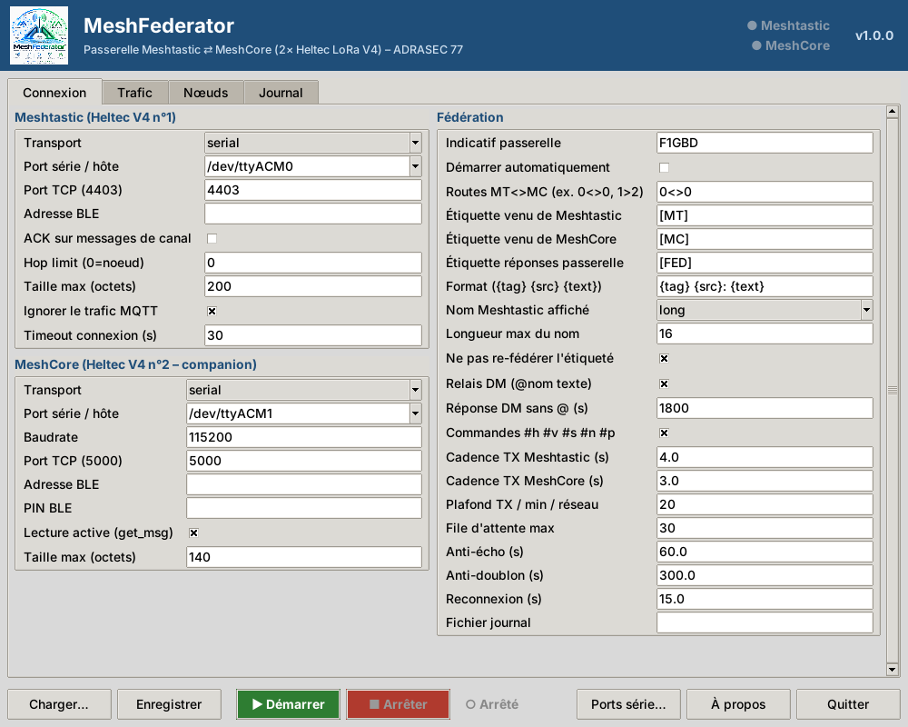
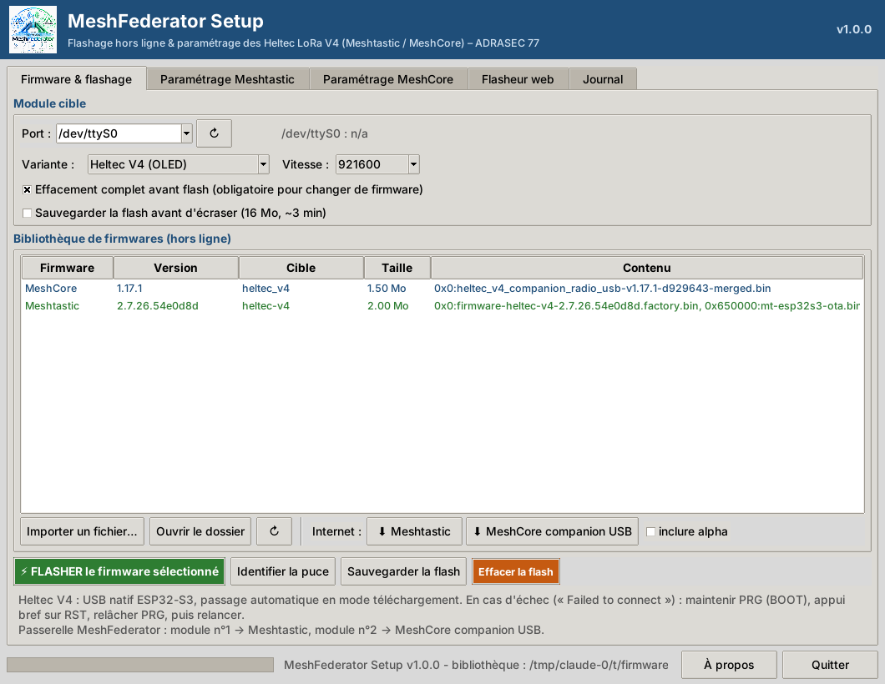
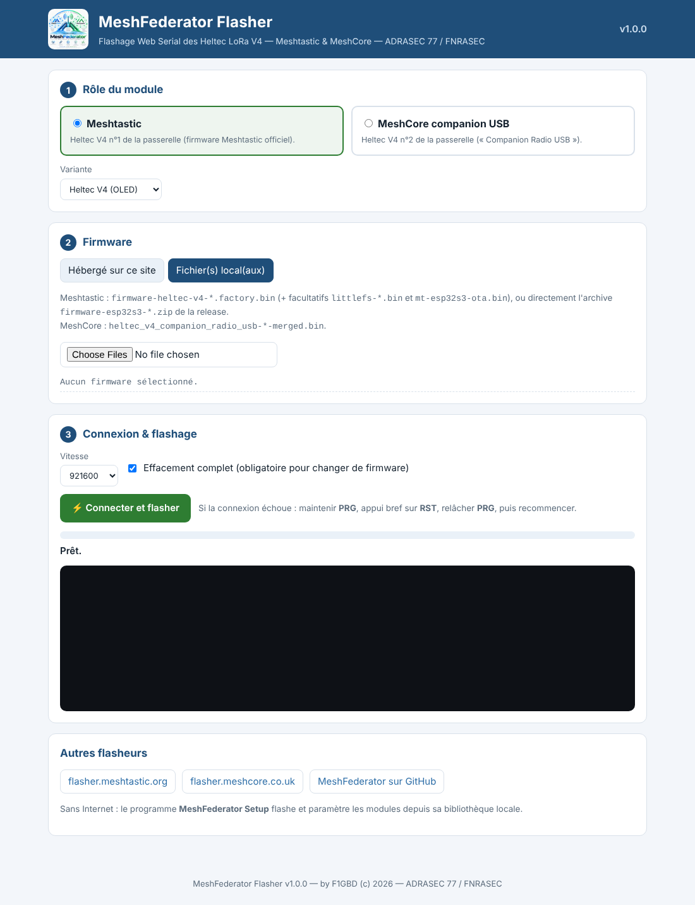

<div align="center">


**Passerelle bidirectionnelle Meshtastic ⇄ MeshCore sur Heltec LoRa V4 ou V3 — ADRASEC 77 / FNRASEC**

### *« Deux maillages, une seule voix. »*

MeshFederator **fédère un réseau Meshtastic et un réseau MeshCore** : chaque message posté sur un canal de l'un est relayé sur le canal correspondant de l'autre, et un opérateur peut envoyer un **message direct** à une station de l'autre réseau. Le pont repose sur **deux Heltec WiFi LoRa 32 V4 ou V3** (un par protocole, firmwares **officiels**) et un PC Windows ou un Raspberry Pi. Même principe que **MeshRNS** (MeshCore ⇄ Reticulum/LXMF), la dorsale étant ici un second réseau LoRa.



> Version courante : **v1.1.0** — nouvelle édition **Raspberry Pi** (service autonome, administration web) — Windows 11 (x64), interface graphique.
### 📥 [**Installer MeshFederator v1.1.0 pour Windows 11 (x64)**](https://github.com/f1gbd/F1GBD/releases/download/meshfederator-v1.1.0/MeshFederator-1.1.0-setup.exe)

*Programme d'installation (sans droits administrateur), firmwares Heltec V3 et V4 inclus. Ou l'[archive 7-Zip](https://github.com/f1gbd/F1GBD/releases/download/meshfederator-v1.1.0/MeshFederator-v1.1.0-win64.7z).*

### 🍓 [**MeshFederator Pi — boîtier autonome Raspberry Pi 5 / 4B**](raspberry/README.md)

### ⚡ [**Flasheur web MeshFederator**](https://f1gbd.github.io/F1GBD/meshfederator/webflasher/) — Chrome / Edge, sans installation

</div>

---

## Principe

```
   Réseau MESHTASTIC (LoRa)                                   Réseau MESHCORE (LoRa)
   EU_868 LongFast 869,525 MHz                                869,618 MHz BW 62,5 SF8
          │                                                            │
   ┌──────┴───────┐   USB    ┌──────────────────┐    USB   ┌───────────┴──────┐
   │ Heltec V4 n°1│══════════│   MeshFederator  │══════════│  Heltec V4 n°2   │
   │  Meshtastic  │  COMx    │  (PC / Raspberry)│   COMy   │ MeshCore companion│
   └──────────────┘          └──────────────────┘          └──────────────────┘
       canal 0  ─────────── route « 0<>0 » ───────────────────  canal 0
       canal 1  ─────────── route « 1>adrasec » ─────────────►  canal « adrasec »
       DM « @F4JHW texte » ─────────────────────────────────►  DM à F4JHW
```

**Pourquoi deux modules ?** Un SX1262 n'écoute qu'**une** modulation à la fois. Meshtastic et MeshCore n'ont ni la même fréquence, ni la même largeur de bande, ni le même facteur d'étalement, ni le même protocole : un module unique qui alternerait entre les deux serait sourd la moitié du temps. Deux modules Heltec avec leurs firmwares officiels donnent un pont **fiable** et **maintenable** (mises à jour Meshtastic/MeshCore indépendantes).

---

## Le kit MeshFederator

| Composant | Rôle |
|---|---|
| **MeshFederator.exe** | La passerelle : routes de canaux, relais DM, commandes `#`, anti-boucle, cadencement, reconnexion automatique. |
| **MeshFederatorSetup.exe** | L'atelier : **flashage hors ligne** des Heltec V4 / V3 (esptool embarqué, bibliothèque de firmwares locale) et **paramétrage** Meshtastic & MeshCore. |
| **webflasher/** | Le **flasheur web** (Web Serial) : flasher un Heltec V4 ou V3 depuis Chrome/Edge, en ligne ou depuis un fichier local. |

---

## Fonctionnalités de la passerelle

- **Routes de canaux** — `0<>0` (bidirectionnel), `1>2` (Meshtastic → MeshCore seulement), `3<1` (MeshCore → Meshtastic), par **index** ou par **nom** (`adrasec<>adrasec`). Plusieurs routes séparées par des virgules.
- **Étiquetage** — chaque message relayé porte l'origine : `[MT] F1GBD: texte` (venu de Meshtastic), `[MC] F4JHW: texte` (venu de MeshCore). Format personnalisable (`{tag} {src}: {text}`).
- **Anti-boucle multi-passerelles** — un message déjà étiqueté (`[MT]`, `[MC]`, `[FED]`) n'est **jamais re-fédéré** : plusieurs MeshFederator peuvent couvrir la même zone sans écho. S'y ajoutent l'anti-écho local (TTL), la déduplication des réceptions et l'exclusion du trafic Meshtastic arrivé par MQTT.
- **Relais DM** — un DM à la passerelle `@F4JHW rendez-vous PC 14h` est remis **en DM** au nœud `F4JHW` de l'autre réseau (nom long, nom court, `!id` Meshtastic ou préfixe de clé MeshCore). Le destinataire peut **répondre sans `@`** : la réponse repart vers son correspondant (fenêtre de 30 min).
- **Commandes `#`** (réponse locale, jamais relayée, marquée `[FED]`) : `#h` aide · `#v` version · `#s` statistiques · `#n [filtre]` nœuds de l'autre réseau entendus < 1 h · `#p` ping (SNR).
- **Découpage** — messages longs découpés `[1/3] …` selon la charge utile de chaque réseau (200 octets Meshtastic, ≈140 MeshCore), l'étiquette répétée sur chaque partie.
- **Respect du rapport cyclique** — cadence minimale par réseau (4 s Meshtastic / 3 s MeshCore par défaut), **plafond d'émissions par minute**, file d'attente bornée (la sous-bande 869,4–869,65 MHz est limitée à 10 %).
- **Reconnexion automatique** — débranchement USB, redémarrage d'un module : la passerelle se reconnecte seule ; elle démarre même si un module est absent.
- **Interface** — onglets **Connexion**, **Trafic** (journal coloré des messages fédérés), **Nœuds** (les deux réseaux), **Journal** ; voyants d'état des deux radios ; assistant **Ports série…** pour attribuer chaque module ; **Vérifier les mises à jour** dans *À propos*.
- **Raspberry Pi** — édition **[MeshFederator Pi](raspberry/README.md)** : service autonome au démarrage, administration web, livrée en image carte SD prête à graver.
- **À propos → Vérifier les mises à jour** — interroge les releases GitHub (`meshfederator-v*`) ; si une version plus récente existe, télécharge le programme d'installation, **contrôle son SHA-256** publié dans les notes de release, puis le lance (réglages, bibliothèque de firmwares et sauvegardes conservés).

---

## MeshFederator Setup — flashage hors ligne & paramétrage



Conçu pour le **terrain sans réseau** : une fois la bibliothèque remplie, tout fonctionne hors ligne.

- **Bibliothèque de firmwares** (`firmware\` à côté de l'exe) : Meshtastic (factory + OTA + LittleFS, adresses lues dans le manifeste `.mt.json`) et MeshCore *companion USB* (image fusionnée). Variantes **Heltec V4**, **V4 TFT**, **V4 R8 OLED**, **V4 R8 TFT** et **Heltec V3**.
- **Téléchargement** (si Internet) des dernières versions officielles : Meshtastic (extraction **sélective** des seuls fichiers de la variante choisie dans l'archive esp32s3 — ≈3 Mo au lieu de 170 Mo) et MeshCore (release `companion-v*`). Option *inclure alpha*.
- **Import** d'un `.bin` ou d'une archive `firmware-esp32s3-*.zip`.
- **Flashage** esptool embarqué : effacement complet, écriture multi-partitions, **sauvegarde de la flash** avant écrasement (8 Mo sur V3, 16 Mo sur V4, dossier `backups\`), **alerte si la variante ne correspond pas au module branché** (CP2102 = V3, USB natif = V4), identification de la puce, effacement seul. Barre de progression.
- **Paramétrage Meshtastic** : nom long/court, région (**EU_868**), preset modem, puissance, hop limit, rôle, canaux (nom, rôle, PSK défaut / aléatoire 128-256 bits / base64), copie et import d'**URL de canaux**, bouton **Preset passerelle**.
- **Paramétrage MeshCore** : nom, preset radio **EU/UK Narrow** (869,618 MHz / 62,5 kHz / SF8 / CR8) ou personnalisé, puissance, canaux (nom + secret, aléatoire), URL de partage `meshcore://`, annonce, redémarrage.
- **Exporter pour le flasheur web** : génère `firmware/index.json` pour publier la bibliothèque à côté du flasheur web.

Pré-remplir la bibliothèque en ligne de commande : `MeshFederatorSetup.exe --download heltec-v4` (ou `heltec-v3`).

---

## Flasheur web



Page unique (`webflasher/index.html`) basée sur **esptool-js** et **Web Serial** (Chrome, Edge — ordinateur) :
1. choisir le **rôle** (Meshtastic ou MeshCore companion USB) et la **variante** ;
2. choisir le firmware **hébergé** sur le site (bibliothèque exportée par MeshFederator Setup) **ou** un **fichier local** (`.bin`, ou directement l'archive `firmware-esp32s3-*.zip` de Meshtastic). Les adresses OTA/LittleFS Meshtastic sont propres à chaque variante (V3 : `0x340000` / `0x670000`, V4 : `0x650000` / `0xC90000`) ; un manifeste `.mt.json` fourni avec les fichiers fait foi ;
3. **Connecter et flasher** (effacement complet optionnel, contrôle que la puce est bien un ESP32-S3).

---

## Matériel

| Élément | Détail |
|---|---|
| 2 × **Heltec WiFi LoRa 32 V4** *ou* **V3** | ESP32-S3, SX1262 (les deux modules peuvent même être de modèles différents) |
| 2 antennes 868 MHz | **séparées d'au moins 50 cm** (idéalement 1 m, polarisations identiques) : les deux émetteurs sont à 93 kHz l'un de l'autre |
| PC Windows 11 / Raspberry Pi 4-5 | 2 ports USB (hub alimenté conseillé sur Raspberry Pi) |

### Heltec V3 ou V4 ?

| | Heltec V3 | Heltec V4 |
|---|---|---|
| Puissance d'émission | ≈ 21-22 dBm (sans ampli) | jusqu'à ≈ 28 dBm (ampli intégré) |
| USB | pont CP2102 (`10C4:EA60`), n° de série distinct par module | USB natif ESP32-S3 |
| Flash | 8 Mo | 16 Mo |
| Firmwares | Meshtastic `heltec-v3`, MeshCore `Heltec_v3_companion_radio_usb` | `heltec-v4`, `heltec_v4_companion_radio_usb` |

Pour une passerelle fixe avec une bonne antenne, le **V3 suffit largement** ; sa puissance plus faible réduit même la désensibilisation mutuelle des deux radios. Ne jamais flasher un firmware V4 sur un V3 (ou l'inverse) : MeshFederator Setup et le flasheur web le signalent.

> ⚠️ **Puissance.** Le Heltec V4 dispose d'un amplificateur (jusqu'à ≈28 dBm). En sous-bande 869,4–869,65 MHz la limite est **500 mW PAR** (27 dBm) et **10 %** de rapport cyclique. Laissez *Puissance TX = 0* côté Meshtastic (maximum légal de la région) et réglez MeshCore en conséquence.

---

## Installation

1. Lancez **`MeshFederator-1.1.0-setup.exe`** : installation par utilisateur (dans `%LOCALAPPDATA%\Programs\MeshFederator`, sans droits administrateur), licence GNU GPL, raccourcis *MeshFederator*, *MeshFederator Setup*, *Flasheur web* et *Bibliothèque de firmwares*. *(Ou décompressez l'archive `MeshFederator-v1.1.0-win64.7z`.)*
   La **bibliothèque de firmwares Heltec V3 et V4** (Meshtastic + MeshCore companion USB) est incluse : aucun accès Internet n'est nécessaire pour flasher.
2. Branchez le **premier** module Heltec, lancez **`MeshFederatorSetup.exe`**, choisissez son port, sélectionnez **Meshtastic** dans la bibliothèque et cliquez **FLASHER**. Onglet *Paramétrage Meshtastic* → **Preset passerelle** → nom long (indicatif) → **Appliquer**.
3. Branchez le **second** module, flashez **MeshCore companion USB**. Onglet *Paramétrage MeshCore* → nom, preset **EU/UK Narrow**, canaux → **Appliquer**.
4. Lancez **`MeshFederator.exe`** : bouton **Ports série…** pour attribuer chaque port, routes (ex. `0<>0`), **Démarrer**.

## Démarrage rapide

```
Routes   : 0<>0                    (Meshtastic canal 0 ⇄ MeshCore canal 0 « Public »)
Sur Meshtastic, F1GBD écrit :      Bonjour MeshCore
Sur MeshCore, on reçoit :          FED-77: [MT] F1GBD: Bonjour MeshCore
Sur MeshCore, F4JHW répond :       Reçu 5/5
Sur Meshtastic, on reçoit :        [MC] F4JHW: Reçu 5/5
```

> En exploitation ADRASEC, préférez des **canaux dédiés et chiffrés** (`adrasec<>adrasec`) plutôt que les canaux publics.

---

## Configuration (`meshfederator.json`)

Créé automatiquement au premier lancement, à côté de l'exécutable.

| Clé | Défaut | Rôle |
|---|---|---|
| `meshtastic.transport` / `port` | `serial` / `COM3` | Heltec V4 Meshtastic : `serial`, `tcp` (hôte, port 4403) ou `ble` |
| `meshtastic.max_bytes` | `200` | charge utile maximale d'un message |
| `meshtastic.ignore_mqtt` | `true` | ne pas fédérer le trafic arrivé via MQTT |
| `meshtastic.want_ack` / `hop_limit` | `false` / `0` | ACK sur les messages de canal / hop limit (0 = réglage du nœud) |
| `meshcore.transport` / `port` | `serial` / `COM4` | Heltec V4 MeshCore companion : `serial`, `tcp` (port 5000) ou `ble` |
| `meshcore.manual_poll` | `true` | lecture active (`get_msg`), la plus fiable |
| `meshcore.max_chars` | `140` | charge utile maximale (ajustée au nom du nœud) |
| `local_call` | `NOCALL` | indicatif de la passerelle (`#v`, `#p`) |
| `routes` | `["0<>0"]` | routes MT ⇄ MC (index ou noms) |
| `tag_mt` / `tag_mc` / `tag_fed` | `[MT]` / `[MC]` / `[FED]` | étiquettes |
| `msg_format` | `{tag} {src}: {text}` | format des messages relayés (garder `{tag}` en tête) |
| `sender_style` / `sender_max_len` | `long` / `16` | nom Meshtastic affiché (`long`, `short`, `id`) |
| `skip_tagged` | `true` | ne pas re-fédérer un message étiqueté (anti-boucle) |
| `dm_relay` / `dm_reply_window` | `true` / `1800` | relais DM `@nom`, réponse sans `@` (s) |
| `commands_enabled` | `true` | commandes `#h #v #s #n #p` |
| `tx_interval_mt` / `tx_interval_mc` | `4.0` / `3.0` | délai minimal entre deux émissions (s) |
| `rate_limit_per_min` / `queue_max` | `20` / `30` | plafond d'émissions par minute et par réseau / file maximale |
| `antiloop_ttl` / `rx_dedup_ttl` | `60` / `300` | anti-écho / anti-doublon (s) |
| `reconnect_interval` | `15` | délai entre deux tentatives de reconnexion (s) |
| `auto_start` / `log_file` | `false` / `""` | démarrage automatique / fichier journal |

---

## Commandes du canal (`#…`)

| Commande | Réponse (préfixée `[FED]`, sur le canal ou en DM d'origine) |
|---|---|
| `#h` ou `#?` | liste des commandes et syntaxe du relais DM |
| `#v` | `MeshFederator v1.1.0 <indicatif>` |
| `#s` | durée de fonctionnement, messages fédérés dans chaque sens, DM, rejets, état des deux radios |
| `#n [filtre]` | nœuds de **l'autre** réseau entendus depuis moins d'une heure |
| `#p` | `pong <émetteur> SNR x dB` |

---

## Dépannage

- **« Meshtastic et MeshCore utilisent le MÊME port »** → chaque module a son propre port : utilisez **Ports série…** (branchez-les un par un pour les reconnaître).
- **MeshCore : « aucune réponse »** → le module n'a pas le firmware **Companion Radio USB** (le firmware *BLE* ou *repeater* ne répond pas en USB).
- **Meshtastic connecté mais rien ne part** → région `UNSET` (radio muette) : *MeshFederator Setup* → **Preset passerelle** → **Appliquer**.
- **Route inactive : canal introuvable** → le nom de canal n'existe pas sur le module ; utilisez l'index ou créez le canal.
- **Messages en double / ping-pong entre deux passerelles** → gardez `skip_tagged = true` et un `msg_format` commençant par `{tag}`.
- **« Failed to connect » au flashage** → maintenir **PRG**, appui bref sur **RST**, relâcher **PRG**, recommencer ; baisser la vitesse à 460 800.
- **DM `@nom` : « inconnu »** → côté MeshCore, la station doit être un **contact** du companion (elle doit s'être annoncée) ; côté Meshtastic, le nœud doit figurer dans la base de nœuds.

---

## Mise à jour et désinstallation

- **Mise à jour** : *À propos* → *Vérifier les mises à jour* (dans MeshFederator comme dans MeshFederator Setup), ou relancer un `setup.exe` plus récent par-dessus l'installation existante.
- **Désinstallation** (Paramètres Windows → Applications) : le programme est retiré ; `meshfederator.json`, les sauvegardes de flash (`backups\`) et les firmwares que vous avez ajoutés **restent en place**.

## Licence & auteur

**MeshFederator** — *a Meshtastic ⇄ MeshCore federation gateway for Heltec LoRa V4/V3* — par **F1GBD** (c) 2026 — **ADRASEC 77 / FNRASEC**. Licence GNU GPL v3.

Meshtastic® est une marque déposée de Meshtastic LLC. MeshCore est un projet open source indépendant. MeshFederator n'est affilié à aucun des deux projets.

## 📄 Documentation associée

- 📘 **[Manuel technique opérateur](https://github.com/f1gbd/F1GBD/blob/master/meshfederator/documents/MANUEL_MeshFederator.pdf)** — Installation, préparation des modules Heltec et paramétrage de la passerelle (PDF, [Word](https://github.com/f1gbd/F1GBD/blob/master/meshfederator/documents/MANUEL_MeshFederator.docx))
- 🧾 **[CHANGELOG](https://github.com/f1gbd/F1GBD/blob/master/meshfederator/CHANGELOG.md)** — Historique des versions
- 🔗 **[MeshRNS](https://github.com/f1gbd/F1GBD/tree/master/meshrns)** — Passerelle MeshCore ⇄ Reticulum/LXMF

<div align="center">

### 📡 Auteur

**Jean-Louis (F1GBD)**
*ADRASEC 77 — FNRASEC*

**Version 1.1.0 — Octobre 2026**

---

*Pour toute question, contactez votre référent ADRASEC départemental.*

</div>
