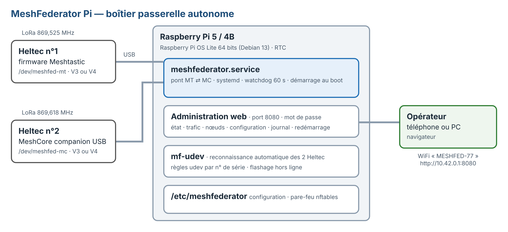
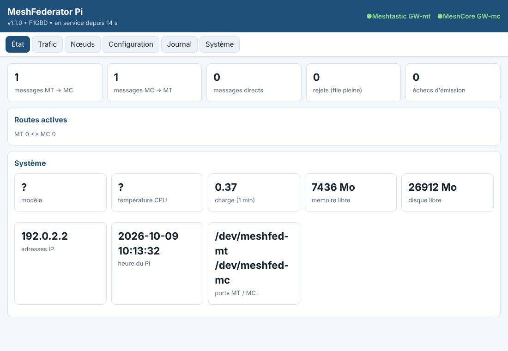
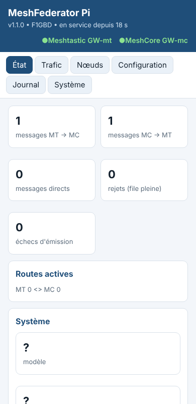
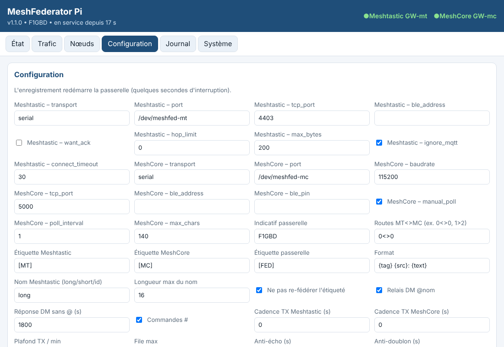

<div align="center">


# MeshFederator Pi

**La passerelle Meshtastic ⇄ MeshCore en boîtier autonome — Raspberry Pi 5 ou 4B — ADRASEC 77 / FNRASEC**

### *« On le pose, on le branche, il fédère. »*

### 📥 [**Télécharger l'image carte SD MeshFederator Pi v1.1.0**](https://github.com/f1gbd/F1GBD/releases/tag/meshfederator-pi-arm64-v1.1.0)

</div>

MeshFederator Pi exécute la même passerelle que la version Windows sur un Raspberry Pi, **sans écran** : elle démarre seule au boot, retrouve les deux modules Heltec, et s'administre depuis un téléphone ou un PC par le **point d'accès WiFi du Pi**. Elle est livrée sous forme d'une **image carte SD prête à l'emploi** (Raspberry Pi OS Lite 64 bits + MeshFederator) : tout s'installe **hors ligne**, application, bibliothèques et firmwares Heltec V3/V4 compris.



---

## Matériel

| Élément | Recommandé | Remarques |
|---|---|---|
| Raspberry Pi | **Pi 5 (4 Go)** | Pi 4B (2 Go et plus) accepté |
| Alimentation | **officielle 27 W USB-C** (Pi 5) / 15 W (Pi 4B) | sans l'alimentation 27 W, le Pi 5 limite les ports USB à 600 mA au total |
| Carte microSD | 16 Go ou plus, classe **A2** (endurance) | ou SSD NVMe sur Pi 5 |
| Horloge | Pi 5 : **RTC intégrée** + pile sur le connecteur J5 | Pi 4B : module **DS3231** (I2C), `RTC="ds3231"` |
| Radios | 2 × **Heltec WiFi LoRa 32 V3 ou V4** | n°1 Meshtastic, n°2 MeshCore *companion USB* |
| Antennes | 2 × 868 MHz, **≥ 50 cm d'écart** | les deux fréquences ne sont qu'à 93 kHz l'une de l'autre |

Hors réseau, sans horloge RTC, le Pi redémarre à une date fausse : l'horodatage MeshCore et les journaux en pâtissent. La passerelle recopie l'heure du Pi dans le companion MeshCore à chaque connexion.

---

## Installation

1. **Graver l'image.** Dans [Raspberry Pi Imager](https://www.raspberrypi.com/software/) : *Appareil* = Raspberry Pi 5 (ou 4) → *Système* = **Utiliser une image personnalisée** → `MeshFederatorPi-v1.1.0-….img.xz` → *Stockage* = la carte SD. Acceptez la **personnalisation** : nom d'hôte (ex. `meshfed77`), utilisateur et mot de passe, **SSH**, et si besoin le WiFi de la cellule.
2. **Régler la passerelle avant le premier démarrage.** Retirez puis réinsérez la carte : sous Windows apparaît le lecteur **bootfs**. Ouvrez `meshfederator.conf` avec le Bloc-notes et renseignez au minimum :

   ```ini
   CALLSIGN="F1GBD"
   ROUTES="0<>0"
   WEB_PASSWORD="un-vrai-mot-de-passe"
   WIFI_AP_SSID="MESHFED-77"
   WIFI_AP_PASSWORD="mot-de-passe-wifi"
   RTC="auto"          # "ds3231" sur Pi 4B avec module RTC
   MODE="service"      # "desktop" : Pi avec écran, interface graphique à l'ouverture de session
   ```
3. **Brancher et démarrer.** Carte dans le Pi, les deux Heltec **déjà flashés** (voir plus bas) en USB avec leurs antennes, puis l'alimentation. Le premier démarrage dure **3 à 5 minutes** : extension de la carte, installation de MeshFederator, reconnaissance des deux modules, création du point d'accès WiFi.
4. **Se connecter.** Depuis un téléphone, rejoignez le WiFi **MESHFED-77** puis ouvrez **http://10.42.0.1:8080** (utilisateur `admin`, le mot de passe `WEB_PASSWORD`). Si le Pi est sur le réseau de la cellule : `http://meshfed77.local:8080`.
5. **Vérifier.** Onglet **État** : les deux voyants affichent le nom des nœuds. Envoyez `#v` sur le canal routé : la passerelle répond `[FED] MeshFederator v1.1.0 …`.

Après l'installation, le mot de passe est effacé du fichier `meshfederator.conf` (seule son empreinte est conservée dans `/etc/meshfederator`).

<div align="center">&nbsp;&nbsp;</div>

Pour équiper plusieurs boîtiers d'une même cellule à l'identique, préparez un `meshfederator.conf` type et recopiez-le sur la partition **bootfs** de chaque carte après gravure.

---

## Flasher les Heltec depuis le Pi

Les firmwares Meshtastic et MeshCore *companion USB* (Heltec V3 et V4) sont inclus dans l'image.

```bash
meshfederator-setup --list-library
sudo systemctl stop meshfederator                    # libère les ports USB
sudo meshfederator-setup --flash /dev/ttyACM0 --fw meshtastic --variant heltec-v4
sudo meshfederator-setup --flash /dev/ttyACM1 --fw meshcore   --variant heltec-v4
sudo mf-udev --auto --restart                        # ré-identifie et relance la passerelle
```

Variantes : `heltec-v4`, `heltec-v4-tft`, `heltec-v4-r8-oled`, `heltec-v4-r8-tft`, `heltec-v3`. Le paramétrage radio (région EU_868, canaux) se fait ensuite avec l'application Meshtastic / MeshCore, ou avec **MeshFederator Setup** en mode bureau.

---

## Exploitation

| Besoin | Commande / accès |
|---|---|
| Administration | `http://<Pi>:8080` — État, Trafic, Nœuds, Configuration, Journal, Système |
| État du service | `systemctl status meshfederator` |
| Journal en direct | `journalctl -u meshfederator -f` |
| Ports des modules | `sudo mf-udev --list` · `sudo mf-udev --show` |
| Ré-identifier les modules | `sudo mf-udev --auto --restart` (ou bouton web) · assistant : `sudo mf-udev --wizard` |
| Configuration | `/etc/meshfederator/meshfederator.json` (ou onglet Configuration) |
| Mot de passe web | `sudo meshfederator --set-web-password <nouveau> -c /etc/meshfederator/meshfederator.json` |
| Mise à jour | graver la nouvelle image, reporter les réglages dans `meshfederator.conf` (bootfs) avant le premier démarrage |

Les modules sont retrouvés par leur **numéro de série USB** (`/dev/meshfed-mt`, `/dev/meshfed-mc`), quel que soit le port utilisé. Si les deux modules ont le même numéro de série (certains Heltec V3 à pont CP2102), la règle se rabat sur le **port USB physique** : gardez alors chaque module sur le même port.



---

## Robustesse et sécurité

- **Service systemd** : redémarrage automatique, chien de garde 60 s, arrêt propre (ports libérés).
- **Coupures d'alimentation** : configuration écrite de façon atomique ; journal limité à 50 Mo. Pour un boîtier exposé, activez en plus l'*overlay* en lecture seule (`sudo raspi-config` → Performance → Overlay File System) une fois la configuration figée.
- **Administration web** : mot de passe stocké en empreinte PBKDF2, blocage après 5 échecs, port 8080 ouvert aux seuls réseaux locaux (pare-feu nftables), actions système limitées par `sudoers`.
- **Point d'accès WiFi** : utilisé seulement si aucun réseau WiFi connu n'est visible.

---

## Dépannage

| Symptôme | Action |
|---|---|
| Pas de WiFi « MESHFED-77 » | `nmcli con up meshfed-ap` ; vérifier `WIFI_AP_PASSWORD` (8 caractères min.) et `WIFI_COUNTRY` |
| Page web inaccessible | `systemctl status meshfederator` ; mot de passe défini ? (`--set-web-password`) |
| Voyant Meshtastic ou MeshCore HS | `sudo mf-udev --list` puis `sudo mf-udev --auto --restart` ; firmware correct ? |
| Heure fausse après coupure | Pi 5 : pile RTC sur J5 ; Pi 4B : module DS3231 + `RTC="ds3231"` |
| Installation au premier démarrage | journal : `/var/log/meshfederator-install.log` |

---

<div align="center">

**MeshFederator Pi v1.1.0 — F1GBD (c) 2026 — ADRASEC 77 / FNRASEC — licence GNU GPL v3**

</div>
