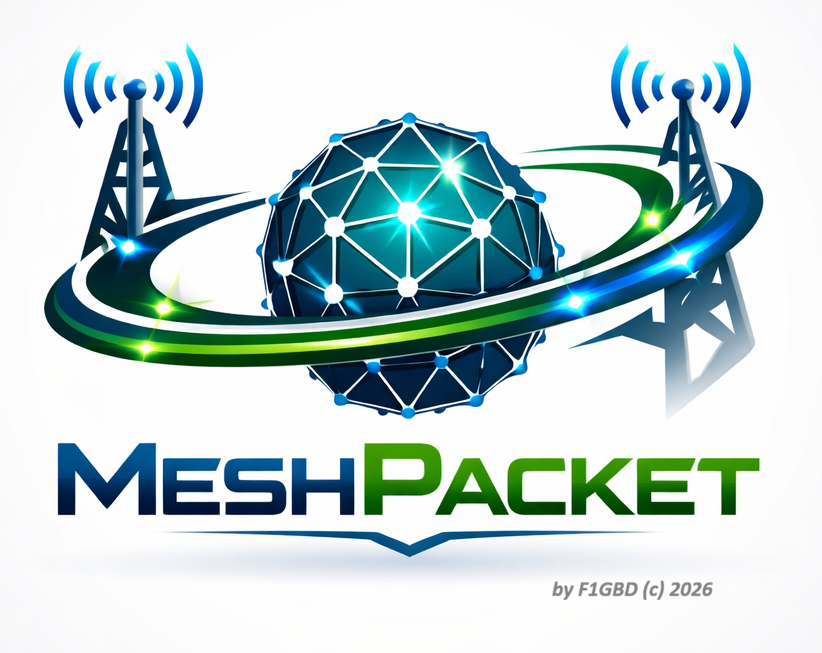

<div align="center">




**Passerelle Packet pour MeshCore — ADRASEC 77 / FNRASEC**

MeshPacket relie **deux réseaux radio MeshCore** (LoRa) à travers une **dorsale VHF Packet AX.25**. Le même programme tourne aux deux extrémités : les messages d'un canal MeshCore d'un site sont encapsulés, transmis en VHF (1200 bauds AFSK ou TNC KISS), puis réinjectés sur le réseau MeshCore du site distant — et inversement. C'est l'équivalent d'AirLink, mais avec AX.25 comme transport au lieu de LoRa, ce qui permet de franchir de plus longues distances via un relais packet.


> Version courante : **v1.1.12** — Windows (interface graphique).
### 📥 [**Télécharger la dernière version pour Windows 11 (x64)**](https://github.com/f1gbd/F1GBD/releases/download/meshpacket-v1.1.12/MeshPacket-v1.1.12-win64.7z)

*Archive **7-Zip** (.7z) — Windows 11 l'extrait nativement ; sinon installez [7-Zip](https://www.7-zip.org).*

</div>

---

## Principe

```
Réseau MeshCore A                                   Réseau MeshCore B
 (clients LoRa)                                       (clients LoRa)
      │                                                     │
   companion A ── USB/série ──┐                ┌── USB/série ── companion B
                              │                │
                        ┌─────┴──────┐   ┌─────┴──────┐
                        │ MeshPacket │   │ MeshPacket │
                        │  (poste A) │   │  (poste B) │
                        └─────┬──────┘   └─────┬──────┘
                              │  VHF Packet AX.25 │
                          Direwolf / TNC ⇄ Direwolf / TNC
                              └───────  RF  ──────┘
```

Chaque passerelle est membre d'un **canal de routage MeshCore commun** (canal public ou canal privé dédié partagé, ex. `adrasec-xx`). Tout message posté sur ce canal est relayé vers l'autre réseau.

---

## Fonctionnalités

- **Deux backends KISS au choix :**
  - **Direwolf** (KISS sur TCP) — modem son 1200 AFSK + PTT ;
  - **TNC KISS matériel** sur port série ou Bluetooth (ex. **VR-N76** : la radio *est* le TNC, sans Direwolf ni carte son).
- **Lancement automatique de Direwolf** au démarrage (dans son propre dossier, pour qu'il trouve son `direwolf.conf`).
- **Lecture active des messages MeshCore** (`get_msg`) : interroge directement le companion au lieu de dépendre de l'auto-fetch d'événements, qui ne remonte pas toujours les messages de canal selon le firmware.
- **Fiabilité applicative** : accusé de réception (ACK), retransmission, dédoublonnage en réception, anti-boucle (anti-écho) entre passerelles.
- **Fragmentation AX.25** des messages dépassant la taille MeshCore.
- **Canal de réinjection configurable** pour router un canal privé même si son index diffère d'un nœud à l'autre.
- **Configuration persistante** (`meshpacket.json`, rechargée au démarrage) + chargement/enregistrement de profils nommés.
- **Interface graphique** Tkinter (onglet *Connexion* défilable + onglet *Journal* en temps réel), écran d'accueil, fenêtre *À propos*.
- **Modes console** : exécution sans interface, auto-test, génération de configuration.

---

## Prérequis


- Un **companion MeshCore** (nœud LoRa) connecté en USB/série (ou TCP / BLE).
- Selon le backend radio :
  - **Mode Direwolf** : Direwolf 1.8+ installé (par défaut `c:\direwolf\direwolf.exe`) avec un `direwolf.conf` valide et une interface audio vers la radio ;
  - **Mode série** : un **TNC KISS matériel** (ex. Pocket VGC VR-N76 passé en mode KISS-TNC, 19200 bauds).

---

## Installation
### 📥 [**Télécharger la dernière version pour Windows 11 (x64)**](https://github.com/f1gbd/F1GBD/releases/download/meshpacket-v1.1.12/MeshPacket-v1.1.12-win64.7z)

*Archive **7-Zip** (.7z). Décompressez-la (Windows 11 nativement, ou [7-Zip](https://www.7-zip.org)), puis lancez `MeshPacket.exe`. Conservez `MeshPacket.png`, `MeshPacket.ico` et `meshpacket.json` à côté de l'exécutable.*

---

## Démarrage rapide

1. Lancez MeshPacket. L'onglet **Connexion** présente trois groupes de réglages.
2. **MeshCore (companion)** : choisissez le transport (`serial`/`tcp`/`ble`), le port (ex. `COM3`) et le débit. Laissez **Lecture active (get_msg)** cochée.
3. **TNC / AX.25** : sélectionnez le **Mode** (`direwolf` ou `serial`). En mode Direwolf, cochez **Lancer Direwolf** et vérifiez **Chemin Direwolf**. En mode série, renseignez **Port série / BT** et le **Baudrate série**.
4. **Lien & fiabilité** : **Indicatif local** = cette passerelle, **Indicatif pair** = la passerelle d'en face. Laissez **Canaux écoutés** vide pour router tous les canaux. Activez **Accusé applicatif (ACK)** pour un lien à deux passerelles.
5. Cliquez **▶ Démarrer**. Le voyant passe à **● En service**. Suivez les échanges dans l'onglet **Journal**.

La configuration affichée est enregistrée automatiquement dans `meshpacket.json` au démarrage et à la fermeture, puis rechargée au lancement suivant.

---

## Configuration (`meshpacket.json`)

Exemple (mode Direwolf, poste F1GBD vers F8KSM) :

```json
{
  "meshcore": {
    "transport": "serial", "port": "COM3", "baudrate": 115200,
    "manual_poll": true, "poll_interval": 1.0
  },
  "tnc": {
    "mode": "direwolf", "host": "127.0.0.1", "kiss_port": 8001,
    "direwolf_autostart": true, "direwolf_path": "c:\\direwolf\\direwolf.exe",
    "direwolf_config": ""
  },
  "local_call": "F1GBD", "local_ssid": 1,
  "peer_call": "F8KSM", "peer_ssid": 2,
  "channels": [], "channel_map": {}, "inject_channel": -1,
  "tunnel_direct_to_channel": -1,
  "ack_enabled": true, "ack_timeout": 6.0, "ack_max_retries": 4,
  "rx_dedup_ttl": 120.0, "antiloop_ttl": 30.0,
  "paclen": 200, "mc_max_chars": 140
}
```

Les **deux passerelles utilisent la même configuration avec les indicatifs local et pair inversés** : côté F8KSM, `local_call = F8KSM`/`local_ssid = 2` et `peer_call = F1GBD`/`peer_ssid = 1`.

| Champ | Rôle |
| --- | --- |
| `manual_poll` | Lecture active des messages via `get_msg` (recommandé). |
| `direwolf_autostart` / `direwolf_path` | Lancement automatique de Direwolf au démarrage. |
| `channels` | Index des canaux à router (`[]` = tous). |
| `inject_channel` | Canal MeshCore **fixe** de réinjection (`-1` = même index que reçu). |
| `ack_enabled` / `ack_timeout` / `ack_max_retries` | Fiabilité : accusé + délai + nombre de retransmissions. |
| `paclen` / `mc_max_chars` | Découpage AX.25 et taille MeshCore. |

---

## Router un canal privé

Le **canal 0 (public)** existe partout et fonctionne sans réglage. Pour router un **canal privé** :

1. Créez le **même canal privé**, avec la **même clé**, sur les companions des **deux** passerelles (de préférence au même index).
2. Renseignez **Canal réinjection** avec l'index de ce canal sur le companion destinataire.
3. Postez un message : le Journal affiche `MeshCore RX  canal N` puis `MC->AX.25 … canal N`.

Si le firmware refuse (`canal N peut-être refusé`), c'est que le canal n'existe pas avec la même clé sur ce companion.

### Configurer les canaux depuis MeshPacket (bouton « Canaux… »)

Un companion ne **reçoit** les messages d'un canal privé que s'il a ce canal configuré localement (même index **et même clé**). Le canal public (0) est connu de tous ; un canal privé inconnu du companion voit ses messages reçus mais non déchiffrables, donc ignorés en silence.

Le bouton **Canaux…** (barre du bas) ouvre une fenêtre qui :

- **liste les canaux réellement présents** sur le companion (index, nom, empreinte de clé) ;
- permet d'en **créer / configurer un** : index (0-7), nom, et clé optionnelle (32 hexa). Si la clé est laissée vide, elle est **dérivée du nom** (`SHA-256(nom)`), ce qui est le plus simple : il suffit d'employer le **même nom de canal** sur toutes les extrémités pour obtenir la même clé.
- **« Lire le canal »** récupère le nom et la **clé** réels d'un index donné (pour comparer/copier la clé entre nœuds — c'est la clé, pas le nom, qui doit être identique partout).
- **« QR de partage… »** affiche un QR code au **format de l'app MeshCore** (`meshcore://channel/add?name=…&psk=<clé base64>`, clé incluse) : scanné depuis l'app (Canaux → Ajouter → Scanner un QR code), il ajoute le canal prêt à l'emploi.
- **« Importer »** fait l'inverse : colle l'URL d'un canal **copiée depuis l'app** (bouton copier sous son QR), elle est analysée (`psk=` base64 ou `secret=` hex), et les champs Nom + Clé sont remplis. Un clic sur **Configurer ce canal** pose alors sur le companion **exactement la même clé** que le téléphone — c'est le moyen le plus fiable de synchroniser un canal privé existant.

La fenêtre fonctionne que la passerelle soit démarrée (connexion active) ou arrêtée (connexion temporaire au companion). Au démarrage, MeshPacket journalise aussi la liste des canaux configurés sur le companion.

---

## Protocole d'encapsulation

Les messages transportés en AX.25 (trames UI) utilisent un en-tête textuel simple :

**Notes :** Les messages MeshCore transportés en AX.25 sont **en CLAIR** et **non cryptés**.

```
MCG1|D|<seq>|<canal>|<texte>      données
MCG1|A|<seq>                      accusé de réception
```

Exemple observé côté Direwolf :

```
[0L] F1GBD-1>F8KSM-2:MCG1|D|1|0|F1GBD/P: test meshpacket via canal public
```

---

## Dépannage

- **Aucune ligne `MeshCore RX` à la réception d'un message de canal** → la lecture active (`get_msg`) doit être activée ; certains firmwares ne déclenchent pas l'auto-fetch d'événements de canal.
- **`MeshCore RX` apparaît mais pas `MC->AX.25`** → message filtré : vérifiez **Canaux écoutés** et le message anti-écho du Journal.
- **La trame part 4 fois puis « abandon »** → comportement normal de l'ACK applicatif quand la passerelle d'en face ne renvoie pas d'accusé. Pour un test en solo, **décochez Accusé applicatif (ACK)**.
- **Direwolf ne démarre pas** → vérifiez **Chemin Direwolf** ; en mode série/VR-N76, décochez **Lancer Direwolf**.

---

## Licence & auteur

**MeshPacket** — *a Packet Gateway for MeshCore* — par **F1GBD** (c) 2026 — **ADRASEC 77 / FNRASEC**.

## 📄 Documentation associée

- 📘 **[Manuel utilisateur MeshPacket](https://github.com/f1gbd/F1GBD/blob/master/meshpacket/documentation/MEMO%20-%20MANUEL%20MeshPacket.pdf)** — Manuel Utilisateur et Paramétrage de MeshPacket
- 📋 **[Fiche de présentation MeshPacket](https://github.com/f1gbd/F1GBD/blob/master/meshpacket/documentation/MEMO%20-%20Fiche%20Technique%20MeshPacket.pdf)** — Fiche Technique MeshPacket

---

<div align="center">

### 📡 Auteur

**Jean-Louis Naudin (F1GBD)**
*ADRASEC 77 — FNRASEC*

**Version 1.1.12 — Juin 2026**

---

*Pour toute question, contactez votre référent ADRASEC départemental.*

</div>
