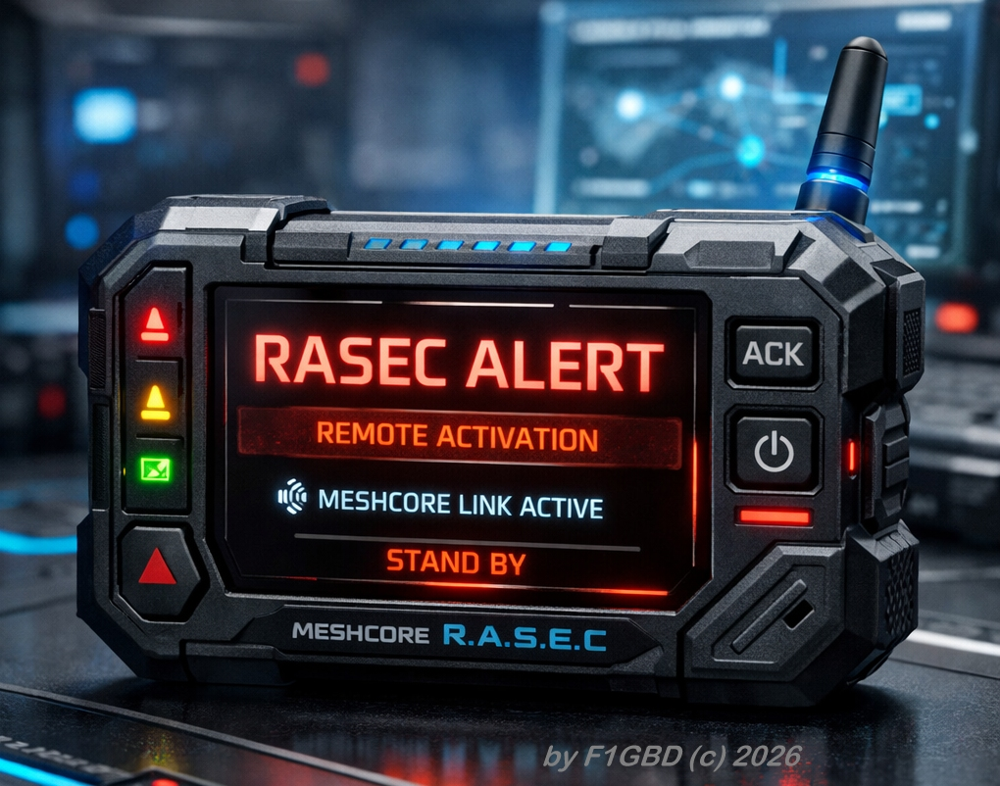
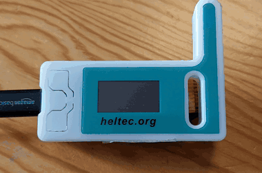
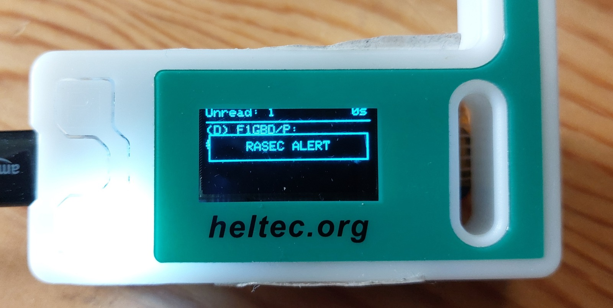

# MeshPager — PAGER RASEC ALERT (MeshCore / Heltec V3)

Transforme un module **Heltec WiFi LoRa 32 V3** (firmware companion BLE MeshCore v1.16)
en **pager d'alerte** pour la chaîne ADRASEC. À réception d'une commande d'activation
envoyée en chat (depuis TCQ ou une application cliente MeshCore), le pager signale
l'alerte de façon **visuelle et sonore** et confirme la bonne réception à l'émetteur.

> Projet **ADRASEC 77 / FNRASEC** — F1GBD / F4JHW. Usage exercices et opérations SATER / ORSEC.

<p align="center">
  
</p>

<p align="center">
  
</p>


---

## Fonctionnement

À réception de la commande **`#ra <code>`** (message direct ou canal) :

- **Écran OLED** : affichage plein écran « RASEC ALERT ».
- **LED blanche** : clignotement rapide par **séries de 3 impulsions**.
- **Buzzer piezo** (sur **GPIO 4**) : **3 bips** par défaut (réglable par `#b <n>`).
- **Alarme continue** possible (`#b 0`) : bips en boucle jusqu'à **acquittement** par la touche **USER**.
- **Accusé de réception** : renvoyé automatiquement à l'émetteur (message direct).
- **Écran d'accueil** dédié : titre, signature et **compteur d'alertes reçues**.

<p align="center">
  
</p>
<p align="center">
  
</p>

<p align="center"><em>Réception d'une alerte « RASEC ALERT » sur un pager Heltec V3.</em></p>

---

## Paramètres radio (France)

Le firmware est compilé avec les paramètres LoRa ADRASEC pour la France :

| Fréquence | Bande passante | Spreading Factor | Coding Rate |
|---|---|---|---|
| **869.618 MHz** | **62.5 kHz** | **8** | **8** |

Ces valeurs sont figées au build (flags `LORA_FREQ / LORA_BW / LORA_SF / LORA_CR`).

> ⚠️ **Effacer la mémoire au flashage.** MeshCore enregistre les paramètres radio :
> les valeurs figées ne s'appliquent qu'à l'initialisation. Lors du flashage, choisir
> **« Erase device / Effacer »** pour qu'elles prennent effet — sinon les réglages
> précédemment enregistrés persistent. Vérification : bouton **USER** → page radio,
> lire `FQ 869.618 · BW 62.50 · SF 8 · CR 8`.

Tous les nœuds du réseau doivent partager **exactement** ces paramètres pour communiquer.

---

## Matériel

- **Heltec WiFi LoRa 32 V3** (ESP32-S3, écran OLED 0,96", LED blanche, bouton USER).
- Câble USB-C.
- **Buzzer piezo passif** sur **GPIO 4** (borne + sur GPIO 4, borne − sur GND).
- (Optionnel) module relais pour une variante TOR.

---

## Buzzer (GPIO 4)

Le firmware active un **buzzer piezo passif** sur **GPIO 4** : à chaque `#ra <code>`
reçu, le pager émet **3 bips** (et un court jingle au démarrage). Câblage direct :

```
GPIO 4  ──►│─── borne +  (piezo passif)
GND     ────── borne −
```

> Piezo **passif** requis (pas un buzzer actif auto-oscillant). Pour un buzzer plus
> puissant, l'interposer via un transistor (voir fiche technique).

---

## Flashage (opérateurs)

### ⚡ Méthode 1 — Bouton « Install » en un clic (recommandé)

➡️ **[Installer le firmware Pager](https://f1gbd.github.io/F1GBD/meshpager/)**  (Chrome ou Edge)

Brancher la Heltec V3 en USB, cliquer **Installer le firmware Pager**, **choisir
« Erase device / Effacer »** (pour appliquer les paramètres radio France), laisser
flasher, puis **RST**. Le binaire est servi par GitHub Pages (même origine), donc le
flashage web fonctionne directement.

> Connexion impossible ? Maintenir **BOOT**, appuyer/relâcher **RST**, relâcher **BOOT**, puis réessayer.

### Méthode 2 — Télécharger le binaire et flasher

1. Télécharger **[`pager_rasec_heltecv3.bin`](https://github.com/f1gbd/F1GBD/releases/latest/download/pager_rasec_heltecv3.bin)** (dernière release).
2. Ouvrir **https://espressif.github.io/esptool-js/** (Chrome/Edge), **Connect**, effacer la flash, fichier à l'adresse `0x0`, **Program**.

### Méthode 3 — esptool (ligne de commande)

```bash
pip install esptool
esptool --chip esp32s3 --port COM3 --baud 921600 erase_flash
esptool --chip esp32s3 --port COM3 --baud 921600 write_flash 0x0 pager_rasec_heltecv3.bin
```

---

## Appairage Bluetooth (BLE)

Pour configurer le pager depuis l'application MeshCore, l'appairage BLE demande un
**code PIN**. Ce PIN s'affiche **au démarrage**, sur l'écran de logo (splash), sous la
date :

```
Pin BLE: 772677
```

- Le PIN est **fixe** (`772677`) grâce au flag `-D BLE_PIN_CODE=772677`. Sans ce flag,
  il est **aléatoire** et régénéré à chaque démarrage (à relire au splash).
- Dans l'appli MeshCore : lancer l'appairage, puis saisir ce code.

> ℹ️ Après un flashage **Erase**, l'identité du nœud change : il faut **re-ajouter le
> pager comme contact** dans TCQ / l'application (il ré-émet une annonce au démarrage)
> avant de pouvoir lui envoyer un message direct.

---

## Utilisation

Depuis TCQ ou une application cliente MeshCore, envoyer au pager (message direct
recommandé, ou canal commun) :

```
#ra ADRASEC77
```

- Le préfixe `#ra` doit être en début de message, suivi d'un espace puis du **code exact** (casse respectée).
- Un code erroné ne déclenche rien.
- En message direct, l'émetteur reçoit l'accusé « Pager OK - alerte bien recue ».

Le code d'activation par défaut est `ADRASEC77` ; il se personnalise au build
(`-D PAGER_ACTIVATION_CODE`). Il peut aussi être **changé à distance** (message direct) :
```
#rapass <ancien_code> <nouveau_code>
```
Le pager répond « Code RASEC mis a jour » ; le nouveau code est persistant (survit au redémarrage).

### Nombre de bips et alarme continue

Le nombre de bips de l'alarme se règle à distance (message direct), valeur **persistante** :
```
#b <n>
```
- `#b 5` → l'alarme sonnera **5 bips** (défaut : **3**). Réponse : « Bips d'alarme regles sur 5 ».
- `#b 0` → **alarme continue** : séquences de 3 bips espacées d'~1 s, **indéfiniment**, jusqu'à ce qu'un opérateur **acquitte** en appuyant sur la touche **USER** (bouton du haut du Heltec V3). Le pager affiche alors « Alerte acquittee ».

> La touche **USER** acquitte / coupe toute alerte en cours (même une alerte normale de quelques secondes). En mode continu, une **borne de sécurité de 30 min** coupe l'alarme si personne n'acquitte.

---

## Documentation

- 📄 **Fiche réflexe** (envoyer / tester l'alerte) : [`Fiche_reflexe_RASEC_ALERT.pdf`](https://github.com/f1gbd/F1GBD/blob/master/meshpager/documentation/Fiche_reflexe_RASEC_ALERT.pdf)
- 📘 **Fiche technique** (mise en œuvre complète) : [`Fiche_PAGER_RASEC_ALERT_ADRASEC.pdf`](https://github.com/f1gbd/F1GBD/blob/master/meshpager/documentation/Fiche_PAGER_RASEC_ALERT_ADRASEC.pdf)

---

Options (buzzer, textes, durées) : voir la fiche technique.

### Principaux paramètres (`build_flags`)

| Flag | Défaut | Rôle |
|---|---|---|
| `PAGER_ACTIVATION_CODE` | `ADRASEC77` | Code attendu après `#ra` (valeur d'usine) |
| `PAGER_ALERT_MS` | `6000` | Durée de l'alerte (écran + LED), ms |
| `PAGER_HOME` | (non défini) | Active l'écran d'accueil pager |
| `PIN_BUZZER` | `4` | Broche du buzzer piezo (GPIO 4) |
| `PAGER_ALSO_MATCH_TEXT` | (non défini) | Accepte aussi le texte brut « RASEC ALERT » |
| `BLE_PIN_CODE` | (aléatoire) | Code d'appairage BLE fixe (≠ 123456), affiché au splash |
| `LORA_FREQ` | `869.618` | Fréquence LoRa (MHz) — France |
| `LORA_BW` | `62.5` | Bande passante (kHz) |
| `LORA_SF` | `8` | Spreading factor |
| `LORA_CR` | `8` | Coding rate |

---

## Auteur & licence

**Jean-Louis — F1GBD**, ADRASEC 77.
Basé sur MeshCore (voir la licence du projet MeshCore pour le firmware de base).

73 !
