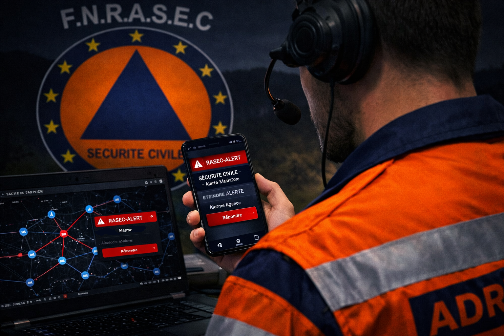

  

**Récepteur d'alerte RASEC de sécurité civile sur Android**

*par F1GBD — ADRASEC 77 / FNRASEC*

# RASEC-ALERT Pager — Application Android
RASEC-ALERT Pager transforme un téléphone Android, couplé en Bluetooth à un
nœud **MeshCore** (Heltec, T-Deck…), en **récepteur d'alerte de sécurité
civile**. À la réception d'un message `#ra <code>` sur le mesh — en message
direct ou sur un canal partagé — le téléphone déclenche un **écran plein
écran clignotant « RASEC ALERT »** avec compteur d'alertes et **sirène**.
Acquittement en touchant l'écran.

C'est le pendant mobile du pager RASEC-ALERT du **T-Deck** : même déclencheur
(`#ra`, `#rapass`, `#b`) et même comportement, pour que T-Deck et smartphones
réagissent de façon identique sur le réseau ADRASEC.

L'application est dérivée de [MeshCore Open](https://github.com/zjs81/meshcore-open)
(licence MIT), dont elle réutilise toute la pile Bluetooth / protocole
companion ; seule la fonction d'alerte RASEC a été ajoutée.

## Téléchargement

L'application est distribuée sous forme de fichier **APK** (installation
directe, hors Google Play).

➡️ **[Télécharger la dernière version Android](https://github.com/f1gbd/F1GBD/releases/download/meshpager-android-v1.0.0/RASEC-ALERT-Pager.apk)**

> Le dépôt `f1gbd/F1GBD` héberge plusieurs projets (TCQ, IAbrain, d-IA,
> EPIRBdecoder, MeshPager T-Deck…). Les versions **Android du pager RASEC**
> portent toutes un tag commençant par `meshpager-android-` : le lien
> ci-dessus les filtre, et la plus récente est en haut. Téléchargez le
> fichier `RASEC-ALERT-Pager.apk` de la release la plus récente.

| | |
|---|---|
| **Version** | 1.0 |
| **Taille** | ~230 Mo (APK universel) |
| **Android requis** | 7.0 (API 24) ou supérieur |
| **Architectures** | arm64-v8a, armeabi-v7a, x86_64 (universel — tous appareils) |

---

## Prérequis

- Un nœud **MeshCore** flashé avec le **firmware companion** (le Heltec doit
  exposer le service BLE Nordic UART), appairé à l'app en Bluetooth.
- L'alerte se déclenche depuis un autre nœud du mesh en envoyant
  `#ra ADRASEC77` (code modifiable), en message direct ou sur le canal
  privé partagé.

---

## Installation

Comme l'application ne provient pas du Google Play Store, Android demande une
autorisation pour l'installer. C'est normal pour une application distribuée
directement.

1. **Téléchargez** le fichier `RASEC-ALERT-Pager.apk` sur votre téléphone
   [**RASEC-ALERT Pager v1.0.0**](https://github.com/f1gbd/F1GBD/releases/download/meshpager-android-v1.0.0/RASEC-ALERT-Pager.apk)
2. **Ouvrez** le fichier téléchargé (via la notification de téléchargement
   ou un gestionnaire de fichiers).
3. Android affichera un avertissement *« sources inconnues »* : autorisez
   l'installation pour cette fois (ou pour votre navigateur / gestionnaire
   de fichiers).
4. Si **Google Play Protect** affiche *« Appli non sécurisée bloquée »* :
   touchez **« Plus de détails »** puis **« Installer quand même »**. Cet
   avertissement est habituel pour les applications hors Play Store ;
   l'application ne contient aucun code malveillant.
5. À la première ouverture, autorisez le **Bluetooth** et la
   **localisation** — indispensables au scan des nœuds BLE sur Android.
6. L'icône **RASEC-ALERT Pager** apparaît dans votre tiroir d'applications.

---

## Première utilisation

1. Ouvrez l'application. L'en-tête affiche « MeshCore Open ADRASEC » et
   l'écran d'accueil rappelle la version et la mention F1GBD.
2. Scannez et **connectez-vous au nœud Heltec** (sous firmware companion
   MeshCore).
3. Une fois connecté, l'app reçoit les messages du mesh. Faites un test :
   depuis un autre nœud, envoyez `#ra ADRASEC77`.
4. Le téléphone déclenche l'**écran plein écran clignotant + la sirène**.
   Touchez l'écran pour acquitter.

---

## Commandes RASEC

Depuis un autre nœud MeshCore, en message direct ou sur le canal partagé :

| Commande | Effet | Portée |
|---|---|---|
| `#ra ADRASEC77` | Déclenche l'alerte (écran clignotant + sirène + compteur) | Direct **et** canal |
| `#rapass <ancien> <nouveau>` | Change le code d'activation (persisté) | Message direct uniquement |
| `#b <n>` | Nombre de cycles de sirène ; `#b 0` = continu jusqu'à acquittement | Message direct uniquement |

Le code `ADRASEC77` est modifiable. L'acquittement se fait en **touchant
l'écran**.

---

## Permissions Android utilisées

- **BLUETOOTH_SCAN / BLUETOOTH_CONNECT** (et **ACCESS_FINE_LOCATION** sur les
  versions d'Android antérieures à 12) : découverte et connexion au nœud
  MeshCore.
- **WAKE_LOCK / FOREGROUND_SERVICE** : maintien de la réception et de
  l'alerte lorsque l'écran est éteint.

Aucune permission de contacts, caméra, microphone ni SMS n'est demandée.

---

## Licence & crédits

[MeshCore Open](https://github.com/zjs81/meshcore-open) est sous licence
**MIT** ; cet ajout l'est également. Repose sur
[MeshCore](https://github.com/ripplebiz/MeshCore). Fonction RASEC-ALERT
dérivée du firmware Saitama T-Deck. Portage et intégration Android :
**F1GBD — ADRASEC 77**.

---

*RASEC-ALERT Pager — Outil opérationnel et de formation pour l'ADRASEC.*
*73 de F1GBD.*
