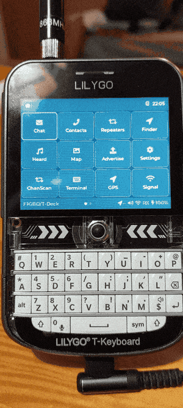

# Saitama T-Deck — édition RASEC-ALERT (F1GBD)

Firmware pour **LilyGo T-Deck / T-Deck Plus** (ESP32-S3, LoRa SX1262, écran ST7789), dérivé de [Saitama](https://github.com/868meshbot/Saitama) v1.0.2 et enrichi de l'**option Pager RASEC-ALERT** portée depuis le MeshPager Heltec.

Version : **1.0.6-f1gbd**

L'option RASEC-ALERT transforme le T-Deck en récepteur d'alerte de sécurité civile : un message chat déclenche un **écran plein écran clignotant « RASEC ALERT »** (avec compteur d'alertes), déclenche une alarme sonore synthétisée et renvoie automatiquement un accusé de réception. Aucune saisie de code Chappe n'est nécessaire — le clavier et le chat du T-Deck suffisent.

  

---

## Flash en un clic (recommandé)

Le plus simple : flasher directement depuis le navigateur, sans rien installer.

1. Ouvrez la page de flash : **https://f1gbd.github.io/F1GBD/meshpager/tdeck/**
2. Depuis **Chrome** ou **Edge** sur ordinateur (Web Serial requis — ne fonctionne pas sur iOS/Safari).
3. Branchez le T-Deck en USB-C, interrupteur sur ON, cliquez **Installer**, choisissez le port.
4. Laissez l'installation se terminer, puis appuyez sur **reset**.

Si le bouton n'arrive pas à se connecter (fréquent sur ESP32-S3 à USB natif), mettez d'abord le T-Deck en **mode download** — maintenir la trackball, appuyer sur reset (côté gauche), relâcher — puis recliquez sur **Installer**.

---

## Option Pager RASEC-ALERT — utilisation

Depuis un autre nœud MeshCore, en **message direct** ou sur le **canal privé partagé** :

- `#ra ADRASEC77` — déclenche l'alerte (écran clignotant + son + ACK). Le code `ADRASEC77` est modifiable.
- `#rapass <ancien> <nouveau>` — change le code d'activation à distance (message direct uniquement, persisté en flash).
- `#b <n>` — règle le nombre de répétitions du son (message direct). `#b 0` = alarme continue jusqu'à acquittement.

Acquittement de l'alerte : **toucher l'écran**.

L'alarme sonore est une **sirène bitonale synthétisée** intégrée au firmware (I2S) : aucune carte SD ni fichier `.mp3` n'est nécessaire. Le son suit le volume et l'interrupteur haut-parleur des réglages.

En mode veille, la ligne **« RASEC-ALERT 1.0.6-f1gbd »** s'affiche en orange sous l'horloge et le nom de station, ce qui distingue cette version du Saitama 1.0.2 d'origine.

---

## Nouveautés

- **1.0.6** : nom de station assaini (suppression des caractères parasites dans le nom diffusé sur le mesh).
- **1.0.5** : alarme sonore synthétisée intégrée — plus de dépendance à la carte SD ni au fichier MP3.

---

## Licence & crédits

- [Saitama](https://github.com/868meshbot/Saitama) est sous **GPL-3.0-or-later** ; ce dérivé l'est également. 
- Basé sur [MeshCore](https://github.com/ripplebiz/MeshCore). 
- Portage T-Deck et option RASEC-ALERT : **F1GBD — ADRASEC 77**.
