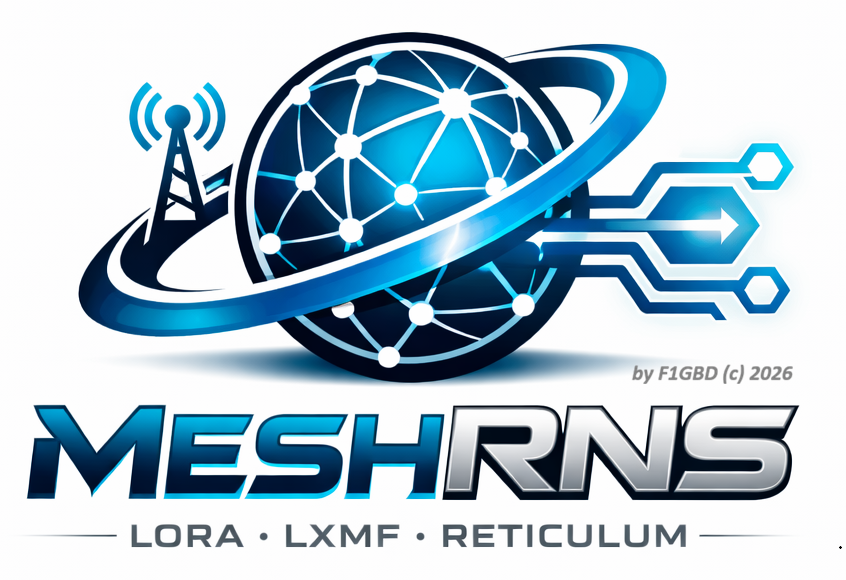
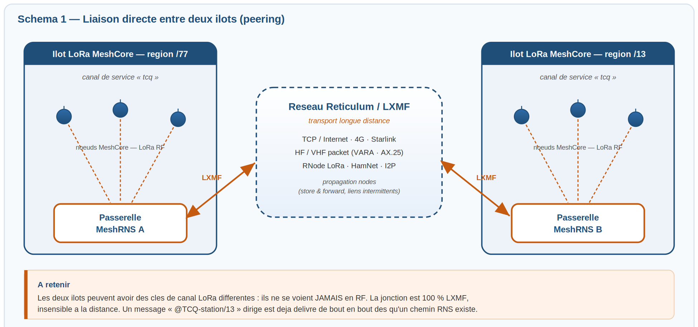
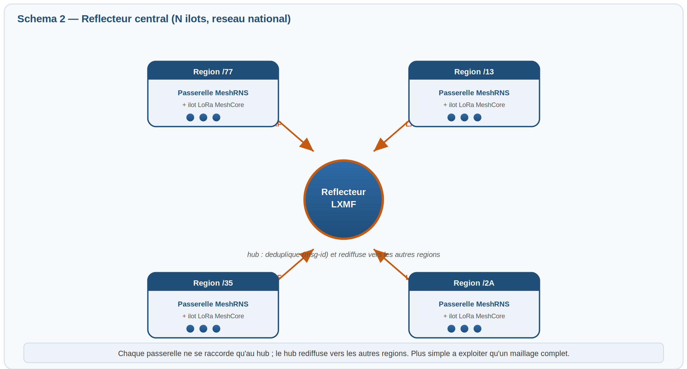

<div align="center">




**Passerelle Reticulum / LXMF pour MeshCore — ADRASEC 77 / FNRASEC**

### *Là où le LoRa s'arrête, le maillage Reticulum prend le relais.*

MeshRNS relie un **réseau radio MeshCore** (LoRa) au **réseau maillé Reticulum** via **LXMF** (la même pile que TCQ), et ne dialogue **qu'avec les stations `TCQ-xxxx`** du réseau. Les messages d'un canal MeshCore sont transportés en LXMF vers les stations TCQ joignables par Reticulum (RF longue distance, LoRa, TCP/IP, I2P…), et les messages LXMF reçus des stations TCQ sont réinjectés sur le réseau MeshCore local. C'est l'équivalent d'une passerelle AirLink, mais avec **Reticulum/LXMF** comme dorsale au lieu de VARA — ce qui apporte l'**adressage de bout en bout** et le **routage multi-saut** propres à Reticulum.

<div align="center">

### *« Un pont, deux Univers Mesh, aucune frontière. »*


*Là où le LoRa s'arrête, le maillage Reticulum prend le relais.*

</div>


> Version courante : **v2.1.11** — Windows (interface graphique). Nouveau : **commandes de canal** `#?` `#v` `#p` `#h` (réponses **sur le canal**) et **routage de message vers email** `#m` (radiogramme authentifié).
### 📥 [**Télécharger la dernière version pour Windows 11 (x64)**](https://github.com/f1gbd/F1GBD/releases/download/meshrns-v2.1.11/MeshRNS-v2.1.11-win64.7z)

*Archive **7-Zip** (.7z) — Windows 11 l'extrait nativement ; sinon installez [7-Zip](https://www.7-zip.org).*

</div>

---

## Principe

```
        Réseau MeshCore (LoRa)                       Réseau Reticulum (maillé)
            clients LoRa                            stations TCQ-xxxx en LXMF
                 │                                  (TCQ / MeshChat / Sideband)
           canal « tcq »                                       │
                 │                                             │
      companion ── USB/série/TCP/BLE ──┐                       │
                                       │                       │
                                 ┌─────┴───────┐               │
                                 │   MeshRNS   │ ═══ LXMF ═════╪═══ Reticulum
                                 │ (passerelle)│    (RNS)      │   RF / LoRa /
                                 └─────────────┘               │   TCP-IP / I2P…
                                                               │
                                                    TCQ-F1GBD · TCQ-56/HF · TCQ-BBS…
```

La passerelle s'**annonce sur LXMF** sous un indicatif de station **`TCQ-*`** et écoute les annonces du réseau : seules les stations dont le nom commence par **`TCQ`** sont retenues (**filtrage**) et inscrites dans un **annuaire**. Tout message posté sur le **canal MeshCore de service `tcq`** est relayé en LXMF vers ces stations ; tout message LXMF reçu d'une station TCQ est réinjecté sur MeshCore.

La **connexion à Reticulum est automatique** : MeshRNS lit la configuration RNS du poste (`~/.reticulum/config`), **préparée dans TCQ-config** — il n'y a **aucun réglage d'interface RNS dans MeshRNS**.

---

## Fonctionnalités

- **Dorsale Reticulum / LXMF** — transport applicatif **LXMF** (Lightweight Extensible Message Format), exactement la pile utilisée par TCQ, par-dessus le réseau maillé **Reticulum** (RF, LoRa RNode, TCP/IP, I2P…). Adressage de bout en bout et chiffrement assurés par Reticulum.
- **Interconnexion inter-îlots** *(v2.0)* — plusieurs passerelles MeshRNS **de confiance** peuvent miroiter un canal de service entre îlots **éloignés** (mode **réflecteur / peering**). Anti-écho par identifiant de message, liste blanche de pairs, fan-out optionnel par un hub. Voir la section dédiée plus bas.
- **Routage de message vers email** *(v2.1)* — un client MeshCore peut faire router un message vers un ou plusieurs destinataires courriel depuis un canal LoRa (commande **`#m`**). Le corps est encapsulé dans un **radiogramme ADRASEC authentifié TOTP+CRC** (algorithmes identiques à TCQ, donc re-validable par toute station TCQ) puis envoyé par SMTP. Configuration SMTP **autonome** (bloc `email` de `meshrns.json`, sans TCQ). Voir la section dédiée plus bas.
- **Commandes de canal `#`** *(v2.1)* — depuis le canal `tcq` (ou en DM), commandes courtes : **`#h`** (aide), **`#?`** (stations TCQ vues < 1 h), **`#v`** (version), **`#p <station>`** (ping LXMF, comme TCQ), **`#m`** (routage e-mail). **Les réponses `#` reviennent sur le canal `tcq`** (diffusion flood, fiable même via répéteur). Voir la section dédiée plus bas.
- **Configuration auto-créée** *(v2.1)* — au premier lancement, si `meshrns.json` est absent, il est créé avec les **valeurs par défaut**.
- **Connexion automatique à Reticulum** — la pile RNS lit `~/.reticulum/config` (interfaces, transport) **configuré via TCQ-config**. Rien à régler ici.
- **Filtrage `TCQ-*`** — la passerelle ne retient (annonces, annuaire) et n'accepte (messages entrants) **que les stations TCQ**. Les autres trafics LXMF du réseau sont ignorés.
- **Annuaire LXMF** — constitué automatiquement à partir des annonces des stations TCQ, persistant dans `annuaire.json` (**format identique à TCQ** : `{hash: {name, last_seen}}`), avec visualiseur intégré (copier l'adresse, définir comme station directe, case **« Sans filtre TCQ »** pour afficher *toutes* les stations LXMF vues, et bouton **« Importer annuaire TCQ… »** pour fusionner un `annuaire.json` complet généré par TCQ).
- **Annuaire consultable depuis le canal MeshCore `tcq`** — un client MeshCore envoie une commande (`ANNUAIRE`, `DIR`, `LIST`, `?`…) sur le canal de service et la passerelle **répond la liste des stations TCQ** sur ce même canal, avec filtre optionnel (`ANNUAIRE BBS`).
- **Deux modes d'émission** MeshCore → LXMF (champ *Mode d'émission*) :
  - **`broadcast`** (défaut) — multi-unicast vers **toutes les stations TCQ vues récemment** (fenêtre `broadcast_max_age_days`). C'est le mode qui reproduit le comportement réseau de TCQ ;
  - **`direct`** — message adressé à **une seule station** par défaut (`peer_station`, nom TCQ ou hash).
  - **Surcharge ad hoc** — un message commençant par **`@<nom|hash> texte`** est envoyé uniquement à cette station, quel que soit le mode. Le **préfixe d'expéditeur** que MeshCore ajoute aux messages de canal (`F1GBD/P: @TCQ-…`) est **toléré** : le `@cible` est détecté même précédé du nom de l'émetteur.
- **Signature des messages** — les messages relayés vers LXMF sont **signés** en fin de message avec l'**indicatif local** (ou une signature personnalisée), sans double signature (`sign_outbound` / `signature`).
- **Réinjection LXMF → MeshCore** — messages des stations TCQ réinjectés sur un canal configurable, préfixés `[TCQ-xx]`, avec **déduplication** et **anti-boucle (anti-écho)**.
- **Lecture active des messages MeshCore** (`get_msg`) — interroge directement le companion plutôt que de dépendre de l'auto-fetch d'événements, qui ne remonte pas toujours les messages de canal selon le firmware.
- **Fragmentation** — découpage automatique des listes/messages dépassant la taille utile MeshCore (`mc_max_chars`, défaut 140).
- **Gestion des canaux du companion** — bouton *Canaux…* : lister, créer/configurer le canal `tcq` (clé incluse), **QR de partage** au format de l'app MeshCore, et **import** d'une URL de canal copiée depuis l'app.
- **Arrêt fiable** — le bouton **Arrêter** ferme proprement la liaison MeshCore de façon **bornée** (le port série est libéré, au besoin de force, même si la pile tarde) et stoppe LXMF sans détruire Reticulum : l'état repasse à **Arrêté** et un **redémarrage immédiat** est possible.
- **Configuration Reticulum par défaut embarquée** — au tout premier lancement, si `~/.reticulum/config` est absent, MeshRNS y copie automatiquement la config fournie dans `reticulum_config/config` (une config existante n'est **jamais écrasée**).
- **Configuration persistante** (`meshrns.json`, rechargée au démarrage) + chargement/enregistrement de profils nommés.
- **Interface graphique** Tkinter (onglet *Connexion* défilable + onglet *Journal* temps réel), écran d'accueil, fenêtre *À propos*.
- **Modes console** — exécution sans interface (`--nogui`), auto-test (`--selftest`), génération de configuration (`--gen-config`).

---

## Prérequis

- Un **companion MeshCore** (nœud LoRa) connecté en USB/série (ou TCP / BLE), avec le **canal de service `tcq`** créé (même **nom** *et* même **clé** que les stations du réseau TCQ).
- La pile **Reticulum (`rns`)** et **LXMF** opérationnelle sur le poste, **avec la connexion RNS configurée dans TCQ-config** (éditeur de configuration Reticulum). MeshRNS réutilise cette configuration `~/.reticulum/config` ; il ne la modifie pas.
- Au moins une **interface Reticulum** active (RNode LoRa, TCPClientInterface vers un nœud RNS, AutoInterface…) pour joindre les stations TCQ.

> La pile RNS/LXMF n'est **pas** un service externe à lancer manuellement : MeshRNS l'initialise au démarrage. En revanche, **la configuration des interfaces Reticulum se fait dans TCQ-config**, pas dans MeshRNS.

---

## Installation
### 📥 [**Télécharger la dernière version pour Windows 11 (x64)**](https://github.com/f1gbd/F1GBD/releases/download/meshrns-v2.1.11/MeshRNS-v2.1.11-win64.7z)

*Archive **7-Zip** (.7z). Décompressez-la (Windows 11 nativement, ou [7-Zip](https://www.7-zip.org)), puis lancez `MeshRNS.exe`. Conservez `MeshRNS.png`, `MeshRNS.ico`, `meshrns.json` **et le dossier `reticulum_config/`** à côté de l'exécutable. L'annuaire `annuaire.json` est créé/maintenu au même endroit. Au premier lancement, si `~/.reticulum/config` n'existe pas, la configuration par défaut `reticulum_config/config` y est copiée automatiquement.*

---

## Démarrage rapide

1. Si **Reticulum** n'est pas installé sur votre PC, c'est MeshRNS qui le fera **automatiquement**, sinon, il utilisera la configuration Reticulum installée..
2. Lancez MeshRNS. L'onglet **Connexion** présente quatre groupes de réglages (MeshCore, LXMF / Reticulum, **Routage email**, Lien & filtrage TCQ).
3. **MeshCore (companion)** : choisissez le **Transport** (`serial`/`tcp`/`ble`), le **Port** (ex. `COM4`) et le **Baudrate**. Laissez **Lecture active (get_msg)** cochée.
4. **LXMF / Reticulum** : indiquez la **Station LXMF** de cette passerelle (un indicatif **`TCQ-*`**, ex. `TCQ-F1GBD`). Laissez **Config RNS** vide (= configuration de TCQ-config). Réglez au besoin l'**intervalle d'annonce** et le **préfixe de filtre** (`TCQ`).
5. **Lien & filtrage TCQ** : **Indicatif local**, **Mode d'émission** (`broadcast` ou `direct`), et — en mode direct — la **Station par défaut** (`peer_station`). Vérifiez le **Canal de service** (`tcq`). Laissez **Filtrer entrant (TCQ seul)** coché.
6. Au besoin, ouvrez **Canaux…** pour créer le canal `tcq` sur le companion (voir plus bas).
7. Cliquez **▶ Démarrer**. Le voyant passe à **● En service**. Suivez les échanges dans l'onglet **Journal** et l'annuaire via **Annuaire…**.

La configuration affichée est enregistrée automatiquement dans `meshrns.json` au démarrage et à la fermeture, puis rechargée au lancement suivant.

---

## Configuration (`meshrns.json`)

Exemple (passerelle **TCQ-F1GBD**, mode `broadcast`, canal de service `tcq`) :

```json
{
  "meshcore": {
    "transport": "serial", "port": "COM4", "baudrate": 115200,
    "tcp_port": 5000, "ble_address": "", "ble_pin": "",
    "manual_poll": true, "poll_interval": 1.0
  },
  "lxmf": {
    "station_name": "TCQ-F1GBD",
    "storage_path": "~/.meshrns",
    "reticulum_config": "",
    "auto_announce": true, "announce_interval": 600,
    "tcq_prefix": "TCQ", "path_timeout": 60
  },
  "local_call": "F1GBD",
  "link_mode": "broadcast",
  "peer_station": "TCQ-F1GBD/77",
  "broadcast_max_age_days": 7.0,
  "channels": [1], "channel_map": {}, "inject_channel": -1,
  "tcq_channel_name": "tcq", "service_channel": -1,
  "tunnel_direct_to_channel": -1,
  "tcq_filter_inbound": true,
  "sign_outbound": true, "signature": "",
  "antiloop_ttl": 30.0, "mc_max_chars": 140, "rx_dedup_ttl": 120.0,
  "annuaire_file": "annuaire.json", "rns_loglevel": 0, "log_file": "",
  "auto_start": false,

  "peer_link_enabled": false,
  "gateway_id": "GW-77",
  "is_reflector": false,
  "peers": [],
  "mirror_channels": [],
  "peer_channel_map": {},
  "wan_dedup_ttl": 600,
  "trust_peers_only": true,

  "email": {
    "enabled": false,
    "smtp_server": "smtp.gmail.com", "smtp_port": 587,
    "smtp_username": "", "smtp_password": "",
    "sender_email": "", "sender_name": "ADRASEC Radiogramme",
    "use_tls": true, "use_ssl": false,
    "recipients": [],
    "cmd_prefix": "#m", "radiogramme_alert": "EXERCICE", "radiogramme_origine": ""
  }
}
```

| Champ | Rôle |
| --- | --- |
| `lxmf.station_name` | Indicatif **LXMF** de la passerelle, doit commencer par **`TCQ`**. |
| `lxmf.storage_path` | Stockage de l'**identité LXMF** propre à la passerelle (adresse RNS stable). |
| `lxmf.reticulum_config` | Dossier de config RNS. **Vide = `~/.reticulum`** (configuré par TCQ-config). |
| `lxmf.auto_announce` / `announce_interval` | Annonce LXMF au démarrage puis périodiquement. |
| `lxmf.tcq_prefix` | Préfixe de filtrage des stations (défaut `TCQ`). |
| `lxmf.path_timeout` | Délai de recherche de chemin RNS avant émission (s). |
| `link_mode` | `broadcast` (toutes les stations TCQ fraîches) ou `direct` (une station). |
| `peer_station` | En mode `direct` : station TCQ cible par défaut (nom ou hash). |
| `broadcast_max_age_days` | En `broadcast` : ne viser que les stations vues depuis moins de N jours (`0` = toutes). |
| `channels` | Index des canaux MeshCore relayés vers LXMF (`[]` = tous). |
| `inject_channel` | Canal MeshCore de réinjection des messages LXMF (`-1` = canal de service). |
| `tcq_channel_name` | **Nom** du canal MeshCore de service (annuaire + relais), défaut `tcq`. |
| `service_channel` | Index explicite du canal de service (`-1` = résolu par nom). |
| `tcq_filter_inbound` | N'injecter sur MeshCore **que** les messages venant de stations TCQ. |
| `sign_outbound` / `signature` | Signer les messages relayés vers LXMF (en fin de message). Signature vide = **indicatif local**. |
| `tunnel_direct_to_channel` | Router les **DM** MeshCore vers un canal (`-1` = non routé). |
| `mc_max_chars` | Taille utile d'un message MeshCore / découpage (défaut 140). |
| `rx_dedup_ttl` / `antiloop_ttl` | Anti-doublon LXMF entrant / anti-écho du companion (s). |
| `rns_loglevel` | Verbosité de la pile RNS (`0` = silencieux, mute le spam d'interfaces ; `0..7`). |
| `annuaire_file` | Fichier de l'annuaire TCQ (défaut `annuaire.json`, à côté de l'exe). |
| `auto_start` | Démarrer la passerelle dès l'ouverture de la fenêtre (boot autonome). |
| `peer_link_enabled` | *(v2.0)* Active l'**interconnexion inter-îlots** (miroir de canal entre passerelles). |
| `gateway_id` | *(v2.0)* Identité **distincte** de cette passerelle (garde anti-boucle). Vide = indicatif local. |
| `is_reflector` | *(v2.0)* Rôle **hub** : rediffuse les miroirs aux autres pairs (fan-out). |
| `peers` | *(v2.0)* Cibles de l'interconnexion : noms `TCQ-*` ou **hash LXMF** (préférés). |
| `mirror_channels` | *(v2.0)* Canaux MeshCore miroités (`[]` = canal de service `tcq`). |
| `peer_channel_map` | *(v2.0)* Mappe le canal d'origine d'un pair vers un canal local (`{"<ch>": <ch>}`). |
| `wan_dedup_ttl` | *(v2.0)* Mémoire anti-écho WAN par identifiant de message (s, défaut 600). |
| `trust_peers_only` | *(v2.0)* N'accepter un miroir **que** des hash listés dans `peers` (recommandé). |
| `email` | *(v2.1)* Bloc SMTP du routage **`#m`** (serveur, identifiants, destinataires par défaut, préfixe). **Champs SMTP vierges dans la version publiée**, à renseigner par le sysop. Voir la section dédiée. |

---

## L'annuaire TCQ et le canal de service `tcq`

L'annuaire est l'ensemble des stations **`TCQ-*`** découvertes via leurs **annonces LXMF** (mêmes données et même fichier `annuaire.json` que TCQ). Il sert à deux choses : savoir **vers qui** émettre (mode `broadcast`) et permettre la **consultation depuis le réseau MeshCore**.

Sur le **canal `tcq`**, un client MeshCore peut interroger l'annuaire en envoyant l'une de ces commandes (insensibles à la casse) :

| Commande | Effet |
| --- | --- |
| `ANNUAIRE` · `ANNU` · `DIR` · `LIST` · `?` · `TCQ?` · `QTC?` | Liste **toutes** les stations TCQ connues. |
| `ANNUAIRE <filtre>` (ex. `DIR BBS`) | Liste les stations dont le **nom** contient le filtre. |

La passerelle répond **sur le même canal**, sous la forme :

```
Annuaire TCQ (3):
1.TCQ-BBS-F1GBD 5436706f 2026-06-26 19:49
2.TCQ-F1XYZ/HF     9672a8ca 2026-06-26 18:12
3.TCQ-F4ABC     a1b2c3d4 2026-06-25 21:07
```

Les réponses trop longues sont **automatiquement découpées** à `mc_max_chars`. Côté GUI, le bouton **Annuaire…** affiche la même liste (nom, adresse LXMF, dernier contact) et permet de copier une adresse ou de la définir comme station directe.

Le bouton **« Importer annuaire TCQ… »** (fenêtre Annuaire) charge un `annuaire.json` complet (par ex. généré par TCQ) et le **fusionne** dans l'annuaire de MeshRNS : les stations **TCQ** sont ajoutées/mises à jour (le **contact le plus récent** est conservé), les entrées non-TCQ sont ignorées. Pratique pour **pré-charger** la passerelle sans attendre que toutes les stations s'annoncent. La fusion s'applique à l'annuaire en service (puis sauvegarde) ou directement au fichier si la passerelle est arrêtée.

---

## Modes d'émission MeshCore → LXMF

LXMF est un protocole **adressé** (pas de diffusion native), contrairement à VARA. MeshRNS propose donc :

- **`broadcast`** — chaque message du canal `tcq` est envoyé (multi-unicast) à **toutes les stations TCQ fraîches** de l'annuaire (`last_seen` < `broadcast_max_age_days`). Comportement « réseau » proche de TCQ.
- **`direct`** — chaque message est envoyé à la **station par défaut** (`peer_station`), équivalent d'une liaison point-à-point.
- **`@<station> texte`** — surcharge ponctuelle : le message n'est envoyé qu'à la station indiquée (par **nom** TCQ ou **hash** LXMF de 32 caractères), quel que soit le mode. Exemple : `@TCQ-56/HF SITREP recu, QSL.`

> **Préfixe d'expéditeur MeshCore.** Sur un canal, le firmware MeshCore ajoute le nom de l'émetteur en tête du message (`F1GBD/P: @TCQ-56/HF …`). Depuis la **v1.0.6**, MeshRNS détecte le `@cible` **même précédé de ce préfixe** ; le Journal le confirme par une ligne `Ciblage @TCQ-56/HF -> …`. Les messages relayés sont par ailleurs **signés** en fin de message avec l'indicatif (`sign_outbound`).

Pour chaque cible, MeshRNS effectue une **recherche de chemin RNS** (`request_path`, délai `path_timeout`) avant l'envoi.

---

## Filtrage TCQ (entrant)

Avec **`tcq_filter_inbound`** activé (défaut), seuls les messages LXMF provenant d'une **station TCQ connue/nommée** sont réinjectés sur MeshCore ; les autres sont ignorés et journalisés (`source non TCQ`). C'est l'équivalent du filtrage opéré par TCQ : le réseau MeshCore local ne voit que le trafic **`TCQ-*`**.

---

## Configurer le canal `tcq` depuis MeshRNS (bouton « Canaux… »)

Un companion ne **reçoit** les messages d'un canal que s'il a ce canal configuré localement (même **index** *et* surtout même **clé**). Le canal public (0) est connu de tous ; un canal privé inconnu du companion voit ses messages reçus mais non déchiffrables, donc ignorés en silence.

Le bouton **Canaux…** (barre du bas) ouvre une fenêtre qui :

- **liste les canaux réellement présents** sur le companion (index, nom, empreinte de clé) ;
- permet d'en **créer / configurer un** (par ex. `tcq`) : index (0-7), nom, et clé optionnelle (32 hexa). Si la clé est laissée vide, elle est **dérivée du nom** (`SHA-256(nom)`) : il suffit alors d'employer le **même nom de canal** sur toutes les extrémités pour obtenir la même clé.
- **« Lire le canal »** récupère le nom et la **clé** réels d'un index donné (pour comparer/copier la clé entre nœuds — c'est la clé, pas le nom, qui doit être identique partout).
- **« QR de partage… »** affiche un QR code au **format de l'app MeshCore** (`meshcore://channel/add?name=…&psk=<clé base64>`, clé incluse) : scanné depuis l'app (Canaux → Ajouter → Scanner un QR code), il ajoute le canal prêt à l'emploi.
- **« Importer »** fait l'inverse : collez l'URL d'un canal **copiée depuis l'app**, les champs Nom + Clé sont remplis, puis **Configurer ce canal** pose sur le companion **exactement la même clé** que le téléphone.

La fenêtre fonctionne que la passerelle soit démarrée (connexion active) ou arrêtée (connexion temporaire au companion). Au démarrage, MeshRNS journalise aussi la liste des canaux configurés et indique l'**index résolu** du canal de service `tcq`.

---

## Interconnexion inter-îlots (mode réflecteur / peering) *(v2.0)*

<div align="center">

### *« Mille îlots, un seul maillage, aucune frontière. »*


*Du sommet enneigé au désert, le même réseau.*

</div>

À partir de la **v2.0**, plusieurs passerelles MeshRNS **de confiance** peuvent relier des îlots LoRa MeshCore **géographiquement éloignés** en miroitant le canal de service `tcq` via Reticulum/LXMF. Le pont se fait **à la couche LXMF** : les îlots ne se voient jamais en RF (clés de canal indépendantes), la jonction est insensible à la distance dès qu'un chemin Reticulum existe entre les passerelles (TCP/Internet, HF/VHF packet, RNode LoRa, HamNet, I2P…).

> Le ciblage **dirigé** `@TCQ-station/secteur` est déjà livré de bout en bout **sans** ce mode. L'interconnexion ne concerne que le trafic de **canal / groupe** (net).

### Scénario A — deux îlots (peering direct)

Aucune passerelle n'est réflecteur : chacune déclare l'autre comme **pair**.



| Champ (GUI) | Passerelle A (/77) | Passerelle B (/13) |
| --- | --- | --- |
| Interco inter-îlots (réflecteur) | ✅ | ✅ |
| ID passerelle | `GW-77` | `GW-13` |
| Pairs (noms/hash, sép. `,`) | *hash LXMF de B* | *hash LXMF de A* |
| Rôle réflecteur (hub) | ☐ | ☐ |
| Pairs de confiance seuls | ✅ | ✅ |

### Scénario B — N îlots (réflecteur central)

Une passerelle joue le **hub** ; les autres sont des **feuilles** qui ne pointent **que** le hub. Le hub déduplique (par `mid`) et rediffuse aux autres feuilles.



| Champ (GUI) | Hub | Chaque feuille (/77, /13, /35…) |
| --- | --- | --- |
| Interco inter-îlots | ✅ | ✅ |
| Rôle réflecteur (hub) | ✅ | ☐ |
| ID passerelle | `HUB` | `GW-77`, `GW-13`… (distinct) |
| Pairs | *hash de toutes les feuilles* | *hash du hub uniquement* |
| Pairs de confiance seuls | ✅ | ✅ |

### Points clés

- **`ID passerelle` (`gateway_id`) distinct** sur chaque passerelle : c'est la garde d'origine anti-boucle. Vide = prend l'indicatif local.
- Le **hash LXMF** d'une passerelle figure dans la ligne `Diagnostic Reticulum : … adresse LXMF=<hash>` au démarrage ; préférez le hash au nom pour un hub stable.
- **Anti-écho** : un miroir reçu du WAN ne repart jamais vers le WAN (sauf le fan-out du réflecteur), déduplication par `(gw, mid)` à TTL (`wan_dedup_ttl`).
- **Liste blanche** (`trust_peers_only`, défaut activé) : seuls les pairs déclarés peuvent injecter.
- **Duty cycle** : limitez `mirror_channels` au seul canal de service (EU868 = 1 %).

*Fiche dédiée :* **MEMO - Fiche Interco MeshRNS** (paramétrage pas-à-pas avec ces deux schémas).

---

## Commandes du canal (`#…`) *(v2.1)*

Depuis le canal de service `tcq` (ou en message direct), un client MeshCore dispose de commandes courtes préfixées par `#`. **Les réponses sont renvoyées sur le canal `tcq`** (diffusion flood, fiable même vers une station entendue via un répéteur, sans chemin RF direct). Une option `hash_reply_dm` (défaut `false`) permet de forcer une réponse en message direct (DM), avec repli sur le canal en cas d'échec — utile seulement si les stations sont à portée directe.

| Commande | Fonction |
| --- | --- |
| `#h` | Aide : liste des commandes `#` avec une description succincte. |
| `#?` | Liste des stations **TCQ-\*** vues dans la **dernière heure**. |
| `#v` | Nom et **numéro de version** de MeshRNS. |
| `#p <station>` | **Ping LXMF** d'une station TCQ (échange *TEST QUANTUM LXMF* / *TEST LXMF OK*, comme TCQ) ; renvoie l'aller-retour ou un délai dépassé. |
| `#m <e-mail;…>; <texte>` | **Routage courriel** (radiogramme authentifié) — voir la section dédiée ci-dessous. |

> Pour l'annuaire diffusé **sur le canal** (visible de tous), utilisez plutôt `ANNUAIRE` / `DIR` / `LIST` / `?` ; `#?` en est l'équivalent renvoyé **en privé** au demandeur.

---

## Routage de message vers email (`#m`) *(v2.1)*

À partir de la **v2.1**, un client MeshCore peut faire **router un message vers un ou plusieurs destinataires courriel**, directement depuis un canal LoRa. Le corps est encapsulé dans un **radiogramme ADRASEC authentifié TOTP+CRC** — mêmes algorithmes que TCQ, donc le courriel reçu est **re-validable par n'importe quelle station TCQ**. Tout est **autonome** : la configuration SMTP vit dans `meshrns.json`, **sans TCQ installé**.

### Syntaxe

Sur le canal de service `tcq` (ou en message direct) :

```
#m dest1@exemple.com; dest2@wanadoo.fr; corps du message ... 73
```

Les adresses de tête (séparées par `;`) sont les destinataires ; le reste constitue le corps (les `;` internes sont conservés). Sans adresse, les **destinataires par défaut** (`email.recipients`) sont utilisés. Le préfixe `#m` (champ `cmd_prefix`) et le préfixe d'expéditeur MeshCore sont tolérés. Une confirmation **`[#m] OK`** (code AUTH + expiration) est renvoyée **sur le canal** (comme les autres réponses `#`). La commande est **purement locale** : elle n'est jamais relayée vers LXMF ni miroitée.

### Configuration SMTP (`bloc email de meshrns.json`)

> **Dans la version publiée, les champs SMTP sont vierges** : c'est au sysop de la passerelle de les renseigner, puis de passer `enabled` à `true` (ou cocher **Routage email actif** dans l'onglet *Connexion*, groupe **Routage email**, sous *LXMF / Reticulum*).

| Champ | Rôle |
| --- | --- |
| `enabled` | Active le routage email (à passer à `true` après remplissage). |
| `smtp_server` / `smtp_port` | Serveur SMTP et port (ex. `smtp.gmail.com` / `587`). |
| `smtp_username` / `smtp_password` | Identifiants SMTP. Gmail : utiliser un **app-password** (voir ci-dessous). |
| `sender_email` / `sender_name` | Adresse et nom d'expéditeur affichés. |
| `use_tls` / `use_ssl` | STARTTLS (587) ou SSL direct (465). |
| `recipients` | Destinataires par défaut si `#m` sans adresse. |
| `cmd_prefix` | Préfixe de la commande (défaut `#m`). |
| `radiogramme_alert` | Niveau d'alerte du radiogramme (défaut `EXERCICE`). |
| `radiogramme_origine` | Champ « Origine (Localisation) » (vide = indicatif local). |

> Le mot de passe SMTP est stocké dans `meshrns.json` ; dans l'interface il est **masqué** (case **« Afficher »** pour le révéler). Protégez ce fichier et préférez un **app-password dédié** (révocable indépendamment) au mot de passe principal du compte.

### Générer un mot de passe d'application Google (app-password)

Requis pour un compte **Gmail** avec validation en 2 étapes. À créer **sur le compte qui sert au login SMTP** (`smtp_username`).

1. **Activez la validation en 2 étapes** (Compte Google › Sécurité › « Comment vous connecter à Google »). Sans elle, l'option n'apparaît pas.
2. Ouvrez la page des app-passwords via le **lien direct** `https://myaccount.google.com/apppasswords` (Google a retiré l'accès par les menus). Reconnectez-vous si demandé.
3. Dans « Select app », choisissez **Other (Custom name)** et nommez-le p. ex. `MeshRNS`, puis **Generate**.
4. Copiez les **16 caractères** (ils ne réapparaîtront plus) et collez-les dans `smtp_password` / champ **Mot de passe SMTP** (avec ou sans espaces).

**Révoquer / renouveler** : même page `myaccount.google.com/apppasswords`, supprimez l'entrée « MeshRNS » — sans impacter vos autres applications (dont TCQ). Changer le mot de passe du compte Google révoque d'un coup tous les app-passwords existants.

---

## Connexion Reticulum (via TCQ-config)

MeshRNS **ne configure pas** Reticulum : il réutilise la configuration RNS du poste, gérée par l'**éditeur de configuration Reticulum de TCQ-config** (`~/.reticulum/config`). Pour relier votre passerelle au reste du réseau TCQ, déclarez-y au moins une **interface** :

- une **TCPClientInterface** vers un nœud RNS de transport (réseau ADRASEC ou nœud public),
- et/ou une interface **RNode LoRa** / **AutoInterface** selon votre infrastructure.

MeshRNS possède sa **propre identité LXMF** (dossier `lxmf.storage_path`, défaut `~/.meshrns`), distincte de celle de TCQ : son adresse LXMF est donc stable et propre à la passerelle.

> **Configuration par défaut.** Au premier lancement, si aucun `~/.reticulum/config` n'existe, MeshRNS installe la configuration par défaut embarquée (`reticulum_config/config` : AutoInterface + nœuds de transport). Vous l'ajustez ensuite dans TCQ-config. Une configuration existante n'est jamais remplacée.

---

## Dépannage

- **Aucune ligne `MeshCore RX` à la réception d'un message de canal** → la lecture active (`get_msg`) doit être cochée ; certains firmwares ne déclenchent pas l'auto-fetch d'événements de canal.
- **`MeshCore RX` apparaît mais rien ne part en LXMF** → message filtré (vérifiez **Canaux relayés**) ou anti-écho (voir le Journal), ou **annuaire vide** en mode broadcast (aucune station TCQ encore annoncée).
- **`LXMF non démarré` / pas de connexion Reticulum** → la pile `rns`+`lxmf` n'est pas détectée, ou aucune interface RNS n'est configurée : vérifiez la connexion dans **TCQ-config**.
- **`source non TCQ` en réception** → message LXMF d'une station hors filtre `TCQ` : comportement normal (désactivable via `tcq_filter_inbound`).
- **Émission broadcast sans effet** → toutes les stations TCQ de l'annuaire sont trop anciennes (au-delà de `broadcast_max_age_days`) ou aucun **chemin RNS** n'a pu être trouvé (`path_timeout`).
- **`@station introuvable`** → la station n'est pas (ou plus) dans l'annuaire : laissez-la s'annoncer, ou utilisez son **hash** LXMF complet.
- **Canal `tcq` refusé sur le companion** → le canal n'existe pas avec la **même clé** : (re)configurez-le via **Canaux…** (QR de partage / Importer pour synchroniser la clé).
- **La passerelle ne s'arrête pas / impossible de redémarrer** → corrigé en **v1.0.8** (arrêt borné, port libéré au besoin de force). Mettez à jour si vous observez ce comportement sur une version antérieure.


## Licence & auteur

**MeshRNS** — *a Reticulum/LXMF Gateway for MeshCore* — par **F1GBD** (c) 2026 — **ADRASEC 77 / FNRASEC**.

## 📄 Documentation associée

- 📘 **[Manuel utilisateur MeshRNS](https://github.com/f1gbd/F1GBD/blob/master/meshrns/documentation/MEMO%20-%20MANUEL%20MeshRNS.pdf)** — Manuel Utilisateur et Paramétrage de MeshRNS
- 📋 **[Fiche technique MeshRNS](https://github.com/f1gbd/F1GBD/blob/master/meshrns/documentation/MEMO%20-%20Fiche%20Technique%20MeshRNS.pdf)** — Fiche Technique MeshRNS
- 🔗 **[Fiche interconnexion inter-îlots](https://github.com/f1gbd/F1GBD/blob/master/meshrns/documentation/MEMO%20-%20Fiche%20Interco%20MeshRNS.pdf)** — Paramétrage du mode réflecteur / peering *(v2.0)*
- 🧾 **[CHANGELOG](https://github.com/f1gbd/F1GBD/blob/master/meshrns/CHANGELOG.md)** — Historique des versions

<div align="center">

### 📡 Auteur

**Jean-Louis (F1GBD)**
*ADRASEC 77 — FNRASEC*

**Version 2.1.11 — Juillet 2026**

---

*Pour toute question, contactez votre référent ADRASEC départemental.*

</div>
