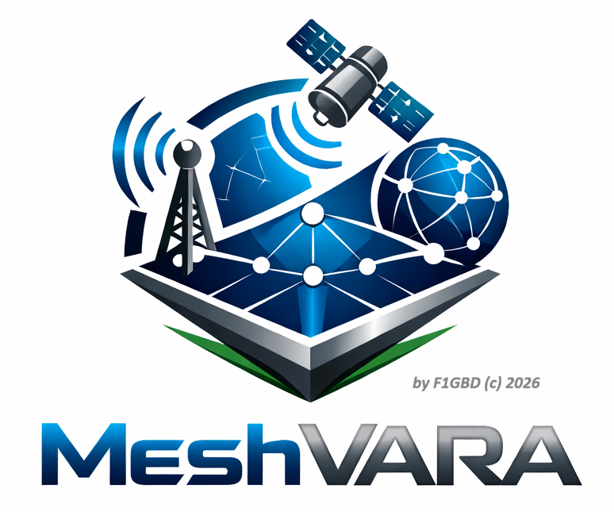

<div align="center">




**Passerelle VARA pour MeshCore — ADRASEC 77 / FNRASEC**

MeshVARA relie **deux réseaux radio MeshCore** (LoRa) à travers une **dorsale VARA HF / VARA FM / VARA SAT**. Le même programme tourne aux deux extrémités : les messages d'un canal MeshCore d'un site sont encapsulés, transmis sur la dorsale VARA (HF longue distance, FM local/relais, ou SAT via QO-100), puis réinjectés sur le réseau MeshCore du site distant — et inversement. C'est l'équivalent d'AirLink, mais avec **VARA** comme transport au lieu de LoRa, ce qui permet de franchir de très longues distances (NVIS/DX en HF, satellite en SAT) là où le Packet 1200 bauds ne porte pas.


> Version courante : **v1.0.0** — Windows (interface graphique).
### 📥 [**Télécharger la dernière version pour Windows 11 (x64)**](https://github.com/f1gbd/F1GBD/releases/download/meshvara-v1.0.0/MeshVARA-v1.0.0-win64.7z)

*Archive **7-Zip** (.7z) — Windows 11 l'extrait nativement ; sinon installez [7-Zip](https://www.7-zip.org).*

</div>

---

## Principe

```
Réseau MeshCore A                                   Réseau MeshCore B
 (clients LoRa)                                       (clients LoRa)
      │                                                     │
   companion A ── USB/série ──┐                ┌── USB/série ── companion B
                              │                │
                        ┌─────┴──────┐   ┌─────┴──────┐
                        │  MeshVARA  │   │  MeshVARA  │
                        │  (poste A) │   │  (poste B) │
                        └─────┬──────┘   └─────┬──────┘
                              │ dorsale VARA HF / FM / SAT │
                          VARA + radio  ⇄  VARA + radio
                              └────────  RF  ────────┘
```

Chaque passerelle est membre d'un **canal de routage MeshCore commun** (canal public ou canal privé dédié partagé, ex. `adrasec-xx`). Tout message posté sur ce canal est relayé vers l'autre réseau via la dorsale VARA. **VARA est lancé automatiquement** par MeshVARA au démarrage.

---

## Fonctionnalités

- **Trois dorsales VARA au choix** (champ *Mode VARA*) :
  - **VARA HF** — liaison décamétrique longue distance (NVIS / DX), bande passante 500/2300 Hz ;
  - **VARA FM** — liaison VHF/UHF locale ou via relais (la plus simple à mettre en œuvre) ;
  - **VARA SAT** — liaison satellite (ex. **QO-100**), full-duplex.
- **Deux modes de liaison** (champ *Mode dorsale*) :
  - **`broadcast`** (défaut) — diffusion sans connexion via VARA **CHAT/KISS**, découpée à ≤ 92 caractères, avec **ACK / retransmission / dédoublonnage applicatifs** optionnels. C'est le mode qui reproduit la passerelle MeshCore↔VARA de **TCQ** ;
  - **`arq`** — session **VARA ARQ** fiable point-à-point entre les deux passerelles (VARA garantit l'intégrité, reconnexion automatique côté initiateur).
- **Lancement automatique de VARA** (VARA HF / VARA FM / VARA SAT) selon le mode, dans son propre dossier.
- **Pilotage PTT** pour les modes nécessitant une commande d'émission : **RTS série** ou **CAT** (≈ 150 radios préconfigurées : Icom **IC-9700**, Yaesu **FT-991**, Kenwood, etc.).
- **Lecture active des messages MeshCore** (`get_msg`) : interroge directement le companion au lieu de dépendre de l'auto-fetch d'événements, qui ne remonte pas toujours les messages de canal selon le firmware.
- **Fiabilité applicative** (mode broadcast) : accusé de réception (ACK), retransmission, dédoublonnage en réception, anti-boucle (anti-écho) entre passerelles.
- **Fragmentation** des messages dépassant la taille utile VARA (92 caractères en broadcast).
- **Canal de réinjection configurable** pour router un canal privé même si son index diffère d'un nœud à l'autre.
- **Configuration persistante** (`meshvara.json`, rechargée au démarrage) + chargement/enregistrement de profils nommés.
- **Interface graphique** Tkinter (onglet *Connexion* défilable + onglet *Journal* en temps réel), écran d'accueil, fenêtre *À propos*.
- **Modes console** : exécution sans interface, auto-test, génération de configuration.

---

## Prérequis

- Un **companion MeshCore** (nœud LoRa) connecté en USB/série (ou TCP / BLE).
- Le logiciel **VARA** correspondant au mode visé, installé sur le poste :
  - **VARA HF** (par défaut `C:\VARA\VARA.exe`) ;
  - **VARA FM** (par défaut `C:\VARA FM\VARAFM.exe`) ;
  - **VARA SAT** (par défaut `C:\VARA SAT\VARASAT.exe`).
- Une **interface audio** (carte son / SignaLink / interface intégrée) entre le PC et la radio, et selon le cas un **PTT** (RTS série ou CAT). En **VARA SAT**, une chaîne **full-duplex** vers le transpondeur (ex. QO-100).

> VARA n'est **pas** embarqué dans l'archive : MeshVARA le **lance automatiquement** via le chemin configuré (`vara.app_path_hf/fm/sat`).

---

## Installation
### 📥 [**Télécharger la dernière version pour Windows 11 (x64)**](https://github.com/f1gbd/F1GBD/releases/download/meshvara-v1.0.0/MeshVARA-v1.0.0-win64.7z)

*Archive **7-Zip** (.7z). Décompressez-la (Windows 11 nativement, ou [7-Zip](https://www.7-zip.org)), puis lancez `MeshVARA.exe`. Conservez `MeshVARA.png`, `MeshVARA.ico` et `meshvara.json` à côté de l'exécutable.*

---

## Démarrage rapide

1. Lancez MeshVARA. L'onglet **Connexion** présente quatre groupes de réglages.
2. **MeshCore (companion)** : choisissez le **Transport** (`serial`/`tcp`/`ble`), le **Port** (ex. `COM3`) et le **Baudrate**. Laissez **Lecture active (get_msg)** cochée.
3. **VARA (HF / FM / SAT)** : sélectionnez le **Mode VARA** (`HF`, `FM` ou `SAT`). Vérifiez **Hôte VARA** (`127.0.0.1`) et les ports (**commande** 8300, **données** 8301, **KISS** 8100). Cochez **Lancer VARA auto.** et contrôlez le **Chemin VARA** du mode choisi. Réglez la **Bande passante** (`NARROW`/`WIDE` en FM, `500`/`2300` en HF).
4. **PTT série (HF / SAT)** : si la radio le nécessite, activez **PTT série**, indiquez le **Port COM PTT** et choisissez **Mode RTS** ou une **Radio CAT** dans la liste.
5. **Lien & fiabilité** : **Indicatif local** = cette passerelle (SSID accepté, ex. `F1GBD-8`), **Indicatif pair** = la passerelle d'en face (ex. `F8KSM-3`). Choisissez le **Mode dorsale** (`broadcast` ou `arq`). Laissez **Canaux écoutés** vide pour router tous les canaux. En broadcast à deux passerelles, activez **ACK applicatif** pour la fiabilité.
6. Cliquez **▶ Démarrer**. Le voyant passe à **● En service**. Suivez les échanges dans l'onglet **Journal**.

La configuration affichée est enregistrée automatiquement dans `meshvara.json` au démarrage et à la fermeture, puis rechargée au lancement suivant.

---

## Configuration (`meshvara.json`)

Exemple (mode **VARA FM**, poste F1GBD vers F8KSM, dorsale `broadcast`) :

```json
{
  "meshcore": {
    "transport": "serial", "port": "COM4", "baudrate": 115200,
    "manual_poll": true, "poll_interval": 1.0
  },
  "vara": {
    "mode": "FM", "host": "127.0.0.1",
    "cmd_port": 8300, "data_port": 8301, "kiss_port": 8100,
    "bandwidth": "NARROW", "digipeaters": "", "connection_timeout": 60,
    "autostart": true,
    "app_path_hf": "C:\\VARA\\VARA.exe",
    "app_path_fm": "C:\\VARA FM\\VARAFM.exe",
    "app_path_sat": "C:\\VARA SAT\\VARASAT.exe",
    "ptt_enabled": false, "ptt_com_port": "COM3", "ptt_baudrate": 9600,
    "ptt_use_rts": true, "ptt_cat_radio": "Yaesu FT-991"
  },
  "local_call": "F1GBD", "peer_call": "F8KSM",
  "link_mode": "broadcast", "arq_initiator": true,
  "channels": [], "channel_map": {}, "inject_channel": -1,
  "tunnel_direct_to_channel": -1,
  "ack_enabled": false, "ack_timeout": 8.0, "ack_max_retries": 3,
  "rx_dedup_ttl": 120.0, "antiloop_ttl": 30.0, "mc_max_chars": 92
}
```

Les **deux passerelles utilisent la même configuration avec les indicatifs local et pair inversés** : côté F8KSM, `local_call = F8KSM` et `peer_call = F1GBD`.

| Champ | Rôle |
| --- | --- |
| `vara.mode` | Dorsale utilisée : `HF`, `FM` ou `SAT`. |
| `vara.autostart` / `vara.app_path_*` | Lancement automatique du VARA correspondant au mode. |
| `vara.cmd_port` / `data_port` / `kiss_port` | Ports VARA (commande / données ARQ / CHAT-KISS). |
| `vara.bandwidth` | `NARROW`/`WIDE` (FM) ou `500`/`2300` (HF). |
| `vara.ptt_*` | PTT : RTS série ou CAT (radio, commandes, lignes). |
| `link_mode` | `broadcast` (diffusion CHAT/KISS) ou `arq` (session fiable). |
| `arq_initiator` | En mode `arq`, indique si cette station **initie** la connexion. |
| `channels` | Index des canaux à router (`[]` = tous). |
| `inject_channel` | Canal MeshCore **fixe** de réinjection (`-1` = même index que reçu). |
| `ack_enabled` / `ack_timeout` / `ack_max_retries` | Fiabilité applicative (broadcast) : accusé + délai + retransmissions. |
| `mc_max_chars` | Taille utile MeshCore / découpage broadcast VARA (92). |

---

## Router un canal privé

Le **canal 0 (public)** existe partout et fonctionne sans réglage. Pour router un **canal privé** :

1. Créez le **même canal privé**, avec la **même clé**, sur les companions des **deux** passerelles (de préférence au même index).
2. Renseignez **Canal réinjection** avec l'index de ce canal sur le companion destinataire.
3. Postez un message : le Journal affiche `MeshCore RX  canal N` puis `MC->VARA … canal N`.

Si le firmware refuse (`canal N peut-être refusé`), c'est que le canal n'existe pas avec la même clé sur ce companion.

### Configurer les canaux depuis MeshVARA (bouton « Canaux… »)

Un companion ne **reçoit** les messages d'un canal privé que s'il a ce canal configuré localement (même index **et même clé**). Le canal public (0) est connu de tous ; un canal privé inconnu du companion voit ses messages reçus mais non déchiffrables, donc ignorés en silence.

Le bouton **Canaux…** (barre du bas) ouvre une fenêtre qui :

- **liste les canaux réellement présents** sur le companion (index, nom, empreinte de clé) ;
- permet d'en **créer / configurer un** : index (0-7), nom, et clé optionnelle (32 hexa). Si la clé est laissée vide, elle est **dérivée du nom** (`SHA-256(nom)`), ce qui est le plus simple : il suffit d'employer le **même nom de canal** sur toutes les extrémités pour obtenir la même clé.
- **« Lire le canal »** récupère le nom et la **clé** réels d'un index donné (pour comparer/copier la clé entre nœuds — c'est la clé, pas le nom, qui doit être identique partout).
- **« QR de partage… »** affiche un QR code au **format de l'app MeshCore** (`meshcore://channel/add?name=…&psk=<clé base64>`, clé incluse) : scanné depuis l'app (Canaux → Ajouter → Scanner un QR code), il ajoute le canal prêt à l'emploi.
- **« Importer »** fait l'inverse : colle l'URL d'un canal **copiée depuis l'app** (bouton copier sous son QR), elle est analysée (`psk=` base64 ou `secret=` hex), et les champs Nom + Clé sont remplis. Un clic sur **Configurer ce canal** pose alors sur le companion **exactement la même clé** que le téléphone — c'est le moyen le plus fiable de synchroniser un canal privé existant.

La fenêtre fonctionne que la passerelle soit démarrée (connexion active) ou arrêtée (connexion temporaire au companion). Au démarrage, MeshVARA journalise aussi la liste des canaux configurés sur le companion.

---

## Protocole d'encapsulation

Les messages transportés sur la dorsale VARA utilisent un en-tête textuel simple (identique à MeshPacket, les deux passerelles sont donc interopérables sur le plan logique) :

**Notes :** Les messages MeshCore transportés sur la dorsale VARA sont **en CLAIR** et **non cryptés**.

```
MCG1|D|<seq>|<canal>|<texte>      données
MCG1|A|<seq>                      accusé de réception
```

- En mode **broadcast**, ces trames partent en diffusion VARA CHAT/KISS (AX.25 UI), découpées à ≤ 92 caractères avec suffixe `[n/m]` si nécessaire.
- En mode **arq**, elles transitent dans la session VARA ARQ, délimitées par fin de ligne, sans ACK applicatif (VARA assure la fiabilité).

---

## Dépannage

- **Aucune ligne `MeshCore RX` à la réception d'un message de canal** → la lecture active (`get_msg`) doit être activée ; certains firmwares ne déclenchent pas l'auto-fetch d'événements de canal.
- **`MeshCore RX` apparaît mais pas `MC->VARA`** → message filtré : vérifiez **Canaux écoutés** et le message anti-écho du Journal.
- **VARA ne démarre pas** → vérifiez le **Chemin VARA** du mode sélectionné (HF/FM/SAT) ; si VARA est déjà ouvert manuellement, MeshVARA ne le relance pas.
- **Pas de passage en émission** → contrôlez le **PTT** (Mode RTS et **Port COM PTT**, ou Radio **CAT**) et la configuration audio/PTT dans VARA lui-même.
- **La trame part plusieurs fois puis « abandon » (broadcast)** → comportement normal de l'ACK applicatif quand la passerelle d'en face ne renvoie pas d'accusé. Pour un test en solo, **décochez ACK applicatif**.
- **Mode `arq` : pas de connexion** → une seule des deux stations doit **initier** (`arq_initiator = true`) ; l'autre reste à l'écoute.

---

## Licence & auteur

**MeshVARA** — *a VARA Gateway for MeshCore* — par **F1GBD** (c) 2026 — **ADRASEC 77 / FNRASEC**.

## 📄 Documentation associée

- 📘 **[Manuel utilisateur MeshVARA](https://github.com/f1gbd/F1GBD/blob/master/meshvara/documentation/MEMO%20-%20MANUEL%20MeshVARA.pdf)** — Manuel Utilisateur et Paramétrage de MeshVARA
- 📋 **[Fiche technique MeshVARA](https://github.com/f1gbd/F1GBD/blob/master/meshvara/documentation/MEMO%20-%20Fiche%20Technique%20MeshVARA.pdf)** — Fiche Technique MeshVARA

---

<div align="center">

### 📡 Auteur

**Jean-Louis Naudin (F1GBD)**
*ADRASEC 77 — FNRASEC*

**Version 1.0.0 — Juin 2026**

---

*Pour toute question, contactez votre référent ADRASEC départemental.*

</div>
