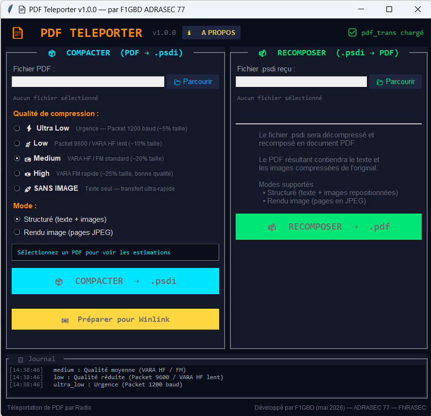
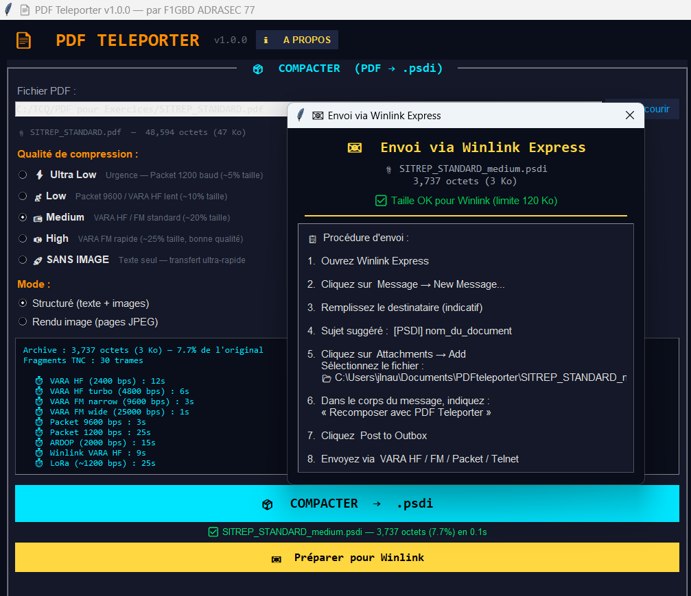

<div align="center">


# PDF Teleporter

### Téléportation radio de documents PDF pour les opérateurs ADRASEC

*Compression structurée — Transmission TNC Packet & VARA — Recomposition fidèle — Compatibilité Winlink Express — 5 niveaux de qualité — Mode rendu image — Estimation temps de transfert — Validation CRC — 100% hors-ligne*

[](https://github.com/f1gbd/F1GBD/releases/tag/pdfteleporter-v1.0.5)
[]()
[]()
[]()
[]()

### 📥 [**Télécharger la dernière version**](https://github.com/f1gbd/F1GBD/releases/download/pdfteleporter-v1.0.5/PDFteleporter.7z)

</div>

---

## 🆕 Quoi de neuf en v1.0.5

> **Deux correctifs majeurs pour les PDF non-Microsoft** — Cette version résout deux problèmes spécifiques rencontrés sur les PDF produits par **LibreOffice** et par **Excel à très petites fontes** :
>
> **1) Caractères accentués corrompus dans les PDF LibreOffice** — Les mots contenant les ligatures `ti` ou `tt` (Situation, quitté, Éducation, nationale, lutte, routier, pollution…) apparaissaient avec un caractère de remplacement `�` après recomposition. Cause : LibreOffice utilise des glyphes Unicode non standard (Ɵ U+019F, Ʃ U+01A9) dans ses CIDFonts que PyMuPDF convertit en `U+FFFD`. La v1.0.5 décompose ces ligatures et restaure les mots français corrects via une heuristique contextuelle (`ti` par défaut, `tt` devant é/è/ê ou après `lu-`).
>
> **2) Débordement persistant sur PDF Excel à fontes ~4 pt** — Les bbox optimisés au pixel près d'Excel ne laissent pas de place à la marge interne par défaut de l'engine HTML PyMuPDF. La v1.0.5 ajoute une compensation horizontale de 0.5 pt et un mécanisme d'auto-réduction de police (`scale_low=0.5`) pour faire tenir le texte sans le tronquer.
>
> **Action recommandée** : passez à la v1.0.5 si vous transmettez des SITREP produits par LibreOffice (Linux, Mac) ou des tableaux denses Excel. Les archives `.psdi` produites par les versions antérieures restent **entièrement lisibles** avec la v1.0.5 et bénéficient automatiquement des deux fix côté recomposition.

---

## 📸 Aperçu

<div align="center">

### Écran principal de PDF Teleporter



*Interface double panneau : compression PDF → .psdi à gauche, recomposition .psdi → PDF à droite, journal opérationnel en bas. Thème sombre dérivé de TCQ.*

### Fenêtre Winlink Express intégrée



*Procédure d'envoi pas-à-pas, alerte automatique si le fichier dépasse la limite Winlink de 120 Ko, ouverture directe du dossier d'archives.*

</div>

---

## 🎯 Qu'est-ce que PDF Teleporter ?

**PDF Teleporter** est un outil autonome qui permet de **transmettre des documents PDF par radio** dans des conditions où la bande passante est dramatiquement limitée : TNC Packet 1200 baud, VARA HF en propagation difficile, VARA FM, ou simple message Winlink Express. Là où un PDF de 800 Ko mettrait 90 minutes à passer en Packet 1200, sa version compactée en `.psdi` peut tenir en 3 minutes — sans perdre la mise en forme du document à l'arrivée.

Concrètement, l'application fait deux choses :

- 📦 **Compacter** un PDF (SITREP, fiche réflexe, plan ORSEC, PSD, BSD, ordre d'opération…) en une **archive `.psdi`** ultra-légère, en extrayant proprement le texte, les tableaux et les images, et en compressant chaque élément avec le bon algorithme.
- 📬 **Recomposer** une archive `.psdi` reçue par radio en **PDF lisible**, avec sa mise en forme d'origine restaurée — sans aucune manipulation manuelle côté destinataire.

L'archive `.psdi` est conçue pour les **modes radio TCQ** (TNC Packet, VARA HF/FM/SAT) et pour **Winlink Express**. C'est la solution de transmission documentaire de l'ADRASEC quand le réseau est isolé, dégradé ou inexistant.

---

## ⭐ Fonctionnalités principales

| Icône | Fonctionnalité | Description |
|:---:|---|---|
| 📦 | **Compression structurée PDF → .psdi** | Le texte, les tableaux et les images sont extraits du PDF source puis compressés individuellement avec le meilleur algorithme pour chaque type de contenu (LZMA pour le texte, JPEG optimisé pour les images). Le ratio typique est de 5 à 25% de la taille originale selon la qualité choisie. |
| 📬 | **Recomposition fidèle .psdi → PDF** | Le PDF reconstruit côté réception conserve la mise en page, les tableaux, les images et le texte de l'original. Aucune intervention manuelle nécessaire — un clic suffit. |
| ⚡ | **5 niveaux de qualité** | `Ultra Low` (~5%, urgence Packet 1200), `Low` (~10%, Packet 9600 / VARA HF lent), `Medium` (~20%, VARA HF/FM standard), `High` (~25%, VARA FM rapide bonne qualité), `Sans image` (texte seul, transfert ultra-rapide). Chaque niveau est calibré pour un mode radio précis. |
| 🎨 | **Deux modes d'extraction** | **Structuré** (texte + images repositionnées, idéal pour la plupart des documents) ou **Rendu image** (chaque page est aplatie en JPEG, utile pour les PDF complexes ou scannés). |
| ⏱ | **Estimation du temps de transfert** | Avant de lancer la compression, PDF Teleporter calcule la taille finale de l'archive, le nombre de fragments TNC nécessaires, et estime le temps d'envoi pour chaque mode radio (Packet 1200/9600, VARA HF/FM/SAT). Plus de mauvaises surprises en exercice. |
| ✅ | **Validation CRC à l'ouverture** | Quand un fichier `.psdi` est sélectionné pour recomposition, la signature, la version et le checksum sont vérifiés automatiquement. L'opérateur sait immédiatement si l'archive reçue est intègre ou si elle a été corrompue pendant le transfert radio. |
| 🛡 | **Compatibilité Microsoft Print To PDF / Word LTSC** *(v1.0.1)* | Les PDF issus de la chaîne Microsoft (préfectures, services de l'État, formulaires SIDPC/COD) sont désormais recomposés correctement, sans artefact de fond noir, grâce au traitement des paths vectoriels multi-segments. |
| 📐 | **Rendu fidèle des tableaux** *(v1.0.2)* | Les libellés des cellules colorées (Bilan humain, Moyens engagés, Activité de sécurité…) ne débordent plus de leurs cellules à la recomposition. La famille de fonte d'origine est conservée pour préserver la métrique exacte du document. |
| 🌍 | **Compatibilité LibreOffice et Excel densifié** *(nouveau v1.0.5)* | Les caractères accentués des PDF LibreOffice (Situation, Éducation, lutte…) sont restaurés correctement et les tableaux Excel à très petites fontes (~4 pt) ne débordent plus de leurs cellules. Heuristique de désambiguïsation `ti`/`tt` + compensation de la marge HTML interne. |
| 📧 | **Bouton « Préparer pour Winlink »** | Après compression, un clic prépare le `.psdi` pour Winlink Express : copie automatique dans `Documents/PDFteleporter/`, alerte si la taille dépasse la limite Winlink de 120 Ko, instructions pas-à-pas pour la procédure d'envoi (New Message → Attachment → VARA HF/FM/Packet/Telnet). |
| 📋 | **Journal opérationnel intégré** | Toutes les opérations (sélection, compression, recomposition, erreurs, ratios) sont horodatées et journalisées en bas de l'écran avec un code couleur (info/succès/avertissement/erreur). Idéal pour le débriefing d'exercice. |
| 🌐 | **Compatible TCQ et Winlink Express** | Le format `.psdi` est consommable directement par les modes radio TCQ (TNC Packet, VARA HF/FM/SAT) et par Winlink Express en pièce jointe. Aucun format propriétaire, aucune dépendance externe. |
| 🔒 | **100% local et confidentiel** | Aucune donnée ne sort de la machine. Aucune connexion Internet requise. Idéal pour les contextes opérationnels sensibles, les zones blanches ou les exercices en autonomie totale. |
| 🖥 | **Interface DPI-aware Windows 10/11** | Adaptation automatique aux écrans haute résolution. Thème sombre cohérent avec TCQ, console Windows masquée au démarrage. |


---

## 🚀 Pourquoi un opérateur ADRASEC y gagne

> **Transmettre un SITREP en quelques minutes au lieu d'une heure**
> Un SITREP PDF de 600 Ko envoyé en VARA HF standard (qualité Medium) tient dans une archive `.psdi` de ~120 Ko et passe en environ 3 minutes au lieu de 15 — sans perdre la mise en forme.

> **Compatibilité directe avec les outils de la chaîne FNRASEC**
> L'archive `.psdi` est consommable par TCQ (TNC Packet et VARA Modem HF/FM/SAT) et par Winlink Express en pièce jointe. Pas de nouveau protocole à apprendre côté opérateur destinataire.

> **Calibrage par mode radio**
> Cinq niveaux de qualité prédéfinis : pas besoin de tâtonner, l'opérateur choisit `Ultra Low` pour Packet 1200 en urgence, `Medium` pour VARA HF en exercice, `High` pour VARA FM rapide. La taille finale et le temps de transfert sont annoncés avant l'envoi.

> **Validation immédiate à la réception**
> Quand un `.psdi` est reçu et chargé dans PDF Teleporter, la signature et le CRC sont vérifiés instantanément. Un fichier corrompu pendant le transfert est détecté avant de tenter la recomposition — l'opérateur peut demander une retransmission immédiatement.

> **Workflow Winlink simplifié**
> Bouton dédié « Préparer pour Winlink » qui copie l'archive au bon endroit, alerte si elle dépasse 120 Ko, et affiche les instructions étape par étape. Le destinataire reçoit le `.psdi` en pièce jointe et le recompose en un clic.

> **Disponibilité opérationnelle**
> Outil utilisable en exercice, en mission, en astreinte. Fonctionne hors-ligne sur batterie laptop, sans aucune dépendance cloud. Pas de licence à activer, pas de compte à créer.

> **Cohérence avec l'écosystème ADRASEC**
> Thème graphique aligné avec TCQ, mêmes conventions de qualité de compression, même format `.psdi` que `pdf_trans.py` embarqué dans TCQ. Un opérateur formé sur TCQ retrouve ses repères immédiatement.

> **Confidentialité totale**
> Aucune donnée ne quitte le poste. Pas d'historique sur des serveurs externes. Idéal pour les documents opérationnels classifiés ADRASEC, les SITREP confidentiels, les fiches d'identification de victimes.

---

## 💼 Cas d'usage concrets

### 🚨 Transmission de SITREP en exercice ou en mission

```
1. L'opérateur de terrain rédige un SITREP PDF (ReportLab AcroForm, formulaire IAbrain, etc.)
2. Il l'ouvre dans PDF Teleporter, choisit la qualité « Medium » (VARA HF standard)
3. L'archive .psdi générée fait ~120 Ko (au lieu de 600 Ko PDF)
4. Il clique « Préparer pour Winlink » → instructions affichées
5. Pièce jointe envoyée vers la cellule de coordination via VARA HF
6. La cellule recompose le PDF en un clic dans PDF Teleporter à la réception
```

### 📋 Diffusion de fiches techniques sur une section ADRASEC

```
1. Le référent technique départemental compile une fiche réflexe PDF mise à jour
2. Compression « Low » (~10%) pour Packet 9600 ou VARA HF lent
3. Diffusion sur le canal ADRASEC via TCQ-BBS
4. Tous les opérateurs de la section reçoivent et recomposent localement
```

### ⚡ Urgence — Packet 1200 baud sur batterie

```
1. Plan Blanc déclenché, infrastructure réseau partiellement HS
2. Document plan d'évacuation PDF de 1,2 Mo à transmettre
3. Compression « Ultra Low » → ~60 Ko, ~120 fragments TNC
4. Transmission en ~7 min sur Packet 1200 baud
5. Mise en forme préservée à l'arrivée — utilisable directement
```

### 📚 Archivage et préparation d'exercice

```
1. Compactage en « Sans image » des supports de cours volumineux
2. Texte seul → ratio extrême (~2-3% de la taille originale)
3. Distribution rapide via mail Winlink ou TNC Packet
4. Recomposition à la demande pour consultation locale
```

### 🎓 Formation des nouveaux opérateurs

```
« Je viens de recevoir un fichier .psdi par VARA HF. Comment je l'ouvre ? »

→ Lancer PDF Teleporter
→ Panneau RECOMPOSER → Parcourir → sélectionner le .psdi
→ Validation CRC affichée automatiquement
→ Cliquer RECOMPOSER → choisir nom du PDF de sortie
→ Cliquer « Ouvrir le PDF recomposé » → terminé
```

---

## 📥 Téléchargement et installation

### Méthode 1 — Téléchargement direct *(recommandé)*

1. **Téléchargez l'archive** depuis la dernière release GitHub :

   👉 **[PDFteleporter.7z (dernière version)](https://github.com/f1gbd/F1GBD/releases/download/pdfteleporter-v1.0.5/PDFteleporter.7z)**

   Lien permanent vers la version la plus récente :
   👉 **[https://github.com/f1gbd/F1GBD/releases/latest](https://github.com/f1gbd/F1GBD/releases/latest)**

2. **Décompressez l'archive** dans `C:\` (avec [7-Zip](https://www.7-zip.org/) par exemple). Vous obtiendrez le dossier `C:\PDFteleporter\`.

3. **Lancez l'application** :

   ```
   C:\PDFteleporter\PDFteleporter.exe
   ```

### Méthode 2 — Vérification d'intégrité (SHA-256)

Le SHA-256 de l'archive est publié dans la page de release. Pour vérifier sous PowerShell :

```powershell
Get-FileHash -Algorithm SHA256 PDFteleporter.7z
```

Comparez la valeur affichée avec celle indiquée dans la release.

### Méthode 3 — Mise à jour depuis une version antérieure

Si vous utilisez déjà PDF Teleporter v1.0.0, v1.0.1 ou v1.0.2, désinstallation simple : remplacez le contenu de `C:\PDFteleporter\` par celui de la nouvelle archive. Aucune configuration n'est conservée hors du dossier d'installation, et le format `.psdi` est entièrement compatible — toutes les archives `.psdi` produites par les versions précédentes restent lisibles en v1.0.5.

### Méthode 4 — Utilisateurs TCQ

Si vous utilisez déjà **TCQ** (le multi-mode radio Python de F1GBD), PDF Teleporter est **directement intégré dans TCQ**. Il suffit de cliquer sur le bouton **PDF** dans le mode **VARA Modem** ou **TNC Packet** — pas besoin d'installer PDF Teleporter séparément.

> 📌 Les correctifs de pdf_trans (fond noir v1.0.1 + débordement de texte v1.0.2 + ligatures LibreOffice et marge Excel v1.0.5) sont également intégrés dans les versions correspondantes de **TCQ**. Mettez à jour TCQ pour bénéficier des corrections lors de vos transferts PDF radio.

### Configuration matérielle minimale

| Composant | Minimum | Recommandé |
|---|---|---|
| **OS** | Windows 10 (1909+) | Windows 11 |
| **RAM** | 2 Go libres | 4 Go libres |
| **Disque** | 50 Mo | 100 Mo |
| **Écran** | 1024×768 | 1366×768+ (DPI scaling supporté) |

---

## 📦 Format `.psdi`

Le format `.psdi` (PDF Structured Data Interchange) est une archive binaire compacte signée :

```
┌──────────────────────────────────────────┐
│  Signature « PSDI »  (4 octets)          │
│  Version  (1 = struct, 2 = image)        │
│  Checksum CRC32                          │
│  Bloc texte compressé LZMA               │
│  Blocs images JPEG (1 par image)         │
│  Métadonnées de positionnement           │
└──────────────────────────────────────────┘
```

- **Signature** : permet de détecter immédiatement un fichier corrompu ou non `.psdi`
- **Version** : `1` pour le mode Structuré, `2` pour le mode Rendu Image
- **CRC32** : vérification d'intégrité après transfert radio
- **LZMA** sur le texte : ratio de compression maximal pour le contenu textuel
- **JPEG optimisé** sur les images : qualité ajustée selon le préréglage choisi

**PDF Teleporter** est en version stable. Il est intégré dans **TCQ** dans ses modules **VARA Modem** et **TNC Packet**.

**Aucune dépendance Internet, aucun service externe.**

---

## 📝 Historique des versions

### v1.0.5 — Mai 2026

- 🌍 **Correctif caractères accentués LibreOffice** : décomposition automatique des ligatures Unicode non standard (Ɵ U+019F = `ti`, Ʃ U+01A9 = `tt`, plus les ligatures classiques ff fi fl ffi ffl ſt st) et heuristique contextuelle de restauration pour les `U+FFFD` produits par PyMuPDF. Les mots français tels que Situation, quitté, Éducation, nationale, routier, lutte, pollution, partie… sont désormais restitués correctement à la recomposition.
- 📐 **Correctif débordement Excel à très petites fontes** (~4 pt) : élargissement minimal du rect de rendu de 0.5 pt de chaque côté pour absorber la marge interne par défaut de l'engine HTML PyMuPDF. CSS injecté qui force `margin/padding:0` et `scale_low=0.5` qui permet une auto-réduction modérée si le texte ne tient pas, plutôt que de tronquer.
- 🔄 Compatibilité ascendante totale : les `.psdi` produits par les versions v1.0.0, v1.0.1 et v1.0.2 restent lisibles, et bénéficient même automatiquement des deux fix côté recomposition.
- 🐧 Linux : aucun changement spécifique requis — les deux correctifs sont entièrement dans `pdf_trans.py`. Le binaire Linux v1.0.5 est compilé avec les nouvelles sources.

### v1.0.2 — Mai 2026

- 📐 **Correctif débordement de texte** dans la recomposition structurée. Les libellés des cellules de tableaux (Bilan humain, Moyens engagés, Activité de sécurité…) ne sortent plus de leurs cellules colorées. `pdf_trans.py` v1.0.2 respecte désormais strictement le bounding box d'origine des lignes de texte au lieu de l'étirer jusqu'au bord de la page.
- 🔤 **Conservation de la famille de fonte d'origine** (sans-serif / serif / monospace) dans l'archive `.psdi`, pour un rendu plus fidèle à l'aspect du document source. Surcoût négligeable (~10 octets par span).
- 🔄 Compatibilité ascendante totale : les `.psdi` produits par les versions v1.0.0 et v1.0.1 restent lisibles, et bénéficient même automatiquement du fix de rendu côté recomposition.
- 🐧 Linux : aucun changement spécifique requis — le correctif est entièrement dans `pdf_trans.py`.

### v1.0.1 — Mai 2026

- 🛡 **Correctif « fond noir »** sur la recomposition des PDF produits par Microsoft Print To PDF et Microsoft Word LTSC. La bibliothèque `pdf_trans.py` itère désormais sur les sous-items individuels des paths vectoriels au lieu d'utiliser leur bounding box global, ce qui éliminait les gros rectangles noirs pleine page lors de la recomposition.
- 🛡 Garde-fou supplémentaire : tout rectangle quasi-pleine-page de luminance < 0,3 est ignoré (un vrai fond de page opérationnel ADRASEC n'est jamais noir plein).
- 🔄 Compatibilité ascendante totale : les archives `.psdi` produites par la v1.0.0 restent lisibles.
- 📡 Correctif également propagé dans **TCQ v10.12.0** (transferts PDF radio via VARA HF/FM/SAT et TNC Packet).
- 🐧 Côté Linux : correctif spécifique pour l'ouverture du PDF recomposé via `xdg-open` (environnement `LD_LIBRARY_PATH` propre, nécessaire pour les binaires PyInstaller).

### v1.0.0 — Mars 2026

- 🎉 Version initiale publique de PDF Teleporter.
- 5 niveaux de qualité, 2 modes d'extraction (Structuré / Rendu image), validation CRC, intégration Winlink Express et TCQ.

---

## 🤝 Communauté

PDF Teleporter est un **projet open développé pour la communauté ADRASEC**, proposé librement aux opérateurs ADRASEC départementales et à la FNRASEC.

L'application complète l'écosystème **TCQ / IAbrain / SATER SIM** dans la chaîne d'outils de communications d'urgence en sécurité civile.

Toute contribution, retour d'expérience ou proposition d'amélioration est bienvenue via les *Issues* du dépôt GitHub.

---

## 📄 Documentation associée

- 📘 **[Manuel utilisateur (MEMO-PDFteleporter_MANUEL.pdf)](doc/MEMO-PDFteleporter_MANUEL.pdf)** — Guide pas-à-pas d'utilisation, niveaux de qualité, dépannage, intégration TCQ et Winlink
- 📋 **[Fiche de présentation (PDFteleporter_FICHE_PRESENTATION.pdf)](doc/PDFteleporter_FICHE_PRESENTATION.pdf)** — Synthèse opérationnelle 1 page pour briefings ADRASEC

---

<div align="center">

### 📡 Auteur

**Jean-Louis Naudin (F1GBD)**
*ADRASEC 77 — FNRASEC*

**Version 1.0.5 — Mai 2026**

---

*Pour toute question, contactez votre référent ADRASEC départemental.*

📄 **PDF Teleporter** — *La téléportation radio des documents au service de la sécurité civile*

</div>
