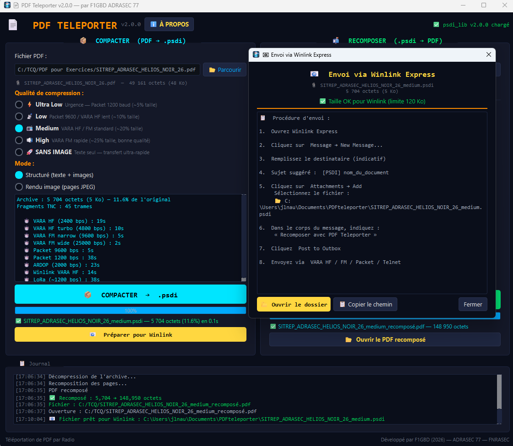

# PDF Teleporter

### Envoyer un document PDF par radio, et le retrouver intact à l'arrivée

*Pour les opérateurs ADRASEC / FNRASEC — TNC Packet, VARA HF/FM/SAT, Winlink Express*

### 📥 Télécharger

**[⬇ Installeur Windows — PDFteleporter-2.1.0-setup.exe (34 Mo)](https://github.com/f1gbd/F1GBD/releases/download/pdfteleporter-v2.1.0/PDFteleporter-2.1.0-setup.exe)**

[Archive 7z portable (32 Mo)](https://github.com/f1gbd/F1GBD/releases/download/pdfteleporter-v2.1.0/PDFteleporter.7z) · [🐧 Linux v1.1.0](linux/) · [Toutes les versions](https://github.com/f1gbd/F1GBD/releases?q=pdfteleporter)

---

## À quoi ça sert

Un SITREP PDF de 48 Ko met **plus de 5 minutes** à passer en Packet 1200 baud. Compacté
par PDF Teleporter, il tient en **5 Ko** et passe en **38 secondes** — ou 19 secondes en
VARA HF. À l'arrivée, le destinataire clique une fois : il retrouve son PDF avec ses
tableaux, ses cases cochées et ses couleurs.

L'application fait deux choses, et rien d'autre :

| | |
|---|---|
| 📦 **Compacter** | Un PDF (SITREP, fiche réflexe, plan ORSEC, PSD, BSD, ordre d'opération) devient une archive `.psdi` de 5 à 25 % de sa taille. Texte, tableaux et images sont extraits puis compressés chacun avec l'algorithme qui lui convient. |
| 📬 **Recomposer** | Une archive `.psdi` reçue par radio redevient un PDF lisible, mise en forme d'origine restaurée. Aucune manipulation côté destinataire. |

Le `.psdi` se transmet par les modes radio de **TCQ** (TNC Packet, VARA HF/FM/SAT) ou en
pièce jointe **Winlink Express**. C'est la solution documentaire de l'ADRASEC quand le
réseau est isolé, dégradé ou inexistant.

---

## En images

*Un SITREP ADRASEC de 49 161 octets compacté en 5 704 octets (11,6 %, 45 trames TNC),
puis recomposé à droite — cases à cocher et tableaux intacts.*

*Le bouton « Préparer pour Winlink » copie l'archive au bon endroit, vérifie la limite
de 120 Ko et affiche la procédure d'envoi pas à pas.*

---

## Installation

### Installeur Windows *(recommandé)*

1. Téléchargez **[PDFteleporter-2.1.0-setup.exe](https://github.com/f1gbd/F1GBD/releases/download/pdfteleporter-v2.1.0/PDFteleporter-2.1.0-setup.exe)**
2. Lancez-le et suivez l'assistant, en français. Il propose deux options utiles :
   le raccourci sur le Bureau, et **l'association des archives `.psdi`**.
3. Lancez l'application depuis le Menu Démarrer.

L'installation ne demande **pas de droits administrateur** si le poste est verrouillé.

> **Windows SmartScreen** peut afficher un avertissement au premier lancement :
> l'exécutable n'est pas signé par un certificat commercial. Cliquez sur
> *Informations complémentaires* → *Exécuter quand même*. Le SHA-256 est publié dans la
> release pour ceux qui veulent vérifier avant :
> `Get-FileHash -Algorithm SHA256 PDFteleporter-2.1.0-setup.exe`

### Archive portable

Pour une clé USB opérationnelle ou un poste sur lequel rien ne doit être installé :
téléchargez **[PDFteleporter.7z](https://github.com/f1gbd/F1GBD/releases/download/pdfteleporter-v2.1.0/PDFteleporter.7z)**,
décompressez-la où vous voulez, lancez `PDFteleporter\PDFteleporter.exe`. Aucun raccourci
ni association de fichier n'est créé dans ce mode.

### Mise à jour depuis une v1.0.x

Supprimez le dossier `C:\PDFteleporter\`, puis lancez l'installeur. Aucune configuration
n'est conservée ailleurs, et **toutes vos archives `.psdi` restent lisibles**.

### Vous utilisez déjà TCQ ?

PDF Teleporter est **intégré dans TCQ** : bouton **PDF** des modes **VARA Modem** et
**TNC Packet**. Rien à installer séparément. Les deux applications partagent le même
format d'archive et sont interopérables dans les deux sens.

### Configuration

| | Minimum | Recommandé |
|---|---|---|
| **OS** | Windows 10 (1909+) 64 bits | Windows 11 |
| **RAM** | 2 Go libres | 4 Go libres |
| **Disque** | 150 Mo | 250 Mo |
| **Écran** | 1024×768 | 1366×768 ou plus |

---

## 🆕 Nouveau

> ### ⚠️ v2.1.0 — mise à jour recommandée à tous les postes
>
> Un PDF **annoté sous Okular** — ou avec tout outil dont la fonte n'a pas de
> table ToUnicode — ressortait de la recomposition avec **ses valeurs saisies
> remplacées par des chapelets de « ti »** : `F4LTV` devenait `tititititi`.
> Le reste de la page était parfait ; seules les valeurs saisies par l'opérateur
> disparaissaient, sans aucun signe d'erreur.
>
> Corrigé côté compression. Le format d'archive ne change pas, mais **une archive
> `.psdi` déjà produite à partir d'un tel PDF doit être recompactée depuis
> l'original** — les « ti » y sont figés. Le même défaut existe dans **TCQ**.
>
> [Détails →](CHANGELOG.md#v210)

**🐧 v1.1.0 Linux** — la version Linux est reconstruite sur les **mêmes sources
PyQt6** que la version Windows et contient le correctif ci-dessus. Fin de la
double maintenance Tkinter / PyQt6. [Détails →](CHANGELOG.md#v110) ·
[README Linux](linux/)

**v2.0.1** — mise en page corrigée pour les écrans de portable 1360×768, journal
déplacé dans une fenêtre séparée (**Ctrl+J**). [Détails →](CHANGELOG.md#v201)

**v2.0.0** — installeur Windows, association du type `.psdi`, interface PyQt6, et
application ramenée de 882 Mo à 106 Mo. [Détails →](CHANGELOG.md#v200)

---

## Fonctionnalités

| | | |
|:---:|---|---|
| ⚡ | **5 niveaux de qualité** | `Ultra Low` (~5 %, urgence Packet 1200), `Low` (~10 %), `Medium` (~20 %, VARA HF/FM), `High` (~25 %), `Sans image` (texte seul). Chacun est calibré pour un mode radio précis. |
| 🎨 | **2 modes d'extraction** | **Structuré** (texte + images repositionnées) ou **Rendu image** (pages aplaties en JPEG). Le mode image est choisi **automatiquement** pour les PDF scannés ou tournés. |
| ⏱ | **Estimation avant envoi** | Taille finale, nombre de trames TNC et temps d'envoi pour chaque mode radio — Packet 1200/9600, VARA HF/FM/SAT, ARDOP, LoRa. Plus de mauvaises surprises en exercice. |
| ✅ | **Validation CRC** | Signature, version et checksum sont vérifiés dès l'ouverture d'une archive. Un fichier corrompu en transfert est détecté avant toute tentative de recomposition. |
| 📧 | **Préparation Winlink** | Copie de l'archive dans `Documents\PDFteleporter\`, alerte au-delà de la limite de 120 Ko, procédure d'envoi affichée pas à pas. |
| 📐 | **Rendu fidèle** | Tableaux, couleurs de cellule, cases à cocher des formulaires AcroForm, accents des PDF LibreOffice, fontes ~4 pt d'Excel. Chaque cas a fait l'objet d'un correctif dédié. |
| 🖥 | **Interface PyQt6** | Thème sombre cohérent avec TCQ, rendu net en haute résolution, barre de progression, glisser-déposer. Journal horodaté dans une fenêtre séparée (Ctrl+J), et mise en page adaptée aux écrans de portable 1360×768. |
| 🔒 | **100 % local** | Aucune donnée ne quitte le poste, aucune connexion Internet, aucun compte. Adapté aux documents opérationnels sensibles et aux zones blanches. |

---

## Cas d'usage

**SITREP en exercice ou en mission** — l'opérateur de terrain compacte son SITREP en
qualité `Medium`, clique « Préparer pour Winlink », envoie la pièce jointe en VARA HF. La
cellule de coordination recompose en un clic.

**Diffusion de fiches réflexes** — le référent départemental compacte en `Low` et diffuse
sur le canal ADRASEC via TCQ-BBS. Toute la section reçoit et recompose localement.

**Urgence Packet 1200 sur batterie** — plan d'évacuation de 1,2 Mo, qualité `Ultra Low` :
~60 Ko, ~120 trames, sept minutes de transmission. Mise en forme préservée à l'arrivée.

---

## Le format `.psdi`

Archive binaire compacte et signée : signature `PSDI`, numéro de version (1 = structuré,
2 = rendu image), checksum CRC32, bloc texte compressé en LZMA, blocs images JPEG et
métadonnées de positionnement.

La signature détecte immédiatement un fichier corrompu ou étranger, et le CRC32 vérifie
l'intégrité après le transfert radio. Aucun format propriétaire, aucune dépendance
externe.

---

## Historique des versions

Le détail complet est dans le **[CHANGELOG](CHANGELOG.md)**.

| Version | Date | En bref | |
|---|---|---|:---:|
| **v2.1.0** | sept. 2026 | Correctif : texte saisi corrompu sur les PDF annotés (Okular) | [détails](CHANGELOG.md#v210) · [release](https://github.com/f1gbd/F1GBD/releases/tag/pdfteleporter-v2.1.0) |
| **v1.1.0** Linux | sept. 2026 | Version Linux reconstruite sur les sources communes PyQt6 | [détails](CHANGELOG.md#v110) · [linux/](linux/) |
| v2.0.1 | sept. 2026 | Mise en page corrigée sur 1360×768, journal en fenêtre séparée | [détails](CHANGELOG.md#v201) |
| v2.0.0 | août 2026 | Installeur Windows, association `.psdi`, interface PyQt6, 882 → 106 Mo | [détails](CHANGELOG.md#v200) · [release](https://github.com/f1gbd/F1GBD/releases/tag/pdfteleporter-v2.0.0) |
| v1.0.7 | juin 2026 | Binaire Linux x86_64 (Tkinter) | [détails](CHANGELOG.md#v107) |
| v1.0.6 | juin 2026 | Auto-bascule en rendu image pour les PDF scannés ou tournés | [détails](CHANGELOG.md#v106) |
| v1.0.5 | mai 2026 | Accents LibreOffice, cases à cocher AcroForm, fontes ~4 pt d'Excel | [détails](CHANGELOG.md#v105) |
| v1.0.4 | mai 2026 | Interligne des PDF à très petites fontes | [détails](CHANGELOG.md#v104) |
| v1.0.3 | mai 2026 | Ligatures Unicode, marge interne de rendu | [détails](CHANGELOG.md#v103) |
| v1.0.2 | mai 2026 | Débordement de texte dans les tableaux, familles de fontes | [détails](CHANGELOG.md#v102) |
| v1.0.1 | mai 2026 | Correctif « fond noir » Microsoft Print To PDF / Word LTSC | [détails](CHANGELOG.md#v101) |
| v1.0.0 | mars 2026 | Version initiale publique | [détails](CHANGELOG.md#v100) |

Toutes les archives `.psdi`, quelle que soit la version qui les a produites, restent
lisibles par toutes les autres — et par TCQ.

---

## Documentation

- 📘 **[Manuel utilisateur](doc/MEMO-PDFteleporter_MANUEL.pdf)** — guide pas-à-pas,
  niveaux de qualité, dépannage, intégration TCQ et Winlink
- 📋 **[Fiche de présentation](doc/PDFteleporter_FICHE_PRESENTATION.pdf)** — synthèse
  d'une page pour les briefings ADRASEC
- 🐧 **[Version Linux](linux/)** — binaire x86_64, même format d'archive
- 📄 **[SITREP de test](SITREP/)** — formulaires ADRASEC pour s'exercer

---

## Communauté

PDF Teleporter est un projet ouvert développé pour la communauté ADRASEC, proposé
librement aux ADRASEC départementales et à la FNRASEC. Il complète l'écosystème
**TCQ / IAbrain / SATER SIM** dans la chaîne d'outils de communications d'urgence.

Retours d'expérience, propositions et signalements sont bienvenus via les *Issues* du
dépôt.

---

**Jean-Louis Naudin (F1GBD)**
*ADRASEC 77 — FNRASEC*

**Version 2.1.0 — Septembre 2026**

*Pour toute question, contactez votre référent ADRASEC départemental.*

📄 **PDF Teleporter** — *La téléportation radio des documents au service de la sécurité civile*

