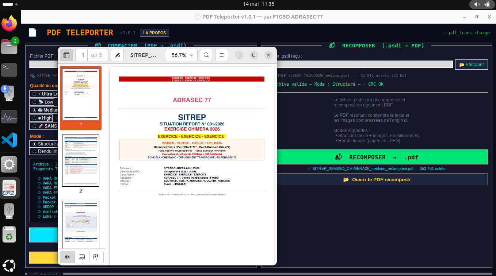

<div align="center">


# PDF Teleporter — Linux Edition

### Téléportation radio de documents PDF pour les opérateurs ADRASEC — version Linux

*Compression structurée — Transmission TNC Packet & VARA — Recomposition fidèle — Compatibilité Winlink Express — 5 niveaux de qualité — Mode rendu image — Estimation temps de transfert — Validation CRC — 100% hors-ligne*

[](https://github.com/f1gbd/F1GBD/releases/tag/pdfteleporter-linux-v1.0.5)
[]()
[]()
[]()
[]()

### 🐧 [**Télécharger la dernière version Linux**](https://github.com/f1gbd/F1GBD/releases/download/pdfteleporter-linux-v1.0.5/PDFteleporter-1.0.5-linux-x86_64.tar.gz)

*Version Windows disponible dans le [dossier parent](https://github.com/f1gbd/F1GBD/tree/master/pdfteleporter)*

</div>

---

## 🆕 Quoi de neuf en v1.0.5

> **Deux correctifs majeurs pour les PDF non-Microsoft** — Cette version intègre `pdf_trans` v1.0.5 qui résout deux problèmes spécifiques rencontrés sur les PDF produits par **LibreOffice** et par **Excel à très petites fontes** :
>
> **1) Caractères accentués corrompus dans les PDF LibreOffice** — Les mots contenant les ligatures `ti` ou `tt` (Situation, quitté, Éducation, nationale, lutte, routier, pollution…) apparaissaient avec un caractère de remplacement `�` après recomposition. Cause : LibreOffice utilise des glyphes Unicode non standard (Ɵ U+019F, Ʃ U+01A9) dans ses CIDFonts que PyMuPDF convertit en `U+FFFD`. La v1.0.5 décompose ces ligatures et restaure les mots français corrects via une heuristique contextuelle (`ti` par défaut, `tt` devant é/è/ê ou après `lu-`).
>
> **2) Débordement persistant sur PDF Excel à fontes ~4 pt** — Les bbox optimisés au pixel près d'Excel ne laissent pas de place à la marge interne par défaut de l'engine HTML PyMuPDF. La v1.0.5 ajoute une compensation horizontale de 0.5 pt et un mécanisme d'auto-réduction de police (`scale_low=0.5`) pour faire tenir le texte sans le tronquer.
>
> **Action recommandée** : mettez à jour si vous transmettez des SITREP produits par LibreOffice (Linux, Mac) ou des tableaux denses Excel. Les archives `.psdi` produites par les versions antérieures (v1.0.0, v1.0.1, v1.0.2) restent **entièrement lisibles** et bénéficient automatiquement des deux fix côté recomposition.
>
> **Linux** : aucun changement spécifique côté Linux par rapport à v1.0.2 — les deux correctifs sont entièrement dans `pdf_trans.py`. Le binaire Linux v1.0.5 est compilé avec les nouvelles sources.

---

## 🎯 À qui s'adresse cette version ?

La version **Linux** de PDF Teleporter est destinée aux opérateurs ADRASEC qui :

- 🐧 Utilisent **Linux** comme système principal sur leur poste opérationnel (Ubuntu, Debian, Linux Mint, Fedora…)
- 🔋 Disposent d'un **laptop léger** ou d'un mini-PC pour leurs sorties terrain
- 🔒 Privilégient **l'indépendance vis-à-vis de Microsoft** pour leurs documents sensibles ADRASEC
- 🎓 Préparent des **VM Linux** de formation pour leur section départementale

**100 % des fonctionnalités** de la version Windows sont disponibles sous Linux : c'est exactement la même application, recompilée pour Linux.

---

## 📦 Ce que contient l'archive

```
PDFteleporter-1.0.5-linux-x86_64.tar.gz       (59 Mo compressé / 146 Mo extrait)
└── PDFteleporter-1.0.5-linux-x86_64/
    ├── bin/                    Binaire PyInstaller autonome
    │   ├── PDFteleporter       Exécutable ELF 64-bit
    │   └── _internal/          Python 3.12 + PyMuPDF + Pillow + Tkinter
    ├── PDFteleporter.png       Icône 256×256
    ├── install.sh              Script d'installation (utilisateur / système)
    ├── pdfteleporter           Lanceur direct (sans installation)
    └── README-LINUX.md         Documentation détaillée
```

**Aucune dépendance Python à installer** — tout est embarqué dans le binaire.

---

## 🚀 Installation en 3 étapes

### Étape 1 — Télécharger

👉 **[PDFteleporter-1.0.5-linux-x86_64.tar.gz](https://github.com/f1gbd/F1GBD/releases/download/pdfteleporter-linux-v1.0.5/PDFteleporter-1.0.5-linux-x86_64.tar.gz)** (~59 Mo)

Ou en ligne de commande :

```bash
wget https://github.com/f1gbd/F1GBD/releases/download/pdfteleporter-linux-v1.0.5/PDFteleporter-1.0.5-linux-x86_64.tar.gz
```

### Étape 2 — Extraire

```bash
tar xzf PDFteleporter-1.0.5-linux-x86_64.tar.gz
cd PDFteleporter-1.0.5-linux-x86_64
```

### Étape 3 — Installer (au choix selon votre besoin)

#### Option A — Lancer sans rien installer *(le plus rapide)*

```bash
./pdfteleporter
```

L'application démarre immédiatement. Idéal pour tester ou pour un usage ponctuel depuis une clé USB.

#### Option B — Installation utilisateur *(recommandée)*

```bash
chmod +x install.sh
./install.sh
```

Cela installe PDFteleporter dans `~/.local/share/PDFteleporter/`, crée un raccourci dans le **menu Applications** et la commande terminal `pdfteleporter`. **Pas de droits root requis**.

Après cette étape, vous pouvez lancer PDFteleporter :

- 🖱 Depuis le **menu Applications** → chercher « PDF Teleporter »
- 💻 Depuis un **terminal** → taper `pdfteleporter`
- 📌 En **épinglant l'icône** au dock ou à la barre des tâches

#### Option C — Installation système *(pour postes partagés)*

```bash
chmod +x install.sh
sudo ./install.sh --system
```

Installe dans `/opt/PDFteleporter/`, raccourci pour tous les utilisateurs. Utile pour les **postes opérationnels partagés** en cellule de coordination.

#### Désinstallation

```bash
./install.sh --uninstall                  # mode utilisateur
sudo ./install.sh --uninstall --system    # mode système
```

---

## 🐧 Distributions testées

| Distribution | Version | Statut |
|---|---|---|
| **Ubuntu** | 22.04 LTS / 24.04 LTS / 24.10 | ✅ Fonctionne |
| **Debian** | 12 (Bookworm) / 13 (Trixie) | ✅ Fonctionne |
| **Linux Mint** | 21.x / 22.x | ✅ Fonctionne |
| **Fedora** | 39 / 40 / 41 | ✅ Fonctionne |

### Dépendances système

Le binaire embarque Python et toutes ses libs, mais il a besoin des bibliothèques X11 / Tkinter de base. Normalement déjà présentes sur tout système graphique :

```bash
# Ubuntu / Debian / Linux Mint
sudo apt install libxcb-shape0 libxcb-cursor0 libxcb-icccm4 \
                 libxcb-keysyms1 libxkbcommon-x11-0 libfontconfig1

# Fedora / RHEL
sudo dnf install libxcb xcb-util-cursor xcb-util-wm \
                 libxkbcommon-x11 fontconfig
```

En pratique, sur un poste avec un environnement de bureau (GNOME, KDE, XFCE, Cinnamon, MATE…), tout est déjà installé.

---


---

## 🔍 Vérification d'intégrité

Le SHA-256 de l'archive est publié sur la page de release GitHub :

```bash
sha256sum PDFteleporter-1.0.5-linux-x86_64.tar.gz
```

Comparez avec la valeur publiée sur :
👉 https://github.com/f1gbd/F1GBD/releases/tag/pdfteleporter-linux-v1.0.5

Ou via le fichier `.sha256` joint à la release :

```bash
wget https://github.com/f1gbd/F1GBD/releases/download/pdfteleporter-linux-v1.0.5/PDFteleporter-1.0.5-linux-x86_64.tar.gz.sha256
sha256sum -c PDFteleporter-1.0.5-linux-x86_64.tar.gz.sha256
```

---

## 🎨 Captures d'écran

L'interface Linux est **strictement identique** à la version Windows : même thème sombre TCQ, mêmes boutons, mêmes panneaux, même journal opérationnel.

<div align="center">



*PDFteleporter v1.0.5 tournant nativement sous Linux — interface identique à Windows*

</div>

---

## ⭐ Fonctionnalités

Identiques à la version Windows :

| Icône | Fonctionnalité |
|:---:|---|
| 📦 | **Compression structurée** PDF → `.psdi` (5 niveaux de qualité) |
| 📬 | **Recomposition fidèle** `.psdi` → PDF |
| ⚡ | **5 niveaux de qualité** calibrés par mode radio (Ultra Low à High + Sans image) |
| 🎨 | **2 modes** : Structuré (texte + images) ou Rendu image (pages JPEG) |
| ⏱ | **Estimation du temps de transfert** pour chaque mode radio |
| ✅ | **Validation CRC** automatique à l'ouverture |
| 🛡 | **Compatibilité Microsoft Print To PDF / Word LTSC** (correctif fond noir v1.0.1) |
| 📐 | **Rendu fidèle des tableaux** *(v1.0.2)* — les libellés ne débordent plus des cellules colorées (Bilan humain, Moyens engagés…) |
| 🌍 | **Compatibilité LibreOffice et Excel densifié** *(nouveau v1.0.5)* — les caractères accentués des PDF LibreOffice (Situation, Éducation, lutte…) sont restaurés correctement et les tableaux Excel à très petites fontes (~4 pt) ne débordent plus de leurs cellules |
| 📧 | **Bouton « Préparer pour Winlink »** avec procédure adaptée à Linux |
| 📋 | **Journal opérationnel** horodaté avec code couleur |
| 🌐 | **Compatible TCQ et Winlink Express** — format `.psdi` partagé |
| 🔒 | **100 % local** — aucune connexion Internet, aucune télémétrie |

### Différences avec la version Windows

| Point | Windows | Linux |
|---|---|---|
| Dossier de travail Winlink | `%USERPROFILE%\Documents\PDFteleporter\` | `~/Documents/PDFteleporter/` |
| Ouverture de fichier / dossier | `os.startfile()` (Explorer) | `xdg-open` (gestionnaire de fichiers du DE) |
| Console au démarrage | Masquée automatiquement | Aucune console — c'est un binaire GUI |
| DPI awareness | Géré pour Windows 10/11 | Géré nativement par X11 / Wayland |

---

## 🐛 Dépannage

### `error while loading shared libraries: libXxx.so`

Une bibliothèque X11 manque. Installez les dépendances listées dans la section *Distributions testées*.

### `cannot open display`

Vous êtes connecté en SSH sans display X11. PDFteleporter est une application graphique — il faut soit un environnement de bureau local, soit un SSH avec X11 forwarding (`ssh -X user@host`).

### Le binaire ne s'exécute pas (`Permission denied`)

```bash
chmod +x bin/PDFteleporter install.sh pdfteleporter
```

### L'icône ne s'affiche pas dans le menu après installation

Forcez la mise à jour des caches :

```bash
update-desktop-database ~/.local/share/applications
gtk-update-icon-cache -f -t ~/.local/share/icons/hicolor
```

Puis déconnectez et reconnectez votre session.

### Le PDF recomposé apparaît avec un fond noir

Vous utilisez une version antérieure à 1.0.1. Téléchargez la dernière version — la v1.0.1 a introduit le correctif pour les PDF générés par Microsoft Print To PDF et Microsoft Word LTSC (la v1.0.5 le conserve).

### Les textes débordent des cellules de tableaux à la recomposition

Vous utilisez une version antérieure à 1.0.2. Téléchargez la dernière version — la v1.0.2 a introduit le correctif du débordement des libellés dans les cellules colorées (Bilan humain, Moyens engagés, Activité de secours…). Les archives `.psdi` produites par les versions antérieures sont automatiquement rendues correctement par la v1.0.5.

### Les textes débordent encore sur les PDF Excel à très petites fontes

Spécifique aux PDF Excel à fontes ~4 pt avec des cellules optimisées au pixel près. La v1.0.5 ajoute une compensation de la marge interne de l'engine HTML PyMuPDF (élargissement de 0.5 pt de chaque côté du bbox) et un mécanisme d'auto-réduction de la taille de police (`scale_low=0.5`) pour faire tenir le texte sans le tronquer.

### Caractères accentués corrompus (Situa�on, qui�é, Éduca�on, lu�e…)

Spécifique aux PDF générés par **LibreOffice** qui utilise des glyphes de ligature non standard (Ɵ pour `ti`, Ʃ pour `tt`) que PyMuPDF convertit en `U+FFFD` (caractère de remplacement). La v1.0.5 décompose automatiquement ces ligatures et restaure les mots français corrects (Situation, quitté, Éducation, lutte, routier, pollution…) via une heuristique contextuelle.

---


## 📚 Documentation associée

- 📘 **[Manuel utilisateur (MEMO-PDFteleporter_MANUEL.pdf)](../doc/MEMO-PDFteleporter_MANUEL.pdf)** — Guide pas-à-pas (Windows + Linux)
- 📋 **[Fiche de présentation](../doc/PDFteleporter_FICHE_PRESENTATION.pdf)** — Synthèse opérationnelle
- 🪟 **[Version Windows](https://github.com/f1gbd/F1GBD/tree/master/pdfteleporter)** — README et téléchargement Windows

---

## 🤝 Communauté

PDF Teleporter est un **projet open développé pour la communauté ADRASEC**, proposé librement aux opérateurs ADRASEC départementales et à la FNRASEC.

L'application complète l'écosystème **TCQ / IAbrain / SATER SIM** dans la chaîne d'outils de communications d'urgence en sécurité civile.

La version Linux est particulièrement adaptée :

- 🥧 Aux **stations Raspberry Pi de campagne** (déjà utilisées pour direwolf, fldigi, hamlib)
- 💻 Aux **opérateurs migrés sous Linux** pour leur poste personnel
- 🎓 Aux **VM de formation** distribuées en section
- 🏢 Aux **postes mutualisés** sous Linux des cellules de coordination FNRASEC

Toute contribution, retour d'expérience et proposition d'amélioration sont bienvenus via les *Issues* du dépôt GitHub.

---

<div align="center">

### 📡 Auteur

**Jean-Louis Naudin (F1GBD / F4JHW)**
*ADRASEC 77 — FNRASEC*

**Version 1.0.5 Linux — Juin 2026**

---

*Pour toute question, contactez votre référent ADRASEC départemental.*

🐧 **PDF Teleporter Linux** — *La téléportation radio des documents au service de la sécurité civile*

</div>
