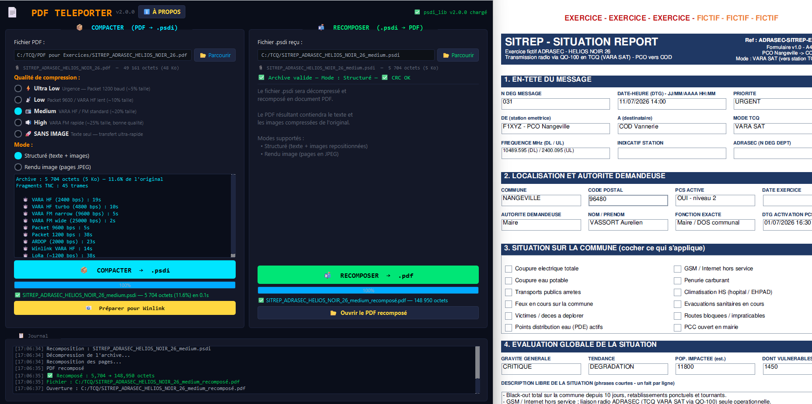

<div align="center">


# PDF Teleporter — Linux

### Envoyer un document PDF par radio, et le retrouver intact à l'arrivée

*Pour les opérateurs ADRASEC / FNRASEC — TNC Packet, VARA HF/FM/SAT, Winlink Express*

[](https://github.com/f1gbd/F1GBD/releases/tag/pdfteleporter-linux-v1.1.0)
[]()
[]()
[]()
[]()
[]()

### 🐧 Télécharger

**[⬇ PDFteleporter-1.1.0-linux-x86_64.tar.gz (78 Mo)](https://github.com/f1gbd/F1GBD/releases/download/pdfteleporter-linux-v1.1.0/PDFteleporter-1.1.0-linux-x86_64.tar.gz)**

[Version Windows](../README.md) · [Toutes les versions](https://github.com/f1gbd/F1GBD/releases?q=pdfteleporter)

</div>

> ### ❗ Vérifiez votre glibc avant de télécharger
>
> Ce binaire est compilé sur **Ubuntu 24.04 LTS**. PyInstaller lie l'exécutable à
> la glibc de la machine de compilation : il **ne démarrera pas** sur une
> distribution plus ancienne — Ubuntu 22.04, Debian 12, Mint 21 — avec un message
> du type `GLIBC_2.39 not found`.
>
> ```bash
> ldd --version | head -1
> ```
>
> **2.39 ou plus** → cette archive convient.
> **Moins de 2.39** → [recompilez sur votre poste](#compiler-depuis-les-sources),
> c'est une seule commande.

---

<a id="correctif-okular"></a>

## ⚠️ Correctif important en v1.1.0

Un PDF **annoté sous Okular** — cas courant d'un « Point de situation » rempli
sous Linux — ressortait de la recomposition avec **ses valeurs saisies
remplacées par des chapelets de « ti »** : `F4LTV` devenait `tititititi`,
`09h00` devenait `tititititi`.

Tout le reste de la page — tableaux, couleurs de cellule, libellés, totaux —
était parfaitement restitué. C'est ce qui rendait le défaut si déroutant :
**seules les valeurs saisies par l'opérateur disparaissaient**, sans aucun signe
d'erreur. Toutes les versions jusqu'à la v1.0.7 incluse sont concernées, ainsi
que **TCQ**.

> 📌 Le correctif agit à la **compression**. Une archive `.psdi` déjà produite à
> partir d'un tel PDF contient les « ti » et **ne peut pas être réparée** : il
> faut recompacter le PDF d'origine.

[Détail technique →](../CHANGELOG.md#v210)

---

## 🖥 Nouveauté : la même application que sous Windows

La v1.1.0 marque la **convergence des deux plateformes**. Linux et Windows sont
désormais produits à partir des **mêmes sources** : l'ancienne interface Tkinter
laisse la place à l'interface **PyQt6** déjà en service côté Windows.

| | |
|---|---|
| 🔍 **Rendu haute résolution** | net sur les écrans 4K et les postes à mise à l'échelle |
| ⏳ **Barre de progression réelle** | pendant la compression et la recomposition |
| 🖱 **Glisser-déposer** | un `.pdf` ou un `.psdi` déposé sur la fenêtre part dans le bon panneau |
| 📋 **Journal en fenêtre séparée** | **Ctrl+J**, redimensionnable, à laisser ouverte à côté |
| ↕ **Mise en page adaptée** | tient sur un 1360×768, l'écran des portables de terrain |

L'ergonomie ne change pas : deux panneaux, cinq niveaux de qualité, deux modes
d'extraction, bouton Winlink. Un opérateur formé sur la v1.0.x retrouve ses
repères immédiatement.

Pour la maintenance, c'est un changement de fond : **un correctif écrit une fois
vaut désormais pour les deux plateformes**.

---

## 🚀 Installation

```bash
wget https://github.com/f1gbd/F1GBD/releases/download/pdfteleporter-linux-v1.1.0/PDFteleporter-1.1.0-linux-x86_64.tar.gz
tar xzf PDFteleporter-1.1.0-linux-x86_64.tar.gz
cd PDFteleporter
./pdfteleporter.sh
```

Aucune dépendance Python à installer : Python, PyQt6, PyMuPDF et Pillow sont
embarqués dans le binaire.

> 💡 **Lancez toujours par `pdfteleporter.sh`**, pas par le binaire directement.
> Le lanceur nettoie `LD_LIBRARY_PATH` : sans cela, l'ouverture du PDF recomposé
> par `xdg-open` échoue, parce que le gestionnaire de fichiers hérite des
> bibliothèques embarquées au lieu de celles du système.

### Raccourci dans le menu Applications

```bash
cp PDFteleporter.desktop ~/.local/share/applications/
update-desktop-database ~/.local/share/applications/ 2>/dev/null || true
```

Le fichier `.desktop` contient des **chemins absolus** : éditez-le si vous
déplacez le dossier. Pour un poste partagé, copiez-le dans
`/usr/share/applications/` après avoir placé l'application dans `/opt/`.

### Bibliothèques système requises par Qt

```bash
# Debian / Ubuntu / Mint
sudo apt install libxcb-cursor0 libxkbcommon-x11-0 libegl1

# Fedora / RHEL
sudo dnf install xcb-util-cursor libxkbcommon-x11 mesa-libEGL
```

Sur un poste avec un environnement de bureau, l'essentiel est déjà là —
`libxcb-cursor0` est le seul qui manque régulièrement. Si l'application ne
démarre pas, lancez-la depuis un terminal : Qt nomme précisément la
bibliothèque absente.

### Vérification d'intégrité

```bash
wget https://github.com/f1gbd/F1GBD/releases/download/pdfteleporter-linux-v1.1.0/PDFteleporter-1.1.0-linux-x86_64.tar.gz.sha256
sha256sum -c PDFteleporter-1.1.0-linux-x86_64.tar.gz.sha256
```

---

## 📦 Contenu de l'archive

```
PDFteleporter-1.1.0-linux-x86_64.tar.gz        78 Mo compressé / 196 Mo extrait
└── PDFteleporter/
    ├── PDFteleporter            binaire ELF 64 bits autonome
    ├── pdfteleporter.sh         lanceur recommandé (nettoie LD_LIBRARY_PATH)
    ├── PDFteleporter.desktop    raccourci menu Applications
    ├── INSTALL.txt              installation et prérequis
    ├── LICENSE
    └── _internal/               Python + PyQt6 + PyMuPDF + Pillow embarqués
```

> L'archive v1.0.7 fournissait un `install.sh`. Il a disparu avec le passage aux
> sources communes : l'installation se résume désormais aux deux commandes
> ci-dessus. Si ce script vous manquait, ouvrez une *Issue* — il est facile de le
> réintroduire dans le script de build.

---

## 🐧 Compatibilité des distributions

Le critère décisif est la **version de glibc**, pas le nom de la distribution.

| Distribution | glibc | Cette archive |
|---|---|---|
| **Ubuntu 24.04 LTS / 24.10 / 25.04** | 2.39+ | ✅ |
| **Debian 13 (Trixie)** | 2.41 | ✅ |
| **Fedora 40+** | 2.39+ | ✅ |
| **Linux Mint 22.x** | 2.39 | ✅ |
| Ubuntu 22.04 LTS | 2.35 | ❌ à recompiler |
| Debian 12 (Bookworm) | 2.36 | ❌ à recompiler |
| Linux Mint 21.x | 2.35 | ❌ à recompiler |

Recompiler prend quelques minutes et donne un binaire taillé pour vos postes —
voir ci-dessous.

---

<a id="compiler-depuis-les-sources"></a>

## 🔧 Compiler depuis les sources

Utile dans trois cas : votre distribution est plus ancienne que la glibc du
binaire publié, vous êtes sur **ARM64** (Raspberry Pi), ou vous voulez auditer
ce que vous déployez.

```bash
# Sources : dossier PDFteleporter_v2 du projet
chmod +x Build-PDFteleporter-linux.sh
./Build-PDFteleporter-linux.sh -p 1.1.0 -c -s
```

Le script crée un environnement virtuel **dédié** (PyQt6, PyMuPDF, Pillow,
PyInstaller — et rien d'autre, pour que PyInstaller n'embarque pas la moitié de
vos `site-packages`), compile, purge les modules Qt inutiles, teste le
démarrage, et produit l'archive `.tar.gz` avec son SHA-256.

| Option | Effet |
|---|---|
| `-p <version>` | numéro du paquet (défaut 1.1.0) |
| `-c` | repart de zéro |
| `-s` | supprime aussi les bibliothèques devenues orphelines (~10 Mo) |
| `-d <chemin>` | dossier de sortie |
| `-y <python>` | force l'interpréteur utilisé pour créer le venv |

Prérequis : `python3` ≥ 3.9 avec le module venv
(`sudo apt install python3-venv`).

**Compilez sur la distribution la plus ancienne que vous voulez supporter** :
le binaire obtenu fonctionnera sur toutes les plus récentes, l'inverse n'est pas
vrai.

### Raspberry Pi (ARM64)

L'archive publiée est compilée pour **x86_64**. Sur un Pi 4/5 sous Raspberry Pi
OS aarch64, le script de build fonctionne tel quel et produit un binaire ARM64.
Pour un essai rapide, sans compilation :

```bash
pip install PyQt6 pymupdf Pillow
python3 PDFteleporter.py
```

---

## 🎨 L'interface

<div align="center">

<!-- TODO : remplacer par une capture prise sous Linux avec la v1.1.0.
     Celle-ci vient de la version Windows ; l'interface est identique, seuls
     les décors de fenêtre du gestionnaire de bureau diffèrent. -->


*Un SITREP ADRASEC de 49 161 octets compacté en 5 704 octets (11,6 %, 45 trames
TNC), puis recomposé à droite — cases à cocher et tableaux intacts.*

</div>

---

## ⭐ Fonctionnalités

Strictement identiques à la version Windows — c'est le même code.

| | |
|:---:|---|
| 📦 | **Compression PDF → `.psdi`**, 5 niveaux calibrés par mode radio |
| 📬 | **Recomposition `.psdi` → PDF** avec la mise en forme d'origine |
| 🎨 | **2 modes d'extraction** : Structuré ou Rendu image, avec bascule automatique pour les PDF scannés ou tournés |
| ⏱ | **Estimation du temps de transfert** — Packet 1200/9600, VARA HF/FM/SAT, ARDOP, LoRa |
| ✅ | **Validation CRC** dès l'ouverture d'une archive reçue |
| ☑️ | **Cases à cocher AcroForm préservées** — SITREP ADRASEC, fiches COD/SIDPC remplies |
| 📐 | **Rendu fidèle** des tableaux, accents LibreOffice, fontes ~4 pt d'Excel |
| 📧 | **Préparation Winlink** avec alerte au-delà de 120 Ko |
| 🔒 | **100 % local** — aucune connexion, aucune télémétrie |

### Différences avec la version Windows

| Point | Windows | Linux |
|---|---|---|
| Installation | installeur `.exe` | archive `tar.gz` |
| Association `.psdi` | automatique | via le fichier `.desktop` |
| Dossier Winlink | `%USERPROFILE%\Documents\PDFteleporter\` | `~/Documents/PDFteleporter/` |
| Ouverture de fichier | `os.startfile()` | `xdg-open`, d'où le lanceur `pdfteleporter.sh` |
| Taille installée | 106 Mo | 196 Mo — Qt sous Linux embarque ICU (~40 Mo) |

---

## 🔄 Interopérabilité

Le format `.psdi` est **inchangé depuis la v1.0.0**. Une archive produite ici se
recompose sous Windows, avec les versions v1.0.x, et avec le module PDF de
**TCQ** — et réciproquement. Aucune coordination de mise à jour n'est nécessaire
au sein d'une section : les postes en v1.1.0 et ceux restés en v1.0.7 continuent
de travailler ensemble.

---

## 🐛 Dépannage

**`GLIBC_2.39 not found`** — votre distribution est plus ancienne que celle de
compilation. [Recompilez sur votre poste](#compiler-depuis-les-sources).

**`qt.qpa.plugin: Could not load the Qt platform plugin "xcb"`** — il manque une
bibliothèque X11. Relancez avec `QT_DEBUG_PLUGINS=1 ./pdfteleporter.sh` : la
sortie nomme la bibliothèque absente. Dans neuf cas sur dix, c'est
`libxcb-cursor0`.

**`cannot open display`** — vous êtes en SSH sans display. L'application est
graphique : il faut un bureau local, ou `ssh -X`.

**`Permission denied`** — `chmod +x PDFteleporter pdfteleporter.sh`.

**Le PDF recomposé ne s'ouvre pas à la fin** — vous avez lancé le binaire
directement au lieu de `pdfteleporter.sh`. Le lanceur nettoie `LD_LIBRARY_PATH`,
sans quoi `xdg-open` hérite des bibliothèques embarquées.

**L'icône n'apparaît pas dans le menu** —
`update-desktop-database ~/.local/share/applications`, puis reconnectez la
session. Vérifiez aussi que les chemins du `.desktop` pointent bien où le
dossier se trouve.

**Les valeurs saisies ressortent en « ti »** — vous utilisez une version
antérieure à la v1.1.0. Voir le [correctif ci-dessus](#correctif-okular).
Les archives déjà produites doivent être recompactées depuis le PDF d'origine.

**Fond noir, texte débordant des cellules, accents corrompus, cases à cocher
disparues** — correctifs des v1.0.1 à v1.0.7, tous présents ici. Si vous les
observez encore, vous utilisez une version antérieure : voir le
[CHANGELOG](../CHANGELOG.md).

---

## 📚 Documentation

- 📘 **[Manuel utilisateur](../doc/MEMO-PDFteleporter_MANUEL.pdf)** — guide pas-à-pas
- 📋 **[Fiche de présentation](../doc/PDFteleporter_FICHE_PRESENTATION.pdf)** — synthèse d'une page
- 📝 **[CHANGELOG](../CHANGELOG.md)** — historique complet des versions
- 🪟 **[Version Windows](../README.md)** — README et téléchargement

---

## 🤝 Communauté

PDF Teleporter est un projet ouvert développé pour la communauté ADRASEC,
proposé librement aux ADRASEC départementales et à la FNRASEC. Il complète
l'écosystème **TCQ / IAbrain / SATER SIM**.

La version Linux est particulièrement adaptée aux **stations de campagne** (en
complément de direwolf, fldigi, hamlib), aux **opérateurs migrés sous Linux**,
aux **VM de formation** distribuées en section, et aux **postes mutualisés** des
cellules de coordination.

Retours d'expérience et propositions sont bienvenus via les *Issues* du dépôt.

---

<div align="center">

**Jean-Louis Naudin (F1GBD)**
*ADRASEC 77 — FNRASEC*

**Paquet Linux v1.1.0 — Septembre 2026** · *application v2.1.0*

*Pour toute question, contactez votre référent ADRASEC départemental.*

🐧 **PDF Teleporter** — *La téléportation radio des documents au service de la sécurité civile*

</div>
