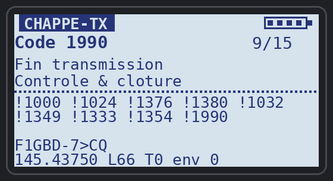
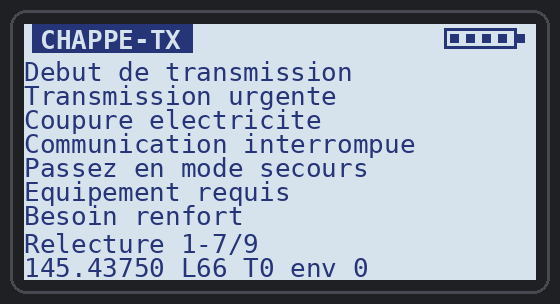

# Quansheng UV-K1 / UV-K5 v3 — applications Sécurité Civile

Applications overlay (`.app`) pour le firmware F4HWN édition Labs, développées
pour les missions ADRASEC / FNRASEC, et leur outil d'installation.

### ▶ [Ouvrir l'UV-K1 Apps Uploader](https://f1gbd.github.io/F1GBD/quansheng/)

  
  &nbsp;&nbsp;
  

<em>Quansheng UV-K1(8) v3 et son écran sous firmware F4HWN</em>

## UV-K1 Apps Uploader

Page web d'installation par **Web Serial** (Chrome / Edge, ordinateur) :
**https://f1gbd.github.io/F1GBD/quansheng/** — elle ne demande aucun logiciel :
brancher la radio, choisir l'application, installer.

> Le lien `github.com/.../blob/master/quansheng/index.html` n'affiche que le code
> source de la page : utilisez l'adresse GitHub Pages ci-dessus.

- Lecture de la version du firmware et des 16 emplacements Apps de la radio.
- Catalogue des applications de ce dépôt (`apps/manifest.json`) ou fichier `.app` local.
- Contrôle du fichier avant envoi : signature FAP1, ABI, tailles, CRC-32 du code et des ressources.
- Installation : effacement, ressources, code, en-tête en dernier, vérification.
  Une mise à jour garde les réglages de l'application.
- Effacement d'un emplacement.

Le protocole (commandes 0x0514, 0x0730 à 0x0737) est celui du firmware d'Armel
F4HWN, également utilisé par UV Studio ; il est implémenté dans [`uvproto.js`](uvproto.js).

## Essai sur l'air

Premiers essais réussis le 9 octobre 2026 : TCQ (TNC Packet, Direwolf) envoie
`#RA ADRASEC77` depuis F1GBD-3, le UV-K1 sous PAGER-RASEC déclenche l'alerte
(écran, LED, sirène) puis affiche « ALERTE recue » après acquittement.

  
  &nbsp;&nbsp;
  

<em>À gauche : l'alerte reçue de F1GBD-3. À droite : l'écran de veille après acquittement
(PAGER-RASEC v1.0, VFO sur 430.4375 MHz, signal −96 dBm, 2 alertes).</em>

Puis le décodage CHAPPE26 : TCQ envoie `!1000 !1024 !1376 !1380 !1032 !1349 !1333 !1354 !1990`,
le UV-K1 l'affiche en clair.

  
  &nbsp;&nbsp;
  

<em>Message CHAPPE26 de 9 codes envoyé par TCQ et décodé sur le UV-K1 (en v1.2.1).</em>

## CHAPPE-TX : émettre un message CHAPPE26 depuis le UV-K1

Avec **CHAPPE-TX**, l'opérateur de terrain compose le message au clavier (la radio
affiche la phrase en clair de chaque code), le relit, puis l'émet par **PTT** en une
trame AX.25 `F1GBD-7>CQ`. TCQ (**v14.1 ou plus récent**, onglet TNC Packet) et PAGER-RASEC
le traduisent automatiquement.

  
  &nbsp;&nbsp;
  

<em>Message de 9 codes prêt à partir, puis relecture en clair (F puis MENU) — maquettes d'écran</em>

**Indicatif** (nouveau en v1.1) : il se saisit sur la radio, sans PC — **F puis 0**, lettres
avec **< / >**, chiffres au clavier, **\*** pour passer au caractère suivant, **MENU** pour
valider (le SSID se règle à part, F 3 / F 9). Au premier lancement l'éditeur s'ouvre seul.

Saisie : taper les 4 chiffres du code puis **MENU** pour l'ajouter ; **< / >** parcourt le
répertoire, **\*** retire le dernier code, **F MENU** relit, **PTT** émet. Le code 1000 est
déjà affiché au lancement.

| Exemple | Touches | Trame émise | Reçu en clair | Durée |
|---|---|---|---|---|
| Test de liaison | `1000 MENU 1016 MENU 1990 MENU PTT` | `!1000 !1016 !1990` | Debut de transmission. Test de liaison. Fin transmission. | 0,55 s |
| Demande d'ambulance | `1204 MENU PTT` | `!1204` | Ambulance requise. | 0,47 s |
| Black-out | `1000 MENU 1024 MENU 1376 MENU 1380 MENU 1032 MENU 1349 MENU 1333 MENU 1354 MENU 1990 MENU PTT` | `!1000 !1024 !1376 !1380 !1032 !1349 !1333 !1354 !1990` | Debut de transmission. Transmission urgente. Coupure electricite. Communication interrompue. Passez en mode secours. Equipement requis. Besoin renfort. Coordination requise. Fin transmission. | 0,79 s |
| Incendie majeur | `1000 MENU 1024 MENU 1303 MENU 1302 MENU 1314 MENU 1329 MENU 1204 MENU 1333 MENU 1990 MENU PTT` | `!1000 !1024 !1303 !1302 !1314 !1329 !1204 !1333 !1990` | Debut de transmission. Transmission urgente. Incendie signale. Incident majeur. Evacuation requise. Victimes signalees. Ambulance requise. Besoin renfort. Fin transmission. | 0,79 s |
| Inondation | `1000 MENU 1024 MENU 1308 MENU 1314 MENU 1366 MENU 1392 MENU 1369 MENU 1990 MENU PTT` | `!1000 !1024 !1308 !1314 !1366 !1392 !1369 !1990` | Debut de transmission. Transmission urgente. Inondation. Evacuation requise. Refuge ouvert. Hebergement requis. Ravitaillement requis. Fin transmission. | 0,75 s |
| Accusé d'un ordre | `1001 MENU 1002 MENU 1326 MENU 1103 MENU 1990 MENU PTT` | `!1001 !1002 !1326 !1103 !1990` | Message recu. Message compris. Equipe secours en route. Dans 10 minutes. Fin transmission. | 0,63 s |
| Fin d'intervention | `1000 MENU 1316 MENU 1352 MENU 1328 MENU 1397 MENU 1990 MENU PTT` | `!1000 !1316 !1352 !1328 !1397 !1990` | Debut de transmission. Evacuation terminee. Situation sous controle. Intervention terminee. Fin operation. Fin transmission. | 0,67 s |

Trames décodées (FCS correcte) et durées mesurées sur l'application réelle en émulation ;
premier essai sur l'air le 9 octobre 2026 : trame reçue par TCQ. Détails : [notice](apps/CHAPPE-TX.md) et
[manuel CHAPPE-TX](documentation/CHAPPE-TX_Manuel_v1.1.pdf).

## Documentation

| Document | Formats |
|---|---|
| PAGER-RASEC v1.3 — Manuel d'installation et d'utilisation | [PDF](documentation/PAGER-RASEC_Manuel_v1.3.pdf) |
| CHAPPE-TX v1.1 — Manuel d'utilisation et exemples de transmission | [PDF](documentation/CHAPPE-TX_Manuel_v1.1.pdf) |
| Code CHAPPE26 — Livret de poche B5 (18 pages) : répertoire des 1000 codes, carte opérateur, chiffrement | [PDF](documentation/Chappe26_Livret_B5.pdf) |
| Code CHAPPE26 — Fiche exemple Black-out : demande de moyens radio de secours | [PDF](documentation/Chappe26_Fiche_BlackOut.pdf) |
| Code CHAPPE26 — Fiche exemple Incendie majeur : renforts, évacuation, radio en zone blanche | [PDF](documentation/Chappe26_Fiche_Incendie.pdf) |

## Applications

| Application | Version | Rôle |
|---|---|---|
| [PAGER-RASEC](apps/PAGER-RASEC.md) ([manuel PDF](documentation/PAGER-RASEC_Manuel_v1.3.pdf)) | 1.3 | Pager RASEC-ALERT : réception AX.25 Packet 1200 bauds depuis TCQ, lampe blanche frontale + sirène sur `#ra <code>`, messages CHAPPE26 en clair, historique de 6 messages, 145.4375 MHz FM |
| [CHAPPE-TX](apps/CHAPPE-TX.md) ([manuel PDF](documentation/CHAPPE-TX_Manuel_v1.1.pdf)) | 1.1 | Émetteur CHAPPE26 : message composé au clavier (phrases en clair, relecture), émis en AX.25 Packet 1200 bauds vers CQ comme TCQ — reçu en clair par TCQ et PAGER-RASEC |
| CHAPPE26 | 1.0 | Dictionnaire CHAPPE26 (1000 codes) pour PAGER-RASEC et CHAPPE-TX — à installer avec eux |

## Ajouter une application

1. Construire le `.app` (`./compile-app.sh <app>` dans l'arborescence firmware).
2. Copier le `.app` et sa notice dans `apps/`.
3. Ajouter une entrée dans `apps/manifest.json` (`file`, `name`, `version`, `title`, `summary`, `doc`).

ADRASEC 77 · F1GBD — 73
