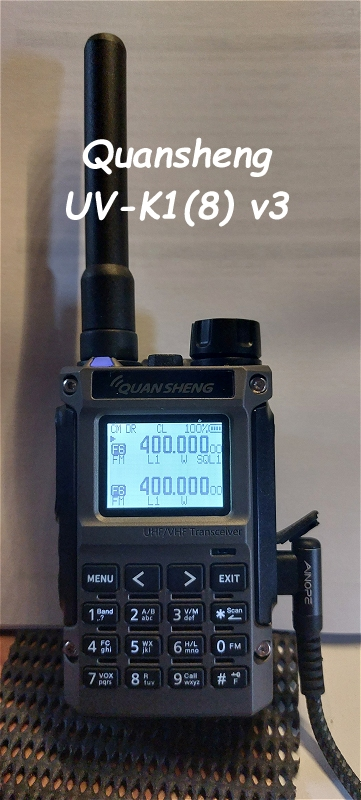
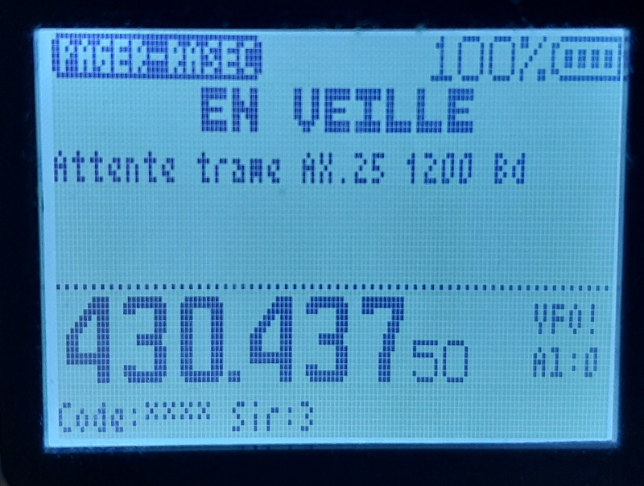
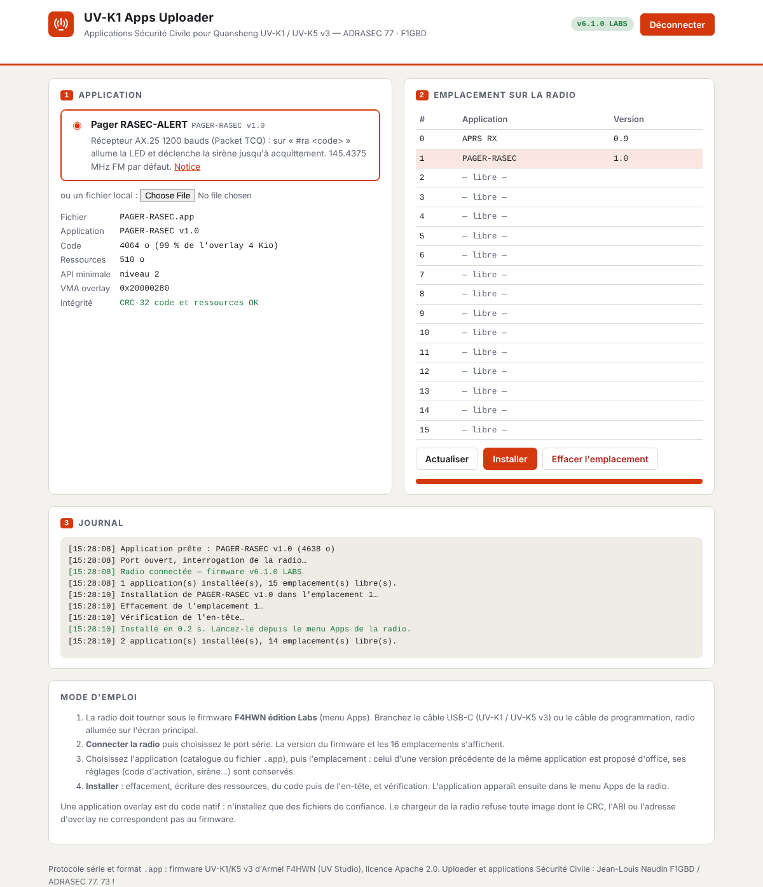
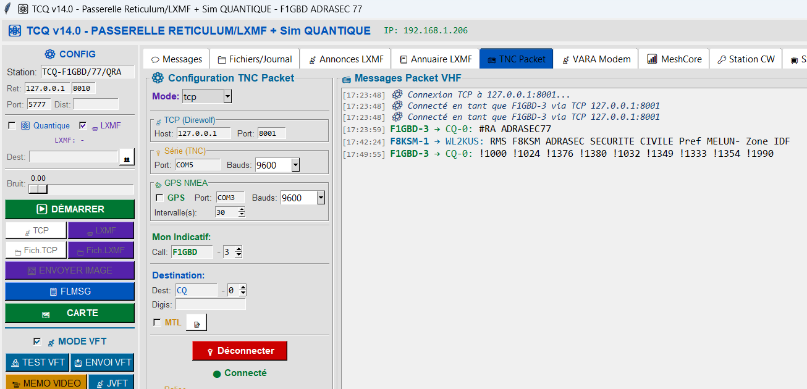
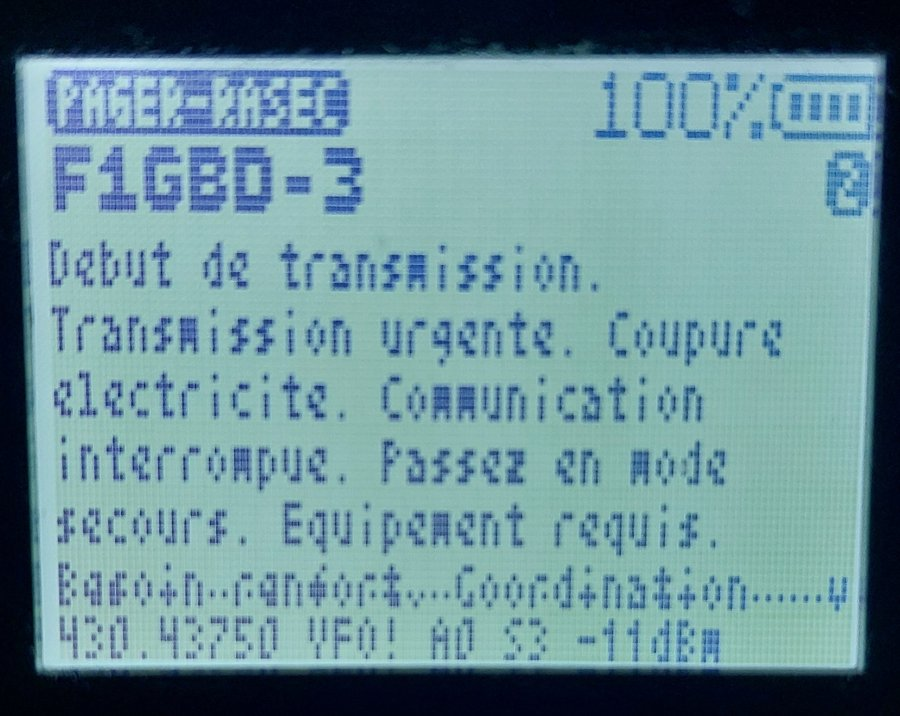

# Quansheng UV-K1 / UV-K5 v3 — applications Sécurité Civile

Applications overlay (`.app`) pour le firmware F4HWN édition Labs, développées
pour les missions ADRASEC / FNRASEC, et leur outil d'installation.

### ▶ [Ouvrir l'UV-K1 Apps Uploader](https://f1gbd.github.io/F1GBD/quansheng/)

  
  &nbsp;&nbsp;
  

<em>Quansheng UV-K1(8) v3 et son écran sous firmware F4HWN</em>

## UV-K1 Apps Uploader

Page web d'installation par **Web Serial** (Chrome / Edge, ordinateur) :
**https://f1gbd.github.io/F1GBD/quansheng/** — elle ne demande aucun logiciel :
brancher la radio, choisir l'application, installer.

> Le lien `github.com/.../blob/master/quansheng/index.html` n'affiche que le code
> source de la page : utilisez l'adresse GitHub Pages ci-dessus.

- Lecture de la version du firmware et des 16 emplacements Apps de la radio.
- Catalogue des applications de ce dépôt (`apps/manifest.json`) ou fichier `.app` local.
- Contrôle du fichier avant envoi : signature FAP1, ABI, tailles, CRC-32 du code et des ressources.
- Installation : effacement, ressources, code, en-tête en dernier, vérification.
  Une mise à jour garde les réglages de l'application.
- Effacement d'un emplacement.

Le protocole (commandes 0x0514, 0x0730 à 0x0737) est celui du firmware d'Armel
F4HWN, également utilisé par UV Studio ; il est implémenté dans [`uvproto.js`](uvproto.js).

## Essai sur l'air

Premiers essais réussis le 9 octobre 2026 : TCQ (TNC Packet, Direwolf) envoie
`#RA ADRASEC77` depuis F1GBD-3, le UV-K1 sous PAGER-RASEC déclenche l'alerte
(écran, LED, sirène) puis affiche « ALERTE recue » après acquittement.

  
  &nbsp;&nbsp;
  

<em>À gauche : l'alerte reçue de F1GBD-3. À droite : l'écran de veille après acquittement
(PAGER-RASEC v1.0, VFO sur 430.4375 MHz, signal −96 dBm, 2 alertes).</em>

Puis le décodage CHAPPE26 : TCQ envoie `!1000 !1024 !1376 !1380 !1032 !1349 !1333 !1354 !1990`,
le UV-K1 l'affiche en clair.

  
  &nbsp;&nbsp;
  

<em>Message CHAPPE26 de 9 codes envoyé par TCQ et décodé sur le UV-K1 (v1.1 ; en v1.2
la 6e ligne ne chevauche plus la ligne du bas et les messages sont conservés).</em>

## Documentation

| Document | Formats |
|---|---|
| PAGER-RASEC v1.2 — Manuel d'installation et d'utilisation | [PDF](documentation/PAGER-RASEC_Manuel_v1.2.pdf) · [Word](documentation/PAGER-RASEC_Manuel_v1.2.docx) |
| Code CHAPPE26 — Livret de poche B5 (18 pages) : répertoire des 1000 codes, carte opérateur, chiffrement | [PDF](documentation/Chappe26_Livret_B5.pdf) |
| Code CHAPPE26 — Fiche exemple Black-out : demande de moyens radio de secours | [PDF](documentation/Chappe26_Fiche_BlackOut.pdf) |
| Code CHAPPE26 — Fiche exemple Incendie majeur : renforts, évacuation, radio en zone blanche | [PDF](documentation/Chappe26_Fiche_Incendie.pdf) |

## Applications

| Application | Version | Rôle |
|---|---|---|
| [PAGER-RASEC](apps/PAGER-RASEC.md) ([manuel PDF](documentation/PAGER-RASEC_Manuel_v1.2.pdf)) | 1.2.1 | Pager RASEC-ALERT : réception AX.25 Packet 1200 bauds depuis TCQ, LED + sirène sur `#ra <code>`, messages CHAPPE26 en clair, historique de 6 messages, 145.4375 MHz FM |
| CHAPPE26 | 1.0 | Dictionnaire CHAPPE26 (1000 codes) pour PAGER-RASEC — à installer avec lui |

## Ajouter une application

1. Construire le `.app` (`./compile-app.sh <app>` dans l'arborescence firmware).
2. Copier le `.app` et sa notice dans `apps/`.
3. Ajouter une entrée dans `apps/manifest.json` (`file`, `name`, `version`, `title`, `summary`, `doc`).

ADRASEC 77 · F1GBD — 73
