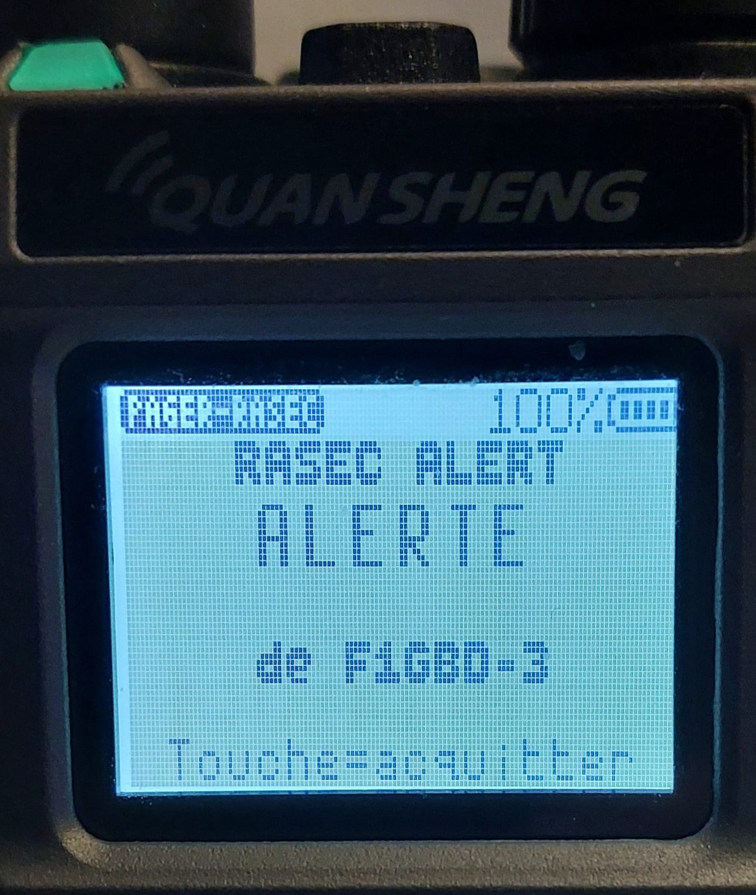
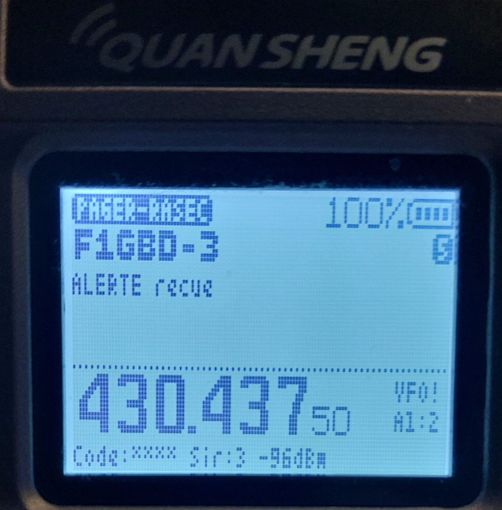

# PAGER-RASEC v1.1 — pager RASEC-ALERT pour Quansheng UV-K1 / UV-K5 v3

Application overlay (`.app`) pour le firmware F4HWN édition Labs. Elle transforme
le portatif en **pager d'alerte ADRASEC** : elle écoute en permanence les trames
**AX.25 Packet 1200 bauds** envoyées par **TCQ** (onglet TNC Packet) et, à la
réception de la commande `#ra <code>`, **fait clignoter la LED et l'écran et
déclenche une sirène** jusqu'à l'acquittement par l'opérateur.

**Nouveau en v1.1 : décodage CHAPPE26.** Un message `!1000 !1024 !1990` est
affiché en clair, comme dans TCQ : « Debut de transmission. Transmission
urgente. Fin transmission. » — avec l'application dictionnaire **CHAPPE26**.

Manuel complet : [PDF](../documentation/PAGER-RASEC_Manuel_v1.1.pdf) ·
[Word](../documentation/PAGER-RASEC_Manuel_v1.1.docx)

| | |
|---|---|
| Fréquence par défaut | **145.4375 MHz FM** (mode FIX) |
| Modulation | AFSK Bell 202 1200 bauds, trames UI AX.25 (PID F0) |
| Code d'activation par défaut | `ADRASEC77` (identique à TCQ) |
| Sirène | bi-ton 900 / 620 Hz, 350 ms chacun, comme TCQ |
| CHAPPE26 | 1000 codes `!PPLL` décodés en clair (application CHAPPE26 requise) |
| Taille | 3944 o de code (overlay 4 Kio) + 2083 o de ressources ; CHAPPE26 : 7,2 ko de dictionnaire |

<p align="center">
  
  &nbsp;&nbsp;
  
</p>
<p align="center"><em>Essai sur l'air depuis TCQ : alerte reçue, puis écran après acquittement (v1.0)</em></p>

## Installation

1. Ouvrir l'**[UV-K1 Apps Uploader](../index.html)** dans Chrome ou Edge.
2. Brancher la radio (USB-C), **Connecter la radio**, choisir le port série.
3. Sélectionner **Pager RASEC-ALERT**, garder l'emplacement proposé, **Installer**.
4. Sélectionner **Dictionnaire CHAPPE26**, garder l'emplacement proposé, **Installer**
   (sans lui, les messages CHAPPE26 restent affichés en codes bruts).
5. Sur la radio : menu **Apps** → **PAGER-RASEC**. L'écran de veille indique
   « Dico CHAPPE26 : OK ».

Une mise à jour de l'application conserve ses réglages (code, sirène, options).

## Commandes RASEC-ALERT (envoyées depuis TCQ)

Les commandes sont celles de TCQ (`_rasec_check_message`), tapées dans le chat
TNC Packet, n'importe quelle destination :

| Message | Effet sur le pager |
|---|---|
| `#ra ADRASEC77` | **ALERTE** : écran inversé clignotant « RASEC ALERT / ALERTE / de F1GBD », LED verte clignotante, sirène. **N'importe quelle touche acquitte.** |
| `#b 5` | Nombre de cycles de sirène, 0 à 20 ; `#b 0` = sirène continue jusqu'à l'acquittement |
| `#rapass ADRASEC77 NOUVEAU` | Change le code d'activation (1 à 12 caractères, sensible à la casse) |

- Le code n'est jamais affiché en clair : l'écran résume la commande
  (« ALERTE recue », « Code active modifie », « #ra refuse: code invalide »…).
- Une copie digipétée d'une alerte, reçue dans les 5 s suivant l'acquittement,
  ne relance pas l'alerte.
- Tout autre message reçu est affiché (indicatif + texte) avec un double bip de
  notification.
- Le pager **n'émet pas d'accusé** en v1.0 (réception seule) : TCQ n'en attend pas.

## Messages CHAPPE26

Le code CHAPPE26 (répertoire de 1000 expressions, pages 10 à 19) se transmet
sous la forme `!PPLL` : `!1204` = page 12 (Santé générale), ligne 04 =
« Ambulance requise ». Règle de TCQ, reprise à l'identique :

| Message reçu | Affichage |
|---|---|
| `!1000 !1024 !1376 !1380 !1032 !1349 !1333 !1354 !1990` | Debut de transmission. Transmission urgente. Coupure electricite. Communication interrompue. Passez en mode secours. Equipement requis. Besoin renfort. Coordination requise. Fin transmission. |
| `!1204` (seul) | Ambulance requise. |
| `Rdv !1204 demain` (un seul code dans du texte) | affiché tel quel, pas de décodage |
| `!2500 !1990` | Code inconnu (2500). Fin transmission. |

Le texte en clair occupe jusqu'à 6 lignes de 32 caractères, coupées aux espaces ;
un `v` en bas à droite signale une suite : **haut / bas** pour la faire défiler.

## Écran et touches

```
 PAGER-RASEC  HP BIP        [batterie]
 F1GBD                              12   <- source, trames reçues
 Debut de transmission.                  <- texte, traduction CHAPPE26
 Transmission urgente. Coupure              ou résumé de commande
 electricite. Communication                 (6 lignes, défilement haut/bas)
 interrompue. Passez en mode
 secours. Equipement requis.
 Besoin renfort. Coordination          v
 - - - - - - - - - - - - - - - - - - - -
 145.43750 FIX A1 S3 -87dBm              <- fréquence, mode, alertes, sirène, niveau
```

| Touche | Action |
|---|---|
| 1 | Haut-parleur (écoute du canal) marche / arrêt — mémorisé |
| 2 | Effacer le dernier message et les compteurs |
| 3 | **Test local de l'alerte** |
| 4 | Bip des messages ordinaires marche / arrêt (« BIP » dans la barre d'état) — mémorisé |
| 5 | Mode **FIX 145.4375** / **VFO** (écoute sur la fréquence du VFO) — mémorisé |
| Haut / bas | Faire défiler un texte long |
| MENU | Afficher le code d'activation sur la ligne du bas (à la place de la fréquence) |
| EXIT | Quitter (le pager n'écoute que lorsque l'application est ouverte) |

**Mode FIX** : l'application accorde 145.4375 MHz tant que le VFO est dans la
bande 2 m (136-174 MHz). Si le VFO est ailleurs (UHF, bande aviation…), l'écran
affiche `VFO!` sur la ligne du bas et l'application écoute la fréquence du VFO : placez le VFO en
VHF, ou directement sur 145.4375 MHz. À la sortie, la radio retrouve son VFO.

Le volume de la sirène suit le bouton de volume : réglez-le avant la veille.

## Réglages TCQ conseillés

- TNC Packet (Direwolf KISS TCP ou TNC série), 1200 bauds, émetteur sur 145.4375 MHz FM.
- Message court, une seule trame (TCQ découpe au-delà de 92 caractères ; le pager
  n'affiche que le dernier fragment).
- Même code dans TCQ (bouton « 🚨 RASEC-ALERT ») et sur le pager.

## Validation

- Démodulateur identique à l'application **APRS RX** de F4HWN (3 slicers, DPLL,
  HDLC, FCS), validé sur l'air.
- Banc logiciel : séquence TCQ synthétique (message texte, `#ra` faux code, `#ra`,
  `#b 5`, `#rapass`, `#ra` ancien code, `#ra` nouveau code, `#rapass` faux, puis
  4 messages CHAPPE26) : les 12 trames sont traitées correctement, avec et sans
  dictionnaire installé ; 145.4375 MHz accordé. Les 1000 codes du dictionnaire
  compressé sont vérifiés à chaque construction.
- **Essai sur l'air réussi** (9 octobre 2026, v1.0) : TCQ + Direwolf → émetteur →
  UV-K1, `#RA ADRASEC77` de F1GBD-3 reçu à −96 dBm, alerte et acquittement OK.
  Décodage CHAPPE26 (v1.1) : essai sur l'air à faire.

ADRASEC 77 · F1GBD — 73
