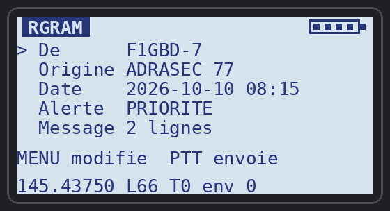
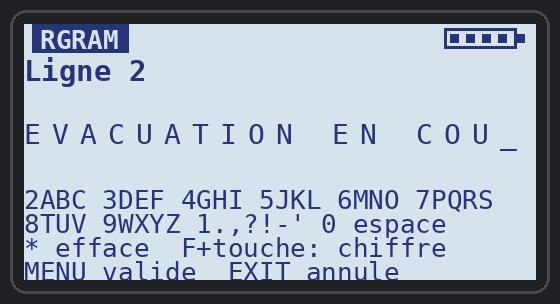

# RGRAM v1.1 — émetteur de RADIOGRAMMES ADRASEC pour Quansheng UV-K1 / UV-K5 v3

Application overlay (`.app`) pour le firmware F4HWN édition Labs. Elle permet de
**rédiger un RADIOGRAMME ADRASEC au clavier du portatif** et de l'**émettre en
AX.25 Packet 1200 bauds**, exactement comme la fenêtre « 📋 RADIOGRAMME ADRASEC —
Packet VHF » de **TCQ** : même texte (station, origine, heure, niveau d'alerte,
description, code d'authentification avec CRC), compressé zlib, encodé en base64
et découpé en trames `{QR:ID:NN/TT:…}` de 80 caractères envoyées à `CQ`.

**Nouveau en v1.1 : trames de 80 caractères**, lisibles par **PAGER-RASEC v1.4** :
un autre UV-K1 en mode pager reçoit le radiogramme et l'affiche comme un message
(origine, heure, niveau d'alerte, description).

Toute station **TCQ** (onglet TNC Packet) reçoit le radiogramme, le reconstitue,
vérifie son CRC, l'affiche en clair et l'enregistre, comme un radiogramme émis
par un autre TCQ.

<p align="center">
  
  &nbsp;
  
</p>
<p align="center"><em>Le formulaire du radiogramme et la saisie d'une ligne au clavier (maquettes d'écran)</em></p>

| | |
|---|---|
| Format | Radiogramme ADRASEC de TCQ, zlib + base64, trames UI AX.25 `{QR:ID:NN/TT:…}` (80 caractères), PID F0 |
| Adresses | source = indicatif saisi sur la radio (ou message de démarrage) + SSID (7 par défaut) ; destination `CQ` |
| Fréquence | celle du **VFO d'émission** (ex. 145.4375 MHz FM) |
| Champs | Station, Origine (11 caractères), Date et heure, Niveau d'alerte (6 niveaux TCQ), Description (8 lignes de 32 caractères) |
| Authentification | `AUTH:000` + CRC TCQ sur `indicatif|origine|date|alerte|description` : **CRC validé par TCQ** (la partie horaire TOTP vaut `000` : la radio n'a pas d'horloge) |
| Émission | une seule émission de 11 à 15 trames : 10 à 13 s selon la longueur |
| Taille | 3 776 o de code (overlay 4 Kio) + 3 828 o de ressources (dont 2 modules) |

Manuel complet : [PDF](../documentation/RGRAM_Manuel_v1.1.pdf) — formulaire, saisie,
émission, réception et 4 exemples de radiogrammes.

## Installation

1. Ouvrir l'**[UV-K1 Apps Uploader](../index.html)** dans Chrome ou Edge.
2. Brancher la radio (USB-C), **Connecter la radio**, choisir le port série.
3. Sélectionner **Émetteur de radiogrammes RGRAM**, garder l'emplacement proposé, **Installer**.
4. Régler le **VFO** sur la fréquence de travail (FM), puis menu **Apps** → **RGRAM**.

## Rédiger et envoyer un radiogramme

Le formulaire tient sur un écran ; **< / >** choisissent une ligne, **MENU** la modifie :

```
 RGRAM                       [batterie]
 > De      F1GBD-7              <- indicatif (+ SSID)
   Origine ADRASEC 77           <- lieu d'émission
   Date    2026-10-10 08:15     <- à régler une fois par séance
   Alerte  PRIORITE             <- MENU : niveau suivant
   Message 2 lignes             <- MENU : les lignes de la description
 MENU modifie  PTT envoie
 145.43750 L66 T0 env 0
```

1. **Date** (« a regler » au lancement) : MENU, taper l'heure — le curseur est
   déjà sur les heures — puis MENU. La radio n'a pas d'horloge : une fois réglée,
   l'heure avance tant que l'application est ouverte.
2. **Alerte** : chaque MENU passe au niveau suivant — EXERCICE, ROUTINE, PRIORITE,
   IMMEDIAT, FLASH, DETRESSE (les niveaux de TCQ).
3. **Message** : MENU ouvre la liste des lignes ; MENU sur « + ajouter une ligne »
   ou sur une ligne existante ouvre l'éditeur ; **F puis \*** supprime la ligne ;
   EXIT revient au formulaire.
4. **PTT** (depuis le formulaire ou la liste) : émission. « TRANSMIT » s'affiche,
   puis « 12 trames env 1 ». Le message reste en mémoire avec le même identifiant :
   PTT à nouveau le répète et TCQ complète une trame éventuellement perdue.

### Saisie du texte : comme sur un téléphone (multi-tap)

| Touche | Caractères (appuis successifs en moins d'une seconde) |
|---|---|
| 2 | A B C 2 |
| 3 | D E F 3 |
| 4 | G H I 4 |
| 5 | J K L 5 |
| 6 | M N O 6 |
| 7 | P Q R S 7 |
| 8 | T U V 8 |
| 9 | W X Y Z 9 |
| 1 | . , ? ! - ' / ( ) 1 |
| 0 | espace 0 |
| **F puis une touche** | le chiffre directement (F 2 → « 2 ») |
| \* | efface le dernier caractère |
| MENU / EXIT | valider / annuler |

Pour deux lettres de la même touche (« DE »), attendre une seconde entre les deux.
Exemple « INCENDIE 2 BLESSES » : `444 66 222 33 66 3 444 33 0 F2 0 22 555 33 7777` (pause) `7777 33 7777`.

L'indicatif se saisit de la même façon (F puis 0 inutile : 0 et 1 y donnent les
chiffres). Vide, RGRAM prend l'indicatif du message de démarrage de la radio.

| Touche (formulaire) | Action |
|---|---|
| < / > | Ligne précédente / suivante |
| MENU | Modifier la ligne (Alerte : niveau suivant) |
| PTT | Émettre le radiogramme |
| F puis 1 / F puis 7 | Niveau BF + / − |
| F puis 2 / F puis 8 | Twist + / − |
| F puis 3 / F puis 9 | SSID + / − |
| EXIT | Quitter |

Indicatif, origine, niveau d'alerte, SSID, niveau et twist sont mémorisés. Le
message est conservé tant que l'application est ouverte.

## Réception

- **TCQ** (onglet TNC Packet) : progression « RGRAM xxxx trame n/12 », puis le
  radiogramme complet « 📋 RADIOGRAMME ADRASEC — PACKET VHF » avec
  « 🔐 AUTH … ✓ CRC VALIDE », enregistré dans les fichiers reçus.
- **PAGER-RASEC v1.4** (autre UV-K1) : reconstitue le radiogramme et l'affiche
  comme un message reçu, en résumé de 96 caractères au plus, par exemple
  « ADRASEC 77 08:15 PRIORITE: INCENDIE 2 BLESSES / OK ». Une trame perdue donne
  « Radiogramme incomplet: faire repeter » : PTT à nouveau sur RGRAM. Les versions
  1.3 et antérieures du pager affichent les trames brutes (base64).

## Validation

- Émetteur AFSK identique à APRS TX de F4HWN et à CHAPPE-TX (essai sur l'air de
  CHAPPE-TX réussi vers TCQ le 9 octobre 2026).
- Banc logiciel : exécution instruction par instruction de l'application réelle ;
  l'AFSK est reconstitué, les trames décodées (FCS correctes), réassemblées,
  décompressées et analysées **avec les fonctions de TCQ** (`_radio_generate_crc`,
  `_normalize_for_crc`, mêmes expressions régulières) : champs corrects et
  **CRC valide**, y compris pour un message de 8 lignes de 32 caractères et le
  niveau DETRESSE.
- Essai sur l'air : à faire.

ADRASEC 77 · F1GBD — 73
