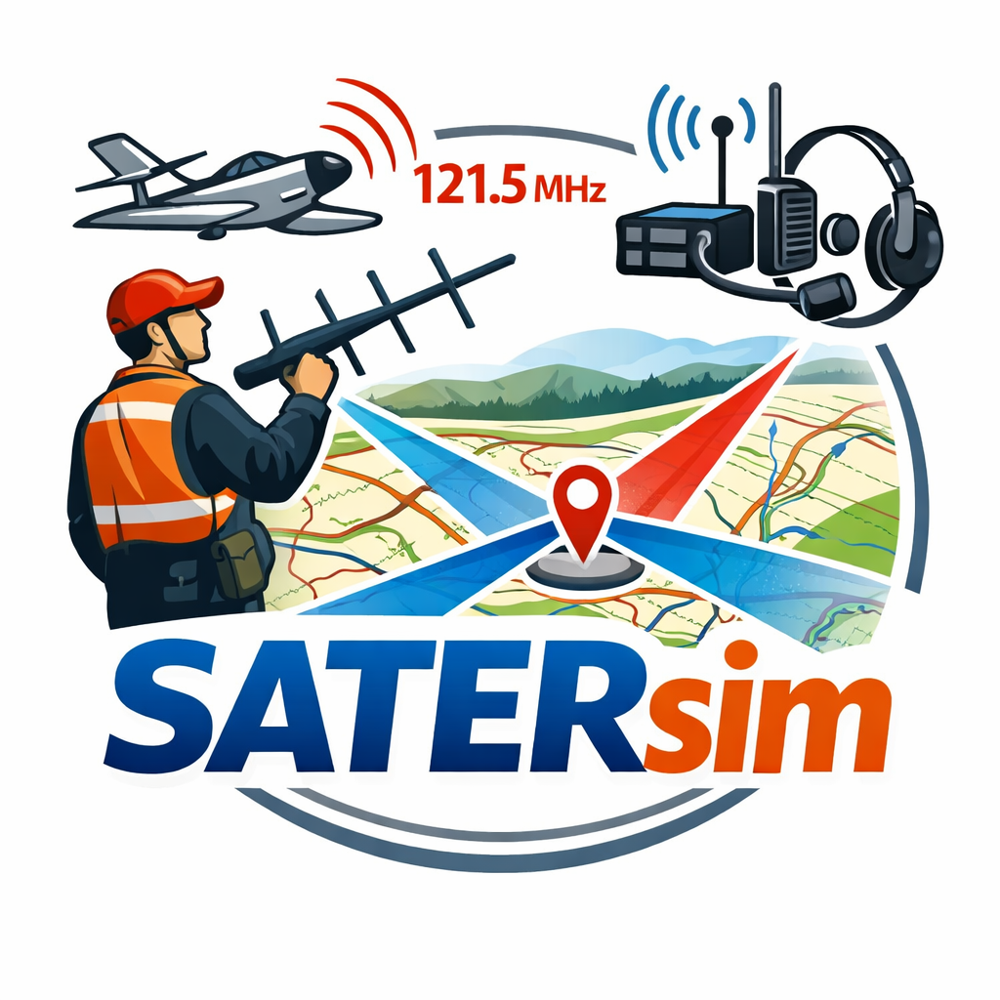
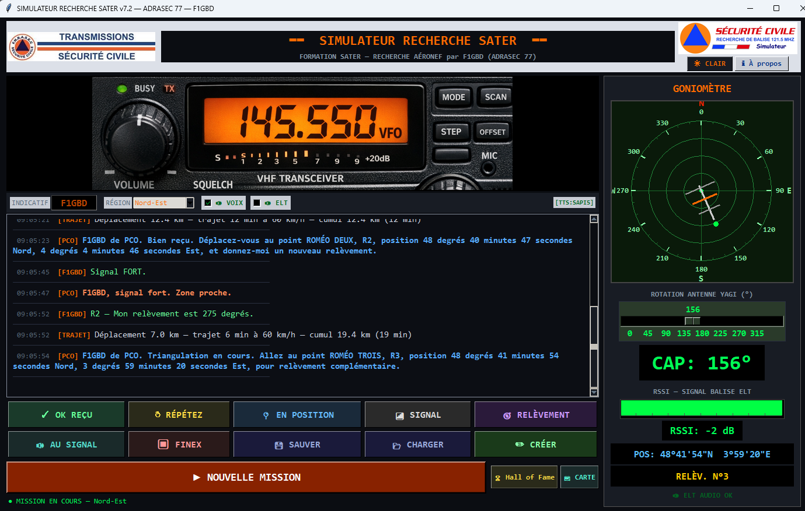
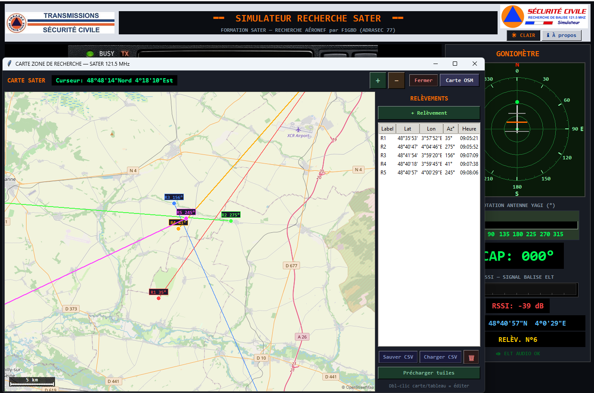
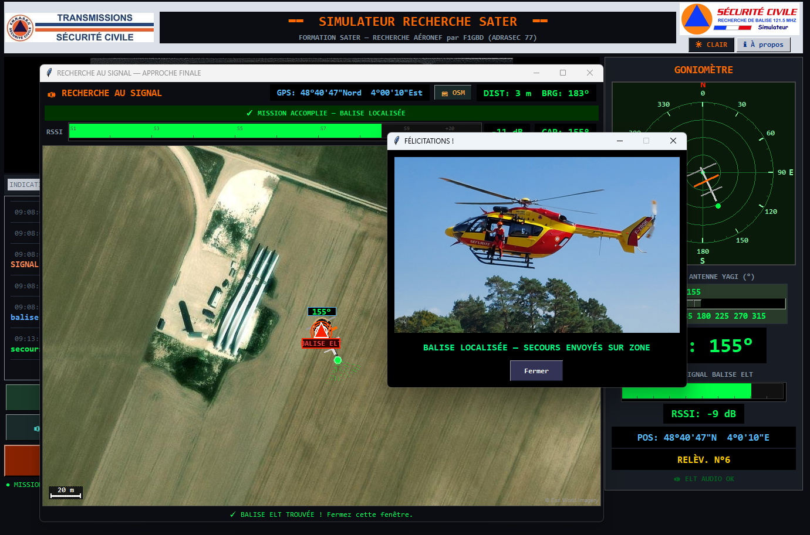

<div align="center">



# SATERsim

### Simulateur de Recherche de Balise ELT 121.5 MHz pour la formation ADRASEC

*Goniométrie radar Yagi 3 éléments — Moteur PCO IA — Synthèse vocale TTS — Carte OSM interactive — 4 régions aéronautiques — Recherche AU SIGNAL en vue satellite — Triangulation et relèvements vectorisés — Hall of Fame & certificat PDF*

[](https://github.com/f1gbd/F1GBD/releases/tag/satersim-v7.2.0)
[](https://github.com/f1gbd/F1GBD/releases?q=satersim)
[]()
[]()
[]()

### 📥 [**Télécharger la dernière version stable (v7.2.0)**](https://github.com/f1gbd/F1GBD/releases/download/satersim-v7.2.0/SATERsim.7z)

</div>

---

## 📸 Aperçu

<div align="center">

### Écran principal de SATERsim



*Face avant transceiver VHF/UHF photo-réaliste, goniomètre radar Yagi 3 éléments rotative, indicateur RSSI avec lobe principal et lobe arrière, journal des échanges PCO/opérateur, carte OSM intégrée et thème clair/sombre.*

### Carte OSM interactive avec relèvements vectorisés



*Triangulation visuelle : chaque relèvement est tracé comme un vecteur coloré (80 km) avec flèche directionnelle. Tableau des points R1, R2, R3… avec lat/lon DMS, azimut et heure. Export/import CSV intégré.*

### Recherche AU SIGNAL — vue satellite



*Approche finale autour de 800 m de la balise. Pilotage clavier (HAUT / GAUCHE / DROITE), barre RSSI live, distance et bearing en temps réel, son ELT 121.5 MHz audible, basculement Satellite ↔ Carte OSM en un clic.*

</div>

---

## 🎯 Qu'est-ce que SATERsim ?

**SATERsim** est un **simulateur de recherche de balise ELT 121.5 MHz** destiné à la formation des opérateurs ADRASEC dans le cadre des missions **SATER** (**S**auvetage **A**éro-**TER**restre). Il permet de s'entraîner aux procédures complètes de goniométrie, triangulation et localisation au signal d'une balise de détresse, sans matériel radio ni déplacement physique.

Concrètement, SATERsim reproduit fidèlement :

- 🎙 **Une face avant de transceiver VHF/UHF** photo-réaliste calée sur 145.550 MHz
- 📡 **Un goniomètre radar avec antenne Yagi 3 éléments** rotative pilotée par slider
- 📊 **Un indicateur RSSI** avec diagramme d'antenne réaliste (lobe principal + lobe arrière pour le lever de doute)
- 🤖 **Un moteur PCO IA** qui génère des scénarios SATER uniques et aléatoires (type d'aéronef, aérodromes, problème signalé, position du crash)
- 🗣 **Une synthèse vocale du PCO** (SAPI5 / pyttsx3 / PowerShell) avec messages mis en file d'attente
- 🗺 **Une carte OSM interactive** avec relèvements vectorisés, triangulation visuelle et préchargement de tuiles pour utilisation hors-ligne
- 🛰 **Une recherche AU SIGNAL** en vue satellite pour l'approche finale (<800 m), avec pilotage clavier et son ELT en boucle

Le simulateur est utilisable pour la **formation initiale**, les **exercices d'entraînement régionaux**, les **démonstrations grand public ADRASEC** et l'**auto-formation** des opérateurs entre deux exercices terrain.

---

## ⭐ Fonctionnalités principales

| Icône | Fonctionnalité | Description |
|:---:|---|---|
| 🎙 | **Face avant transceiver photo-réaliste** | Réplique d'un transceiver VHF/UHF calé sur 145.550 MHz, avec affichage S-mètre, boutons MODE/SCAN/STEP/OFFSET/MIC, BUSY/TX et squelch. Image personnalisable via `images/transceiver.png`. |
| 🤖 | **Moteur PCO IA** | Génère des scénarios SATER **uniques et aléatoires** : type d'aéronef (Robin ATL, Rallye, etc.), aérodromes de départ/arrivée selon la région, code transpondeur, point de perte de contact, motif de l'incident (givrage carburateur, vibrations anormales, etc.), et position secrète du crash. Aucune mission ne se ressemble. |
| 📡 | **Goniomètre radar Yagi 3 éléments** | Antenne Yagi rotative de 0° à 359° pilotée par slider. Diagramme d'antenne modélisé : lobe principal en cos³(θ) sur ±90°, nulls latéraux à ~−34 dB entre ±90° et ±150°, lobe arrière à ~−10 dB pour le **lever de doute**. Incertitude aléatoire de ±3° pour simuler les conditions terrain. |
| 📊 | **Indicateur RSSI live** | Barre RSSI avec gradient de couleur (rouge/orange/vert) selon le niveau de signal. Volume audio ELT proportionnel au RSSI (courbe racine carrée) : audible dès le lobe arrière, fort uniquement au pic frontal. |
| 🔊 | **Son balise ELT 121.5 MHz** | Boucle audio authentique de la balise ELT (3.2 s, 8 bits mono). Activable/désactivable via la case ELT en haut de l'interface. |
| 🗣 | **Synthèse vocale TTS du PCO** | Le PCO parle : annonce du scénario, transmission des coordonnées, accusés de réception, instructions de triangulation, félicitations finales. Trois moteurs supportés en cascade : SAPI5 (pywin32), pyttsx3, PowerShell. Utilise la voix par défaut Windows. Mot « SATER » prononcé « SATÈRE » pour une diction correcte. |
| 🌍 | **4 régions aéronautiques de recherche** | **Nord-Est** (Roissy, Orly, Reims, Troyes, Metz, Strasbourg) — **Nord-Ouest** (Caen, Rennes, Le Mans, Rouen) — **Sud-Est** (Lyon, Grenoble, Valence, Marseille, Nice) — **Sud-Ouest** (Bordeaux, Toulouse, Agen, Pau, Biarritz). Chaque région utilise ses propres tours de contrôle et zones géographiques pour des scénarios cohérents. |
| 🗺 | **Carte OSM interactive** | Carte OpenStreetMap intégrée avec déplacement souris, zoom molette, position curseur en DMS temps réel. Ajout de relèvement par double-clic ou bouton dédié. Vectorisation 80 km de chaque relèvement avec flèche directionnelle colorée. **Préchargement de tuiles** pour utilisation ultérieure sans Internet. |
| 📋 | **Tableau de relèvements + CSV** | Tableau des points R1, R2, R3… avec label, latitude, longitude, azimut, heure. Export CSV format point-virgule, import CSV pour reprise. Distance parcourue cumulée affichée à chaque relèvement (60 km/h modélisé). |
| 🛰 | **Recherche AU SIGNAL — vue satellite** | Fenêtre dédiée d'approche finale qui s'ouvre à <800 m (distance paramétrable). Vue **satellite** ou OSM commutable, pilotage clavier (HAUT=avancer, BAS=reculer, GAUCHE/DROITE=virage), pas de 0.5 m, RSSI live, distance et bearing temps réel. Son ELT plus fort à mesure qu'on s'approche. |
| ✏ | **Editeur de mission SATER** | Bouton **CREER** : créer ou personnaliser une mission. Modifier le texte du scénario, saisir les coordonnées DMS de la balise, ajuster la distance AU SIGNAL. Bouton « Régénérer » pour relancer le moteur PCO IA jusqu'à obtenir un scénario satisfaisant. |
| 💾 | **Sauvegarde / reprise de mission** | Bouton **SAUVER** : sauvegarde l'état complet de la mission en JSON (scénario, balise, relèvements déjà effectués, configuration). Bouton **CHARGER** : reprend une mission interrompue exactement là où elle a été laissée. |
| 🎨 | **Thème clair / sombre** | Bouton de bascule en haut à droite. Tous les paramètres (indicatif, région, voix, ELT, thème) sont automatiquement sauvegardés dans `simu_config.json` au premier lancement. |
| 🏆 | **Hall of Fame** | Classement des opérateurs SATERsim trié par score : indicatif, score, meilleur temps, meilleure distance, relèvement moyen, nombre de missions, note, date. Bouton dédié sur la page principale. Idéal pour les compétitions inter-ADRASEC. |
| 📜 | **Rapport d'exercice + certificat PDF** | À la fin de mission (bouton **FINEX**), génération automatique d'un rapport texte complet (scénario, points de relèvement, log de mission, position réelle vs estimée, score, appréciation TRÈS BON / BON / etc.) et d'un **certificat PDF** d'exercice nominatif aux couleurs ADRASEC / Sécurité Civile. |

---

## 🚀 Pourquoi un opérateur ADRASEC y gagne

> **Formation SATER sans matériel ni déplacement**
> Pas besoin de mobiliser un transceiver, une antenne Yagi, une balise d'exercice et un véhicule pour s'entraîner à la goniométrie. Un laptop suffit. Idéal pour la **formation initiale** des nouveaux opérateurs et la **révision** des procédures avant un exercice réel.

> **Scénarios uniques à chaque mission**
> Le moteur PCO IA garantit qu'aucune mission ne se répète. Type d'aéronef, aérodromes, points de passage, motifs de l'incident, position du crash — tout est régénéré à chaque démarrage. Les opérateurs ne peuvent pas mémoriser une réponse, ils doivent **réellement appliquer la procédure**.

> **Apprentissage progressif du diagramme d'antenne**
> Le simulateur modélise fidèlement le **lobe principal**, les **nulls latéraux** et le **lobe arrière** d'une Yagi 3 éléments. L'opérateur apprend concrètement la technique du **lever de doute** (lobe arrière à ~−10 dB) sans risque de se perdre sur le terrain.

> **Triangulation visuelle pédagogique**
> Chaque relèvement est tracé comme un vecteur coloré sur la carte OSM. La triangulation devient visuelle et intuitive : en 3 ou 4 relèvements bien pris, l'opérateur voit converger les vecteurs vers la position de la balise. Idéal pour expliquer le principe du **relèvement croisé** en formation.

> **Approche finale réaliste**
> Le mode **AU SIGNAL** en vue satellite reproduit la phase de recherche fine sur le terrain (<800 m). L'opérateur apprend à orienter sa Yagi, à interpréter le RSSI, à entendre le signal ELT changer d'intensité — exactement comme en mission réelle.

> **Hall of Fame et compétition saine**
> Le classement par score motive les opérateurs à améliorer leurs performances mission après mission. Excellent vecteur d'**entraînement régulier** entre deux exercices terrain.

> **Plateforme de démonstration ADRASEC**
> SATERsim est aussi un **outil de démo** lors des forums associatifs, journées portes ouvertes et présentations grand public. Le scénario complet (PCO vocal, goniométrie, triangulation, atterrissage final avec hélicoptère DRAGON) est immédiatement compréhensible par un public non-radioamateur.

---

## 💼 Cas d'usage concrets

### 🎓 Formation initiale d'un nouvel opérateur ADRASEC

```
1. Lancer SATERsim, saisir l'indicatif du stagiaire, sélectionner la région
2. Cliquer sur DÉMARRER MISSION
3. Le PCO énonce vocalement le scénario complet (avion, aérodromes, motif)
4. Le stagiaire applique la procédure : OK REÇU → EN POSITION → tourner la Yagi
   → relever l'azimut au RSSI maximal → SIGNAL → RELÈVEMENT
5. Le formateur commente en direct : "Tu vois le lobe arrière à 10 dB ? C'est
   le moment d'appliquer le lever de doute en tournant de 180°"
6. Au bout de 4-5 relèvements, la triangulation converge → passage AU SIGNAL
7. FINEX → génération du rapport et du certificat PDF
```

### 🏃 Auto-entraînement entre deux exercices

```
1. Lancer SATERsim avant un exercice départemental réel
2. Faire 2-3 missions consécutives sur des régions différentes
3. Comparer son score au Hall of Fame (5 minutes de gonio = TRÈS BON)
4. Identifier ses lenteurs (rotation Yagi, lecture DMS, triangulation)
5. Arriver à l'exercice réel avec les automatismes en place
```

### 🌍 Démonstration grand public

```
1. Cocher VOIX + ELT dans la barre de configuration
2. Lancer une mission devant le public
3. Faire entendre la balise ELT 121.5 MHz (son authentique)
4. Faire tourner la Yagi en direct, montrer le RSSI varier
5. Pointer la triangulation sur la carte au fil des relèvements
6. Conclure avec l'image de l'hélicoptère DRAGON envoyé sur zone
```

### ✏ Création d'une mission pédagogique sur mesure

```
1. Cliquer sur CREER (Editeur de mission SATER)
2. Saisir les coordonnées exactes de la balise d'exercice départementale
   (par exemple sur un terrain d'aviation que les opérateurs connaissent)
3. Adapter le texte du scénario (aérodromes locaux, points de passage VFR
   réellement pratiqués dans la région)
4. Ajuster la distance AU SIGNAL (par défaut 800 m, peut descendre à 200 m
   pour un challenge serré)
5. Sauver la mission, la rejouer en formation collective via CHARGER
```

### 🏆 Compétition inter-ADRASEC

```
1. Toutes les sections lancent SATERsim avec leurs indicatifs respectifs
2. Chacune effectue 3 missions sur la même région (Nord-Est par exemple)
3. Les scores et certificats PDF sont compilés dans le Hall of Fame
4. Classement national publié à la fin de la session
```

---

## 🛠 Comment commencer ?

### 📥 Téléchargement direct de l'archive

<div align="center">

#### 📥 [**Télécharger SATERsim.7z (v7.2.0)**](https://github.com/f1gbd/F1GBD/releases/download/satersim-v7.2.0/SATERsim.7z)

*(version `satersim-v7.2.0` — voir [toutes les releases SATERsim](https://github.com/f1gbd/F1GBD/releases?q=satersim) pour les versions précédentes)*

[](https://github.com/f1gbd/F1GBD/releases)

</div>

### 🚀 Installation

```powershell
# 1. Décompresser l'archive SATERsim.7z à la racine de C:\
#    (clic droit → 7-Zip → Extraire vers "C:\")
#
#    Vous obtenez l'arborescence suivante :
#    C:\SATERsim\
#       ├── _internal\           (dépendances PyInstaller)
#       ├── images\              (logos, transceiver, dragon, bannière)
#       ├── Doc\                 (manuel PDF, notes techniques)
#       ├── elt.wav              (son balise ELT 121.5 MHz)
#       ├── LICENSE
#       └── SATER_SIM.exe        ← exécutable principal
#
# 2. Ouvrir l'Explorateur dans C:\SATERsim\
#
# 3. Double-cliquer sur SATER_SIM.exe pour lancer le simulateur
```

> 💡 **Aucune installation système requise** : pas d'admin, pas de modification du registre, pas de variable d'environnement. Le simulateur est entièrement autonome dans son dossier.

> 💡 **Personnalisation aux couleurs de votre ADRASEC** : les fichiers JPG dans `C:\SATERsim\images\` (notamment `logo_adrasec.jpg` et `ELT1215_SATER.jpg`) peuvent être remplacés par vos propres logos pour personnaliser l'interface aux couleurs de votre section départementale.

### ⚙ Configuration initiale (au premier lancement)

Configurer les paramètres dans la barre de contrôles en haut de l'interface :

| Paramètre | Description |
|---|---|
| **INDICATIF** | Saisir votre indicatif radioamateur (ex: F1GBD). Apparaîtra dans le rapport et le certificat. |
| **RÉGION** | Sélectionner la région de recherche : Nord-Est (par défaut), Nord-Ouest, Sud-Est, Sud-Ouest. |
| **VOIX** | Cocher pour activer la synthèse vocale du PCO (coché par défaut). |
| **ELT** | Cocher pour activer le son de la balise ELT 121.5 MHz (décoché par défaut). |
| **Thème** | Bouton **Clair / Sombre** en haut à droite. |

Tous les paramètres sont sauvegardés automatiquement dans `simu_config.json` à côté de l'exécutable. Au prochain lancement, votre configuration sera restaurée.

### 🎯 Première mission

1. Cliquer sur le bouton rouge **DÉMARRER MISSION** (ou **NOUVELLE MISSION**)
2. Le PCO annonce vocalement l'activation SATER et énonce le scénario
3. Cliquer sur **OK REÇU** pour accuser réception
4. Le PCO vous donne la position du **point R1** en coordonnées DMS
5. Cliquer sur **EN POSITION** quand vous estimez être arrivé
6. Tourner le slider **ROTATION ANTENNE YAGI** pour trouver le RSSI maximal
7. Cliquer sur **SIGNAL** pour transmettre le niveau (Faible / Moyen / Fort)
8. Cliquer sur **RELÈVEMENT** pour transmettre l'azimut au PCO
9. Le PCO donne la position du point R2, puis R3, R4… (triangulation)
10. À <800 m de la balise, le PCO annonce le passage **AU SIGNAL**
11. Cliquer sur **AU SIGNAL** pour ouvrir la fenêtre satellite et faire l'approche finale au clavier
12. Une fois la balise atteinte, dialogue de félicitations + image hélicoptère DRAGON
13. Cliquer sur **FINEX** pour terminer l'exercice → rapport texte + certificat PDF

> 💡 **Astuce** : à tout moment, cliquer sur **CARTE** pour afficher la carte OSM avec tous les relèvements vectorisés et la triangulation visuelle. Précharger les tuiles en début de session pour une utilisation hors-ligne ultérieure.

---

## 🎛 Boutons d'action

| Bouton | Fonction |
|---|---|
| **OK REÇU** | Accusé de réception au PCO |
| **RÉPÉTEZ** | Demande de répétition du dernier message PCO |
| **EN POSITION** | Signale au PCO que l'opérateur est arrivé au point demandé |
| **SIGNAL** | Ouvre le sélecteur de niveau de signal (Faible / Moyen / Fort) |
| **RELÈVEMENT** | Transmet l'azimut courant de la Yagi au PCO comme relèvement |
| **AU SIGNAL** | Ouvre la fenêtre de recherche AU SIGNAL en vue satellite |
| **FIN TX** | Fin de transmission radio |
| **SAUVER** | Sauvegarde la mission en cours (JSON) |
| **CHARGER** | Reprend une mission sauvegardée |
| **CREER** | Ouvre l'éditeur de mission SATER |
| **CARTE** | Ouvre la carte OSM avec outils de relèvement et tableau |
| **FINEX** | Termine l'exercice → rapport texte + certificat PDF |
| **Hall of Fame** | Affiche le classement des opérateurs SATERsim |

---

## 📡 Diagramme d'antenne Yagi modélisé

Le simulateur modélise un diagramme d'antenne Yagi 3 éléments réaliste :

| Zone | Angle | Gain |
|---|---|---|
| **Lobe principal** | 0° à ±90° | cos³(θ) — max 0 dB |
| **Nulls latéraux** | ±90° à ±150° | ~−34 dB (0.02) |
| **Lobe arrière** | ±150° à 180° | ~−10 dB (0.10) |

Une **incertitude aléatoire de ±3°** est appliquée au relèvement réel pour simuler les conditions terrain (réflexions, multipath, vent sur l'antenne portative). Le volume audio ELT suit une **courbe racine carrée** : audible dès le lobe arrière, fort uniquement au pic frontal.

> 💡 **Pédagogie du lever de doute** : quand l'opérateur trouve un maximum RSSI à un cap donné, il doit **vérifier le cap opposé (+180°)**. Si le signal y est nettement plus faible (~10 dB de moins), c'est bien le lobe principal. S'il est aussi fort, l'opérateur est probablement aligné sur un null latéral et doit reprendre la recherche.

---

## 🗺 Carte OSM intégrée

La carte OSM s'ouvre en cliquant sur le bouton **CARTE**. Elle offre les fonctionnalités suivantes :

- **Déplacement** : clic gauche + glisser
- **Zoom** : molette de la souris ou boutons +/−
- **Position curseur** : affichée en DMS en temps réel (ex: 48°43'54"N 4°05'54"E)
- **Ajout de relèvement** : double-clic sur la carte ou bouton « + Relèvement »
- **Vectorisation** : chaque relèvement est dessiné comme un **vecteur coloré de 80 km** avec flèche
- **Tableau de relèvements** : label (R1, R2…), latitude, longitude, azimut, heure
- **Export CSV** : bouton « Sauver CSV » (format point-virgule)
- **Import CSV** : bouton « Charger CSV »
- **Carte OSM** : bouton qui ouvre le navigateur sur OpenStreetMap.org
- **Précharger tuiles** : bouton dédié pour télécharger les tuiles de la zone et permettre l'utilisation **hors-ligne** en exercice terrain

> 💡 **Compatibilité TCQ** : les fichiers CSV générés par SATERsim sont compatibles avec le mode APRS du logiciel **TCQ** (Transceiver Control Quasar), permettant un échange fluide entre simulation et opération réelle.

---

## 🎯 Système de score et appréciation

Le score est calculé sur la **durée totale de mission** (goniométrie + recherche au signal). Le temps de trajet voiture (modélisé à 60 km/h) n'est pas pénalisant en lui-même : c'est l'efficacité de la triangulation qui compte.

| Temps opérateur | Appréciation |
|---|---|
| < 6 min | 🥇 **TRÈS BON** |
| 6 à 10 min | 🥈 **BON** |
| 10 à 15 min | 🥉 **MOYEN** |
| > 15 min | **À PERFECTIONNER** |

Le score chiffré (ex : 768) permet un classement fin dans le **Hall of Fame**. Plus le score est élevé, plus l'opérateur a été rapide, précis et économe en relèvements inutiles.

---

## 📂 Fichiers livrés dans l'archive

| Fichier | Description |
|---|---|
| `SATER_SIM.exe` | Programme principal du simulateur |
| `_internal/` | Dépendances PyInstaller (Tkinter, image, audio, TTS, etc.) |
| `images/transceiver.png` | Face avant du transceiver VHF/UHF |
| `images/logo_adrasec.jpg` | Logo ADRASEC / Sécurité Civile (personnalisable) |
| `images/ELT1215_SATER.jpg` | Bannière SATER 121.5 MHz (personnalisable) |
| `images/dragonSC.jpg` | Photo hélicoptère Dragon en secours SATER |
| `images/SATERsim_logo.png` | Logo SATERsim |
| `elt.wav` | Fichier audio de la balise ELT 121.5 MHz (3.2 s, 8 bits mono) |
| `Doc/MANUEL_SATER_SIM.pdf` | Manuel d'opération complet (15 pages) |
| `Doc/NT37_Antenne_Yagi_121-144.pdf` | Note technique antenne Yagi réversible |
| `LICENSE` | Conditions d'usage |
| `simu_config.json` | Configuration utilisateur (généré au 1er lancement) |

---

## 🔧 Configuration matérielle requise

| Composant | Minimum | Recommandé |
|---|---|---|
| **Système** | Windows 10 64 bits | Windows 11 |
| **Processeur** | Intel i3 / Ryzen 3 | Intel i5 / Ryzen 5 ou plus |
| **RAM** | 4 Go | 8 Go |
| **Espace disque** | 200 Mo | 500 Mo (avec tuiles préchargées) |
| **Carte son** | Intégrée | Casque audio recommandé pour bien entendre l'ELT |
| **Internet** | Requis pour la carte OSM | Mode hors-ligne possible après préchargement |
| **Synthèse vocale** | Voix Windows par défaut | SAPI5 français pour meilleure diction |

---

## 📚 Documentation complète

Ce dépôt contient également les manuels et notes techniques suivants :

- 📋 **[Fiche de présentation SATERsim v7.2](Doc/Fiche_Presentation_SATERsim.pdf)** — Présentation synthétique du logiciel (4 pages)
- 📖 **[Manuel d'opération SATERsim v7.2](Doc/MANUEL_SATER_SIM.pdf)** — Documentation complète (15 pages, captures d'écran, procédure pas-à-pas)
- 📡 **[Note technique NT37 — Antenne Yagi 121/144 MHz](Doc/NT37_Antenne_Yagi_121-144.pdf)** — Construction d'une antenne Yagi réversible 145 MHz / 121.5 MHz pour la recherche de balise ELT, par F1GBD et F4JHW

---

## 🌐 Architecture technique

```
┌─────────────────────────────────────────────────────────┐
│  SATERsim (interface Tkinter)                           │
│  - Face avant transceiver VHF/UHF                        │
│  - Goniomètre radar Yagi 3 éléments                      │
│  - Indicateur RSSI live                                  │
│  - Journal des échanges PCO/opérateur                    │
│  - Hall of Fame, certificat PDF                          │
└──────┬──────────────┬─────────────┬──────────────┬──────┘
       │              │             │              │
       │              │             │              │
┌──────▼──────┐ ┌─────▼──────┐ ┌────▼───────┐ ┌────▼──────┐
│ Moteur PCO  │ │ Yagi DSP   │ │ Carte OSM  │ │ Mode AU   │
│ IA          │ │            │ │            │ │ SIGNAL    │
│             │ │ Lobe       │ │ Tuiles     │ │           │
│ Scénarios   │ │ principal  │ │ préchar-   │ │ Vue       │
│ aléatoires  │ │ cos³(θ)    │ │ geables    │ │ satellite │
│ par région  │ │ Lobe       │ │            │ │ Pilotage  │
│ (4 régions) │ │ arrière    │ │ Vecteurs   │ │ clavier   │
│             │ │ -10 dB     │ │ 80 km      │ │ RSSI live │
│ TTS SAPI5/  │ │ ±3° bruit  │ │ Tableau +  │ │ Son ELT   │
│ pyttsx3/    │ │            │ │ CSV        │ │ propor-   │
│ PowerShell  │ │            │ │            │ │ tionnel   │
└─────────────┘ └────────────┘ └────────────┘ └───────────┘

┌─────────────────────────────────────────────────────────┐
│  Persistance locale (JSON)                              │
│  ┌───────────────────────────────────────────────────┐  │
│  │ simu_config.json (indicatif, région, voix, ELT,   │  │
│  │   thème) — sauvegardé automatiquement             │  │
│  ├───────────────────────────────────────────────────┤  │
│  │ Missions sauvegardées via SAUVER (JSON, reprise   │  │
│  │   exacte via CHARGER)                             │  │
│  ├───────────────────────────────────────────────────┤  │
│  │ Hall of Fame (scores cumulés par indicatif)       │  │
│  ├───────────────────────────────────────────────────┤  │
│  │ CSV de relèvements (export carte OSM)             │  │
│  ├───────────────────────────────────────────────────┤  │
│  │ Rapport TXT + Certificat PDF (générés au FINEX)   │  │
│  └───────────────────────────────────────────────────┘  │
│  🔒 100% local : aucune donnée ne quitte la machine     │
└─────────────────────────────────────────────────────────┘
```

---

## 🆕 Versions récentes

| Version | Apport principal |
|---|---|
| **v7.2.0** | **Version stable courante** — Yagi 3 éléments avec lobe arrière complet, vue satellite pour AU SIGNAL, DMS DMS coordinate parsing, triangulation goniométrique, score temps-based, distance AU SIGNAL configurable via éditeur de mission |
| v7.1 | Bannière SATER, intégration carte OSM, image hélicoptère DRAGON en fin de mission |
| v7.0 | Refonte du moteur PCO IA, scénarios uniques par région, certificat PDF nominatif |
| v6.x | Cœur du transceiver simulé (RSSI, AI PCO avec TTS), Hall of Fame, génération PDF |

Pour le détail de tous les changements, consultez le [changelog complet sur GitHub Releases](https://github.com/f1gbd/F1GBD/releases?q=satersim).

---

## 🎯 Conseils pédagogiques pour le formateur

- **Commencer** par expliquer le principe de la **goniométrie** et du **relèvement croisé** au tableau
- **Expliquer** le **diagramme d'antenne** : lobe principal, nulls latéraux, lobe arrière, lever de doute
- **Faire tourner la Yagi lentement** au premier exercice pour bien identifier le **maximum** du signal et appliquer le lever de doute
- **Utiliser la carte OSM** pour reporter les relèvements et **visualiser la triangulation** en direct devant le stagiaire
- **Varier les régions** pour diversifier les scénarios et exposer le stagiaire à différentes géographies aéronautiques
- **Sauvegarder les missions réussies** comme exemples de formation à rejouer en groupe
- **Préparer une mission sur mesure** via l'éditeur (CREER) pour les **terrains d'exercice départementaux** que les opérateurs connaissent
- **Utiliser le Hall of Fame** comme levier de motivation collective entre opérateurs

---

## 🤝 Communauté

SATERsim est un **projet open développé pour la communauté ADRASEC**, proposé librement aux opérateurs ADRASEC départementales et à la FNRASEC dans le cadre des missions **SATER** (Sauvetage Aéro-TERrestre).

Toute contribution, retour d'exercice, proposition de scénario ou amélioration est bienvenue via les *Issues* du dépôt GitHub.

> 💡 **Construction d'une vraie antenne Yagi** : pour passer de la simulation à la pratique terrain, consultez la **[Note technique NT37](Doc/NT37_Antenne_Yagi_121-144.pdf)** qui détaille la construction d'une **antenne Yagi 3 éléments réversible 145 MHz / 121.5 MHz** par F1GBD et F4JHW. Cette antenne est utilisée par la section ADRASEC 77 lors des exercices SATER réels.

---

<div align="center">

### 📡 Auteur

**Jean-Louis (F1GBD / F4JHW)**
*ADRASEC 77 — FNRASEC*

**Version 7.2.0 — Mai 2026**

---

*Pour toute question, contactez votre référent ADRASEC départemental.*

📡 **SATERsim** — *La simulation au service de la formation SATER*

🔗 [https://github.com/f1gbd/F1GBD](https://github.com/f1gbd/F1GBD)

</div>
