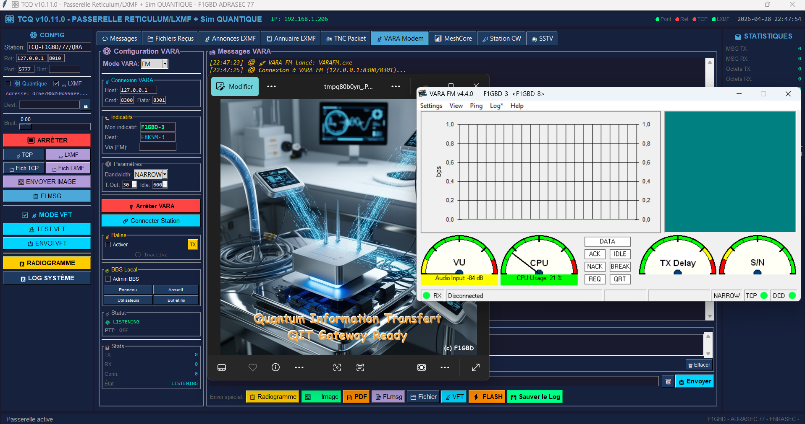
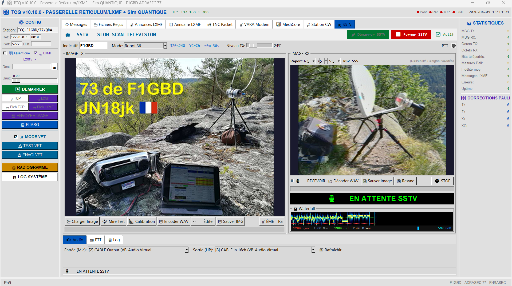
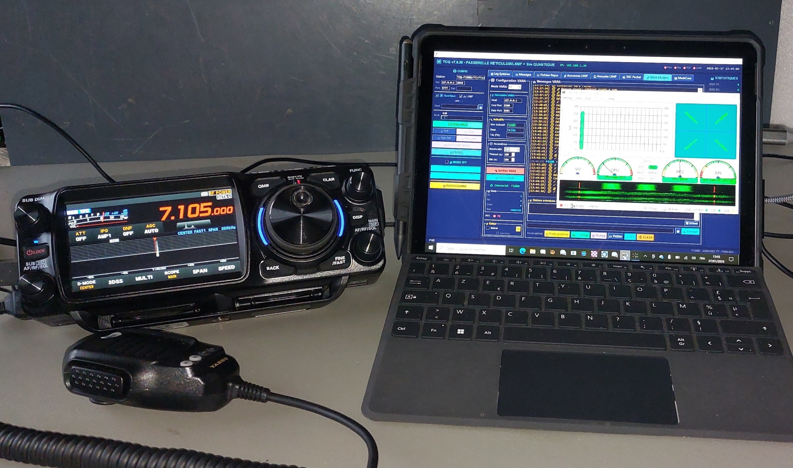

<div align="center">


# TCQ

### La plateforme de communications radio multi-modes pour les opérateurs ADRASEC

*LXMF/Reticulum — VARA HF/FM/SAT — Packet AX.25 — MeshCore LoRa — SSTV — CW/Morse — BBS — PDF Radio — Gonio SATER / APRS-IS*

[]()
[]()
[](https://github.com/f1gbd/F1GBD/blob/master/LICENSE.txt)
[](https://github.com/f1gbd/F1GBD/releases?q=tcq)

### 📥 [**Télécharger la dernière version**](https://github.com/f1gbd/F1GBD/releases/download/tcq-v12.34.0/TCQ.7z)

### ⚡ Installation rapide en 1 commande PowerShell

```powershell
iwr https://github.com/f1gbd/F1GBD/raw/master/tcq/Install-TCQ.ps1 -OutFile $env:TEMP\Install-TCQ.ps1; & $env:TEMP\Install-TCQ.ps1
```

*(à lancer en PowerShell administrateur — l'installeur télécharge automatiquement la dernière version de TCQ disponible)*

[**📜 Toutes les releases TCQ**](https://github.com/f1gbd/F1GBD/releases?q=tcq) • [**📚 Documentation**](https://github.com/f1gbd/F1GBD/tree/master/tcq/TCQ%20Documentations)

</div>

---

## 🆕 Quoi de neuf en v12.34 — RNS Nodes List (nodes Reticulum en direct)

> **🌐 Liste des nodes Reticulum du moment** — l'onglet **« 📢 Annonce LXMF »** dispose d'un nouveau bouton **« 🌐 RNS Nodes List »** qui récupère **en direct** les points d'accès Reticulum recensés par le service communautaire [rns.fyi](https://rns.fyi) : **santé, uptime 30 j, fiabilité, sauts et localisation** de chaque relais.
>
> **🔍 Tester la disponibilité** — un clic sonde chaque node en **TCP** (en parallèle) et affiche son état 🟢 joignable / 🔴 injoignable, pour ne retenir que les relais réellement actifs *du moment*.
>
> **💾 Mettre à jour la config Reticulum** — cochez les nodes à utiliser et TCQ écrit les interfaces `TCPClientInterface` dans `~/.reticulum/config`, dans un **bloc géré** dédié : vos **interfaces manuelles sont préservées**, les doublons ignorés, et une **sauvegarde horodatée** est créée automatiquement.
>
> **🗄️ Sauvegarder les RNS actifs** — copie horodatée du fichier `config` **+** export **JSON** des interfaces TCP actives, pour figer et archiver l'état du réseau avant un exercice.
>
> **📝 Éditer Config / 📡 Config Répéteur LoRa** — ouverture directe du fichier `config` dans **Notepad**, et insertion en un clic d'un bloc **`[[RNode LoRa]]`** préréglé (**867.5 MHz / BW 125 kHz / SF8 / CR 4:5**, port `COM3`) pour se raccorder au **répéteur RRLoRa**.
>
> **📒 Auto Ajout Annuaire** — nouvelle case dans l'onglet Annonce LXMF : les nouvelles stations **TCQ\*** reçues par annonce LXMF sont **ajoutées automatiquement à l'annuaire** en mémoire si elles n'y figurent pas encore.

---

## 🆕 Quoi de neuf en v12.33 — Canaux privés MeshCore

> **🔒 Canaux MeshCore privés protégés par clé secrète** — l'onglet **« 📡 Canaux »** du mode MeshCore permet désormais de **créer, partager et rejoindre** des canaux **privés**, exactement comme l'application MeshCore officielle.
>
> **➕ Créer un canal privé** — nom + **clé secrète de 16 octets** (32 caractères hexadécimaux), avec **génération aléatoire** de clé en un clic et choix de l'emplacement. Le canal apparaît avec un cadenas **🔒**.
>
> **🔑 Partager la clé** — TCQ génère un **QR Code** et une **URL `meshcore://`** : les autres opérateurs **scannent le QR** (appli MeshCore) ou importent l'URL. Boutons **Copier l'URL** et **Enregistrer le QR en PNG** (transmissible par Winlink, e-mail, messagerie…).
>
> **📥 Rejoindre un canal** — import par URL `meshcore://channel/add?...`. À la **première sélection** d'un canal privé, la clé est **demandée une seule fois** puis **mémorisée** pour les connexions suivantes.
>
> **ℹ️ Vérifier** — un outil de diagnostic relit la clé **dans le module** et affiche le **hash de canal on-air**, pour confirmer en un coup d'œil que tous les postes partagent bien la même clé.
>
> **🛡️ Programmation automatique** — TCQ programme la clé dans le firmware MeshCore (l'emplacement **Public** reste intact), condition indispensable au chiffrement/déchiffrement du trafic de canal.

---

## 🆕 Quoi de neuf en v12 — Journal de Bord / SITREP VIDEO

> **📹 Journal de Bord vidéo embarqué** — TCQ capture un **clip webcam + voix** depuis l'interface pour transmettre un **point de situation audiovisuel (SITREP VIDEO)** par radio, **même sans Internet**. Deux voies complémentaires :
>
> **MEMO VIDEO (transport natif, compressé)** — clip émis **directement sur le canal du mode** (trame VBIN en VARA, fichier natif en LXMF). Deux sous-modes : **Clip vidéo + son** (≤ 20 s) et **Mémo vocal + photo** (≤ 30 s). Encodage VP9 + Opus en **160×120**, débit cible calibré (la taille suit la durée) — quand on n'a qu'une liaison radio.
>
> **JVFT — Journal Vidéo en VFT (pleine qualité)** — clip **320×240** jusqu'à **90 s** acheminé par le **canal latéral QIT/VFT**, sans la contrainte de taille du canal radio, avec signal **&QV&** sur le mode actif.
>
> **🕒 Horodatage incrusté** — la date et l'heure sont **gravées en bas de chaque image** du clip (toute capture d'écran reste datée).
>
> **🗂️ Journal de Bord** — chaque clip est **archivé automatiquement** dans un sous-dossier `Journal/` (`JVFT_<horodatage>.webm`). L'onglet **« Fichiers/Journal »** liste les vidéos : **rejouer**, **supprimer**, ouvrir le dossier. On peut aussi **recharger une vidéo du Journal** pour la ré-émettre.
>
> **✅ Enregistrer maintenant, envoyer plus tard** — boutons séparés **VALIDER** (encode + archive au Journal, sans émettre) et **ENVOYER** (émet ; pas de ré-encodage si déjà validé).
>
> **🖼️ Trace dans la main courante** — à la réception d'une vidéo, une **imagette** (1re image) + lien **« ▶ Visionner »** s'affiche dans le **chat de tous les modes** (VARA, Packet, MeshCore, LXMF) : la vacation garde une trace visuelle.
>
> **▶ Lecteur intégré à taille native** — les clips reçus se lisent dans une petite fenêtre TCQ **à leur résolution réelle** (avec le son), sans agrandissement par le lecteur système. Boutons Rejouer / zoom ×1–×3. **👁 Aperçu** du clip exact avant émission.
>
> **🔔 Annonce horodatée** — un court message « *Réception d'un MEMO VIDEO / JVFT de <indicatif>* » est émis sur le canal ; pour le MEMO VIDEO il part **après l'ACK du fichier**, afin de ne pas perturber le dernier paquet de la vidéo.
>
> **📋 Main courante Packet** — bouton **« Sauver le Log »** qui enregistre toute la conversation horodatée dans un fichier texte, comme en VARA.

---

## 🆕 Quoi de neuf en v11.1.10 — Fiabilité fichier/image MeshCore

> Transferts de **fichiers et d'images** sur MeshCore LoRa nettement plus fiables et plus rapides 
>
> **🖼️ Compression automatique des images** — Le bouton **Image** redimensionne et compresse maintenant l'image **automatiquement** pour tenir sous le budget de transfert (≈ **3 Ko / 100 paquets**), gage de fiabilité sur LoRa. L'ajustement vise le **nombre réel de paquets** (et non une simple taille en kilo-octets, trompeuse selon le contenu), en conservant la plus grande dimension et la meilleure qualité possibles. Si l'image dépasse encore le budget au réglage minimal, elle part quand même avec un avertissement.
>
> **⚠️ Avertissement de volume** — Tout fichier ou image dépassant ~100 paquets affiche un conseil de compression (transfert long et fragile sur LoRa).

---

## 🎯 Qu'est-ce que TCQ ?

**TCQ** (TransCommunication Quantique) est une plateforme intégrée de communications radio numériques qui réunit dans une seule application Windows tous les modes utilisés en exercice et en intervention réelle par les opérateurs ADRASEC :

- 📨 **Messagerie chiffrée résiliente** sur Reticulum/LXMF (multi-saut, multi-transport)
- 📡 **Modems haute performance** VARA HF, VARA FM et VARA SAT
- 📻 **Packet radio AX.25** via Direwolf intégré (KISS et AGWPE)
- 🌐 **Réseaux maillés LoRa** via MeshCore natif
- 🖼️ **Réception SSTV temps réel** avec waterfall et templates `.stt`
- 🎵 **Décodage et QSO CW automatiques** (QSObrain)
- 📬 **Bulletin Board System** (BBS) sur TNC Packet et MeshCore
- 📄 **Transmission PDF par radio** avec compression LZMA et fragmentation

Conçu pour les opérations ADRASEC et les exercices de sécurité civile, TCQ privilégie la **robustesse**, la **tolérance aux ruptures de liaison** et la **simplicité d'utilisation sur le terrain**. Le binaire est autonome (PyInstaller) — **aucune installation Python requise**.

<p align="center">
  
  <br><i>Interface principale de TCQ v10.13</i>
</p>

---

## ⭐ Fonctionnalités principales

| Icône | Fonctionnalité | Description |
|:---:|---|---|
| 📨 | **LXMF / Reticulum** | Messagerie chiffrée bout-en-bout (X25519 + AES-128 + HMAC-SHA256), multi-saut, résiliente. Compatible TCP, série, LoRa, packet AX.25 et passerelle VARA. **RNS Nodes List** : sélection des points d'accès Reticulum du moment (rns.fyi) et mise à jour assistée de `~/.reticulum/config`. |
| 📡 | **VARA HF / FM / SAT** | Modems ARQ haute performance (EA5HVK) intégrés avec protection idle/timeout, suspension/reprise des transferts, détection automatique du chemin VARA. |
| 📻 | **TNC Packet (AX.25)** | Direwolf lancé automatiquement avec configuration adaptée à votre carte son. Modes KISS et AGWPE. Support BBS et PDF radio. |
| 🌐 | **MeshCore LoRa** | Protocole mesh LoRa natif pour communications de proximité en zone d'exercice ou d'intervention. Messagerie, BBS, **transferts de radiogrammes / fichiers diffusés sur canal** (Public, Urgence) et **canaux privés protégé par clé secrète** — création, partage par **QR Code / URL `meshcore://`**, mémorisation de la clé et vérification du **hash on-air**. Compatibles firmware MeshCore récent (≥ v1.6). |
| 🖼️ | **SSTV temps réel** | Décodeur porté de slowrx — Scottie (S1/S2/SDX), Martin (M1/M2), Robot (36/72), PD (50→240). Waterfall + visualiseur plein écran + bouton Resync. |
| 🎵 | **CW / Morse** | Décodeur DSP avec seuillage adaptatif et clustering K-means. **QSObrain** pour QSO CW entièrement autonomes (CSMA, WPM adaptatif, anti-self-CQ). |
| 📬 | **BBS Multi-modes** | Bulletin Board System sur TNC Packet et MeshCore avec compteur paquets, réassemblage automatique, persistance SQLite. |
| 📄 | **PDF Radio** | Transmission de documents (SITREP, MEMO) avec compression LZMA, fragmentation adaptative, CRC par fragment, ACK et reprise sélective. Recomposition fidèle : cadres et couleurs de tableaux préservés, PDF scannés ou tournés gérés automatiquement (`pdf_trans` v1.0.6). |
| 📹 | **Journal Vidéo (MEMO / JVFT)** | Capture webcam + voix pour SITREP audiovisuel. **MEMO VIDEO** compressé (160×120) sur transport natif (VARA/LXMF) — clip A/V ≤ 20 s ou mémo vocal ≤ 30 s. **JVFT** pleine qualité (320×240, ≤ 90 s) via canal QIT/VFT. Lecteur intégré à taille native, aperçu avant envoi, annonce horodatée. |
| 🛰️ | **Gonio SATER / APRS-IS** | Carte des relèvements goniométriques avec **partage bidirectionnel APRS-IS** (protocole `EPIRB-GONIO` commun à l'EPIRBdecoder v5.6 et SATERfinder Android), **triangulation ELT** (CEP 95 %), affichage des stations APRS reçues via APRS-IS, et import/export CSV interopérable. |
| 🔐 | **100% local** | Aucune télémétrie, aucune connexion externe non sollicitée. Toutes les communications restent sous le contrôle de l'opérateur. |

---

## 🌌 TCQ : du concept Quantique au programme multi-modes

Le projet TCQ est né d'une exploration de la **TransCommunication Quantique** appliquée aux réseaux radio résilients : une couche éducative sur Reticulum permettant de simuler des principes de communication quantique (Super Dense Coding, téléportation quantique) dans le contexte des messageries radio chiffrées LXMF.

À partir de la version 10.x, TCQ s'est étoffé pour devenir une **plateforme opérationnelle multi-modes** intégrant tous les outils nécessaires aux communications d'urgence ADRASEC, tout en conservant le module quantique éducatif (`qsim_lib`, `qit_lib`) comme couche pédagogique au-dessus de la messagerie LXMF.

> 💡 La présente documentation couvre le **programme TCQ v10.13** (plateforme opérationnelle). Les fondements conceptuels et le mémo TCQ Quantique original sont documentés dans le dossier [TCQ Documentations](https://github.com/f1gbd/F1GBD/tree/master/tcq/TCQ%20Documentations).

---

## 🚀 Pourquoi un opérateur ADRASEC y gagne

> **Une seule application pour tous les modes**
> Plus besoin de jongler entre 6 logiciels différents : LXMF, VARA, Direwolf, MeshCore, SSTV, CW — tout est intégré dans une interface cohérente.

> **Configuration zéro-friction**
> Direwolf est lancé et configuré automatiquement. La carte son est détectée. La passerelle VARA s'auto-installe. Plus de `direwolf.conf` à éditer à la main.

> **Robustesse opérationnelle**
> Reprise sur erreur sans retransmission complète des fichiers. Anti-collision CSMA sur CW. Protection des transferts VARA contre les déconnexions. Pensé pour le terrain.

> **Mise à disposition de la base ADRASEC**
> Compatible avec les protocoles standards (LXMF, AX.25, VARA, MeshCore) — interopère avec les autres stations ADRASEC et la FNRASEC sans configuration spécifique.

> **Confidentialité totale**
> Chiffrement bout-en-bout natif sur LXMF. Aucune télémétrie, aucun cloud. Vos communications restent strictement locales et chiffrées.

> **Compatible toutes architectures Windows**
> Binaires natifs x86_64 ET ARM64 (Surface Pro, mini-PC ARM). Détection automatique de la DLL PortAudio adaptée. Aucune manipulation manuelle nécessaire.

---

## 💼 Cas d'usage concrets

### 📡 Communications d'exercice ADRASEC

```
• Diffusion d'un SITREP en PDF compressé via VARA HF (départemental)
• Messagerie LXMF bidirectionnelle entre PC ADRASEC et stations mobiles
• Activation d'un BBS de section sur fréquence packet régionale
• Réception d'images SSTV en provenance d'une station portable
```

### 🚨 Opérations réelles

```
• Liaison résiliente Reticulum sur LoRa lors d'une coupure des réseaux conventionnels
• Transmission de documents formels par radio (SITREP, fiches d'intervention)
• Recherche de balises ELT 121.5 MHz avec module SDR (RTL-SDR)
• QSO CW automatisé pour maintien de liaison faible signal
```

### 🎓 Formation et entraînement

```
• Démonstration des modes numériques pour nouveaux opérateurs
• Exercices CW automatisés contre QSObrain (mode AUTO)
• Tests de chaîne PDF radio entre deux stations
• Apprentissage du protocole AX.25 via TNC Packet intégré
```

---

## 🛠 Comment commencer ?

### ⚡ Méthode automatique *(recommandée)*

Un script PowerShell **fait toute l'installation pour vous** : recherche de la dernière release TCQ, téléchargement de `TCQ.7z`, vérification SHA-256, décompression dans `C:\TCQ\`, création du raccourci bureau.

> 🔍 **Important** : le dépôt F1GBD héberge plusieurs applications (TCQ, IAbrain, etc.). Le script identifie automatiquement la **dernière release dont le tag commence par `tcq-`** parmi toutes les releases du dépôt — il ne se trompe jamais d'application, même si la dernière release publiée est IAbrain.

**1. Ouvrez PowerShell en mode administrateur**

**2. Lancez la commande** :

```powershell
# Autoriser l'exécution des scripts (cette session uniquement)
Set-ExecutionPolicy -Scope Process -ExecutionPolicy Bypass -Force

# Télécharger et lancer l'installeur officiel TCQ
iwr https://github.com/f1gbd/F1GBD/raw/master/tcq/Install-TCQ.ps1 -OutFile $env:TEMP\Install-TCQ.ps1
& $env:TEMP\Install-TCQ.ps1
```

Le script :
- Installe 7-Zip via winget si absent
- Interroge l'API GitHub pour trouver la dernière release au tag `tcq-vX.Y.Z`
- Télécharge l'archive `TCQ.7z` depuis l'URL exacte de cette release
- Vérifie le SHA-256 publié dans la description de la release
- Sauvegarde l'installation existante (le cas échéant) avant écrasement
- Crée un raccourci bureau

### 🛠 Méthode manuelle *(utilisateurs avancés)*

Si vous préférez télécharger manuellement (par exemple sur un poste sans accès Internet en PowerShell) :

**1. Allez sur la [page des Releases TCQ filtrées](https://github.com/f1gbd/F1GBD/releases?q=tcq)** *(le filtre `?q=tcq` n'affiche que les releases TCQ, pas IAbrain)*

**2. Cliquez sur la dernière release** *(la plus en haut, tag au format `tcq-vX.Y.Z`)*

**3. Téléchargez `TCQ.7z`** et notez le SHA-256 publié dans la description

**4. Vérifiez l'intégrité et installez** :

```powershell
# Vérifier l'intégrité
Get-FileHash -Algorithm SHA256 TCQ.7z

# Décompresser dans C:\
# (clic droit sur l'archive → 7-Zip → Extraire vers "C:\")

# Lancer C:\TCQ\TCQ.exe
```

> 💡 **Astuce** : créez un raccourci de `TCQ.exe` sur votre bureau pour un lancement rapide.

### 🚀 Première utilisation

Au premier démarrage :

1. **Paramètres → Identité opérateur** : renseignez votre indicatif, locator et nom
2. **Paramètres → Audio** : sélectionnez votre carte son (entrée/sortie radio)
3. **Paramètres → Reticulum** : laissez les valeurs par défaut, ou ajustez selon votre interface RNode/LoRa
4. **Paramètres → VARA** : indiquez le chemin de `VARA.exe` (HF/FM/SAT) si installé
5. Sélectionnez un mode dans la barre d'onglets et commencez à émettre/recevoir

> ⏱ Comptez **5 minutes** pour la première configuration, ensuite TCQ est utilisable au quotidien sans réglage supplémentaire.

---

## 🆕 Nouveautés v12.34

### 🌐 RNS Nodes List — points d'accès Reticulum en direct (rns.fyi)

L'onglet **« 📢 Annonce LXMF »** intègre un bouton **« 🌐 RNS Nodes List »** qui ouvre une fenêtre dédiée à la gestion des **points d'accès Reticulum** (nodes TCP publics), à partir de la liste tenue à jour par le service communautaire **[rns.fyi](https://rns.fyi)**. La fonction repose sur le module compagnon **`rnslister_lib`**, embarqué automatiquement dans le binaire.

#### 📡 Lister et trier les nodes disponibles

La fenêtre récupère en direct les nodes joignables en TCP et les présente dans un tableau : **nom**, **adresse `host:port`**, **santé**, **uptime 30 j**, **fiabilité**, **nombre de sauts** et **localisation**. Filtres intégrés : santé minimale, nodes **recommandés** (*floor pass*), nom, nombre maximal affiché. Tri automatique par qualité décroissante.

#### 🔍 Tester la disponibilité *du moment*

Le bouton **« 🔍 Tester dispo »** sonde chaque node en **TCP**, en parallèle, et affiche son état : 🟢 joignable / 🔴 injoignable — pour ne retenir que les relais réellement actifs à l'instant T.

#### 💾 Mettre à jour la configuration Reticulum

Cochez les nodes souhaités puis **« 💾 Mettre à jour config Reticulum »** : les interfaces `TCPClientInterface` correspondantes sont écrites dans `~/.reticulum/config`, à l'intérieur d'un **bloc géré** dédié. Les **interfaces manuelles** (RNode, TCPServer, hubs personnels…) sont **intégralement préservées**, les doublons ignorés, et une **sauvegarde horodatée** du fichier est créée avant toute écriture. Le chemin du fichier `config` est modifiable dans la fenêtre.

#### 🗄️ Sauvegarder les RNS actifs

Le bouton **« 🗄 Sauvegarder RNS actifs »** archive l'état courant : copie horodatée du fichier `config` **+** export **JSON** détaillé des interfaces TCP actuellement actives (et de la sélection) — pratique pour figer une configuration réseau validée avant un exercice.

#### 📝 Éditer Config & 📡 Config Répéteur LoRa

- **« 📝 Éditer Config »** ouvre directement le fichier `config` Reticulum dans **Notepad** (éditeur système en secours hors Windows).
- **« 📡 Config Répéteur LoRa »** insère — s'il est absent — un bloc **`[[RNode LoRa]]`** préréglé (**867.5 MHz / BW 125 kHz / SF8 / CR 4:5**, port `COM3`) juste après la section `[interfaces]`, avec sauvegarde horodatée. Ce préréglage correspond **exactement** au répéteur **RRLoRa** : un seul paramètre différent et la liaison ne passe pas.

### 📒 Auto Ajout Annuaire — collecte automatique des stations TCQ

L'onglet **« 📢 Annonce LXMF »** dispose d'une nouvelle case **« 📒 Auto Ajout Annuaire (stations TCQ\*) »**, **décochée par défaut**. Lorsqu'elle est activée, toute **nouvelle station** dont le nom commence par **`TCQ`**, reçue par **annonce LXMF**, est **ajoutée automatiquement à l'index de l'annuaire LXMF en mémoire** si elle n'y figure pas déjà — l'annuaire se constitue tout seul pendant la vacation. L'ajout se fait en mémoire ; utilisez la **sauvegarde manuelle** de l'annuaire pour le figer sur disque.

---

## 🆕 Nouveautés v12.21 → v12.33

### 🔒 Canaux MeshCore privés protégés par clé secrète

Le mode **MeshCore LoRa** gère désormais des **canaux privés chiffrés**, à l'image de l'application MeshCore officielle. Toute la gestion se fait depuis l'onglet **« 📡 Canaux »** du panneau de gauche.

#### Principe

Sur l'air, un canal MeshCore est identifié **uniquement par sa clé secrète** de 16 octets : le firmware en dérive un *hash de canal*. Le **nom** du canal n'est qu'une étiquette locale, propre à chaque poste. Deux stations communiquent donc sur un canal privé **si — et seulement si — elles partagent exactement la même clé**.

#### ➕ Créer un canal privé

Bouton **➕** : choisir un **emplacement** libre, un **nom**, cocher **« Canal PRIVÉ »** et saisir une clé — ou la **générer aléatoirement** d'un clic (**🎲**, 32 caractères hexadécimaux). Le canal apparaît dans la liste avec un cadenas **🔒** (clé enregistrée) ou une clé **🔑** (clé encore à saisir).

#### 🔑 Partager la clé entre opérateurs

Bouton **🔑** (Partager) : TCQ affiche un **QR Code**, la **clé secrète** et l'**URL de partage** au format `meshcore://channel/add?name=...&secret=...`. Les autres opérateurs **scannent le QR Code** depuis l'application MeshCore (*Menu → Ajouter un canal*), ou importent l'URL. Boutons **📋 Copier l'URL** et **💾 QR PNG** pour transmettre la clé par Winlink, e-mail ou messagerie.

#### 📥 Rejoindre un canal

Bouton **📥** (Importer) : coller l'URL `meshcore://` reçue, TCQ pré-remplit le nom et la clé. À la **première sélection** d'un canal privé sans clé enregistrée, la clé est **demandée une seule fois**, puis **mémorisée** dans `setup.json` — plus aucune ressaisie aux connexions suivantes.

#### ℹ️ Vérifier la cohérence des clés

Bouton **ℹ️** : relit l'emplacement **dans le module** (nom, clé stockée et **hash de canal on-air**) et signale tout écart avec la clé connue de TCQ. Pour qu'un canal privé fonctionne entre stations, le **hash on-air doit être identique sur tous les postes**.

#### 🛡️ Programmation automatique du firmware

Dès la création/sélection d'un canal privé et à chaque connexion, TCQ **programme la clé dans le module** MeshCore (l'emplacement **Public** n'est jamais modifié). Cette programmation locale est indispensable : sans elle, le firmware ne peut ni chiffrer ni déchiffrer le trafic du canal.

> 📘 Voir la fiche pratique **« Canaux privés MeshCore dans TCQ »** dans le dossier [TCQ Documentations](https://github.com/f1gbd/F1GBD/tree/master/tcq/TCQ%20Documentations).

#### Détail des versions

- **v12.21** — création, partage (QR Code / URL `meshcore://`) et import des canaux privés ; mémorisation de la clé à la première sélection.
- **v12.22** — correctif **émission/réception sur les canaux non publics** : la clé est désormais programmée dans le firmware avant tout envoi (l'emplacement Public reste géré par défaut), condition indispensable pour que le trafic de canal soit déchiffrable par les autres postes.
- **v12.33** — outil de **vérification ℹ️** (relecture de la clé dans le module et affichage du **hash de canal on-air**) pour confirmer que tous les postes partagent la même clé.

---

## 🆕 Nouveautés v12

### 📹 Journal de Bord vidéo : MEMO VIDEO & JVFT (SITREP VIDEO)

TCQ intègre un **Journal de Bord vidéo** : capture d'un clip **webcam + voix** directement depuis l'interface pour transmettre un point de situation **audiovisuel** par radio. Deux boutons (**📹 MEMO VIDEO** et **🎥 JVFT**) sont disponibles en bas de chaque mode compatible.

#### 📹 MEMO VIDEO — transport natif, compressé

Clip court émis **directement sur le canal du mode** (trame **VBIN** en VARA, **fichier natif** en LXMF ; grisé en Packet, faute de transport binaire AX.25). Encodage **VP9 + Opus** en **160×120**, à débit **cible** : la **taille suit la durée** (plafond de sécurité pour borner le temps d'antenne). Deux sous-modes :

- **Clip vidéo + son** — séquence animée jusqu'à **20 s**.
- **Mémo vocal + photo** — message **vocal jusqu'à 30 s** + photo fixe (presque tout le débit va à la voix).

#### 🎥 JVFT — Journal Vidéo en VFT (pleine qualité)

Clip **320×240** jusqu'à **90 s**, acheminé par le **canal latéral QIT/VFT** (sans la contrainte de taille du canal radio), avec signal **&QV&** sur le mode actif. Disponible sur tous les modes (VARA, Packet, MeshCore, LXMF).

#### 🕒 Horodatage incrusté

La **date et l'heure** sont **gravées en bas de chaque image** au moment de la capture — toute image extraite reste datée.

#### 🗂️ Journal de Bord (archive)

À chaque enregistrement, une **copie** du clip est archivée dans le sous-dossier **`Journal/`** sous le nom **`JVFT_<horodatage>.webm`** (le fichier d'envoi garde, lui, le nom `<INDICATIF>.webm`). L'onglet **« 📁 Fichiers/Journal »** comporte un cadre **« 🎬 Journal VIDEO »** : liste scrollable (nom, date, taille), **▶ Rejouer**, **🗑 Supprimer**, **🔄 Actualiser**, **📁 Dossier**. Double-clic = rejouer.

#### ✅ VALIDER / 📤 ENVOYER (enregistrer maintenant, envoyer plus tard)

Après l'enregistrement, deux boutons distincts : **VALIDER** encode le clip et l'archive au Journal **sans l'émettre** ; **ENVOYER** l'émet (s'il a déjà été validé, il part tel quel, sans ré-encodage). On peut ainsi préparer un clip et l'expédier plus tard via **« 📂 Recharger une vidéo du Journal »**. Un bouton **« 👁 OUVRIR VIDÉO »** permet de prévisualiser le clip exact avant émission.

#### 🖼️ Trace dans la main courante (imagette)

À la **réception** d'une vidéo (`.webm`), une **imagette** (1re image) suivie d'un lien **« ▶ Visionner la vidéo »** est insérée dans le **chat de tous les modes** (VARA, Packet, MeshCore, LXMF) : la main courante garde une trace visuelle. Un clic rejoue la vidéo dans le **lecteur intégré à taille native** (avec le son), au lieu du lecteur système qui l'agrandissait.

#### 🔔 Annonce horodatée

TCQ émet un court texte « *<date heure> Réception d'un MEMO VIDEO / JVFT de <indicatif>* ». Pour le **MEMO VIDEO**, l'annonce est **différée jusqu'à l'ACK** du fichier : émise pendant le transfert, elle s'intercalerait devant le dernier paquet et empêcherait le décodage.

### 📋 Main courante en mode Packet

Le mode **TNC Packet** dispose d'un bouton **« Sauver le Log »** qui enregistre toute la conversation (main courante **horodatée**) dans un fichier texte — comme en VARA.

---

## 🆕 Nouveautés v11.0.0 / v11.0.1

### 🛰️ Partage des relèvements goniométriques APRS-IS — interopérable EPIRBdecoder v5.6 & SATERfinder Android *(v11.0.0)*

La fenêtre **CARTE** du mode **TNC Packet** intègre désormais un bandeau **APRS-IS** complet, identique au client APRS-IS de l'**EPIRBdecoder v5.6** et de l'application Android **SATERfinder**. TCQ utilise exactement le même protocole `EPIRB-GONIO`, ce qui permet à toutes ces stations de **partager leurs relèvements en temps réel** pendant une recherche SATER / COSPAS-SARSAT — postes PC (TCQ, EPIRBdecoder) et équipes terrain (SATERfinder Android) sur un même fil APRS-IS.

- 📡 **Connexion APRS-IS** : indicatif + passcode (bouton *Calc* de calcul automatique), serveur/port (`euro.aprs2.net:14580` par défaut), bouton *Se connecter / Se déconnecter*.
- 🔁 **Partage BIDIRECTIONNEL des relevés** au format `EPIRB-GONIO` : les relèvements émis par TCQ sont reçus et tracés par l'EPIRBdecoder et SATERfinder, et **réciproquement** — la carte de TCQ affiche en direct les relevés des autres équipes.
- ⚙️ Case **« Partage auto »** (émission automatique d'un relevé dès sa saisie ou modification) + bouton **« 📤 Émettre relevé »** pour pousser manuellement le relevé sélectionné.
- 📶 **Force du signal** (fort / moyen / faible / nul) ajoutée au dialogue de relevé d'azimut — transmise sur APRS-IS et exportée en CSV.
- 🎯 Bouton **« BALISE ELT »** : calcul de la **position présumée de la balise** par triangulation des relèvements (moindres carrés + rejet d'aberrants MAD), avec tracé du marqueur et du **cercle de probabilité CEP 95 %** sur la carte. Algorithme identique à celui de l'EPIRBdecoder v5.6.
- 💾 **Import / export CSV des relevés compatibles EPIRBdecoder v5.6** : un fichier produit par TCQ se relit dans l'EPIRBdecoder (et inversement), avec indicatif, position, azimut, force du signal et horodatage.

### 📍 Affichage des stations APRS reçues via APRS-IS *(v11.0.0)*

- 🗺️ Case **« Stations APRS-IS »** : lorsqu'elle est activée, les stations APRS reçues via APRS-IS sont **affichées sur la carte** en plus des relevés goniométriques.
- 🎚️ Filtre de portée automatique autour de votre position (`r/lat/lon/100 km`) pour ne charger que le trafic local pertinent en exercice.

> ℹ️ Le module APRS-IS s'appuie sur le module compagnon **`aprs_client`** — strictement identique à celui de l'EPIRBdecoder v5.6 — embarqué automatiquement dans le binaire TCQ.
>
> ⚠️ **Anti-écho strict par SSID** : si l'EPIRBdecoder (PC) et TCQ tournent sous le **même indicatif sans SSID**, ils ne verront pas mutuellement leurs relevés. En exercice, utilisez des SSID distincts (ex. `F1GBD` au PCS et `F1GBD-7` pour la passerelle APRS-IS).

### 🎙️ Pilotage PTT CAT — correctif Icom IC-9700 *(v11.0.1)*

En mode **VARA HF / SAT**, le PTT peut être commandé en **CAT (CI-V)**. La v11.0.1 corrige un comportement qui empêchait le passage en émission sur les postes Icom à port USB natif (IC-9700, IC-705, IC-7300…) :

- 🔧 **RTS et DTR ne sont plus forcés à ON** par défaut en mode CAT. Le PTT est piloté uniquement par la commande CI-V — comportement identique à Winlink. Forcer ces lignes pouvait entrer en conflit avec un réglage *USB SEND* mappé sur RTS/DTR et **bloquer l'émission**.
- 🧰 Nouvelle option **« Forcer RTS/DTR à ON en mode CAT »** (TCQconfig → onglet VARA → *Commandes CAT*) à n'activer **que** pour les interfaces série héritées qui s'alimentent sur ces lignes (CT-17, montages maison).

#### Paramétrage CAT spécifique à l'IC-9700 (VARA HF / SAT)

**Trame PTT CI-V de l'IC-9700** (adresse `A2h`, contrôleur `E0h`, commande CI-V `1C 00`) :

| Action | Trame CI-V envoyée |
|---|---|
| PTT ON (émission) | `FE FE A2 E0 1C 00 01 FD` |
| PTT OFF (réception) | `FE FE A2 E0 1C 00 00 FD` |

**Côté TCQ** — TCQconfig → onglet *VARA* → *Contrôle PTT série (HF/SAT)* :

| Paramètre | Valeur pour l'IC-9700 |
|---|---|
| Activer contrôle PTT | ✅ coché |
| Mode PTT | **CAT (commandes série)** |
| Modèle radio | **Icom IC-9700** *(remplit automatiquement les trames CI-V ci-dessus)* |
| Port COM | le port série *CI-V* de l'IC-9700 (cordon USB unique) |
| Baudrate | **identique** au réglage *CI-V USB Baud Rate* du poste (souvent **19200** ou **115200**) |
| Forcer RTS/DTR à ON en mode CAT | ⬜ **décoché** |

**Côté IC-9700** — MENU » SET » Connectors » CI-V :

- *CI-V USB Port* = **Unlink from [REMOTE]** (sinon les commandes CI-V du port USB ne pilotent pas le poste)
- *CI-V Address* = **A2h** (valeur par défaut attendue par TCQ)
- *USB SEND* (SET » Connectors » USB SEND/Keying) = **OFF** lorsque le PTT est piloté en CI-V — évite un PTT matériel parasite sur RTS/DTR

**Côté VARA HF / SAT** : régler le PTT de VARA pour qu'il **délègue la commande au programme externe** (TCQ). VARA émet alors `PTT ON` / `PTT OFF` sur son canal de commande, et TCQ envoie la trame CI-V correspondante.

> ✅ Avec ce paramétrage, l'IC-9700 passe en émission sur commande CI-V exactement comme avec Winlink. Pour les interfaces RS-232 sur prise [REMOTE] (CT-17), cocher au contraire *Forcer RTS/DTR à ON en mode CAT*.

---

## 🆕 Nouveautés v11.1.0

### Module PDF radio — PDF scannés/tournés + cadres et couleurs de tableaux

- 🔄 **Intégration de `pdf_trans` v1.0.6 — auto-bascule en mode rendu image** pour les PDF scannés ou portant une rotation de page (`/Rotate`). Le mode structuré ignorait la rotation à la recomposition et aplatissait les images-masques (couche d'encre des scans) en opaque, d'où une page **basculée à 90° sur fond noir** — typiquement les arrêtés préfectoraux numérisés. `pdf_to_archive()` détecte désormais ces documents et les traite via `get_pixmap()`, qui respecte nativement la rotation **et** compose correctement les masques.
- 📊 **Cadres et couleurs de tableau restaurés.** Les grilles et fonds de cellule tracés en **segments de ligne** (LibreOffice, et selon la version de MuPDF embarquée — d'où une différence de comportement observée entre Windows et Linux) étaient ignorés par l'extraction structurée, qui ne conservait que les rectangles `re`. L'extraction reconstruit désormais les rectangles **aussi à partir des lignes** : SITREP, bilans opérationnels zonaux et niveaux de vigilance retrouvent leur grille et leurs couleurs de cellule.
- 🎯 **Détection ciblée, sans faux positif** : seuls les documents tournés (raison `rotation`) ou scannés (raison `scan`) basculent en mode image ; les vrais PDF texte natifs non tournés conservent le mode structuré, plus compact. La raison de la bascule est journalisée.
- 🔄 **Compatibilité ascendante totale** : toutes les archives `.psdi` produites antérieurement restent lisibles avec la v11.1.0 et bénéficient même automatiquement des corrections côté recomposition.
- 📡 Le correctif s'applique automatiquement à tous les transferts PDF via **VARA HF/FM/SAT**, **TNC Packet** et **TCQ-BBS**.

### Logging au démarrage

- 📋 Le log au démarrage indique désormais `pdf_trans v1.0.6` :
  ```
  INFO: Bibliothèque pdf_trans v1.0.6 chargée avec succès - TRANSFERT PDF disponible
  ```
- 🩺 Permet à un opérateur ADRASEC de vérifier en un coup d'œil avant un exercice que son poste embarque bien la version corrigée.

### Compatibilité

- ✅ Aucun changement d'API publique de `pdf_trans` : les intégrations tierces continuent de fonctionner sans modification
- ✅ Cohérence avec **PDFteleporter v1.0.6** qui partage la même bibliothèque
- ✅ Les opérateurs disposant de PDFteleporter en application autonome bénéficient des mêmes correctifs

---

## 🆕 Nouveautés v10.15.0

### Module PDF radio — Correctif rendu des tableaux

- 📐 **Intégration de `pdf_trans` v1.0.2** qui corrige le débordement des libellés hors des cellules de tableaux lors de la recomposition structurée (Bilan humain, Moyens engagés, Activité de secours…)
- 📐 La bibliothèque respecte désormais strictement le bounding box d'origine des lignes de texte (plus d'étirement jusqu'au bord de la page)
- 🔤 **Conservation de la famille de fonte d'origine** (sans-serif / serif / monospace) dans l'archive `.psdi` pour un rendu plus fidèle à l'aspect du document source
- 🔄 **Compatibilité ascendante totale** : toutes les archives `.psdi` produites antérieurement (v1.0.0 et v1.0.1 de pdf_trans) restent lisibles avec la v10.15.0 et bénéficient même automatiquement du fix de rendu côté recomposition
- 📡 Le correctif s'applique automatiquement à tous les transferts PDF via **VARA HF/FM/SAT**, **TNC Packet** et **TCQ-BBS**

### Logging au démarrage

- 📋 Le log au démarrage indique désormais `pdf_trans v1.0.5` :
  ```
  INFO: Bibliothèque pdf_trans v1.0.2 chargée avec succès - TRANSFERT PDF disponible
  ```
- 🩺 Permet à un opérateur ADRASEC de vérifier en un coup d'œil avant un exercice que son poste embarque bien la version corrigée

### Compatibilité

- ✅ Aucun changement d'API publique de `pdf_trans` : les intégrations tierces continuent de fonctionner sans modification
- ✅ Cohérence avec **PDFteleporter v1.0.5** qui partage la même bibliothèque
- ✅ Les opérateurs disposant de PDFteleporter en application autonome bénéficient du même correctif

---

## 🆕 Nouveautés v10.12.0

### Module PDF radio — Correctif fond noir

- 🛡 **Intégration de `pdf_trans` v1.0.1** qui corrige le bug de recomposition « fond noir » sur les PDF produits par **Microsoft : Print To PDF** et **Microsoft Word LTSC**
- 🛡 La bibliothèque itère désormais sur les sous-items individuels des paths vectoriels au lieu d'utiliser leur bounding box global — finis les gros rectangles noirs pleine page lors de la recomposition
- 🛡 Garde-fou supplémentaire : tout rectangle quasi-pleine-page de luminance < 0,3 est ignoré (un fond de page opérationnel ADRASEC n'est jamais noir plein)
- 🔄 **Compatibilité ascendante totale** : les archives `.psdi` produites par les versions antérieures restent lisibles avec la v10.12.0
- 📡 Le correctif s'applique automatiquement à tous les transferts PDF via **VARA HF/FM/SAT**, **TNC Packet** et **TCQ-BBS**

### Logging amélioré

- 📋 La version de `pdf_trans` chargée est désormais affichée dans le log au démarrage de TCQ, ce qui facilite le diagnostic en exercice ADRASEC :
  ```
  INFO: Bibliothèque pdf_trans v1.0.1 chargée avec succès - TRANSFERT PDF disponible
  ```
- 🩺 Vérification rapide qu'un poste est bien à jour avant un exercice : un coup d'œil au log suffit

### Compatibilité

- ✅ Aucun changement d'API publique de `pdf_trans` : les intégrations tierces continuent de fonctionner sans modification
- ✅ Cohérence avec **PDFteleporter v1.0.5** qui partage la même bibliothèque
- ✅ Les opérateurs disposant de PDFteleporter en application autonome bénéficient du même correctif

---

## 🆕 Nouveautés v10.11

### Module SSTV (refonte majeure)

- ✅ Décodeur SSTV temps réel porté de **slowrx** (open source)
- ✅ **Waterfall spectrogramme** en direct + visualiseur plein écran
- ✅ **Système d'overlays** multi-textes au format `.stt` (JSON)
- ✅ **Champs RSV** + variables de template (`%call`, `%RSV`, `%date`, `%time`, `%utc`, `%mode`)
- ✅ Correction artefacts Robot 36 + recherche DFT du sync pulse
- ✅ Fix décodage couleurs Scottie S1 / S2 / SDX
- ✅ Bouton **Resync** pour re-décoder les WAV de debug

<p align="center">
  
  <br><i>Décodeur SSTV avec waterfall spectrogramme et visualiseur image</i>
</p>

### Module VARA / PDF radio

- ✅ Protection des transferts PDF/image/fichier (suspension idle/timeout)
- ✅ Système de transmission PDF radio (LZMA + fragmentation TNC, frame unique VARA)
- ✅ Application intégrée **PDFteleporter**

### Module BBS

- ✅ Intégration BBS pour modes **TNC Packet** et **MeshCore LoRa**
- ✅ Compteur de paquets et réassemblage automatique
- ✅ Debug BBS MeshCore LoRa testé sur matériel réel

### Plateforme

- ✅ Détection automatique des DLL PortAudio ARM64 / x86_64
- ✅ Correctifs DPI scaling Windows 10 vs Windows 11
- ✅ Personnalisation du spec PyInstaller pour build optimisé
- ✅ Intégration GPS NMEA via port COM
- ✅ Améliorations thèmes clair / sombre

---

## 📚 Documentation complète

L'ensemble de la documentation TCQ (manuels, mémos techniques, notes techniques) est rassemblée dans le dossier [**TCQ Documentations**](https://github.com/f1gbd/F1GBD/tree/master/tcq/TCQ%20Documentations) du dépôt.

### 📘 Notes Techniques (NT) — référence opérationnelle

- 📘 [**NT100 TCQ — Pour une Communication Résiliente**](TCQ%20Documentations/NT100%20TCQ%20-%20Pour%20une%20Communication%20R%C3%A9siliente.pdf) — Note de cadrage : pourquoi et comment TCQ assure la résilience des communications ADRASEC
- 📘 [**NT101 TCQ — Station MORSE CW**](TCQ%20Documentations/NT101%20TCQ%20-%20Station%20MORSE%20CW.pdf) — Configuration et exploitation du module CW/Morse de TCQ
- 📘 [**NT103 TCQ-BBS Multimodes**](TCQ%20Documentations/NT103%20TCQ-BBS_Multimodes.pdf) — Architecture du BBS multi-modes (TNC Packet + MeshCore LoRa)
- 📘 [**NT105 TCQ — Manuel Module SSTV**](TCQ%20Documentations/NT105%20TCQ%20-Manuel%20Module%20SSTV.pdf) — Manuel utilisateur complet du module SSTV (décodeur, templates, RSV)

### 📋 MEMOs techniques — guides pratiques

- 📋 [**MEMO — Fiche Technique TCQ-APRS-SATER**](TCQ%20Documentations/MEMO%20-%20Fiche%20Technique%20TCQ-APRS-SATER.pdf) — Mise en œuvre du module APRS/SATER pour la recherche de balises
- 📋 [**MEMO — TCQ-BBS**](TCQ%20Documentations/MEMO%20-%20TCQ-BBS.pdf) — Référence des commandes et fonctionnement du BBS TCQ
- 📋 [**MEMO — TCQ-CW QSO AUTO**](TCQ%20Documentations/MEMO%20-%20TCQ-CW_QSO_AUTO.pdf) — Configuration du mode QSObrain pour QSO CW autonomes
- 📋 [**MEMO — TCQ-Packet BBS**](TCQ%20Documentations/MEMO%20-%20TCQ-Packet_BBS.pdf) — Procédure d'accès au BBS via TNC Packet
- 📋 [**MEMO — TCQ-Packet Script-MTL**](TCQ%20Documentations/MEMO%20-%20TCQ-Packet_Script-MTL.pdf) — Scripts MTL pour automatisation packet radio

> 📂 **[Accéder au dossier complet TCQ Documentations](https://github.com/f1gbd/F1GBD/tree/master/tcq/TCQ%20Documentations)**

### 🔗 Ressources externes

- [Reticulum Network Stack](https://reticulum.network/) (Mark Qvist)
- [LXMF Specification](https://github.com/markqvist/LXMF)
- [Direwolf SoundCard TNC](https://github.com/wb2osz/direwolf) (John Langner WB2OSZ)
- [VARA Modem](https://rosmodem.wordpress.com/) (José Alberto Nieto Ros, EA5HVK)
- [slowrx SSTV decoder](https://github.com/windytan/slowrx) (Oona Räisänen)

---

## 🌐 Architecture technique

```
┌──────────────────────────────────────────────────┐
│  TCQ.exe (binaire PyInstaller autonome)          │
│  - GUI Tkinter, multi-onglets                    │
│  - DSP audio NumPy/SciPy/PortAudio               │
│  - Cryptographie Reticulum native                │
└─┬─────────┬───────────┬───────────┬───────────┬──┘
  │         │           │           │           │
  │         │           │           │           │
┌─▼──────┐ ┌▼────────┐ ┌▼────────┐ ┌▼────────┐ ┌▼─────┐
│ LXMF / │ │ VARA    │ │ TNC     │ │ MeshCore│ │ SSTV │
│ Reticu │ │ HF/FM/  │ │ Packet  │ │  LoRa   │ │  CW  │
│ lum    │ │ SAT     │ │ (Dire-  │ │         │ │ BBS  │
│        │ │         │ │ wolf)   │ │         │ │ PDF  │
└────────┘ └─────────┘ └─────────┘ └─────────┘ └──────┘

┌──────────────────────────────────────────────────┐
│  Configuration locale (C:\TCQ\config\)           │
│  - tcq_settings.json (callsign, locator, ...)    │
│  - reticulum/config (interfaces RNS)             │
│  - sstv_templates/*.stt (overlays SSTV)          │
│  - bbs/messages.db (base BBS SQLite)             │
└──────────────────────────────────────────────────┘
```

---

## 🔧 Prérequis

| Élément | Spécification |
|---|---|
| **OS** | Windows 10 (build 19041+) ou Windows 11 |
| **Architecture** | x86_64 ou ARM64 (binaires natifs) |
| **RAM** | 4 Go minimum, 8 Go recommandé |
| **Disque** | ~500 Mo pour TCQ + dépendances |
| **Python** | **Non requis** (binaire PyInstaller autonome) |
| **Direwolf** | Téléchargé et configuré automatiquement par TCQ |
| **VARA** | À installer séparément depuis [le site éditeur](https://rosmodem.wordpress.com/) |
| **Reticulum** | Configuration `.reticulum/config` créée automatiquement |

### Matériel radio

| Usage | Matériel recommandé |
|---|---|
| **Modes HF numériques** | Transceiver HF + interface CAT/audio (SignaLink, RIGblaster, FT-991A intégré, IC-7300) |
| **Packet VHF/UHF** | TNC matériel ou carte son + transceiver FM |
| **MeshCore LoRa** | Module LoRa USB/série compatible MeshCore |
| **SSTV** | Entrée audio reliée à la sortie casque du transceiver |
| **GPS** *(optionnel)* | Récepteur GPS NMEA sur port COM |
| **SDR** *(optionnel)* | RTL-SDR pour réception 121.5 MHz / écoute panoramique |

<p align="center">
  
  <br><i>Exemple de configuration de station ADRASEC avec TCQ</i>
</p>

---

## 🛠️ Dépannage

### TCQ ne démarre pas

- Vérifiez que vous avez bien décompressé l'archive dans `C:\` (pas sur un autre lecteur)
- Lancez `TCQ.exe` en mode administrateur la première fois
- Vérifiez les journaux dans `C:\TCQ\logs\`

### Direwolf ne démarre pas en mode Packet

- Vérifiez qu'aucune autre instance de Direwolf ne tourne
- Vérifiez la sélection de la carte son dans **Paramètres → Audio**
- Le pare-feu Windows peut bloquer l'AGWPE — autorisez Direwolf

### VARA n'est pas détecté

- VARA HF / VARA FM doit être installé **séparément** depuis le site éditeur
- Indiquez le chemin de `VARA.exe` dans **Paramètres → VARA**
- Vérifiez que le port TCP local (8300 par défaut) n'est pas utilisé

### Décodage SSTV de mauvaise qualité

- Niveau audio d'entrée recommandé : -3 dB à -6 dB en crête
- Utilisez le bouton **Resync** pour re-décoder le WAV de debug
- Vérifiez que le mode sélectionné correspond bien au mode émis (Scottie S1 ≠ S2)
- Écartez tout filtre numérique du transceiver qui découperait au-dessus de 2400 Hz

### DPI scaling sur Windows 11

Si l'interface apparaît floue ou trop petite : Clic droit sur `TCQ.exe` → **Propriétés → Compatibilité → Modifier les paramètres de PPP élevés** → cocher **Remplacer le comportement de mise à l'échelle PPP élevés** → **Application**.

### Reticulum/LXMF ne reçoit pas les messages

- Vérifiez la configuration `.reticulum/config` (interfaces actives)
- Lancez `rnstatus -v` en parallèle pour diagnostiquer les chemins
- Vérifiez que votre identité LXMF a été annoncée (`Announce` dans le menu Reticulum)

> 📘 Pour les configurations avancées et la mise en œuvre opérationnelle, consultez [**NT100 — Pour une Communication Résiliente**](TCQ%20Documentations/NT100%20TCQ%20-%20Pour%20une%20Communication%20R%C3%A9siliente.pdf).

---

## 🤝 Communauté

TCQ est un **projet open développé pour la communauté ADRASEC**, proposé librement aux opérateurs ADRASEC départementales et à la FNRASEC.

Toute contribution, retour d'expérience ou proposition d'amélioration est bienvenue via les [**Issues du dépôt GitHub**](https://github.com/f1gbd/F1GBD/issues).

---

## 🏆 Crédits

TCQ s'appuie sur l'excellent travail de la communauté open source :

| Composant | Auteur(s) | Licence |
|---|---|---|
| **Reticulum / LXMF** | Mark Qvist | Reticulum License |
| **Direwolf** | John Langner WB2OSZ | GPL |
| **VARA** | José Alberto Nieto Ros (EA5HVK) | Propriétaire (gratuit en bas débit) |
| **slowrx** (SSTV) | Oona Räisänen | MIT |
| **MeshCore** | Projet open source | GPL |

Tous les modules intégrés respectent les licences de leurs auteurs originaux.

---

<div align="center">

### 📡 Auteur

**Jean-Louis (F1GBD / F4JHW)**
*ADRASEC 77 — FNRASEC*

**Version v12.34.0 — 2026-07-18**

---

*Pour toute question, contactez votre référent ADRASEC départemental.*

📡 **TCQ** — *La plateforme de communications radio multi-modes au service de la sécurité civile*

</div>
