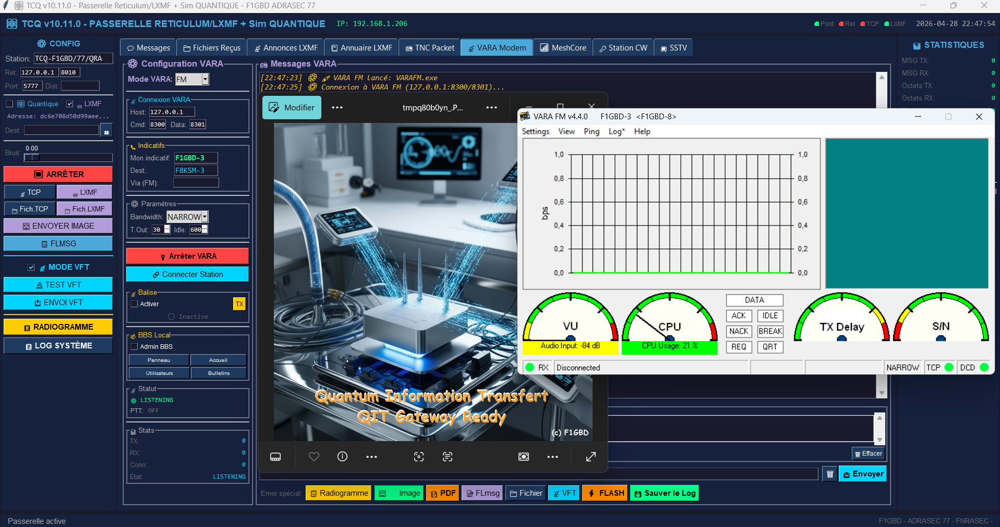
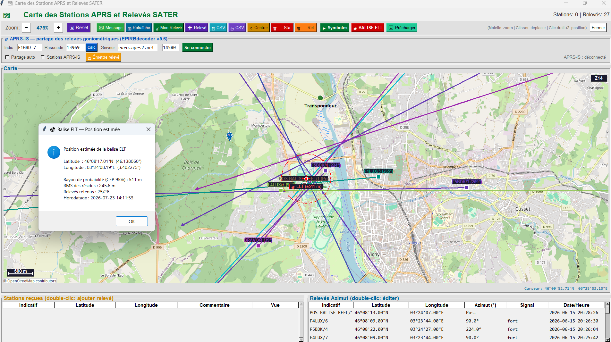
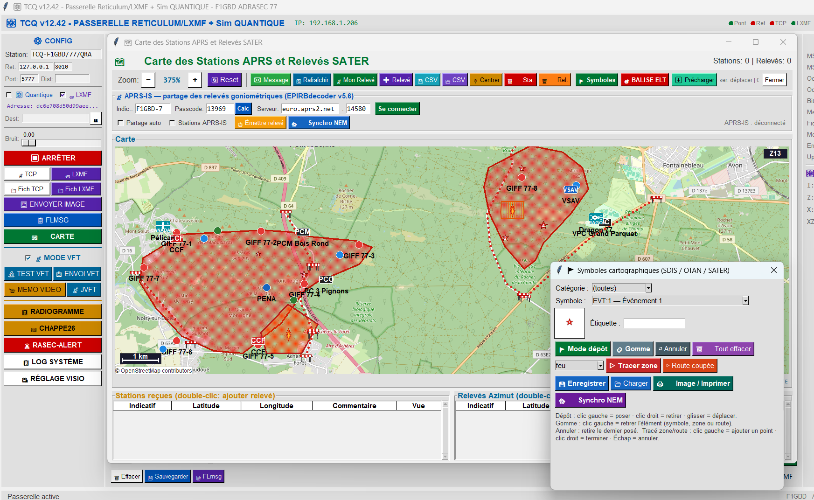
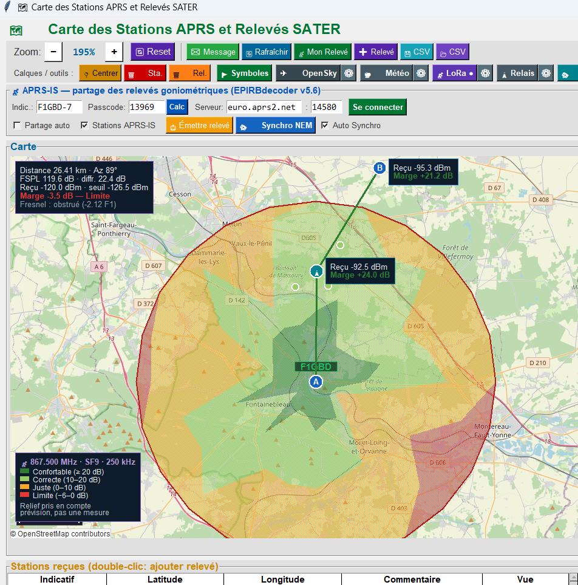
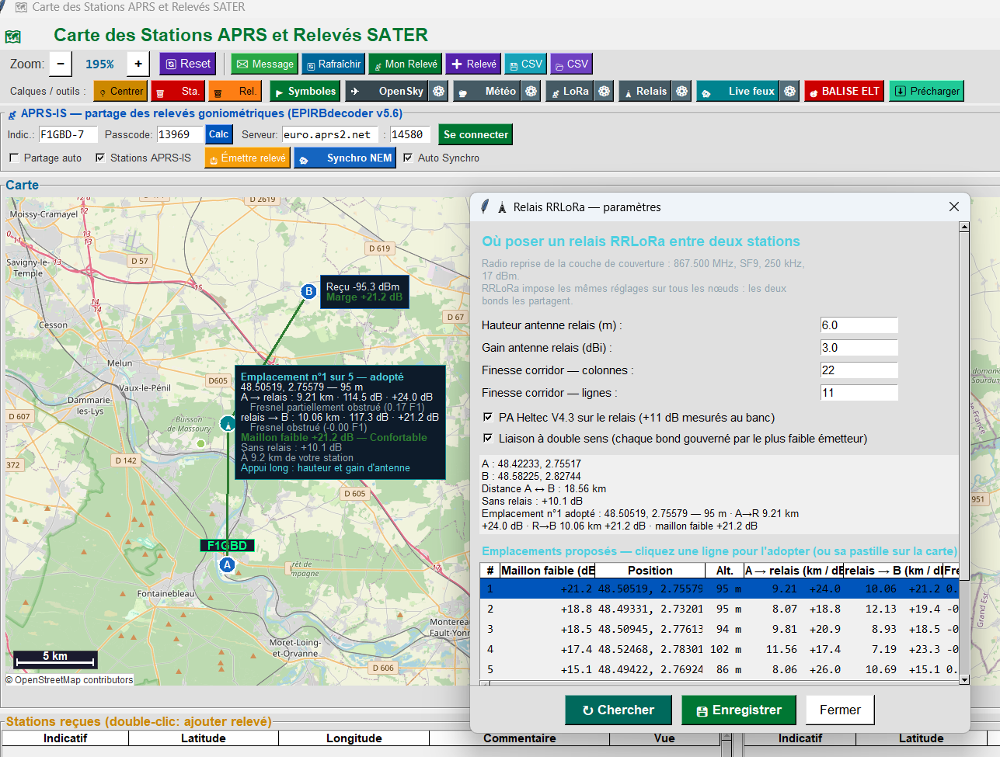
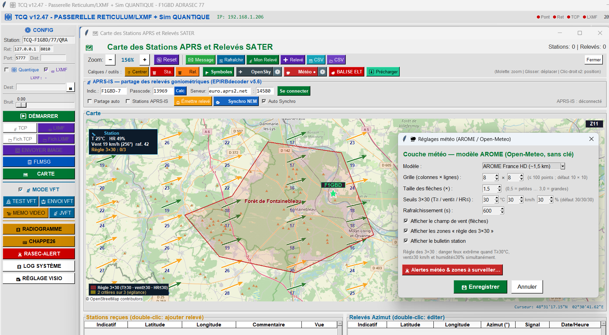
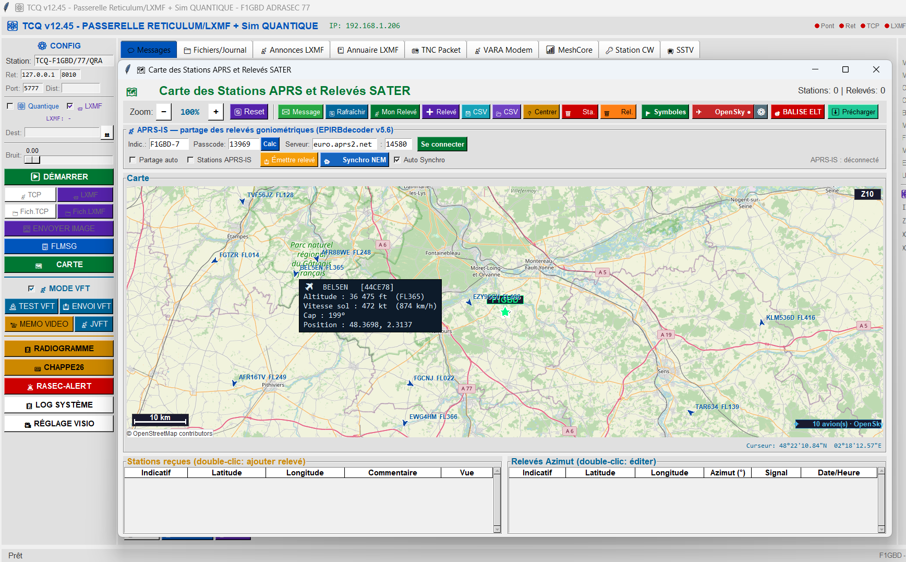
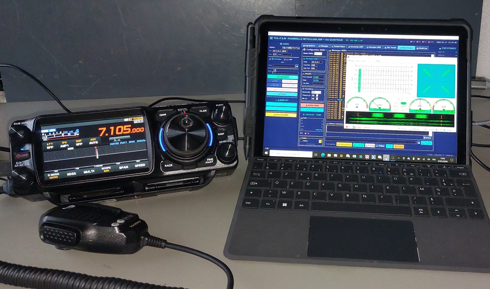

<div align="center">


# TCQ

### La plateforme de communications radio multi-modes des opérateurs ADRASEC

*Une seule application Windows pour LXMF/Reticulum · VARA HF/FM/SAT · Packet AX.25 · MeshCore LoRa · SSTV · CW · BBS · PDF radio · gonio SATER — et une carte opérationnelle.*

[]()
[]()
[](https://github.com/f1gbd/F1GBD/blob/master/LICENSE.txt)
[](https://github.com/f1gbd/F1GBD/releases?q=tcq)

## 📥 [Télécharger la dernière version](https://github.com/f1gbd/F1GBD/releases/download/tcq-v12.70/TCQ.7z)

**Ou en une seule commande PowerShell *(en administrateur)* :**

```powershell
iwr https://github.com/f1gbd/F1GBD/raw/master/tcq/Install-TCQ.ps1 -OutFile $env:TEMP\Install-TCQ.ps1; & $env:TEMP\Install-TCQ.ps1
```

*L'installeur télécharge et met à jour tout seul. Binaire autonome — aucune installation Python.*

[📜 Toutes les releases](https://github.com/f1gbd/F1GBD/releases?q=tcq) · [📚 Documentation](https://github.com/f1gbd/F1GBD/tree/master/tcq/TCQ%20Documentations) · [🕘 Historique détaillé](HISTORIQUE.md)

</div>

---

## Qu'est-ce que TCQ ?

Sur une opération ADRASEC, on ne sait jamais à l'avance quel lien tiendra. Le
réseau cellulaire est tombé, la VHF passe mal dans la vallée, le HF est
capricieux, et l'équipe d'à côté n'a que du LoRa. **TCQ réunit tous ces modes
dans une seule fenêtre**, avec la même messagerie chiffrée au-dessus, et une
carte qui montre où tout le monde se trouve.

C'est une application **Windows autonome**, pensée pour le terrain : robuste,
tolérante aux ruptures de liaison, et utilisable par un opérateur qui a autre
chose à faire que de la configuration.

**100 % local.** Aucune télémétrie, aucune connexion externe non sollicitée.

<p align="center">
  
  <br><i>Une fenêtre, un onglet par mode : Messages, Annonces et Annuaire LXMF, TNC Packet, VARA Modem, MeshCore, Station CW, SSTV. Ici, le modem VARA FM en service.</i>
</p>

---

## À quoi ça sert, concrètement

### 🛰️ Retrouver une balise de détresse

Les relèvements goniométriques des équipes arrivent sur une carte commune,
partagés en direct par **APRS-IS** avec l'EPIRBdecoder et SATERfinder Android.
TCQ croise les azimuts et donne la position estimée de la balise **avec son rayon
de probabilité** — pas un point qui ferait croire à une certitude qu'on n'a pas.

<p align="center">
  
  <br><i>25 relèvements retenus sur 26, position estimée à ±511 m (CEP 95 %). Chaque équipe voit les azimuts des autres au fur et à mesure.</i>
</p>

### 🗺️ Tenir la situation d'un exercice ou d'une intervention

Symboles normalisés **SDIS, OTAN et SATER**, zones, routes coupées, limites
d'unités — le tout enregistrable, rechargeable et imprimable. La carte se
**synchronise entre postes par radio** (LXMF/LoRa ou packet VHF), y compris sans
Internet.

<p align="center">
  
  <br><i>Cartographie avec la Symbologie SDIS.</i>
</p>

### 📡 Savoir jusqu'où on porte, et où poser un relais

Deux questions qu'on tranchait à l'estime. La carte calcule la **portée LoRa
prévisible** de votre station sur le relief réel, et vous dit **où poser un relais
RRLoRa** pour relier deux stations qui ne s'entendent pas.

<p align="center">
  
  <br><i>Portée en quatre couleurs, sur la fréquence réellement configurée. L'encart donne le bilan du point survolé : ici −3,5 dB à 26,4 km, Fresnel obstrué — ça ne passe pas.</i>
</p>

<p align="center">
  
  <br><i>18,56 km entre A et B : <b>+10,1 dB en direct, +21,2 dB avec un relais posé à 95 m</b>. Quatre autres emplacements sont proposés — le calcul ignore l'accès routier, c'est à vous de trancher.</i>
</p>

### 🔥 Anticiper le risque et suivre ce qui vole

Météo **AROME** sur la zone affichée, zones à risque incendie selon la **règle des
trois 30**, foyers actifs **EFFIS/FIRMS**, et suivi des aéronefs en temps réel —
bombardiers d'eau, hélicoptères Dragon et SAMU, Sécurité Civile — identifiés par
indicatif et par adresse ICAO.

<p align="center">
  
  <br><i>Zones à risque incendie selon la règle des trois 30 — température ≥ 30 °C, vent ≥ 30 km/h, humidité ≤ 30 %.</i>
</p>

<p align="center">
  
  <br><i>Suivi du traffic aérien local en temps réel avec filtrage possible.</i>
</p>


---

## Ce que TCQ sait faire

| | Fonction | En deux mots |
|:---:|---|---|
| 📨 | **LXMF / Reticulum** | Messagerie chiffrée bout-en-bout, multi-saut, résiliente. Passe par TCP, série, LoRa, packet AX.25 ou VARA. Annuaire, groupes, accusés de réception. |
| 📡 | **VARA HF / FM / SAT** | Modems ARQ haute performance, avec suspension et reprise des transferts. |
| 📻 | **Packet AX.25** | Direwolf lancé et configuré automatiquement. KISS et AGWPE. |
| 🌐 | **MeshCore LoRa** | Mesh LoRa natif : messagerie, BBS, fichiers diffusés, **canaux privés à clé secrète** partagés par QR code. |
| 🗺️ | **Carte opérationnelle** | Symboles SDIS / OTAN / SATER, zones, routes coupées, **synchronisation par radio** entre postes. |
| 🛰️ | **Gonio SATER** | Relèvements partagés par APRS-IS, **triangulation ELT** avec rayon de probabilité, import/export CSV. |
| 🗼 | **Couverture LoRa & relais** | Portée prévisible sur relief réel, bilan de liaison au curseur, **placement de relais RRLoRa**. Fonctionne sans réseau. |
| 🌦️ | **Météo & feux** | AROME, règle des trois 30, foyers EFFIS/FIRMS, aéronefs de lutte en direct. |
| 🖼️ | **SSTV** | Décodeur temps réel : Scottie, Martin, Robot, PD. Waterfall et plein écran. |
| 🎵 | **CW / Morse** | Décodeur DSP adaptatif, et **QSObrain** pour des QSO CW autonomes. |
| 📬 | **BBS multi-modes** | Sur TNC Packet et MeshCore, avec réassemblage et persistance. |
| 📄 | **PDF radio** | Documents transmis par radio : compression, fragmentation, ACK, reprise sélective. |
| 📹 | **Journal vidéo** | SITREP audiovisuel : MEMO VIDEO compressé, JVFT pleine qualité. |
| 🚨 | **RASEC-ALERT** | Alerte à distance par LXMF, packet ou VARA : plein écran clignotant, sirène, accusé. |
| 📟 | **CHAPPE26** | Décodage automatique des messages codés ADRASEC/FNRASEC. |

---

## Installer

### En une commande *(recommandé)*

PowerShell **en administrateur** :

```powershell
Set-ExecutionPolicy -Scope Process -ExecutionPolicy Bypass
iwr https://github.com/f1gbd/F1GBD/raw/master/tcq/Install-TCQ.ps1 -OutFile $env:TEMP\Install-TCQ.ps1; & $env:TEMP\Install-TCQ.ps1
```

L'installeur récupère la dernière version, l'installe dans `C:\TCQ` et crée les
raccourcis. Relancez la même commande pour mettre à jour.

### À la main

1. [Téléchargez `TCQ.7z`](https://github.com/f1gbd/F1GBD/releases/download/tcq-v12.70/TCQ.7z)
2. Vérifiez l'empreinte : `Get-FileHash -Algorithm SHA256 TCQ.7z` — elle est publiée avec la release
3. Décompressez dans `C:\` *(clic droit → 7-Zip → Extraire vers `C:\`)*
4. Lancez `C:\TCQ\TCQ.exe`

<p align="center">
  
  <br><i>Configuration type : PC, interface son, RNode LoRa et transceiver.</i>
</p>

---

## Premiers pas

1. **Renseignez votre station** — indicatif et position, onglet CONFIG. La position sert à la carte et aux relèvements.
2. **Choisissez vos transports** — TCP pour commencer, puis LoRa, packet ou VARA selon le matériel branché.
3. **Ouvrez la carte** et faites *Centrer* : vous devez vous y voir.
4. **Testez une liaison** — bouton *Test LXMF* vers un correspondant : la réponse revient automatiquement, avec le temps d'aller-retour.
5. **Avant une sortie sans réseau** — préchargez les tuiles de la zone *(⬇️ Précharger)* et le relief *(📡 LoRa → ⚙ → Préparer le relief)*.

> 📘 Le manuel de cartographie et la fiche réflexe « couverture LoRa et relais »
> détaillent chaque fonction — voir le [dossier documentation](https://github.com/f1gbd/F1GBD/tree/master/tcq/TCQ%20Documentations).

---

## 🆕 Dernières mises à jour

### Version courante : **v12.70** — *25 août 2026*

**Couverture LoRa et placement de relais RRLoRa sur la carte.** Deux boutons :
📡 **LoRa** trace la portée prévisible de votre station en quatre couleurs sur le
relief réel et donne le bilan de liaison au curseur ; 🗼 **Relais** explore le
corridor entre deux stations et propose cinq emplacements de répéteur, classés
par maillon faible.

**Utilisable sans réseau** : préparez le relief de la zone avant de partir, et
tout continue de fonctionner sur le terrain. L'application écrit alors
« Relief INTERPOLÉ » plutôt que de faire passer une valeur reconstruite pour une
valeur mesurée.

Même moteur de calcul que **RTspk Pager** sur Android — écart mesuré **nul**
entre les deux applications, en ligne comme hors ligne.

| Version | Date | Ce qui change |
|---|---|---|
| **v12.70** | 25/08/2026 | Couverture LoRa et relais RRLoRa, hors ligne compris |
| v12.68 | 24/08/2026 | Tracé de zone à nouveau possible après réouverture de la carte |
| v12.67 | 19/08/2026 | « RNS Nodes List » bascule sur RMAP, `rns.fyi` étant hors service |
| v12.63 → v12.66 | 15–16/08/2026 | Interopérabilité RTspk Pager : PING LXMF, images, radar aéronefs |
| v12.60 → v12.62 | 11–14/08/2026 | LXMF par radio VHF packet fiabilisé ; synchro de carte en delta, puis en binaire |
| v12.50 | 28/07/2026 | Couche « Live feux » : EFFIS, FIRMS et aéronefs de lutte |
| v12.46 → v12.47 | 26/07/2026 | Météo AROME sur la carte, suivi d'aéronefs en temps réel |
| v12.40 | 24/07/2026 | Cartographie opérationnelle et symboles normalisés |

📖 **[Historique détaillé de toutes les versions →](HISTORIQUE.md)**

---

## Documentation

| | Contenu |
|---|---|
| [📚 Dossier documentation](https://github.com/f1gbd/F1GBD/tree/master/tcq/TCQ%20Documentations) | Manuels utilisateur et fiches techniques |
| [🕘 Historique des versions](HISTORIQUE.md) | Le détail de chaque version |
| [📜 Releases](https://github.com/f1gbd/F1GBD/releases?q=tcq) | Binaires et notes de version |

---

<div align="center">

### 📡 Auteur

**Jean-Louis — F1GBD / F4JHW**
*ADRASEC 77 — FNRASEC*

**TCQ v12.70.0 — 25/08/2026**

Tous les modules intégrés respectent les licences de leurs auteurs originaux.

*Pour toute question, contactez votre référent ADRASEC départemental.*

📡 **TCQ** — *au service de la sécurité civile*

</div>
