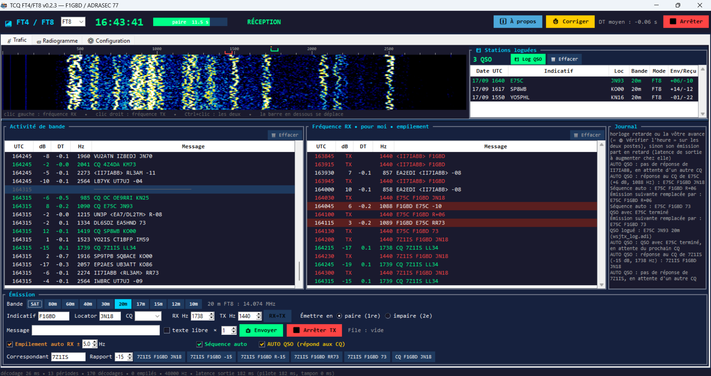
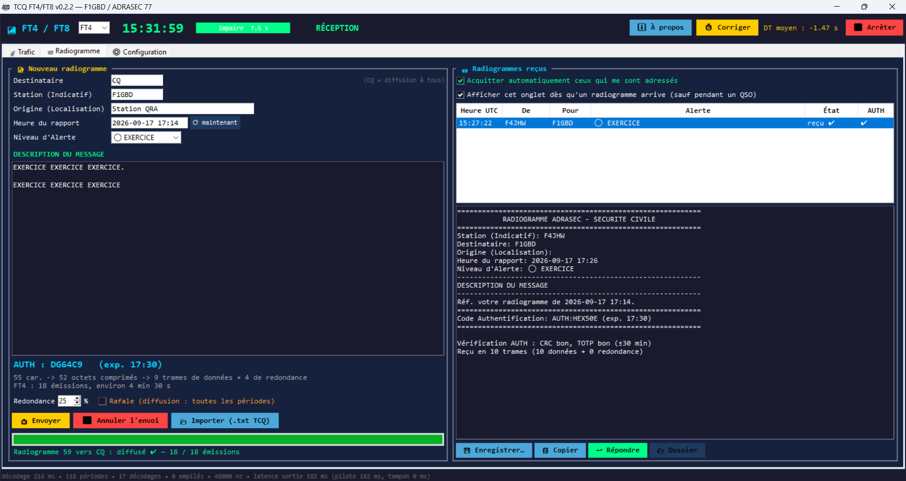
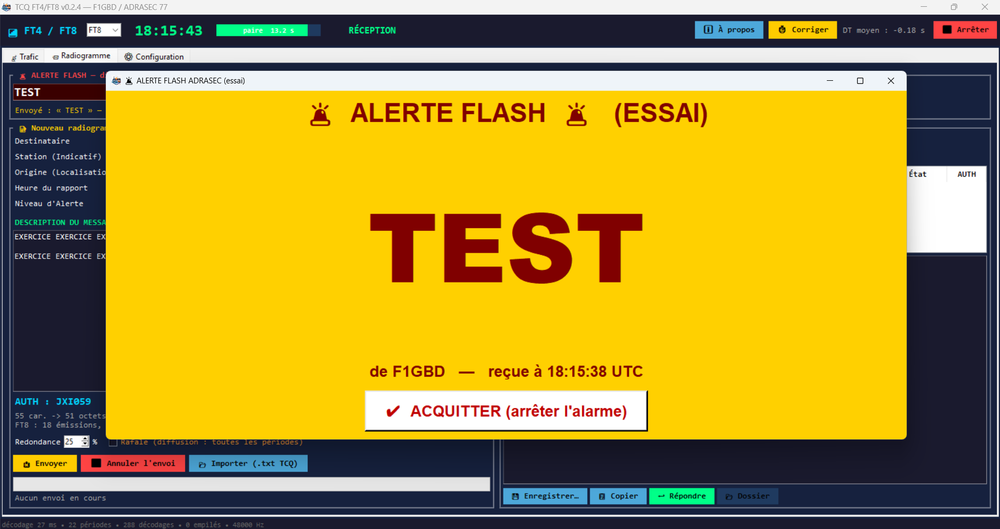
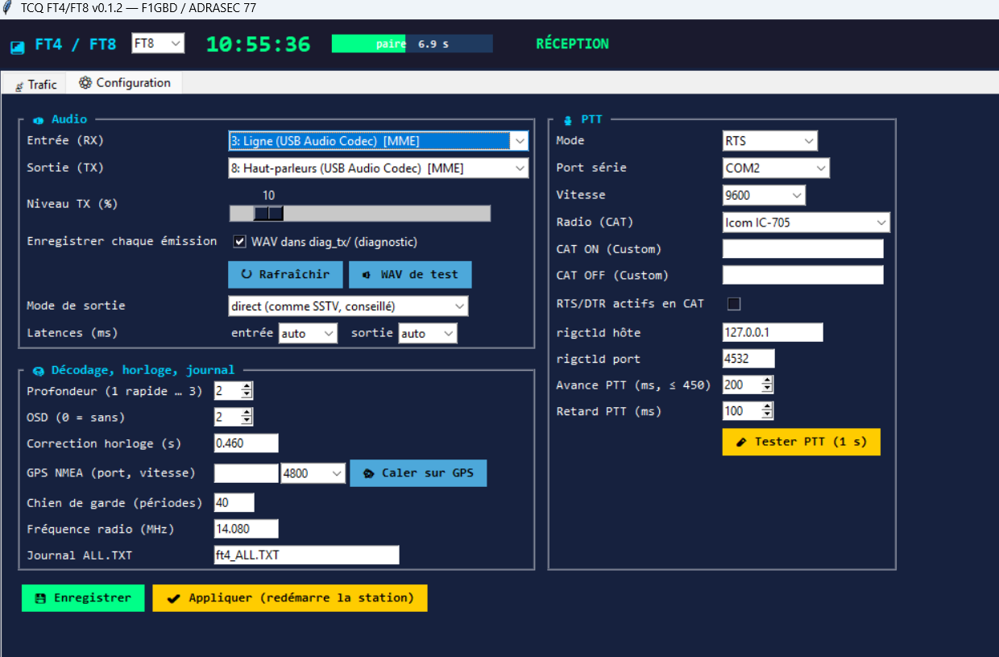
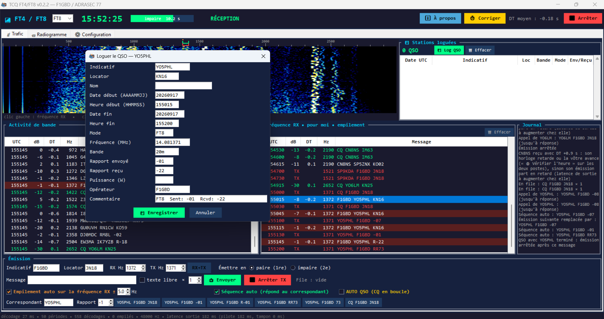

<div align="center">


# TCQws

### Weak Signal Emergency Messaging — le FT4 / FT8 des opérateurs ADRASEC

*Une application Windows autonome, sans WSJT-X : QSO FT4/FT8 et log ADIF · radiogrammes ADRASEC avec accusé de réception · alerte FLASH sonore et lumineuse · décodeur FT4 cohérent avec empilement des répétitions.*

[]()
[]()
[]()
[-teal.svg)]()
[](https://github.com/f1gbd/F1GBD/blob/master/LICENSE.txt)
[](https://github.com/f1gbd/F1GBD/releases?q=tcqws)

## 📥 [Télécharger directement la dernière version Windows](https://github.com/f1gbd/F1GBD/releases/download/tcqws-v0.2.4/TCQws.7z)

**Ou en une seule commande PowerShell *(en administrateur)* :**

```powershell
iwr https://github.com/f1gbd/F1GBD/raw/master/tcqws/Install-TCQws.ps1 -OutFile $env:TEMP\Install-TCQws.ps1; & $env:TEMP\Install-TCQws.ps1
```

*L'installeur télécharge, vérifie le SHA-256 et met à jour tout seul, en conservant vos réglages, votre log et vos radiogrammes. Binaire autonome — aucune installation Python, et aucune interférence avec TCQ.*

[📜 Toutes les releases](https://github.com/f1gbd/F1GBD/releases?q=tcqws) · [📚 Mode d'emploi](#installation-et-premiers-pas) · [🚨 Alerte FLASH](#2-lalerte-flash--32-caractères-tout-de-suite) · [📨 Radiogrammes](#1-les-radiogrammes-adrasec--le-message-pas-seulement-le-qso)

</div>

---

## En une phrase

TCQws est une application de trafic **FT4 et FT8 autonome** : elle ne pilote pas WSJT-X, elle ne l'imite pas non plus. Elle ajoute au protocole FT4/FT8 ce dont une équipe de sécurité civile a besoin sur le terrain : **transmettre un message formaté, déclencher une alerte, et décoder des signaux plus faibles que d'habitude** — tout en restant parfaitement compatible avec les stations WSJT-X.

Pour un QSO ordinaire, WSJT-X reste la référence. TCQws existe pour tout ce qu'il y a **autour** du QSO.



---

## La valeur ajoutée, en bref

| | WSJT-X | **TCQws** |
|---|---|---|
| QSO FT4 / FT8, log ADIF | ✔ | ✔ (log `wsjtx_log.adi` au même format) |
| Modes proposés | ~15 (FT8, FT4, JT65, Q65, WSPR, MSK144…) | FT4 et FT8 seulement |
| **Messages libres longs** | 13 caractères par émission | **jusqu'à ~1 500 caractères**, comprimés et protégés (radiogramme ADRASEC) |
| **Accusé de réception** | non | **oui** : trames manquantes redemandées, complétées, puis acquit |
| **Alerte d'urgence** | non | **alerte FLASH** : 32 caractères, écran rouge + alarme sonore chez tous les destinataires |
| **Décodage FT4** | décodeur WSJT-X | **décodeur cohérent** : ≈ 0,4 dB de mieux, et **empilement** des répétitions jusqu'à ≈ −24 dB |
| Tolérance d'horloge en FT4 | environ ±1 s | **−2 à +2 s** (deux PC désynchronisés continuent de se lire) |
| Vérification de l'heure | externe | **NTP intégré** + calage **GPS NMEA** (utile sans Internet) |
| PTT et CAT | un port, un réglage | **deux ports COM distincts** (PTT par RTS/DTR, CAT fréquence à part, 1200 bauds et 2 bits de stop possibles) |
| Diagnostic audio | limité | **WAV de chaque émission et de chaque réception**, compteurs de périodes perdues, alerte de DT anormal |
| Répondeur automatique | Auto-Seq + Call 1st | **AUTO QSO** : répond seul aux CQ, enchaîne, logue, et reprend l'écoute |
| Pays et distance à l'écran | via JTAlert (externe) | **intégré** : pays et km depuis votre locator |
| Filtre d'indicatifs | non | **exclusion par préfixe** (affichage et réponse auto) |

> TCQws est une réalisation indépendante : **aucun code de WSJT-X n'y est repris**. Seuls les protocoles FT4 et FT8 (K1JT, K9AN, G4WJS) sont implémentés, à partir de la bibliothèque libre `ft8_lib` (Kārlis Goba, YL3JG, licence MIT) complétée d'un décodeur cohérent écrit pour TCQ.

---

## 1. Les radiogrammes ADRASEC — le message, pas seulement le QSO

En exercice ou en opération, un réseau d'urgence ne transmet pas des rapports de signal : il transmet des **messages formatés**. TCQws transporte le radiogramme ADRASEC (le même que le module Packet de TCQ, avec son code d'authentification AUTH TOTP/CRC) **directement en FT4/FT8**, sans interface ni logiciel tiers.



- **Compression** par codeur arithmétique à contexte (≈ 3,5 bits par caractère en français), bien plus efficace que ZIP sur des messages courts.
- **Code d'effacement MDS** : n'importe quelles *k* trames parmi les *k + m* envoyées suffisent à reconstituer le message. Une trame perdue ne demande pas de tout retransmettre.
- **Mode dirigé** : le destinataire acquitte, ou indique combien de trames lui manquent ; l'expéditeur envoie alors des trames **nouvelles**, jamais des répétitions.
- **Mode diffusion** (destinataire CQ), avec option rafale (une trame par période, durée divisée par deux).
- **AUTH vérifié à l'arrivée** (CRC et TOTP ±30 min), message enregistré en `.txt` relisible par **RADIOGRAMME_VALIDATOR** de TCQ.
- Les trames sont des messages FT4/FT8 **standards** de type télémétrie : WSJT-X les affiche en hexadécimal, sans être perturbé.

**Durées indicatives en FT4** : ≈ 4,5 min pour 60 caractères en envoi dirigé, ≈ 9 min pour 600 caractères en diffusion rafale. En FT8, le double, avec une sensibilité un peu meilleure.

---

## 2. L'alerte FLASH — 32 caractères, tout de suite



Un radiogramme complet prend plusieurs minutes. Pour l'urgence immédiate, TCQws ajoute un format dédié :

- **32 caractères au plus**, diffusés à toutes les stations, **sur chaque période** : environ 75 s en FT4.
- 4 à 10 trames dont **n'importe lesquelles 1 à 6 suffisent** (même code correcteur que les radiogrammes), suivies de l'identification en clair.
- À la réception, sur chaque poste TCQws à l'écoute : **fenêtre rouge clignotante au premier plan**, message en très gros caractères, expéditeur, heure et fréquence, et **alarme sonore jusqu'à l'acquittement**.
- L'alerte est journalisée et enregistrée dans `radiogrammes\FLASH_*.txt`. Une alerte répétée n'est signalée qu'une fois par demi-heure.

C'est la fonction qui n'a aucun équivalent dans WSJT-X : elle transforme une station d'écoute en **poste d'alerte**, y compris sans opérateur devant l'écran.

---

## 3. Décoder plus bas que le seuil habituel

TCQws embarque **deux décodeurs** : celui de `ft8_lib` (FT8) et un **décodeur cohérent FT4** écrit pour TCQ, avec OSD.

Mesures sur bruit blanc, fichiers identiques donnés à TCQws et à `jt9 -d 3` de WSJT-X 2.7.0, 100 essais par point :

| S/B (FT4) | ft8_lib seul | **TCQws (cohérent)** | WSJT-X |
|---|---|---|---|
| −18 dB | 0 % | **32 %** | 23 % |
| −17 dB | 0 % | **87 %** | 72 % |
| −16 dB | 4 % | **96 %** | 91 % |
| **Seuil à 50 %** | ≈ −14,3 dB | **≈ −17,7 dB** | ≈ −17,3 dB |

Et surtout, l'**empilement** (« stacking ») : en réseau d'urgence, une station en difficulté répète son message. TCQws additionne **de façon cohérente** les périodes successives reçues sur la même fréquence :

| Périodes empilées | 1 | 2 | 4 | 8 | 16 |
|---|---|---|---|---|---|
| Seuil à 50 % | ≈ −17,8 dB | ≈ −18,5 dB | ≈ −20,6 dB | ≈ −22,2 dB | **≈ −24,2 dB** |

Avec 16 répétitions (2 à 4 minutes), un message passe **sous le seuil du FT8**, dans la zone de Q65-30 — sans changer de mode ni de matériel. Aucune fausse détection n'est apparue sur 4 000 essais d'empilement de bruit pur, ni sur 600 périodes de bruit en décodage normal.

**En FT8**, le décodeur reste celui de `ft8_lib` : seuil à 50 % d'environ −18,7 dB, contre −20,6 dB pour WSJT-X. C'est le point où WSJT-X garde l'avantage.

---

## 4. Tenir sur le terrain



- **Heure** : vérification **NTP** au démarrage et sur demande, correction proposée en un clic, et **calage GPS NMEA** pour le mode blackout (sans Internet). Le journal signale toute station reçue avec un DT anormal, et dit s'il faut corriger une horloge ou une latence.
- **Tolérance d'horloge** : en FT4, TCQws décode de **−2 à +2 s** de DT, là où WSJT-X s'arrête vers ±1 s. Deux postes mal synchronisés continuent de se lire — le temps de corriger.
- **PTT et CAT séparés** : PTT par RTS, DTR, CAT, rigctld ou VOX sur un port, **fréquence par CAT sur un autre port** (vitesse et bits de stop propres). Les transceivers anciens, comme l'IC-737 (CI-V sans commande d'émission, 1200 bauds, 2 bits de stop), fonctionnent tels quels.
- **Boutons de bande** SAT, 80 → 10 m : la radio se règle par CAT, la fréquence suit le mode FT4/FT8, chaque bouton se modifie au clic droit.
- **Audio maîtrisé** : sortie 48 kHz 16 bits stéréo comme WSJT-X, latences réglables, et **enregistrement WAV de chaque émission et de chaque réception** pour diagnostiquer une chaîne audio douteuse au lieu de la deviner.
- **Un seul exécutable**, sans installation ni service, et un mode **`--demo`** avec bande simulée pour se former sans radio.

---

## 5. Le trafic de tous les jours



- **AUTO QSO** : TCQws répond seul aux CQ reçus (la station la plus forte, pas encore contactée sur la bande et le mode), mène le QSO, l'enregistre, puis se remet à l'écoute. Les CQ dirigés vers une zone sont ignorés, les CQ d'activité (POTA, SOTA, WWFF…) non.
- **Log ADIF** `wsjtx_log.adi` au format de WSJT-X : importable dans Log4OM, JTAlert, TQSL/LoTW, Club Log, QRZ… ou ajouté directement au log existant de WSJT-X.
- **Indicatifs spéciaux et portables** (`TM50SC`, `F1GBD/P`) gérés comme dans WSJT-X, y compris le cas où WSJT-X ne peut pas transmettre de rapport.
- **CQ POTA / SOTA / IOTA / WWFF…** par un champ dédié.
- **Pays et distance** affichés directement dans l'activité de bande (calculés depuis votre locator), et **filtre d'exclusion par préfixe** pour écarter d'un coup une zone qui sature la bande — à l'affichage comme en réponse automatique.
- **Journal `ALL.TXT`** au format WSJT-X, et double-clic qui passe en émission comme dans WSJT-X.

---

## Ce que WSJT-X fait mieux

Par honnêteté, et parce que les deux logiciels sont complémentaires :

- **Beaucoup plus de modes** : JT65, Q65, WSPR, MSK144, FST4, EME… TCQws ne fait que FT4 et FT8.
- **Décodage FT8 plus sensible** (≈ 2 dB), grâce à des techniques de décodage multi-passes et *a priori* que TCQws n'implémente pas.
- **Écosystème** : PSK Reporter, JTAlert, cartes, concours, traductions, multi-plateforme, et une communauté considérable.
- **Maturité** : des années d'essais sur l'air, sur toutes les bandes et tous les continents.

TCQws n'a pas vocation à remplacer WSJT-X sur une station de trafic. Il est fait pour le poste ADRASEC, en exercice ou en opération — et rien n'empêche d'avoir les deux sur le même PC.

---

## Installation et premiers pas

### Installation automatique (recommandée)

```powershell
# PowerShell administrateur
iwr https://github.com/f1gbd/F1GBD/raw/master/tcqws/Install-TCQws.ps1 -OutFile $env:TEMP\Install-TCQws.ps1
& $env:TEMP\Install-TCQws.ps1
```

Le script prend la dernière release **TCQws** (tag `tcqws-v…`), vérifie le SHA-256, installe dans `C:\TCQws` et crée un raccourci. Lors d'une mise à jour, il **conserve** les réglages (`ft4_config.json`), le log ADIF, le journal `ft4_ALL.TXT` et le dossier `radiogrammes\`. Une installation de **TCQ** existante n'est pas touchée : les deux applications cohabitent.

### Installation manuelle

1. Télécharger `TCQws.7z` dans la dernière [release `tcqws-v…`](https://github.com/f1gbd/F1GBD/releases), décompresser dans un dossier où l'on peut écrire (par exemple `C:\TCQws`).
1. Télécharger `TCQws.7z` dans la dernière [release `tcqws-v…`](https://github.com/f1gbd/F1GBD/releases), décompresser dans un dossier où l'on peut écrire (par exemple `C:\TCQws`).
2. Lancer **`TCQws.exe`**.
3. Essayer d'abord **sans radio** : `TCQws.exe --demo` (bande simulée, stations automatiques, radiogramme et alerte FLASH d'exercice).
4. Régler l'audio, le PTT, le CAT et l'heure dans l'onglet ⚙ Configuration, puis **💾 Enregistrer** et **✔ Appliquer**.

**Options :** `--demo`, `--sans-accueil`, `--config fichier.json`.

**Fichiers créés à côté de l'exécutable :** `ft4_config.json` (réglages), `ft4_ALL.TXT` (journal), `wsjtx_log.adi` (log ADIF), `radiogrammes\` (messages reçus), `diag_tx\` (WAV de diagnostic).

Le mode d'emploi complet est dans **`README_TCQws.md`**, livré avec l'application.

Windows 10/11 64 bits. Ce dépôt publie les **exécutables** ; les sources ne sont pas distribuées.

---

## Licences et crédits

- **TCQws** © 2026 F1GBD — ADRASEC 77 / FNRASEC. Licence : voir `LICENSE`.
- **Protocoles FT4 et FT8** : Joe Taylor K1JT, Steve Franke K9AN, Bill Somerville G4WJS et l'équipe WSJT-X. TCQws est une réalisation indépendante, **non affiliée au projet WSJT-X**, et ne reprend aucun de ses codes.
- **ft8_lib** : Kārlis Goba, YL3JG — licence MIT.
- **Composants tiers** : Python, Tk, NumPy, SciPy, PortAudio / sounddevice, pySerial, Pillow, chacun sous sa propre licence.

*L'utilisation de TCQws se fait dans le respect des conditions de la licence radioamateur de l'opérateur. Les fonctions d'urgence (radiogrammes, alerte FLASH) sont destinées aux exercices et aux opérations de sécurité civile encadrées par la FNRASEC.*

<p align="center"><i>73 de F1GBD — ADRASEC 77</i></p>
