<div align="center">

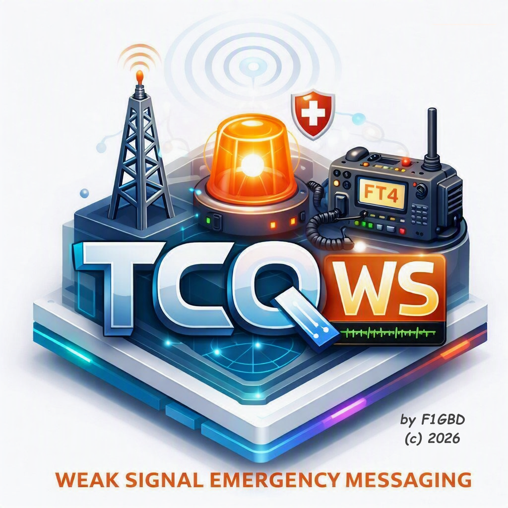

# TCQws

### Weak Signal Emergency Messaging — le FT4 / FT8 / JTTY / RTTY des opérateurs ADRASEC

*Une application Windows autonome, sans WSJT-X : QSO FT4/FT8/JTTY et log ADIF · **mode JTTY** asynchrone, du texte libre au clavier · radiogrammes ADRASEC avec accusé de réception · alerte FLASH sonore et lumineuse · code civil CHAPPE-26 décodé en clair · trafic satellite et activations · décodeur FT4 cohérent avec empilement des répétitions.*

[]()
[]()
[]()
[-teal.svg)]()
[](https://github.com/f1gbd/F1GBD/blob/master/LICENSE.txt)
[](doc/Chappe26_Livret_B5.pdf)
[](HISTORIQUE.md)

## 📥 Télécharger TCQws v0.7.5 pour Windows

### **[⬇ TCQws-0.7.5-setup.exe](https://github.com/f1gbd/F1GBD/releases/download/tcqws-v0.7.5/TCQws-0.7.5-setup.exe)** — double-clic, et c'est installé

*Aucun droit administrateur, aucune installation Python, aucune interférence avec TCQ. Raccourcis Bureau et menu Démarrer, manuel inclus, et une désinstallation qui conserve vos réglages, votre log ADIF, votre journal et vos radiogrammes.*

**[⬇ TCQws.7z](https://github.com/f1gbd/F1GBD/releases/download/tcqws-v0.7.5/TCQws.7z)** — l'archive, pour installer à la main ou mettre à jour par-dessus l'existant.

**[📱 TCQws Android](android/README.md)** — la même station sur téléphone et tablette : **[⬇ TCQws_android-0.4.6.apk](https://github.com/f1gbd/F1GBD/releases/download/tcqws-android-v0.4.6/TCQws_android-0.4.6.apk)**

---

### 🆕 Nouveau : le mode **JTTY**, le troisième mode de TCQws

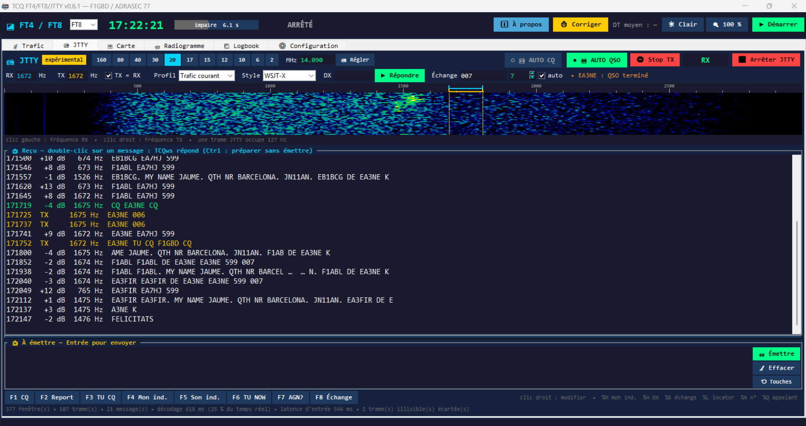

*Le mode asynchrone de WSJT-X 3.2, dans son propre onglet : **ni période de 15 s, ni parité, ni message à cases**. On tape une ligne, Entrée, c'est parti — et ce qui arrive se déroule au-dessus, trame après trame. De la RTTY qui décode à **−16 dB**.*

*Le QSO se mène tout seul : **double-clic** sur la station, **AUTO CQ** / **AUTO QSO**, clôture au 73 et **log ADIF** (`MODE=MFSK`, `SUBMODE=JTTY`).*

*Et depuis la **v0.7.0**, le JTTY porte les trois outils de la **Station CW de TCQ** : le **radiogramme ACP 127 OTAN**, les huit touches du **protocole QSO**, et le **script QSO Auto** en métalangage **MTL**. Mêmes formats, mêmes variables — un radiogramme émis en CW se lit en JTTY.*

*La **v0.7.1** allège le radiogramme d'**un tiers de ses trames** et apprend au QSO automatique à **répondre à chacun dans sa langue** — en phrases entières à qui traficote en RTTY, en quatre trames à qui traficote en WSJT-X. La **v0.7.2** raccourcit le trafic RTTY lui-même : trois appels sans réponse coûtent désormais **28 secondes au lieu de 68**. Et la **v0.7.3** rend le **radiogramme ACP 127 fiable en présence de trafic** : chaque morceau porte son rang, le morceau perdu se redemande **seul**, et l'accusé de réception part **tout seul**.*

*🆕 **v0.7.5 — TCQws parle maintenant RTTY.** Le vrai Baudot, 45,45 bauds, shift 170 Hz. Un clic sur le titre de l'onglet et `📻 JTTY` devient `📻 RTTY` : mêmes touches, même radiogramme ACP 127, même métalangage, même log. Le JTTY entend onze décibels plus bas — mais il ne parle qu'au JTTY, et **un réseau d'urgence qui ne peut parler qu'à lui-même ne sert à rien**.* **[→ tout le mode JTTY](#11-le-mode-jtty--du-texte-libre-quand-on-veut)**

[📜 Historique des versions](HISTORIQUE.md) · [📖 Manuel PDF](doc/MANUEL_TCQws.pdf) · [📱 Android](android/README.md) · [📻 JTTY](#11-le-mode-jtty--du-texte-libre-quand-on-veut) · [🚨 Alerte FLASH](#2-lalerte-flash--32-caractères-tout-de-suite) · [🗼 CHAPPE-26](#3-chappe-26--une-phrase-en-quatre-chiffres) · [📡 PING et carte](#5-ping--pong-et-la-carte-du-réseau) · [🛰 Satellite](#4-satellite-et-activations) · [📨 Radiogrammes](#1-les-radiogrammes-adrasec--le-message-pas-seulement-le-qso)

</div>

---

## En une phrase

TCQws est une application de trafic **FT4, FT8 et JTTY autonome** : elle ne pilote pas WSJT-X, elle ne l'imite pas non plus. Elle ajoute à ces protocoles ce dont une équipe de sécurité civile a besoin sur le terrain : **transmettre un message formaté, déclencher une alerte, et décoder des signaux plus faibles que d'habitude** — tout en restant parfaitement compatible avec les stations WSJT-X.

Pour un QSO ordinaire, WSJT-X reste la référence. TCQws existe pour tout ce qu'il y a **autour** du QSO — et, avec le **JTTY**, pour ce que le FT4/FT8 ne sait pas faire : écrire librement, sans attendre la période suivante.

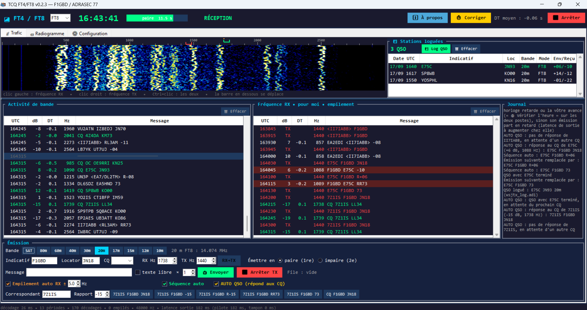

---

## La valeur ajoutée, en bref

| | WSJT-X | **TCQws** |
|---|---|---|
| QSO FT4 / FT8, log ADIF | ✔ | ✔ (log `wsjtx_log.adi` au même format) |
| Modes proposés | ~15 (FT8, FT4, JT65, Q65, WSPR, MSK144…) | FT4, FT8, et **JTTY** (expérimental) |
| **Radiogramme ACP 127 OTAN** | non | **oui, en JTTY** : priorité, DTG, compte de groupes, découpage automatique, détection et formulaire imprimable à la réception |
| **Script de QSO automatique** | non | **métalangage MTL** : un QSO complet décrit en sept commandes, vérifié avant l'air, échangeable entre opérateurs |
| **Messages libres longs** | 13 caractères par émission | **jusqu'à ~1 500 caractères**, comprimés et protégés (radiogramme ADRASEC) |
| **Accusé de réception** | non | **oui** : trames manquantes redemandées, complétées, puis acquit |
| **Alerte d'urgence** | non | **alerte FLASH** : 32 caractères, écran rouge + alarme sonore chez tous les destinataires |
| **Code civil CHAPPE-26** | non | **1000 codes** : une phrase en 4 chiffres, décodée en clair à l'arrivée |
| **Décodage FT4** | décodeur WSJT-X | **décodeur cohérent** : ≈ 0,4 dB de mieux, et **empilement** des répétitions jusqu'à ≈ −24 dB |
| Tolérance d'horloge en FT4 | environ ±1 s | **−2 à +2 s** (deux PC désynchronisés continuent de se lire) |
| Vérification de l'heure | externe | **NTP intégré** + calage **GPS NMEA** (utile sans Internet) |
| PTT et CAT | un port, un réglage | **deux ports COM distincts** (PTT par RTS/DTR, CAT fréquence à part, 1200 bauds et 2 bits de stop possibles) |
| Diagnostic audio | limité | **WAV de chaque émission et de chaque réception**, compteurs de périodes perdues, alerte de DT anormal |
| Répondeur automatique | Auto-Seq + Call 1st | **AUTO QSO** : répond seul aux CQ, enchaîne, logue, et reprend l'écoute — en FT4/FT8 **et en JTTY**, où s'ajoute **AUTO CQ** (appeler, conclure et loguer sans intervention) |
| Pays et distance à l'écran | via JTAlert (externe) | **intégré** : pays et km depuis votre locator |
| Filtre d'indicatifs | non | **exclusion par nom de pays** : « Russie, Bielorussie » (affichage, carte et réponse auto) |
| **Appel de présence** | non | **PING / PONG** : qui est là, où, avec quel rapport — en deux périodes, sans QSO |
| **Carte des stations** | non (PSKreporter, en ligne) | **carte du monde embarquée**, grille des locators, **sans aucun réseau** |
| **Éditeur de journal** | log en écriture seule | **onglet Logbook** : corriger, supprimer, ajouter un QSO dans le `.adi` |
| **Trafic satellite** | fréquence unique | **split Rx/Tx automatique par CAT**, log ADIF sur la montée (`prop_mode` / `sat_name` / `sat_mode`) |
| **Activations** (LLOTA…) | non | champ dédié → `MY_SIG` / `MY_SIG_INFO` dans le log |
| Thème d'écran | clair | **clair ou sombre**, au choix — plein jour sous la tente ou vidéoprojection |
| **Taille des caractères** | fixe | **100 / 125 / 150 %** d'un bouton — tablette de 10 pouces, lecture debout |
| **Récepteur** | carte son (transceiver) | carte son **ou clé RTL-SDR** : un SWL décode sans transceiver |
| **Configurations nommées** | une seule configuration | **profils** : exercice, satellite, portable — chargés en deux clics, échangeables entre postes |
| Mise à jour | manuelle | **vérifiée depuis l'application** (bouton dans « À propos ») |

> TCQws est une réalisation indépendante : **aucun code de WSJT-X n'y est repris**. Seuls les protocoles FT4 et FT8 (K1JT, K9AN, G4WJS) sont implémentés, à partir de la bibliothèque libre `ft8_lib` (Kārlis Goba, YL3JG, licence MIT) complétée d'un décodeur cohérent écrit pour TCQ.

---

## 1. Les radiogrammes ADRASEC — le message, pas seulement le QSO

En exercice ou en opération, un réseau d'urgence ne transmet pas des rapports de signal : il transmet des **messages formatés**. TCQws transporte le radiogramme ADRASEC (le même que le module Packet de TCQ, avec son code d'authentification AUTH TOTP/CRC) **directement en FT4/FT8**, sans interface ni logiciel tiers.

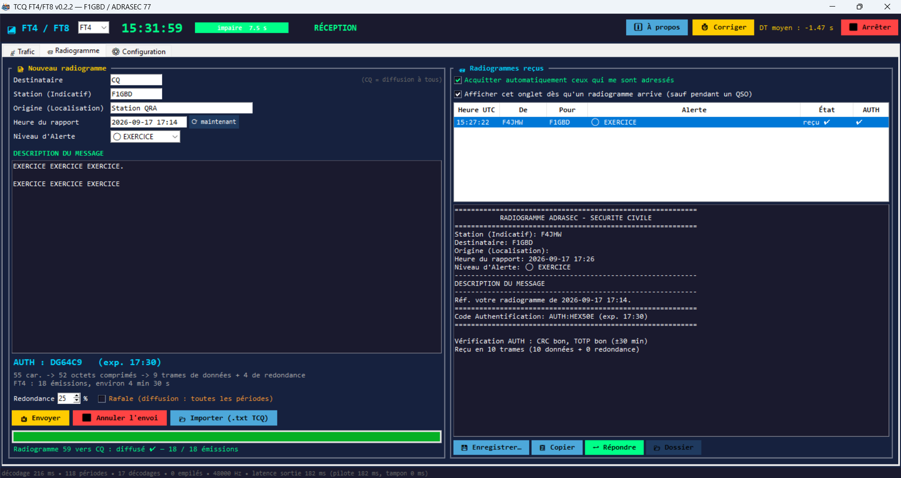

- **Compression** par codeur arithmétique à contexte (≈ 3,5 bits par caractère en français), bien plus efficace que ZIP sur des messages courts.
- **Code d'effacement MDS** : n'importe quelles *k* trames parmi les *k + m* envoyées suffisent à reconstituer le message. Une trame perdue ne demande pas de tout retransmettre.
- **Mode dirigé** : le destinataire acquitte, ou indique combien de trames lui manquent ; l'expéditeur envoie alors des trames **nouvelles**, jamais des répétitions.
- **Mode diffusion** (destinataire CQ), avec option rafale (une trame par période, durée divisée par deux).
- **AUTH vérifié à l'arrivée** (CRC et TOTP ±30 min), message enregistré en `.txt` relisible par **RADIOGRAMME_VALIDATOR** de TCQ.
- Les trames sont des messages FT4/FT8 **standards** de type télémétrie : WSJT-X les affiche en hexadécimal, sans être perturbé.

**Durées indicatives en FT4** : ≈ 4,5 min pour 60 caractères en envoi dirigé, ≈ 9 min pour 600 caractères en diffusion rafale. En FT8, le double, avec une sensibilité un peu meilleure.

---

## 2. L'alerte FLASH — 32 caractères, tout de suite

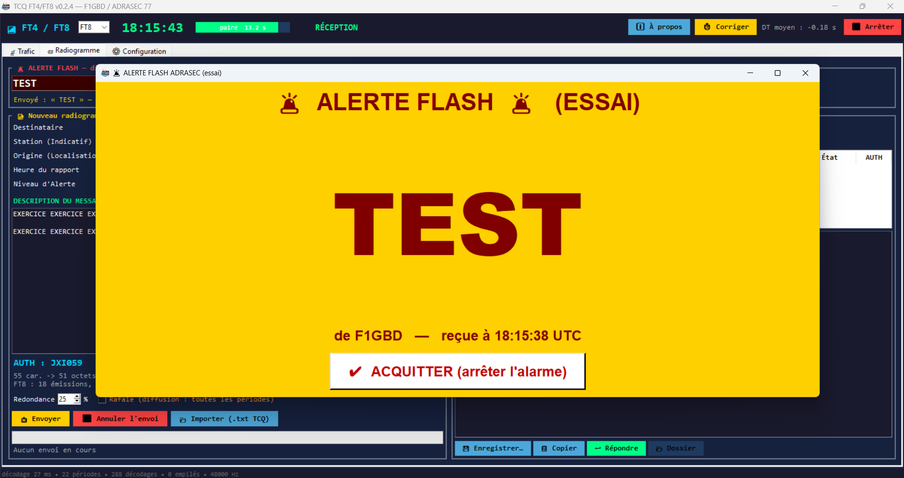

Un radiogramme complet prend plusieurs minutes. Pour l'urgence immédiate, TCQws ajoute un format dédié :

- **32 caractères au plus**, diffusés à toutes les stations, **sur chaque période** : environ 75 s en FT4.
- 4 à 10 trames dont **n'importe lesquelles 1 à 6 suffisent** (même code correcteur que les radiogrammes), suivies de l'identification en clair.
- À la réception, sur chaque poste TCQws à l'écoute : **fenêtre rouge clignotante au premier plan**, message en très gros caractères, expéditeur, heure et fréquence, et **alarme sonore jusqu'à l'acquittement**.
- L'alerte est journalisée et enregistrée dans `radiogrammes\FLASH_*.txt`. Une alerte répétée n'est signalée qu'une fois par demi-heure.

C'est la fonction qui n'a aucun équivalent dans WSJT-X : elle transforme une station d'écoute en **poste d'alerte**, y compris sans opérateur devant l'écran.

---

## 3. CHAPPE-26 — une phrase en quatre chiffres

[](doc/Chappe26_Livret_B5.pdf)
[](doc/TCQws-Chappe26_Fiche_BlackOut.pdf)

Trente-deux caractères, c'est peu pour dire une situation. Le **livre de code civil CHAPPE-26** de l'ADRASEC résout le problème à la façon du télégraphe Chappe : **un nombre de quatre chiffres vaut une phrase entière**, lue dans un livret de poche que l'opérateur a sur lui.

    1204 = Santé · Urgence · Ambulance requise
    1376 = Sécurité civile · Coupure électricité
    1990 = Fin de transmission

Une alerte FLASH qui commence par **`!`** est reconnue comme du CHAPPE-26. Un seul `!` pour tout le message, et non un devant chaque code : chaque caractère gagné est un code de plus, et les 32 caractères portent ainsi **sept codes**, soit sept phrases.

**À l'émission**, TCQws traduit les codes au fur et à mesure de la frappe et signale avant l'envoi un groupe incomplet, un code absent du livret ou l'oubli du `1990` final — une alerte part pour plus d'une minute, mieux vaut corriger avant.

**À la réception**, l'alarme se déclenche comme pour toute alerte FLASH, et le message s'affiche **en clair, en très gros caractères** ; les codes reçus restent rappelés en dessous, pour contrôle sur le livret papier. Le fichier `radiogrammes\FLASH_*.txt` conserve les deux.

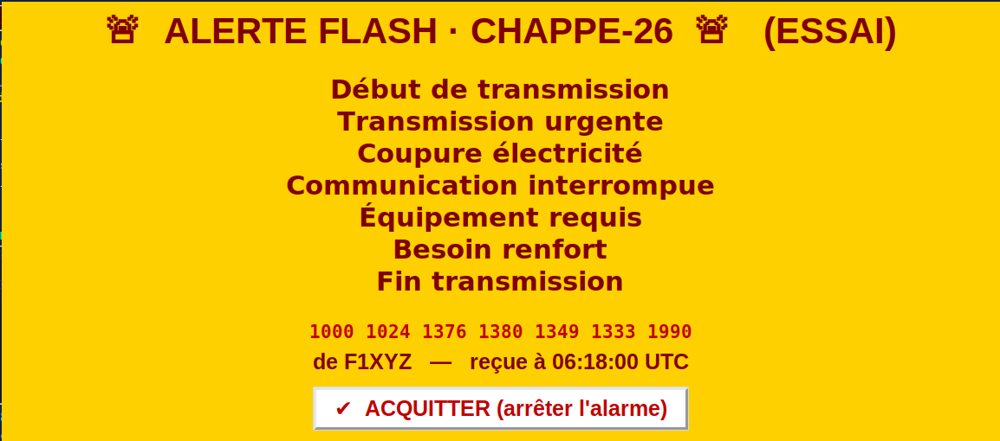

Exemple complet — demande de moyens radio pendant un black-out, 29 caractères sur 32 :

```
!1000102413761380134913331990
```

> Début de transmission · Transmission urgente · Coupure électricité · Communication interrompue · Équipement requis · Besoin renfort · Fin transmission

Le tout se relit à la main avec le seul livret, sans TCQws et sans électricité : retirer le `!`, découper en groupes de quatre, chercher chaque code. Le chiffrement Page/Ligne du livret (clé du jour) se fait avant la frappe et se défait après la réception — **TCQws ne détient aucune clé** et transporte le message tel qu'il est saisi.

📄 **[Fiche d'exemple BLACK-OUT](doc/TCQws-Chappe26_Fiche_BlackOut.pdf)** · 📘 **[Livret des 1000 codes](doc/Chappe26_Livret_B5.pdf)**

---

## 4. Satellite et activations

**La bande SAT sait qu'on n'émet pas là où on écoute.** Le cadre *Fréquences spéciales* de la configuration porte **Radio Rx** et **Radio Tx** — ce que le transceiver affiche vraiment en écoute et en émission, 28,540 et 28,040 MHz derrière un downconverter QO-100 — et **SAT Tx**, la montée réelle : 2 400,040 MHz.

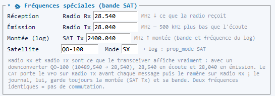

Le QSO est alors logué **sur la montée**, offset audio compris, parce que c'est la convention ADIF d'un contact satellite : la bande d'un QSO QO-100 est le 13 cm, pas le 3 cm de la descente.


```
<band:4>13cm <freq:11>2400.040935 <prop_mode:3>SAT <sat_name:6>QO-100 <sat_mode:2>SX
```

**Le VFO commute tout seul** : le CAT le porte sur *Radio Tx* avant chaque message émis, puis le ramène sur *Radio Rx*. Les deux fréquences se règlent librement, dans les deux sens — un transpondeur n'est pas forcément inverseur, et un relais V/U écoute en 2 m pour émettre en 70 cm. La conversion vers la fréquence rayonnée reste l'affaire de votre transverter ou de votre SDR, et le nom comme le mode du satellite se règlent : rien n'est figé sur QO-100.

**Les activations vont dans le log, pas sur l'air.** Le champ **LLOTA**, à droite de la fréquence, reçoit une référence comme `LLFR-0087` ; chaque QSO logué porte alors :

```
<operator:5>F1GBD <my_sig:5>LLOTA <my_sig_info:9>LLFR-0087
```

Le protocole FT4/FT8 limite le modificateur d'appel à quatre lettres — « LLOTA » n'y tient pas — d'où un champ séparé de celui des CQ POTA/SOTA/WWFF. Champ vide, aucun de ces champs n'est écrit.

Un champ **Commentaire** complète l'ensemble : vide, TCQws écrit son commentaire habituel ; rempli, votre texte part tel quel dans `<comment>`.

---

## 5. PING / PONG et la carte du réseau

**Une question simple : qui est là ?** Le bouton **📡 PING** émet `CQ PING F1GBD JN18`. Chaque station TCQws à l'écoute, case **PONG** cochée, répond `CQ PONG F4JHW JN19`. En deux périodes, l'inventaire du réseau est fait — sans engager un seul QSO, sans rien demander aux opérateurs.

Ce sont des **messages FT4/FT8 standards** : un CQ avec modificateur, comme `CQ POTA`. Une station sous WSJT-X les décode donc normalement et peut répondre à la main. Rien de propriétaire, rien de caché. Et comme le PONG est un CQ et non une réponse dirigée, **tout le réseau entend l'inventaire**, pas seulement celui qui a lancé l'appel.

Si vingt stations répondaient au même instant sur la même fréquence audio, aucune ne serait décodée : chaque répondant tire donc sa fréquence entre 500 et 2400 Hz à partir de son indicatif, et les réponses se répartissent sur deux périodes.

**La carte suit.** L'onglet 🗺 **Carte** pose sur une carte du monde toutes les stations entendues dont le message portait un locator : un rond **coloré selon la bande**, un **triangle** pour celles qui ont répondu au PING, un **anneau clair** pour celles avec qui un QSO a été fait, une croix pour la vôtre. Survol : pays, locator, distance, azimut, rapport, bande, ancienneté.

**Sur quelle bande ?** Trois réponses qui se complètent : la couleur du marqueur, la bande écrite à côté de l'indicatif (« F4JHW 20m »), et un filtre qui n'affiche qu'une bande. Les trois, parce que sur une carte deux marqueurs quelconques peuvent se toucher : au-delà de trois teintes, aucune palette ne garantit qu'un œil — surtout daltonien — les distingue à coup sûr. La couleur groupe, l'étiquette identifie.

**Et la carte des QSO.** Un bouton relit le log ADIF et place un marqueur par contact : la carte de ce que vous avez *travaillé*, et non de ce que vous avez entendu. L'import efface les stations seulement entendues, et dit combien de QSO n'avaient pas de locator.

**Et elle marche sans réseau.** Les contours sont **embarqués dans l'exécutable** (Natural Earth 110 m, domaine public) : pas une tuile à télécharger, pas de cache, rien à configurer. La carte s'affiche à l'identique en blackout total — c'est ce pour quoi elle existe. La grille des locators passe des champs sur deux lettres aux carrés de quatre caractères selon le zoom.

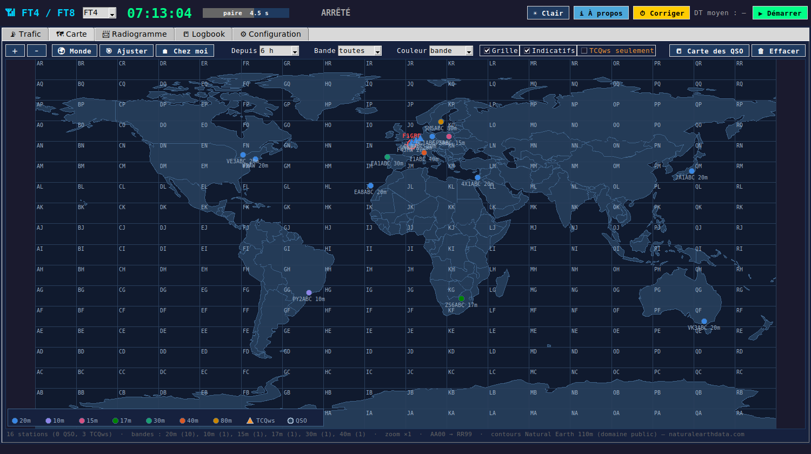

---

## 6. Le journal, enfin modifiable

L'onglet 📒 **Logbook** ouvre `wsjtx_log.adi` en tableau. Un indicatif mal recopié, un locator oublié, un QSO en double, un contact fait sur un autre poste : cela se corrige ici, champ par champ, sans éditeur de texte ni tableur.

Un journal ne se refait pas, d'où trois précautions : rien n'est écrit tant que vous n'avez pas cliqué sur **💾 Enregistrer** ; l'écriture passe par un fichier temporaire remplacé d'un seul bloc et garde la version précédente en `.bak` ; et les QSO que TCQws a logués **pendant** que vous éditiez sont relus et conservés au lieu d'être écrasés.

---

## 7. Décoder plus bas que le seuil habituel

TCQws embarque **deux décodeurs** : celui de `ft8_lib` (FT8) et un **décodeur cohérent FT4** écrit pour TCQ, avec OSD.

Mesures sur bruit blanc, fichiers identiques donnés à TCQws et à `jt9 -d 3` de WSJT-X 2.7.0, 100 essais par point :

| S/B (FT4) | ft8_lib seul | **TCQws (cohérent)** | WSJT-X |
|---|---|---|---|
| −18 dB | 0 % | **32 %** | 23 % |
| −17 dB | 0 % | **87 %** | 72 % |
| −16 dB | 4 % | **96 %** | 91 % |
| **Seuil à 50 %** | ≈ −14,3 dB | **≈ −17,7 dB** | ≈ −17,3 dB |

Et surtout, l'**empilement** (« stacking ») : en réseau d'urgence, une station en difficulté répète son message. TCQws additionne **de façon cohérente** les périodes successives reçues sur la même fréquence :

| Périodes empilées | 1 | 2 | 4 | 8 | 16 |
|---|---|---|---|---|---|
| Seuil à 50 % | ≈ −17,8 dB | ≈ −18,5 dB | ≈ −20,6 dB | ≈ −22,2 dB | **≈ −24,2 dB** |

Avec 16 répétitions (2 à 4 minutes), un message passe **sous le seuil du FT8**, dans la zone de Q65-30 — sans changer de mode ni de matériel. Aucune fausse détection n'est apparue sur 4 000 essais d'empilement de bruit pur, ni sur 600 périodes de bruit en décodage normal.

**En FT8**, le décodeur reste celui de `ft8_lib` : seuil à 50 % d'environ −18,7 dB, contre −20,6 dB pour WSJT-X. C'est le point où WSJT-X garde l'avantage.

---

## 8. Tenir sur le terrain

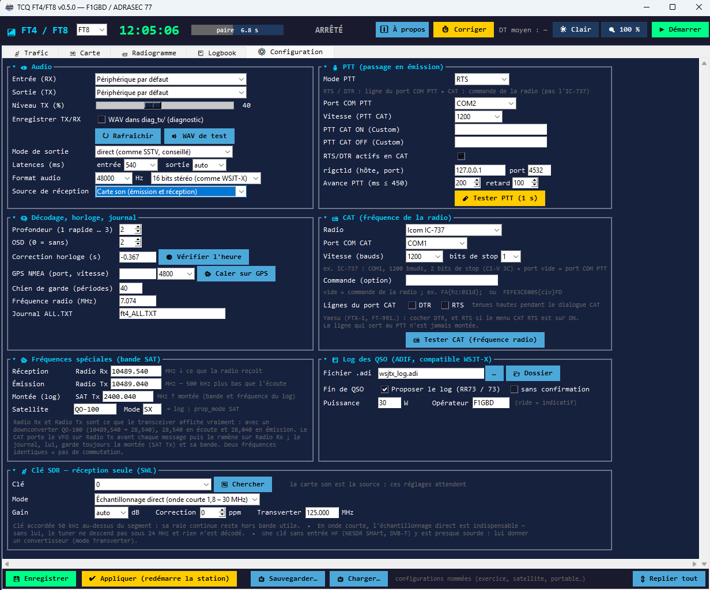

- **Heure** : vérification **NTP** au démarrage et sur demande, correction proposée en un clic, et **calage GPS NMEA** pour le mode blackout (sans Internet). Le journal signale toute station reçue avec un DT anormal, et dit s'il faut corriger une horloge ou une latence.
- **Tolérance d'horloge** : en FT4, TCQws décode de **−2 à +2 s** de DT, là où WSJT-X s'arrête vers ±1 s. Deux postes mal synchronisés continuent de se lire — le temps de corriger.
- **PTT et CAT séparés** : PTT par RTS, DTR, CAT, rigctld ou VOX sur un port, **fréquence par CAT sur un autre port** (vitesse et bits de stop propres). Les transceivers anciens, comme l'IC-737 (CI-V sans commande d'émission, 1200 bauds, 2 bits de stop), fonctionnent tels quels.
- **Boutons de bande** ADRASEC, SAT, 80 → 10 m : la radio se règle par CAT, la fréquence suit le mode FT4/FT8, chaque bouton se modifie au clic droit. Le bouton **ADRASEC** porte la fréquence du réseau départemental — 7,084 MHz par défaut —, et chaque trait de période de l'activité de bande rappelle la bande et la fréquence sur lesquelles elle a été reçue.
- **Audio maîtrisé** : sortie 48 kHz 16 bits stéréo comme WSJT-X, latences réglables, et **enregistrement WAV de chaque émission et de chaque réception** pour diagnostiquer une chaîne audio douteuse au lieu de la deviner.
- **Thème clair ou sombre**, d'un bouton : le thème clair pour un écran en plein jour, sous une tente ou en vidéoprojection, le sombre pour la veille de nuit. La chute d'eau reste sur fond noir dans les deux cas.
- **Mise à jour vérifiée depuis l'application** : le bouton « ⭯ Vérifier la mise à jour » de la fenêtre « À propos » compare la version installée à la dernière publiée et propose le téléchargement. Sans Internet, il le dit et n'insiste pas.
- **Un seul exécutable**, sans installation ni service, et un mode **`--demo`** avec bande simulée pour se former sans radio.

---

## 9. Le trafic de tous les jours

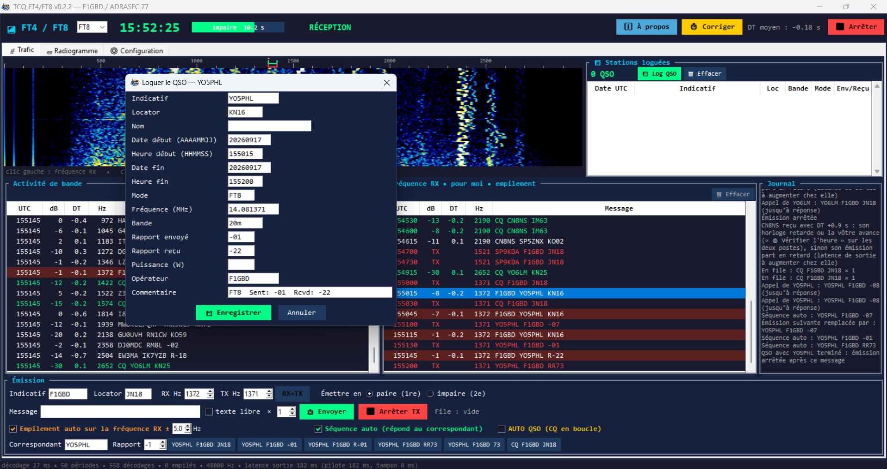

- **AUTO QSO** : TCQws répond seul aux CQ reçus (la station la plus forte, pas encore contactée sur la bande et le mode), mène le QSO, l'enregistre, puis se remet à l'écoute. Les CQ dirigés vers une zone sont ignorés, les CQ d'activité (POTA, SOTA, WWFF…) non.
- **Log ADIF** `wsjtx_log.adi` au format de WSJT-X : importable dans Log4OM, JTAlert, TQSL/LoTW, Club Log, QRZ… ou ajouté directement au log existant de WSJT-X.
- **Indicatifs spéciaux et portables** (`TM50SC`, `F1GBD/P`) gérés comme dans WSJT-X, y compris le cas où WSJT-X ne peut pas transmettre de rapport.
- **CQ POTA / SOTA / IOTA / WWFF…** par un champ dédié.
- **Pays et distance** affichés directement dans l'activité de bande (calculés depuis votre locator), et **filtre d'exclusion par pays** pour écarter d'un coup une zone qui sature la bande — à l'affichage comme en réponse automatique. C'est **tout le QSO** qui disparaît, pas seulement les appels de la station exclue : ce que son correspondant lui répond porte son indicatif et encombrerait la liste tout autant. Un appel qui vous est adressé par un pays exclu est écarté lui aussi — exclure un pays, c'est refuser de l'entendre *et* de le travailler.
- **Journal `ALL.TXT`** au format WSJT-X, et double-clic qui passe en émission comme dans WSJT-X.
- **📶 TUNE** : une porteuse pure, PTT fermé, pour régler une antenne ou un coupleur — rampes de 20 ms, émission normale suspendue, et arrêt de sécurité au bout de deux minutes.

---

## 10. Écouter sans transceiver — la clé SDR (SWL)

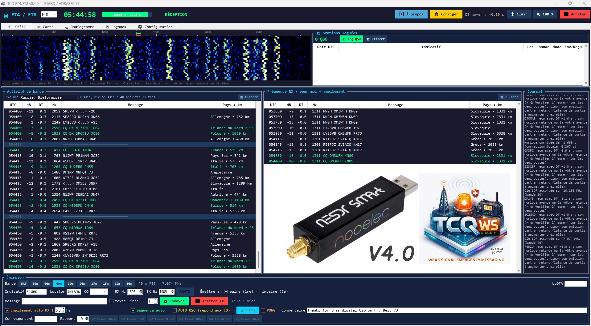

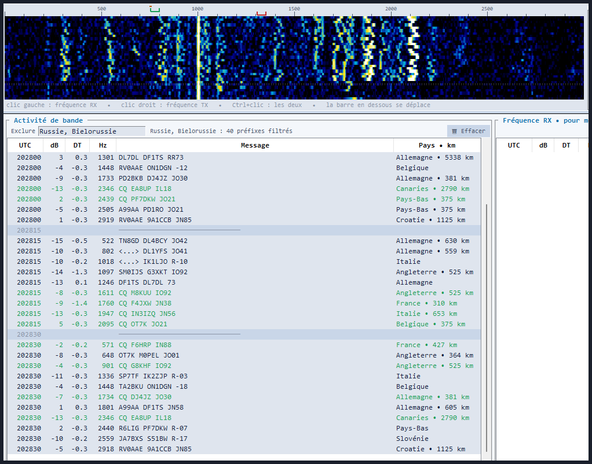

*40 m en FT8, reçu par une clé RTL-SDR à 7,074 MHz : 45 décodages en trois périodes, jusqu'aux Canaries à 2790 km. Ni transceiver, ni carte son.*

Une clé **RTL-SDR** à vingt euros suffit à recevoir le réseau : pas de transceiver, pas de carte son, pas de câblage audio. C'est fait pour les **SWL** — l'écouteur en formation qui n'a pas encore d'indicatif, le poste d'écoute d'un exercice, le PC qui surveille un segment dans un coin de la salle radio — et, sur une station équipée, pour un deuxième récepteur qui tourne pendant que le transceiver fait autre chose.

Onglet **Configuration**, cadre *Audio* : **Source de réception → Clé SDR RTL-SDR (réception seule — SWL)**. Le cadre **📡 Clé SDR** s'active, **🔄 Chercher** liste les clés branchées, et les boutons de bande de l'onglet Trafic réaccordent la clé comme ils commandent un transceiver en CAT.

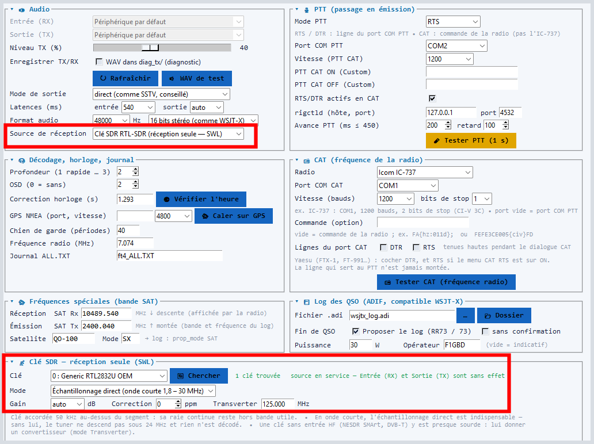

**Une clé SDR n'est pas une carte son.** Windows ne l'expose pas comme périphérique audio : TCQws lui parle directement en USB et fabrique l'audio lui-même. Elle n'apparaîtra donc jamais dans la liste *Entrée (RX)* — en mode clé, *Entrée (RX)* et *Sortie (TX)* sont d'ailleurs grisées.

**Réception seule** : une clé ne transmet pas. Tx1 à Tx6 et PING sont grisés, AUTO QSO et PONG décochés. Le décodage, lui, est complet : activité, chute d'eau, carte, journal, radiogrammes reçus, alerte FLASH.

### Le pilote : Zadig, et la vérification qui évite l'accident

La clé doit utiliser le pilote **WinUSB**, et non le pilote DVB-T que Windows installe tout seul. L'outil est **Zadig** — Nooelec le distribue directement sous le nom *NESDR Driver Installer* ([guide de démarrage NESDR](https://www.nooelec.com/store/qs/)).

1. Brancher la clé, puis lancer Zadig (ou le *NESDR Driver Installer*).
2. Menu **Options → List All Devices**.
3. Choisir la clé dans la liste déroulante. Le nom varie selon les modèles : **NESDR SMArt**, **Bulk-In, Interface (Interface 0)** ou **RTL2838UHIDIR**.
4. ⚠ **Vérifier l'USB ID : il doit être `0BDA 2838` ou `0BDA 2832`.** S'il ne correspond pas, **ne pas continuer** : Zadig liste *tous* les périphériques USB, et remplacer le pilote d'une souris, d'un clavier ou d'un disque le rendrait inutilisable.
5. Cible : **WinUSB**. Cliquer sur **Install Driver** / **Replace Driver**.

Si la clé n'apparaît pas dans la liste, décocher **Ignore Hubs or Composite Parents** dans le menu Options.

Après cela, la clé figure dans le gestionnaire de périphériques sous « Périphériques Universal Serial Bus ». Une clé ne se partage pas : si un autre logiciel SDR la tient ouverte, le fermer d'abord.

### Deux réglages qui décident si ça marche

- **Échantillonnage direct** (mode par défaut) : le tuner d'une clé RTL-SDR ne descend pas sous 24 MHz. Sans ce mode, **rien n'est décodé en onde courte** alors que la clé a l'air de fonctionner. C'est le mode des **RTL-SDR Blog V3**, dont l'antenne se branche sur l'entrée HF/Direct.
- **Clés sans entrée HF** — Nooelec **NESDR SMArt**, clés DVB-T ordinaires : elles acceptent l'échantillonnage direct, mais leur étage d'entrée coupe l'onde courte et elles y sont presque sourdes. Leur donner un convertisseur (*Ham It Up* ou équivalent) et choisir le mode **Transverter** avec sa fréquence — elles redeviennent alors d'excellents récepteurs HF. En VHF/UHF, le mode *Tuner normal* leur va directement.

La clé n'est jamais accordée sur le segment écouté : TCQws la cale **50 kHz au-dessus** et redescend en numérique, pour que sa raie continue et son bruit en 1/f restent hors de la bande utile.

### Si la clé n'est pas trouvée

TCQws distingue les trois pannes qui donnent pourtant le même écran vide, et donne pour chacune la marche à suivre : **module Python absent**, **bibliothèques absentes**, **pilote Windows qui n'est pas WinUSB**. Il affiche aussi le chemin de l'interpréteur qui le fait tourner — sous Windows, `pip` et `python` désignent très souvent deux Python différents, et `pip install` réussit alors ailleurs pendant que le programme continue de ne rien voir.

---

## 11. Le mode JTTY — du texte libre, quand on veut


**JTTY** est le mode asynchrone de WSJT-X 3.2 : ni période de 15 s, ni parité, ni message à cases. On tape une ligne, on appuie sur Entrée, cela part ; ce qui arrive se déroule au-dessus. Il se trafique **comme la RTTY**, et c'est pourquoi il a son **onglet 📻 JTTY**, séparé de l'onglet Trafic.

> ⚠ **Mode expérimental.** Le modem est vérifié contre les sources de WSJT-X 3.2.0-rc1, et les premiers QSO sont faits sur 20 m — mais JTTY n'est encore trafiqué que par une poignée de stations, et le protocole lui-même peut changer d'ici la sortie de WSJT-X 3.2. **Pour un exercice, on reste au FT4/FT8.** FT4/FT8 et JTTY ne tournent pas en même temps : une seule carte son à la fois.

- **Le signal** : quatre tons espacés de 31,25 Hz, lissage gaussien BT = 2, **31,25 bauds**, trame de 59 symboles en **1,888 s**, **127 Hz** occupés. CRC-12 et code convolutif *tail-biting* de contrainte 10, décodés par **Viterbi circulaire à liste (WAVA)** avec addition cohérente par blocs : **sensibilité mesurée à −16 dB** dans 2 500 Hz, pour une limite théorique de −17 dB.
- **La réception** tourne en continu sur une fenêtre glissante. Le message s'affiche **trame après trame**, et une trame perdue au milieu laisse un trou marqué `…` au lieu de couper la phrase en deux.
- **L'émission** part tout de suite ; la file d'attente permet de taper la suite pendant que le message précédent sort.
- **Ce qu'on peut écrire** : toute la grammaire de WSJT-X — indicatifs, séries, zones CQ et ITU, états et provinces, sections ARRL/RAC, préfixes, locators, classes Field Day, heure, phrases de service, texte libre. TCQws découpe le message dans **le plus petit nombre de trames possible**, et trois profils d'échange (courant, Field Day, RTTY Roundup) adaptent ce découpage.
- **Le QSO se mène tout seul** : un **double-clic** sur la station choisie enchaîne la séquence programmée jusqu'au 73 et **enregistre le QSO au log ADIF** (`MODE=MFSK`, `SUBMODE=JTTY`). Trois styles au choix — *WSJT-X* (les macros d'origine, les plus économes en trames), *DE (clavier)*, *Concours* — et un numéro de série qui avance à chaque QSO fait.
- **🔁 AUTO CQ** appelle, mène le QSO de la station qui répond, le logue, puis se remet à appeler. **🤖 AUTO QSO** fait l'inverse : il chasse le CQ le plus fort et passe à la suivante. Les deux **écoutent avant de parler** — en asynchrone, rien n'empêche techniquement d'émettre sur la réponse de son correspondant, rien sauf le bon sens.
- **Le champ *Exclure*** de l'onglet Trafic vaut aussi pour le JTTY : une seule liste de pays pour les trois modes.
- **L'onglet** reprend les habitudes de la RTTY : **touches F1 à F8** modifiables (`%M` mon indicatif, `%H` le DX, `%E` mon échange, `%L` mon locator, `%Q` le premier appelant), **file d'appel** alimentée toute seule, **double-clic** sur un indicatif reçu pour le prendre comme DX, **chute d'eau** cliquable, **boutons de bande** 160 m à 2 m aux fréquences JTTY avec envoi CAT.


### Les trois outils repris de la Station CW de TCQ *(v0.7.0)*

**📨 Radiogramme ACP 127 OTAN.** Le formulaire de la Station CW, porté au JTTY : priorité (R, P, O, Z), destinataire, numéro, DTG en UTC, texte et compte des groupes. L'en-tête `RGRAM` déclenche la détection chez le destinataire — **un radiogramme émis en CW se lit en JTTY, et réciproquement**, c'est vérifié contre l'analyseur de la Station CW lui-même.

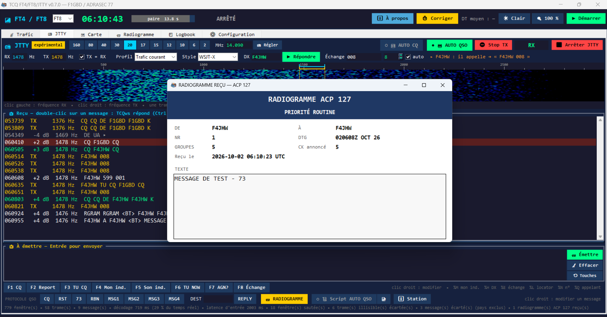

> Un message JTTY tient dans **16 trames et 80 caractères** ; un radiogramme en fait plusieurs centaines. TCQws le découpe **sur les espaces**, jamais au milieu d'un groupe, et annonce avant d'émettre ce que cela va coûter : *« 4 morceaux JTTY · 30 trames · 57 s sur l'air »*.
>
> **Depuis la v0.7.1, le radiogramme est compact.** L'ACP 127 en morse double les indicatifs et redit le compte de groupes parce qu'un opérateur CW lit à l'oreille, sans filet. En JTTY chaque trame porte un CRC-12 : elle arrive juste ou elle n'arrive pas, et répéter ne protège plus rien. Seul l'en-tête `RGRAM` reste doublé : il tombe sur deux trames différentes, et un radiogramme non *détecté* ne déclenche pas l'alarme.

À la réception, rien à régler : **trois bips** retentissent et le **formulaire** s'ouvre — noir sur blanc, parce que c'est un document qui s'imprime et s'agrafe à la main courante.

**🎛 Protocole QSO.** Une rangée de huit boutons sous les touches F1 à F8 — **CQ · RST · 73 · RBN · MSG1–MSG4** — avec un champ **DEST** et un bouton **REPLY**. Ce sont les phrases entières de la CW, avec ses variables : `{mycall}` `{remote}` `{name}` `{qth}` `{locator}` `{rig}` `{antenna}` `{power}`. Les deux jeux cohabitent parce qu'ils ne servent pas au même trafic : **F1–F8** pour le concours et le DX, **PROTOCOLE QSO** pour la conversation et le réseau ADRASEC.

**📜 Script QSO Auto — métalangage MTL.** Un QSO complet décrit en sept commandes : `TX:` émet, `RX:` attend un motif, `WAIT:` fixe le délai, `EXTRACT_CALL:` et `EXTRACT_RST:` relèvent l'indicatif et le report, `LOG:` enregistre, `LOOP:` repart. L'éditeur **vérifie le script en direct** — commande inconnue, variable qui n'existe pas, message trop long, script qui n'émet jamais — et un script fautif ne démarre pas. Le fichier `jtty_script_def.json` s'échange entre opérateurs et entre les deux modes.

**🗣 Répondre à chacun dans sa langue** *(v0.7.1)*. Deux styles s'ajoutent au menu : **RTTY**, qui mène le QSO automatique avec **les messages du protocole QSO** — un clic droit sur RST change donc ce que l'AUTO QSO raconte, nom et QTH compris — et **Auto (RTTY ⇄ WSJT-X)**, qui tranche au vu du CQ reçu. Un `DE` entre deux indicatifs, ou un prosigne de fin (`K`, `<KN>`, `<AR>`), et c'est de la RTTY ; sinon c'est du WSJT-X — la grammaire JTTY de WSJT-X ne produit jamais ces marques.

```
CQ CQ DE 9A5CW 9A5CW K   →  9A5CW DE F1GBD RST 599 599 <BT> NAME JL <BT> QTH MELUN <BT> K
CQ DL4DBM JO31           →  DL4DBM F1GBD 599 004
```

Le style est retenu pour **toute la durée du QSO** : changer de langue en cours de contact serait pire que de se tromper au départ.

**⏱ On n'envoie pas son pedigree à qui ne nous a pas entendus** *(v0.7.2)*. Relevé sur l'air le 2 octobre : TCQws répondait au CQ d'EA8ATE par le message RST complet — 23 secondes — et l'a répété trois fois à une station qui ne l'avait pas entendu. On répond maintenant comme en RTTY réelle : **son seul indicatif, 9 secondes**. Le report, le nom et le QTH partent à l'étape suivante, quand il y a quelqu'un en face pour les lire.

| | avant | après |
|---|---|---|
| Réponse à un CQ | 12 trames, 23 s | **5 trames, 9 s** |
| Trois appels sans réponse | 36 trames, 1 min 08 s | **15 trames, 28 s** |
| Message RST complet | 12 trames | **9 trames** |
| Clôture | 12 trames | **7 trames** |

Au passage, les **`<BT>` et les crochets des prosignes disparaissent** des messages de QSO : un `<BT>` coûte deux trames et ne sépare rien que l'œil ne voie déjà sur la ligne. Seul le radiogramme ACP 127 les garde — là, ils délimitent le corps du message et ferment la détection, et c'est sur ces chaînes exactes que l'analyseur de la Station CW découpe.

### 📻 Le RTTY, dans le même onglet *(v0.7.5)*

Le titre de l'onglet est devenu un bouton. Un clic, et `📻 JTTY` devient `📻 RTTY` : la station redémarre, et vous trafiquez en **Baudot — 45,45 bauds, shift de 170 Hz**, celui que tout le monde pratique depuis soixante ans.

| | JTTY | RTTY |
|---|---|---|
| Modem | 4-GFSK, 31,25 bauds, 127 Hz | 2-FSK Baudot, 45,45 bauds, shift 170 Hz |
| Seuil de décodage *(mesuré)* | **− 16 dB** | − 4 dB |
| QSO de cinq messages | 64 s | **33 s** |
| Longueur d'un message | 16 trames **et** 80 caractères | **aucune limite** |
| Correspondants | quelques dizaines | tout le monde, depuis 1950 |

**Ce qui ne change pas en basculant** — et c'était tout l'intérêt : les huit touches du PROTOCOLE QSO, le **radiogramme ACP 127** avec ses morceaux numérotés et ses accusés, le métalangage **MTL**, le log ADIF, **AUTO CQ** et **AUTO QSO**, la file d'appel, les pays exclus, le dégagement ADRASEC. Aucune de ces fonctions ne sait de quel modem elle vient : elles ne connaissent que du texte.

**🎯 L'accrochage automatique.** Un signal JTTY se cherche tout seul ; un signal RTTY, il faut se poser dessus. Le bouton 🎯 trouve les deux raies et s'y pose à deux ou trois hertz près — et ce n'est pas un luxe : **un décalage de quinze hertz fait passer le taux d'erreur de 0 % à 31 %**, bien avant que le bruit n'y soit pour quelque chose.

**Le modem, mesuré au banc** : décodage sans faute jusqu'à **− 4 dB**, effondrement à − 5 — à un décibel près la valeur publiée depuis des décennies. Tolérance d'horloge de ± 8 %, shifts 170 / 425 / 850 Hz, bande latérale inversée détectée. Plusieurs raffinements ont été essayés puis **retirés faute de gain mesurable** : il n'y a pas de marge cachée à aller chercher dans un décodeur RTTY.

> **Le piège du Baudot, vu dès la première réception.** 20 m, 2 octobre 2026 : une station appelant `CQ URC KW4CW KW4CW`, dont l'indicatif ressortait tantôt juste, tantôt `KW4:2`. Pour écrire `KW4CW` il faut **deux bascules de registre** ; perdez celle du retour aux lettres, et le `CW` sort en chiffres. **Rien ne le signale** — c'est un indicatif qui est faux. En JTTY, le CRC de la trame l'aurait rejetée. C'est exactement l'arbitrage que détaille la fiche **[FT-202](doc/FICHE_TECHNIQUE_TCQws_RTTY_vs_JTTY.pdf)**.

📄 **[Fiche technique FT-202 — Le RTTY classique et le JTTY](doc/FICHE_TECHNIQUE_TCQws_RTTY_vs_JTTY.pdf)** : signal, sensibilité, débit utile, intégrité du message, radiogramme, automatisation — et un chapitre entier sur *ce que le RTTY fait mieux*.

### 📨 Le radiogramme en présence de trafic *(v0.7.3)*

Relevé sur l'air le 2 octobre, entre 09h12 et 09h21, avec PA3AGN, IW0EFI et OE6VIE actifs sur la même tranche de bande. F4JHW a passé **quatre** radiogrammes. TCQws en a affiché **deux**, et tous deux étaient faux :

```
091247  +10 dB  1056 Hz  RGRAM RGRAM NR 3 R CK 6 … DE F4JHW A F1GBD <BT> MESSAGE DE
091308  +12 dB  1479 Hz  PA3AGN 599 001
091359  +10 dB  1057 Hz  M NR 4 R CK 6 … DE F4JHW A
091426   +9 dB  1057 Hz  EST OK <SK>

  → « MESSAGE DE PA3AGN 599 001 M NR 4 R CK 6 … EST OK »
```

Le détecteur tenait **un seul accumulateur pour toute la bande** : il ouvrait sur `RGRAM` et avalait tout jusqu'au `<SK>`, le trafic des voisins compris. Les deux autres radiogrammes n'ont jamais été affichés — ils avaient été absorbés par le précédent. Aucune répétition demandée, aucun accusé envoyé.

**Chaque radiogramme suit désormais sa propre piste**, repérée par son numéro et par la fréquence audio de l'émetteur — à 50 Hz près, là où une trame JTTY en occupe 127. Le même relevé rejoué rend les quatre radiogrammes, **sans un mot de trafic étranger** ; c'est devenu un essai permanent de la suite de vérification.

**Et chaque morceau porte son rang**, ce qui change trois choses d'un coup :

```
1/4   9 trames   RGRAM RGRAM DE F1GBD R12.1/4 A F4JHW NR 12 P
2/4   8 trames   R12.2 CK 10 021545Z OCT 26 <BT> EXERCICE
3/4   8 trames   R12.3 SATER 77 EQUIPE ALPHA EN PLACE
4/4   5 trames   R12.4 POINT KILO RAS <SK>
```

| | avant | après |
|---|---|---|
| Un morceau émis par le voisin | recollé dans le radiogramme | n'a pas le bon numéro : **il n'entre pas** |
| Un morceau perdu | compte de groupes faux, cause inconnue | **nommé** : « morceau 2 manquant sur 4 » |
| Le renvoi | tout le radiogramme, 25 à 56 trames | **le seul morceau réclamé — 9 trames, 17 s** |
| Un `<SK>` perdu | radiogramme jamais affiché | le dernier morceau annonce qu'il est le dernier |

**L'accusé de réception part tout seul.** Complet et adressé à nous → `F4JHW DE F1GBD QSL NR 9 <SK>`, six trames, onze secondes. Amputé → `F4JHW DE F1GBD RPT NR 9 2 4 <SK>`, et seuls les morceaux réclamés repartent de l'autre côté, avec leur marqueur d'origine, donc ils se remettent à leur place. Trois détails qui comptent sur l'air : l'accusé part **sur la fréquence du radiogramme** (le 2 octobre, une demande de répétition est partie sur 1529 Hz pendant que F4JHW écoutait sur 1057) ; il **attend un blanc**, pour ne pas écraser le morceau qu'il réclame ; et il s'arrête après **deux demandes**, pour que deux stations ne s'épuisent pas l'une l'autre.

**L'identification passe en tête.** Un second relevé, à 09h56, montrait l'autre moitié du problème : d'un premier morceau de 14 trames, **quatre** sont arrivées — et comme l'ACP 127 place les indicatifs après l'heure de dépôt, tout ce qui identifiait le message était dans les dix trames perdues. Formulaire vide, et pas même de quoi adresser une demande. Les morceaux sont donc plafonnés à **10 trames**, et l'expéditeur est nommé dès la **quatrième**.

Deux cases dans la fenêtre RADIOGRAMME, cochées par défaut : *Accuser réception et redemander les morceaux manquants automatiquement* — à décocher en écoute discrète — et *Morceaux numérotés* — à décocher pour un correspondant qui relève **au casque en morse**, dont le logiciel compterait les marqueurs parmi les groupes du CK. Décochée, la forme émise redevient **mot pour mot** celle de la Station CW, vérifié contre son analyseur réel.

**Un seul automatisme à la fois.** Le script, AUTO CQ et AUTO QSO s'excluent, et **⛔ Stop TX arrête tout**, script compris. Trois choses qui émettent seules sur la même fréquence, c'est deux de trop.

📄 **[Fiche technique FT-201 — MTL et radiogramme ACP 127](doc/FICHE_TECHNIQUE_TCQws_MTL_ACP127.pdf)** : les sept commandes, les dix variables, cinq scripts vérifiés prêts à l'emploi, et les fiches réflexes à détacher.

---

## 12. Sur téléphone et tablette — TCQws Android

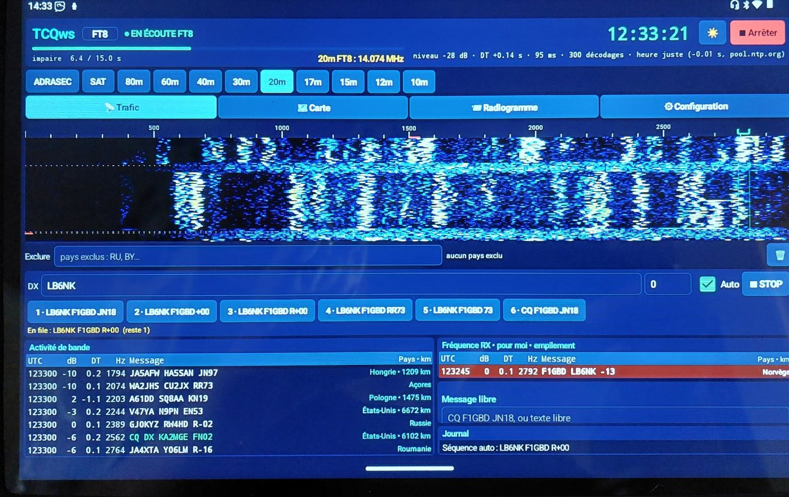

**TCQws Android** est la même station, dans la poche. Ce n'est pas une réécriture : le cœur de l'application Android est **le code même de TCQws PC**, embarqué tel quel. Les messages, les radiogrammes, l'alerte FLASH et le code CHAPPE-26 passent donc **au bit près** d'un PC à un téléphone, dans les deux sens.

- **Trafic complet** : réception et émission FT4 / FT8, séquence auto, **AUTO QSO**, PING / PONG, log ADIF exportable.
- **Radiogrammes et alerte FLASH** : rédaction, AUTH, accusé de réception ; à la réception d'une alerte, **le téléphone sonne même écran éteint**, en poche.
- **Un seul câble USB** vers la radio : le son, le **CAT** et le **PTT** (RTS, DTR, CAT, VOX ou rigctld), sans pilote à installer — SCU-17, Digirig, radios Icom et Yaesu en USB direct, câbles FTDI et CH340.
- **Terrain** : heure vérifiée par NTP, carte hors ligne des stations entendues, bande SAT avec commutation du VFO, présentation adaptée à la tablette comme au téléphone.

Essais de trafic réalisés avec un Yaesu FT-891 et une SCU-17 sur tablette Android. **[→ README TCQws Android](android/README.md)** : installation, raccordement de la radio, réglages.

---

## Ce que WSJT-X fait mieux

Par honnêteté, et parce que les deux logiciels sont complémentaires :

- **Beaucoup plus de modes** : JT65, Q65, WSPR, MSK144, FST4, EME… TCQws ne fait que FT4 et FT8.
- **Décodage FT8 plus sensible** (≈ 2 dB), grâce à des techniques de décodage multi-passes et *a priori* que TCQws n'implémente pas.
- **Écosystème** : PSK Reporter, JTAlert, cartes, concours, traductions, multi-plateforme, et une communauté considérable.
- **Maturité** : des années d'essais sur l'air, sur toutes les bandes et tous les continents.

TCQws n'a pas vocation à remplacer WSJT-X sur une station de trafic. Il est fait pour le poste ADRASEC, en exercice ou en opération — et rien n'empêche d'avoir les deux sur le même PC.

---

## Installation et premiers pas

### Programme d'installation (le plus simple)

Télécharger **`TCQws-x.y.z-setup.exe`** dans la dernière [release `tcqws-v…`](https://github.com/f1gbd/F1GBD/releases?q=tcqws) et le lancer. Aucun droit administrateur n'est demandé : l'installation se fait dans votre profil, avec les raccourcis (dont un raccourci **démonstration**) et le manuel. La désinstallation retire le programme et **conserve** vos réglages, votre log ADIF, votre journal et vos radiogrammes.

### Installation automatique par script

Pour déployer ou mettre à jour plusieurs postes sans cliquer, une commande PowerShell **en administrateur** :

```powershell
iwr https://github.com/f1gbd/F1GBD/raw/master/tcqws/Install-TCQws.ps1 -OutFile $env:TEMP\Install-TCQws.ps1
& $env:TEMP\Install-TCQws.ps1
```

Le script prend la dernière release **TCQws** (tag `tcqws-v…`), vérifie le SHA-256, installe dans `C:\TCQws` et crée un raccourci. Lors d'une mise à jour, il **conserve** les réglages (`ft4_config.json`), le log ADIF, le journal `ft4_ALL.TXT` et le dossier `radiogrammes\`. Une installation de **TCQ** existante n'est pas touchée : les deux applications cohabitent.

### Installation manuelle

1. Télécharger `TCQws.7z` dans la dernière [release `tcqws-v…`](https://github.com/f1gbd/F1GBD/releases?q=tcqws), décompresser dans un dossier où l'on peut écrire (par exemple `C:\TCQws`).
2. Lancer **`TCQws.exe`**.
3. Essayer d'abord **sans radio** : `TCQws.exe --demo` (bande simulée, stations automatiques, radiogramme et alerte FLASH d'exercice).
4. Régler l'audio, le PTT, le CAT et l'heure dans l'onglet ⚙ Configuration, puis **💾 Enregistrer** et **✔ Appliquer**.

**Options :** `--demo`, `--sans-accueil`, `--config fichier.json`.

**Fichiers créés à côté de l'exécutable :** `ft4_config.json` (réglages), `ft4_ALL.TXT` (journal), `wsjtx_log.adi` (log ADIF), `radiogrammes\` (messages reçus), `diag_tx\` (WAV de diagnostic).

### Documentation

| Document | Contenu |
|---|---|
| [📖 Manuel de l'utilisateur](doc/MANUEL_TCQws.pdf) | Le mode d'emploi complet, avec exemples d'alerte FLASH et de radiogramme |
| [📘 Livret CHAPPE-26](doc/Chappe26_Livret_B5.pdf) | Les 1000 codes du livre de code civil, format B5 à imprimer en recto/verso |
| [📄 Fiche BLACK-OUT](doc/TCQws-Chappe26_Fiche_BlackOut.pdf) | Un message CHAPPE-26 de bout en bout, de la frappe à la réception |
| [📊 Fiche topo — performances](doc/FICHE_TOPO_TCQws_performances.pdf) | Seuils de décodage mesurés et positionnement face aux autres modes |
| [📄 Fiche technique FT-201 — MTL et ACP 127](doc/FICHE_TECHNIQUE_TCQws_MTL_ACP127.pdf) | Le métalangage de script et le radiogramme ACP 127 OTAN en JTTY : commandes, variables, scripts prêts à l'emploi, fiches réflexes |
| [📄 Fiche technique FT-202 — Le RTTY classique et le JTTY](doc/FICHE_TECHNIQUE_TCQws_RTTY_vs_JTTY.pdf) | Étude comparative : signal, sensibilité, débit utile, intégrité du message, radiogramme, automatisation — et ce que le RTTY fait mieux |
| [📜 Historique des versions](HISTORIQUE.md) | Les nouveautés de chaque version, de la plus récente à la plus ancienne |
| [📱 TCQws Android](android/README.md) | La version téléphone et tablette : installation, raccordement de la radio, réglages |

Le mode d'emploi est aussi livré avec l'application, dans **`README_TCQws.md`**.

Windows 10/11 64 bits ; TCQws Android : Android 7 ou plus récent, 64 bits (arm64). Ce dépôt publie les **exécutables** ; les sources ne sont pas distribuées.

---

## Licences et crédits

- **TCQws** © 2026 F1GBD — ADRASEC 77 / FNRASEC. Licence : voir `LICENSE`.
- **Protocoles FT4 et FT8** : Joe Taylor K1JT, Steve Franke K9AN, Bill Somerville G4WJS et l'équipe WSJT-X. TCQws est une réalisation indépendante, **non affiliée au projet WSJT-X**, et ne reprend aucun de ses codes.
- **ft8_lib** : Kārlis Goba, YL3JG — licence MIT.
- **Contours de la carte** : **Natural Earth** 110 m (admin_0_countries), jeu de données du **domaine public** — [naturalearthdata.com](https://www.naturalearthdata.com/). Embarqués dans l'exécutable : la carte n'accède jamais au réseau.
- **Composants tiers** : Python, Tk, NumPy, SciPy, PortAudio / sounddevice, pySerial, Pillow, chacun sous sa propre licence.

*L'utilisation de TCQws se fait dans le respect des conditions de la licence radioamateur de l'opérateur. Les fonctions d'urgence (radiogrammes, alerte FLASH) sont destinées aux exercices et aux opérations de sécurité civile encadrées par la FNRASEC.*

<p align="center"><i>73 de F1GBD — ADRASEC 77</i></p>
